# 第十三章：分配安全资源以保护空间


本书的其余部分将专注于一个单一且极具实用性的应用。这个经典应用被称为艺术画廊问题，它有大量的研究可以为我们所用，并涉及如何高效地分配安全资源来保护一个空间。效率是当今安全团队的首要任务：保护的资产总是比保护这些资产的资源要多。在其最宏大的形式下，艺术画廊问题将我们所学习的两大主要学科结合起来：图论和计算几何。因此，这一部分也将代表本书迄今为止最完整的 Python 应用，超越了概念设计，进入了完整软件项目的领域。我们将涉及现代 Python 项目的设计、开发和交付选项，包括图形、分布式计算以及如何将你的应用授权给用户。

本书这一部分的目标是开发一个*最小可行产品（MVP）*，它可以被看作是概念验证的一个进阶版本。如你所见，概念验证证明一个想法值得追求，并定义了未来开发的框架。它通常仅限于实现让想法得以起步所需的基本功能——没有任何多余的附加功能。而 MVP 设计则关注你能开发的最少功能集，以便将一个想法推向市场并“具备竞争力”。通常，这意味着添加像图形用户界面（GUI）以及用户友好的元素，如保存和恢复功能。

没有一套确切的功能组合能够使一个应用程序变得可行，因为这些功能最终是由特定市场用户的期望决定的。例如，在安全市场中，用户已经习惯了像单点登录（SSO）、数据加密、推送通知等功能。这是否意味着在推出一个安全工具之前，你需要开发所有这些功能？绝对不是！要以最简的方式思考，并问自己：“所有与我类似的应用程序都具备哪些功能？”当你为用户开发产品时，可能会很容易想提前预测他们的所有需求，但这种心态既不现实也很昂贵：你往往会解决一些没有人遇到的问题（边缘情况代码），或者开发一些只会让新用户困惑的功能。如果你发布一个只包含少量明确标注功能的产品，你就能获得关于用户实际遇到的问题和他们缺失的便利功能的反馈。迭代改进计划能让你把开发时间集中在那些实际有用的功能上。

现在让我们深入探讨艺术画廊问题，它问的是：“在一个画廊中（由一个*n*顶点的简单多边形表示），需要放置最少的守卫才能确保所有内部点都能被看到？” 这是一个资源规划问题，类似于第九章中的消防站布置问题。一个好的安全人员、检查点和监控设备布置计划可以减少从一开始就需要响应的事件数量。它还可以在发生事件时改善响应时间，从而降低总体风险。不幸的是，安全团队中的人类规划人员通常对问题的理解程度不同，这可能导致计划不当（或实施不当）的安全控制。这就是为什么我总是在寻找自动化我们团队部分规划的方式。

正是在这些搜索过程中，我发现了艺术画廊问题，它解决了我正在研究的那个问题：如何高效地部署安全资源，尤其是对于那些我们称之为“非传统”布局的建筑。如你所见，并非所有的建筑设计都同样适合守卫，因此在深入问题细节之前，我们将先介绍我们计划开发的应用程序的使用案例。然后，我们将准备好开始开发应用程序的核心逻辑。我们会介绍现有的研究，并以最简单的形式展示理论。接下来，我们将定义用于解决问题的两种数据表示，并讨论数据结构。最后，我们将超越基础模型，加入诸如视野和预算限制等高级概念，从而实现更为现实的部署。

## 确定最小守卫人数

我们将使用原始问题陈述作为第一个使用案例：一个用户想知道保护一个非常规楼层平面图所需的最小守卫人数。我们希望所有的守卫一起能够观察整个画廊（在原始问题陈述中，所有的内部点或墙壁）。对于这个使用案例，我们的应用程序需要能够将楼层平面图编码成计算机可以分析的数据格式的功能，以及一个可以执行实际守卫布置的算法。我们将在本章的后续部分介绍这些内容，先介绍一些其他的使用案例。

下一个用例涉及到为安全设施的建筑设计提供参考，可以概括为：用户希望分析建筑物的安全覆盖范围和布局。在建造一个安全设施之前，一些潜在楼层平面的 CAD 草图将通过*建筑信息建模（BIM）*程序进行处理。假设的建筑设计将根据安全难度、紧急出口的通道、无障碍设施（如坡道和电梯）等进行评级。对于这个用例，应用程序需要定义不同类型的安全设备的有效覆盖范围，包括人类警卫、摄像头和其他电子传感器。

当然，这种分析也可以为攻击者提供安全布局的缺陷。每一部盗窃电影中都有一个场景，主角们会摆出目标的蓝图，开始标出无数的安全控制设备，直到他们发现一个漏洞。传感器盲区是这些电影中的常见桥段，但实际上，盲区确实是现实中的一个重要考量。通过观察使用中的警卫和传感器，可以制作出相当准确的覆盖图。寻找盲区通常只是一个简单的搜索模型技术规格文档的过程。像视场角度（通常以度为单位）和有效范围（以英尺或米为单位）这样的信息，告诉你设备不仅可以在哪里检测，还能告诉你它无法检测到哪里！为了支持这个用例，我们正在开发的应用程序将创建一个安全资源如何划分画廊的可视化布局。用户可以检查该布局，查看覆盖范围中的任何空隙。我们还将开发一个求解器，建议可以放置警卫的额外顶点，以实现可自定义的覆盖目标，同时引入距离、视场角和有效范围等概念，以便区分警卫、摄像头、运动传感器等设备。

许多建筑，特别是画廊和博物馆，都是多层建筑，因此我们可以假设使用我们软件的专业人士希望它能够适用于所有楼层平面图。由于项目需要包含多个资产，例如形状数据和楼层平面图本身，因此我们也可以合理推测用户希望有一种方法来备份他们的工作，或者在多个工作会话中恢复工作。我们将在最终的用例中将这些需求整合在一起：用户希望在多个工作会话中规划同一建筑物多个楼层的安全。我们开发的程序将通过创建一组可以序列化、编码并存储在压缩文件中的自定义对象来实现这一目标。我们将把多层建筑的每一层当作独立的 2D 楼层平面图，并将它们归为一个多楼层项目。每一层将包含一张图像，代表用来追踪画廊形状的背景，以及用户添加的所有几何信息。

学习建筑物的蓝图和 CAD 设计是一项非常好的习惯，尤其是对于物理渗透测试人员。仅仅通过了解一个设施的布局并自信地走进去，我就能把自己伪装成建筑物的一部分。毕竟，谁知道“设备间 #2”位于地下层西端，如果不是曾经来过那里的人呢？将对布局的了解与一个文件夹、工具箱或其他看起来像官方道具的物品配对，它通常和建筑通行证一样有效。

现在我们已经有了使用场景，可以开始深入探讨细节。我们先回顾一下原始问题以及过去的一些研究工作。接着，我们将深入讨论解决步骤，并讨论可以添加的额外约束条件，以便根据具体需求定制结果。

## 艺术画廊问题理论

第一个著名的艺术画廊问题定理是由计算机科学家兼教授 Václav Chvátal 于 1973 年提出的。这个问题是由华盛顿大学的数学教授 Victor Klee 提出的：

> 给定一个形状奇特的艺术画廊的平面图，假设它有 *n* 条直边，在最坏情况下，我们需要派遣多少名守卫才能确保每一段墙都能被守卫看到？

*Chvátal AGP 定理* 给出了一个上限，声明：“最多 *n* / 3 名守卫总是足够的，有时甚至是必须的，以覆盖一个具有 *n* 个顶点的多边形。”^(1) Chvátal 在他的证明中假设守卫将被放置在顶点上，但即使放宽守卫只能站在角落的限制，变成“守卫可以在多边形内部的任何地方”，*Chvátal 的上限* 依然成立。这个 3 常数来自于将画廊的形状分解为三角形，基于这样一种推理：你永远只需要每个三角形区域一个守卫。

Chvátal 的工作后来被数学教授 Steve Fisk 简化，他将这个问题简化为一个三色问题，定义如下：“在什么条件下，平面地图的区域可以被三种颜色着色，使得任何两个有共同边界的区域都不会有相同的颜色？”三色问题可以轻松地表示为图形，其中画廊形状的每个顶点构成一个节点，每条边表示两个顶点之间的共享墙段。然后，你可以将问题视为一个 *顶点着色问题*，即相同颜色的两个节点不能通过边直接连接。着色问题的图形版本是分析连通性的一种常用方法，因此 NetworkX 包含了一个已知为 *贪婪着色* 的函数来解决这个问题，我们将在解决方案中利用它。图 11-1 展示了贪婪着色算法的最简单情况。

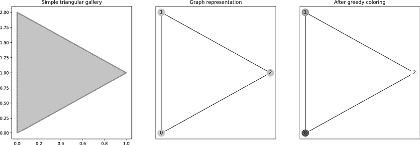

图 11-1：解决最简单的艺术画廊问题

图 11-1 中的最左边图像显示了一个三角形多边形。*n* / 3 = 3 / 3 = 1 的上界意味着我们只需要一个守卫来观察整个内部。中间的图像显示了将三角形转换为图表示的结果。最后，最右边的图像展示了贪心着色算法的结果。正如预期的那样，每个节点都被涂上了不同的颜色，这意味着在这些点中的任何一个放置守卫都能使其观察到所有墙面。这是该过程的核心。为了扩展算法，我们只需要解决一系列相互连接的三角形，正如你在接下来的几节中会看到的几何和图表示一样。

在 2008 年的一篇论文中，Mikael Pålsson 和 Joachim Ståhl 研究了三色算法，并提出了一套替代的“矩形”算法（仅对直角多边形操作），这些算法特别为相机布置而设计。^(2) Pålsson 和 Ståhl 成功解决了 Chvátal 定理的几个实际问题。首先，通过限制自己只使用直角多边形，他们将上界降到了*n* / 4。其次，他们针对相机布置问题，解决了诸如视野有限、有效范围和障碍物等问题，这些问题同样适用于人类守卫和相机。这些附加目标使得布置选择比标准公式更加现实。稍后我们将进一步讨论视野和有效范围。我们还将增加对区域加权的能力，以优先考虑所需的覆盖范围。其他约束条件，比如确保每个相机都能被另一个相机看到（在高安全区域中很常见），不会在此讨论，但确实值得你去研究。

由于使用了直角多边形，Pålsson 和 Ståhl 的方法对于一般的安全布局规划不太实用。任何存在对角线或曲线墙壁的地方都需要多个小矩形来逼近形状。我最喜欢的非传统建筑之一是位于纽约的古根海姆博物馆，展示在图 11-2 中。

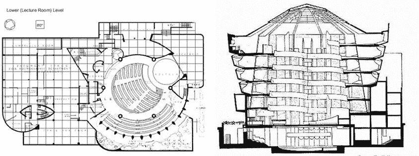

图 11-2：古根海姆博物馆，由 Frank Lloyd Wright 设计（© 2023 Frank Lloyd Wright Foundation。版权所有。由 Artists Rights Society 授权）。

左侧是下层的俯视图，讲座大厅。地面平面图上覆盖的网格代表 8 平方英尺。如你所见，在圆形墙壁附近和对角线墙壁附近，方格在某些地方被切断。这些地方是纯直角方法会遇到困难的区域。右侧则展示了博物馆的横截面，显示了贯穿大部分建筑的圆形结构。这为建筑带来了美丽的外观，但也使得用直角多边形绘制博物馆地图变得困难。

为了克服正交方法的缺点，我们将允许用户直接在建筑物平面图的图像上绘制一个或多个复杂的多边形。我们将把每个单独的多边形视为需要防护的独立区域，类似于原始问题定义。每个多边形将通过一种修改过的三角形镶嵌方法进行细分，称为约束德劳内三角剖分。然后，我们将把镶嵌后的几何形状转换成一个无权图，可以使用 NetworkX 中的贪心着色算法来求解。这个过程允许用户输入像古根海姆博物馆那样不规则的平面图，并在遵循现实资源限制的同时，求解出各种潜在的场景。

## 画廊的几何和图形表示

现在，让我们考虑如何将画廊空间表示为一个`Polygon`对象，就像我们在第七章中表示公园一样。图 11-3 展示了一个示例画廊。

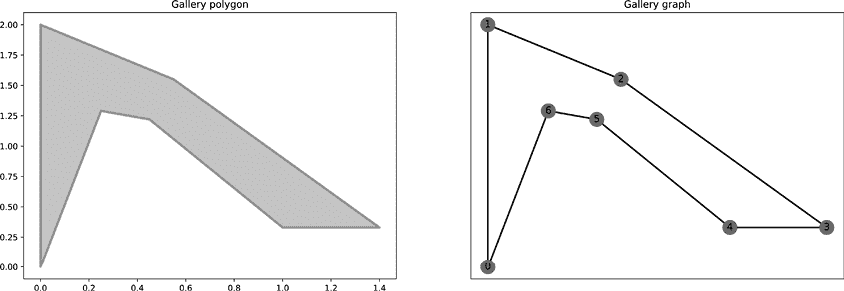

图 11-3：用多边形和图形表示画廊

左侧是多边形，灰色区域表示画廊的内部。右侧是将形状转换为简单的 NetworkX 图的结果。你可以有多种方式将`Polygon`中的信息转换为图形，但最简单的选项通常是迭代`Polygon`外部的顶点，如清单 11-1 所示。

```
from shapely.geometry import Polygon, Point
import networkx as nx
import triangle as tr
❶ gallery_poly = Polygon([
    (0, 0), (0, 2), (0.55, 1.55), (1.4, 0.33),
    (1, 0.33), (0.45, 1.22), (0.25, 1.29)
    ])
gallery_coords = gallery_poly.exterior.coords[:-1]
G = nx.Graph()
❷ G.add_node( 0, coords=gallery_coords[0])
❸ pos = [list(gallery_coords[0])]
❹ for i in range(1, len(gallery_coords)):
    p = gallery_coords[i] 
    pos.append(p)
  ❺ G.add_edge(i-1, i)
  ❻ G.nodes[i]["coords"] = p
    if i == len(gallery_coords)-1:
      ❼ G.add_edge(i, 0)
```

清单 11-1：创建画廊表示

在清单 11-1 中，我们首先通过传入顶点列表来定义画廊的`Polygon` ❶，如之前所示。然后，我们添加第一个节点，表示坐标列表中索引为 0 的顶点 ❷。图中的每个节点都通过其在顶点列表中的索引来键入，以帮助保持这两种表示的逻辑关联。第一个点作为形状的锚点，使得创建边变得更加容易——我们稍后将完成这一步。然后，在此之前，我们必须将坐标添加到一个名为`pos` ❸的位置列表中，这样可以更方便地展示图形，使其与多边形的形状匹配。接下来，我们遍历剩余的顶点 ❹，完成图的构建。对于每个剩余的顶点，我们在之前定义的节点`i-1`和当前节点`i`之间添加一条边 ❺。添加边会创建节点*V*[(][*i*][)]，并在一行中添加边*E*[(][*i*] [– 1,][*i*][)]。将顶点的坐标信息存储为节点的元数据，可以作为比`pos`列表更灵活的替代方式。我们将通过在`coords`参数中传递坐标来实现 ❻。最后，如果`i`等于最后一个索引，说明该是时候在最后一个定义的节点与锚节点（索引为 0）之间创建最后的闭合边了 ❼。

现在我们有了生成画廊两种表示方法的方法，让我们详细介绍如何求解艺术画廊问题的过程。

## 保护画廊

我们已经涵盖了艺术画廊问题（AGP）算法的开始部分，该部分创建了我们将要使用的两个基本数据结构。接下来的步骤是将几何形状切割成三角形，并将生成的边添加到图形表示中。记住，对其中一个表示所做的任何更改也需要在另一个表示中完成，以保持它们的逻辑等价性。与我们在第七章中使用的 Shapely `triangulate`函数不同，我们将使用一个专门构建的包装库，名为 Triangle。底层应用程序是一个基于 C 的程序，也叫做 Triangle，由乔纳森·谢吴奇克教授创建。^(3)选择 Triangle 而非 Shapely 有多个原因。首先，Shapely 版本执行的是所谓的德劳内（三角剖分），在其纯粹形式中并不尊重边界；而 Triangle 库执行的是*约束*德劳内三角剖分，能够尊重边界。列表 11-2 展示了切割画廊多边形的代码。

```
tri_dict = {
    "vertices": gallery_poly.exterior.coords[:-1],
    "segments": list(G.edges())
}
triangulated = triangulate(tri_dict, "pe")
```

列表 11-2：使用 Triangle 库执行三角剖分

`triangulate`函数期望接收一个包含两个必需键的字典。`vertices`键包含形状外部的坐标。`segments`键包含在执行切割时应强制执行的边。我们将字典作为第一个参数传递给`triangulate`函数。第二个可选参数是一个字符串，包含传递给底层应用程序的设置。配置标志有很多，你可以在字符串中传递多个参数。`p`标志告诉库将形状视为*平面直线图*。`e`标志告诉库将边列表作为结果的一部分返回。包含边列表可以节省我们更新图形表示的一步，因为我们可以简单地将结果中的边与图形中的边进行比较，添加任何缺失的边。

`triangulate`函数返回一个字典。它包括一个名为`vertices`的列表，该列表根据每个顶点在此列表中的位置设置每个顶点的 ID。在解码其余输出时，我们将需要这个信息。我们目前感兴趣的另外两个键是`triangles`键，它包含一个表示构成每个三角形的三个点的三元组列表，以及`edges`键，它包含三角化结果中所有的边列表。`triangles`和`edges`都使用节点 ID 来表示顶点，因此三角形表中的一个条目如`[6, 1, 0]`意味着第六、第一和零号顶点组成一个三角形。如果你再次查看图 11-3 右侧的图形表示，你会看到从节点 6 到节点 1 的边(*E*[(6,1)])确实和节点 0 形成一个三角形。`edges`列表包含所有原始边以及构成三角形所需的所有附加边（就像前面提到的边*E*[(6,1)]）。你可以使用`edges`列表或`triangles`列表来更新图形表示。Jupyter notebook 中有一个使用`triangles`列表的示例，但我在列表 11-3 中的代码选择了`edges`列表，因为它更简洁。

```
G2 = G.copy()
for e in triangulated["edges"]:
    if list(e) not in list(G2.edges()):
        G2.add_edge(e[0], e[1])
```

列表 11-3：更新画廊表示

首先，我们创建一个原始图形*G*的副本进行处理。我们遍历三角化结果中的`edges`列表。对于每一条边，我们检查它是否已经存在于*G*[2]的边列表中。如果没有，我们就将其添加进去。最终结果是一个同时具有几何表示和图表示的画廊三角化表示，如图 11-4 所示。


图 11-4：示例画廊的三角化结果

你可以看到，左侧图表中添加到图形中的分割线段与右侧图表中添加的新增边相匹配。由镶嵌产生的顶点和线段集合在技术上被称为*网格*。

我们现在可以使用`greedy_color`函数来为图形着色，你需要从`networkx.algorithms.coloring`库中导入该函数，方法如下：

```
from networkx.algorithms.coloring import greedy_color
gallery_coloring = greedy_color(G2)
```

函数的返回值是一个以节点标识符为键的字典。值表示该节点所属的颜色组的数字索引。图 11-5 显示了示例画廊的解决方案。

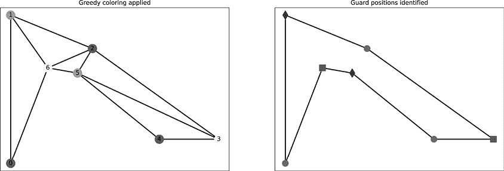

图 11-5：贪婪着色示例画廊的结果

左侧显示的是由着色算法找到的解决方案。在图的右侧，我已经移除了三角化边，因为一旦着色完成，我们不再需要它们。我还使用不同的形状—方形、菱形和圆形—来表示颜色组，以便更容易区分它们。你可以把每个组看作是一个潜在的守卫部署计划。如你所见，并不是所有的部署都有相同数量的守卫位置。圆形组有三个节点，而其他组只有两个；这意味着如果将守卫安排在圆形节点标记的位置，你需要部署一个额外的守卫来覆盖所有墙面。

你可以比较节点数最少的几种部署，看看每种部署方案提供的实际优缺点。例如，方形和菱形的部署组都只需要两个守卫，但菱形部署将守卫安排得比方形部署更靠近。虽然这看起来是一个微小的差异，但在现实中，两个守卫更接近可以更高效地相互支援；因此，假设这些部署是我的唯一选择，我会选择菱形部署。

现在你已经看到应用于示例画廊的基本解决方案概念，是时候开始优化这一过程，并使解决方案更具实用性，以便在现实世界中使用。本章的其余部分将重点关注完善你刚刚看到的理论方法，以解决之前提到的一些实际问题。

### 覆盖范围映射

到目前为止，我们忽略了画廊的规模。原始问题假设守卫拥有完美的、无限的视力，不受光线、距离或人群的影响。但在现实场景中，部署需要考虑这些因素，并为每个守卫位置设定某种最大覆盖阈值。如果我们说示例画廊的比例是 1:300 米（意味着图中的一个单位等于 300 米），则边*E*[(0,1)]的长度是 600 米，*E*[(0,1)] = 2 × 300 米 = 600 米（约合 1,968.5 英尺）。因此，画廊的面积大约是 241 平方米（2,594 平方英尺）。

仅用两个守卫来覆盖如此大的平面图，可能会导致覆盖出现空隙。再加上其他影响能见度的环境因素，^(4)，比如地面坡度引起的高差和照明（画廊的某些部分通常为了戏剧效果而调暗），显然两个守卫不足以保护整个画廊。因此，我们需要改进理论模型中的简化假设。我们将通过承认守卫一次只能保护有限的区域来做到这一点。这是我选择 Triangle 库的第二个主要原因：它支持*最大区域阈值*的概念，而 Shapely 版本的函数不支持。最大区域阈值设置了镶嵌过程中创建的任何三角形的最大面积。

如果将每个三角形视为需要守卫的区域，你可以将它们分配到守卫位置，以创建一个责任区（AOR）地图，显示哪些位置负责哪些区域，以及整体的覆盖分布（我们在第九章的消防站示例中看到过 AOR 地图）。每个区域三角形的面积越小，三角形之间的间距就越小，因此需要更多的三角形来镶嵌整个画廊。更多的三角形意味着镶嵌中会有更多的点，从而导致更多的守卫位置。这也意味着需要更多的颜色（或形状）组来表示它们。

为了简化数学计算，假设每个区域三角形的最大面积应为 30 平方米（接近 323 平方英尺），这相当于每个三角形面积为 0.1 单位。我们可以告诉 Triangle 将画廊镶嵌成最大面积为 30 平方米的三角形，方法是将 `a` 标志添加到参数字符串中，后跟缩放后的最大面积 0.1：

```
triangulated = tr.triangulate(tri_dict, "pe**a0.1**")
```

要进行镶嵌，`triangulate` 函数会添加必要的点（通常称为*Steiner 点*），使得几何图形将大于最大面积的三角形划分为更小的三角形，直到它们都低于阈值。图 11-6 显示了镶嵌的结果。

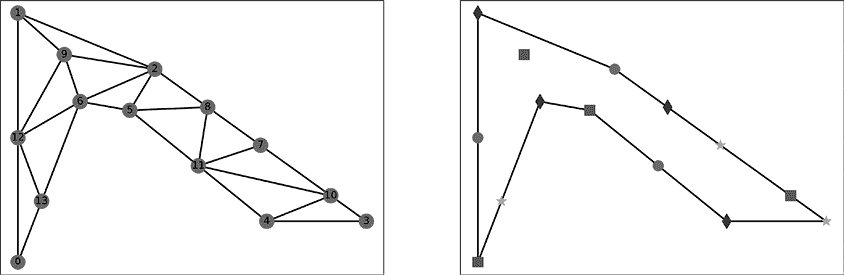

图 11-6：最大区域面积 30 平方米的解决方案

左侧是网格的图表示，右侧则展示了不同的潜在守卫部署。由于每个节点属于多个三角形，因此该位置的守卫将负责该节点所属的所有三角形区域。此外，如果有任何三角形没有直接连接到某个守卫位置（例如，右下角画廊中的三角形`[3, 4, 10]`），我们会将该三角形分配给距离最近的守卫位置，从而生成 AOR 图。解决图着色问题需要算法添加第四组，由星形节点表示。记住，你可以将额外的组视为更多的潜在部署选项，而部署中的额外点则表示更多的守卫被添加到该部署中。在这个例子中，圆形部署和星形部署都需要覆盖三个位置，而方形和菱形部署则需要四个位置。按照之前的逻辑，我会选择圆形部署，因为它将守卫位置安排得更紧凑，而星形部署则留下了一个相对孤立的位置。图 11-7 显示了从圆形部署生成的 AOR 图。

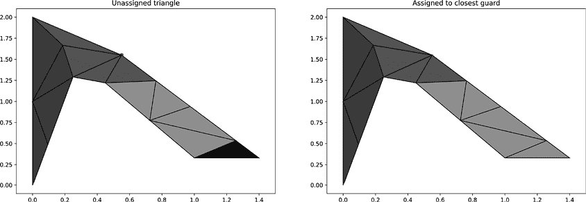

图 11-7：从选定的部署创建 AOR 图

图的左侧显示了三角形分配给守卫的默认方式。黑色三角形是前面提到的未覆盖三角形。在图的右侧，你可以看到将三角形分配给最近的守卫位置进行覆盖的结果。这确实在部署中产生了轻微的不平衡。浅灰色的 AOR 包含了五个三角形（因此覆盖面积更大），而其他两个 AOR 只有四个三角形。

列表 11-4 显示了根据部署组将三角形分配给守卫的函数：

```
def assign_triangles(g, triangulated, group_id):
  ❶ guard_nodes = [n for n in g.nodes() if g.nodes[n]["group"] == group_id]
  ❷ triangles = {k:[] for k in guard_nodes}
    for i in range(len(triangulated["triangles"])):
      ❸ t = triangulated["triangles"][i]
      ❹ t_poly = Polygon([g.nodes[p]["coords"] for p in t])

        # If triangle touches a guard directly at any point:
      ❺ if t[0] in guard_nodes:
            triangles[t[0]].append(t_poly)
        elif t[1] in guard_nodes:
            triangles[t[1]].append(t_poly)
        elif t[2] in guard_nodes:
            triangles[t[2]].append(t_poly)
        else:
          ❻ dists = {
                k: t_poly.distance(
                     Point(g.nodes[k]["coords"])
                   ) for k in guard_nodes}
          ❼ close = min(dists, key=dists.get)
          ❽ triangles[close].append(t_poly)
  ❾ return triangles
```

列表 11-4：将三角形分配给守卫节点

`assign_triangles` 函数接受三角化图 `g` 的副本、`triangulate` 函数的结果 `triangulated`，以及感兴趣部署的 ID `group_id`。我们首先基于提供的组 ID ❶，将代表守卫位置的节点收集到名为 `guard_nodes` 的列表中。接着，我们创建一个字典来保存函数的输出，直到 `return` 语句。字典的键是节点标识符，值是一个空列表，最终将包含分配给该节点的所有三角形（作为 `Polygon` 对象）❷。

要开始填充`triangles`列表，我们遍历`triangulated`中的所有三角形。每个三角形代表了构成三角形❸的图形节点集合。我们通过查找图形`g`中该三角形的坐标，将节点转换为`Polygon`❹。下一步是检查三角形节点是否已经包含了某个守卫位置。如果包含，则三个点中的一个将出现在`guard_nodes`列表中❺。如果三角形与守卫没有直接连接，我们将确定它与哪个守卫位置更接近。

接下来，我们创建一个名为`dists`的字典，字典的键是守卫节点的 ID。每个键的值将是 Shapely 函数`t_poly.distance`的结果，该函数测量三角形多边形与表示守卫位置的`Point`对象之间的最小距离❻。然后，我们使用`min`函数查找`dists`字典中的最小条目。通过在`key`参数中传递字典的键列表，函数会返回具有最低值的键，而不是值本身❼。我们使用该键将多边形分配到`triangles`中的正确列表❽。最后，我们返回`triangles`字典以结束该函数❾。

我们可以通过求和与每个 AOR 相关的所有三角形的面积来确定每个 AOR 的精确面积，如示例 11-5 所示。

```
for k in triangles.keys():
    area = sum([(t.area * 300) for t in triangles[k]])
    print("Position %d covers %.2fm2" % (k, area))
```

示例 11-5：求和 AOR 面积

对于结果中`triangles`字典中的每个键，我们对与之关联的三角形面积列表执行`sum`操作。注意我们通过将每个面积乘以缩放因子（此例中为`300`）来调整比例。示例代码的结果应该是：

```
Position 2 covers 60.41m2
Position 11 covers 98.68m2
Position 12 covers 82.34m2
```

关于三角形分配函数，有一点重要的说明：它实际上只是一个启发式方法。根据画廊的形状以及不同边缘和顶点的位置，有可能将一个三角形分配给“更接近”的守卫（通过最小直线距离来衡量，或者说是直线距离），但从逻辑上讲，它应该分配给另一个守卫。你可以通过考虑 Shapely 测量的直线距离是否与画廊的主体相交来改进该函数；如果相交，这表明测量路径穿过了墙壁，因此比实际情况要短（除非你的守卫能够穿透像混凝土墙壁这样的实心物体）。你可以改变函数，使其将三角形分配给不与任何墙壁相交的、具有最短距离的守卫位置。

另一个选项是更改部署，添加一个额外的防护位置来覆盖未覆盖的三角形。仔细观察图 11-6 右侧的图形表示，你会发现节点位置 3 的星形也可能是一个圆形。有时候会有多个可能的解决方案，着色算法必须选择它认为最优的一个（这意味着它尽可能均匀地分配颜色组）。与其直接将未覆盖的三角形分配给防护位置，你可能会选择将星形节点更改为另一个圆形节点；这样可以保持解决方案的有效性，同时确保每个三角形都被部署覆盖。另一方面，这也意味着需要向部署中添加一个额外的防护，这在某种意义上降低了其最优性。你应用的未来改进可能会允许用户在创建 AOR 地图时根据其特定需求选择分配策略。

### 定义受阻区域

现在我们已经涵盖了算法、它如何处理缩放以及基本的 AOR 覆盖地图，是时候处理复杂多边形了。如你在第七章中回顾的那样，这些多边形有孔洞，代表着不能访问的区域或遮挡视野的区域（例如，一块巨大的花岗岩柱子）。

幸运的是，在 Triangle 库中处理孔洞相对简单。对于我们要定义的每个孔洞，我们向 `triangulate` 函数传递一个位于孔洞内的点（任何点都可以）。算法会不断移除三角形，直到遇到字典中 `segments` 部分定义的一个顶点。需要注意的是，如果你不小心将孔洞包围在段内，可能会意外地移除所有三角形。如果发生这种情况，你将不会在 `triangles` 键中收到任何结果，因此你可能需要更新实现，使用某种有效性检查来处理这种情况。

要获取孔洞的点，可以使用 Shapely 的 `representative_point` 函数，该函数返回一个 `Point` 对象，保证位于调用该函数的形状的边界内。使用代表性点的好处在于，Shapely 不在乎点是否位于形状的中心，因此能够快速计算。只要该点位于给定形状内，就被认为是代表性点，这对于三角形来说非常有效，因为它只需要知道从哪里开始移除三角形。

列表 11-6 展示了创建复杂多边形镶嵌的代码。

```
ext_3 = [(0.0, 0.0), (0.0, 3.0), (3.0, 3.0), (3.0, 0.0)]
int_3 = [(1.0, 1.0), (1.0, 2.0), (2.0, 2.0), (2.0, 1.0)]
verts = ext_3 + int_3
❶ hole_p = Polygon(int_3).representative_point()
❷ hp1 = [list(v)[0] for v in list(hole_p.xy)]
segs = [(0,1), (1,2), (2,3), (3,0), (4,5), (5,6), (6,7), (7,4)]
sq_tri_dict = {
    "vertices": verts,
    "segments": segs,
  ❸ "holes":[hp1]
}
triangulated = tr.triangulate(sq_tri_dict, "pe")
```

列表 11-6：镶嵌复杂多边形

我们首先通过定义画廊多边形的外部坐标，将其存储在名为`ext_3`的列表中。在此情况下，点的排列形成了一个大致的正方形画廊。接下来，我们定义一个名为`int_3`的列表，用于存储洞的顶点坐标。这些点形成一个较小的正方形洞，直接放置在较大正方形外部的中心位置。然后，我们创建一个名为`verts`的顶点列表，它是所有外部和内部坐标的连接列表。我们可以通过将`int_3`列表作为其自身的多边形，并调用前面提到的`representative_point`函数来计算洞的代表点。

`hole_p`变量现在保存着一个`Point`，其`x`和`y`值可用于向 Triangle 库标识洞区域 ❶。由于 Triangle 无法直接处理`Point`对象，我们必须将坐标信息提取到一个列表中 ❷。接下来，我们创建了`segs`列表，其中包含必须被镶嵌算法遵守的边列表。与使用坐标不同，边缘使用两个顶点的索引作为每条边的起始和结束点。在更复杂的平面图中，直接从图的表示中获取边缘列表可能更方便。只需确保所有边缘和节点都已正确输入，否则您将得到一些意外的结果。

最后，我们可以构建用于调用`triangulate`函数的参数字典。与之前的参数字典唯一的区别是增加了`holes`键 ❸，它包含一个坐标列表，表示需要移除的洞内的某个点。当处理多个洞时，您需要为每个洞计算一个代表点，并将其添加到字典中的洞列表中。

图 11-8 展示了应用于示例复杂多边形画廊的步骤。

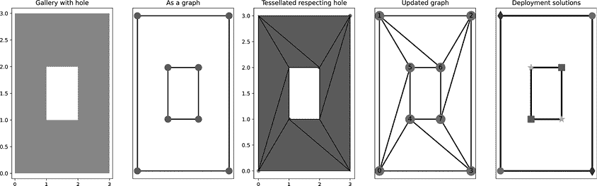

图 11-8：将 AGP 算法应用于复杂多边形

从左到右，您可以看到应用于画廊的整个解决过程。最左侧图中的白色正方形代表画廊中央的洞；较暗的灰色区域表示可用的平面图。在第二幅图中，您可以看到将几何形状转换为图的结果。请注意，洞部分被完全边界围绕。这些边界作为`segments`键（与之前的外部边界一起）传入 Triangle 的`triangulate`函数。第三张图片展示了根据洞进行镶嵌的结果。`triangulate`函数首先在不考虑洞的情况下创建镶嵌，然后开始移除三角形，从包含洞内点的三角形开始；它会继续移除相邻的三角形，直到遇到`segments`列表中的边缘。由于没有应用面积约束，因此结果是一个包含最少三角形的三角化。

第四个图显示了更新后的图形，准备应用颜色求解。如你所见，第二和第三个图中的任何边都没有跨入孔区空间；这表明 Triangle 在生成网格时尊重了我们忽略该部分空间的请求。右侧的最终图显示了基于着色解决方案分配部署组的结果。有四个潜在的部署，每个部署由两个保安岗位组成。如果没有孔区，你理论上只需要一个保安就能覆盖整个画廊。

### 优先考虑安保覆盖区域

接下来，我们将完善我们的模型，解决另一个我们之前隐含的假设：即认为画廊的所有区域同等重要，因此安保人员的部署应该是均匀分布的。例如，一家银行可能会认为私人办公室的监控不如大厅重要，因此需要不同的资源来保护不同的区域。为了解决这个问题，我们将优化最初的网格，以体现楼层平面图中各区域的重要性（或权重）。底层的 Triangle 程序支持多个最大区域（通过自定义数据文件读取），这使我们能够在定义不同的 AOR（活动区域）时更加灵活。为了将这个例子与我们的艺术画廊安保相结合，也许你认为画廊的楼层比讲座厅需要的保安更少，因为人们倾向于在讲座厅形成更大的群体。你可以在图 11-9 中看到将区域分配应用于方形画廊的结果。

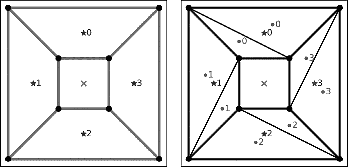

图 11-9：添加区域分配后的画廊

在图的左侧，你可以看到我为方形画廊示例定义的四个编号区域。每个区域的中心用星号标出，并显示该区域的编号。这些区域是整体画廊多边形的分段边界部分，因此可以使用任何在该段边界内的点来定义（类似于定义孔的方式）。在这种情况下，我在已经定义的分段边界列表中添加了四个理论分段（对角线分隔线）以包围这些区域。它们是理论性的，因为与表示墙壁和其他物理结构的其他分段不同，区域分段表示的是区域之间的逻辑边界，而不是物理边界。请记住，Triangle 并不了解这些差异，因此由我们来跟踪哪些分段属于哪个类别。我们可以利用图形表示中存储的边缘属性来做到这一点。

为了让 Triangle 知道我们有感兴趣的区域，我们还需要更新传递给包装器的输入字典，加入`regions`键，如清单 11-7 所示。

```
sq_tri_dict = {
    `--snip--`
    "regions":[
        [1.5, 2.5, **0.** , 0\. ],
        [0.5, 1.5, 1\. , 0\. ],
        [1.5, 0.5, 2\. , 0\. ],
        [2.5, 1.5, 3\. , 0\. ]]
}
```

清单 11-7：为镶嵌添加区域定义

`regions`键的值是一个嵌套列表。每个条目包含表示相关区域内某个点的 x 和 y 坐标。在初步网格划分过程中，围绕每个区域代表点找到的边界段中的三角形将被分配第三位置的值。列表中的第四个位置以及后续的每个位置可以包含一个数字区域属性（例如，修改后的可见性值，以标记具有更柔和光照的区域）。你所包含的任何区域属性的值将被区域内的三角形继承。

一旦定义了区域，我们就可以进行初步的网格划分。我们将通过在`triangulate`函数调用中添加`A`标志来告诉 Triangle 将区域信息包含在结果中：

```
triangulated = tr.triangulate(sq_tri_dict, "pe**A**")
```

结果的网格显示在图 11-9 的右侧。每个三角形内的数字表示已分配给该三角形的区域标识符。到目前为止，过程与之前相同，因此网格保持不变。

下一步是将结果保存在一组特殊的文件中；这些文件本质上是字典中的相同数据写入到平面文本文件中。我们需要这样做，以便在精化阶段重新加载文件。不幸的是，包装库不包括任何保存功能，因此我必须根据底层程序文档中的文件规范编写自己的函数。项目代码包含了创建预期文件所需的所有功能，但它们很长而且相当枯燥，所以我在这里跳过详细介绍。你只需导入我在本章代码中提供的`DataSaver`类，如清单 11-8 所示。

```
from filemanager import DataSaver
saver = DataSaver(triangulated, "square", 1, "/myproject/")
saver.set_region_areas([-1,0.1,-1,0.05])
saver.save_project()
```

清单 11-8：将网格划分结果保存到 Triangle 项目文件

我们首先定义`DataSaver`实例，将`triangulated`字典作为第一个参数，项目名称作为第二个参数传入。你还可以选择性地传入版本号和目录。如果不传入，版本号将自动设置为 1，目录则为脚本的当前工作目录。`set_region_areas`函数存储最大区域列表，列表中的索引与区域索引相同。如果你传入的列表比区域数量短，那么剩余的区域将被视为没有面积约束。

在使用`save_project`保存项目之前，我们需要设置区域面积，以便保存器知道如何在文件创建过程中标记每个三角形。一旦`save_file`函数完成，你将会在你指定的目录（或者如我之前提到的当前工作目录）中看到一系列文件。每个文件命名方式如下：*<项目名称>_<版本号>.<部分>*，其中*<部分>*是 Triangle 预期的文件类型之一（带有*.node*、*.ele*、*.area*或*.poly*扩展名）。因此，清单 11-8 中的代码将创建一个名为*/myproject/square_1.area*的文件（还有其他文件）。*.area*文件尤为重要，因为它包含每个三角形的最大面积，这是我们通过区域关联设置的。

接下来，我们需要通过重新加载保存的数据并执行另一次网格剖分来细化网格：

```
reload = tr.load("/myproject/", "square_1")
refined = tr.triangulate(reload, "ra")
```

我们从包装库中调用`load`函数，并传入存储项目文件的目录以及项目名称（包括版本）。这些输入用于查找并加载在清单 11-5 中创建的相关文件中的数据。最后，我们通过再次调用`triangulate`函数来创建细化后的网格，这次是在加载的数据上进行操作。选项字符串`ra`告诉 Triangle 细化先前生成的网格（`r`标志）并使用约束的三角形区域来细化网格（`a`标志）。由于 Triangle 正在细化网格，并且我们要求它使用约束区域，它将尝试定位项目的*.area*文件，并在创建细化网格时使用该信息。

在细化步骤中，原始网格剖分中的每个三角形都会与*.area*文件中定义的区域进行比较。如果区域大于定义的最大面积，算法会将该三角形分割成更小的三角形。你可以在图 11-10 中看到区域面积应用到正方形画廊网格剖分的结果。

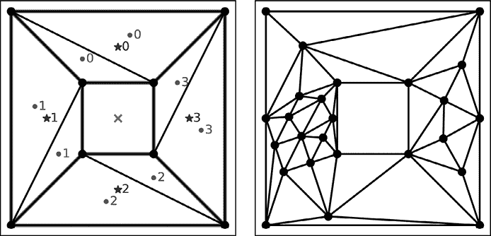

图 11-10：创建多区域网格剖分

在左侧，你可以看到区域分配。传递给`DataSaver`类的区域面积为`[-1,0.1,-1,0.3]`，可以解读为：区域 0 没有最大面积约束（由任何负值标记）；区域 1 的最大面积约束为 0.1；区域 2 同样没有应用约束；最后，区域 3 的最大面积约束为 0.3。右侧显示，区域 1 被分割成了许多小三角形，而区域 3 则被分割成了稍大的三角形。结果是，区域 1 中的防护位置比区域 3 多，而这两个区域与没有约束的其他两个区域相比，覆盖面积更大。

我们可以使用另一个`DataSaver`类实例来保存细化后的网格：

```
saver = DataSaver(refined, "square", 2)
wsaver.save_project()
```

我们再次传入`refined`网格结果、项目名称和版本。每次细化网格时都按标准做法增加版本号，因此这个细化后的网格将是方形项目的第二个版本。这次我们不需要定义区域区域，除非我们想要进行进一步的细化。

当然，如果你可以向部署中添加任意数量的守卫，那就太好了。不幸的是，我们很少有预算为每班次配备更多的守卫，或者为每层楼部署固定数量的传感器设备。我们可以通过`S`标志告诉 Triangle 它可以添加的最大 Steiner 点数，以实现切割。比如说，假设我们只能负担得起在方形画廊部署三个额外的守卫。图 11-11 显示了在细化步骤中加入这个约束后的结果。

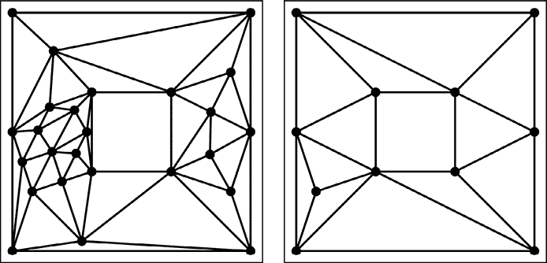

图 11-11：带有三个守卫的细化网格

在左侧，你可以看到我们之前生成的网格，那里没有添加守卫点的限制。在右侧，你可以看到从细化中生成的网格，我将输出限制为三个额外的守卫位置。请记住，我没有更改之前定义的最大区域约束，显然右侧的网格并没有满足这个约束。一旦 Triangle 无法再添加 Steiner 点，它就无法进一步划分较大的三角形，因此它会停止。如果要求你将画廊划分为小区域，然后用仅三个额外的守卫来覆盖这些区域，你可以用这个结果证明同时实现这两个目标在数学上是不可能的。希望这个结果能为你争取到增加这些额外守卫的预算！

### 安全摄像头视野映射

接下来需要处理的特性是添加视场和有效范围参数。在讨论人类守卫时，视场和有效范围因人而异，因此分配这些参数有些模糊。在这种情况下，直觉和有根据的估算是最好的朋友。然而，当你把守卫位置看作电子设备时，比如摄像头或运动探测器，数据就容易找到。例如，我在 Google 上搜索了“监控摄像头数据表”，并选择了我看到的第一个型号：NetGear 的 Ocuity 型号 HMNC100。通过查看该型号的技术数据（可以在制造商网站上找到），我发现列出的视场角度为 107 度，完全黑暗中的有效范围为 7 米（得益于内置红外照明）。在正常工作照明条件下的距离通常没有列出，因为答案取决于你需要区分的细节程度、摄像头的焦距（可能在用户文档中没有列出），以及用于编码信息的像素数量（通常以百万像素（MP）为单位，1MP 等于一百万个像素）。为了获得有效距离的较好数值，最好的方法通常是直接在感兴趣的条件下测试摄像头。

我们假设正常有效范围 *r(d)* 是夜间范围 *r*(*n*) 的 20 倍，*r*(*n*) = 7 米（*r*(*n*) × 20 = 140 米，即约 460 英尺）。由于我们在做近似计算，我还将视场 Δ 从 107 改为 104，因为 107 是质数，无法均分成相等的段；这会使得计算视场边缘的点变得更困难。另一方面，104 可以被多个因子整除，包括 2，这也有助于简化计算。我将定义四个内部守卫节点 `[4, 5, 6, 7]` 的起始角度 ϴ[(0)] 分别为 `[180, 134, 45, 351]`。我们可以将正向外围角定义为 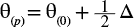，负向外围角定义为 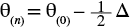。

最后，我们可以通过将视场分成 8 个 13 度的段落，来创建两外围角之间的一些中介角度：

δ = Δ / 8 = 13

然后，我们可以对每个角度使用 `cos` 和 `sin` 函数：

A : = [ θ( p ) − i δ] ∀ i ∈ ℤ0 − 8

图 11-12 显示了如果你将其中一台摄像头放置在 图 11-8 中方形示例的四个内部守卫位置之一，并使用刚才提到的起始角度时，视场的近似覆盖情况。

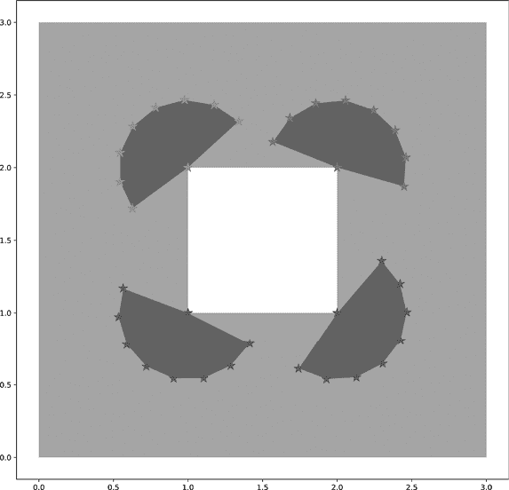

图 11-12：定义视场多边形

图 11-12 展示了将其中一台相机放置在内部孔的每个角落时，视场覆盖的近似情况。如您所见，明显有大面积区域是相机无法充分覆盖的。此外，您还可以看到，理论上，有人可以在不进入任何相机视野的情况下，接近每个相机位置。这些就是本章早些时候提到的盲区示例。作为防守方，您需要增加更多的覆盖范围来防止这些空隙。作为攻击方，您可以将所有未覆盖的资产视为潜在的好目标。

关于视场映射的最后一点说明。我假设这些相机是指向并保持静止的。几款高端相机包括一种叫做云台的装置，可以让远程操作员根据需要移动相机。部分中端相机也包括自动前后扫视一个区域的功能。这些类型的相机近年来变得不太流行，但仍然值得了解；并非所有的视场地图都是静态的。在分析设备数据表时，务必留意这些特性；您可能需要更新实现，以适应这些情况下的完整视野范围。

## 总结

现在，您已经掌握了解决艺术画廊问题核心所需的所有代码，包括处理现实世界约束条件的方法，如有限预算和传感器有效范围。我们已经讨论了 Triangle 库的强大功能，并将其与 Shapely 和 NetworkX 结合，采用几何和图形表示法对问题进行了建模。也许最重要的是，您现在应该能够自如地解释 AGP 理论，并讨论应用中所涉及的实际约束条件。您可以利用大量的研究资料继续深入理解这个问题。例如，我甚至没有涉及贪心着色算法如何在后台运行。^(5) 一般来说，节点着色是一个伟大的图论话题，除了 AGP 之外，它还有很多应用；但就我们来说，研究节点着色算法可以帮助您更全面地理解您的应用输出的解决方案（以及您可能如何修改它们）。关于不同画廊布局的几何含义，您可以查看论文《艺术画廊问题注解》以获得更深入的描述。^(6)

为了继续开发系统的核心，你可以识别可能对目标用户有吸引力的额外用例。例如，你可能希望有一个用例来覆盖那些想要比较部署前后计划的用户。一旦收集了这些用例，你可以开发支持它们所需的额外功能。此外，你还可以继续完善此处包含的功能。三角形分配功能是一个优秀的改进领域，你可以使用我们之前讨论过的某个选项来提升它。记住，你不一定需要在将应用程序推向市场之前开发所有这些功能。开发最小可行产品（MVP）的关键在于选择那些能让你的应用对用户有用的核心功能。通常，确定这些核心功能就是分析竞争软件并回答两个问题：“这些应用都提供了哪些功能？”以及“我的应用提供了哪些其他应用没有的功能？”

一旦你能回答这两个问题，你就可以继续进入下一章，我们将从本章开发的核心算法，扩展为一个完整的 Python 应用程序。我们将通过绘制用户交互图、添加图形、选择现代处理架构以及决定是否添加应用程序许可，来完成这个项目。
