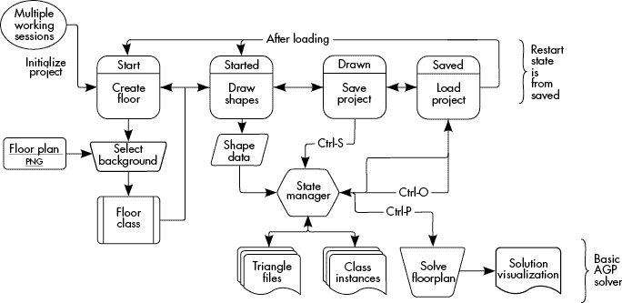
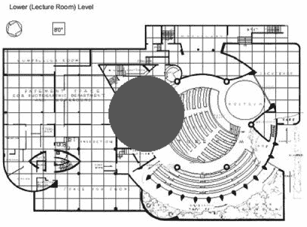
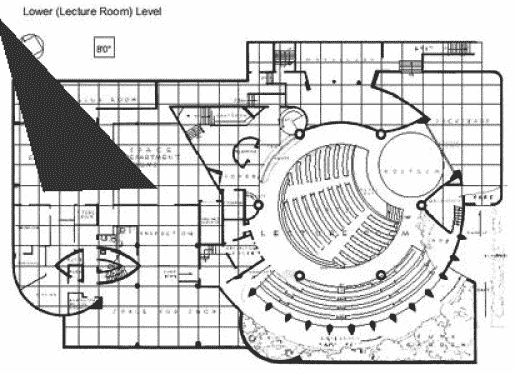

# 第十四章：最小可行产品方法在安全软件开发中的应用


超越当前的概念验证代码意味着需要规划其他用户如何与程序互动。通过从开始到结束绘制用户在应用程序中的路径，你可以决定最适合的交付方式，这将使得用户能够快速直观地开始使用你的软件。本章中的考虑适用于大多数类型的应用程序，因为它们涉及的是交付和使用应用程序的过程，而不是直接解决问题。

在上一章中，我们确定了一些用例，并据此定义了应用程序需要支持的几个功能。在本章中，我们将实现仍然开放的功能：开发图形用户界面（GUI）和保存项目。我们将首先映射用户与程序的交互，利用这些交互来构建 GUI。接下来，我们将讨论状态管理器以及如何利用进程并行性来分配工作负载，优化我们对复杂平面图的解决方案。最后，我们将构建 GUI 并实现保存功能。

## 映射用户的交互

大多数优秀的软件项目在开发阶段都会有一套用户交互计划，描述用户在应用程序中实现每个用例时的实际步骤。这些计划可以是粗略的草图，也可以是非常详细的最终应用程序线框图，但它们都需要回答一个问题：“用户如何使用系统来实现目标？”我偏好的用例绘制方法是使用应用程序状态机作为结构，并使用统一建模语言（UML）来表示过程。我建议使用像 Dia 或 LucidChart 这样的应用程序来制作可视化布局。图 12-1 展示了我在 LucidChart 中为一个用户希望跨多个会话保存其项目的用例所开发的工作流程图。



图 12-1：多会话工作流程图

我选择这个特定的用例，因为它涵盖了整个应用程序流程：我们创建多个楼层，绘制多边形表示，保存和重新加载项目数据，以及创建最终的解决方案可视化。在图 12-1 的左上角，你可以看到一个椭圆形状，它表示用例的入口点。在这个场景中，想要跨多个会话工作的用户首先初始化他们的项目。现在这仅仅意味着他们第一次打开程序，但我们将在后续章节中对初始化过程进行更多的扩展。

圆角矩形表示应用程序的高级状态。这些状态类似于我们在第六章中讨论有限状态机时所考察的状态：它们表示每个状态下可用的选项，以便转换到另一个状态。当用户初始化项目时，他们会进入*Start*状态，在此状态下，他们需要创建一个或多个包含背景 PNG 文件的`Floor`对象。一旦表示楼层平面图的`Floor`类被创建，它就会传递到用户进入的下一个状态，即*Started*状态。

在*Started*状态下，用户可以选择绘制楼层平面图的形状数据。为此，他们点击鼠标创建一系列表示平面图外壳的点，并在外壳内添加点来定义孔洞（这些孔洞由应用程序原语中的`Obstacle`类表示）。一旦用户添加了一个点以开始绘制形状，他们必须完成绘制或使用`undo`功能撤销操作。用户绘制完他们需要的形状后，Shapely 数据会被发送到状态管理器，这是整个应用程序的核心。稍后我们会更详细地讨论状态管理器，但现在只需要理解状态管理器的工作是跟踪用户在应用程序中的操作，并暴露适当的操作和施加适当的约束（例如，在保存之前必须完成绘制形状）。

一旦用户绘制完他们希望在会话中完成的内容，他们将进入*Drawn*状态，在这个状态下，他们会保存信息以供下次会话使用。为了告诉状态管理器记录各种文件和对象，用户按下键盘组合键 ctrl-S。在这个状态下，用户可以选择返回继续绘制——这允许在单个会话中进行增量保存——或结束程序并稍后再回来。当用户返回继续后续会话时，他们会进入*Saved*状态，在该状态下，他们可以使用键盘组合键 ctrl-O 要求会话管理器加载之前保存的项目。加载完成后，用户可以添加新的楼层（*Start*状态），或者继续在先前创建的楼层上绘制（*Started*状态）。一旦所有必要的形状都被记录下来，用户可以通过键盘组合键 ctrl-P 解决楼层问题。结果将是一个图像文件，其中包含最低计数的部署并覆盖在楼层平面图的背景图像上。

总体来说，这个实现的功能集仍然相对基础；这是故意设计的，目的是让你能够扩展程序以实现你对项目的设想。应用程序开发中的一部分艺术就在于你如何选择组织功能模块，因此我不会再详细说明我认为哪些部分应该放在哪。只要你以符合自己理解的方式安排功能，满足用例需求，它们就会成为指导项目开发的地图。

### 计划应用程序状态

一旦你创建了其余的应用状态流程图，你就可以开始拆解支持每个应用状态所需的代码。这个过程是关于识别对最多功能产生影响的应用部分，并开发必要的代码来支持这些功能的。遵循这个应用映射过程有助于通过识别应用程序中共享的部分来减少不必要的代码，这样你就可以使用可重用的类或函数来开发它们。因为它允许你追踪哪些交互触及了哪些代码部分，这个过程还帮助你评估每个部分对应用程序性能的相对重要性。例如，通过查看图 12-1 中的图示，我们可以知道我们需要一个状态管理器类来跟踪应用程序中的操作，一个楼层类来表示楼层平面图，以及某种支持键盘输入的方式（比如热键命令 ctrl-S 和 ctrl-O）。我们知道状态管理器需要能够接收形状数据，并输出存储重要细节的文件。它还需要能够读取这些文件，并从中重建最后保存的状态。

创建应用程序地图也有助于你组织支持这些需求所需的库和模块。我们已经知道需要从上一章中引入 Triangle 和 NetworkX 库。由于我们需要图形显示、键盘快捷键和鼠标交互，PyGame 库是开发用户界面的一个不错选择——它能够同时支持这三项需求。由于我们使用的是背景 PNG 文件，我们需要一个能够处理这种文件类型的工具。我们可以使用一个名为 png 的特定 PNG 库，它与 PyGame 的功能配合得很好，或者使用 imutils 或其他类似的库。让你的应用程序图示引导你选择库，并阅读不同选项的文档。寻找像 PyGame 这样的库，它能够解决多个需求。当两个选项看起来同样适合一个任务时，我通常选择能减少整体需求大小的那个。这意味着选择已经包含在需求库中的库，或者选择文件大小较小的那个包。

在实际开发中，你包含的用例数量以及你处理它们的顺序将很大程度上受到外部因素（如业务需求和预算）的制约，因此没有人能给你一个通用的开发流程来遵循。尽管如此，从高层次来看，开发用例图和应用程序流程图几乎总是能帮助你保持目标明确。

接下来，我们来讨论一个在概念验证开发中常常被忽视的话题：为了人类的福祉，记录我们的项目。

### 记录应用程序

对于任何重要项目来说，良好的文档都是绝对必不可少的。我们已经通过应用程序状态图开始了文档工作。当该软件交付时，我们可以将这个图表与其他项目文档一起提供给用户，展示我们应用程序的基本功能。除了项目文档外，我们还应该对源代码进行文档记录。这个项目的代码采用了一种叫做*docstrings*的方法，旨在为我们自己和未来的开发者记录代码。Docstrings 是直接添加到脚本文件中的注释，使用易于人类阅读的语法。这个话题在网上有大量详细的讨论（[`peps.python.org/pep-0257`](https://peps.python.org/pep-0257)），所以我在这里不会展开讨论，但我认为展示一个例子会更有帮助：

```
def concat_str(a, b):
    **'''**
 **Returns the concatenation of string 'b' to string 'a'.**
 **Parameters:**
 **a (str): A string literal**
 **b (str): Another string literal**
 **Returns:**
 **concat_str (str): String after adding 'b' to the end of 'a'**
 **'''**
    concat_str = a + b
    return concat_str
print(concat_str.__doc__)
```

函数的 docstring 是紧接在函数定义后面，使用三引号（`'''`）括起来的字符串字面量。注释涵盖了函数的输入和输出（在示例中的`Parameters`和`Returns`部分），记录了类对象的预期用途，并为可能想要进行未来修改的人记录任何重要的说明或事实——例如，包含一个指向函数所使用的特定算法源材料的链接。我们可以通过内置的`.__doc__`属性访问任何函数的文档。Docstring 语法还允许自动化程序检测这些注释，并将它们格式化为更美观的 API 文档供大众使用。

拥有良好的文档能够帮助你迅速引入新的开发人员。如果你是为一个企业开发这个应用程序，你可以轻松地培训团队中的其他开发人员，并使他们能够开发扩展功能和改进。同样地，如果你是为开源社区开发，良好的文档会鼓励贡献优秀的代码。即使你只是为自己开发，强大的文档实践也能帮助你在长时间不接触项目后，迅速找回记忆。

现在我们已经讨论了保持代码高效并促进其他开发者采用的所有规划要点，我们可以开始项目的有趣部分：开发应用程序的核心——状态管理器。

## 开发状态管理器

在现代软件中，*状态管理器* 极为常见，管理程序中所有可能的交互。例如，你的网页浏览器需要跟踪你点击的地方、你输入的内容，以及浏览器中发生的所有其他事情。浏览器的状态将决定这些点击和按键操作的结果：在 Google 首页按下 ctrl-S 尝试将页面保存为 HTML 文件，而在 Google Docs 网页中使用相同的快捷键则会将项目保存到你的云存储中。只有因为有一个负责协调所有部分的类：状态管理器，才能实现这一切。状态管理器是 *事件驱动的*：当某些动作（如按下某个键或右击）发生时，它们会收到通知并决定如何响应。

让我们来看一些事件。清单 12-1 展示了 PyGame 如何使用 `pygame.event` 类将事件发送到你的程序。

```
import pygame, sys
import state_manager as state
❶ for event in pygame.event.get():
  ❷ if event.type == pygame.QUIT:
        `--snip--`
        sys.exit()
    elif event.type == pygame.MOUSEBUTTONDOWN:
      ❸ state.handle_click(event)
    elif event.type == pygame.KEYDOWN:
 pygame.event.clear(None)
        state.handle_keydown(event)
    elif event.type == pygame.KEYUP:
        state.handle_keyup(event)
  ❹ elif event.type != pygame.MOUSEMOTION:
        print(event.type)
```

清单 12-1：处理 PyGame 事件

`pygame.event` 类包含一个事件队列，记录所有在连续的 `get` 请求之间发生的事件。`get` 调用的结果是一个事件对象列表，我们将遍历这些对象 ❶。事件的顺序通常（但不总是）是用户执行它们的顺序。例如，用户按下 ctrl-S 键盘快捷键保存项目时，会在队列中触发一系列事件，表示用户按下了 ctrl 键、按下了 S 键、释放了 S 键，最后释放了 ctrl 键。

每个事件对象都有一个类型字段，帮助你了解发生了什么。我们关心的有五种主要事件类型。`pygame.QUIT` ❷ 是一个特殊事件，应该触发应用程序的关闭代码，并最终通过干净地退出应用程序（不留下未使用的文件或打开的资源）来结束程序。其他类型的事件名称也非常直观：`pygame.KEYDOWN` 和 `pygame.KEYUP` 事件分别在用户按下或释放键盘按键时触发。类似地，`pygame.MOUSEBUTTONDOWN` 事件表示用户点击了鼠标按钮 ❸。状态管理器使用这些事件来决定何时以及如何在应用程序状态之间进行切换。

PyGame 事件队列中有很多事件。例如，`pygame.MOUSEMOTION` 事件在用户移动鼠标指针时会多次触发。你可以通过检查事件类型是否不等于（`!=`）不需要的事件类型 ❹ 来过滤掉不需要的事件。在开发过程中，将事件打印到控制台可以帮助你识别你可能想要编写代码的事件，例如额外的键盘快捷键。这时使用类型过滤非常有用，可以减少输出消息的数量，如 清单 12-1 所示。

现代应用程序如网页浏览器和操作系统可以有数百个甚至更多的状态。此外，每个状态还可以有*子状态*，即在单一状态内存在的不同选项，例如在绘图状态下的红色或黑色背景屏幕。应用程序越复杂，就越需要时不时地回顾你的工作流图。开发是一个迭代过程，确保随着项目的进展，你能够捕捉到所有主要的状态非常重要。我不会详细讲解状态管理器中的所有代码，而是会展示一些驱动交互的关键元素。例如，我不会向你展示处理每个按键输入的逻辑，而是会展示如何通用地处理两种键盘输入类型（`KEYUP`和`KEYDOWN`）。然后，你可以使用项目资源文件夹中的文档*AGP_solver_API.pdf*深入了解每个函数的具体实现。

Listing 12-2 中的代码展示了`handle_keydown`函数的框架。

```
def handle_keydown(event):
    global shifted
    global controlled
  ❶ if event.key in [303, 304]:
        # Shift key depressed.
      ❷ shifted = True
        return
  ❸ if event.key == 306:
        controlled = True
        return
  ❹ if event.unicode == "z":
      ❺ undo()
```

Listing 12-2：在状态管理器中处理`KEYDOWN`事件

该函数将`pygame.event`对象作为唯一参数。它需要这个对象，以便可以确定按下的是哪个键，并作出相应的响应。有几种方法可以检查事件的值。首先，通过检查`event.key`属性是否在一组值列表中❶，你可以将相同的代码块应用于多个输入值。这些值是键盘上每个键的数字标识符，也称为键的*扫描码*。在这种情况下，`303`和`304`分别对应左侧和右侧的 Shift 键。如果按下任意一个，它将触发将`shifted`变量设置为`True`的代码❷。如果你只关心一对键中的某一个键，可以将`event.key`参数与单一扫描码进行比较❸。在这种情况下，`306`对应左侧的 Ctrl 键。按下右侧的 Ctrl 键不会触发将`controlled`变量设置为`True`的代码块。注意，`shifted`和`controlled`这两个变量都是全局变量，这意味着即使函数返回后，它们的值也会在应用程序中持续存在。这使得我们能够知道用户是否输入了像 ctrl-S 这样的双键组合，而这需要两次调用`handle_keydown`才能实现。PyGame 还有一个内置的函数`pygame.key.get_mods`，用于判断像 Ctrl 或 Shift 这样的修饰键是否在键盘组合中被按下；你应该探索它，以改进 Listing 12-2 中的代码。

判断是否按下了某个特定键，有时如果你将`event.unicode`属性与该键的字符串字面量进行比较，而不是使用键的扫描码，那么代码会更容易理解。在这个示例中，我们将该属性与字符串`"z"`进行比较❹；如果值匹配，就会调用`undo`函数❺。

清单 12-3 中的 `handle_keyup` 函数较短，因为通常我们关心的键的释放时机较少。

```
def handle_keyup(event):
    global shifted
    global controlled
 if event.key in [303, 304]:
        shifted = False
        return
    if event.key == 306:
        controlled = False
        return
```

清单 12-3：在状态管理器中处理 `KEYUP` 事件

这个函数的代码与清单 12-2 中的代码相反。我们检查 `event.key` 参数，看看用户是否释放了任意一个 Shift 键，如果是，就将 `shifted` 键设为 `False`。否则，我们检查左 Ctrl 键是否被释放，如果是，则将控制变量设为 `False`。Z 键触发一次性事件，这意味着你不需要担心用户是否释放了它。

状态管理器有一个类似的函数，名为 `handle_click`，用于处理鼠标点击事件，如清单 12-4 所示。

```
def handle_click(event):
  ❶ clicked = check_clicked_existing_vertex(event.pos)
  ❷ in_room = check_clicked_within_room(event.pos)
  ❸ if event.button == 1:
        `--snip--`
      ❹ left_click(event, clicked, in_room)
    elif event.button == 3:
        `--snip--`
      ❺ right_click(event, clicked, in_room)
```

清单 12-4：在状态管理器中处理 `MOUSEBUTTONDOWN` 事件

这里的概念与之前的清单相同，但逻辑需要更长，以处理判断点击了哪个按钮，点击发生时指针的位置，以及按钮点击时指针所在区域内是否有其他对象。`check_clicked_existing_vertex` 函数 ❶ 将鼠标的位置（存储在鼠标事件的 `event.pos` 参数中）与项目中所有顶点的列表进行比较。用户很难准确点击一个顶点的位置，所以我们给他们留有一定的误差空间，称为 ε（epsilon）。当前的 ε 值为 3 像素。如果指针距离顶点的距离在 ε（3 像素）范围内，返回该顶点的数据。`EPSILON` 常量在章节的附加材料中 *state_manager.py* 文件的第 35 行定义，而 `check_clicked_existing_vertex` 函数的代码从第 634 行开始。

类似地，`check_clicked_within_room` 函数 ❷ 用来检查指针是否位于任何多边形形状内。事件及与点击对象相关的信息（如果有的话）会根据点击了哪个按钮，传递给相应的函数。某些鼠标有不同的按钮配置，扫描码会根据你的电脑使用的制造商和驱动程序有所不同。你可以在点击不同按钮时使用 `print(event)`，让 PyGame 为你识别它们的扫描码。对于生产环境中的应用，你应该使用 PyGame 内置的键盘字面量，例如 `pygame.key.K_a`，而不是扫描码，这样可以提高移植性。

在列表 12-4 中，如果`event.button`是`1` ❸，它表示用户点击了左键，因此我们调用`left_click`函数 ❹。如果`event.button`是`3`，则表示用户点击了右键，在这种情况下，我们调用`right_click`函数 ❺。这两个函数都接受`event`对象、`clicked`顶点和`room`（如果存在）。每个函数都使用这些细节来确定如何通过大量特定的逻辑检查来更新内部状态。例如，实施在顶点上进行 Shift + 左键点击时的特殊删除响应，需要`left_click`函数首先检查`shifted`全局变量是否设置为`True`。如果是，状态管理器将从顶点列表中删除传递给它的顶点，从而更新内部状态。如果`shifted`变量是`False`，状态管理器将根据是否点击了房间、顶点或两者都没有，遵循不同的逻辑分支。正如你所想，这些函数的逻辑很容易变得非常长且复杂。

像我们在过去三个列表中所做的那样，处理事件和管理状态是状态管理器代码背后的核心概念。当你扩展你的实现时，你将继续向`handle_keydown`、`handle_keyup`和`handle_click`函数中添加逻辑，以实现所有不同的用户交互，例如绘制房间并向其添加障碍物（将在稍后的“添加图形用户界面”部分中讨论）。

## 通过并行处理加速安全性

*过程并行性*是一个包含许多细节的大话题，但简单来说，它意味着将需要完成的工作分配给多个工作人员。如何实现这一点被称为*分工合作*，这也是一个争议的话题。例如，假设你是一个教师，需要批改 100 份学生试卷，每份试卷有 20 道问题。幸运的是，你有四个助教来帮助你，总共有五个工作人员在批改试卷，因此你们每个人可以批改 20 份试卷。其好处是你们可以同时批改五份试卷，而不仅仅是一份。

另一种选择是让你们每个人选择四个问题进行评分。你们先拿到第一份试卷，评分你们的四个问题，然后把试卷传给下一个人，让他们评分他们的四个问题，以此类推。在这种情况下，每个工作人员至少接触到每份试卷一次，但每次的时间较短。这种分工的好处是它使每个工作人员能够集中精力处理他们最擅长的工作。想象一下，如果其中一位助教是机械工程的专家，另一位则专攻化学。通过让每位专家处理他们擅长的领域，你可以通过利用他们各自的能力来最大化过程的速度。

### 线程并行性

更正式地说，Python 有两种主要的并行性方法：线程并行性和处理器并行性。*线程并行性*发生在主应用程序打开一个共享其资源（如内存空间）的子应用程序时（[`docs.python.org/3/library/threading.html`](https://docs.python.org/3/library/threading.html)）。这就像是有一个统一的答案卡，所有批改试卷的人都能查看（想象它贴在房间的墙上）。每个批改员代表一个线程，答案卡是他们都可以访问的共享资源。在大多数 Python 版本中，线程技术上不是并行性的，因为每次只有一个线程可以执行命令（由 Python 解释器控制）。这相当于让每次只有一个人可以批改答案。虽然如此，由于线程切换非常快速，几乎是同时发生的，所以大多数开发人员（包括我）仍然将其视为并行。

线程可以通过几种不同的方式创建，但最常见的一种是创建一个类的多个线程，如清单 12-5 所示。

```
import threading, os, Image
❶ class DisplayAGP(threading.Thread):
    open_image = None
  ❷ def set_file(self, bgd_file):
        self.open_image = bgd_file

  ❸ def run(self):
        file, ext = os.path.splitext(self.open_image)
        im = Image.open(self.open_image)
      ❹ im.show()
        return
```

清单 12-5：用于显示并发图像的线程并行性

这段代码定义了一个名为`DisplayAGP`的类，允许应用程序同时显示多个图像，同时仍然允许主应用程序在后台执行其他工作。所有计划在线程中使用的类需要扩展`threading.Thread`类❶，并包含一个`run`方法❸，该方法包含在线程上下文中执行的逻辑——在此例中，即打开特定的图像文件并通过`im.show`❹显示它。你可以添加更多类方法，比如`set_file`方法❷，作为在运行线程之前配置每个线程的手段。

要并发显示名为`image_files`的图像文件列表，你可以使用清单 12-6 中的代码。

```
for fp in image_files:
    t = DisplayAGP()
    t.set_file(fp)
    t.daemon = True
    t.start()
```

清单 12-6：使用`DisplayAGP`类并发显示图像

我们从遍历文件位置列表开始。对于每个位置，我们创建一个`DisplayAGP`类的新实例。然后，我们调用`set_file`方法，并传入图像的位置，以便每个线程知道应该显示什么。将`t.daemon`属性设置为`True`告诉程序一旦线程使用`start`方法启动，就不等待该线程的结果。调用`t.start`实际上会触发`DisplayAGP.run`方法中的代码。一旦所有线程都被启动，主线程就可以继续处理其他工作。

````### Processor Parallelism    One of the major drawbacks to threading parallelism is that all the threads live in one application, which in turn lives in one section of your processor. Chances are your computer, phone, tablet, and probably even your toaster have multiple cores in their central processors. Threads load all the workers onto one core while the other cores sit idle (at least from Python’s perspective), losing all the advantages of modern computer architecture. *Processor parallelism* (also called *multiprocessing*) aims to address this limitation by enabling multiple copies of an application to communicate with one another ([`docs.python.org/3/library/multiprocessing.html`](https://docs.python.org/3/library/multiprocessing.html)). By splitting the work across separate instances of an application, you allow your processor to divide the work among all the cores. These cores are each independent little processors that can execute instructions on the same clock cycle as the other cores, making it the truest form of parallelism available in Python. Going back to our test grading analogy, this would be like giving each grader their own copy of the answer sheet to take home and work from. The graders would each get a copy of the resources they need to complete their portion of the tests (such as the answer key and a stack of questions), but they could also use whatever additional resources they have access to at home (such as a faster computer). Each grader operates in their own environment, completely independent of the other people grading papers. Once someone finishes grading their portion of the tests, they bring their graded answers back to you (the teacher, or main process), who then compiles the individual responses into final scores.    Listing 12-7 shows how we can call a separate process to solve a multifloor project.    ``` def mp_solve_floors(floors):   ❶ ctx = mp.get_context('fork')   ❷ q = ctx.Queue()     p = ctx.Queue()     procs = []     for i in range(0,len(floors)):       ❸ proc = ctx.Process(target=mp_agp_solver, args=(p,q))       ❹ proc.start()         procs.append(proc)     results = []     for f in floors:         `--snip--`       ❺ p.put(work_item)  while True:       ❻ results.append(q.get())     for proc in procs:       ❼ proc.join()     return results ```    Listing 12-7: Using multiprocessing to solve floors concurrently    The `mp_` preface in the function name `mp_solve_floors` is a standard way to denote functions that are designed to be part of a multiprocessing architecture. The function expects a list of `Polygon` objects representing the floors to be solved using the AGP solver we developed in the previous chapter.    We first define the context that we’ll use to create the other processes. There are a few options, and the best one depends on your use case and the underlying system. The `fork` ❶ context will create a new process that has a copy of all the variable values in the main process. It’s also fairly stable across different underlying operating systems, making it a good choice for this application.    Once the process has been created, the values change independent of the main process, so we need a way to communicate between processes. A common way to synchronize information between the main process and the worker processes is to create one or more shared queues, using the `Queue` class ❷. Typically, you want to create a queue for each direction of communication you want to support. In this case, the `p` queue will be used to send work objects to the worker processes, and the `q` queue will be used by the worker processes to send the solutions back to the main process.    Once we have our queues, we loop over each floor in the list and create a solver process. The `target` parameter tells the process what function to call when the `start` method is called from the main thread ❹. The target for these processes is `mp_agp_solver` function ❸, which we’ll go over in a moment.    Notice that we pass in the two queues to every `mp_agp_solver` process as it is created. These work queues are how the different subprocesses will communicate with the main process. The main process will send work to the subprocesses using the `p` queue and receive the results back using the `q` queue. Once all the processes have been instantiated, we add each floor to the work queue by calling `p.put(w)` ❺ (where `w` represents the piece of work being sent—in this case, a `Polygon` representing the floor of the gallery).    At this point, the solvers can begin their work. As they complete the solution for each floor, they’ll place the output into the return queue. The main thread continues to look for results in the queue until it receives a solution for every floor (based on the solution count matching the floor count). When it finds a result in the queue, it appends it to the `results` list ❻. Once all the results are received, the main process loops over all created processes and calls the `join` ❼ function, which essentially ends the process’s execution.    Next, let’s cover the changes necessary to the solution code to make it pull the work from the queue. Listing 12-8 shows the `mp_agp_floorplan` function that’s called as the target of each subprocess.    ``` def mp_agp_floorplan(p, q):     work = None     while work == None:         floor = p.get()     `--snip--`     q.put(solution) ```    Listing 12-8: Modifying the solver for use in multiprocessing    The major change to the solution code from Chapter 11 is that we now add a `while` loop that tries to continuously get a floor to solve from the incoming queue `p` with `p.get`. Once the work object is received, the snipped portion of the code performs the steps for solving a floor plan we defined in the previous chapter, including converting the polygons to a graph, tessellating the floor shape, applying the greedy coloring algorithm, and so on. Once the floor plan has been solved, the graph object, Triangle result, and the coloring solution are packaged into a dictionary called `solution`, which is passed back to the main process using the outgoing queue with `q.put`.    Using parallelism to speed up your application and allow concurrent operations is an excellent way to move from the concept phase to a full-fledged application: most users have come to expect snappy performance. To get the most out of Python’s parallel processing options, you should read the documentation for both the threading and the multiprocessing libraries. Thankfully, the developers of the multiprocessing library (the later of the two) had the good sense to model its API after the threading library, which was already very popular.    ## Adding a Graphical User Interface    Perhaps the largest single change from a proof of concept to a minimum viable product is the addition of a graphical user interface (GUI). Most users expect to be greeted by some visual workspace when running a program, and adding one makes your program accessible to the general public. Unfortunately, designing and developing a GUI can get very complex very quickly; there can be hundreds of components like buttons, text, and images that need to be managed. Users have different sizes and types of screens, which means laying out visual elements properly requires lots of additional code that you must account for. Furthermore, graphic elements like buttons aren’t static. When you click a button, the program provides some kind of audio or visual feedback (such as darkening the button to make it look like it’s been pressed). While this isn’t a book on programming graphics in Python (a topic on which there are numerous tomes already), I couldn’t totally ignore the topic: the graphics code makes up a large percentage of the project’s total code base. Thankfully, PyGame has a collection of tools to help ease the pain. I’ll cover some basic examples here to keep the code short and understandable.    ### Displaying and Managing Images in PyGame    The `Display` and `Surface` classes make up the base of the graphics platform. The `Display` class handles interfacing with the user’s screen and contains parameters related to the video system as well as code to modify how the interface is displayed onscreen. The `Surface` class holds collections of elements that should be displayed together. Each copy of the `Surface` class is like a blank canvas. Typically, you’ll have one `Display` class and one or more `Surface` classes to handle different (visually distinct) sections of the application ([`www.pygame.org/docs`](https://www.pygame.org/docs)).    Listing 12-9 shows the simplest example of using the `Display` class.    ``` import pygame ❶ pygame.init() ❷ background = pygame.image.load("guggenheim.tif") ❸ screen = pygame.display.set_mode(background.get_rect().size, 0, 32) background = background.convert() running = True ❹ while running:     for event in pygame.event.get():         if event.type == pygame.QUIT:             running = False   ❺ screen.blit(background, (0, 0))     mid_x = screen.get_width() / 2     mid_y = screen.get_height() / 2   ❻ pygame.draw.circle(screen, (0, 255, 0), (mid_x, mid_y), 50)   ❼ pygame.display.flip() ❽ pygame.quit() ```    Listing 12-9: Displaying graphics using the PyGame display module    We start by initializing a PyGame application with `pygame.init` ❶. The `init` function performs a series of background steps that, among other things, let your system know Python needs to interface with the video display. We load the background image (in this case, the Guggenheim floor plan) using the `pygame.image.load` ❷ function. The `background` variable now holds a copy of the image data, which we can use to retrieve the width and height required to display the image with `background.get_rect().size`.    We pass this information as the first parameter to the `pygame.display.set_mode` function ❸ to create a `Surface` object that’s the exact size of the background image. Before we can display the image, though, we need to convert it from the intermediate data format PyGame uses into a format that can be drawn to the screen faster. We begin the program loop ❹ by defining a sentinel named `running` that will remain `True` until the user executes the `pygame.QUIT` event. Everything inside the program loop is executed on each run, which allows us to update the graphic elements and create basic animations.    We tell PyGame to draw the background image on the next update by calling the `screen.blit` function ❺ with the converted background image object and the location on the `Surface` to place the image (based on the location of the image’s upper-left corner). We can then place additional graphics on top of the background floor plan.    We first add a circle to the display using the `pygame.draw.circle` function ❻. The circle doesn’t mean anything at the moment, but it does show how we can combine background images and shapes drawn with code. We pass the function the screen to draw on as the first argument. Next, we choose a color to draw with; you can use an RGB tuple (as shown in the example) or a hexadecimal color code. After that, we pass in the midpoint location (the center point for the circle) to tell PyGame where to place the drawing relative to the screen. Rather than hardcoding these values, we can calculate them relative to the size of the screen. We place the circle in the middle of the screen by taking half of the screen’s width and height parameters as the x- and y-coordinates, respectively. The benefit of using relative position is that we don’t need to change the location of objects manually if we resize the screen. The drawback is that the logic for laying out lots of graphics can become fairly long and tedious to develop.    Once we’ve laid out all the necessary graphic elements, we call the PyGame `display.flip` function ❼, which updates the whole screen area with any graphic changes. At this point, the whole loop then starts over. The loop continues until the user executes the `pygame.QUIT` event, which sets `running` to `False`; on the next loop check, the `while` loop is exited and the `pygame.quit` function is called ❽.    Figure 12-2 shows the result of running the code in Listing 12-9.      Figure 12-2: Drawing graphics onscreen with PyGame      This figure shows the loaded floor plan for the Guggenheim museum along with a large, black circle (which will be green when you see it onscreen) in the center of the image. The circle is on top of the floor plan because of the order in which we drew the items. Of course, drawing a circle in the middle of the screen isn’t very useful, so we’ll combine the positional information from `MOUSE_CLICK` events with the ability to draw shapes onscreen for more advanced functionality.    I highly recommend you dive into the `Display` and `Surface` class documents, as we’ve only scratched the surface here.    ### Organizing Graphics with Sprites and Layers    The problem with the previous method of drawing to the screen is that we’re drawing all the graphics directly on the same surface, which means that if we want to remove the circle at some point later in the code, we’d need to clear the screen and then redraw the entire background. You can imagine how this would scale. If you have dozens of components onscreen, you’d need to redraw each of those as well. Drawing and redrawing the screen can become a computationally expensive task, which will make the program appear choppy.    A better method is to split up the graphics into individual components that can be displayed, removed, or changed without the need to modify the entire screen. To do so, we use a special class called a sprite, which you might be familiar with if you’ve ever worked with animation software. A *sprite* is a combination of the visualization of an element and the code to interact with it. For example, when a user draws a polygon representing a portion of a gallery (called a `Room` in the code), the `Polygon` is placed in a `Sprite` object that adds functions for showing or hiding the room on the display, as well as code to add obstacles (holes) to the room.    Listing 12-10 shows a simplified version of the `Room` sprite class.    ``` ❶ class Room(pygame.sprite.Sprite):     color = (0,0,255) # Default to blue     WHITE = (255,255,255)     def __init__(self, vertices, screen_sz):         super().__init__()       ❷ self.vertex_list = vertices       ❸ self.surface_size = screen_sz              def init_surface(self):         self.screen = pygame.Surface(self.surface_size)       ❹ self.screen.fill(WHITE)       ❺ self.screen.set_colorkey(WHITE)       ❻ pygame.draw.polygon(             self.screen,             self.color,             self.vertex_list,             0 # Filled polygon         )   ❼ def clear_surface(self):         self.screen.fill(WHITE)         self.screen.set_colorkey(WHITE) ```    Listing 12-10: Creating a custom sprite class for `Room` polygons    Every custom sprite class you write begins by extending the `pygame.sprite.Sprite` class, either directly, as shown here ❶, or by extending another class derived from the original `Sprite` class. The rest of the class definition is identical to other classes. You can assign class attributes and use the `__init__` function to customize each instance of the class. In the `__init__` function, we set the instance’s `vertex_list` attribute (the exterior points of the polygon to be drawn) ❷ and the `surface_size` attribute ❸ (the size in pixels of the surface used to display the drawn polygon).    The `init_surface` function creates the actual `Surface` object in the attribute named `screen`, which will hold the drawn polygon data. By default, drawing a polygon on a screen will result in a solid background around the exterior of the polygon shape. When laid over the background image, this additional color will block portions of the floor plan from view, which is no good. We can make the background transparent by filling the surface with a color (white in this example) ❹ and then calling the `set_colorkey` function ❺ with the same color. The `set_colorkey` function makes the pixels that match the key color transparent. The effect in our application is to hide everything but the shape of the polygon so you can lay it over the floor plan without needlessly blocking sections.    We draw the polygon to the surface using the `pygame.draw.polygon` function ❻. Note that the last parameter you pass in represents the line thickness to draw with. Setting the thickness to `0` tells PyGame to completely fill the polygon with the color you pass in. Make sure the color you pass to the `set_colorkey` function is different than the one used to draw the polygon, or you’ll remove the polygon as well.    Finally, the `clear_surface` function ❼ uses the same `set_colorkey` trick to make the surface completely transparent, which is useful for temporarily hiding the polygon on the screen, without completely removing it.    The `Room` class also has several functions that it inherits from the parent `Sprite` class, such as `add`, `remove`, and `update`, all of which allow you to control the sprite’s behavior after it has been created. Listing 12-11 shows how you can use the `Room` class to define a polygon overlay.    ``` gallery_poly = [(20, 10), (20, 20), (55, 148), (145, 145)] `--snip--` poly_sprite = Room(gallery_poly, background.get_rect().size) poly_sprite.init_surface() screen.blit(poly_sprite.screen, (5,5)) `--snip--` ```    Listing 12-11: Using the `Room` sprite to display a polygon    First, we define a polygon to display as a list of vertices named `gallery_poly`. You can take these points from user input (like a series of mouse clicks) or load them from a file, as long as the data is in (*x*, *y*) format.    We define the sprite to hold the polygon data by calling the `Room` initialization method defined in Listing 12-10. We prepare the polygon for display by calling the `init_surface` function. Finally, we call the `blit` function on the main display `screen` and pass in the polygon’s screen attribute with `poly_sprite.screen`. Blitting the sprite’s screen onto the main screen tells PyGame to update the display with the information from the sprite.    You can see the result of this code in Figure 12-3.      Figure 12-3: Drawing a polygon with a sprite      By combining the techniques of capturing user input, drawing directly to the screen, and using sprites to manage more complex graphic elements, you can come up with exquisitely detailed interactive displays to allow your users to complete their tasks. My advice for interface development is to start simply and build up, rather than trying to develop the whole UI at once. For example, start with the ability to draw a polygon using mouse clicks and keyboard shortcuts before adding graphic buttons and menus. When you’re ready to develop a more visually appealing UI (such as one with buttons and checkboxes for configuration options), check out another library named Phil’s Game Utilities (PGU), which is written to complement PyGame’s display classes with a large number of predefined visual components (like the aforementioned checkboxes). Using PGU, you can quickly develop context-aware menu options, animated buttons, and other polished visual elements users have come to expect. The downside is that it takes a lot of code to make the magic work. Showing and explaining the code for any nontrivial GUI would take more pages than I have to cover the rest of the art gallery project.    ## Saving and Reloading Project Data    We’ve discussed the user’s desire to work on complex projects over a number of working sessions. The desire to save and load work is almost universal when it comes to practical software. Python offers developers a wide variety of options for saving and reloading data. You have traditional methods, like databases and flat files, along with more modern options, such as pickle, a library for saving and loading Python objects.    The exact method for saving and loading data has to be designed with your specific architecture in mind. For example, if you’re developing your application to run in the cloud, you might want to avoid saving data to flat files, or even local file-based databases like SQLite. At the very least, you’ll need to plan for storing the data in a manner that can be accessed from your cloud infrastructure (more on this in the next chapter).    ### Saving to a Dictionary    I chose to save the data as several files, grouped together inside a compressed (that is, zipped) file. The majority of the data will be stored in JSON files, which can easily be written from most dictionaries. To make life simple, I added a function called `to_dict` to each custom class, which returns all the data necessary to redefine the object from an empty copy of the class.    Listing 12-12 shows an example of the `to_dict` function for the `Room` class.    ``` def to_dict(self):   ❶ return {         "vertex_list": self.vertex_list,         "name": self.name,         "color": self.color,         "floor": self.floor,         "surface_size": self.surface_size,       ❷ "obstacles": [o.to_dict() for o in self.obstacles]      } ```    Listing 12-12: Creating a dictionary representation for the `Room` class    This function returns a dictionary object ❶ that is designed to be JSON serializable. You can include nested objects that also have a `to_dict` function. The `obstacles` key ❷ will hold a list of dictionaries, each of which defines an `Obstacle` object to include in the room during reload.    Converting a dictionary to a JSON string is simple using the json library (part of the standard libraries), as shown in Listing 12-13.    ``` room = Room([(2,2),(2,4),(4,4)], (10,10)) `--snip--` room_str = json.dumps(room.to_dict()) with open("/tmp/project/floors.json", "w") as f:     f.write(room_str) ```    Listing 12-13: Saving a JSON representation of an object    We start by creating one or more objects. The call to the `Room` initialization creates a room shaped like a triangle with a display area of 10×10 pixels. We create a JSON representation of the room by calling `json.dumps` and passing in the dictionary representation of the `room` object. The `json.dumps` function returns a string that can be used to safely store or transport the data across a network.    After creating a JSON string for every object we want to save, we write the strings into a file called *floors.json* inside a temporary directory. If you’re on a Windows machine, you’ll want to change the references to the *temp* directory to something like *C:\Users\Temp* depending on your version. At this point, you could incorporate the `DataSaver` from Listing 11-8 to save the `Triangle` files (if the user has created any tessellations), but since we already covered that code, I won’t show it here.    Once all of the data objects and resources are saved as files in the temporary directory, we create a compressed archive file for easier storage. We can do this with the `make_archive` function from the `shutils` library like so:    ``` shutil.make_archive("output_file.agp", "zip", "/temp/dir") ```    The first argument is a string that will be used to name the output archive. The second argument is the format to use when compressing the archive. Several options are supported, but the most universal, by far, is the *.zip* file format. The final argument is the path to the directory that holds the temporary files. At this point, you’ll have a compressed file called *output_file.agp*, which can be examined with any common unzipping tool (I personally like 7Zip because it’s free and cross-platform).    Next, we’ll look at reloading the data from the JSON strings.    ### Loading from JSON Files    Reloading files works in the reverse order as saving. The program takes in a compressed archive, unpacks it to a temporary directory, and attempts to rebuild all of the objects contained within. Unpacking an archive to a directory is fairly straightforward, as shown in Listing 12-14.    ``` from zipfile import ZipFile import os os.mkdir("/tmp/project") with ZipFile("output_file.agp", "r") as zipf:     os.cwd("/tmp/project")      zipf.extractall() ```    Listing 12-14: Extracting files from a previously created ZIP file    We start by creating the temporary directory where the project files will live with `os.makedir`. We then open the archive by calling the `ZipFile` class with the path to the archive and the mode to use. Using the `with` construct allows us to keep the file data in memory as the variable `zipf` until the indented block of code is complete. Once the code block finishes, Python will automatically close the file.    We change the working directory into the temporary project directory with `os.cwd`. Finally, we extract the files to the temporary directory by calling `zipf.extractall`.    Once the archive is extracted, we can load the data back into a dictionary with the following code:    ``` with open("/tmp/project/floors.json") as f:     room_dict = json.loads(f.read()) ```    Essentially, this code block opens the *floors.json* file that was extracted in Listing 12-14 and then passes the contents of the file to the *json.loads* function. The result is a dictionary object that has the same structure and data as if you had called the `to_dict` function.    The final step is to convert this data back into the proper object classes. To aid in the process, I recommend adding another function called `from_dict` to each class as you develop it. The `from_dict` function is the complement of the `to_dict` function in that it converts a dictionary-like object into object parameters.    Listing 12-15 shows the `from_dict` function for the `Room` class.    ``` def from_dict(self, p_dict):     for k in list(p_dict.keys()):       ❶ if k == "obstacles":             for k2 in p_dict[k]:               ❷ obs = Obstacle([])               ❸ obs.from_dict(k2)                 obs.init_surface()               ❹ self.obstacles.append(obs)         else:           ❺ setattr(self, k, p_dict[k]) ```    Listing 12-15: Reloading a `Room` from a dictionary    To simplify the process, there are only two cases of interest for the `Room` class: the case where we’re dealing with the list of obstacles and the case where we’re dealing with all other attributes. If the code is parsing the `obstacles` attribute ❶, we loop over all the obstacles in the data. For each, we create an empty `Obstacle` object ❷ and call the `from_dict` function ❸ on the data to recreate the object with all the appropriate attributes. Calling `init_surface` prepares the `Obstacle` object for display when the time comes. Finally, we append it to the room’s `obstacles` attribute ❹.    In the event where the parameter being processed isn’t an obstacle, we simply add it as an attribute of the object being created using the `setattr` function ❺. Using the `setattr` function allows us to expand the definition of each class (for example, adding a new attribute to the `to_dict` function) without needing to update the `from_dict` function as well. Because we can update one function without impacting the other, we call these two functions *loosely coupled*. Loose coupling is a good goal to strive for in a production application because it reduces the amount of effort needed for ongoing development. We can use the `from_dict` function to recreate the `room` object from the file data with the following code:    ``` room = Room([], (1,1)) room.from_dict(room_dict) ```    First, we create an empty `Room` object to hold the attributes; then, we call the `from_dict` function and pass in the dictionary `room_dict`. At this point the code is back to the same state it was in at the beginning of Listing 12-13.    ## Running the Example Application    I’ve included a working example of the application in the chapter’s supplemental materials. It includes the features we’ve discussed up to this point. You can use the application to play with solving your own floor plans, then dive into the code and start improving it! Once you’ve navigated to the project folder, you can see the application’s help screen with this command:    ``` $ **python poly_draw.py -h**  ```    The output will be a list of options like these:    ``` `--snip--` Usage: poly_draw.py [options]  Options:   -h, --help            show this help message and exit   -r RESUME_FILE, --resume=RESUME_FILE                         Load Room shapes from a previously saved file   -b BGD_FILE, --background=BGD_FILE                         Background PNG to load (if not resuming)   -o OUT_FILE, --out-file=OUT_FILE                         File to save shapes to   -e EPSILON, --epsilon=EPSILON                         Sets near-miss distance   -f, --use-feet        Convert answers from meters to feet ```    We’ve already covered the first option, `-h`, which prints out this helpful menu. The `-r` option allows you to resume sessions by passing in the location of a compressed project file created using the save feature we discussed earlier. The `-b` option allows you to set the base floor plan’s background image when you’re starting a new project. The `-o` option allows you to specify the filename to save shape data to when the save command is called (with the S key), and the `-e` option allows you to change the value the program will use for epsilon. If you have trouble clicking vertices, you can try increasing this number a few pixels at a time until you achieve the desired result. Turning it up too high can cause unexpected behaviors, though. Finally, the `-f` option tells the application to use feet as the unit instead of the default meters when scaling the solution.    You can try the program out with a floor plan like the example of the Guggenheim as follows:    ``` **$ python poly_draw.py -b** `guggenheim.tif` **-o myfloorplan** ```    Replace the reference to `guggenheim.tif` with the name of your file. The application will ask you to enter a name for the floor plan in the console. For now let’s call the floor “main.” After you press enter, the application will open the Guggenheim image and enter the scaling state. Click two places in the image to draw a line. The console will then ask you to input a length for this line. This is how the application will figure out the real-word distance of the scaled image. You can now start drawing the rooms on the screen by clicking around with the left mouse button. When you want to finish the room, connect the final point back to the initial starting point to create the closed shape of the room. When you click the starting point to close the room, the console will ask you to input a name for the room. Enter something like “Gallery” and press enter. You should see the inside of the area you traced out change to green. Finally, try saving your work with ctrl-S. You should see the console spit out a message like this:    ``` Saving... Saving 1 floors. Saving 1 rooms. Successfully Saved: myfloorplan ```    If you list the files in the directory, you should now see a compressed file named *myfloorplan* that contains the floor and room data you just created. You can now safely exit the program using the X button at the top of the window. You can reload your previous save and begin work again with the following command:    ``` python poly_draw.py -r myfloorplan -o myfloorplan ```    It’s actually best practice to change the `-o` filename by appending a version number between edits. This way, you can always go back to a previously working copy if something goes awry.    There are many more functions in the example application and better ways to handle keypresses. There are also some incomplete features I’ve left for you to finish for practice. Read the code and play with the application to see if you can complete them.    ## Summary    We’ve covered a great deal of material in this chapter, but we’ve barely scratched the surface of user interfaces in Python and the multitude of events available in PyGame. You’ve seen how you can use these events to capture user input via the keyboard and mouse, but there are limitless ways you can expand on the concepts shown here to make your application more intuitive or enable power users (users that have a high level of familiarity and understanding of an application) to speed up their work. As mentioned, for a more visual interface, I encourage you to look into Phil’s Game Utilities, especially if you want your application to be accessible to the largest number of users.    A polished visual display is key to gaining interest from less technical users. There’s an entire field of study devoted to understanding how people interact with systems called *human–computer interaction* *(HCI)* research ([`en.wikipedia.org/wiki/Human–computer_interaction`](https://en.wikipedia.org/wiki/Human–computer_interaction)). As a developer, you can use HCI research to quantify how users interact with your application and locate areas for improvement. As a security analyst, you can use knowledge of HCI to plan interface controls that make managing privacy and security more intuitive. One particularly good source on the topic is the book *Research Methods in Human–Computer Interaction* (Wiley, 2014).^(2)    We also covered one possible way to save data between user sessions using JSON files. Saving the data in a human-readable format like JSON allows you to troubleshoot the save and load functions easily during development. We’ll discuss other potential options for saving the data in the next chapter, where we’ll also cover different options for distributing your application to the masses, including moving the application into the cloud.````
