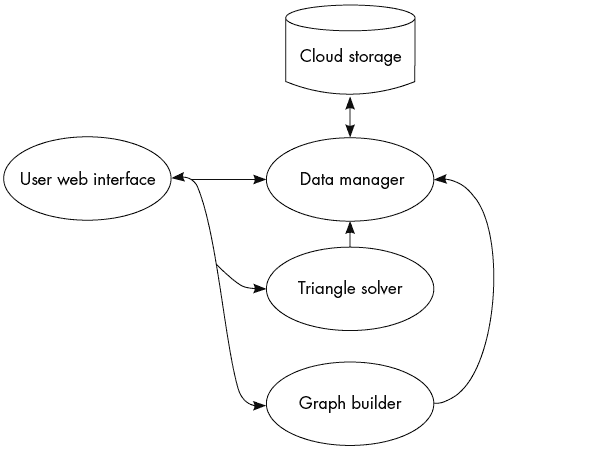

# 13

交付 Python 应用程序

一旦你觉得自己已经达到了最小可行产品的要求，就该开始关注交付管道了。*交付管道*定义了用户如何获得你的应用程序及其未来的更新。说实话，我通常在项目开始时就定义这些属性，因为它们能让某些开发决策变得更有利或更不利。例如，如果你决定将应用程序部署到云端，将数据保存为本地文件就不像计划将代码作为本地包交付时那么有意义。在本章中，我们将高层次地了解四种潜在的交付管道。每种方法都有丰富的资源材料帮助你交付项目，因此我将重点介绍每种方法的重要考虑因素、优点和缺点。

除了讨论每种方法的交付方面，我还会谈论卸载过程。MVP（最小可行产品）中人们常常忽视的一个部分是卸载功能。我认为，拥有一个良好、干净的卸载功能是成为优秀软件供应商的关键之一。你的卸载程序的目标应该是让用户不需要做任何清理工作。如你所见，有些方法比其他方法更容易实现这一点。

选择交付方法的一个主要影响因素是你是否计划通过应用程序获利，以及如何获利。例如，如果你想向用户收取订阅费，你可能希望跳到“通过云微服务分发”或“使用 PyArmor 授权”这两个章节，它们都能让你定义谁可以访问你的应用程序。缺点是这两种选择都不是免费的，因此，如果你不打算对应用程序的访问收取费用，使用 GitHub 通过设置脚本分发应用程序，或预打包应用程序及其所需的所有文件可能会更具成本效益。

## 使用设置脚本

分发 Python 应用程序最简单的选择是使用一个名为*setup.py*的特殊配置脚本，它为底层系统配置了运行代码所需的库和支持文件。如果你曾在手动下载 GitHub 仓库后安装过 Python 模块，那么你可能遇到过这种方法。更一般而言，使用这种方法打包的代码要求用户安装一个名为 setuptools 的库，它根据你在设置脚本中定义的结构来处理安装。你可以通过阅读 PyPi 文档了解有关设置脚本的结构和选项（[`pythonhosted.org/an_example_pypi_project/setuptools.html`](https://pythonhosted.org/an_example_pypi_project/setuptools.html)）。

使用这种方法的主要好处是你可以将项目托管到 PyPi，这样用户就可以通过 pip 工具轻松安装它。当你从 PyPi 安装一个项目时，pip 工具会从你定义的存储位置拉取适当版本的项目（通常是一个公开的 GitHub 仓库，虽然也有其他选择）。用户无需手动下载代码库或运行设置脚本，这些都在后台处理。

然而，这种方法也有一些明显的缺点。首先，利用这种方式很难对代码进行货币化。没有控制机制来阻止用户将源代码复制到其他机器上。也没有原生的方式来卸载已安装的代码，这意味着即使你找到了货币化的方式，也只能收取一次性费用，无法实施类似订阅计划的收费模式。其次，设置脚本依赖用户从命令行安装应用程序。如果你预期用户熟悉这个过程，这没问题，但对于普通用户来说，这并不是交付应用程序的最佳选择。最后，这种安装方式会对用户的底层系统进行更改，安装并配置软件包。虽然这种方式大多数情况下可以正常工作，但对系统进行任何更改都有可能导致损坏某些内容、与现有文件发生冲突等。如果用户没有在隔离的虚拟环境中安装应用程序，就会有很大的风险与用户安装的其他应用程序发生不兼容的库版本冲突。

使用这种方法安装的应用程序在卸载时会遇到一些问题，通常需要用户从系统中移除相关依赖和其他资源。如果你选择这种方式，我建议让用户使用独立的虚拟环境。如果用户没有在隔离的虚拟环境中安装应用程序，试图帮助卸载依赖可能会破坏系统上其他应用程序的正常运行。另一方面，如果用户确实将所有内容都安装在自己的虚拟环境中，卸载就像删除环境一样简单。

我建议对于开源应用程序和那些没有足够资源支持复杂交付管道的小型项目使用设置脚本方法。一旦你有了账户，你可以在几分钟内将模块和设置脚本部署到 PyPi。设置脚本也是理解更复杂部署（如云服务）的一个良好入口点，因为在某种程度上，所有这些方法都需要了解代码运行所需的依赖关系。总体来说，这是每个 Python 开发者都应该熟悉的可靠交付方式。

## 使用 Python 解释器进行打包

下一个选项旨在通过减少用户的工作量，解决设置脚本方法的一些缺点。其理念是将代码、支持文件和 Python 解释器打包到一个单独的档案中，并交付给用户。用户只需要将档案解压到他们系统中的一个目录，就可以准备好运行应用程序。

与设置脚本相比，这种方法能够带来更好的变现方式。通过将打包后的应用程序下载托管在网站后面，您可以向用户收取每个新版本的费用，或者您可以向该网站收取月度订阅费，其中包括对最新版本的下载访问权限。尽管没有任何东西可以阻止用户支付一次费用并永久保留该版本，但他们也有动机维持他们的账户，以便访问最新功能。

为了处理打包，我使用了 PyInstaller，这是一款免费的应用程序，帮助收集必要的文件，使您的程序独立运行，即无需配置底层系统即可运行。使用这种方法进行打包通常被称为*冻结*应用程序，因为它收集了系统中当前版本的所有依赖项和已安装的 Python 解释器的副本，然后将它们打包，使得包含的解释器只会使用那些打包的库来运行。这里的优点是，您不需要担心安装了哪个版本的包，或者它是否会与用户机器上的其他应用程序发生冲突。缺点是，如果在冻结应用程序后需要更新其中一个底层库——例如，为了减少某个依赖项中的安全风险——就需要发布补丁或新的应用程序版本进行分发。如果用户没有应用补丁或下载最新版本（这种情况非常普遍），他们的系统就会面临风险。

另一个缺点是大多数冻结应用程序的体积。为了确保内部代码正常运行，通常会将整个标准库与其他依赖项一起冻结。庞大的代码库和 Python 解释器意味着即使是简单的应用程序也可能最终达到几个兆字节。PyInstaller 尽其所能来最小化冗余，并且您可以配置它以进一步减轻体积，但最终，使用这种方法时总会有额外的冗余。

就像能量一样，复杂性并不会消失。将复杂性从用户身上转移到自己身上。为了使冻结交付方法有效，你需要为每种你想要支持的系统类型创建不同的包。例如，你可能最终会有一个名为*agp_linux64_amd.tar.gz*的包，适用于拥有 AMD 处理器的 64 位 Linux 系统用户，另一个名为*agp_win64_intel.zip*的包，适用于在 Intel 平台上运行的 64 位 Windows 用户，依此类推。为了打包每一个包，你需要访问一个操作系统副本，用于打包系统文件。在开发过程中，我使用 VirtualBox 配合每个操作系统的副本作为虚拟机，并预配置好合适的依赖项和 Python 版本。我喜欢这种方法，因为它允许我通过 VirtualBox-manager 应用程序和一些自定义脚本来自动化多个平台的构建过程（[`www.virtualbox.org/wiki/Documentation`](https://www.virtualbox.org/wiki/Documentation)）。

对于 Windows，你面临一个独特的情况。在撰写本文时，一些必要的驱动程序受到微软许可证的保护。未经授权分发这些库到你的应用程序中，可能会违反微软的服务条款，甚至可能导致你因被认为造成收入损失而承担责任。需要注意的是，如果最终用户已经拥有这些库的副本（通常情况下是这样），那么将应用程序发送给他们就不会违反微软协议。可以说：何时以及如何为 Windows 提供预打包的 Python 应用程序是一个灰色地带。不要将此解释为法律建议；我不是律师。我建议你咨询你所在地区专门从事技术许可证知识产权争议的律师，他们能够帮助你避免任何法律风险。

如果你想为用户提供独立版本的应用程序，冻结你的应用可能是一个不错的选择。独立项目的好处在于它易于设置和从机器上删除——卸载操作可以像删除一个文件夹一样简单。在很多情况下，冻结的应用程序甚至可以从 USB 存储设备运行，这意味着你可以随身携带它，并且不需要在系统上安装代码就能使用！

## 使用云微服务进行分发

部署到云端对不同的人来说意义不同。你可以认为使用某些数据存储服务（例如亚马逊的 S3 或谷歌的云存储）托管前面消息中的包，并在同一供应商提供的虚拟机中托管网站，构成了一种云部署。的确，在那个时候，交付管道是云服务，但应用程序本身仍然会被用户下载并在本地运行，所以我不认为这是一种真正的云服务。

对我来说，云部署的大多数功能代码都运行在由服务提供商（如谷歌或亚马逊）托管的基础设施上，这意味着你的应用程序是以功能状态提供给用户，而不是将源代码发送给他们运行。在本章的其余部分，我将避免提到任何特定的服务提供商。全球两大云提供商——谷歌云平台（GCP）和亚马逊网络服务（AWS）——大致提供相同的功能，因此我认为讨论这些概念更有益。你可以根据这些概念，学习如何在你选择的特定服务提供商上应用它们。

用户通常会通过某种网站访问你的软件，而不是下载代码进行托管。虽然也可以拥有一个用户端应用程序作为与云结构交互的界面，但这种做法不太常见，因为它会增加已然复杂的过程的复杂度。代码被拆分成称为*微服务*的小块，每个微服务处理应用程序的一小部分。

图 13-1 展示了 AGP 项目的简化微服务架构。

图 13-1：微服务架构图

每个椭圆代表应用程序的一个小部分，它在虚拟机中运行，虚拟机仅具备足够的资源来执行该功能，然后在不再需要时消失。一个好的微服务部署的关键在于将功能清晰地分离到不同的服务中，并高效地管理服务之间的通信（图中的黑色箭头）。

在图 13-1 中，我将项目分为四个服务。用户界面被移到一个网站中，该网站可能使用 HTML5 进行交互式绘图，并使用 JavaScript 与其余的服务进行通信。JSON 是一个很好的通信协议选择，因为服务之间的通信大多是通过 HTTP 请求处理的，并且两种使用的语言（Python 和 JavaScript）都能轻松处理这种格式。数据管理服务包含保存和加载用户项目数据的功能。

许多微服务设计的一个限制是它们缺乏一个永久性的文件系统来提供文件。你可以通过创建一个持久存储位置来克服这一点，或者将存储位置设置为持久的数据库实例。事实上，凭借一些创造力，你可以使任何网络可访问的存储位置都适用于这个目的。无论如何，将数据管理服务置于其他服务和存储容器之间，意味着数据管理服务是唯一需要知道如何从云存储容器中读取和写入的服务。如果你决定以后迁移到不同的存储方式，你只需要更新一个服务。

图形构建服务包含了应用程序管理画廊图形表示的所有功能。它与用户网页界面（接收表示图形的 JSON 数据）和数据管理器（在完成后保存信息）进行通信。三角形求解服务包含了管理画廊多边形表示的功能，包括最终使用三角形库求解每个楼层的代码。它还与用户网页界面服务和数据管理器服务进行通信，处理代码的输入和输出。

Docker 非常适合微服务，因为它允许你配置每个虚拟机，仅包含运行服务代码所需的部分，这使得虚拟机创建速度更快，运行更安全。你可以使用 Docker 容器在大多数云服务提供商上定义这些微小的机器（[`docs.docker.com`](https://docs.docker.com)）。此外，你还可以使用像 Kubernetes 这样的容器编排平台，根据需要自动管理每个服务容器的创建和删除。

自动创建更多应用程序实例以提供给用户的过程叫做*横向扩展*。利用平台的横向扩展功能将使你的应用程序能够无缝适应处理需求的变化。你可以为每个服务单独定义规则，这意味着你只会扩展那些需要扩展的应用程序部分，其他部分则保持不变。例如，假设你的应用程序有 20 个用户同时请求不同楼层平面图的解决方案。在传统架构下，三角形服务必须处理所有 20 个请求，因此队列中的最后一个用户的等待时间会比第一个长。而使用横向扩展时，编排引擎会看到需求增加，并添加 19 个三角形求解服务的副本。这些副本会并行运行，因此所有请求都可以同时处理。另一方面，20 个用户使用一个网页服务器通常没有问题，所以你不会希望编排平台添加更多的用户界面服务副本。通过为每个服务单独配置自动横向扩展规则，你可以节省未来维护的时间。这是你可以利用的第三种并行形式：*硬件并行性*。它类似于第十二章 中讨论的进程并行性，只不过工作是分布在不同的机器上，而不是同一机器的不同核心上。

云微服务方法可能是最初实现起来最复杂的，但其带来的好处也很多。我们已经看到，它的灵活性可以允许快速迭代并减少维护时间。另一个好处是，你可以更轻松地实现应用程序的货币化，且掌控度更大。由于源代码从未发送给终端用户，他们必须保持账户才能继续访问服务。如果他们决定停止使用该服务，通常也没有什么需要卸载的东西。用户所需要做的就是终止账户，服务即告消失，从这个角度来看，这是最干净的退出方式。

你可以根据需要运行多个版本的应用程序以服务用户。大多数云服务提供商提供应用层流量路由功能，使你能够根据定义的规则智能地将流量引导到应用程序的不同副本。Kubernetes 也有一些流量路由功能，可以用来实现相同的效果。你可以使用流量路由功能，在将更改分发给所有用户之前，有选择地进行 Beta 测试，或者定义单独的测试版和生产版（称为*A/B*或*蓝绿测试*）。^(1)

最后，更新完全由你掌控。用户在你更新后会自动访问到最新的生产版本。通常，微服务是分阶段构建的。每个项目的阶段可能有所不同，但大致上遵循以下几个阶段：代码推送、持续集成测试、Docker 容器构建，最后是服务部署。代码推送你可能已经非常熟悉了。它是在你将一些更改推送到代码仓库时发生的（例如，使用命令`git push`）。推送代码会触发持续集成测试。这些测试旨在确保你的更改不会引入常见的 bug（[`circleci.com/blog/proactive-integration-testing`](https://circleci.com/blog/proactive-integration-testing)）。

主要的缺点是与构建和维护确保应用程序无缝运行所需的服务网络相关的金钱和时间成本。每个云服务提供商都有自己独特的实现方式，而且这些组件本身要求你了解像 Docker 和 Kubernetes 这样的辅助应用程序。如果你决定将应用程序部署到云端，你将需要花些时间学习你所选择平台的独特性。拥有一支开发团队来支持你的云部署工作也是有益的。

你不能指望在构建一个稳固的云部署管道时，成为所有不同组件的专家。在我的职业生涯中，我很幸运与一些领域内最优秀的云工程师共事，我学到的就是强大团队的价值，团队由不同的专家组成。拥有一个专注于架构的人员、另一个专注于用户界面的人员，以及第三个编写主要服务代码的人员，意味着工作可以更快完成；这就是并行开发。拥有团队还使每个人能够专注于他们最擅长的领域，并使你的项目受益于更多的专业知识。当然，管理一个开发团队也带来了许多问题：个性冲突、交付日期延误等等。决定使用开发团队意味着你还需要一个人来负责团队成员之间的沟通和协调（称为*项目经理*）。云部署是所有现代软件即服务（SaaS）公司的核心，因为其长期的收益远远超过了最初的开发成本。当然，云部署可能不是仅有少数计划用户的小项目的最佳选择。

## 与 PyArmor 的许可

下一个方法有点特别。PyArmor 是一个命令行工具，用于混淆 Python 源代码。它在概念上类似于独立应用程序，因为你仍然会向用户交付一个可执行文件，但 PyArmor 尝试确保你的 Python 应用程序只在经过批准的机器上保存和运行，旨在保护你的知识产权，并帮助你将交付给用户的可执行文件进行货币化。*混淆*是隐藏代码的结构和操作的过程，从而使得应用程序在没有适当的去混淆技术时无法运行。混淆的一个例子可能是将字符串 `"Hello from PyArmor"` 改为类似于 `"H7ejl8l3ocb1fRr4osm9blPjy9Afr4mvo0rp"` 的内容。该应用程序会混淆常量和字面字符串以及每个函数的运行时代码。如果有人试图读取你的源代码，无论是在静态文件中还是在内存中，他们将遇到一堵乱码的墙。

混淆应用程序的源代码还使你能够将应用程序绑定到单一的机器上，并且能够远程使应用程序过期。你的代码被隐藏在一个启动应用程序后面，该应用程序包含适当的去混淆技术。PyArmor 启动脚本检查用户安装应用程序时创建的许可文件。该许可文件使用一些唯一的机器属性，确保每次启动时都在同一台机器上运行。

你还可以定义一个许可证服务器，管理每个许可证的有效性。在每次启动时，你的应用程序会调用许可证服务器并传递它的许可证标识符。然后，服务器可以返回一个经过身份验证的消息，告知应用程序是否应该允许自己执行。当然，这依赖于用户每次运行软件时都能访问网络，这可能适用于你的项目，也可能不适用。

混淆不应与加密混淆，它显然不能提供强加密方案的安全性。使用加密时，你可以通过某种形式的秘密信息来提供数学上的安全证明。这个秘密越大，越难以猜测，应用程序就越安全。另一方面，混淆更像是伪装：它旨在防止通过逆向工程或绕过许可限制的简单尝试。然而，一旦有人理解了代码是如何被混淆的，他们总能逆转这个过程。回到我之前的例子，如果你更仔细地检查第二个字符串，你可能会意识到我所做的只是将随机字符插入到短语的字母之间。接下来，我将空格替换为常量字符`b`。通过逆转这个过程，将偶数位置的`b`字符替换为空格，并去掉每隔一个字符，你就能把混乱的字符串恢复成原始短语。更糟糕的是，处理去混淆的启动脚本本身无法被混淆，这意味着所使用的技术对任何希望查看的人都是公开的。（如果它能被混淆，你将会创造一个反馈循环，因为你需要一个去混淆器来去混淆去混淆器。）借用锁匠世界中的一句话：“足以让诚实的人保持诚实。” 根据混淆的级别，这可能只能让一位优秀的逆向工程师浪费几个小时。

尽管有一些明显的限制，我并不会完全否定 PyArmor。如果你计划通过独立包交付方式来实现盈利，PyArmor 可能是一个不错的补充，因为它确实为这个过程增加了一些控制和监控。你不能保证你的控制不会被绕过，但它肯定比没有应用混淆和许可的独立应用程序更不容易被绕过。PyArmor 的另一个潜在用途是跟踪活跃用户的数量。即使你不打算从你的项目中盈利，拥有许可证也能通过查看哪些许可证已经签到（意味着应用程序已经启动）来估算用户数量。随着你的项目受欢迎程度的提升，你可以利用这些估算来吸引投资者的兴趣，或者有可能将项目出售给更大的 SaaS 提供商。

## 开源交付

没有什么比开源交付选项更合适的结尾了。迄今为止，交付你的项目并回馈社区的最简单方法就是公开授权你的项目源代码，让每个人都能使用。开源软件许可证本身就促进了协作和共享，因为它们允许其他人对源代码进行修改，并将这些修改纳入自己的项目中。通过将你的代码库托管在公共 GitHub 仓库（或类似平台）上，你可以享受众包开发的好处，获得潜在用户的反馈，减少托管成本，等等。开源项目促进了多元化视角的协作。来自全球不同地区的人们可以汇聚一堂并做出贡献。人们解决问题的方式各异，因此，来自不同背景的人们的贡献可以将你的项目推向一个你自己，即使是有传统开发团队的情况下，也无法达到的功能水平。

一个常见的误解是，“开源”就意味着你无法从应用程序中获利。这完全不正确！虽然大多数开源项目的起点并非为了盈利，但维护一个大型开源项目——比如 Kubernetes——确实是一项巨大的工作！它需要几个全职开发人员，而这些开发人员大概率希望能从他们的工作中获得报酬，因此开源项目往往会衍生出成功的公司。项目通常会与云交付选项结合开源，以提供免费版本和付费版本。公司会支付这些云托管版本的费用，从而减少需要在内部维护的系统数量。Red Hat——一个维护最受欢迎的企业级 Linux 发行版的公司——就是遵循这一模式的大型开源公司之一。虽然 Red Hat 继续提供许多应用程序的开源版本，但它也提供付费定制和远程支持来维持业务。简而言之，选择开源代码通常能减少你的压力，并推动项目取得更好的成果，但你并不需要牺牲盈利能力。在考虑应用程序交付方法时，我强烈推荐你研究开源路线。

## 总结

将你的应用程序部署供一般用户使用，可能看起来像是一个独立的项目。正如你所看到的，有几个因素应当影响你选择的方法。这些因素包括你计划服务的用户数量，以及你是否打算收费。正如我在章节开始时所说，你应该在开始项目时就确定交付平台的基本概念。一旦你决定了如何交付应用程序，你可以根据这个选择来影响你其他的开发决策，比如可供你的代码使用的存储选项。

到此时，你应该已经对可用的选项以及每个选项的优缺点有了一个大致的了解。你可以从这些基础出发，深入了解最适合你需求的过程。不管你选择哪种方法，记得从用户的角度以及开发者的角度思考。对用户要友好，提供直观的方式来安装、管理和删除你的应用。

互联网上充满了学习软件部署计划的资源，从非常简单到极其复杂的都有。也有一些非常棒的书籍涉及各种部署技术，如 Docker 和 Kubernetes（[`bookauthority.org/books/new-continuous-delivery-books`](https://bookauthority.org/books/new-continuous-delivery-books)）。我建议从小规模开始，逐步提高。如果你从未使用过 Git，直接跳入云部署将会让你感到沮丧。可以从像 PyPi 这样的工具入手，它将帮助你磨练你的仓库管理技能。一旦你对每个基本组件都感到熟悉，你将更有准备来应对大型云部署过程。

到这里，我们已经完成了本书的内容！如果你已经掌握了所有的概念和项目，我向你表示祝贺！希望你能感受到应用数学在安全工具中可以发挥的作用。如果你从本书中获得任何收获，我希望那就是：你可以仅凭基本的数学知识和编程理解来应对看似复杂的研究课题。像人脸识别、隐私监控和社交网络分析等话题现在可能占据了所有的头条，但在更广泛的安全领域中，仍有大量未解的研究问题，而这些问题都可以从像你这样的才华横溢且专注的研究人员中受益。如果有某个特定的领域引起了你的兴趣，我鼓励你将学到的概念应用到那个领域中。本书所涵盖的领域都能极好地适应多种兴趣方向，当你将它们结合在一起时，可以实现非常强大的分析工具。

在将安全应用到现实世界中时，最可怕的部分就是在不确定性面前做出决策，毕竟一个错误可能会付出生命的代价。像前几章所展示的分析工具，能够让我们从不同的角度审视世界，并做出最有依据的决策。你可能无法完全消除不确定性，但你可以将其对自己和周围人的影响降到最低。记住：安全不仅仅是一份工作或职业道路，它更是一种理解世界的方式。未来的安全应用将依赖于准确地收集、解读和回应来自我们物理和数字环境的数据，以帮助我们更好地理解世界。
