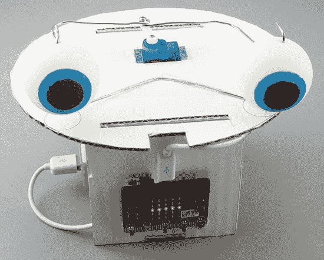

## 前言

自 2016 年 BBC 发布 micro:bit 以来，数百万个 micro:bit 设备已被分发到世界各地。它们受到全球儿童和成人的喜爱。micro:bit 的设计目的是作为一种简便的方式教授孩子们编程技能。它的一个大优势是，使用它只需要一根 USB 电缆和一台计算机。此外，一旦编程完成，它可以断开电源并通过电池运行。

micro:bit 配备了一个小型 LED 显示屏以及光线、运动和磁场传感器，因此它具备了制作有趣项目所需的所有功能。当你准备好时，你可以通过鳄鱼夹轻松连接电动机、传感器和扬声器——无需焊接。换句话说，你的 micro:bit 可以成为许多项目和发明的*大脑*。

### 关于本书

在本书的这些页面中，你将找到各种实验和项目。实验展示了事物的工作原理，然后在项目中，你将使用这些知识制作有趣的东西。

本书共分为 10 章。第一章将告诉你如何连接和使用 micro:bit。你将在本书中的所有实验和项目中使用这些信息。接下来的每一章都涉及一个特定的主题，如光、声音和运动。你可以用 micro:bit 做很多有趣和有用的事情！

#### 实验

这里列出了本书中的实验：

**生成声音** 学习让你的 micro:bit 播放音乐音符和其他声音。

**它会说话！** 教你的 micro:bit 学会说话！

**感应光线** 使用内置的光线传感器。

**测量磁场** 使用内置的磁力计感应磁铁。

**手势** 使用 micro:bit 的手势识别软件，当你摇晃、掉落或投掷它时，让设备执行不同的操作。

**实时加速度绘图** 了解 Mu 的数据显示功能。

**将数据加速记录到文件** 记录由 micro:bit 检测到的数据，方便你以后查看。

**让伺服电机转动** 尝试使用电动机！

**计时** 了解 micro:bit 如何计时。

**你的神经反应有多快？** 测试你的反应时间。

**测量温度** 使用 micro:bit 的温度传感器制作温度计。

**找到无线电范围** 学习如何使用 micro:bit 进行无线电通信。

#### 项目

这里列出了本书中的项目：

**音乐门铃** 按下时播放你选择的旋律

**声音测量仪** 检测声音并显示声音的响度

**自动夜灯** 房间变暗时自动打开

**光吉他** 当你在 micro:bit 的 LED 灯上方挥动双手时，它会发出音乐

**无限镜** 利用光线创造无限深度的幻觉

**指南针** 一个真正工作的指南针！

**磁性门警报** 当你打开门时，磁铁与 micro:bit 分离，触发警报

**刷牙监测器** 测量你的刷牙动作，确保你的牙齿保持健康

**加速度显示器** 显示 micro:bit 加速度的计量表

**仿生机器人头** 一款具有活动眼睛和会说话的嘴巴的机器人头

**机器人漫游车** 一款双轮的 micro:bit 机器人！

**二进制时钟** 使用 LED 显示时间

**语音时钟** 每小时报时，并在你按下按钮时报时

**谎言探测器** 通过测量皮肤中的电流来判断某人是否在撒谎

**温度与光照记录器** 自动记录光照和温度水平

**自动植物浇水器** 当感知到土壤过于干燥时会自动给植物浇水（再也不用担心杀死植物！）

**无线门铃** 一款无线升级的门铃项目，使用无线电波

**Micro:bit 控制的漫游车** 一款无线版本的漫游机器人，通过无线电接收你的指令

### 代码与资源

用于编程 micro:bit 的两种最流行的计算机语言是 Makecode Blocks（本书中简称 *Blocks*）和 MicroPython 编程语言。

在可能的情况下，我为项目和实验提供了 Blocks 和 MicroPython 两种编程方式的程序。这意味着你无需亲自输入代码——除非你愿意。

你可以在本书的配套 GitHub 页面找到所有活动的代码： *[`github.com/simonmonk/mbms/`](https://github.com/simonmonk/mbms/)*。我在第一章中提供了访问和使用代码的完整说明。
