## 第一章：**入门**

本章将帮助你入门 BBC micro:bit。这也为接下来的实验和项目奠定了基础。我会给我们的疯狂科学家（就是你！）一些关于如何使用 micro:bit 的想法，并帮助你开始编程。你将学习如何使用 Blocks 代码和 MicroPython。

疯狂科学家通常太忙、太分心，无法输入大量代码，所以本书中使用的所有代码都可以下载。本章将解释如何获取和使用这些代码。

### micro:bit 介绍

让我们快速了解一下 micro:bit 和它上面的内容。

#### 顶部

图 1-1 展示了 micro:bit 的顶部。

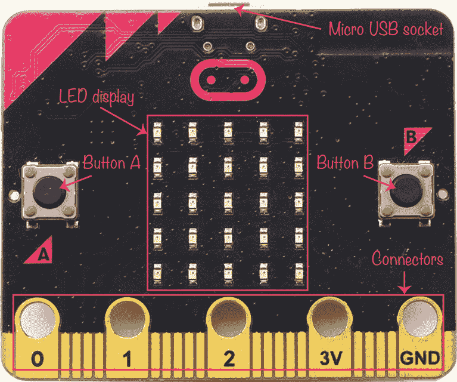

*图 1-1：micro:bit*

在板子的顶部有一个 micro USB 插口，用来将 micro:bit 连接到电脑。你将在电脑上为 micro:bit 编写程序，因此你需要通过 USB 连接将程序传输到 micro:bit。这个 USB 插口也能为 micro:bit 提供电源。

左右两边各有一个按钮，分别标记为 A 和 B。我们可以编程这些按钮来触发某些操作，比如在 LED 上闪烁图像或发出门铃声。

在两个按钮之间，有一个由 25 个 LED 组成的网格，排列成 5 行 5 列。这是 micro:bit 的显示屏。尽管它只有 25 个 LED，这个显示屏仍然可以显示滚动的文本信息、小图像、图案——非常多的内容！

在 micro:bit 的底边有一条镀金（是的，真金！）的条形连接器，称为*边缘连接器*。这条连接器上有五个孔，标记为 0、1、2、3V 和 GND。这些较大的连接器可以让你使用鳄鱼夹将其他设备连接到 micro:bit。例如，你可以连接一个扬声器让 micro:bit 发出声音，或者连接一个电机让它运动。而更小的连接器，即孔与孔之间的缝隙，只能使用特殊的适配器连接。在本书中，除了两个需要适配器连接电机控制器的机器人项目外，我们将使用这些较大的连接器。

#### 底部

现在让我们把 micro:bit 翻过来，看看它的底面（见图 1-2）。

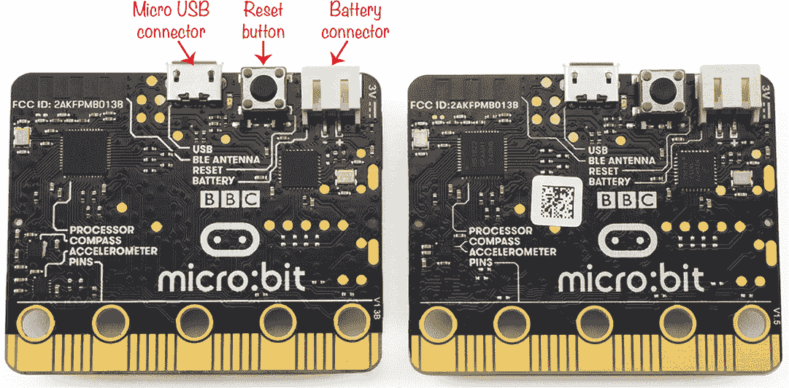

*图 1-2：micro:bit 的底面，版本 1.3B（左）和 1.5（右）*

截至本书编写时，市面上有两种版本的 micro:bit。两种版本的工作方式相同，对于本书来说，你使用哪个版本都无所谓。最新的版本（1.5）只是设计略有简化。你可以在图 1-2 中看到两款板子的区别，区别在左下角。

最左边的连接器是 micro USB 连接器。紧接着右侧的是一个按键开关。这是 micro:bit 的*复位按钮*。按下这个按钮会导致 micro:bit 重新启动上面安装的程序。复位按钮右侧是电池连接器，可以让你将一个 3V 电池包连接到 micro:bit。

现在我们将仔细查看每个部分，从如何为 micro:bit 供电开始。

#### 电源和 Micro:bit

你可以通过 USB 连接器或电池为 micro:bit 供电，取决于你希望如何使用它。

##### 使用 USB

当你将 micro:bit 插入电脑时，USB 连接会为 micro:bit 提供 5V 电压。然而，micro:bit 只需要 3.3V，而不是 5V，过高的电压可能会损坏 micro:bit。因此，它有一个 USB 接口芯片，将 5V 电压转换为 micro:bit 所需的 3.3V。

当 micro:bit 通过 USB 连接时，你可以使用边缘连接器上的 3V 接口为低功耗电子设备供电，比如外部 LED 或设计为与 micro:bit 一起使用的扬声器。

**注意** *这个连接被标记为 3V 而不是 3.3V，部分原因是没有足够的空间再写一个数字，但也因为保护电路会将 3.3V 电压降低到接近 3V 的电压。*

标有 GND 的连接是*地*或 0V 电源连接。当你为 micro:bit 供电时，电流从 3V 连接端流出，并且需要通过 GND 连接返回 micro:bit，才能完成电路。

##### 使用电池

一旦你为 micro:bit 编写了程序，可能会希望将它移离电脑，这时你就需要电池。你可以使用 AAA 电池包，像图 1-3 中所示的那样。只需将电池包的两端连接到 micro:bit 底部的 3V 插座。

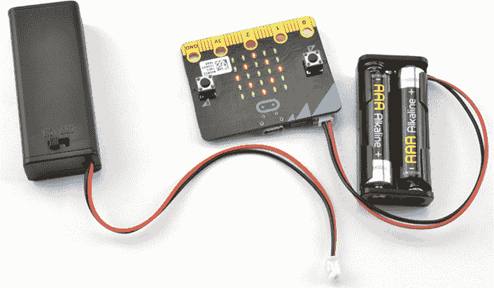

*图 1-3：micro:bit 电池包*

附录列出了一些你可以购买这些电池包的地方。内置开关很有用，因为你可以在不拔掉电池包的情况下关闭 micro:bit，这是一个相对复杂的操作。

不要使用可充电的 AAA 电池，因为它们的电压通常太低，无法为 micro:bit 提供足够的电力。这些电池如果发生意外短路，还可能导致危险的高电流。如果你想使用可充电电池，一个选择是像图 1-4 左侧所示的 USB 电池备份。

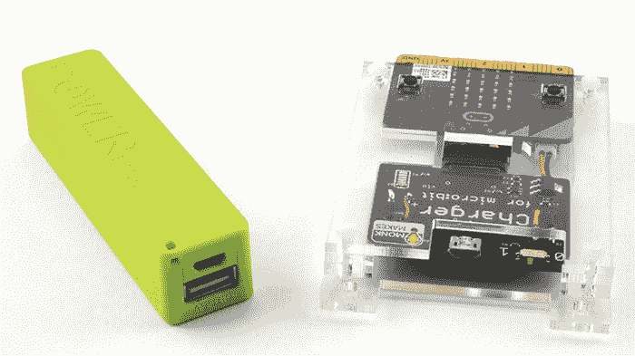

*图 1-4：使用可充电电池为 micro:bit 供电*

这些可充电电池允许你通过 USB 端口为 micro:bit 供电。低容量、价格便宜的备用电池通常比更昂贵的版本更适合为 micro:bit 供电。micro:bit 消耗的电流非常小，这些更先进的电池往往会在认为电池长时间未使用时自动关闭，因此它们可能会错误地认为没有连接设备。

图 1-4 右侧的项目是 Monk Makes 微型充电器。它使用一块锂聚合物（LiPo）电池，每当你通过 USB 线将充电器连接到计算机时，它会自动充电。当你希望使用电池运行 micro:bit 时，只需拔掉连接充电器的 USB 线。

你可以在附录中了解更多关于为 micro:bit 供电的选项。

**警告** *micro:bit 的早期版本在与 USB 电池和电源一起使用时容易受到损坏。如果你使用的是 V1.3B 或 V1.5 版本之外的任何板子，应该避免使用除计算机 USB 端口或 3V 电池组之外的任何电源。*

*早期的 micro:bit 没有版本号。翻转你的 micro:bit，查看底部右角靠近连接口 0 的地方。如果上面写的是*V1.3B*或*V1.5*，那么使用 USB 电池组和电源是可以的。如果你在这里看不到版本标识，最好不要使用这些电源。*

*无论如何，都应避免使用被描述为*高功率的电源和 USB 电池。

*你可以阅读 micro:bit 基金会的完整安全建议，地址是* [`microbit.org/guide/safety-advice/`](https://microbit.org/guide/safety-advice/)。

#### 连接电子设备与输入/输出引脚

关于 micro:bit，有一件特别有趣的事情是，你可以利用它的连接口连接自己制作的电子设备。在本书中，你将构建一些项目，使用这些连接器来控制电机、灯光和扬声器。你还将使用它们作为输入，收集来自传感器的数据，这些传感器能够测量光线、声音和温度。

3V 和 GND 连接口用于供电。标有 0、1 和 2 的连接口通常被称为*输入/输出引脚*，你将在这些引脚上连接电子设备。

**注意** *你可能会好奇，为什么我们称这些为*引脚*，它们看起来和引脚完全不同。术语*引脚*来源于 micro:bit 连接的电路板上的芯片。该芯片上确实有引脚—每个引脚都有一个微小的腿形连接。*

引脚 0、1 和 2 可以用于：

  数字输出—例如，控制外部 LED 的开关

  模拟输出—例如，用来控制 LED 的亮度

  脉冲生成—例如，用来控制伺服电机

  数字输入—例如，当外部按钮被按下时进行检测

  模拟输入——例如，使用模拟温度传感器来测量温度

  触摸输入——用于检测你是否触摸了引脚或连接到引脚的电线

##### 数字输入和模拟输入

当你将引脚用作数字输出时，你可以在程序中编写命令来开启输出（设置为 3V）或关闭输出（设置为 0V），但*只能*是开或关——没有中间状态。数字输入也是如此：它们只能是开或关。当你的程序代码读取数字输入时，如果输入端的电压接近 3V 而非 0V，那么该输入被视为开启；否则，就是关闭状态。

然而，模拟输入的值可以介于开与关之间。micro:bit 上的模拟输入可以是 0 到 1,023 之间的任何值，这取决于引脚的电压。

##### 生成模拟信号：脉宽调制

micro:bit 和所有其他电子设备一样，只能处理数字开关信号。为了获得 0 到 3V 之间的模拟信号，电子设备通过快速的数字脉冲序列来*模拟*模拟信号。脉冲持续时间越长，传递给连接到模拟输出的设备的功率就越大。这就是所谓的*脉宽调制*，或者*PWM*。图 1-5 展示了 PWM 的实际应用。

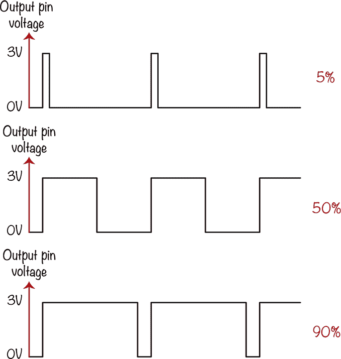

*图 1-5：micro:bit 上的模拟输出提供不同量的功率*

如果输出连接到一个 LED，并且脉冲只有 5%的时间保持在 3V，那么 LED 看起来会发出微弱的光。相比之下，如果脉冲有 90%的时间保持在 3V，那么 LED 看起来将接近全亮。

有趣的是，在这两种情况下，LED 实际上每秒闪烁 50 次，但人眼无法看见如此快速的闪烁。相反，我们只会感知到相对昏暗或明亮的光。

如果三个引脚 0、1 和 2 不足以满足你的项目需求，你可以使用适配器来访问这三个编号引脚之间的多个引脚。

#### 内置外设

micro:bit 底部的文字为我们提供了一些关于 micro:bit 其他功能的线索。左下角的两个区域标记为*指南针*和*加速度计*。

这个指南针实际上是一个*磁力计*，意味着它可以测量磁场的强度。你可以将其用作指南针，但也可以用来检测磁铁的存在。

加速度计测量作用于加速度计芯片的力。由于重力是一个常量，始终拉向地面，通过测量作用在不同方向上的力，你可以利用加速度计检测 micro:bit 何时被倾斜，以及倾斜的程度，还可以检测它是否被摇晃或处于自由落体状态。

在底部，你还会看到*BLE 天线*字样。micro:bit 包含 BLE（蓝牙低能耗）硬件，使得你的 micro:bit 可以与其他 micro:bit 或蓝牙支持的手机进行无线通信。

请注意，micro:bit 之间的通信技术实际上并不是蓝牙；它只是使用相同的频率。第十章专门讲解了 micro:bit 的这一功能。

### 硬件必备

你需要一些东西来完成本书中的几乎所有实验和项目。它们包括：

**Micro:bit**

**Micro USB 电缆** 用于将 micro:bit 连接到计算机（确保这是标准的 micro USB 数据电缆，而不是*充电电缆*，因为充电电缆缺乏必要的通信连接。你不能使用充电电缆将程序加载到 micro:bit 上。）

**鳄鱼夹电缆** 最好不要超过 4 到 5 英寸，以避免缠绕。

**3V AAA 电池组（包含两节 AAA 电池）**

**USB 电源** 只有某些项目需要使用它。（参见之前的警告。）

每个项目或实验都会列出所需的所有物品，本书末尾的附录提供了如何获取这些物品的更多信息。

本书尝试保持项目构建简单明了，除了第六章中的巡逻机器人，其他项目不需要焊接。对于大多数项目，你只需使用鳄鱼夹电缆将各个组件连接起来。使用鳄鱼夹连接时，最好将电缆垂直夹入，这样夹子的齿部就像图 1-6 一样，这样可以大大减少电缆松动的可能性。

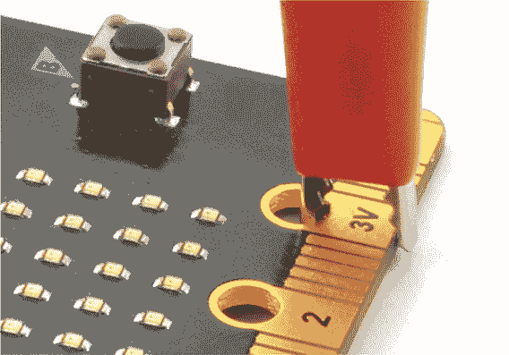

*图 1-6：安全连接鳄鱼夹*

### 编程 micro:bit

疯狂的科学家们可不以耐心著称，所以让我们让我们的 micro:bit 做点事情。首先，我们来编程我们的 micro:bit。

使用 micro:bit 的一个好处是，你只需要一根 USB 电缆和一台带有浏览器及互联网连接的计算机，就可以开始使用它。你可以使用运行 Windows、macOS 或 Linux 的计算机。只要你的设备有现代浏览器（如 Chrome），就可以正常工作。

我们将首先连接 micro:bit。然后我们将通过两种方法制作一个小程序：拖放式块代码和需要手动输入的 MicroPython。

#### 连接你的 Micro:bit

首先，通过 micro USB 电缆将 micro:bit 连接到计算机。几乎所有的 micro USB 电缆都可以正常工作，但请记住，只有充电电缆没有必要的数据连接，因此无法使用。如果按照以下说明编程时遇到问题，请尝试使用不同的 USB 电缆。

一旦你连接了 micro:bit，操作系统应该会像你刚插入 USB 闪存驱动器一样做出反应。要将程序传输到 micro:bit，只需像找到闪存驱动器或其他插入设备一样，在文件系统中找到 micro:bit。然后将一个名为 *hex 文件* 的文件复制到 micro:bit 文件夹图标中，嘿，程序就安装好了。将程序加载到 micro:bit 上也叫做 *刷机*。

让我们创建一个.hex 文件并将其烧录到我们的微型:bit 上。

#### 使用积木编程：Hello World

你可以通过微型:bit 官网来编写程序，无需下载任何软件。我们将编写一个程序，使一些文本在微型:bit 的 LED 显示屏上滚动。打开你的浏览器并访问* [`makecode.microbit.org`](https://makecode.microbit.org)*，你应该会看到一个类似于图 1-7 的窗口。

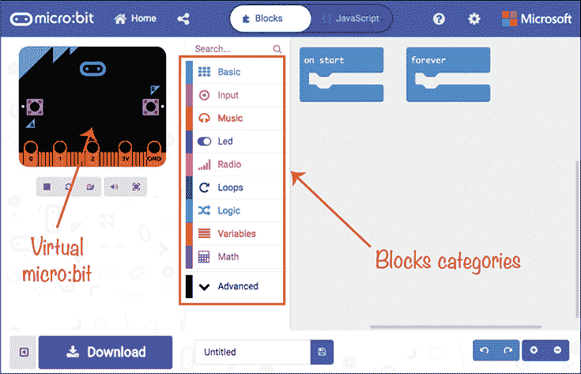

*图 1-7：* [`makecode.microbit.org`](https://makecode.microbit.org) *网页*

这是你编写程序的编辑器。左侧是一个微型:bit 的图像，它像虚拟微型:bit 一样工作，运行你编写的任何程序。

中间的部分是类别列表，如 Basic、Input 和 Music。在这些类别中，你会找到可以拖到右侧工作区的*积木*。每个积木都是给微型:bit 的指令。通过拖动这些积木并将它们连接起来，你将使用积木语言编写代码。

你会注意到，当你打开编辑器时，编辑区已经有两个积木：`on start`和`forever`。任何位于`on start`积木内的代码会在微型:bit 第一次启动、上传新程序，或因为你按下重置按钮而重置时执行。任何位于`forever`积木内的代码将会一遍又一遍地运行，直到你停止程序。

对于我们的第一个程序，我们不需要`forever`积木，所以选择它并按 DELETE 删除它。接下来，你需要将`show string`积木添加到程序中——*string*是编程术语，表示*文本*。为此，点击**Basic**类别，将`show string`积木拖到编程区域，并将其放置在`on start`积木内，如图 1-8 所示。如果你的电脑有声音，你会听到积木拼接时发出的令人满意的*咔哒*声。

现在点击文本气泡并输入`Hello World`。你也可以输入不同的文本——任何你希望显示的内容。

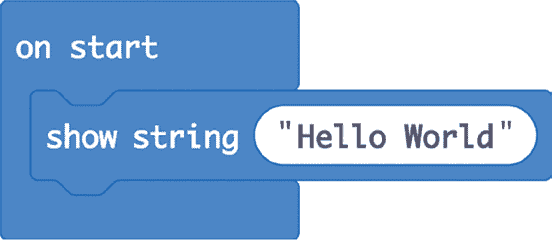

*图 1-8：用于显示* Hello World 的积木代码

一旦你将`show string`积木拖到合适的位置，显示区域左侧的虚拟微型:bit 应会在其显示屏上滚动你的信息，展示程序的效果。

现在让我们把你的程序传输到真实的微型:bit 上。使用 USB 线连接你的微型:bit，并点击网页左下角的**下载**按钮。

这将像从互联网上下载其他文件一样，从编辑器下载文件。文件保存的位置取决于你的操作系统和浏览器，但通常会保存在一个名为*Downloads*的文件夹中。找到这个文件夹，点击进入，你应该能找到一个名为*microbit.hex*的文件。使用文件管理器（或在 Mac 上使用 Finder），选择该文件并将其拖到 micro:bit 上，当它出现在你的文件系统中时（见图 1-9）。

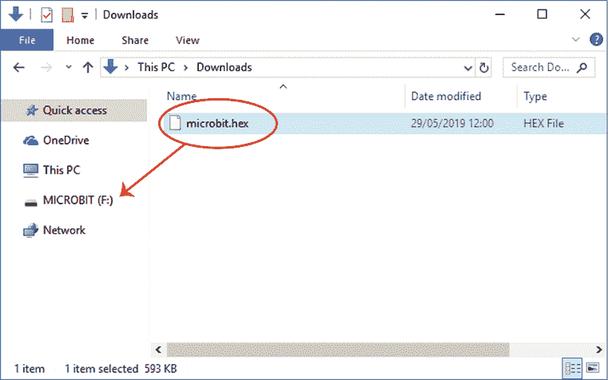

*图 1-9：将文件拖到你的 micro:bit 上*

一旦你松开鼠标按钮，文件应该会开始自动安装到 micro:bit 上。你会知道它正在发生，因为 micro:bit 背面的 LED 将开始闪烁。当闪烁结束时，micro:bit 会重置自己并运行程序，文本会在显示屏上滚动。如果你错过了看到消息，按下 micro:bit 背面的重置按钮可以再次查看。

**直接下载到你的 MICRO:BIT**

大多数浏览器都提供了一个选项，可以在每次下载文件时选择文件保存的位置。你可以利用这个功能将文件直接下载到 micro:bit 上。这样你就不必先下载文件再复制到 micro:bit。

要在 Chrome 浏览器中设置此功能，请前往*chrome://settings/*，点击**高级**，向下滚动到下载部分，然后启用选项**下载前询问每个文件的保存位置**。这样，下次你在编辑器中点击下载时，就会提示你选择文件保存的位置，并且可以选择 micro:bit 文件夹作为目标。

在撰写本文时，通过 Chrome 浏览器将程序烧录到 micro:bit 上即将变得更加简单。你可以在这里阅读有关此功能的更多信息：*[`support.microbit.org/support/solutions/articles/19000084059-beta-testing-web-usb`](https://support.microbit.org/support/solutions/articles/19000084059-beta-testing-web-usb)*。

##### 添加图形

为了显示我们的消息，我们将一个`show string`模块添加到了`on start`模块中。`on start`模块是一种特殊类型的模块，称为*事件模块*，每当特定事件发生时，它会运行与之连接的代码。在这个例子中，事件是程序的启动。

让我们通过添加一个新的事件，使程序变得稍微复杂一点，这个事件将检测到按钮 A 被按下。当你做这个时，点击**输入**类别，将一个`on button A pressed`模块拖入程序区域。接着，从基础类别中拖动一个`show leds`模块到`on button A pressed`模块中。`show leds`模块中的方块表示 LED 显示器中的每个 LED。你可以通过点击方块使其变白来选择应该亮起的 LED。结果应该看起来像图 1-10 那样。

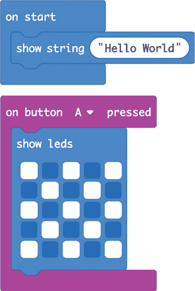

*图 1-10：将 LED 图案添加到程序中*

`show icon`模块有许多现成的 LED 图像，如果你想选择其中的某一个，可以直接选择。再次点击**Download**并将新的 hex 文件复制到你的 micro:bit 上。上传新程序后，你可以通过按下 A 按钮来测试它。按下后，`show leds`模块中选择的 LED 应该会在 micro:bit 上亮起，如图 1-11 所示。

*图 1-11：在实际的 micro:bit 上显示 LED 图案*

##### 保存和共享

*[`makecode.microbit.org`](https://makecode.microbit.org)*网站会记住你的所有项目。为你的项目命名，可以在“保存”区域输入名称，按钮旁边会出现“保存”按钮，你的项目就会被保存。每当你修改程序时，它应该会自动保存，但为了确保，你也可以点击软盘图标手动保存。请注意，当你点击保存时，hex 文件也会被下载，但如果你不准备将程序刷入 micro:bit，只需点击取消即可。

请注意，你保存的程序实际上是保存在浏览器缓存中的，因此如果你删除了缓存，你将丢失程序。

要在程序之间切换并开始新的程序，点击页面顶部的**Home**。

要发布一个程序让其他人看到，点击“Projects”旁边的**Share**按钮。这将要求你确认是否愿意发布项目。再次点击**Share**，你将看到像图 1-12 中所示的链接。

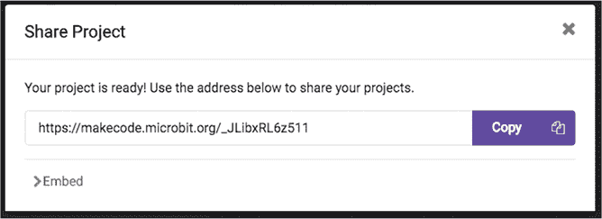

*图 1-12：共享项目*

你可以将那个网址发送给任何人，当他们在浏览器中输入时，他们将获得你的程序副本供使用。请注意，因为这只是你程序的副本，所以他们不会破坏你原始代码的副本。

##### 查找模块

我们到目前为止使用的`show string`和`show leds`模块比较容易找到，但模块编辑器包含了大量的模块，而且它会将你不常用的模块隐藏起来。这样一来，当你开始使用 micro:bit 时，你就不会看到令人困惑的选项。

这些模块有两种方式被隐藏。首先，你可能注意到，当你选择某个模块类别（如 Basic）时，会出现一个标记为*. . . more*的项目（见图 1-13）。

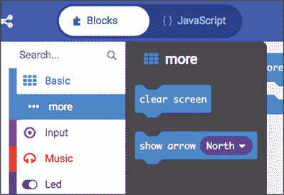

*图 1-13：更多部分中的额外模块*

在“Basic”类别中，更多部分包含诸如`clear screen`和`show arrow`等模块。如果你点击其他类别，你会发现它们都有一个“更多”部分，有些类别还包含了不少额外的模块。

顺便说一下，将鼠标悬停在某个模块上会打开一个小信息框，告诉你该模块的功能。花些时间熟悉各种模块，将激发你关于如何使用 micro:bit 的创意。

第二个可以找到隐藏块的地方是在“高级”类别中，位于数学后面（图 1-14）。选择该类别会显示更多包含 Blocks 语言高级特性的类别，从函数开始。同样，花些时间熟悉这些块。如果你不确定某些块的功能，不用担心。如果你对某个做特定事情的块感兴趣，可以使用搜索框来查找你想要的块。

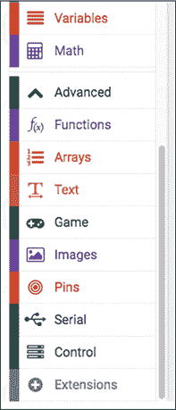

*图 1-14：*高级*块类别*

在“高级”部分，你将频繁使用的类别是文本和引脚。在某些章节中，你还会使用到函数和数组。

#### 使用 MicroPython 编程：你好，世界

Blocks 代码非常适合开始编程，因为你只需几个块就能完成一些非常令人印象深刻的事情。然而，许多人更喜欢编写文本程序，而不是拖动块。输入一行行的文本也更像常规的编程方式。

MicroPython 是一种 Python 3 编程语言的实现，包含了你编写 micro:bit 程序所需的一切。事实上，Blocks 代码中的许多块在 MicroPython 中都有直接的对应项，因此从 Blocks 编程切换到 MicroPython 是相当直接的。Python 是一种流行的初学者编程语言，因此通常在学校教授。

##### 下载 MicroPython 编辑器

我们将使用 *Mu* 编辑器应用程序 (*[`codewith.mu`](https://codewith.mu)*)，它有很多功能。你可以直接将其下载到你的电脑上。Mu 还允许你将程序直接刷入 micro:bit，而无需拖动 hex 文件。Mu 的好处是，一旦下载了 Mu，你就不需要互联网连接也能刷入程序。

从 *[`codewith.mu/#download`](https://codewith.mu/#download)* 下载 Mu。Mu 有多个版本，因此确保你选择适合自己电脑的版本。下载页面会为不同操作系统提供不同的版本。如果你是 Windows 用户，请下载 Windows 安装程序下标注为 *64-bit* 的版本（图 1-15）。如果你是 macOS 用户，只有一个版本。

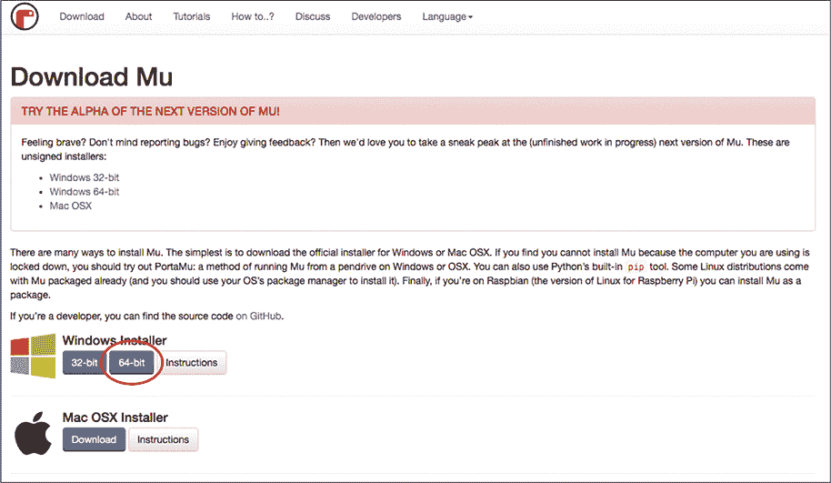

*图 1-15：下载 Mu*

运行安装程序，接受许可协议并选择所有默认选项。

第一次运行 Mu 时，它会提供你选择*模式*的选项。确保选择 BBC micro:bit 模式（图 1-16）。

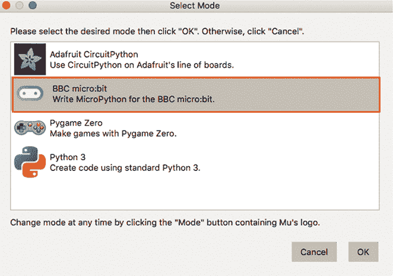

*图 1-16：选择正确版本的 Mu*

Mu 会为你提供一个空白的编辑窗口，在这里你将编写你的第一个程序。

##### 编写程序

让我们试试 Mu！在 Mu 窗口中添加以下代码：

from microbit import *

display.scroll("Hello World")

它应该看起来像是图 1-17。

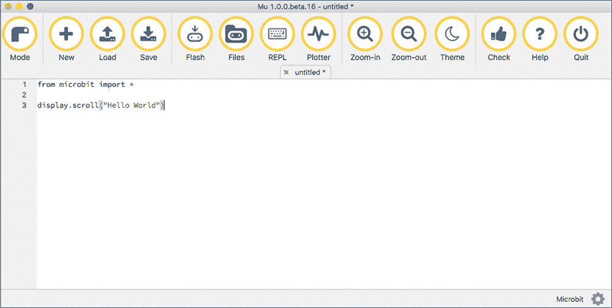

*图 1-17：在 Mu 中编写 MicroPython 程序*

通过点击 Mu 窗口顶部的**Save**按钮保存程序。系统会提示你为程序输入一个名称：将其命名为 *hello.py*。

现在，连接你的 micro:bit 到计算机后，点击 Mu 窗口顶部的**Flash**按钮。这将启动将 hex 文件加载到 micro:bit 的过程，就像你拖动一个由 Blocks 编辑器生成的文件一样。一旦闪烁完成，*Hello World* 信息应该会在显示屏上滚动。

让我们仔细看看代码。这是第一行：

from microbit import *

你会在几乎每个 MicroPython micro:bit 程序的开头找到这一行代码，因为它告诉 MicroPython 包含所有使其与 micro:bit 的显示和其他硬件兼容的内置代码。此代码不会自动包含，因为 MicroPython 可以在许多不同的板子上使用，而不仅仅是 micro:bit。实际上，这行代码的意思是：*从 microbit 库中导入一切*（`*` 表示一切）。你也可以输入`import microbit`，但那样你就必须在每个命令前加上 `microbit`，这会多打很多字。

我们的最小程序中的唯一其他一行代码是在显示器上显示信息：

display.scroll("Hello World")

这一行使用了命令`display.scroll`，它告诉 micro:bit 在显示屏上滚动某些内容。接着，你加了一对括号，括号内有一些被引号括起来的文本。你使用括号是为了在命令中添加额外的信息。在这种情况下，额外的信息（也叫做*参数*）是你想要显示的文本。你还需要将文本放在双引号中，以表明程序应将其视为文本，而不是更多的编程命令。

如果在将程序刷入 micro:bit 时，你看到除了 *Hello World* 以外的内容（或者什么都没有），那么可能是你的代码中有错误。在使用基于文本的编程语言时，你必须准确地输入内容。例如，拼写错误如 `display` 或 `scroll` 将导致程序运行时出错。编程中的错误被称为*bug*。bug 只会在程序尝试在 micro:bit 上运行时才会显现出来。如果你遇到 bug，可以仔细对比你写的代码和书中的代码，确保它们完全一致。但还有另一种找到并修复 bug 的方法——你可以使用 REPL。

##### REPL

REPL（读取-评估-打印-循环）是 MicroPython 在 micro:bit 上的*命令行接口*——也就是说，它是一个让你直接向 micro:bit 发送 Python 命令的区域，而无需先将它们放入程序中。如果你在这里输入 1 + 2，REPL 会返回 3。类似地，如果 MicroPython 在尝试运行时遇到问题，它可以在 REPL 中报告这个问题，而不需要你等到 micro:bit 尝试显示某些内容。

为了实验 REPL，让我们故意在程序中引入一个错误，将 `scroll` 拼写成只有一个 `l`。删除一个 `l`，然后再次点击 **Flash**。尽管程序有错误，仍然会上传，但这次，micro:bit 显示屏将显示：`AttributeError: 'MicroBitDisplay' object has no attribute 'scrol'`。由于滚动显示此消息需要较长时间，为了更清楚地查看，点击 Mu 窗口顶部的 **REPL** 按钮，然后点击 micro:bit 背面的重置按钮。你应该能在 REPL 中完整看到错误信息（见 图 1-18）。

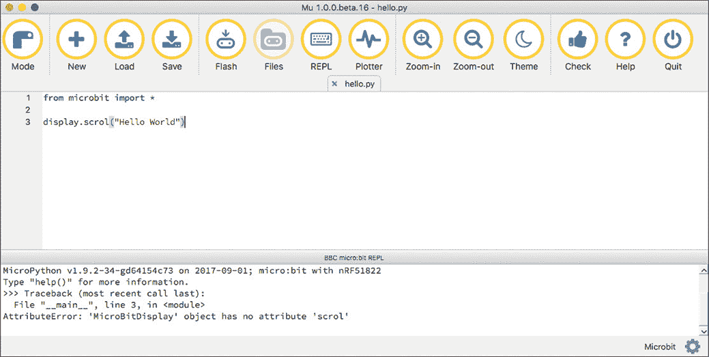

*图 1-18：在 Mu 中使用 REPL 捕获错误*

REPL 中的 `>>>` 提示符表示你可以在这里输入 Python 命令，并立即在 micro:bit 上运行。尝试在 `>>>` 提示符后输入以下内容，并在行末按 ENTER（这次正确拼写 `scroll`）：

display.scroll("The REPL is useful")

你的 micro:bit 显示屏应该会立即滚动出消息，而不需要你上传程序。你不需要重复 `import` 命令，因为 MicroPython 已经执行了 `import`——它是在遇到拼写错误的 `scroll` 之前就执行过了。

**注意** *当你在输入 Hello World 程序时，可能注意到 Mu 尝试通过猜测你正在输入的内容来帮助你。例如，如果你输入* `display` 然后暂停，选项列表（`clear`、`get_pixel`、`is_on`、`off`、`on`、`scroll`、`set_pixel` 和 `show`）将会出现。你可以点击你想要的选项，省去一些输入工作。

##### 添加图形

现在让我们像在 Blocks 代码中一样，为程序添加一些图形。我们需要再次检测按钮 A 是否被按下，然后显示图形模式。这在 MicroPython 中稍微复杂一些，因为这个语言没有像 Blocks 代码那样的事件概念。相反，我们必须编写一个*循环*，让其中的命令重复执行，直到停止。我们的程序中，这些命令会检查按钮是否被按下，如果发生了这个事件，就执行必要的操作。换句话说，程序不是被告知按钮 A 已被按下，而是必须不断检查它是否被按下。以下是代码：

from microbit import *

display.scroll("Hello World")

while True:

if button_a.was_pressed():

display.show(Image.CHESSBOARD)

`while True`代码行标志着循环的开始，循环将一直执行，直到有某些操作停止它，比如你拔掉 micro:bit 的电源，按下重置按钮，或在 REPL 中按 CTRL-C。每当你创建一个循环时，请确保将任何应在该循环中执行的代码行进行缩进。幸运的是，Mu 会识别你何时开始一个循环，并自动为下一行代码添加缩进。

循环中的第一行是一个`if`语句。它使用`button_a.was_pressed`函数来检查自从上次使用`was_pressed`以来按钮是否被按下。如果是，那么`if`语句下面缩进的代码将被执行。你会注意到，接下来的代码行会进一步缩进，这意味着这行代码只会在`if`语句为真时运行（也就是按钮确实被按下时）。在这种情况下，这行代码告诉显示器显示一个来自图像库的现成图形。我选择了`CHESSBOARD`图像。稍后我们将在第 29 页的“`if` 块”中详细讨论`if`命令。

在 Python 中，缩进非常重要，记得缩进可能是刚开始学习这门语言时的一个大难题。比如，在`while`或`if`命令中的缩进行必须精确地缩进相同的数量。在 Mu 中，这是四个空格。随着你不断练习 Python 编程，知道何时缩进将变得越来越容易。

### 编程概念

在这里，我们将介绍一些编程中的关键概念，特别是当你想修改一些项目代码或开始创建自己的项目时，这些概念非常值得理解。无论你使用的是“块编辑器”还是“MicroPython”，这些概念都是相同的，因此我们将分别介绍如何使用这两种方式来实现每个概念，先是用块代码，然后是对应的 MicroPython 代码。

#### 变量

*变量*是与一个或多个值相关联的名称。当你想使用这个值时，可以在代码中调用这个名称。让我们通过一些例子来说明这个概念。

##### 块代码

在“块编辑器”中，主要的类别之一是“变量”。通过点击块编辑器主页中的**新建项目**来开始一个新项目。删除`永远`块（我们不需要它），然后从“变量”类别中点击**创建一个变量...**。当提示输入新变量名称时，输入`计数器`。将`将计数器设置为 0`块拖到编程区，并将其点击到`开始时`块上。

接下来，在“输入”类别中添加一个`按下按钮 A`块。在这个块里面，添加一个来自“变量”类别的`计数器加 1`块，然后再添加一个来自“基础”类别的`显示数字`块。最后，从“变量”类别中拖出一个`计数器`块，将它点击到`显示数字`块中的`0`上，以替换掉`0`。

一旦你完成了这些编程，代码应该如下所示。

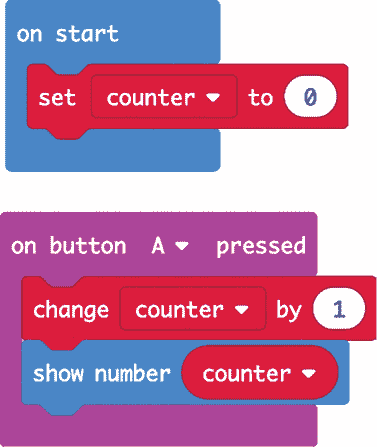

你可以通过点击编辑器左侧虚拟的 micro:bit 来尝试这个程序，按下按钮 A 后，你应该会看到数字显示增加了 1。

让我们来看一下这里发生了什么。在`on start`块中，你创建了一个名为`counter`的变量，并给它赋予初始值 0。当`on button A pressed`块被激活时，`change`块通过加 1 来改变`counter`变量的值，然后在显示器上显示`counter`变量的值。

在这种情况下，我们的`counter`变量包含一个数字，但我们也可以设置变量来存储文本，甚至是数据集合。

##### MicroPython 代码

我们刚刚写的 MicroPython 版本程序如下所示：

from microbit import *

counter = 0

while True:

if button_a.was_pressed():

counter += 1

display.scroll(str(counter))

我们导入常用的 micro:bit 库，然后创建一个`counter`变量，并赋予它初始值 0。我们创建一个`while`循环，确保如果按下按钮 A，则会给`counter`加 1。为了加 1，我们使用`+=`，它等价于`change counter`块。

当我们想要显示新值时，我们必须使用`str(counter)`将数字值转换为文本字符串，因为`display`命令只接受字符串。

请注意，完全可以将一个命令嵌套在另一个命令中。所以在这里，我们通过将`str`命令放入括号中来在`display.scroll`命令内使用它。当你这样做时，最内层的命令（在这个例子中是`str`）会先执行并将一个值传递给下一个命令（在这个例子中是`display.scroll`）。

#### 算术

在之前的示例中，你看到我们如何将一个数字加到变量中。除了加法，我们还可以在程序中使用所有常见的算术操作，包括减法、乘法和除法。

##### 积木代码

假设我们想要将一个数字不断加倍，而不是按单位递增。我们可以修改之前的程序，使得`counter`的起始值为 1，并且`on button A pressed`块将`counter`乘以 2，如下所示。

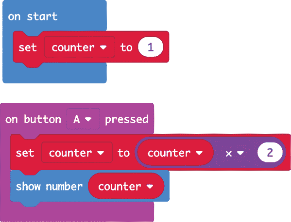

现在，我们不再使用`change counter by 1`块，而是使用`set counter to`块，在里面使用一个乘法块（`×`）。在乘法块的第一部分，我们放入变量`counter`，在第二部分，我们放入数字`2`。现在，每次按下按钮 A 时，`counter`都会被赋值为其旧值的两倍。

当我们使用积木时，这样的数学运算很快会变得相当复杂，因为我们需要在积木中嵌套积木，再在其他积木中嵌套。如果我们有一个需要进行大量算术运算的程序，使用 MicroPython 编码可能会更好。

##### MicroPython 代码

在 MicroPython 中，我们使用算术符号，如`+`、`-`、`*`（乘法）和`/`（除法）。你还可以使用括号来改变数学运算的顺序，就像在数学课上那样。下面是我们如何重写刚刚制作的加倍程序：

from microbit import *

counter = 1

while True:

如果按下了 `button_a` 按钮：

counter = counter * 2

显示 `counter` 的值（以字符串形式滚动显示）

这里的关键行是 `counter = counter * 2`。变量名后的 `=` 符号表示后面的内容将被赋值给该变量，作为它的新值。在这种情况下，就是 `counter * 2`（counter 乘以 2）。你也可以使用简写形式 `counter *= 2`，就像我们之前做加法时所做的那样。

#### if 积木

程序可以看作是一系列由 micro:bit 执行的步骤。有时候，你需要让程序根据条件做出决策并执行特定的步骤。逻辑类别中的积木让你的程序能够做出决策。

我们将制作一个修改版的计数程序，它会计数到 10，然后回到 0，重新开始计数过程。

##### 积木代码

尝试制作以下的积木程序。

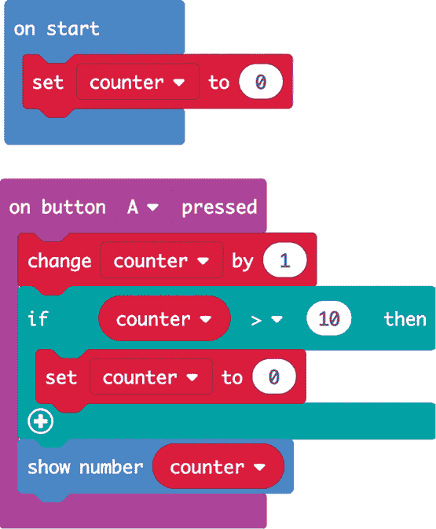

首先，在 `change counter by 1` 积木后添加一个 `if` 积木。接着在 `if` 积木上放置一个比较积木，用来将 `counter` 的值与 10 进行比较。如果 `counter` 的值大于（`>`）10，程序将执行 `if` 语句内的积木。在这种情况下，`if` 语句内有一个积木将 `counter` 重置为 0。如果 `counter` 的值不大于 10，那么程序将继续在显示屏上显示当前的数字。

还有其他版本的 `if` 积木，它允许你在条件为真时执行一个动作，在条件为假时执行另一个动作。你将在后续章节中学到更多关于这些积木的内容。

##### MicroPython 代码

我们之前已经在 MicroPython 中使用过 `if`，检查按钮是否被按下。这里，我们不仅仅是用它来判断一个条件是成立还是不成立，而是将变量 `counter` 与值 10 进行比较。MicroPython 版的积木代码如下所示：

from microbit import *

counter = 0

while True:

如果按下了 `button_a` 按钮：

counter += 1

if counter > 10:

counter = 0

显示 `counter` 的值（以字符串形式滚动显示）

仔细看看这个程序的缩进：我们在一个 `if` 语句内嵌套了另一个 `if` 语句，而这个 `if` 又嵌套在一个 `while` 语句中。看看你是否能理解这段代码是如何工作的，可以参考积木版的解释。

#### 字符串

记住，字符串是字符（数字、字母或标点符号）的序列，通常是一个单词。你在你的第一个 Hello World 程序中使用了字符串，在 图 1-8 中显示了消息 *Hello World*。

##### 积木代码

大多数字符串相关的积木可以在“文本”类别中找到。其中最简单的是一个带有一对引号和一个空白的积木，你可以在其中添加自己的文本来创建字符串。你可以使用这个积木为变量赋值字符串，而不是数字。这里我们将 `message` 变量设为一个字符串。这个程序将显示字符串的长度。

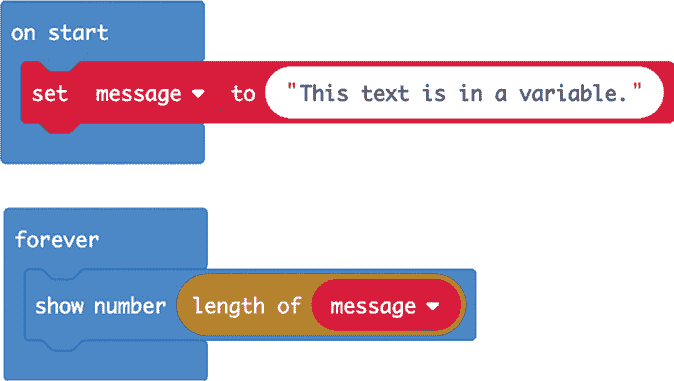

我们使用一个`on start`块，在其中我们将变量`message`的值设置为某些文本。在`show number`块中，你可以看到一个`length of`块，在该块内是`message`变量。`length of`块将字符串`message`的字符数传递给`show number`，然后该块会在显示屏上滚动显示这个数字。

文本类别还有其他块，可以让你执行一些操作，例如连接两个字符串、剪切字符串的一部分以及将字符串转换为数字。

##### MicroPython 代码

在 MicroPython 中，字符串值与其他程序代码的区别是被双引号括起来的，就像在代码块中一样。我们会像这样在 MicroPython 中编写前面的代码块程序：

from microbit import *

message = "这段文本存储在一个变量中。"

while True:

display.scroll(str(len(message)))

这与代码块中的方式相同。注意，我们使用`str`命令将字符串长度`len`转换为字符串本身，以便能够显示出来。

#### 数组和列表

到目前为止，我们使用的变量只包含单一的数据项，无论是数字还是字符串。但有时你需要在一个变量中保存一组值，通常是为了按顺序访问每个值，就像组成旋律的音符序列一样（你将在第二章中看到）。

在代码块中，一组值被称为*数组*，而在 MicroPython 中，它被称为*列表*。不过，两个的概念是相同的。

##### 代码块

代码块编辑器有一个数组类别，其中包含与数组相关的块。最重要的是`set list to`，`set text list to`和`get value at`。前两个允许你创建包含数字或字符串的列表，而`get value at`让你访问数组中的特定元素。

以下这个小程序创建了一个名为`colors`的变量，并将其分配给一个包含四个字符串的`array of`。然后它从这个数组中随机选择一个元素进行显示。请注意，`array of`块有`+`和`-`按钮，可以在创建时调整数组中的项数。

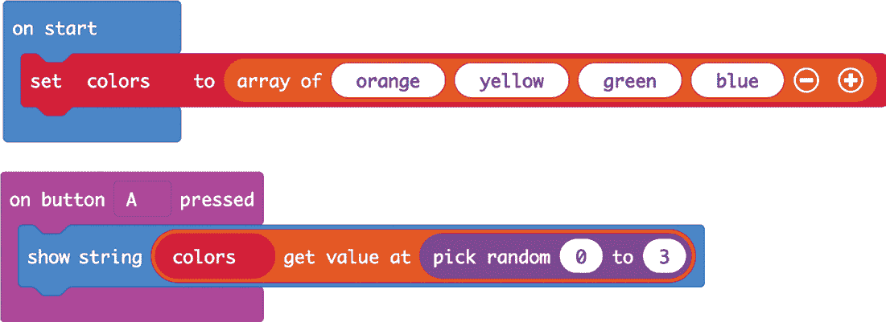

我们添加一个`on button A pressed`块。在其中，我们添加一个`show string`块，在该块内添加一个`get value at`块。然后我们添加`pick random`（在数学类别中找到）来选择 0 到 3 之间的任意数字。总之，这意味着当按下 A 按钮时，`pick random`块会选择一个 0 到 3 之间的随机数，并获取该位置的数组元素，然后`show string`块会显示该元素。请注意，在代码块和 MicroPython 编程中，数组的编号从 0 开始，而不是 1，所以如果随机选择的是数字 0，那么数组的*第一个*元素会被显示出来。

##### MicroPython 代码

这就是你如何在 MicroPython 中编写前面代码块程序的方法：

from microbit import *

import random

numbers = ["orange", "yellow", "green", "blue"]

while True:

if button_a.was_pressed():

display.scroll(numbers[random.randint(0, 3)])

在 MicroPython 中，我们使用方括号`[`和`]`来包含列表的元素，并用逗号分隔列表元素。我们还使用方括号通过元素的位置来访问列表中的特定元素。在此例中，`random.randint`命令返回一个 0 到 3 之间的数字，它被包含在方括号内。

#### 编程总结

这只是对 micro:bit 编程的一个快速介绍。本书的所有代码都可以下载，因此你无需在开始进行实验和制作项目之前掌握编程。随着你逐步阅读本书，你将接触到新的模块和 MicroPython 语言特性，我会在它们出现时进行解释。

有关 micro:bit 的 MicroPython 的更多信息，请参见*[`microbit-micropython.readthedocs.io`](https://microbit-micropython.readthedocs.io)*。如果你是 Python 新手，你可能会发现我的书*《编程 micro:bit：MicroPython 入门》*（麦格劳-希尔出版社，2018 年）是这本书的有用补充。

### 下载代码

本书中的一些程序很长且复杂，输入这些代码可能不是像你这样的疯狂科学家愿意做的事情。如果你不想自己编写程序，你可以直接下载它们并将其闪存到你的 micro:bit 上。

#### 下载 Blocks 代码

所有的 Blocks 代码都发布在 GitHub 上，地址是*[`github.com/simonmonk/mbms/`](https://github.com/simonmonk/mbms/)*。当你点击一个 Blocks 代码链接时，项目将在浏览器中打开。

向下滚动 GitHub 页面，直到你看到类似于图 1-19 的内容。你要寻找的是一个包含所有 Blocks 代码程序链接的列表。

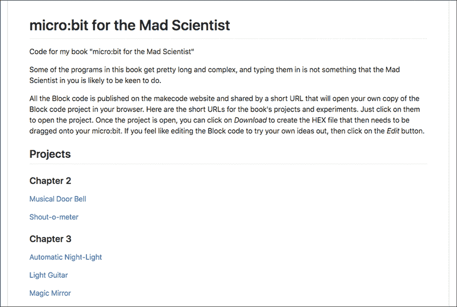

*图 1-19：本书中所有程序的 Blocks 代码链接*

要打开其中一个程序，只需点击链接。例如，图 1-20 显示了点击音乐门铃项目链接的结果。

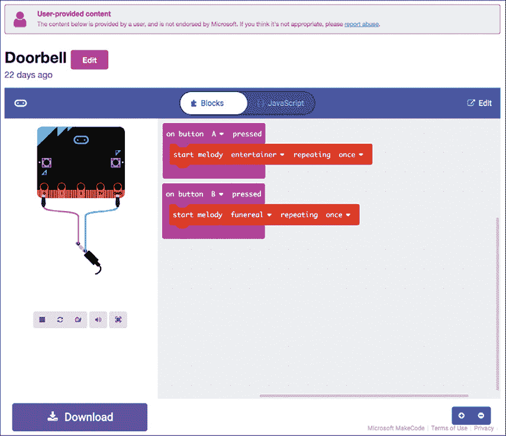

*图 1-20：跟随链接到音乐门铃项目的 Blocks 代码*

你会注意到，图 1-20 看起来不像正常的 Blocks 编辑器窗口。这是因为你只是要在这里查看代码并将其闪存到你的 micro:bit 上使用。如果你想编辑代码，或者只是想在更熟悉的编辑器中查看代码，请点击右上角的**编辑**按钮。这将为你创建一个原始程序的副本，然后你就可以编辑这个副本。

#### 下载 MicroPython 代码

你可以从*[`github.com/simonmonk/mbms/`](https://github.com/simonmonk/mbms/)*下载 MicroPython 程序。

如果你习惯使用 Git 软件，你可以将整个项目克隆到你的计算机上。对于非 Git 专家，这里有一个逐步的指南，帮助你获取所有的代码。

1.  访问 *[`github.com/simonmonk/mbms/`](https://github.com/simonmonk/mbms/)*，然后点击绿色的 **克隆或下载** 按钮，选择 **下载 ZIP**，如 图 1-21 所示。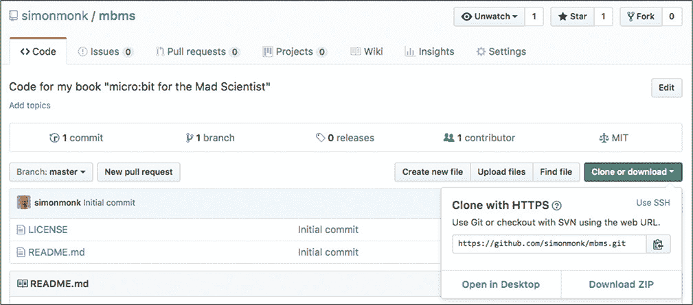

    *图 1-21：下载本书的代码*

1.  找到你刚刚下载的 ZIP 文件（*mbms-master.zip*），然后提取其中的所有文件。

    提取文件的过程会有所不同，具体取决于你使用的是 Windows、macOS 还是 Linux。在 macOS 和大多数 Linux 发行版中，打开 ZIP 文件时会自动提取文件。如果你是 Windows 用户，请注意，尽管 Windows 允许你查看 ZIP 文件的内容而不需要将文件提取到单独的文件夹中，但除非提取文件，否则你无法使用这些文件。在 Windows 中提取文件，右键点击文件资源管理器中的压缩文件，然后选择“提取所有”选项（见 图 1-22）。

    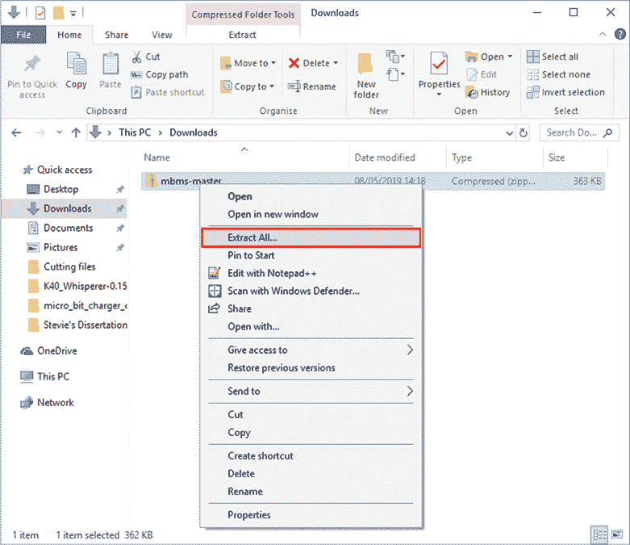

    *图 1-22：在 Windows 中提取 ZIP 压缩包文件*

    提取的文件将保存在一个名为 *mbms-master* 的文件夹中。在这个文件夹内，你将找到另一个名为 *python* 的文件夹，在里面你将找到本书的所有 MicroPython 程序，每个程序都是单独的文件，扩展名为 *.py*。

1.  不幸的是，你不能只需双击程序在 Mu 中打开它。要打开程序，首先打开 Mu 并选择“加载”选项。然后找到你想要打开的 MicroPython 程序。作为快捷方式，我建议你将刚刚下载的 *python* 文件夹中的所有 MicroPython 程序移动到 Mu 通常寻找程序的文件夹中。默认情况下，这个文件夹位于你的主目录下，名为 *mu_code*。现在，当你在 Mu 中点击“加载”按钮时，你将立刻看到所有的 MicroPython 程序。

### 总结

现在我们已经了解了 micro:bit 的一些基础知识，是时候开始进行一些真正的疯狂科学实验和项目工作了。我们将从使用 micro:bit 制作和检测声音开始。
