## 第二章：**超音速**

在本章中，我们将探讨如何使用 micro:bit 播放声音。我们将教 micro:bit 播放音乐，甚至模仿语音，并通过将其连接到麦克风来让它听到声音。你将尝试几个实验，并创建两个简单的项目：第一个项目是一个音乐门铃，通知疯狂科学家访客到达，第二个项目是一个喊声计，测量并显示它检测到的声音的音量。

### 将扬声器连接到 micro:bit

有几种方法可以从 micro:bit 听到声音。你应该选择哪一种，取决于你想发出多少声音。

#### 安静方法：耳机

也许从 micro:bit 获取声音的最简单方法是使用鳄鱼夹电缆将 micro:bit 连接到一副耳机（参见 图 2-1）。

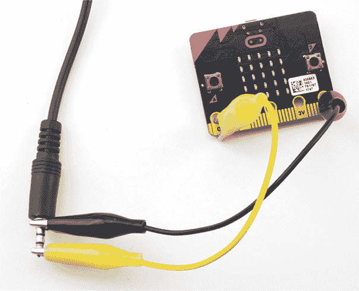

*图 2-1：耳机连接的鳄鱼夹*

如果你仔细观察耳机上的金属插头，你会看到它实际上由三个部分组成，这些部分之间由塑料环隔开。这意味着插头有三个连接点。最靠近耳机线的部分是接地连接。使用鳄鱼夹将其连接到 micro:bit 的 GND（0V）连接。

另外两个连接器是用于左耳和右耳的音频信号。如果你想让两只耳朵都能听到声音，将鳄鱼夹放置在两个连接器之间，这样声音就会传到两个耳朵。你也可以将鳄鱼夹连接到插头的尖端，这样就只会有一只耳朵听到声音（如 图 2-1 所示）。无论哪种方式，将鳄鱼夹的另一端夹到 micro:bit 上的任意三个引脚之一：0、1 或 2。micro:bit 用户通常使用引脚 0 来输出音频。

**注意** *设计用于与手机一起使用的耳机，如果带有麦克风，其插头将有四个连接器，而不是三个。这个差异不应影响使用。你仍然可以将插头的尖端作为音频连接，将离插头体最接近的连接器作为接地（GND）连接。*

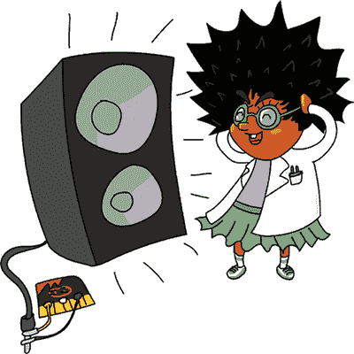

为了稍微升级这个方法，你可以使用像 图 2-2 中所示的 *音频插孔适配器*。只需将耳机直接插入适配器，将黑线连接到 GND，另一根连接到引脚 0。像这样的适配器直接安装到耳机上，提供比鳄鱼夹更可靠的连接。

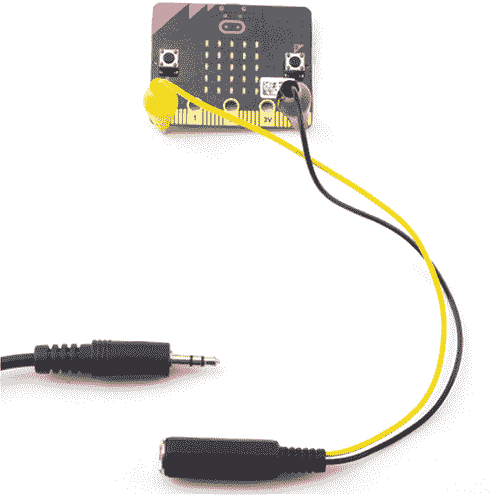

*图 2-2：连接鳄鱼夹到 3.5 毫米音频插孔的适配器*

#### 低预算音响方法：扬声器

使用像 图 2-3 中所示的放大扬声器，你可以使用之前描述的相同连接方法，产生更多的声音：直接连接到扬声器插头或使用音频插孔适配器。

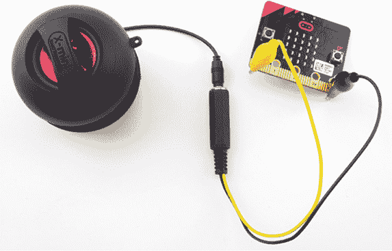

*图 2-3：将 micro:bit 连接到放大音响*

一些扬声器是专为与 micro:bit 配合使用而设计的。它们中的一些扬声器带有以鳄鱼夹结尾的电缆，可以连接到你的 micro:bit，而其他扬声器，如图 2-4 中展示的 Monk Makes 为 micro:bit 设计的扬声器，则以类似 micro:bit 引脚的插头结尾，便于通过鳄鱼夹电缆连接两者。

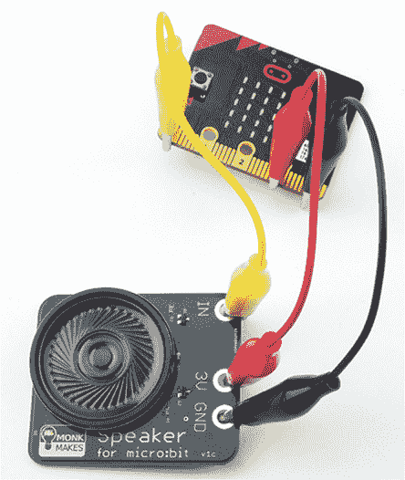

*图 2-4：Monk Makes 为 micro:bit 设计的扬声器*

增强型扬声器需要电源。在某些情况下，增强型扬声器可能有自己的电池或 USB 电缆。否则，micro:bit 本身可以为扬声器供电，届时设备需要在三个地方连接：连接到 micro:bit 的 GND（0V）和 3V，以为扬声器供电，并连接到第 0 引脚（或其他引脚之一），用于传输来自 micro:bit 的音频信号。

无论你使用什么音频输出设备，我们来测试一下吧！

### 实验 1：产生声音

在这个实验中，你将学习如何使用 micro:bit 和扬声器或耳机生成声音。

#### 你将需要的工具

进行这个实验，你只需要：

**Micro:bit**

**扬声器或耳机**

**鳄鱼夹电缆**

你可以在附录中找到这些设备的来源。

这里我们假设你使用的是 Monk Makes 为 micro:bit 设计的扬声器和一套鳄鱼夹，但之前列出的任何扬声器连接方法都可以使用。

#### 构建

1.  使用图 2-1 到图 2-4 中显示的方法之一连接扬声器。然后将 micro:bit 插入计算机。

1.  访问*[`github.com/simonmonk/mbms/`](https://github.com/simonmonk/mbms/)*来进入本书的代码仓库，然后点击**实验 1：产生声音**的链接。一旦程序打开，点击**下载**，然后将.hex 文件复制到你的 micro:bit 上。如果遇到困难，返回第一章，那里详细讲解了如何将程序加载到 micro:bit 上的过程。

    如果你更喜欢使用 Python，可以从同一个网站下载代码。关于如何下载和使用本书示例的说明，请参见第 34 页的“下载代码”部分。本实验的 Python 文件是*Experiment_01.py*。

1.  一旦成功编程 micro:bit，按下**按钮 A**。你应该能通过扬声器或耳机听到一个音调！

#### 代码

这个实验不需要太多代码。无论你使用 Blocks 代码还是 MicroPython，都只是检测按钮 A 是否被按下，然后播放一个音调。

##### Blocks 代码

该实验的 Blocks 代码如下所示。

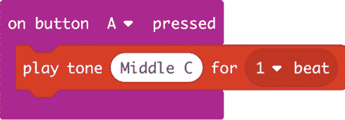

代码使用 `on button A pressed` 块来运行 `play tone` 块，每当按下按钮 A 时都会执行。你将 `play tone` 块放入 `on button A pressed` 块中，使其卡入到位。然后从下拉菜单中选择你想听的音调（在这种情况下是 `中央 C`）和音符的时长（`1 拍`）。

##### MicroPython 代码

这是代码的 MicroPython 版本：

from microbit import *

import music

while True:

如果按下按钮 A：

music.pitch(262, 1000)

Python 有大量的 *库*，它们是执行特定任务的代码集合。通过要求你的代码使用这些库，你可以访问许多功能，而不必自己编写复杂的代码。音乐库就是一个例子：它包含了可以让你的 micro:bit 发出声音的函数。为了让 MicroPython 使用音乐库，你首先需要使用 `import music` 命令导入该库。

虽然 Blocks 代码会自动处理一些事情，比如知道多长时间运行一次代码以及以什么顺序运行代码，但 MicroPython 要求你在代码中明确指示这些内容。在这里，你使用 `while True:` 循环来告诉 micro:bit 一直检查是否有人按下按钮 A。

当有人按下按钮 A 时，音符通过 `pitch` 命令播放，该命令需要两个信息：音符的频率（`262` 是中央 C）和音符的时长（在这种情况下是 `1000` 毫秒，或者 1 秒）。

#### 尝试的事情

你可能想尝试改变产生的音调。如果你使用的是 Blocks 代码，请返回浏览器并点击 **编辑** 按钮来修改代码，然后点击 **中央 C**。这将打开一个迷你键盘，你可以选择一个不同的音符来播放。要在 MicroPython 中更改音符，请输入一个新的数字来代替 262 作为频率。然后再次点击 **闪烁** 按钮。在本章后面，你将学习一种更好的方法来选择使用 MicroPython 播放的音符。

你还可以尝试让按钮 A 和按钮 B 都播放音调，甚至让它们播放不同的音调——一个和弦！

#### 原理：频率与声音

micro:bit 如何在扬声器中产生声音？本质上，micro:bit 以极快的速度开关电流（电流的流动），导致扬声器的一部分振动，从而产生声音。micro:bit 开关电流的速度决定了声音的 *频率*，也就是它产生不同音调的原因。我将详细解释这一点。

图 2-5 显示了扬声器的各个部分。一个坚固的、通常是金属的框架将锥形固定在适当位置。这个锥形的窄端是圆柱形的，且有一根线圈绕在上面。在线圈的周围，固定在扬声器框架上的，是一个强大的磁铁。

当电流通过线圈时，它——因此整个锥形——会非常快速地前后振动。这种振动在空气中产生压力波，我们听到的就是声音。

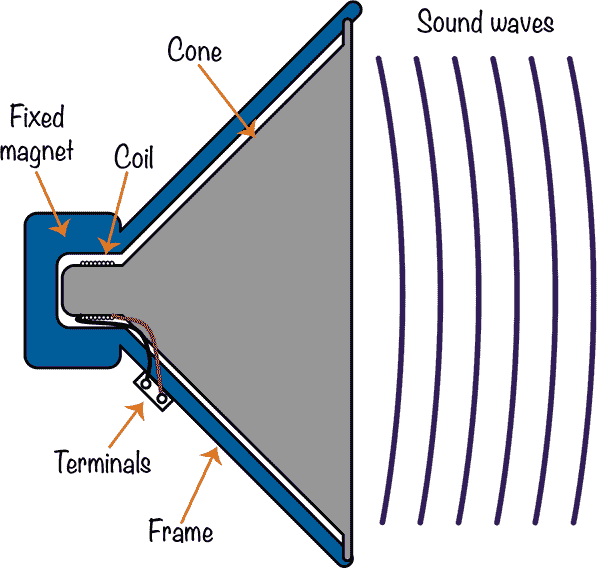

*图 2-5：扬声器*

要发出特定的声音，扬声器的振膜需要每秒前后移动一定次数。扬声器每秒移动的次数就是它的频率，单位是*赫兹*（简写为 Hz）。频率越高，声音的音调越高。262 Hz 的频率对应钢琴上的中音 C。高一个八度的 C 频率为 524 Hz，即双倍的中音 C。在音乐中，当你升高一个八度时，频率也会加倍。

micro:bit 通过快速开关引脚 0 来控制电流和频率。当引脚 0 关闭时，输出电压为 0V；当引脚 0 开启时，输出电压为 3V。如果你绘制输出电压与时间的关系图，它将像图 2-6 那样。

出于显而易见的原因，这种波形被称为*方波*。由于 micro:bit 的输出只能是开或关，这就是我们从 micro:bit 生成的唯一类型的波形。

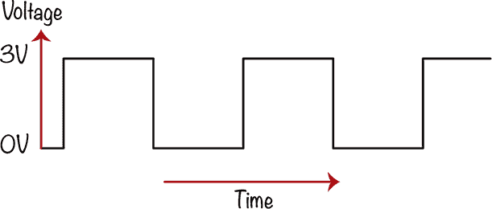

*图 2-6：方波*

当 micro:bit 将信号传输到扩音器时，扬声器会从 micro:bit 接收低电流信号，并增加电流，以更大功率驱动扬声器，从而使声音变大。

现在让我们尝试制作声音。

### 实验 2：它会说话！

micro:bit 的 MicroPython 软件有一个非常棒的功能，允许你让 micro:bit 朗读短语。在这个实验中，我们将尝试这个功能，让 micro:bit 跟我们说话。

虽然生成语音的软件是为英语设计的，但通过调整拼写，你应该能够让这个库用其他语言发声。

目前（写作时），这个功能不能通过 Blocks 代码使用，因此我们将使用 MicroPython。

#### 你将需要的材料

这个项目使用的硬件与实验 1 完全相同。

**Micro:bit**

**扬声器或耳机**

**鳄鱼夹电缆**

#### 构建

1.  使用图 2-1 到 2-4 中展示的方法连接扬声器。

1.  这个项目使用了语音库，而该库在 Blocks 代码中不可用，因此这个实验代码仅适用于 Python。访问*[`github.com/simonmonk/mbms/`](https://github.com/simonmonk/mbms/)*并下载*Experiment_02*.py 文件。你还可以在 GitHub 页面上找到其他项目的代码以及下载和使用书中示例的说明。将程序烧录到你的 micro:bit 中。

1.  一旦 micro:bit 成功编程，按下**按钮 A**，你应该能通过扬声器或耳机听到语音信息。疯狂科学家喜欢听这个声音，因为它让他们想起了他们亲爱的老朋友霍金教授，遗憾的是他已经不在人世了。

#### 代码

实验的 MicroPython 代码如下：

from microbit import *

import speech

while True:

if button_a.was_pressed():

speech.say("疯狂科学家喜欢 micro:bit")

除了导入语音库外，让 micro:bit 发声只需要将要说的文本放入 `say` 函数中。

语音库相当先进——你甚至可以使用它来调整音调，使你的 micro:bit 唱歌！你可以在*[`microbit-micropython.readthedocs.io/en/latest/tutorials/speech.html`](https://microbit-micropython.readthedocs.io/en/latest/tutorials/speech.html)*了解更多关于该库的信息。

### 项目：音乐门铃

*难度：简单*

疯狂科学家特别喜欢音乐门铃。事实上，你不会感到惊讶，科学家最喜欢的曲子之一就是《星球大战》中的《帝国进行曲》。

在第十章中，我们将重新审视这个项目，添加第二个 micro:bit，使门铃能够无线工作。

这个项目（如图 2-7 所示）是实验 1 的一个变体，区别在于当按钮被按下时，门铃播放的是曲子，而不是单一的音调。我们将让按钮 A 播放一首曲子，按钮 B 播放另一首。你可以通过这个短视频查看项目的实际效果：*[`youtu.be/xmLupw4PxYQ/`](https://youtu.be/xmLupw4PxYQ/)*。

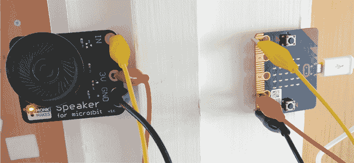

*图 2-7：音乐门铃项目*

给访客提供两首曲子供选择，可以让他们表达访问的紧急程度。如果疯狂科学家正忙，他们就可以选择忽略门口的人！

#### 你需要的材料

对于这个项目，你将需要以下物品：

**Micro:bit** 作为这个项目的控制器，提供两个按钮供按压

**3 × 鳄鱼夹电缆** 用于将 micro:bit 连接到扬声器（较长的电缆会更方便）

**USB 电源适配器或带电源开关的 3V 电池包** 用于为 micro:bit 和扬声器提供电源

**扬声器** 播放门铃曲（我推荐使用 Monk Makes Speaker 与 micro:bit 配合使用）

**粘合胶或自粘垫** 用于将 micro:bit 固定在门框上，扬声器固定在门框内部

如果你使用电池进行这个项目，最好使用带电源开关的电池盒，这样在不使用时可以关闭门铃以节省电池电量。否则，电池在使用约一天后就会耗尽。USB 电源提供了一个长期的解决方案，可以一直保持开启状态。

#### 构建

在构建新项目时，总是值得在桌面上先进行构建和测试，然后再将其安装到实际使用的地方。

1.  使用三根鳄鱼夹电缆将扬声器连接到 micro:bit，如图 2-7 所示。

    使用颜色编码来区分你的电缆是个好主意，黑色表示 GND，红色表示 3V，其他颜色用于从 micro:bit 的 0 引脚连接音频。使用不同的颜色将帮助你跟踪连接。

1.  访问 *[`github.com/simonmonk/mbms/`](https://github.com/simonmonk/mbms/)* 以获取书中的代码库，并点击 **Musical Doorbell** 的链接。程序打开后，点击 **Download**，然后将 hex 文件复制到你的 micro:bit 上。如果你遇到困难，可以回到第一章，我们会详细讨论如何将程序加载到你的 micro:bit。如果你更喜欢使用 Python，可以从同一个网站下载代码，并附带下载和使用书中示例的说明。这个实验的 Python 文件是 *ch_02_Doorbell.py*。

1.  一旦 micro:bit 成功编程，按下 **按钮 A**，你应该能听到一段旋律（斯科特·乔普林的《娱乐者》）。现在按下 **按钮 B**，你将听到弗雷德里克·肖邦的《葬礼进行曲》。

1.  一旦一切都正常工作，断开 micro:bit 与电脑的连接，然后将其插入 USB 电源适配器或电池盒。再次测试，确保它能正常工作。然后将 micro:bit 部分固定在门的一侧，扬声器部分固定在门的另一侧。这里有几点需要注意：

    首先，即使使用粘性胶垫将东西粘贴到墙上也可能弄得一团糟，所以如果需要，确保你获得了许可。如果你使用的是粘性垫，这一点尤为重要，因为它们可能会永久粘在油漆上。

    其次，鳄鱼夹需要从门的一侧穿过到另一侧，以确保它们在门关闭时不会被夹得太紧。因此，在开始粘贴之前，先弄清楚它们应该放在哪里。在第十章中，我们将制作该项目的另一个版本，使用第二个 micro:bit 提供无线连接。

    最后，如果你使用的是 USB 电源适配器，你需要一个足够靠近的电源插座，以便 USB 电源适配器能够连接到你的 micro:bit。

#### 代码

现在让我们来讲解这个项目的代码。

##### Blocks 代码

这是 Blocks 代码。

代码与实验 1 相似，但有一些不同之处。首先，我们有两组代码：一组用于按钮 A，另一组用于按钮 B。其次，我们从 `repeating` 菜单中选择 `once`，因为我们希望旋律只播放一次。

第三，我们使用 `start melody` 块来播放一整段旋律，而不仅仅是一个单音符。注意，这些旋律已经在块中提供——你只需要从菜单中选择它们！

##### MicroPython 代码

这是该程序的 MicroPython 版本：

from microbit import *

import music

while True:

if button_a.was_pressed():

music.play(music.ENTERTAINER)

elif button_b.was_pressed():

music.play(music.FUNERAL)

这与 Blocks 代码的工作方式完全相同。`music.play` 方法等同于 `start melody` 块，而我们使用 `if` 语句来检查哪个按钮被按下。`if` 语句允许按钮 A 和按钮 B 播放不同的曲调。

相同的预定义音调可以在 Blocks 和 MicroPython 代码中播放。

#### 尝试一下

从预定义的曲调中选择是很不错，但疯狂科学家可能有自己独特的音乐口味。他们可能想创作自己的曲子！

如果你使用的是 Blocks 代码，你可以通过创建一系列 `play tone` 块来制作自己的曲调，就像这里展示的例子一样。你填写你想播放的音符，每个音符依次播放。

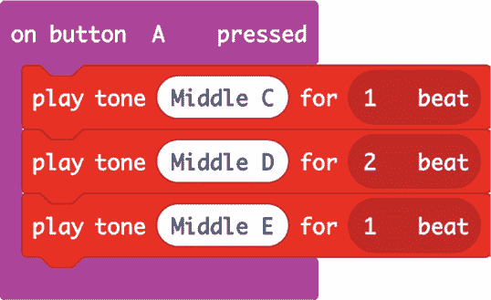

所以，如果你知道一首特定曲调的所有音符，你可以像这样创建它。你还需要指定每个音符播放的时长。在你让音乐听起来正如你所期望的那样之前，你可能需要做一些实验。

现在让我们看看如何在 MicroPython 中创建一首曲调：

来自 microbit 的 *导入* *

导入音乐

notes = ['A4:4', 'A', 'A', 'F:2', 'C5:2', 'A4:4', 'F:2', 'C5:2', 'A4:4']

while True:

if button_a.was_pressed():

music.play(notes)

MicroPython 的音乐库通过允许你使用特殊符号来编写自己的旋律，负责播放整个曲调。每个音符由一串字符组成（有关字符串的更多信息，请参见 第一章）。字符串的第一个字符是音符名称（字母 A 到 G）。接下来是一个八度数——中央 C 属于第 4 八度，所以你可能希望将曲调限制在 3、4 和 5 八度之间。八度数是可选的，如果你没有提供，Python 将默认使用第一个八度。

一旦你指定了一个八度数，音乐库将假定这个八度数适用于所有后续音符，直到你指定一个不同的八度数。

接下来，你可以选择性地添加一个冒号，后面跟着一个时长。时长是以四分音符为单位的。例如，要播放中央 C 的半音符，你可以写 `C4:2`。

要将多个音符串联起来，你需要创建一个 *列表*。到目前为止，我们使用的变量只包含单个元素。列表就像一个可以包含多个元素的变量，你可以独立地访问和使用每个元素。为了表示 `notes` 变量包含的是一个值列表，而不仅仅是一个单一的值，你需要用逗号分隔数组中的各个值，并将整个列表用 `[` 和 `]` 括起来。

在我们的数组中，每个元素都是一个音符字符串。要播放整个音符序列，您可以使用 `play` 函数，并提供要播放的音符列表。这个例子播放的是 *星球大战* 中的“帝国进行曲”开头几小节的音符。

在这里，我们导入了常规的 microbit 库，以及音乐库。我们将我们的旋律保存在一个名为 `notes` 的变量中。然后我们创建了另一个 `while True:` 循环，以便代码持续运行并检查按钮是否被按下。我们告诉程序，如果按下 A 按钮，它应该播放 `notes` 变量。

### 项目：Shout-O-Meter

*难度：简单*

疯狂的科学家喜欢测量事物。为此，本项目制作了一个简单的声音计，它可以指示噪音的音量。这样，科学家就可以因邻居制造过多噪音而斥责他们——并证明他们确实有过多噪音。

#### 所需物品

本项目需要一个麦克风来接收声音，以便测量其音量。我将使用 Monk Makes Sensor 中内置的麦克风，它配备了多个传感器。声音的音量随后会显示在 micro:bit 的 LED 显示屏上。声音越大，点亮的 LED 越多。

本项目需要以下物品：

**Micro:bit** 作为本项目的控制器，提供两个按钮供按压

**3 × 鳄鱼夹电缆** 用于将 micro:bit 连接到扬声器（更长的电缆会使操作更方便）

**任何 micro:bit 电源** 可以是 USB 计算机电缆或电池盒

**Monk Makes Sensor for micro:bit** 用于提供麦克风

#### 构建

1.  使用三根鳄鱼夹将传感器板连接到 micro:bit，如图 2-8 所示。你需要将传感器上的 3V 连接到 micro:bit 上的 3V，GND 连接到 GND，并将带有麦克风图标的孔连接到 micro:bit 的引脚 0。

    最好遵循电缆的颜色编码，黑色用于 GND，红色用于 3V，其他颜色用于从 micro:bit 引脚 0 连接到麦克风。

    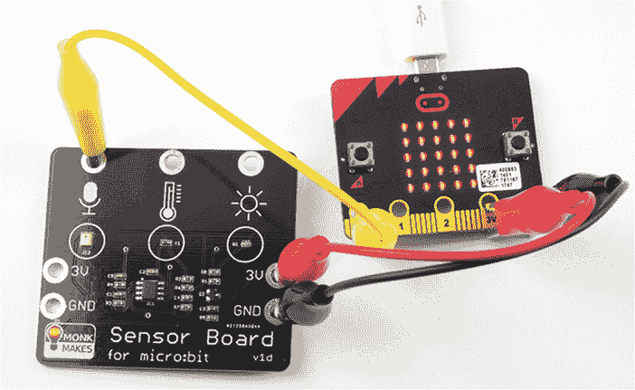

    *图 2-8：Shout-o-meter 项目*

1.  访问 *[`github.com/simonmonk/mbms/`](https://github.com/simonmonk/mbms/)* 获取本书的代码库，并点击 **Shout-O-Meter** 的链接。一旦程序打开，点击 **下载**，然后将 hex 文件复制到你的 micro:bit 上。如果你在此过程中遇到问题，请回到第一章，我们会详细讨论如何将程序加载到 micro:bit 上。

    如果你更喜欢使用 Python，那么可以从同一网站下载代码，以及下载和使用书中示例的说明。此实验的 Python 文件为 *ch_2_Shoutometer.py*。

1.  编程完成后，尝试在麦克风附近吹口哨（见图 2-9），注意 LED 如何响应声音的强度。你也可以尝试轻拍麦克风。你可以在这里看到一个项目运行的视频： *[`youtu.be/6pGDSHmfFng/`](https://youtu.be/6pGDSHmfFng/)*。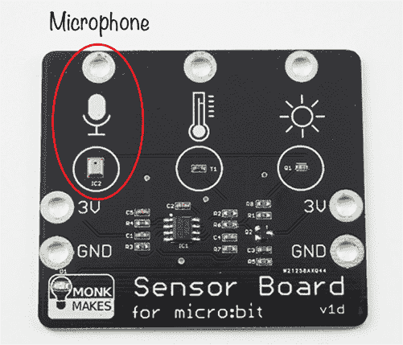

    *图 2-9：Monk Makes Sensor for micro:bit 麦克风*

#### 代码

该代码的 Blocks 版本能够利用内置的 `plot bar graph of` 块，而 MicroPython 版本则更为复杂，因为我们必须实现自己的这一功能版本。

##### Blocks 代码

Blocks 语言包括一个名为 `plot bar graph of` 的有用块，它使得显示声音水平的代码变得非常简单。

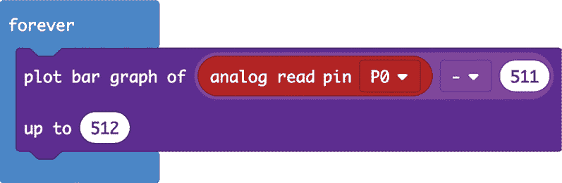

我们放入了一个 `forever` 块，因此里面的代码会不断运行。然后，我们添加了 `plot bar graph of` 块，它将显示来自麦克风的响度。

如你所见，从 micro:bit 的引脚 0 读取的模拟值会减去 `511`，然后传递给 `plot bar graph of` 块，并且最大值设置为 `up to`，最大值为 `512`。这一部分数学运算的原因在《如何工作：麦克风输出》一节中讨论，详见 第 59 页。

获取正确的块组合可能有点棘手，特别是在涉及到数学运算时。幸运的是，编辑器允许你自由移动块，因此如果它们没有放在正确的位置以获得你想要的结果，你可以将它们拖动到应该放置的地方。有关编辑代码的更多信息，请参见 第一章。

##### MicroPython 代码

MicroPython 版本的代码比 Blocks 版本稍微复杂一些。MicroPython 没有内置的条形图显示功能，因此我们必须自己编写。在 Blocks 版本中，`plot bar graph of` 块提供了一个平滑的显示，尽管数据变化迅速。而要在 MicroPython 中获得相同的效果，我需要添加代码从 10 个样本中读取最大声音水平。

from microbit import *

def sound_level():

max_level = 0

for i in range(0, 10):

sound_level = (pin0.read_analog() - 511) / 100

if sound_level > max_level:

max_level = sound_level

return max_level

def bargraph(a):

display.clear()

for y in range(0, 5):

if a > y:

for x in range(0, 5):

display.set_pixel(x, 4-y, 9)

while True:

bargraph(sound_level())

sleep(10)

我们使用 `sound_level` 函数并创建一个 `for` 循环来采集 10 个声音样本。每个样本值（与 Blocks 版本的代码一样）都是从模拟值中减去 `511` 得到的。然而，在这个例子中，为了将点亮的行数缩放到 0 到 4，我们将得到的值除以 100。然后，我们将存储在 `sound_level` 变量中的声音级别与 `max_level` 变量进行比较，如果 `sound_level` 更大，则将 `max_level` 更新为 `sound_level`。当所有 10 个样本采集完后，最大的值将存储在 `max_level` 中，并且这个值将由函数返回。

`bargraph`函数接受一个值，表示为`a`，来进行显示。值越高，点亮的 LED 越多，表示噪音越大。该值应介于 0 和 4 之间。如果大于 4，也没有关系——显示屏上的所有 LED 会被点亮，但不会有其他变化。该函数通过遍历显示屏的每一行来工作，如果`a`的值大于该行的行号，那么该行上的每个 LED 都会被内部的`for`循环点亮，`for`循环会判断`x`是否在 0 到 4 的范围内。

所有主要的`while`循环要做的就是调用`bargraph`函数，并传入由`sound_level`函数返回的声音等级。

#### 工作原理：麦克风输出

图 2-10 显示了麦克风在检测声音时输出的图形。电压位于纵轴，时间位于横轴。

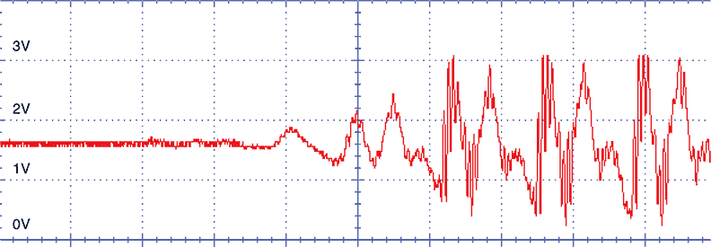

*图 2-10：声音样本*

正如你从图表的左侧所看到的，在声音开始之前，传感器的输出电压大约在 1.5V 处平稳。当声音开始时，电压在 1.5V 之上和之下振荡，麦克风拾取到声音的压力波。micro:bit 上的 1.5V 读数对应的模拟值是 511。正因为如此，在将读数显示在 micro:bit 上之前，我们需要从读数中减去 511；否则，在没有声音的情况下，显示屏上会有一半的 LED 点亮。

### 总结

在本章中，疯狂科学家探索了声音的世界，既通过 micro:bit 产生音乐和语音，也通过麦克风检测声音。我们已经开始了对 micro:bit 的探索，进行了一些简单的项目。

在下一章，我们将看看光。我们将用一个特殊的传感器来测量光，并使用 micro:bit 的 LED 显示屏。接着，我们将进行一个大型项目，使用多色的 NeoPixel 显示屏，并将光与声音结合，制作一个光控乐器。之后，我们将进入其他更具挑战性的项目。
