## 第三章：**光照强度**

在本章中，我们将使用 micro:bit 来进行光照实验。首先，你将学习如何感知光照强度，然后我们将制作一款光控吉他，根据感应到的光强度来演奏音符。接着，我们将使用光线创建一个光学幻觉的无限镜面，似乎可以一直延伸，帮助疯狂的科学家深入思考。由于 MicroPython 目前没有光感应功能，因此本章将使用 Blocks 代码进行编程。

### 实验 3：感知光线

让我们看看如何使用 micro:bit 来测量光照强度。一旦你掌握了这个方法，你就能制作各种光依赖的项目，包括本章后面提到的自动夜灯和光控吉他。

micro:bit 的开发者非常巧妙地在设备的软件中构建了一项功能，允许它通过 LED 灯来测量光照强度。我将在第 63 页的“原理”部分解释这一点。

#### 所需材料

你只需要一个 micro:bit 和一个 USB 线就可以进行这个实验。

#### 构建

1.  访问本书的代码库：*[`github.com/simonmonk/mbms/`](https://github.com/simonmonk/mbms/)*，点击**实验 3：感知光线**的链接。点击**下载**，然后将.hex 文件复制到你的 micro:bit 上。如果遇到困难，可以回到第 11 页的“编程 micro:bit”部分，那里详细讲解了将程序下载到 micro:bit 上的过程。记住，这个实验只适用于 Blocks 代码，因此没有 MicroPython 代码可以下载。

1.  一旦你成功编程了 micro:bit，屏幕上应该会显示一个 0 到 9 之间的数字，表示 micro:bit 正在检测的光强度。试着用手遮挡 micro:bit，或者将其放在光源下，看看数字如何变化。

#### 代码

这是本实验的 Blocks 代码。

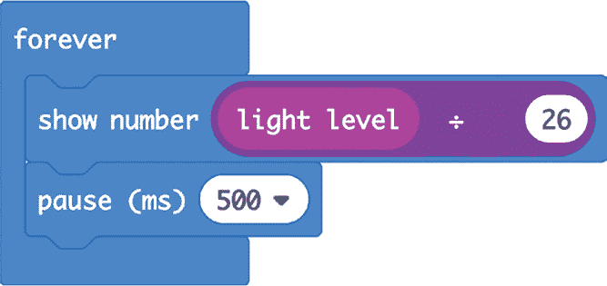

`光照强度`块从 micro:bit 的光传感器读取数据，并给出一个介于 0 和 255 之间的值，表示亮度。然而，如果数字超过一位数，micro:bit 的 LED 显示屏将需要滚动显示，速度较慢且不方便。通过将数字除以 26，结果总是小于 10。

在显示光照强度后，micro:bit 会暂停半秒钟，以便你有时间阅读显示内容。否则，当光照强度变化时，数字会快速闪烁，难以看清。

#### 原理

micro:bit 没有专门的光传感器。相反，它利用一种巧妙的技巧，通过显示屏来计算光照强度。你可以在*[`lancaster-university.github.io/microbit-docs/extras/light-sensing/`](https://lancaster-university.github.io/microbit-docs/extras/light-sensing/)*上了解这个技巧。

### 项目：自动夜灯

*难度：简单*

尽管他们不太愿意承认，疯狂科学家有点害怕黑暗。这就是他们开发一个使用 micro:bit 显示屏作为夜间自动亮起的灯光的项目的原因。

这个简单的项目是基于实验 3 的，能够监控光照水平，并在光线变得过暗时点亮 micro:bit 显示屏上的所有 LED 灯。

#### 所需材料

这个项目唯一需要的就是 micro:bit。

因为 micro:bit 需要长时间开启，最好使用 USB 电源适配器或 Monk Makes Power for micro:bit（请参见“为 micro:bit 供电”在第 248 页）来完成这个项目。电池太快就会没电。

#### 构建

1.  访问本书的代码库，在*[`github.com/simonmonk/mbms/`](https://github.com/simonmonk/mbms/)*点击**自动夜灯**的链接。然后点击**下载**并将 hex 文件复制到你的 micro:bit 中。如果你在这过程中卡住了，可以返回到“编程 micro:bit”在第 11 页，那里我们完整地讨论了如何将程序传输到 micro:bit。

1.  一旦你编程好了 micro:bit，屏幕应该会在你用手遮住 micro:bit 时亮起。当你移开手时，屏幕应该会熄灭。

#### 代码

这个项目的 Blocks 代码如下所示。

这段代码使用了两个`if`块。第一个检查光照水平是否低于 10，这意味着环境非常黑暗。如果满足这个条件，代码会使用`show leds`块打开所有 LED 灯。

第二个`if`块会在光照水平大于 50 时将 LED 灯关闭。我们在 10 和 50 这两个光照水平之间留出了间隔，以确保当光照接近这两个值时，LED 不会闪烁。开关值之间的差异的技术名称是*滞后现象*。

### 项目：光吉他

*难度：中等*

现在是时候制作一个光控吉他了！当你在 micro:bit 前挥手时，这把吉他将播放不同的音调。你可以在*[`www.youtube.com/watch?v=OFUYxIYCXQs`](https://www.youtube.com/watch?v=OFUYxIYCXQs)*观看这个项目的实际演示视频。

我建议将 micro:bit、扬声器和电池固定在一个吉他形状的纸板剪影上。（疯狂科学家在艺术方面不太擅长，所以图 3-1 中的相似度只是勉强能够体现。）

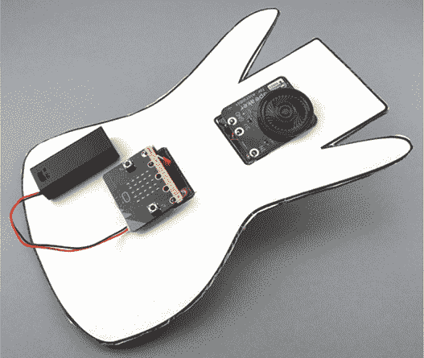

*图 3-1：micro:bit 变成了一个乐器。*

连接 micro:bit 和扬声器的电缆隐藏在纸板后面，以保持整洁。

#### 所需材料

对于这个项目，你需要以下物品：

**Micro:bit**

**3 × 鳄鱼夹电缆** 用于连接 micro:bit 和扬声器

**3V 电池包** 用于为 micro:bit 和扬声器供电（带开关的类型效果最佳）。

**用于 micro:bit 的扬声器** 用来播放声音（可以使用 Monk Makes 扬声器，或者参见 第二章 获取其他扬声器选项）。

**Blu-Tack 或自粘垫** 用于将 micro:bit 固定在纸板剪影上

**纸板** 用于制作吉他主体（你可以使用一块拆开的纸箱）。

**纸胶（PVA 或喷胶）** 用于将纸质轮廓粘贴到纸板上

**带吉他轮廓的纸（可选）** 你可以选择自己在纸上画吉他，或者直接剪裁和装饰纸板。

**剪刀** 用于剪裁吉他的轮廓

#### 构建

在将 micro:bit 固定到纸板之前，先创建并测试程序是个好主意，因此我们先进行这一步。

1.  使用三条鳄鱼夹电缆将扬声器连接到 micro:bit，如 图 3-2 所示。

    为了便于记忆不同的电缆，建议使用不同的颜色编码。黑色代表 GND，红色代表 3V，其他任何颜色都可用于连接 micro:bit 引脚 0 的音频连接。

    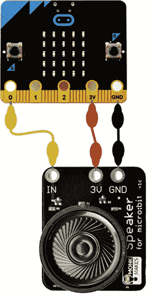

    *图 3-2：将 micro:bit 连接到扬声器*

1.  打开 *[`github.com/simonmonk/mbms/`](https://github.com/simonmonk/mbms/)*，点击 **Light Guitar** 项目。实验打开后，点击 **下载**，然后将 hex 文件复制到你的 micro:bit 中。

1.  一旦你编程完成，micro:bit 应该会在你靠近它并遮挡部分光线时发出不同的音符。如果音符的范围不是很大，可能需要调整它的灵敏度（请参阅 第 71 页 了解如何调整）。

1.  断开 micro:bit 与 USB 数据线的连接。在 *[`github.com/simonmonk/mbms/`](https://github.com/simonmonk/mbms/)*，你会找到一个名为 **other downloads** 的文件夹，里面包含了吉他形状的 PDF、PNG 和 SVG 格式图纸。你可以自己画吉他，或打印出这个模板。

1.  将吉他图纸粘贴到纸板上，如 图 3-3 所示。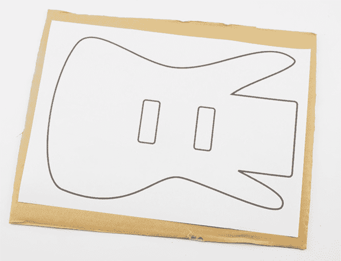

    *图 3-3：将纸模板粘贴到纸板上*

1.  使用剪刀围绕吉他轮廓剪裁。还要剪出吉他主体上两个矩形区域，用于放置连接 micro:bit 和扬声器的电线。最终效果应如 图 3-4 所示。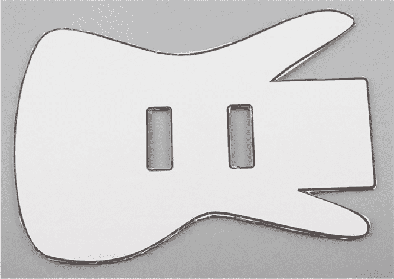

    *图 3-4：围绕模板剪裁*

1.  使用小球状的 Blu-Tack，将扬声器和 micro:bit 固定在吉他上，确保它们的边缘连接器能够通过矩形插槽访问。同时，也要将电池盒固定好，如 图 3-5 所示。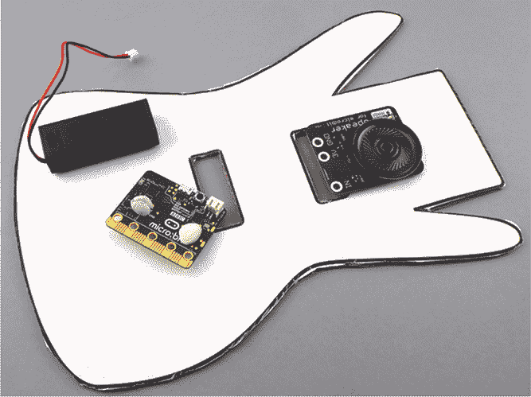

    *图 3-5：将 micro:bit、扬声器和电池盒连接起来*

    当吉他上的三个部件都连接好后，项目应该像 图 3-6 中那样。

    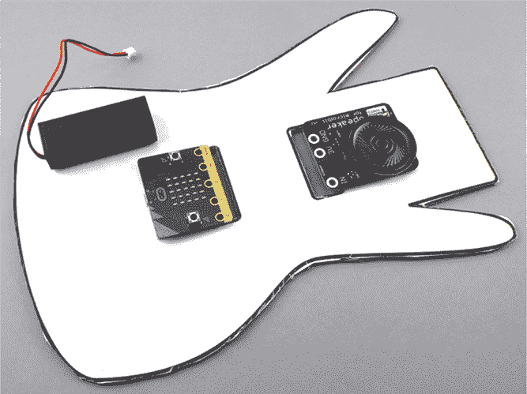

    *图 3-6：micro:bit、扬声器和电池盒已经连接到吉他上。*

1.  翻转整个设备，按照图 3-7 连接 micro:bit 和扬声器。如果你需要连接帮助，可以参考图 3-2。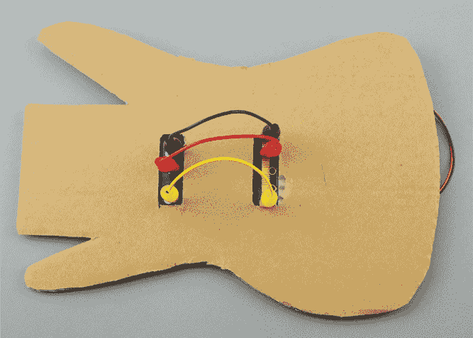

    *图 3-7：连接 micro:bit 到扬声器*

1.  将电池盒连接到 micro:bit 上的电池连接器。你准备好开始演奏了！

#### 代码

这个项目的块状代码使用了数组。

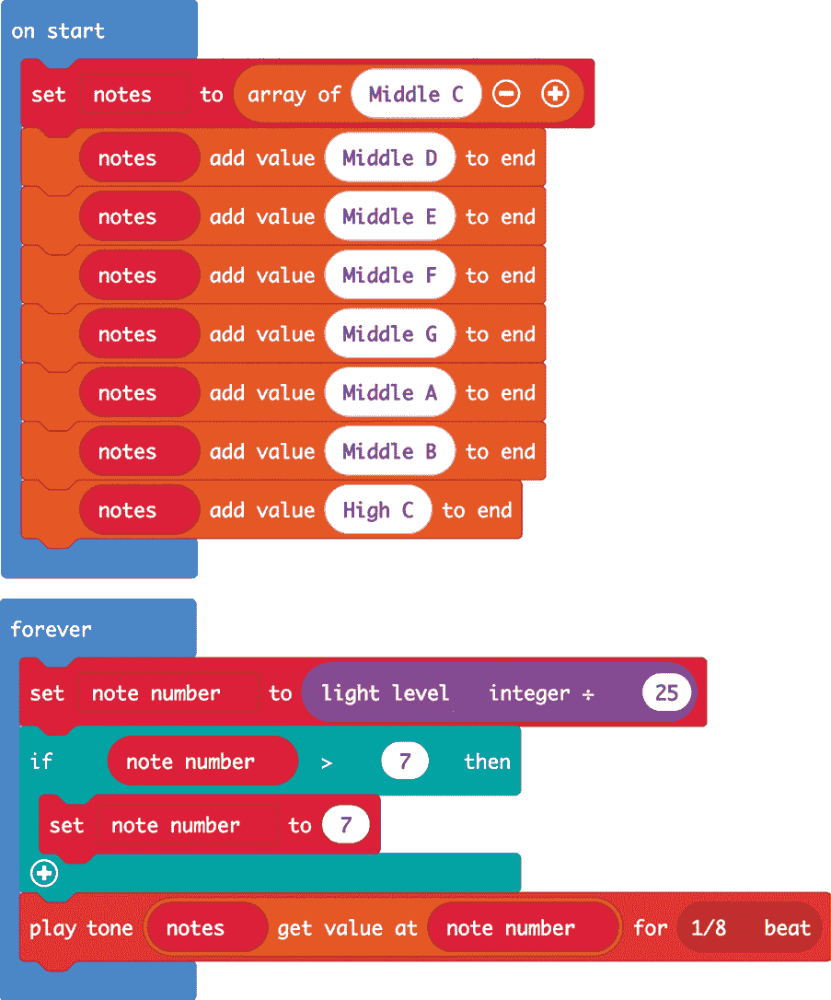

我们将需要在 micro:bit 启动时才运行的代码放入`on start`块中。这会创建一个音符数组。*数组*是一个值的列表，而不是单个值。我们使用数组来提供 micro:bit 可播放的八个可能音符。不同的光线水平会触发不同的音符。`on start`块中的第一行定义了一个名为`notes`的新数组，最初只包含音符`中音 C`。随后的`add value`块将数组中再添加七个音符，以便变量`notes`最终包含我们需要的所有八个音符。

`forever`块中的代码将不断执行。这段代码告诉 micro:bit 读取光线水平，然后根据这个信息选择要播放的音符。为此，代码首先使用`light level`块读取光线水平，并将读取值除以 25。如果你没有听到所有八个音符，可能需要通过稍微调低这个 25 的值来调整灵敏度。

`set to`块将结果值命名为`note number`。由于`note number`是光线水平除以 25，所以它的值将在 1 到 10 之间。

但将最大光线水平设置为 10 会导致问题。在访问数组中的项时，你需要指定要访问项的位置。我们在这个数组中可以指定的最大位置是 7（八个音符的编号是从 0 到 7）。我们希望吉他在光线较暗的室内工作。但是，如果光线非常明亮，那么`note number`可能会变成 10，这将超出数组的范围。为了确保我们不会超过`note number`的最大允许值，我们添加了`if`命令来检查`note number`是否大于 7。如果大于 7，代码将其设置为 7——问题就解决了。

`play tone`块访问`notes`数组中对应`note number`值位置的项，并播放该音符，持续时间为 1/8 拍。

### 项目：无限镜子

这个看似神奇的镜子（图 3-8）一定能给任何来访的疯狂科学家留下深刻印象。它内置在一个小相框中，镜子看起来比实际要深得多。

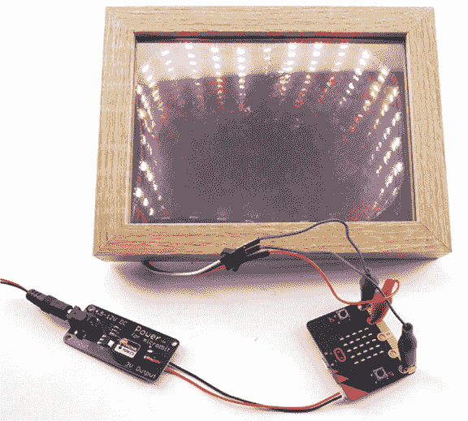

*图 3-8：micro:bit 控制的无限镜子*

您的 Micro:bit 将控制一个安装在相框内的 30 个 LED 灯带，我们会在 LED 灯带的两侧贴上反射膜，从而创造有趣的光效

您可以在* [`www.youtube.com/watch?v=-4Ud47OkIyY`](https://www.youtube.com/watch?v=-4Ud47OkIyY) *查看此项目的演示视频。

**注意** *这个项目有点棘手，因为反射膜可能难以平滑处理。但如果坚持下去，效果是值得的！*

#### 所需物品

对于这个项目，您需要以下物品：

**Micro:bit**

**0.5 米可寻址 LED 灯带（NeoPixels）** 一条 WS2812B RGB 5050 SMD 灯带应每米 60 个 LED，总长度为 0.5 米，背面有自粘胶层

**3 个鳄鱼夹到公跳线** 用于将 Micro:bit 连接到 LED 灯带

**Monk Makes 电源适配器** 为 Micro:bit 和 LED 灯带供电。请注意，USB 电源无法提供足够的电流来支持此项目，而 AAA 电池包仅在电池非常新鲜时才足够提供电力

**6V 直流墙插电源适配器** 提供足够的电力给 LED 灯带。电源适配器的末端应有一个直流圆柱插头。（详见《为您的 Micro:bit 供电》第 248 页）

**深型 7×5 英寸相框** 见下文有关相框的更多信息。您需要一个带有塑料间隔器的相框，深框通常会包含此类间隔器

**两块 7×5 英寸的反射窗膜** 反射窗膜样品

**工艺刀** 用于切割反射膜并在相框间隔器上为 LED 灯带的电线制作槽口

**肥皂水** 用于清洁玻璃并贴上薄膜

**尺子或塑料卡** 用作刮板

**胶带** 用于从反射窗膜上移除背膜

寻找一个 7×5 英寸（17.5×12.5 厘米）的相框，里面设计有适合 6×4 英寸照片的插槽。相框的重要特性是它有足够的深度，因此请寻找像图 3-9a–b 所示的相框。我使用的相框深度为 1.25 英寸。还要确保相框正面有玻璃。玻璃背后应有一个塑料间隔器（我们将在其上粘贴 LED 灯带），然后是背板

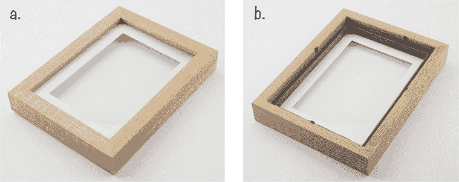

*图 3-9：无限镜深框相框：（a）正面和（b）移除背面后*

反射膜反射光线，因此它像镜子一样工作。通常，它是大卷的，用于贴在建筑物的窗户上。幸运的是，销售这种膜的人通常也会提供小样品，这些样品足够满足我们的需求。您可以通过在 eBay 或 Amazon 上搜索*银色反射镜窗膜*来轻松找到它，然后浏览列表，直到找到提供样品尺寸的人

你需要两块至少为 7 × 5 英寸的材料，但我建议多准备一些；将膜贴在相框玻璃上并去除气泡有点棘手，因此最好有几张备用材料，以防第一次尝试失败。

最容易找到可寻址 LED 灯带的地方是 eBay，但它也可以通过像 Adafruit 和 SparkFun 这样的硬件网站购买。使用搜索词 *WS2812B RGB 5050 LED Strip*。你需要购买每米 60 个 LED 的灯带。这个项目需要半米长，所以总共 30 个 LED。这些 LED 灯带有两种类型：防水型（用于户外）或自粘背胶型。你需要的是带有自粘背胶的类型。

#### 构建

现在你已经准备好材料，我们将把 LED 灯带和反光膜固定到框架上。编程 LED 灯带后，光线将看似永远向框架内部延伸，制造出框架比实际更深的错觉。

1.  在你开始构建项目硬件之前，确保 LED 灯带与 micro:bit 兼容是值得的。为了测试它，使用三根鳄鱼夹跳线将 LED 灯带连接到 micro:bit。

    请注意，也可以使用公对公跳线和普通鳄鱼夹连接灯带。

    同时连接 DC 电源适配器和 Monk Makes Power for micro:bit 板，如图 3-10 所示。

    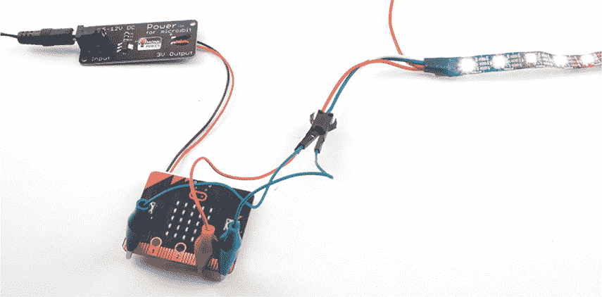

    *图 3-10：使用 micro:bit 测试 LED 灯带*

    鳄鱼夹跳线的引脚将插入连接到 LED 灯带的三路连接器。你的 LED 灯带可能与图 3-10 中显示的颜色线不同，因此最好查看灯带本身，看看线缆连接的位置。一根线会标记为 GND；将其连接到 micro:bit 的 GND 接口。第二根线会标记为 5V；将其连接到 micro:bit 的 3V 接口。中间的最后一根线会标记为 DIN（数据输入）或指向 LED 的箭头。将这根线连接到 micro:bit 的引脚 0。

1.  访问 *[`github.com/simonmonk/mbms/`](https://github.com/simonmonk/mbms/)* 并点击 **Magic Mirror** 链接。点击 **下载** 下载代码，然后将 hex 文件复制到你的 micro:bit 上。如果遇到问题，请返回第 11 页的“编程 micro:bit”部分，在那里我们详细讨论了如何将程序上传到 micro:bit。

    如果你更喜欢使用 Python，那么可以从同一个网站下载代码。关于如何下载并使用本书中的示例，参见第 34 页中的“下载代码”。这个项目的 Python 文件是 *ch_03_Magic_Mirror.py*。

1.  一旦你将程序加载到 micro:bit 上，你应该能看到 LED 灯带随即随机闪烁。

    图 3-11 展示了如何从相框构建无尽镜。

    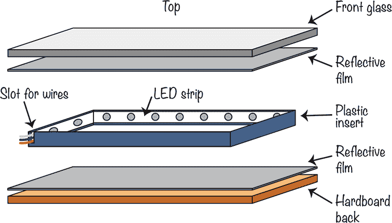

    *图 3-11：无限镜的构造方式*

    以下步骤将指导你完成这个部分的项目构建。

1.  拆开相框并取出塑料插入件。使用工艺刀，小心地在插入件的一个角落切出一个槽，正如图 3-12 所示，供 LED 条带的电缆通过。

    **警告** *工艺刀非常锋利，因此请小心使用，并请求成人帮助。*

    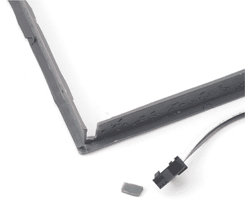

    *图 3-12：在塑料插入件上切割电线槽*

1.  在不去掉背胶的情况下，将 LED 条带放置在塑料插入件的边缘。如果条带不够长，你可以将其拉伸过角落，正如图 3-13 所示。确保它合适后，撕下背胶膜并将 LED 条带固定在插入件的内侧。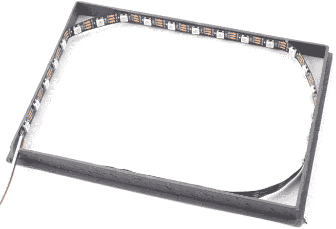

    *图 3-13：将 LED 条带固定到塑料插入件上*

1.  现在将插入件放到一旁。下一步是将反射膜附着到玻璃上。小心地取下框架的玻璃并用肥皂水清洗。擦干一面，并将其湿面朝上放下。

    拿起反射膜。膜的粘性面上会有一层透明塑料背纸。要分离这层薄透明层，可以在膜的两侧贴上胶带并将其拉开（图 3-14）。

    

    *图 3-14：去除反射窗膜的塑料背纸*

    将反射膜的粘性面朝下放置在湿玻璃上。使用塑料卡片或尺子，将膜与玻璃之间的气泡推到玻璃边缘以去除它们（图 3-15）。

    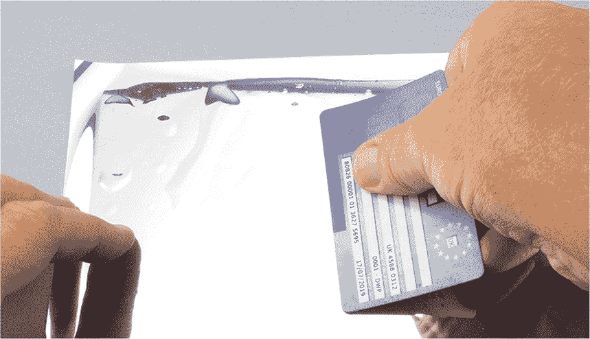

    *图 3-15：去除反射窗膜上的气泡*

1.  让膜干燥大约一小时。然后将玻璃翻转过来，使用工艺刀将膜修剪成与玻璃相同的大小（图 3-16）。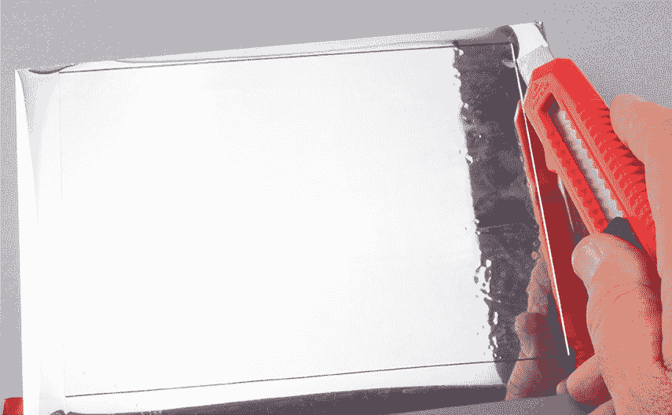

    *图 3-16：修剪反射窗膜*

1.  将框架的背板放在第二块反射膜上，并将膜剪裁成与背板框架相同的大小（图 3-17）。除非膜在重新组装框架时无法平整地贴合，否则不需要去除保护膜或将膜粘贴到背板上。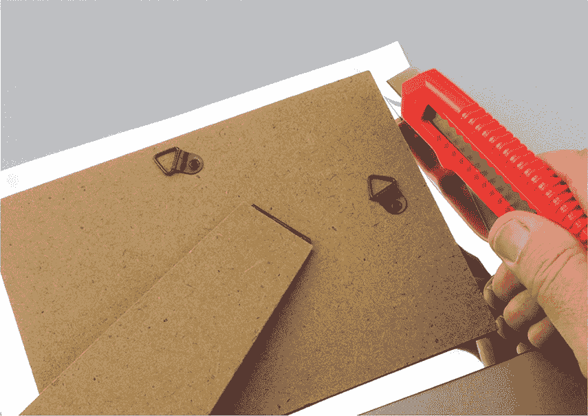

    *图 3-17：为背板修剪反射窗膜*

1.  现在是时候组装框架了。

    将玻璃放回框架中，玻璃面朝外。这样可以保护膜并使镜面效果更佳（图 3-18a）。如果你的相框里有一张薄纸板是为了配合更小的照片使用的，你可以在玻璃后面放入这块纸板。

    接下来，将塑料插入物放回框架中，让电缆从一角穿出（见图 3-18b）。如果插入物有一个较宽的平面设计来支撑照片，应确保平面面朝外，远离玻璃。

    最后，将纸板放回框架上，让电缆从一角穿出（见图 3-18c）。固定背板，并将完成的框架翻转过来（见图 3-18d）。

    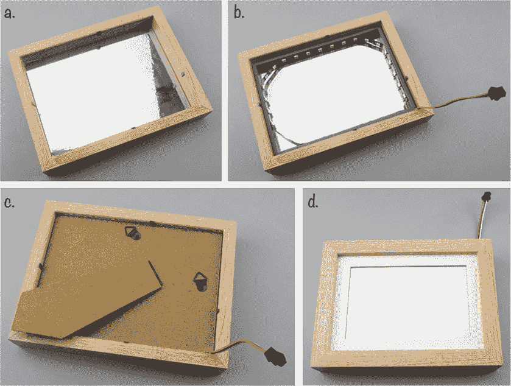

    *图 3-18：重新组装框架*

1.  重新连接你的 micro:bit，魔镜应该开始运行。

#### 代码

我们希望编程使 LED 随机闪烁。为此，代码会随机选择一个 LED，然后生成一个随机颜色并将该颜色设置为该 LED 的颜色。

##### Blocks 代码

以下是该项目的 Blocks 代码。

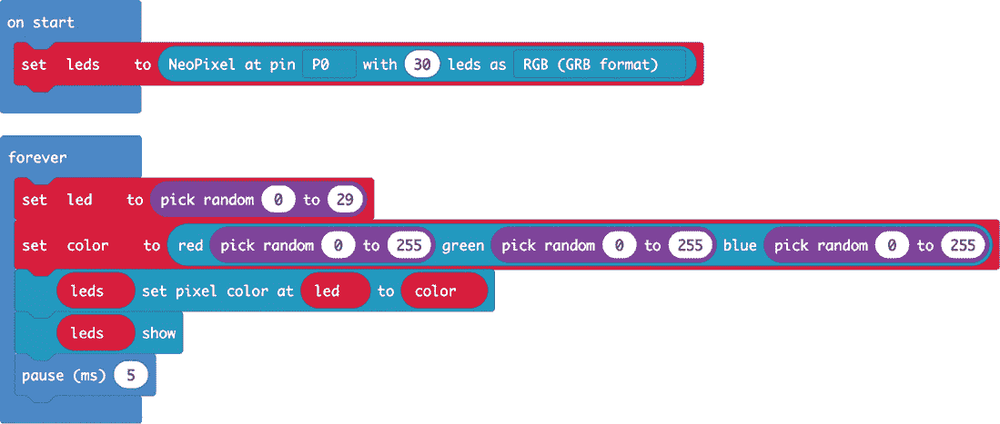

当使用可寻址的 LED（在 Blocks 代码中称为 NeoPixels）时，你需要将 `NeoPixel at` 块赋值给一个变量，在此我们称之为 `leds`，并将其放入 `on start` 块中。你必须为 `NeoPixel at` 块提供控制 LED 的引脚。在此案例中，我们使用引脚 P0。然后指定 LED 条上的 LED 数量，我们这里是 30 个。最后，告诉 `NeoPixel at` 如何定义颜色。在此案例中，颜色使用标准的 RGB 格式。

我们再次使用 `forever` 块来使代码不断运行。在 `forever` 块中，我们首先使用 `pick random` 块生成一个 0 到 29 之间的随机数字，并将其分配给变量 `led`。这会随机选择一个 LED。然后，将 `color` 变量赋值为随机的红色、绿色和蓝色值（范围为 0 到 255）。

`show` 块会更新 LED 条以反映我们刚刚做出的更改。

尝试修改代码来改变 LED 颜色。

##### MicroPython 代码

这是代码的 MicroPython 版本。

from microbit import *

import neopixel, random

leds = neopixel.NeoPixel(pin0, 30)

while True:

led = random.randint(0, 29)

color = (random.randint(0, 255), random.randint(0, 255), random.randint(0, 255))

leds[led] = color

leds.show()

sleep(5)

这段代码与 Blocks 版本的工作原理非常相似。请注意，程序顶部需要包含 neopixel 和 random 库，以便访问 LED 条并生成随机数字。

MicroPython 的 neopixel 库首先将 LED 条定义为使用 pin 0，这就是我们将其连接到的 micro:bit 引脚，并且长度为 30 个 LED。它通过命令 `leds = neopixel.NeoPixel(pin0, 30)` 来完成这个定义。

然后，`while` 循环执行与 Blocks 版本中的 `forever` 块相同的操作，随机选择一个 LED 并将其设置为随机颜色。

#### 原理

图 3-19 展示了无限镜像是如何工作的。

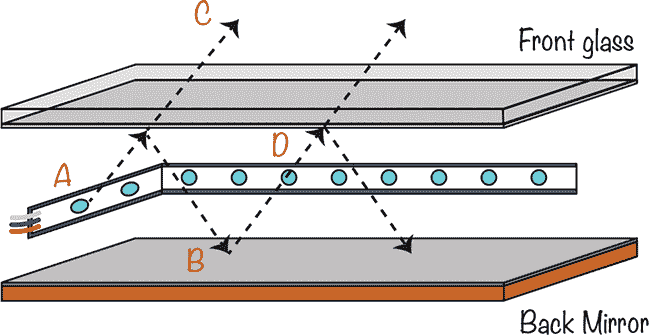

*图 3-19：光线在无限镜像项目中反弹*

来自 LED 的光朝四面八方传播（见图 3-19 中的 A）。其中一些光向上传播，朝画框的前方。镜面薄膜将其中一部分光反射回到画框后部的镜子（B）。剩余的光逃出画框（C），其中一些光会进入你的眼睛后部，在那里形成影像。

与此同时，一些射向镜子（B）的光会再次反射向前玻璃（D）。其中一部分光将完全从画框中逃逸，并进入你的眼睛，剩余的光将进行另一次反射。正是这种光的来回反射，导致 LED 灯看似不断消失在镜子中，每次都会因部分光线丧失而变得越来越暗。

### 总结

在本章中，你已经学会了如何用你的 micro:bit 进行光的测量和产生。在第四章中，疯狂科学家将注意力转向磁性。
