## 第四章：**神奇的磁力**

正如你在第一章中看到的，micro:bit 有一个内建的磁力计，可以用于多种目的。在这一章中，我们将用它将你的 micro:bit 变成一个指南针，告诉你你面朝哪个方向。我们还将测量钕磁铁的磁场。接着，我们将制作一个磁力报警器，门一打开就响。

### 项目：指南针

*难度：简单*

在这个项目中，如图 4-1 所示，你将使用 micro:bit 内建的磁力计作为指南针。它会在屏幕上显示一个箭头，指向磁北。

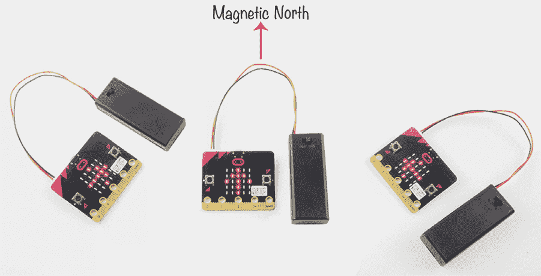

*图 4-1：用 micro:bit 指南针寻找北方*

与传统的指南针不同，这款指南针并不总是指向北方。相反，它会显示你需要转向哪个方向才能面朝北方。

转动直到箭头正对前方，且你正面朝北！

#### 所需材料

对于这个实验，你将需要：

**Micro:bit**

**电池组**

你只需要一个 micro:bit 就可以制作这个指南针，但如果你计划在户外导航，那么你还需要一个电池组。

#### 构建

1.  访问*[`github.com/simonmonk/mbms/`](https://github.com/simonmonk/mbms/)*来访问本书的代码库，并点击**Compass**链接。程序打开后，点击**下载**，然后将.hex 文件复制到你的 micro:bit 上。如果你在这部分遇到问题，请返回第一章，那里有完整的将程序加载到 micro:bit 的过程说明。

    如果你更喜欢使用 Python，那么可以从同一网站下载代码，并附带下载和使用本书示例的说明。此实验的 Python 文件是*ch_04_Compass.py*。

1.  一旦你将程序加载到 micro:bit 上，你将看到一个提示信息，指示你以某种方式移动 micro:bit。请按照指示进行操作。每次你将使用磁力计的程序闪存到 micro:bit 上时，这个提示都会出现。

    以这种方式移动你的 micro:bit 的目的是为了校准其磁力计。micro:bit 上的磁力计芯片对局部磁场变化非常敏感。通过改变磁力计的方向，你帮助它的内部过滤软件补偿地球磁场的局部扭曲。这就是为什么如果你把 micro:bit 带到室外，远离常见的室内金属物体时，最好重新校准你的指南针。另外，电池组可能会影响磁力计，因此最好使用最终项目中将要使用的硬件进行校准。

    校准 micro:bit 的磁力计有点像做拼图。当你移动 micro:bit 时，更多的 LED 灯会亮起（参见图 4-2）。

    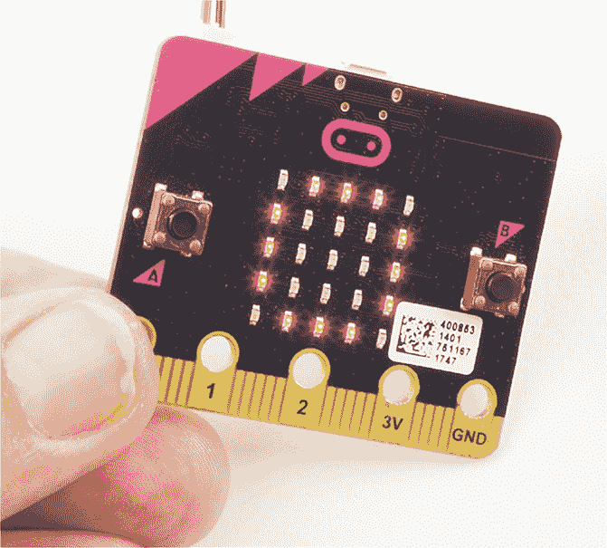

    *图 4-2：校准你的 micro:bit 磁力计*

1.  要使用指南针，请将电池包连接到 micro:bit，并将其带到户外，远离计算机和家用电器等物品。保持 micro:bit 水平（即平放）。如果箭头指向右或左，慢慢转动，直到箭头指向正前方。当箭头指向正前方时，表示你正面朝磁北。

    如果指南针未指向北方，请尝试再次按**A 键**进行校准。

#### 代码

Blocks 和 MicroPython 版本的代码遵循相同的模式。*heading*或*bearing*（micro:bit 指向的方向）被测量，然后程序决定应该显示哪一个箭头（北、东或西）来引导用户朝正确的方向前进。

##### Blocks 代码

这是这个项目的 Blocks 代码。

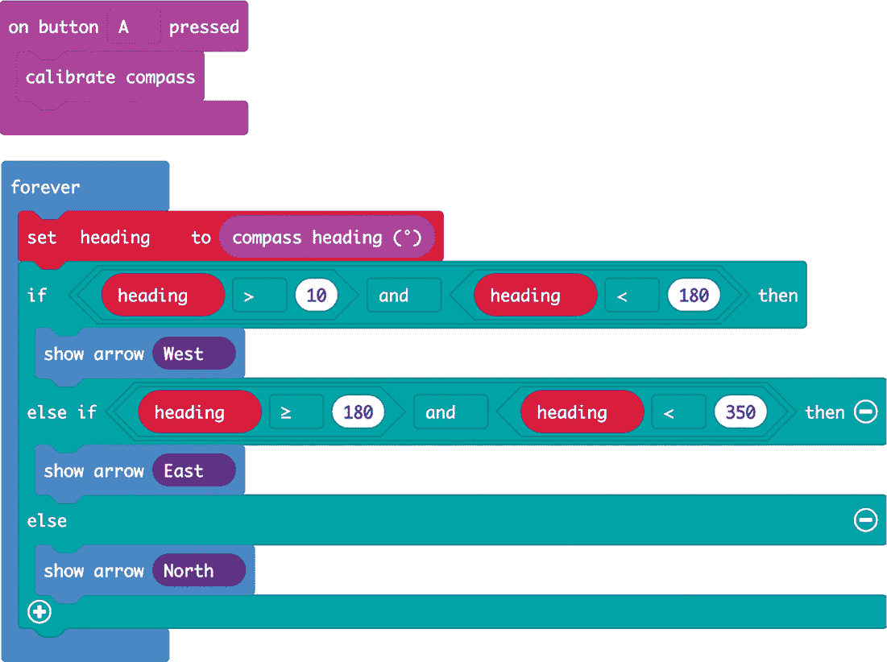

在这个项目中，我们将设置代码，以便你可以随时通过按 A 键来校准磁力计。

`calibrate compass`块位于`on button A pressed`块内。`calibrate compass`块将显示我们之前用于校准磁力计的点。你可以像我们在项目开始时那样，围绕显示屏旋转它。

在`forever`语句块中，将`compass heading`的值（0 到 359 度）赋给名为`heading`的变量，该变量将保存这个方向值。

然后创建一个大的`if`语句块，其中包含`if`、`else if`和`else`。这个大语句块将测试 micro:bit 的朝向，并在 LED 显示屏上显示一个箭头，告诉你应该转向哪个方向以面朝北方。

如果你自己编写这段代码，你会注意到 Blocks 代码库似乎只提供两种类型的`if`语句块：`if then`和`else`。要添加`else if then`部分，请点击图 4-3 中的`+`号。

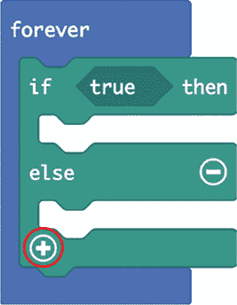

*图 4-3：向 if 语句块添加另一部分*

大的`if`语句块的第一行用于测试`heading`是否在 10 到 180 度之间，其中 0 度表示北方。因此，`heading`值在 10 到 180 之间表示你正面朝东。在这种情况下，micro:bit 会显示指向左侧的西方箭头。这个箭头告诉你向左转，以便面朝北方。

如果`heading`不在 10 到 180 之间，则`else if`部分会测试`heading`是否大于等于 180 并且小于 350 度。如果是，那么 micro:bit 会显示东箭头，告诉你向右走。

如果`heading`在 350 到 10 度之间，那么`if`语句块的`else`部分会显示指向前方的北方箭头——你走在正确的道路上！图 4-4 展示了这一工作原理（数字是`heading`的可能值）。

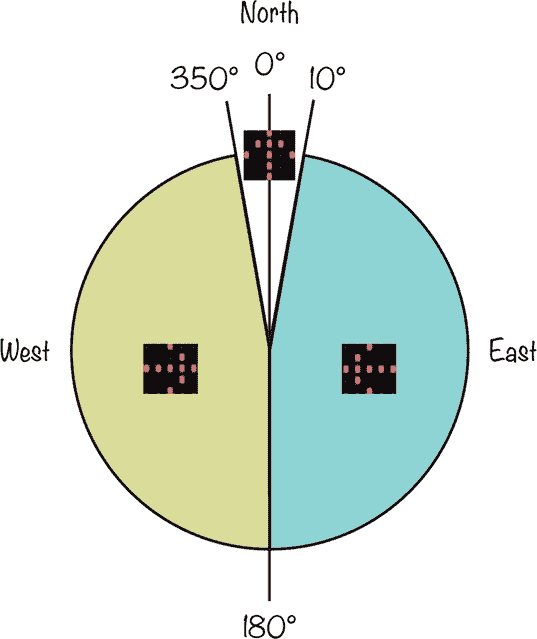

*图 4-4：箭头将指向三个方向之一，引导你朝北方。*

##### MicroPython 代码

这是该项目的 MicroPython 代码：

from microbit import *

while True:

heading = compass.heading()

if heading > 10 and heading < 180:

display.show(Image.ARROW_W)

elif heading >= 180 and heading < 350:

display.show(Image.ARROW_E)

else:

display.show(Image.ARROW_N)

if button_a.was_pressed():

compass.calibrate()

这段代码使用与其块编程等效的逻辑：它检查磁力计的读数，并告诉 micro:bit 显示箭头。同样，如果方向在北方 10 到 180 度之间，micro:bit 会显示一个指向西方的箭头；如果在 180 到 350 度之间，micro:bit 会显示一个指向东方的箭头；如果方向在北方 20 度以内，箭头会指向正上方，告诉你继续沿着这个方向前进。

#### 可尝试的操作

看看你能否用一个磁铁让指南针混淆北方的方向。

#### 工作原理：地球的磁场

地球的磁北极和磁南极具有强大的电荷，形成了一个环绕地球的磁场，如在图 4-5 中所示。

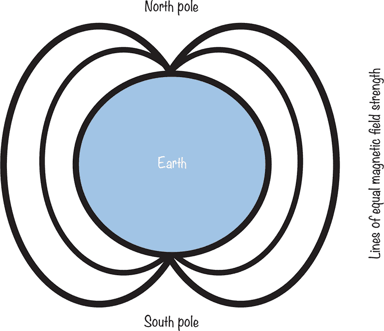

*图 4-5：地球的磁场*

micro:bit 的磁力计测量地球磁场的强度，从而推断出 micro:bit 面对的方向。

有趣的是，磁北极并不完全位于地球自转球体的顶部。根据你所在的位置，磁场的中心可能会偏离地理北极多达 20 度。

关于磁极的另一个有趣事实是，它们每年以大约 6 英里（10 公里）的速度移动。某一天，磁极将完全翻转，意味着磁北将位于地球的南端。这个过程大约每 45 万年发生一次。

### 实验 4：测量磁场

*难度：中等*

如我们刚刚看到的，micro:bit 内置的磁力计足够灵敏，你可以用它作为指南针来找到北方。它还是测量附近磁铁强度的好工具。在这个实验中（如图 4-6 所示），你将测量不同距离下磁场的强度。

#### 你将需要的材料

在这个实验中，你将需要以下设备：

**Micro:bit**

**强力钕磁铁**

**直尺（最好能显示毫米）**

你可以在 eBay 上找到各种形状和大小的磁铁。正如在图 4-6 中所示，我使用的是一个直径为 10 毫米的圆盘形磁铁，但任何类似大小的钕磁铁都应该可以使用。请注意，我在磁铁的一侧贴了一小块标有*N*的胶带（稍后会详细介绍）。

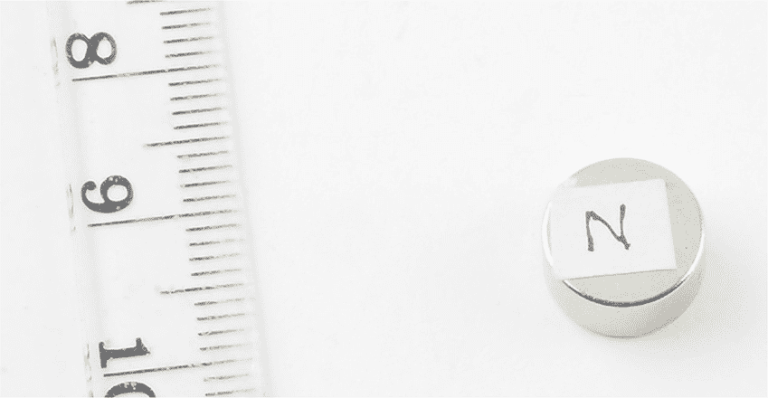

*图 4-6：用于实验 4 的钕磁铁*

**警告** *钕磁铁非常强大，处理时要小心。如果两个磁铁粘在一起，分开它们可能会很困难。*

#### 构建

该程序会反复在 micro:bit 的显示屏上滚动一个数字。这个数字表示磁力计检测到的整体磁场强度。我们将测量磁铁在不同距离下的磁场强度。

1.  请访问 *[`github.com/simonmonk/mbms/`](https://github.com/simonmonk/mbms/)* 以访问书籍的代码库，并点击 **实验 4：磁场** 的链接。程序打开后，点击 **下载**，然后将 hex 文件复制到你的 micro:bit 中。如果在这个过程中遇到困难，请返回第一章，那里详细解释了如何将程序传输到 micro:bit。

    如果你更喜欢使用 Python，可以从同一网站下载此项目的代码，并按照说明下载和使用书中的示例。此实验的 Python 文件是 *Experiment_04.py*。

1.  将磁铁放置在平坦的表面上，使其平衡地摆放在弯曲的边缘上。由于钕磁铁的磁力非常强，如果将它这样放置，它会自行与地球的磁场对齐（通过旋转直到一面朝北），就像指南针的指针一样。让磁铁自行对齐，然后在朝北的一侧贴上胶带。（你可能需要使用本章早些时候提到的指南针项目来找到北方，避免误标记南方。）

1.  调整尺子，使 0 厘米标记指向北方，30 厘米标记指向南方，如图 4-7 所示。尺子帮助确保磁铁持续朝北，以保持地球磁场的影响不变。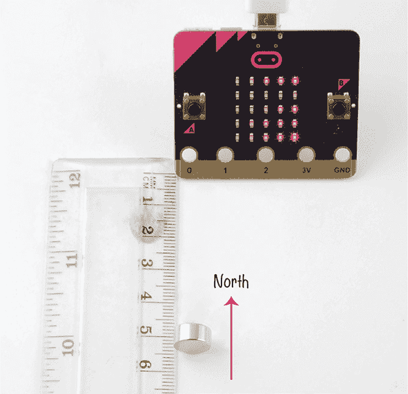

    *图 4-7：将尺子放置在南北方向，确保磁铁持续朝北。*

1.  将磁铁放置在尺子上的 1 厘米标记旁边，确保北面朝向 micro:bit。将 micro:bit 朝南并使其边缘与 0 厘米标记对齐。记录显示在 micro:bit 上的读数，并将其写入下表的 1 厘米行。磁场强度的单位是 *特斯拉*（非常非常强的磁场），因此 micro:bit 的读数以 *微特斯拉*（即特斯拉的百万分之一，符号为µT）表示。

    |  **micro:bit 到磁铁的距离（厘米）**  | **磁场强度（µT）** |
    | --- | --- |
    | 1 | **___________________________________** |
    | 2 | **___________________________________** |
    | 3 | **___________________________________** |
    | 4 | **___________________________________** |
    | 5 | **___________________________________** |
    | 6 | **___________________________________** |
    | 7 | **___________________________________** |
    | 8 | **___________________________________** |
    | 9 | **___________________________________** |
    | 10 | **___________________________________** |

1.  将磁铁移动到刻度尺上的 2 cm 标记旁边。在表格中的相应行输入 micro:bit 上显示的新数字。对于所有的读数，直到 10 cm，都重复这个过程。请注意，当你将磁铁从 micro:bit 移开时，磁场强度会迅速减小。

1.  一旦你完成了所有的读数，试着绘制一个结果图。让纵轴，即*Y 轴*，显示磁场强度（单位：µT），并将磁铁距离 micro:bit 的距离（单位：cm）绘制在横轴，即*X 轴*上。

    你可以手动在纸上绘制这个图表，或者，如果你愿意，你可以复制我为这个实验创建的 Google 表格，并将我的读数替换为你刚刚记录下的数字。你可以在 *[`github.com/simonmonk/mbms/`](https://github.com/simonmonk/mbms/)* 上找到这个表格的链接。打开这个链接后，在表格菜单中选择 **文件**▸**创建副本** 来创建你自己的副本。图 4-8 显示了完成的表格，下面是一个包含读数的图表。

    请注意，你的读数可能不同，因为你的磁铁可能比我的强或弱。

    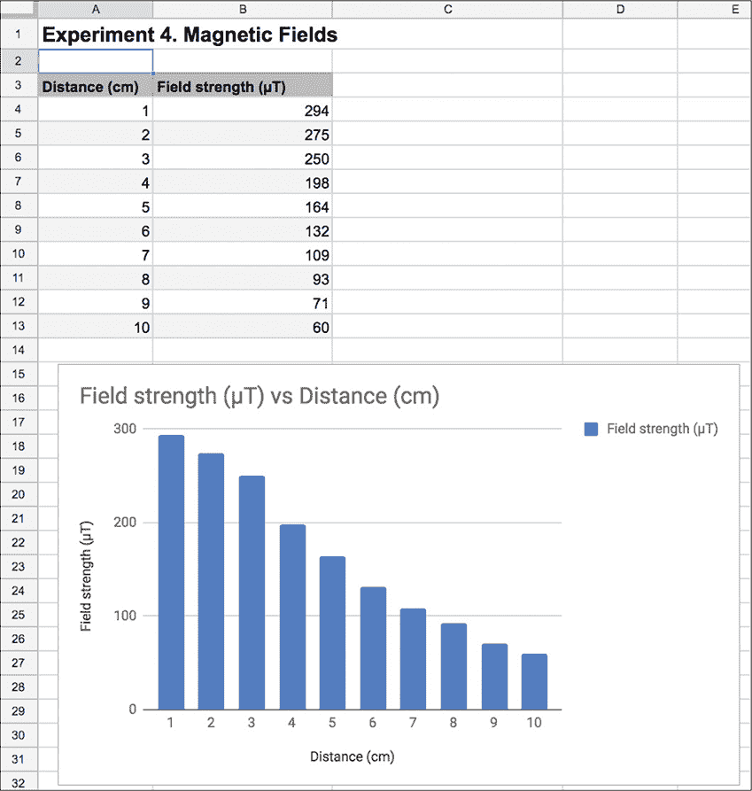

    *图 4-8：绘制你的结果图表。*

我们将在“工作原理：磁铁的强度”部分讨论这些结果，详见 第 99 页。

#### 代码

这个实验的代码很简单。它读取数据，显示结果，然后重复。

##### 积木代码

这是这个项目的积木代码。

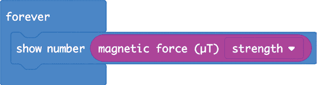

`show number` 块显示 `magnetic force` 块的结果，并且位于 `forever` 块内。

`magnet force` 块有四个选项，你可以在该块的下拉菜单中查看。你可以选择获取 X、Y 或 Z 维度中任意一个维度的单独读数，或者获取三个维度的组合力测量值。我们将使用组合测量值，即下拉菜单中的 `strength` 选项。

##### MicroPython 代码

这是该项目的 MicroPython 版本代码：

from microbit import *

while True:

display.scroll(str(int(compass.get_field_strength() / 1300)))

在 MicroPython 中，`get_field_strength` 函数从 micro:bit 的磁力计中获取读数。与积木代码中的 `magnetic force` 块不同，MicroPython 代码没有指定返回结果的单位，但我们得到的读数大约是 `magnetic force` 块返回读数的 1,300 倍。因此，需要将该数值除以 1,300，然后使用 `int` 函数将其转换为整数。

使用 `str` 函数将数字转换为文本字符串，以便 `scroll` 函数能够将其显示在 micro:bit 屏幕上。

#### 可尝试的操作

使用实验 4 的程序，尝试将磁铁移得更远，以查看磁铁能移多远，但仍能在 micro:bit 上显示。

#### 工作原理：磁铁的强度

图 4-8 中的图表显示，当你将磁铁移远 micro:bit 时，磁场强度最初会迅速下降，然后逐渐趋于平稳。事实上，磁场强度和磁铁之间的距离之间的关系遵循所谓的 *反平方定律*。也就是说，磁场强度与磁铁距离的平方根的倒数成正比。

这意味着，当磁铁与 micro:bit 之间的距离加倍时，磁场强度将下降到之前强度的四分之一。

地球的磁场强度在地面上测量时范围为 25 至 65 微特斯拉（µT）。当你测量没有附近磁铁时的磁场力，应该会得到这个范围内的读数。即使是实验中使用的超强钕磁铁，在几厘米的距离下，磁场强度也只有几百微特斯拉。用于磁共振成像（MRI）扫描时查看人体内部的磁铁，通常其磁场强度（即人躺的位置）为 0.5 至 1.5 特斯拉（T）。这比钕磁铁强几千倍。这就是为什么你进入 MRI 扫描仪时必须摘下身上的所有金属物品！

### 项目：磁性门铃报警器

*难度：中等*

我们将创建一个门铃报警系统！通过将磁铁安装在门上，并将 micro:bit 安装在门框上，疯狂科学家就能在客人到达时收到提醒。当 micro:bit 检测到磁场强度变化时，它将发出报警声音。这正是当有人打开门时，磁铁远离时发生的情况。

图 4-9 显示了项目安装在疯狂科学家门上的样子。

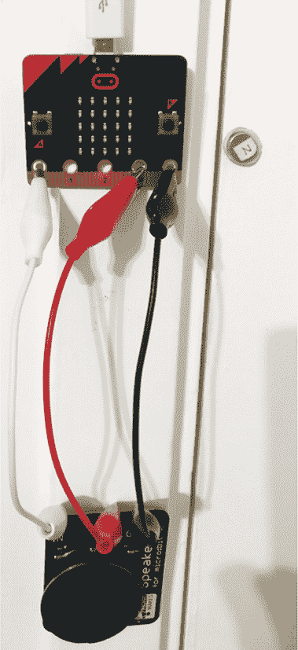

*图 4-9：磁性门铃报警器*

#### 所需材料

对于这个项目，您将需要以下物品：

**Micro:bit**

**3 × 鳄鱼夹连接线** 用于将 micro:bit 与扬声器连接。这些线缆至少应该长 15 厘米（6 英寸）。

**USB 电源适配器或带开关的 3V 电池包** 用于为 micro:bit 和扬声器供电。有关为 micro:bit 提供电源的其他选项，请参见附录。

**扬声器** 您可以使用在第二章中讨论的任何方法将声音从 micro:bit 输出。在这里，我使用了一个 Monk Makes 扬声器。

**粘性腻子或自粘垫片** 用于将 micro:bit 和扬声器固定到门框上，并将磁铁固定到门上

**钕磁铁** 如实验 4 中使用的磁铁

#### 构建

在将项目安装到门上之前，确保先进行测试，因为你需要进行一些实验来确定使用的正确磁场强度。你还需要在将其粘贴到门框之前校准磁力计。

1.  如图 4-9 所示，使用三根鳄鱼夹连接线将扬声器连接到 micro:bit。

    最好通过使用黑色电缆连接 GND，红色电缆连接 3V，其他颜色连接 micro:bit 的引脚 0 来进行电缆配色。这样，你就不会忘记哪个电缆是哪个。你需要将扬声器至少放置 15 厘米远离 micro:bit，因为扬声器有强大的磁铁，会干扰 micro:bit 的磁力计。

1.  访问 *[`github.com/simonmonk/mbms/`](https://github.com/simonmonk/mbms/)* 获取书籍的代码仓库，并点击 **磁性报警** 的链接。一旦程序打开，点击 **下载**，然后将 hex 文件复制到你的 micro:bit 上。如果在此过程中遇到问题，可以返回到 第一章。

    如果你更喜欢使用 Python，你可以在同一网站上找到该代码，并查看如何下载和使用书中的示例。这个实验的 Python 文件是 *ch_04_Magnetic_Alarm.py*。

1.  一旦你编程完成 micro:bit，当你将磁铁靠近 micro:bit 时，扬声器应该保持静音。然后当你将磁铁移开几英寸时，警报应该响起。程序正常工作后，断开 micro:bit 与计算机的连接，并将其连接到 USB 电源适配器或电池包上。然后将 micro:bit 和扬声器固定在门框上。将磁铁固定在门上，距离 micro:bit 不超过一英寸（2.5 厘米）。

    **警告** *粘合剂可能会弄得一团糟，因此在开始将物品粘贴到门和门框上之前，确保获得许可。*

    如果你使用的是 USB 电源适配器，确保有一个靠近门的电源插座，以便 USB 电源适配器能连接。

#### 代码

在这两个版本的代码中，首先读取磁场强度，然后与阈值进行比较。如果超过阈值，就会播放一个音符。

##### 块代码

这是该项目的块代码。

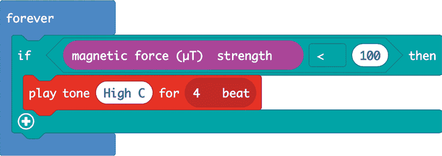

这段代码基本上是说，如果 micro:bit 读取到的磁力强度小于 100 µT，它应该播放一个特定的音符，持续 4 拍。由于地球表面的磁场强度范围是 25 到 65 µT，将阈值设置为 100 µT 应该能确保我们检测到的是磁铁，而不是地球的磁场。

##### MicroPython 代码

这是该程序的 MicroPython 版本：

from microbit import *

import music

while True:

if compass.get_field_strength() < 160000:

music.pitch(523, 1000)

这段代码与 Blocks 代码的工作方式相同，但由于`get_field_strength`的单位与`magnetic force`块的单位不同，触发警报的阈值与 Blocks 代码版本不同。`get_field_strength`返回的磁场强度单位在其文档中没有明确说明 (*[`microbit-micropython.readthedocs.io/en/latest/compass.html`](https://microbit-micropython.readthedocs.io/en/latest/compass.html)*)，因此我通过反复试验选择了 160,000 作为阈值。

我们通过命令 `music.pitch` 来指定产生的音调频率。与 Blocks 代码不同，在这里我们需要指定声音波的频率，而不是音符的名称。523 赫兹（Hz）是高 C 的频率。`music.pitch`命令还需要指定播放音符的时间长度。在这里，我们告诉 micro:bit 播放这个音符 1,000 毫秒，即 1 秒。

#### 尝试的事项

小偷能突破你的新警报吗？试着将第二个磁铁放在门框的另一侧，正对着 micro:bit。如果第二个磁铁足够接近 micro:bit，你可能能够在不触发警报的情况下打开门。

你也可以通过改变频率来更改警报音调。下表显示了一些音符及其对应的频率（四舍五入到最接近的整数）。

| **音符** | **频率（Hz）** |
| --- | --- |
| 中央 C | 262 |
| D | 294 |
| E | 330 |
| F | 349 |
| G | 392 |
| A | 440 |
| B | 494 |
| 高 C | 523 |

你可以在 *[`www.liutaiomottola.com/formulae/freqtab.htm`](https://www.liutaiomottola.com/formulae/freqtab.htm)* 找到完整的音符及其频率表。

### 总结

micro:bit 的磁力计不仅可以用来判断你朝哪个方向。 在这一章中，我们探索了如何利用它感应磁铁的存在，甚至通过测量磁场强度来做一些科学实验。

在下一章，我们将探索 micro:bit 的另一个内置传感器——加速度计。
