## 第五章：**神奇的加速度**

加速度计可以说是 BBC micro:bit 内置传感器中最有用的一个。它可以让你测量作用在 micro:bit 上的力的方向和强度，比如重力。

你可以用加速度计做很多事情，包括：

  检测摇晃等手势，甚至检测到你的 micro:bit 正在掉落

  学习 micro:bit 的倾斜方向和幅度，并使用这些控制你的 micro:bit

  测量 micro:bit 加速的速度（例如，你可以在计步器中使用它来查看你一天走了多少步。）

### 实验 5：手势

micro:bit 的软体包括手势识别，因此它可以响应加速度计感应到的特定动作，如倾斜或摇晃。在本节中，你将编写程序，使 micro:bit 在摇动时显示一个笑脸。

在本章稍后的部分，你将学习如何处理直接来自加速度计芯片的原始数据，以便你可以测量加速度。

#### 你需要的东西

在本实验中，你只需要你的 micro:bit。

#### 构建

1.  访问 *[`github.com/simonmonk/mbms/`](https://github.com/simonmonk/mbms/)* 获取书中的代码库，并点击链接进入 **实验 5：手势**。程序打开后，点击 **下载**，然后将 hex 文件复制到你的 micro:bit 上。如果你更喜欢使用 Python，可以从同一网站下载代码。关于下载和使用书中的示例的说明，请参见 第 34 页 的“下载代码”部分。本实验的 Python 文件是 *Experiment_05.py*。

1.  程序启动后，摇动你的 micro:bit，你应该能看到一个笑脸出现在屏幕上，然后消失。

#### 代码

在程序中使用手势在 Blocks 和 MicroPython 中是相似的。两种语言都有相同的手势类型。主要的区别在于，MicroPython 没有事件机制来处理事件；相反，你需要在循环中不断检查手势。

##### Blocks 代码

这是本实验的 Blocks 代码。

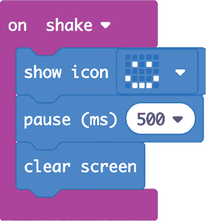

在 Blocks 代码中可用的加速度手势作为事件工作，就像按按钮一样。首先使用一个`on`块。点击三角形以访问可能手势的下拉菜单，如图 5-1 所示，选择`shake`。

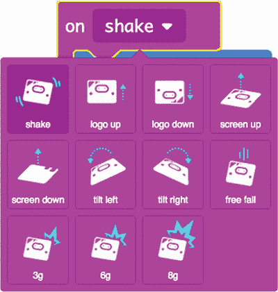

*图 5-1：选择不同的手势*

**不同的手势**

摇晃手势会响应任何显著的摇晃动作。接下来的两个手势，logo 向上和 logo 向下，分别响应 micro:bit 前后倾斜。此代码所指的 logo 是印刷在 micro:bit 板上、靠近 USB 接口的图标。

屏幕向上和屏幕向下的手势响应 micro:bit 的方向。例如，如果你将其屏幕朝下放置，你就会触发屏幕向下事件。

左倾和右倾事件在你将 micro:bit 向左右倾斜超过约 60 度时触发。你需要大幅度倾斜它才能触发这些事件。

最后的四个事件与加速度计上的总力有关，而不是某个特定方向的力。例如，如果 micro:bit 处于自由落体状态，那么自由落体将触发自由落体事件。手势 3g、6g 和 8g 检测加速度计上作用的不同力，单位为*g*（即重力加速度，或称*g 力*）。例如，你可以检测到手指轻拍 micro:bit。轻拍 micro:bit 时并不会使其移动很多，因此你可能认为涉及的力不大，但事实上，轻拍可以施加相当高的 g 力。

##### MicroPython 代码

以下是此实验的 MicroPython 代码：

来自 microbit 的 import *

while True:

if accelerometer.was_gesture('shake'):

display.show(Image.HAPPY)

sleep(500)

display.clear()

你会认出大部分代码。我们导入了常见的库，然后启动一个`while True`循环，使主代码持续运行。这个循环检查 micro:bit 是否检测到摇晃，如果检测到，则显示笑脸！

因为 MicroPython 没有“事件”这个概念，所以你必须在 `while` 循环中使用 `was_gesture` 函数来检查摇晃手势。你还可以将 `shake` 替换为 `up`、`down`、`left`、`right`、`face up`、`face down`、`freefall`、`3g`、`6g` 或 `8g`。

#### 可以尝试的事项

尝试在实验 5 中为程序添加更多手势。你甚至可以让每个手势触发屏幕上的不同图标。

在 第十章中，你将再次使用手势检测来控制 micro:bit 驱动的机器人漫游车！

#### 工作原理：力、加速度与重力

我们一直在谈论力、加速度和重力，好像加速度计能测量所有这些，但它实际上只是测量某个质量的位移距离。然后它计算出其他相关的测量值。让我们看一看加速度计芯片实际执行的操作，以更好地理解这三个术语的含义。

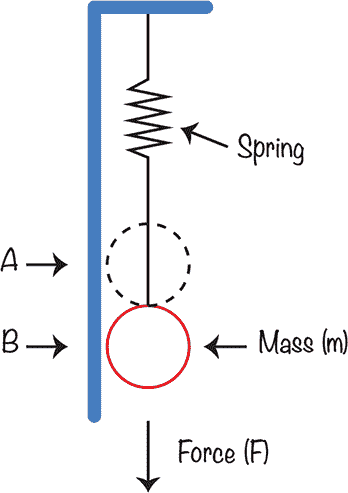

*图 5-2：micro:bit 的加速度计*

图 5-2 展示了微型加速度计芯片的大致示意图，该芯片附加在你的 micro:bit 上。

想象一下，一个小质量 *m* 附着在弹簧上。（这个质量在 图 5-2 中画成一个球形，但它的形状并不重要。）通常情况下，质量处于位置 A，但如果它受到某种力（例如重力）的拉动，便会移动到其他位置，我们称之为位置 B。力越强，A 和 B 之间的差距越大。通过测量这个距离，加速度计可以计算作用在质量上的力。

通过查看 图 5-2，你可以看到仅重力的作用会使质量向下拉。但弹簧被拉伸得越多，它对质量的反向拉力也就越大。所以，重力对质量施加向下的力，拉伸弹簧，而弹簧则施加向上的力。当这两股力相等但方向相反时，B 和 A 之间的距离就能衡量作用在 micro:bit 上的重力大小。A 和 B 之间的距离越大，作用在质量上的力就越大。

记住，重力加速度与由于重力作用而发生的加速度有关。加速度是速度的增加。换句话说，如果你把 micro:bit 从高楼上扔下，加速度 *g* 是指每秒 micro:bit 的速度增加的米数。如果你把 micro:bit 扔进真空中，没有空气来减慢它的速度，在这种情况下，micro:bit 的速度每秒增加约 9.8 米。所以，如果它从 0 速度（就像你手里拿着它一样）开始，然后自由下落 10 秒钟，它的速度将达到 98 米每秒（约 220 英里每小时）。

此外，当 micro:bit 以 220 英里每小时的速度撞击地面时，它可能会被摔得粉碎。

然而，如果你在真空中丢下 micro:bit，它的加速度计会显示 0，尽管它明显在以每秒 9.8 米的加速度加速。这是因为加速度计实际上并没有测量加速度。如你在 图 5-3 中所看到的，它是在测量作用在 micro:bit 内部质量上的力。如果质量和弹簧的加速度相同，那么加速度计读取的力将为零，因为它们的加速度相同。

如果你处在太空中，远离天体的引力作用，那么加速度将等于作用在物体上的力除以物体的质量。由于质量始终不变，只要有任何力量作用在 micro:bit 上，加速度计就能告诉我们它的加速度。

加速度计芯片实际上比 图 5-2 所示的更先进，因为它内含三个测量力的装置，分别测量三个方向上的力，这些方向互相垂直。换句话说，芯片测量作用在它上面的三维力，分别是 X、Y 和 Z 方向，如 图 5-3 所示。

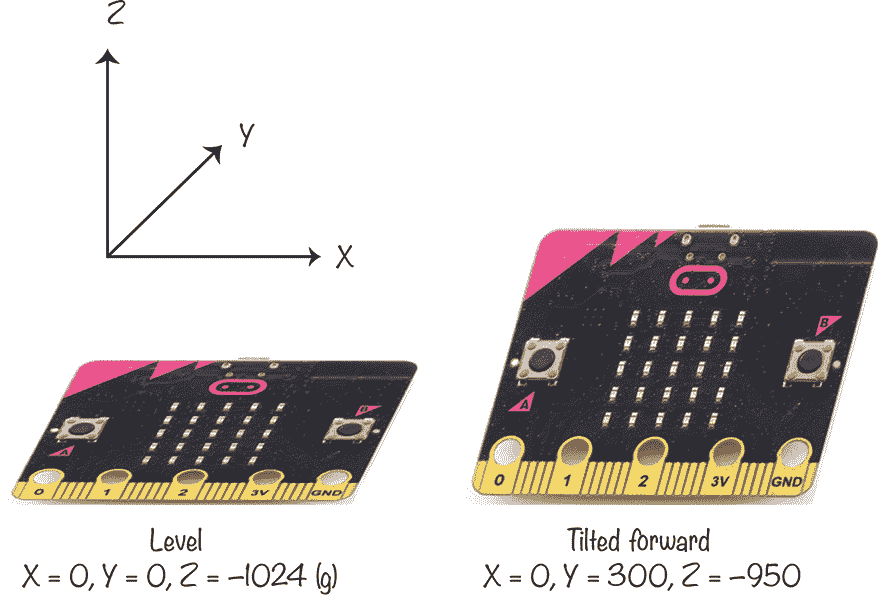

*图 5-3：micro:bit 的加速度计测量三维力。*

如果你的 micro:bit 平放在桌面上，X 维度将沿左右方向，Y 维度将沿前后方向，Z 维度将沿桌面上下方向。所以，如果 micro:bit 完全水平放在平坦的桌面上，重力的作用力只会作用在 Z（上下）维度，而 X 和 Y 维度的加速度为 0。现在，如果你稍微倾斜 micro:bit，那么部分重力将作用在 Y 维度上，因此 Y 值将不再是 0。这也意味着，作用在 Z 维度上的重力会稍微减少，因此 Z 值会略微下降。

从目前的描述来看，你可能认为加速度计仅用于测量重力。然而，看看图 5-2，很容易想象，当你摇动 micro:bit 或对其施加任何类型的加速度时，会改变质量的位置。

### 实验 6：实时加速度绘图

Mu 有一个很棒的功能，可以实时绘制来自 micro:bit 的数据。在这个实验中，你将使用绘图仪功能查看当你移动 micro:bit 时加速度数据如何变化。

**注意** *在撰写时，绘图仪功能仅在 Windows 和 Mac 版本的 Mu 编辑器中可用。该实验还向你展示了如何获取加速度的整体测量值，以及 X、Y 和 Z 维度的单独读数。*

#### 所需材料

对于这个实验，你只需要一块通过 USB 线连接到计算机的 micro:bit。

#### 构建

1.  本项目使用了 Mu 的绘图仪功能，这需要使用 Python，因此这里没有 Blocks 代码。你可以在*[`github.com/simonmonk/mbms/`](https://github.com/simonmonk/mbms/)*找到代码。这个实验的 Python 文件是*Experiment_06.py*。将程序刷入你的 micro:bit。

1.  点击 Mu 工具栏中的**绘图仪图标**以打开 Mu 的绘图仪，显示在图 5-4 中。如果你想查看 Mu 用于创建图表的原始数据，请点击**REPL**按钮。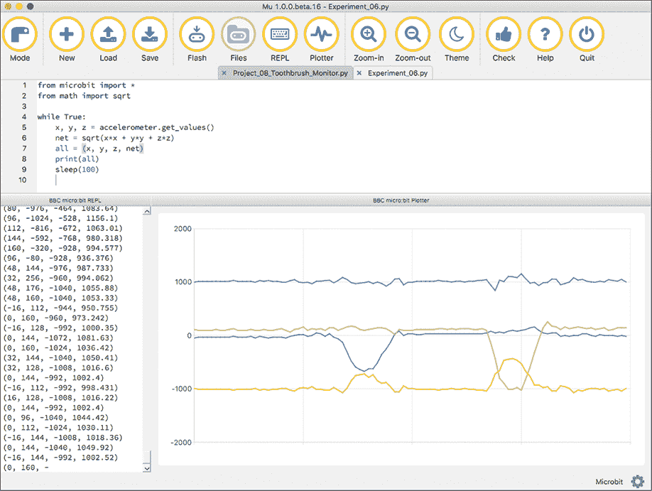

    *图 5-4：使用 Mu 绘制加速度计数据*

1.  将 micro:bit 朝不同方向倾斜，观察绘图仪中的变化。

如图 5-4 所示，有四个图形，每个图形用不同的颜色绘制。每个维度有一个图形（X 为蓝色，Y 为绿色，Z 为橙色）。还有一个紫色图形代表*总加速度*，它是所有三个维度的力的组合。我们将在“工作原理：计算总加速度”部分的第 11 页解释如何计算总加速度。

如果你发现屏幕上的 REPL 区域没有显示读数，可能是你的 micro:bit 版本较旧，需要更新才能正常工作。如果是这种情况，请按照*[`support.microbit.org/support/solutions/articles/19000019131-how-to-upgrade-the-firmware-on-the-micro-bit/`](https://support.microbit.org/support/solutions/articles/19000019131-how-to-upgrade-the-firmware-on-the-micro-bit/)*上的说明更新你的设备。

#### 代码

这是将加速度计数据发送到 Mu 的绘图工具的 Python 代码：

from microbit import *

from math import sqrt

while True:

x, y, z = accelerometer.get_values()

net = sqrt(x*x + y*y + z*z)

all = (x, y, z, net)

print(all)

sleep(100)

导入常规的 micro:bit 库。然后从 Python 的 math 库中导入平方根函数`sqrt`。我们将使用这个函数来计算净加速度。

添加一个`while`循环，使用`get_values`方法一次性从加速度计获取 X、Y 和 Z 三个维度的读数。这一行将返回一个*元组*，它是一种可以容纳多个值的数据结构。将这个元组赋值给三个变量：`x`、`y`和`z`，分别存储三个值。我们使用这些变量来计算净加速度，并将其赋值给变量`net`。

接下来，将净加速度值以及 X、Y 和 Z 三个维度的单独加速度值发送给 Mu 进行绘图。Mu 要求你要绘制的值以元组的形式传递，因此创建一个新的元组`all`，包含这四个值。

最后，打印元组，这不仅会在 Mu 的 REPL 中显示这些值（有关详细信息，请参见第 23 页的《REPL》），还会将这些值提供给 Plotter。你可以在图 5-6 的左下角看到打印出来的值。

#### 工作原理：计算净加速度

要计算 X、Y 和 Z 三个维度上的净加速度，你需要使用一些古老的希腊技术：*毕达哥拉斯定理*。

为了理解这一点，可以把加速度力想象成一条带箭头的线。箭头表示力的方向，线的长度表示力的强度。像这样的线称为*向量*，在物理学中经常使用它们。

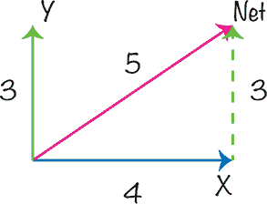

*图 5-5：二维向量*

在二维空间中，向量比在三维空间中更容易理解。图 5-5 显示了 X 和 Y 维度上的一些二维向量。沿 X 轴的蓝色向量强度为 4，沿 Y 轴的绿色向量强度为 3。

紫色向量，等于绿色和蓝色向量的合成效应，就是我们程序之前计算出来的*净向量*。净向量非常有用，因为它的长度告诉你力的整体强度。要计算净向量的强度，你可以使用毕达哥拉斯定理。

勾股定理指出，在直角三角形中（即有一个直角的三角形），*斜边*（三角形的最长边）的平方等于其他两边的平方和。

看图 5-5，你可以看到我们确实有一个直角三角形，因为蓝色和绿色向量在一个直角处交汇。利用勾股定理，我们可以说紫色线的长度平方等于 32 + 42。即 9 + 16，结果是 25。所以，紫色线的长度是 25 的平方根，等于 5。

这个数学原理不仅适用于二维，也适用于三维。要计算 X、Y 和 Z 维度的网向量的长度，只需将这三个向量的平方和开方。

图 5-6 展示了在某一时刻，X、Y 和 Z 维度中的三个力。

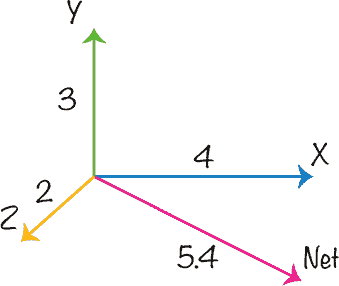

*图 5-6：三维空间中的加速度力向量*

这是计算替代 X、Y 和 Z 向量的单一向量长度的代码行。

net = sqrt(x*x + y*y + z*z)

X、Y 和 Z 值分别可以在由`accelerometer.get_values()`返回的元组中的`a[0]`、`a[1]`和`a[2]`找到。

如果 X、Y 和 Z 向量的长度分别为 4、3 和 2，如图 5-6 所示，那么计算网向量的长度平方应如下：

4 × 4 + 3 × 3 + 2 × 2 = 16 + 9 + 4 = 29

所以，向量的长度将是 29 的平方根，约为 5.4。

### 项目：牙刷监测器

*难度：简单*

疯狂科学家通常会被进行中的有趣实验分散注意力，因此他们需要一些帮助，以彻底刷牙。这就是为什么疯狂科学家使用 micro:bit 创建了一个牙刷监测器（图 5-7），它可以计算牙刷刷动的次数。

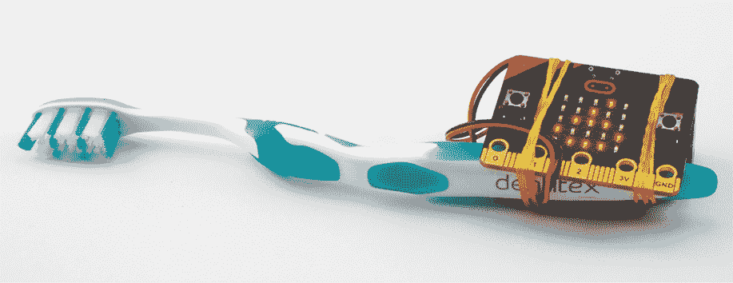

*图 5-7：牙刷监测器*

牙刷监测器在显示屏上显示一个从 0 到 9 的得分。每刷 50 次牙刷，得分增加 1。当得分达到 10 时，它会显示一个笑脸图标，表示疯狂科学家已经刷完牙——直到下次。

**警告** *不要让你的 micro:bit 沾水—它可能会坏掉！*

#### 你需要的材料

对于这个项目，你将需要以下物品：

**Micro:bit**

**3V 电池包** 为 micro:bit 提供电源。（建议使用可开关类型的电池盒。）

**手动牙刷** 不是电动牙刷

**2 × 弹性带** 用于将 micro:bit 和电池包固定在牙刷上

该项目是针对手动牙刷设计的。电动牙刷无法用于此项目。

#### 构建

1.  访问*[`github.com/simonmonk/mbms/`](https://github.com/simonmonk/mbms/)*以获取本书的代码仓库，然后点击**Toothbrushing Monitor**的链接。程序打开后，点击**下载**，然后将 hex 文件复制到你的 micro:bit 上。

    如果你更喜欢使用 Python，可以从同一个网站下载代码。有关如何下载和使用本书示例的说明，请参见第 34 页的“下载代码”。本实验的 Python 文件为*ch_05_Toothbrush_Monitor.py*。

1.  将电池包插入 micro:bit，并使用橡皮带将电池和 micro:bit 固定在牙刷上，如图 5-7 所示。

    在固定带子时，确保它们不会遮挡显示屏，并且你仍然可以触及电池包的开/关开关。此外，检查带子是否覆盖了 micro:bit 背面的重置开关。

1.  打开电池包。一旦电池包开启，micro:bit 应该显示 0。用力刷牙，过一会儿，显示应该变为 1。

#### 代码

该项目的程序会测量加速度，如果加速度超过某个特定水平，它会将计数变量加 1，以记录刷牙次数。

当刷牙次数足够多，达到另一个积分要求时，得分会增加并显示出来。

最终，当得分达到 10 时，微笑图标会显示在 micro:bit 的显示屏上。

##### Blocks 代码

这是该项目的 Blocks 代码。

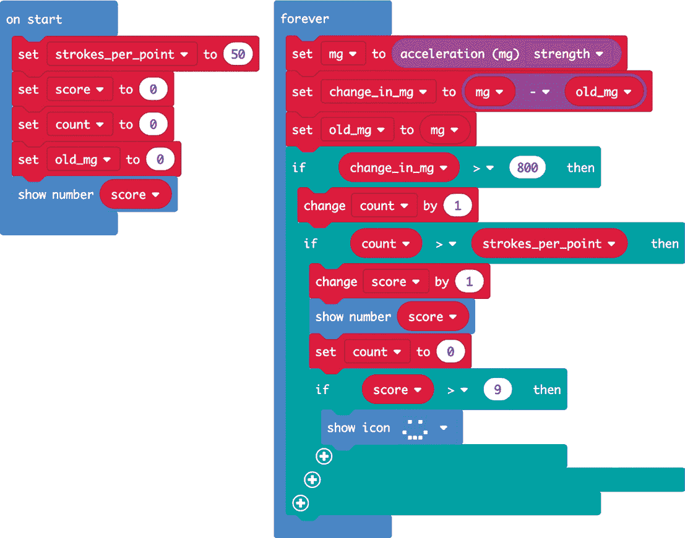

这可能是本书中最复杂的程序。`on start`模块定义了四个变量。以下是它们各自的作用：

**每个积分的刷牙次数** 这指定了提高你得分所需的刷牙次数。如果你是一个懒得刷牙的人，那么你可以减少这个数字，这样积分会更快增加，且你能更快得到微笑奖励。然而，请注意，你下次去看牙医时可能不会很愉快。

**得分** 这是一个随着你完成每 50 次刷牙而增加的数字，直到达到 10。

**计数** 这个变量用于跟踪自从你获得积分以来完成的刷牙次数。它从 0 开始，每次得分增加时会重置。

**旧 mg** 该变量保存上次检查刷牙次数时的加速度值（以毫重力为单位）。程序将比较这个值和新值，以检测刷牙动作。

我们创建一个`forever`模块，并在其中使用一个`set XX to`模块。从下拉菜单中选择`mg`，这样这个模块会将整体加速度读数放入名为`mg`的变量中。在`加速度 (mg)`模块的下拉菜单中，选择`strength`，它会为你计算勾股定理。（如果你使用 MicroPython，你需要自己计算。）

然后，`set change in mg` 块通过将当前的加速度强度与之前的加速度强度（存储在`old mg`中）相减，计算加速度强度的变化。如果变化大于 800—表示开始刷牙动作—则`count`增加 1。800 的值是通过查看图 5-8 选定的，图中展示的是短时间剧烈刷牙的净加速度曲线。

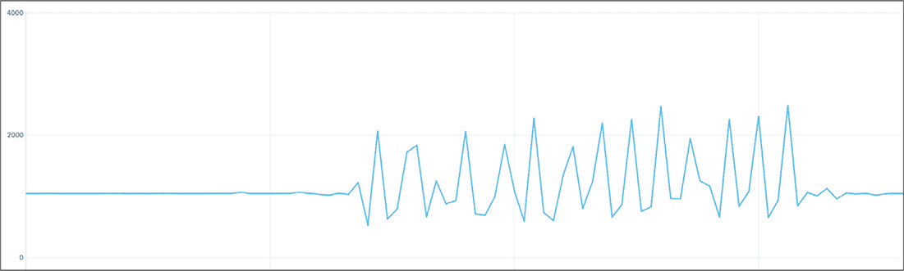

*图 5-8：刷牙过程中的净加速度曲线*

在图表中，每一个峰值代表一次刷牙动作，最大净加速度出现在刷牙改变方向时。800 的值足以捕捉大部分刷牙动作，因为大多数刷牙动作产生的加速度变化约为 1000。如果你刷牙的力度较轻，可能需要降低这个阈值，否则你可能会永远刷牙，得不到足够的分数来停止。

接下来，放置第一个`if`块来检测足够大的加速度，表示刷牙动作，并在其中放置第二个`if`块来检查`count`的值。如果值超过了你在`strokes per point`中设置的数量，程序会将`score`加 1，并显示新的`score`值。最后，程序会检查`score`是否大于 9，如果是，它会显示一个笑脸图标。

##### MicroPython 代码

下面是 MicroPython 版本的代码。

from microbit import *

from math import sqrt

strokes_per_point = 50

old_mg = 0

count = 0

change_in_mg = 0

score = 0

mg = 0

display.show(str(score))

while True:

x, y, z = accelerometer.get_values()

mg = sqrt(x*x + y*y + z*z)

change_in_mg = mg - old_mg

old_mg = mg

if change_in_mg > 800:

count += 1

if count > strokes_per_point:

score += 1

display.show(str(score))

count = 0

if score > 9:

display.show(Image.HAPPY)

MicroPython 代码几乎完全复制了 Blocks 代码，不同之处在于需要计算力的总强度，因为 MicroPython 没有内建函数来处理 micro:bit 的这个功能。

#### 尝试的事项

你可以将这个项目用作*计步器*—一种测量你走路或跑步时步数的设备。为此，尝试简化代码，去掉`score`变量，因为我们现在只关心步数（等同于刷牙时的刷次数）。你需要让代码记录步数，并在按下 A 按钮时显示你走了多少步。为了测试，试着把这个项目放进你的袜子里（先拿掉牙刷），然后走动，同时在脑海中计算步数。然后看看计步器显示你走了多少步。如果测量不准确，可能需要调整加速度阈值，从 800 调整，来使计步器更或更少灵敏。

### 实验 7：将加速度记录到文件

Mu 内置的绘图工具非常适合如果你不介意将 micro:bit 通过 USB 数据线连接到计算机。然而，有时疯狂科学家会发现远程记录 micro:bit 上的读数，以便后续分析，非常有用。

在这个实验中，你将使用 micro:bit 在保存到 micro:bit 上的文件中记录加速度计读数。你可以挥动 micro:bit 并进行各种测试，然后查看测量到的加速度的图表。

该程序每秒会进行大约 60 次读数，它可以记录约 45 秒的样本，直到 micro:bit 的内存用尽。

#### 你需要的工具

对于这个实验，你需要：

**Micro:bit**

**3V 电池组**

#### 构造

1.  本项目使用 micro:bit 的本地文件系统，而在本文编写时，Blocks 代码无法使用该功能。这意味着你需要使用 Python 来进行这个实验。从 *[`github.com/simonmonk/mbms/`](https://github.com/simonmonk/mbms/)* 下载代码，并查看下载和使用书中示例的说明。这个实验的 Python 文件是 *Experiment_07.py*。将程序加载到你的 micro:bit 上。

1.  当你打开 micro:bit 时，它的显示屏将显示一个 X。这意味着它没有记录任何读数。当你点击 A 按钮时，图标将变为对勾，micro:bit 开始记录。再次按下 A 按钮时，它将停止记录，并将加速度计读数保存到一个文件中，你可以将该文件传输到你的计算机。

    为了测试这一点，按下 **A 按钮**，挥动 micro:bit，然后再次按下 **A 按钮**。

1.  要将包含读数的文件传输到你的计算机，请使用 Mu 的 *Files* 功能。用 USB 数据线将 micro:bit 连接到你的计算机，然后点击 Mu 工具栏中的 **Files** 图标（见 图 5-9）。

    窗口底部现在有两列。左侧是保存在 micro:bit 上的文件。在 图 5-9 中，只有一个文件，*data.txt*。右侧是 Mu 的代码目录中的文件，该目录位于你的主目录下的 *mu code* 文件夹中。

    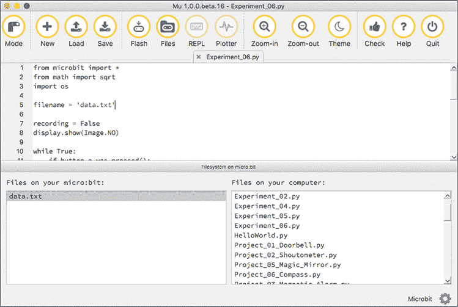

    *图 5-9: Mu 的文件功能操作*

    要从 micro:bit 复制文件，只需将其从 Mu 窗口左侧区域拖到右侧区域。

    如同本章前面实验 6 中提到的，如果 Mu 中的 Files 功能无法使用，可能是你使用的 micro:bit 需要更新。此时，按照 *[`support.microbit.org/support/solutions/articles/19000019131-how-to-upgrade-the-firmware-on-the-micro-bit/`](https://support.microbit.org/support/solutions/articles/19000019131-how-to-upgrade-the-firmware-on-the-micro-bit/)* 中的说明更新你的设备。

1.  一旦你将数据从 micro:bit 传输到你的计算机，你将通过将文件导入电子表格（如 Excel 或 Google Sheets）来绘制数据。

    根据你使用的电子表格软件，程序的步骤会有所不同。我将向你展示如何使用免费的 Google Sheets。你只需要登录到 Google 帐号即可。

    访问 *[`docs.google.com/spreadsheets/`](https://docs.google.com/spreadsheets/)*，然后点击 *开始新电子表格* 区域中的 **空白** 选项。接着，在 Google Sheets 菜单中选择 **文件**▸**导入**。在弹出的窗口中，选择 **上传** 标签并导航到你已经复制到电脑中的 *data.txt* 文件。

    录制的数据应该出现在电子表格的第一列中。选择这一列并点击 **插入**▸**图表**，就能生成数据图表，像 图 5-10 中显示的那样。

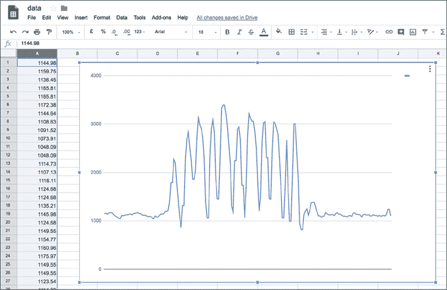

*图 5-10：在 micro:bit 上绘制的数据图表*

#### 代码

这是此实验的 MicroPython 代码：

from microbit import *

from math import sqrt

import os

filename = 'data.txt'

recording = False

display.show(Image.NO)

while True:

if button_a.was_pressed():

recording = not recording

if recording:

display.show(Image.YES)

try:

os.remove(filename)

except:

pass

fs = open(filename, 'w')

else:

display.show(Image.NO)

fs.close()

if recording:

x, y, z = accelerometer.get_values()

net = sqrt(x*x + y*y + z*z)

fs.write(str(net))

fs.write('\n')

sleep(10)

micro:bit 只能保存有限量的数据，因此需要导入 `os` 包，这样你就可以删除 micro:bit 上已经存在的任何数据。

将数据文件名设置为 `data.txt`。你可以通过修改 `filename` 变量的值来更改文件名，但我建议在程序工作正常之前保持原名。

创建一个名为 `recording` 的变量来跟踪项目是否正在录制数据。每次按下 A 按钮时，这个变量会在 `True` 和 `False` 之间切换，从而控制数据的录制开始和停止。这就是 `recording = not recording` 这一行的作用：如果 `recording` 为 `True`，代码会将其设置为 `False`，反之亦然。

创建一个 `while True` 循环，让程序永远运行。在这个循环中有两个 `if` 语句。第一个指示 micro:bit 在按下 A 按钮时该做什么，第二个检查我们是否处于录制模式。当第一次按下 A 按钮时，录制开始，屏幕显示 `YES` 图像，`os.remove` 方法会删除现有的数据文件。

我们将 `remove` 命令放入了 `try: except:` Python 结构中。这样可以确保如果发生任何错误（特别是如果数据文件无法删除，因为它不存在），程序会忽略这个错误并继续运行，而不会崩溃。

程序接着以 `w` 模式打开文件，这意味着你可以在文件中写入内容。当按下 A 按钮时，屏幕会显示 `NO` 图像，文件随之关闭。

主 `while` 循环中还包含另一个 `if` 块，只要 `recording` 为 `True`，就会将加速度计的读数写入文件。如果程序运行时间过长，填满所有文件空间，它会给出错误。但是，它在空间不足之前写入的数据仍然可用。

录制结束时的 `sleep` 命令会减缓录制过程，这样你就不会太快耗尽内存。

#### 尝试的事情

这个实验可以让你在各种实际情况下测量加速度。例如，你可以记录在将 micro:bit 扔到空中时它的加速度。如果你打算尝试这一点，最好采取一些预防措施：

  选择一个软的地面环境。这样，如果你没能接住 micro:bit，它可能会幸存下来。在这样的实验中，电池松动或从支架中掉出的情况并不罕见。

  不要把你的 micro:bit 随便扔到可能会打到别人头部的地方。

  将 micro:bit 附着在电池包上。弹力带是个不错的选择。

  把你的 micro:bit 放进一个外壳里。带有 MI:power 电池背包的 Kitronik MI:pro 外壳（如 图 5-11 所示）是一个很好的选择。如果你使用这个外壳，你就不需要额外的电池包，因为外壳里已经包含了一个小型的 3V 电池。

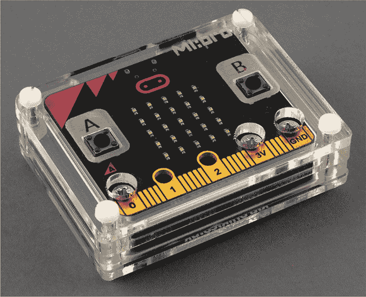

*图 5-11: 带 MI:power 电池背包的 Kitronik MI:pro 外壳*

你也可以通过将一根绳子牢固地绑在 micro:bit 上，并轻轻地在空中做圆周摆动来测量加速度。但同样要小心，因为 micro:bit 很容易从绳子上脱落，可能会损坏或伤害到周围的人。

micro:bit 使用的文件系统非常有限，它的存储空间大约只有 40KB。因此，每次你向 micro:bit 刷写新程序时，之前的文件可能会被擦除。

### 项目：加速度显示

*难度：简单*

如 图 5-12 所示，这个项目允许你在显示屏上看到 micro:bit 的加速度。当 micro:bit 处于静止状态时，显示屏的中间一行 LED 会亮起。如果你快速将 micro:bit 向上移动，LED 行会像电梯一样在显示屏上向上移动，响应净力的增加。类似地，如果你快速将 micro:bit 向下移动，LED 行会向下移动，表示重力效应减弱，仿佛你在电梯里向下加速。

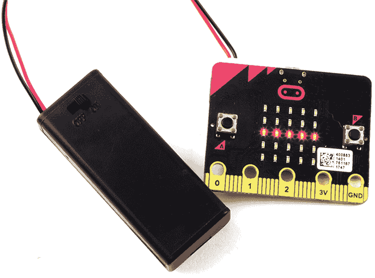

*图 5-12: Micro:bit 加速度显示*

#### 你将需要的东西

对于这个项目，你只需要一个 micro:bit。然而，如果你想让这个项目更具移动性，带上电池包会更方便。

你也可以使用 图 5-11 中展示的 MI:pro 外壳和 MI:power 电池包组合。

#### 构造

1.  访问* [`github.com/simonmonk/mbms/`](https://github.com/simonmonk/mbms/)*来访问书本的代码库，并点击**加速度显示**的链接。程序打开后，**下载**并将 hex 文件复制到你的 micro:bit 上。

    如果你更喜欢使用 Python，可以从同一个网站下载代码。有关下载和使用书中示例的说明，请参见第 34 页的“下载代码”部分。此实验的 Python 文件是*ch_05_Acceleration_Display.py*。

1.  尝试将你的 micro:bit 上下移动，观察加速度在各个方向上如何影响读数。如果你能带着 micro:bit 乘电梯，观察显示屏上是否显示你在上升或下降。

#### 代码

这段代码首先读取加速度数据，然后使用一些数学运算来决定显示屏上点亮哪一行。

##### Blocks 代码

这是本项目的 Blocks 代码。

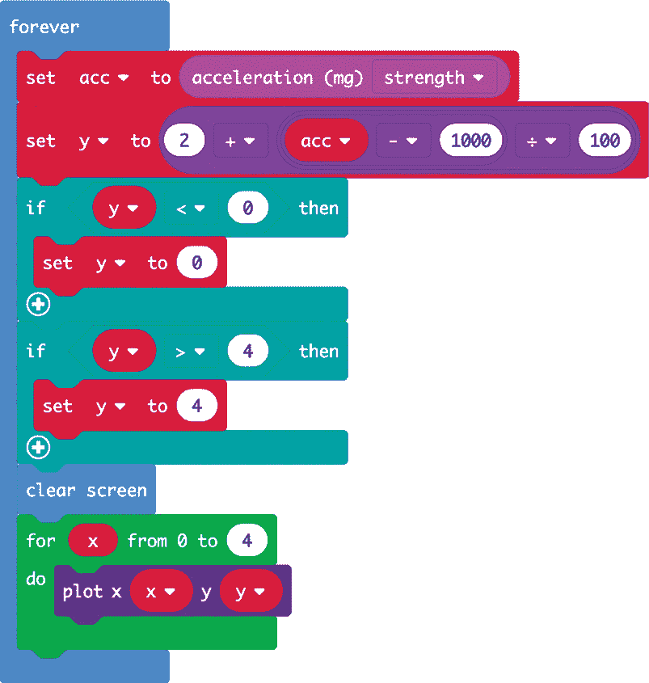

本项目的所有代码都包含在`forever`区块中。它首先读取净加速度，然后计算`y`的值。这里，`y`代表显示屏上将点亮的行。当 micro:bit 静止时，唯一作用于它的力是重力，净力为 1,000 mg（1 g）。因此，程序从净加速度中减去 1,000，然后将结果除以 100，这样每 1/10 的 g 会导致显示屏上的一行变化。最后，我们将 2 加到这个结果，以默认显示第 2 行（如果从 0 开始计数的话，就是 LED 的中间行）。

使用两个`if`区块来确保`y`的值保持在 0 和 4 之间（对应 5 行）。为了绘制正确的行，首先清除屏幕，以免旧的行与新的读数一起显示。然后，使用`for`循环遍历该行的每个 LED，这些 LED 由`x`值表示，用于点亮它们。

##### MicroPython 代码

这是代码的 MicroPython 等效版本：

来自 microbit 的导入*

from math import sqrt

while True:

x, y, z = accelerometer.get_values()

acc = sqrt(x*x + y*y + z*z)

y = int(2 + (acc - 1000) / 100)

display.clear()

if y < 0:

y = 0

if y > 4:

y = 4

for x in range(0, 5):

display.set_pixel(x, y, 9)

这段代码类似于 Blocks 代码，但你需要自己计算净加速度。

### 总结

micro:bit 的加速度计为检测 micro:bit 的运动或方向提供了许多项目的机会。在这一章中，你已经探索了使用加速度计的一些有趣方法。

你还学会了如何使用 Mu 的绘图工具绘制来自 micro:bit 的数据，并将读数记录到文件中，稍后可以绘图并进行分析。
