## 第六章：**疯狂的运动**

在这一章中，你将使用几种不同类型的电机，制作本书中最令人印象深刻的两个项目：一个可以转动眼睛并说话的仿生头，以及一个遥控的机器人漫游者。这些玩具能让疯狂的科学家玩上几个小时。

### 实验 8：使伺服电机运动

让事情开始运动的一种方法是使用伺服电机，像 图 6-1 所示的那样。

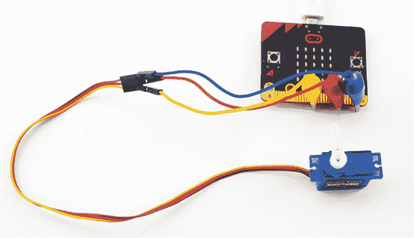

*图 6-1：伺服电机连接到 micro:bit*

*伺服电机* 是一种小型低功率电机，配有可以通过程序控制的臂。与大多数其他电机不同，伺服电机不会完全旋转。相反，它们具有 180 度的运动范围。你的程序可以将电机臂设置到特定的角度。

在这个实验中，你将学习如何将伺服电机连接到 micro:bit，并研究伺服电机的运动方式。

#### 你将需要的材料

**Micro:bit**

**伺服电机** 理想的伺服电机是 9 克的伺服电机。micro:bit 仅有足够的电力来驱动一个小型伺服电机，但对于全尺寸的伺服电机来说则不够。请选择一个兼容 3V 的伺服电机。更多详情请参见 附录。

**鳄鱼夹-公头跳线电缆** 这些电缆将 micro:bit 连接到伺服电机。（你也可以使用公对公跳线电缆；见下文。）

**USB 连接到计算机，Monk 为 micro:bit 或 USB 电池包提供电源** 一个 AAA 电池盒可能（取决于伺服电机）能工作，但 AAA 电池可能无法提供足够的电压来驱动伺服电机。有关为 micro:bit 提供电源的选项，请参见 附录。

你也可以使用更常见的公对公跳线电缆，而不是使用鳄鱼夹-公头跳线电缆，只需将电缆的一端插入伺服电机连接器，另一端夹上鳄鱼夹。但你需要确保连接不会意外短路。通常，鳄鱼夹-公头跳线电缆将是你 micro:bit 工具箱中的一项有用物品，所以值得准备一些。

#### 构建

将伺服电机连接到你的 micro:bit。

1.  前往 *[`github.com/simonmonk/mbms/`](https://github.com/simonmonk/mbms/)* 访问本书的代码库，点击 **实验 8：伺服电机** 的链接。程序打开后，点击 **下载**，然后将 hex 文件复制到你的 micro:bit 上。如果你在这方面遇到困难，请返回查看 第一章。

    如果你更喜欢使用 Python，可以在同一网站上找到相应的代码。有关下载和使用书中示例的说明，请参见 第 34 页中的“下载代码”部分。本实验的 Python 文件是 *Experiment_08.py*。

1.  伺服电机有不同种类的手臂，可以连接到电机的齿轮状轴上。对于这个项目，选择一个简单的手臂，如图 6-1 所示。

    **注意** *你的伺服电机应该附带一个小螺丝。这个螺丝用于将手臂更稳固地固定在轴上。如果你计划制作仿生头项目，请将螺丝放在手边；否则，放在安全的地方以备后用。*

1.  使用鳄鱼夹将你的 micro:bit 连接到伺服电机，如图 6-2 所示。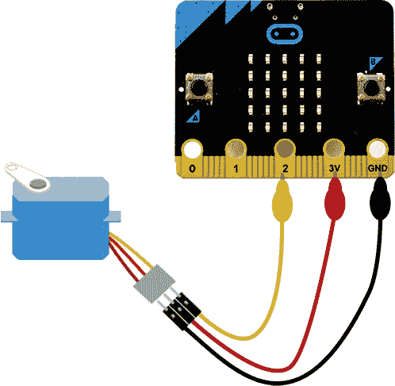

    *图 6-2：一个连接到 micro:bit 的伺服电机*

1.  伺服电机有三个连接，按颜色编码：

    **控制** 橙色或黄色（这个引脚控制伺服电机手臂的位置。）

    **+V** 红色线是正电源线。伺服电机理想情况下使用 5V，但大多数小型伺服电机也可以在 micro:bit 的 3V 上工作。

    **GND** 通常是棕色的，有时是黑色的（这是负电源线。）

1.  一旦通电，伺服电机的手臂应该跳到 90 度位置，与伺服电机垂直。micro:bit 将使用这个位置作为参考点。如果手臂不是 90 度位置，请将其取下并重新安装，使其处于 90 度位置，如图 6-1 所示。如果你计划制作仿生头，请使用小螺丝将手臂固定在位置上。

1.  现在你已经有了一个功能正常的伺服电机！按下按钮 A 应该使伺服手臂向一个方向移动 10 度。按下按钮 B 应该使伺服手臂向另一个方向移动 10 度。如果同时按下两个按钮，手臂的当前角度应该会在 micro:bit 的显示屏上滚动显示。

#### 代码

两个程序遵循相同的方式，首先将伺服电机的角度设置为 90 度，然后等待按钮按下，增加或减少角度，或者显示角度。

##### 块代码

这是此实验的块代码。

我们使用一个名为 `angle` 的变量来记住伺服电机的当前角度。我们在 `on start` 块中定义 `angle` 变量，并赋予它初始值 90。在下一次运行 `servo write pin` 块时，它将把伺服电机的手臂移动到 `angle` 中设置的位置，从而使手臂在上电时跳到 90 度位置。

如果按下按钮 A，将调用 `on button A pressed` 块。如果按下按钮 B，将调用 `on button B pressed` 块。这两个按钮的工作方式类似。按钮 A 的块首先检查角度是否仍大于或等于 10，如果是，则从角度中减去 10，将手臂向一个方向移动。按钮 B 的块检查角度是否小于或等于 170，如果是，则向角度添加 10，并将手臂向相反方向移动。两个块都使用 `servo write pin` 来设置伺服电机的新角度，作为按钮按下后的结果。

##### MicroPython 代码

这是 MicroPython 版本的代码。

从 microbit 导入 *

def set_servo_angle(pin, angle):

duty = 26 + (angle * 51) / 90

pin.write_analog(duty)

angle = 90

set_servo_angle(pin2, angle)

while True:

if button_a.was_pressed() and angle >= 10:

angle -= 10

set_servo_angle(pin2, angle)

if button_b.was_pressed() and angle <= 170:

angle += 10

set_servo_angle(pin2, angle)

if button_a.is_pressed() and button_b.is_pressed():

display.scroll(str(angle))

MicroPython 代码与 Blocks 代码的工作方式非常相似。但与 Blocks 代码不同的是，MicroPython 中没有预定义的函数来将伺服电机设置为特定角度。幸运的是，我们可以使用一些数学和 PWM 模拟输出（参见 第 8 页的“制作模拟信号：脉宽调制”），编写自己的方法，生成伺服电机所需的脉冲（稍后会详细介绍）。

#### 工作原理：伺服电机与脉冲

你可以通过发送一系列重复的电脉冲来控制伺服电机——在本例中，脉冲来自 micro:bit。脉冲通过快速打开和关闭一个引脚来生成。伺服电机根据脉冲保持高电平（3V）的时间来判断如何动作。信号处于高电平的时间比例，即引脚打开的时间比例，称为 *占空比*。这与信号高电平的实际持续时间不同，后者称为 *脉冲宽度*。我们将这一段时间（以毫秒为单位）称为 *宽度*，因为我们可以将脉冲可视化为方波（参见 图 6-3）。波形的总长度（每个 *开* 脉冲之间）称为 *周期*。

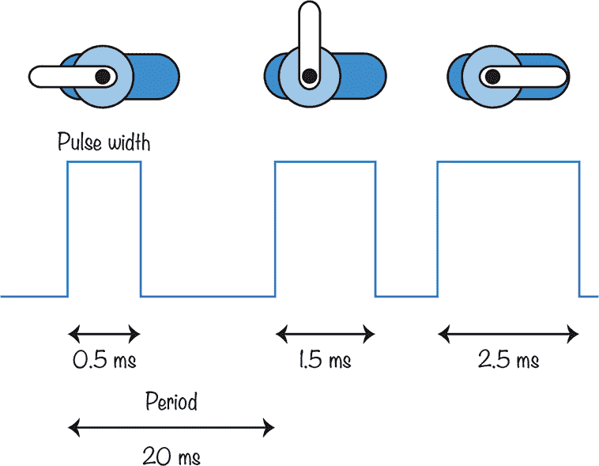

*图 6-3：控制伺服电机的脉冲*

伺服电机期望每 20 毫秒接收到一个脉冲，或者每秒 50 个脉冲。每个脉冲的宽度在 0.5 毫秒和 2.5 毫秒之间。

如你在 图 6-3 中看到的，脉冲的长度决定了伺服电机臂的位置。如果脉冲宽度为 0.5 毫秒，伺服电机的臂将处于范围的一端（0 度）。如果脉冲宽度为 1.5 毫秒，臂将处于中心位置（90 度）。如果宽度为 2.5 毫秒，臂将处于 180 度位置。

方便的是，micro:bit 的模拟输出默认频率（参见 第一章）是 50Hz——正好是伺服电机所需的频率。然而，即使是最长的脉冲，也只有 2.5 毫秒，占总周期 20 毫秒的十分之一，这意味着最长的脉冲只有大约十分之一的时间是高电平。

图 6-4 有助于解释如何计算 MicroPython 中 `set_servo_angle` 函数使用的数字。*占空比*是传递给 `set_servo_angle` 函数的数字。该值必须在 0 到 1023 之间，其中 0 表示没有脉冲，1023 表示脉冲持续的时间长到下一周期才结束。

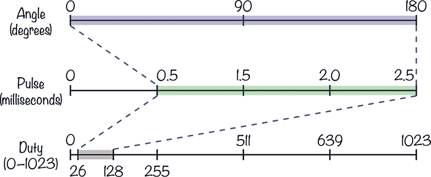

*图 6-4：占空比值与脉冲宽度与伺服臂角度的对应关系*

图 6-4 的顶部显示了伺服臂在 0 到 180 度范围内的位置。代码必须将这个范围转换为另一组数字，从 0.5 到 2.5，这些数字是与这些角度对应的脉冲宽度。

要将角度（以度为单位）转换为脉冲宽度（以毫秒为单位），我们从以下信息开始：一个长度为 0.5 毫秒的脉冲等于 0 度的角度，长度为 2.5 毫秒的脉冲等于 180 度的角度。然后，我们可以通过将度数范围（180）除以脉冲长度范围（2）来计算每毫秒的度数，从而得出每毫秒 90 度。接着，为了计算新角度的脉冲长度，我们从基准值 0.5 毫秒开始，并加上我们使用的角度除以每毫秒的度数（90）。

我们来考虑一个例子。如果角度为 0 度，脉冲长度将为 0.5 毫秒（0.5 + 0/90 = 0.5）。如果角度为 90 度，脉冲长度将为 0.5 + (90/90) = 1.5 毫秒。如果角度为 180 度，脉冲长度将为 0.5 + (180/90) = 2.5 毫秒。

现在我们有了一个关于角度的脉冲长度公式：

`pulse_length` = 0.5 + `angle`/90

但再次参考图 6-5，我们需要将脉冲长度（毫秒）转换为 0 到 1023 之间的占空比值，因为`set_servo_angle`函数需要这个范围的值。

占空比值（0 到 1023）是通过将脉冲长度（毫秒）乘以每毫秒的步数（1023/20 ≈ 51）来计算的。例如，一个 1.5 毫秒的脉冲长度将需要一个占空比值为 1.5 × 51 ≈ 77。

换句话说：

`duty_value` = `pulse_length` × 51

将这两个公式结合起来，我们得到：

`duty_value` = (0.5 + `angle`/90) × 51

这也可以写成（四舍五入后）：

`duty_value` = 26 + `angle` × 51/90

因此，`write_analog`函数中使用的值在 26 到 128 之间。这个范围反映了脉冲与最大占空比值 1023 相比非常短的事实。

### 项目：动画头（MIKE THE MICRO:BIT 机器人）

*难度：难*

这个动画头，如图 6-5 所示，是一个非常适合万圣节展示的项目。一个伺服电机将一对乒乓球眼睛从左到右移动，它还使用 micro:bit 的显示屏作为嘴巴。当头部讲话时，灯光模拟出嘴唇移动的简单动画。

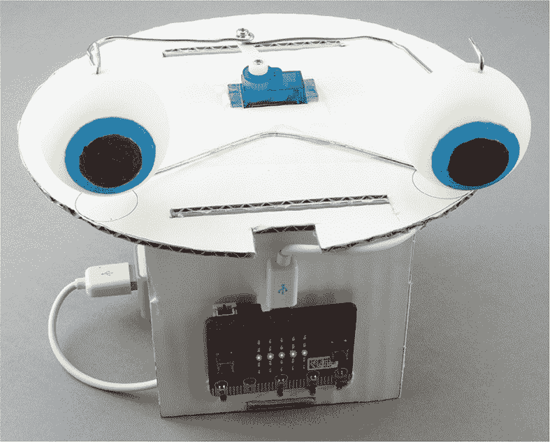

*图 6-5：动画头*

#### 你将需要的材料

对于这个项目，你将需要以下物品：

**Micro:bit**

**伺服电机** 一款小型 9 克伺服电机是理想选择。

**放大扬声器** 用于头部的声音（Monk Makes 扬声器是一个不错的选择。）

**3 × 鳄鱼夹到公头跳线** 用于连接伺服电机

**3 × 鳄鱼夹电缆** 用于连接扬声器

**2 × 乒乓球** 用作眼球（没有任何文字或标志的球更易于装饰。准备几个备用球，以防万一。）

**厚纸板** 大约是字母纸或 A4 纸，厚度在 3 毫米或以上

**纸张和打印机** 用于打印框架的模板

**2 × 3 英寸（75 毫米）回形针** 用于制作允许眼球旋转的轴，以及连接眼球与伺服电机的框架。理想情况下，这些回形针直径为 1.5 毫米。

**胶带** 用于将纸板粘合在一起，并将各种物品粘贴到纸板上

**蓝丁胶粘土** 用于将扬声器固定在纸板上

**纸胶水** 用于将模板粘贴到纸板上

**剪刀和/或美工刀**

**画笔或马克笔** 用于绘制眼球

**带有 5/64 英寸（#47）或 2 毫米钻头的电钻** 用于在乒乓球上钻孔

**钳子** 用于弯曲线材

#### 构建

我们将从制作眼球开始。

1.  拿两个乒乓球（图 6-6），准备装饰。画眼球的最佳方法是先找到两个小圆物品，一个稍大于另一个（也许是牙膏盖和一个环），然后用圆物品和铅笔在乒乓球表面上描出两个同心圆。完成后，将外圈（虹膜）和内圈（瞳孔）涂上两种不同的颜色。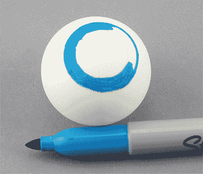

    *图 6-6：装饰眼球*

1.  当你在两个乒乓球上画好眼球图案后，在每个球上钻三个孔，用来穿线。用铅笔做三个标记：以瞳孔朝向自己时，在球的底部、顶部和瞳孔的背面分别做一个标记。顶部和底部的孔将用于将眼球固定在垂直的线材上，保持其位置。背面的孔将用于连接第二根线，用于左右移动眼球。

    **警告** *使用电钻可能会有危险！在项目的这一部分，应该由一位负责任的成年人使用电钻，或至少进行监督。主要的安全措施是将乒乓球放在平坦的表面上，双手握住两侧。然后从上方钻孔，如图 6-7 所示。如果有台钳固定球体，那就更好了。*

    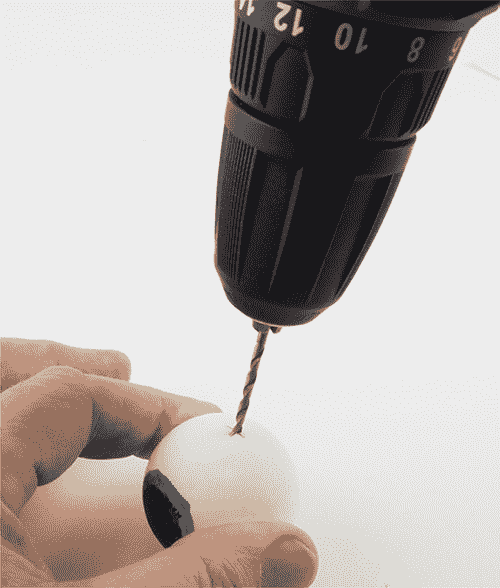

    *图 6-7：钻孔眼球*

1.  当你对标记的位置满意后，拿一个钻头，直径稍大于回形针的线径，开始在乒乓球上钻孔。对于 1.5 毫米的回形针，5/64 英寸（#47）或 2 毫米的钻头非常合适。

1.  制作眼球框架。首先将回形针完全拉直。然后按照图 6-8 中的 A、B、C 三处弯曲。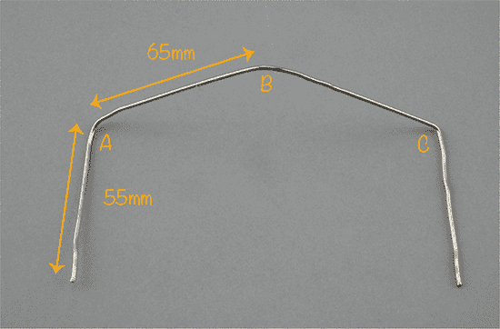

    *图 6-8：如何弯曲回形针以制作眼球框架*

1.  先做 A 和 C 两个弯曲。两者都应为 90 度。这些弯曲将使眼球保持直立。接下来，在电线的中心处做一个轻微的弯曲——这就是弯曲 B。弯曲 B 将提供一个可以粘贴到你接下来将制作的纸板底盘上的地方。将眼球按图 6-9 所示放置在框架上。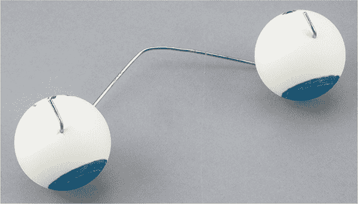

    *图 6-9：将眼睛放置在框架上*

1.  一旦你安装了眼球，可以将电线的 10 毫米尖端弯曲到眼球上方，以防它们掉落，如图 6-9 所示。使用钳子以避免伤到手指。

    **注意** *这些弯曲第一次做得不必完美。在制作项目的过程中，你可以进行一些调整。*

1.  现在让我们开始组装底盘，它将把所有部件固定在一起。为了让这一步更容易，我提供了一个可以与书籍代码一起下载的模板。模板位于 *其他下载* 文件夹中，名为 *Animatronic_Head_Template*。它有 PDF、PNG 和 SVG 格式可供选择。下载后，打印出来并将其固定在稍大的纸板上，如图 6-10 所示。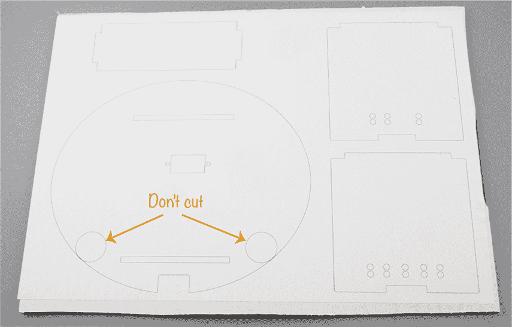

    *图 6-10：将纸模板粘贴到纸板上的过程*

1.  除了图 6-10 中标出的地方外，沿着线条切割。这将得到图 6-11 中所示的纸板件。大多数切割使用剪刀就可以，但你需要一把工艺刀来切割插槽和伺服电机的开口。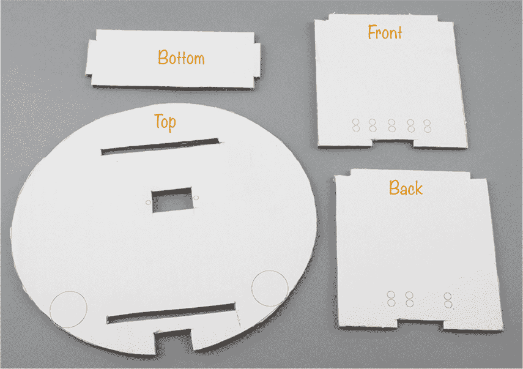

    *图 6-11：底盘的纸板零件*

    **警告** *仅在成人监督下使用工艺刀。工艺刀非常锋利，使用时很容易不小心割伤自己。*

1.  将 micro:bit 固定到前面的纸板上，通过板上标记的小圆圈对打孔。然后，对于每一对孔，背面用鳄鱼夹夹住。这些夹子不仅可以帮助你建立电气连接，还能将 micro:bit 安全地固定在纸板上。

    按照图 6-12 中建议的顺序连接鳄鱼夹：红色连接到 3V，黑色连接到 GND，黄色连接到 0 引脚。确保每个 GND 和 3V 连接各连接两个鳄鱼夹。

    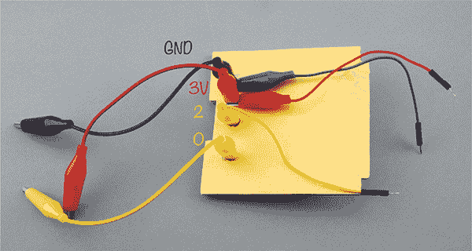

    *图 6-12：连接电缆到 micro:bit*

1.  要将 micro:bit 连接到伺服电机，你需要使用三根带公头跳线的鳄鱼夹。一端将一根黄色鳄鱼夹夹到第 2 针上。然后，拉开已经连接到 3V 的红色鳄鱼夹的绝缘外皮，暴露出一些金属部分，将红色鳄鱼夹连接到红色夹子上。对黑色的 GND 电缆执行相同的操作，拉开 GND 黑色鳄鱼夹的绝缘外皮，将黑色鳄鱼夹连接到公头跳线（参见 图 6-13）。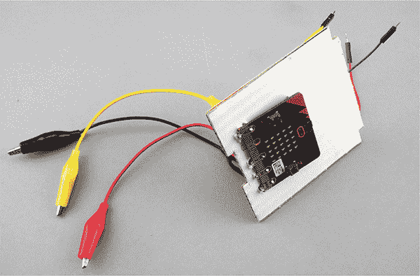

    *图 6-13：将 micro:bit 附加到纸板的前面*

1.  现在将底部纸板插入前部纸板，并使用粘合带将其固定在位（参见 图 6-14）。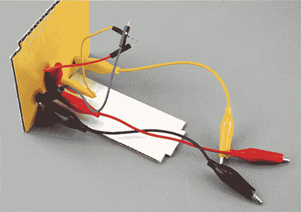

    *图 6-14：将底部卡片连接到前部卡片*

1.  现在将扬声器固定到背部卡片上；使用粘合带或胶泥将其固定。将你已连接到 micro:bit 的三根鳄鱼夹（黑色、红色和黄色）连接到扬声器的相应端口（分别为 GND、3V 和 0）。使用粘合带将背部卡片固定到底部卡片上。如 图 6-15 所示，你的底盘现在应该是 U 形的。这里的红色、蓝色和黄色鳄鱼夹等待与伺服电机连接。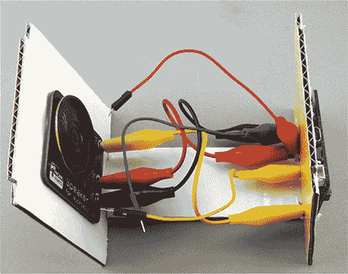

    *图 6-15：背部卡片和扬声器*

1.  将伺服电机臂固定在 90 度位置（如有需要，请回顾实验 8 的末尾），然后将伺服电机穿过顶部卡片（圆形面），首先穿过伺服电机的电缆。注意，伺服电机的轴并不位于伺服电机的中心，而是偏向一端；这一端应位于靠近顶部卡片中心的伺服电机切口位置（参见 图 6-16）。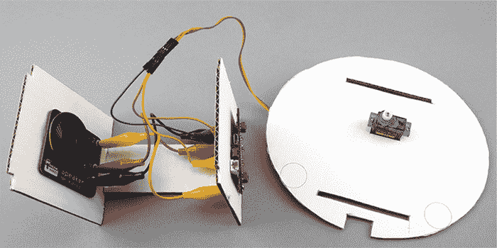

    *图 6-16：连接伺服电机*

1.  将公头跳线插针连接到伺服电机的插座上，如实验 8 中所述。

1.  当所有部件连接完毕后，将顶部纸板附加到其余的底盘部分。顶部纸板上标示眼睛位置的两个圆圈应面朝 micro:bit 所在的一端（参见 图 6-5）。

1.  现在将眼球和金属框架固定到顶部卡片上，如 图 6-17 所示。调整金属框架中间的弯曲部分，使眼球居中放置在顶部卡片上的两个圆圈上。然后使用粘合带将金属线固定。轻轻转动眼球，确保它们可以自由旋转。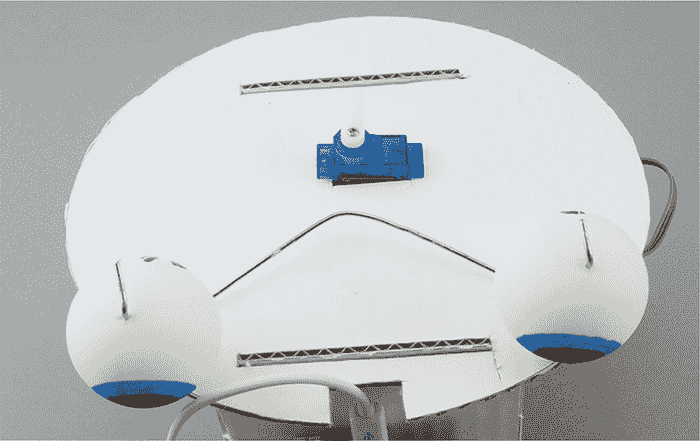

    *图 6-17：连接眼球*

1.  要将伺服电机连接到眼球，你需要按照 图 6-18 中的示意图将另一根回形针弄直。

    *图 6-18：制作伺服电机和眼球之间的连接器*

1.  为了制作电线中间的环，将电线紧紧地绕在一个小螺丝刀的轴上（如图 6-19 所示）。我使用的螺丝刀直径大约是 3 毫米，这样环的外径大约是 5 毫米。使用一个比轴细的尖端螺丝刀，否则弯曲后就很难把电线从螺丝刀上滑下来。确保如图所示将电线的两腿拉直。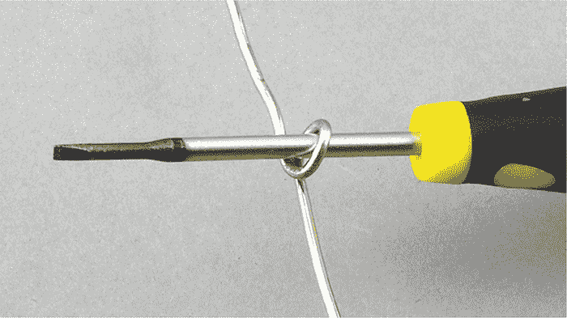

    *图 6-19：使用螺丝刀弯曲伺服电机到眼球连接器中的环*

    **注意** 螺丝刀很锋利，且弯曲厚电线需要很大的力量，所以你可能需要大人的帮助来完成这个部分。

1.  通过弯曲回形针来调整连接器，直到两臂与眼球后面的孔的距离相同。然后，将电线挂到眼球的后面。使用伺服电机提供的一个螺丝将环固定在伺服电机臂的尖端，如图 6-20 所示。根据伺服电机是否合适地安装在上卡片的切口中，你可能需要用胶带将电机固定，以防止它移动。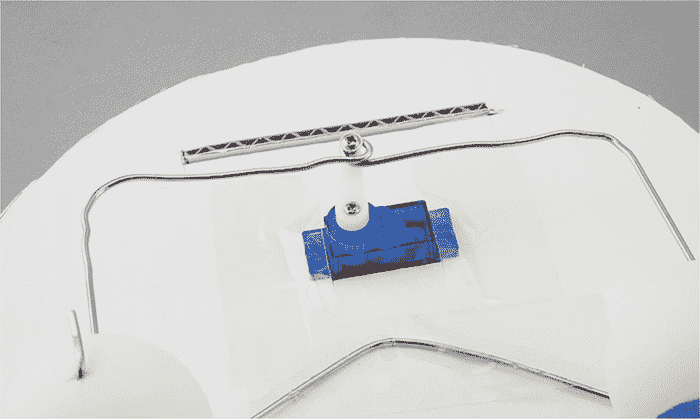

    *图 6-20：将伺服电机-眼球连接器安装到卡片上*

现在连接你的 micro:bit 的 USB 数据线并尝试这个项目！

#### 代码

首先，我们将使用实验 8 中的代码来测试我们的机制是否都在正常工作。一旦确认一切都运作良好，再切换到这个项目的代码。

##### 使用实验 8 中的代码进行测试

访问 *[`github.com/simonmonk/mbms/`](https://github.com/simonmonk/mbms/)* 并点击 **实验 8：伺服电机** 的链接。一旦程序打开，点击 **下载**，然后将 hex 文件复制到你的 micro:bit 上。如果你更喜欢使用 Python 进行测试，可以从同一网站下载 Python 文件，*Experiment_08.py*。

一旦代码加载完成，尝试按下 A 和 B 按钮，让伺服电机的臂部左右移动。你可能需要稍微调整连接线的位置，以确保眼球对准并能自由地左右移动。只需将伺服电机的臂部带动到 90 度位置的几步之内，否则连杆可能会卡住。

##### 使用真实项目代码

一旦你确定眼球的运动方式正确，你就可以切换到真实项目的代码。

因为这个项目使用了语音库，所以只能以 MicroPython 形式提供。访问 *[`github.com/simonmonk/mbms/`](https://github.com/simonmonk/mbms/)* 下载 Python 文件 *ch_06_Animatronic_Head.py*。

将它上传到你的 micro:bit 上，然后轻轻戳一下机器人。加速度计应该能检测到运动并指示你的机器人头转动眼睛，说些俏皮话，然后再直视前方。关于这个项目的视频，可以访问我的 YouTube 频道 (*[`www.youtube.com/watch?v=FAJTS2Z8ZDA`](https://www.youtube.com/watch?v=FAJTS2Z8ZDA)*)。

这个项目的软件做了两件事：它检测头部是否被戳到，并在随机时间经过后触发说话事件。代码比较长，因此我不会展示全部，只会突出关键部分。如果你想跟着做，可以将代码加载到 Mu 中。

为了让你的机器人头看起来像有思维一样，我们使用 Python 的随机库来生成随机数，触发随机事件：

import random

与其让头部的眼睛自由移动，我们将可能的眼睛角度保存在数组 `eye_angles` 中。当我们想让眼睛朝随机方向看时，只需使用随机库的 `random` 函数从这个数组中选择一个角度。

如果你玩过这个机器人，你可能会注意到它并不知道太多句子。它说的短语都包含在数组 `sentences` 中，如下所示：

sentences = [

"你好，我叫 Mike",

"你叫什么名字",

"我在看着你",

"消灭 消灭 消灭",

"第五号正在活跃"

"我做不到，Dave",

"daisee daisee give me your answer do"

]

和眼睛角度一样，当我们想要一个句子时，我们就从这个数组中选择。正如你在代码中看到的那样，对于机器人扬声器，有时拼写一个单词的音标比正确拼写更好。

三个用于语音动画的嘴唇图像作为自定义 `Image` 对象创建。这里是用于静止嘴唇动画的一个水平线：

lips0 = Image("00000:"

"00000:"

"99999:"

"00000:"

"00000")

`Image` 中的每一行是一个字符串，表示显示屏的一行；字符串中的每个数字代表一个特定 LED 的亮度，从 0 到 9。

嘴唇的图像保存在变量 `lips` 的数组中：

lips = [lips0, lips1, lips2]

`speak` 函数控制着说话和嘴唇动画，它接受一个参数 `sentence`，即要说的句子：

def speak

（句子）：

words = sentence.split()

for i in range(0, len(words)):

display.show(random.choice(lips))

speech.say(words[i])

display.show(lips0)

为了确保嘴唇动画与说出的单词同步，我们使用 `split` 方法将句子分解成单个单词列表 `words`。然后，对于列表中的每个单词，我们随机选择一个嘴唇图像（使用随机库的 `choice` 方法）并让 `speech` 说出该单词。当所有单词都被说完时，嘴唇显示会恢复为默认的 `lips0` 图像。

接下来，我们定义一个 `act()` 函数：

def act():

set_servo_angle(pin2, random.choice(eye_angles))

sleep(300)

speak(random.choice(sentences))

set_servo_angle(pin2, 90)

sleep(2000)

`act`函数完成三件事：它通过将伺服电机设置为一个随机角度来随机移动眼睛，它通过调用`speak`选择一句话来播放，并通过将伺服电机角度重置为 90 度来重置眼睛。为了在每个步骤之间留出一些时间，代码会调用`sleep`函数。

下面是我们代码的主体部分，包含了所有的变量和函数：

while True:

new_z = abs(accelerometer.get_z())

if abs(new_z - base_z) > 20:

base_z = new_z

act()

if random.randint(0, 1000) == 0:

act()

sleep(50)

在代码的主体部分，我们有一个`while True`循环，这意味着命令会一直执行，直到收到停止信号。这对于需要代码持续响应输入的情况非常有用。在这里，我们希望准备好应对机器人头部被敲击时加速度的突然变化。首先，循环会注册来自加速度计的加速度。然后，它使用`abs`函数获取加速度的大小——在这个例子中，我们不关心方向，只关心加速度有多大。

在第一个`if`语句中，我们检查加速度值是否发生了超过 20 毫伽（毫重力）的变化。如果是这样，基础加速度会更新为新的加速度（确保下一次循环时，加速度必须变化超过*另外*20 毫伽），并调用`act`函数。

在第二个`if`语句中，我们为机器人的头部添加了一些随机性。代码会在 0 到 1,000 之间随机选择一个数字。如果数字等于 0（1/1,001 的机会），则调用`act`函数。尽管这个概率非常低，但由于该值每秒检查数百次，头部会每分钟跳跃几次。

#### 尝试的事项

尝试使用 USB 电池或 AAA 电池盒来为头部供电，而不是通过 USB 电缆将其连接到计算机。

如果你想改变头部的语音，可以进入代码并向`sentences`数组中添加更多句子。

语音库产生的语音相当安静且不清晰。你可以通过连接一个更大功率的扬声器来稍微改善这一点。

如果你想给项目增加一些内容，可以看看这里的代码示例：*[`microbit-micropython.readthedocs.io/en/latest/tutorials/speech.html`](https://microbit-micropython.readthedocs.io/en/latest/tutorials/speech.html)*。在这段代码中，语音库被用来产生唱歌的效果。

### 项目：机器人探测车

*难度：困难*

在这个项目中，我们将创建一个机器人探测车。通过使用一个名为 Bitty Controller 的巧妙应用程序，你可以通过安卓手机控制这个小型越野车（图 6-21）。疯狂科学家喜欢用这个探测车给实验室助手送消息。

**警告** *我们将在这个项目中使用一些低成本底盘套件，但这些套件附带的电线通常比较松散——这意味着你需要将电线焊接到电机上。这是本书中唯一需要焊接的项目。焊接不难，但它很危险，你很容易被烫伤。所以请找一位成年人来完成这一部分。*

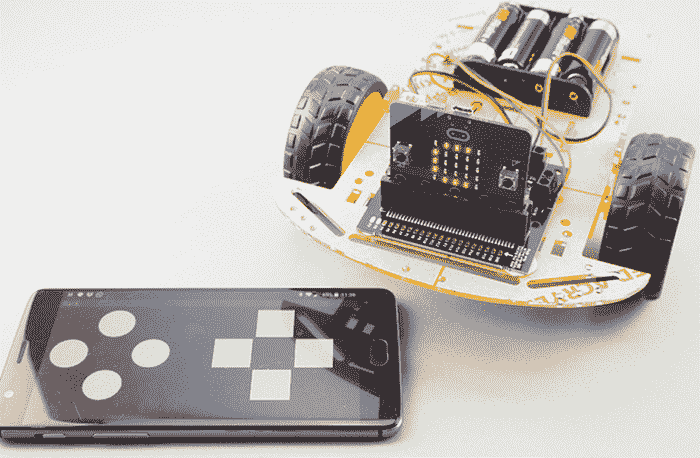

*图 6-21：一个由 micro:bit 控制的巡航机器人*

#### 所需物品

对于这个项目，你需要以下物品：

**Micro:bit**

**安卓手机**

**Kitronik Motor Driver Board for micro:bit (V2)** 用于控制电机

**低成本机器人底盘套件** 包括两个齿轮电机和一个 4 × AA 电池盒

**4 × AA 电池**

**Bitty Controller 安卓应用** 从 Google Play 商店下载（约 $5）

**各种螺丝刀** 适用于底盘上的螺母和螺栓，以及电机控制板上的接线端子

**焊接设备** 用于将电线连接到齿轮电机

**Blu-Tack 粘合膏** 用于将电机控制板和 micro:bit 固定到底盘上

如果你在 eBay 或 Amazon 上搜索机器人底盘，你会找到像图 6-22 所示的低成本机器人底盘套件。寻找那些包含 4 × AA 电池盒和两个齿轮电机（带内置齿轮箱的电机）的套件。

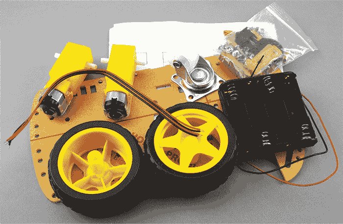

*图 6-22：该疯狂科学家使用的低成本机器人底盘*

#### 构造

这个项目中最棘手的部分可能就是底盘套件的组装。将螺丝和螺栓放到正确的位置需要精确和技巧。

不是所有的底盘都相同，所以我不会逐步带你进行组装，而是给你一些高层次的建议。你的底盘应该会附带说明书，尽管它们可能有些难以理解。一般来说，你需要连接齿轮电机、万向轮（能够自由转动的轮子）、电机控制器和 micro:bit。

1.  将提供的电线焊接到电机接线端子上，如图 6-23a–c 所示。如果你工作迅速，可以通过将大量焊锡熔化到电机接线端子上，然后用烙铁将电线按压到焊锡的顶部来制作一个良好的焊接点（见图 6-23a）。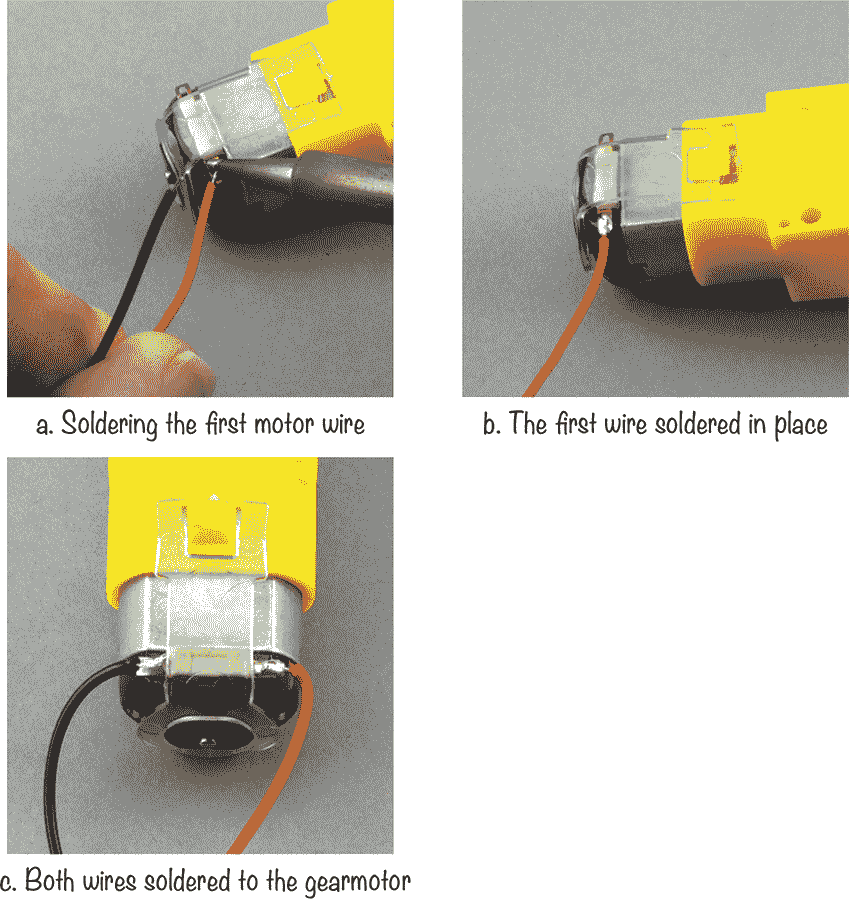

    *图 6-23：将电线焊接到电机上*

1.  红色电线连接到哪个端子并不太重要。只要确保两台电机之间保持一致。如果你决定将红线连接到一台电机的右侧端子上，那么另一台电机的红线也要连接到右侧端子。

1.  去除覆盖底盘的纸层。图 6-24a–e 展示了组装过程的大致步骤。你可能会发现你的底盘与展示的不同。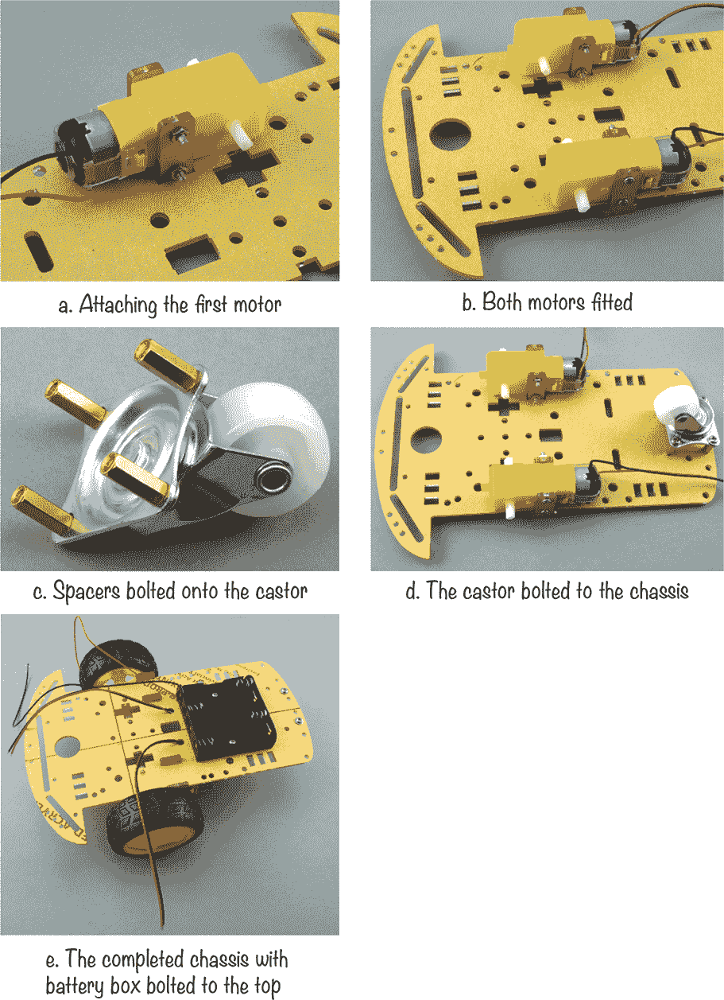

    *图 6-24：组装底盘*

    在组装底盘时，有几个事项需要记住：

     不要过度拧紧螺母和螺栓，因为这样可能会导致塑料底盘开裂。

     安装齿轮电机时，将螺母朝向底盘的内部，这样突出在螺母外的电机固定螺栓就不会妨碍车轮。

     如果螺栓不能顺利旋入螺母中，可以试着将螺栓逆时针旋转一点，找到螺母的螺纹起始位置。你可以用一把小钳子抓住螺母，然后用螺丝刀转动螺丝。

1.  一旦底盘安全组装好，将 micro:bit 安装到 Kitronik 电机驱动板上，确保 micro:bit 的屏幕朝外，如 图 6-25 所示。小心对准 micro:bit 的边缘连接器与电机控制器上的插座，并将其牢固按入到位。当你的控制器看起来像 图 6-25 时，使用粘性粘土将其固定到底盘上，粘土在 图 6-25 中也有展示。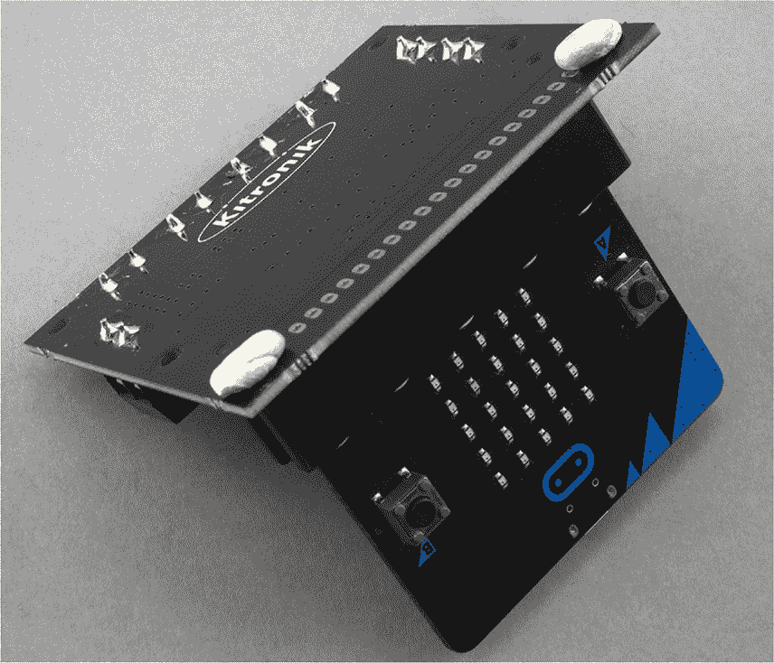

    *图 6-25：安装 micro:bit*

1.  现在是接线电机和电池盒的时候了。首先，查看 图 6-26 了解你要实现的连接。旋松相关端子的螺丝，将电线牢固地放入端子中，然后将螺丝重新旋紧。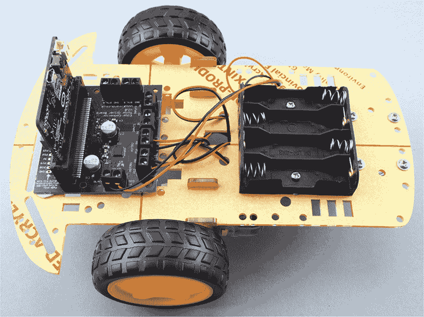

    *图 6-26：接线*

1.  进行以下连接：

     从电池盒引出的红色（正极）电线连接到电机控制器上标记为 `RED +` 的螺丝端子

     从电池盒引出的黑色（负极）电线连接到电机控制器上标记为 `BLACK -` 的螺丝端子

     从左侧电机（从后方看）引出的红线连接到电机控制器上的螺丝端子，标记为 `MOTOR1 P12`

     从左侧电机引出的黑线连接到电机控制器上的螺丝端子，标记为 `MOTOR1 P8`

     从右侧电机引出的红线连接到电机控制器上的螺丝端子，标记为 `MOTOR2 P0`

     从右侧电机引出的黑线连接到电机控制器上的螺丝端子，标记为 `MOTOR1 P16`

1.  在本项目中，你将使用 Android 应用通过蓝牙控制车载机器人。你可以在 *[`www.bittysoftware.com/downloads.html#controller`](http://www.bittysoftware.com/downloads.html#controller)* 上找到运行在 micro:bit 上的代码。点击链接 **micro:bit hex 文件用于** **Kitronik Buggy - 无需配对** 并下载 hex 文件。该文件也可以在 *其他下载* 文件夹中与书籍下载一起获取。接下来，通过 USB 将 micro:bit 连接到电脑，并将下载的 hex 文件复制到你的 micro:bit 中。此时你还不需要电池。

1.  要在你的安卓手机上安装应用程序，打开 Google Play 并搜索*Bitty Controller*。你需要为该应用支付几美元。下载并安装该应用。

1.  我们离试验这个项目只差一步了！把四节 AA 电池放入电池盒中。这些电池将为电动机和你的 micro:bit 提供电力，这意味着你可以拔掉 USB 电缆——是时候让你的探测器自由了。

打开 Bitty Controller 应用程序（图 6-27），点击**扫描**。这应该能够找到你的 micro:bit。在图 6-27 中，它被称为*BBC micro:bit [gaviv]*。点击它后，RC 风格的控制器（见图 6-28）应该会出现。micro:bit 的显示屏上也应该会显示一个`C`，表示它已连接到你的手机。

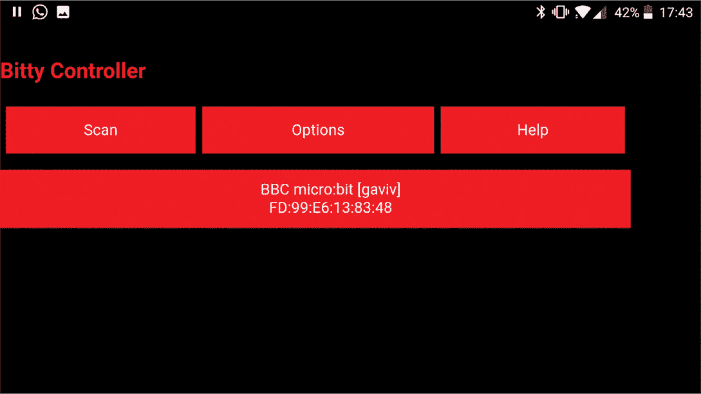

*图 6-27：启动 Bitty Controller*

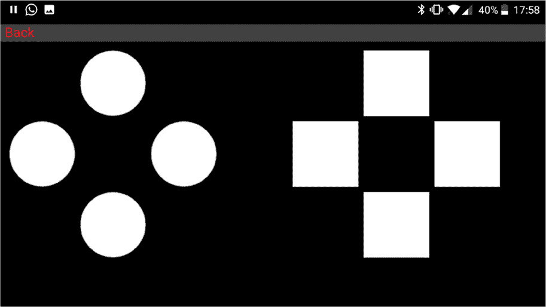

*图 6-28：双 D-pad 控制器*

使用顶部和底部的方形按钮来控制探测器的前进和后退。要让探测器向左和向右转动，使用左右圆形按钮。

第一次测试时，做点简单的事：将探测器翻到背面，用应用程序控制车轮。它们会转动吗？一旦探测器通过了这一测试，就把它放到地板上，尝试驾驶它。如果你不喜欢控制器布局，可以前往 Bitty Controller 应用中的“选项”来寻找其他布局。

如果你的探测器在你让它后退时却向前进，反之亦然，说明你的电线接错了：交换电机 1 和电机 2 的红线和黑线。如果你的探测器绕圈行驶，交换其中一个电机的电线对。

当你想关闭你的探测器时（这是一种延长电池使用寿命的好方法），只需将电池架中的一端电池抬起。瞧！你现在就有了一个粗糙的开关。

#### 工作原理：电动机与电流流动

齿轮电动机的方向由流经它们的电流方向控制——如果你反转电流方向，电动机的转向也会反转。如图 6-29 所示，当连接 A 为正，连接 B 为负时，电动机顺时针转动。如果 A 和 B 反向连接，使得 A 为负，B 为正，则电动机反向旋转。

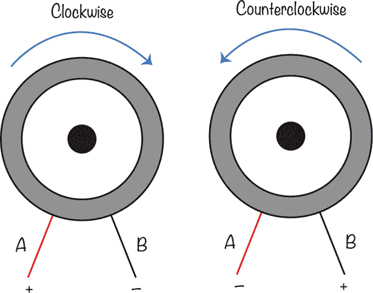

*图 6-29：控制电动机的方向*

Kitronik 马达控制器包含一个芯片，控制两个电动机的电流方向。它还提供电动机所需的相对较高电流。

### 总结

在这一章中，我们涵盖了很多内容。首先，我们了解了伺服电动机以及如何使用 micro:bit 设置一个伺服电动机。然后，我们构建了两个复杂的项目：动画头和遥控探测器。在这个过程中，我们学习了 PWM 和电流流动，还掌握了一些基本的编程技巧。

现在你知道如何让物体移动了，你可以开始考虑其他你想要制作的项目了。你希望哪些物体能够自动移动呢？在下一章，我们将探讨如何处理时间。
