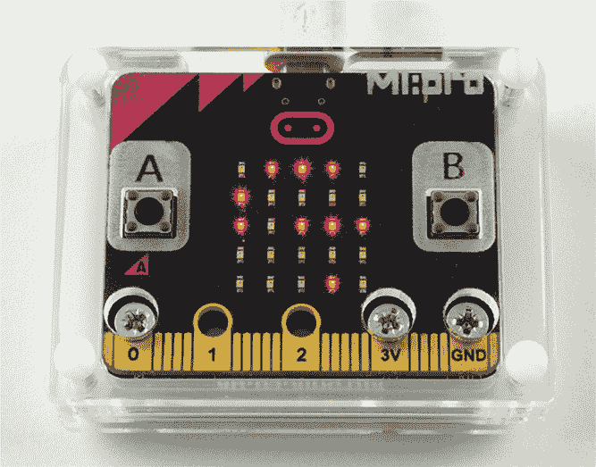
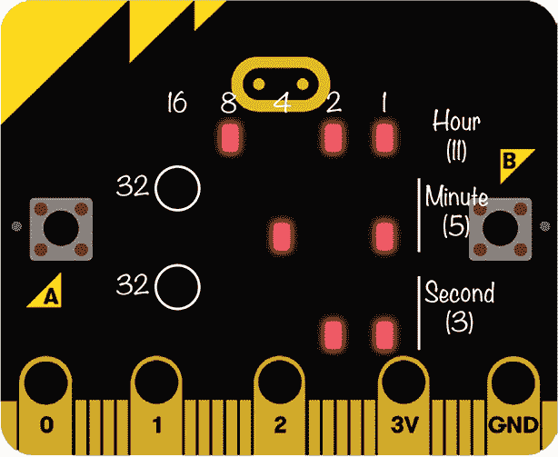
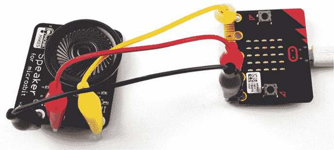

## 第七章：**时间旅行**

好的，虽然我们在本章中不会真正建造时光机，但你将通过制作一个二进制时钟和一个可以说话的时钟来衡量时间。我们还将进行一个实验来测试你的 micro:bit 保持时间的能力。本章中的所有实验和项目仅使用 MicroPython。

### 实验 9：保持时间

这个实验的目的是制作一个能够精确计时的 micro:bit 时钟。也就是说，编程让 micro:bit 每秒精确地滴答一次。

一种实现方式是使用`sleep`函数，如这里展示的代码。请注意，这段代码不是一个完整的程序，因此不要尝试运行它。`sleep`命令会让 micro:bit 在指定的时间内什么都不做。在我们的例子中，延迟是 1000 毫秒（1 秒）。

seconds = 0

while True:

sleep(1000)

seconds += 1

在这个例子中，每过 1 秒，程序就会将`seconds`变量加 1，记录经过的秒数。这个循环会无限重复，作为标记时间的一种方式，它能工作一段时间。

问题在于，时钟会逐渐滞后，因为我们没有考虑到 micro:bit 为`seconds`变量加 1 所花费的时间。在这个例子中，给变量加 1 几乎不花时间，但如果程序变得更长——例如，要求时钟同时显示时间，甚至说出时间（我们稍后会尝试）——那么延迟可能变得显著。这也是不可预测的，因为每次程序循环时丢失的时间可能不同。

因此，一个更好的保持时间的方法是使用`running_time`函数。该函数返回自 micro:bit 上次重置以来经过的毫秒数，且不受代码其他部分执行时间的影响。

在这个实验中，我们将使用`running_time`函数来计算我们的 micro:bit 时钟运行得有多慢或多快。

#### 你需要的材料

要进行这个实验，你只需要两样东西：

**Micro:bit**

**USB 电缆**

#### 构造

1.  在*[`github.com/simonmonk/mbms/`](https://github.com/simonmonk/mbms/)*查找代码。这个实验的 Python 文件是*Experiment_09.py*。打开程序并通过 Mu 闪存到你的 micro:bit 上。

1.  一旦你成功编程 micro:bit，按下按钮**B**。你应该会发现 micro:bit 将秒数设置为 0，并从 0 开始计数。

1.  设置手机或其他设备上的计时器，精确到 16 分钟 40 秒。启动计时器的同时，按下按钮**B**重置 micro:bit 的秒数计数。在计时结束时，按下按钮**A**冻结时钟并记录显示的秒数。

因为这个实验涉及的是计时，所以重要的是在按下 B 按钮时准确启动计时器，并在计时器响起时立刻按下 A 按钮。如果有朋友帮助，会更容易：你们可以一人操作计时器，另一人操作 micro:bit。

设置计时器为 16 分钟 40 秒的原因是因为这正好是 1,000 秒。如果 micro:bit 的秒数大于 1,000，说明时钟走得太快；如果秒数小于 1,000，说明时钟走得太慢。我的 micro:bit 的秒数为 989，表明 micro:bit 的内部时钟比正常时间慢了大约每千分之一的 11 个部分。

记下你的 micro:bit 的秒数。在本章的项目中，你将用它来提高时钟的准确性。

#### 代码

这是实验 9 的 MicroPython 代码：

from microbit import *

seconds = 0

last_time = 0

while True:

now = running_time()

elapsed_ms = now - last_time

if elapsed_ms >= 1000:

seconds += 1

last_time = now

if button_a.was_pressed():

display.scroll(str(seconds))

if button_b.was_pressed():

seconds = 0

display.show("0")

sleep(100)

display.clear()

程序使用了两个变量：

`last_time` 用来跟踪时钟上次滴答的时间

`seconds` 用来跟踪自 micro:bit 上次重置并开始计时以来已过去的秒数

我觉得将时钟*滴答*作响就像普通时钟一样是有用的。也就是说，它会在固定的间隔时间内做一些事情。

主`while`循环使用`running_time`函数来计算 micro:bit 已运行的毫秒数。它将这个数字存储在一个名为`now`的变量中。然后，通过将`now`减去`last_time`来计算自上次计时以来经过了多少毫秒。

如果经过的毫秒数大于或等于 1,000——换句话说，大于或等于 1 秒——那么`seconds`变量将增加 1。然后，我们将已过的毫秒数重置为 0，以便重新开始计时。

我们使用两个`if`语句来编程 A 按钮和 B 按钮。如果按下 A 按钮，micro:bit 会显示`seconds`，即自程序开始运行以来经过的时间。如果按下 B 按钮，秒数计数会重置为 0。

#### 工作原理：保持时间

micro:bit 的处理器使用晶体振荡器（用于精确计时的电子元件），其精度应当达到每百万分之 30。然而，在我的 micro:bit 上，它由于某种原因不准确，偏差为每百万分之 11,000。

要获得一个真正精确的时钟，你需要使用专用的 RTC（实时时钟）芯片和独立的晶体振荡器。在写本文时，尚未推出专门针对 micro:bit 的 RTC 芯片。虽然可以通过一定的手段让它与 micro:bit 配合使用，但这个过程相当复杂。因此，最好不要过于依赖本章中构建的任何一个时钟，但这些项目很有趣，并且会教会你重要的技能。

### 项目：二进制时钟

*难度：简单*

在这个项目中，如图 7-1 所示，你将创建一个显示*二进制*时间的时钟。二进制是计算机使用的一种计数系统。你可以在第 176 页的《工作原理：用二进制告诉时间》一节中了解更多关于它的信息。二进制时钟在 micro:bit 的 LED 显示器上分别以二进制数字显示小时、分钟和秒数。

*图 7-1：Kitronik MI:Pro 外壳中的二进制时钟*

图 7-2 展示了 micro:bit 上的二进制计数系统。一开始它看起来可能有点困惑，就像一组随机的 LED 图案，但我会很快解释它是如何工作的。而且，疯狂的科学家喜欢通过展示自己读取二进制时钟的技巧来给朋友们留下深刻印象！

*图 7-2：读取二进制时钟*

#### 如何读取二进制时钟

我们的二进制时钟是一个 24 小时制时钟。要读取时钟，从图 7-2 所示的顶部 LED 行开始。这一行代表小时。每一列的 LED 代表一个数字。从右到左，这些列分别代表数字 1、2、4、8 和 16。通过将这五个数字相加，你可以创建从 1 到 24 之间的每个可能的值。要计算小时数，请加上那些亮着的 LED 列对应的数字。在图 7-2 中，亮着的列是 1、2 和 8，它们加起来是 11。所以，时间是 11 点。

接下来的两行表示分钟数，底部的两行表示秒数。分钟和秒数通过具有相同 1、2、4、8 和 16 个 LED 的行来表示。然而，由于我们需要能够计算到 60（分钟和秒），这些值通过前一行的一个附加 LED（值为 32）来指示。如图 7-2 所示，分钟的 32 个 LED 是从顶部数起第二行最左边的 LED，而秒钟的 32 个 LED 是从顶部数起第四行最左边的 LED。

在图 7-2 中，4 和 1 分钟的 LED 亮着，表示 5 分钟。2 和 1 秒钟的 LED 亮着，表示 3 秒钟。合起来，这个显示表示的时间是 11:05:03。

按住 A 按钮将使时钟上的数字迅速前进，允许你设置时间。你只需要准备好在时钟显示正确时间时立即停止它。

你可以观看这个时钟运作的视频，包括如何设置时间，视频链接是 *[`www.youtube.com/watch?v=v26gYo5OG0g`](https://www.youtube.com/watch?v=v26gYo5OG0g)*。

#### 你需要的材料

对于这个项目，你只需要你的 micro:bit 和一个电源。

如果你计划让时钟持续运行，那么应该为 micro:bit 使用 USB 电源适配器或其他长期电源（参见附录），以节省电池。你可能还想为 micro:bit 配一个外壳，让时钟看起来更漂亮。

记住，时钟不会保持完美的时间，所以你需要相对频繁地重置它。

#### 构建

1.  这个项目的代码是用 MicroPython 编写的，因为所需的数学运算用 Blocks 代码实现起来会非常复杂。你可以从 *[`github.com/simonmonk/mbms/`](https://github.com/simonmonk/mbms/)* 下载代码。这个项目的文件是 *ch_07_Binary_Clock.py*。

1.  在将程序加载到你的 micro:bit 上之前，请在 Mu 中打开它并更改当前时间，以确保它准确无误。你应该将其设置为当前时间之前的几分钟，以确保安全。稍后你可以通过按住 A 键来调整时间。

    通过修改以下几行来更改时间。记住，这是 24 小时制的时钟，所以，例如，晚上 6:00 是 12 + 6 或 18 小时。

    hours = 8

    minutes = 25

    你还应该将 `adjust` 变量的值更改为你的 micro:bit 时钟慢或快的千分之一。我的 micro:bit 在 1,000 次中慢了 11 秒，所以我将 `adjust` 设置为 -11 来稍微加快它（注意负号）。如果 micro:bit 比如每 1,000 次快 10 秒，那么我会将 `adjust` 设置为 10，以略微减慢它的速度。

#### 代码

这个项目涉及了相当多的数学。我们还会使用一些更高级的编程特性，例如*二维数组*，在 Python 中比在 Blocks 代码中更容易实现。

让我们将代码分成几个部分，首先是为每个 LED 分配正确的二进制值的几行代码：

# hhhhh

# m

# mmmmm

# s

# sssss

sec_leds = [[4, 4], [3, 4], [2, 4], [1, 4], [0, 4], [0, 3]]

min_leds = [[4, 2], [3, 2], [2, 2], [1, 2], [0, 2], [0, 1]]

hour_leds = [[4, 0], [3, 0], [2, 0], [1, 0], [0, 0]]

adjust = -11

代码的前四行其实并不是程序的一部分。它们是*注释行*，或者说是提示，提醒你哪些 LED 显示的是小时、分钟和秒。这些注释可以作为设置后续数组中 LED 坐标的有用参考。

接下来的三行是前面提到的二维数组。这些数组将适当的 LED 坐标分配给秒、分钟和小时。记住，数组就像变量，只不过它们包含多个元素。我们这里使用的数组被称为*二维*数组，因为它们的元素也是数组。例如，第一个数组`sec_leds`的第一个元素是[4, 4]。这表示用于显示秒数的第一个 LED 的坐标是 x=4 和 y=4，也就是显示器右下角的那个 LED。图 7-3 展示了构成显示的单个 LED 的坐标。

*图 7-3：LED 显示坐标*

如你所见，左上角的 LED 坐标是[0, 0]，右下角是[4, 4]。

接下来，我们有`hours`、`minutes`和`seconds`变量来保持当前时间：

hours = 8

minutes = 25

seconds = 1

adjust = -11

我们将使用`adjust`变量来修正时钟的速度。如果你不确定如何操作，可以参考第 167 页中的“构造”部分。

这是一个将 LED 灯开关控制为二进制显示的函数：

def display_binary(value, num_bits, leds):

v = value

for i in range(0, num_bits):

v_bit = v % 2

display.set_pixel(leds[i][0], leds[i][1], int(v_bit * 9))

v = int(v / 2)

我们有三个单独的二进制数字（小时、分钟和秒）需要显示，`display_binary`函数适用于所有这些。它接受一个要显示的数字（`value`）、显示数字所用的 LED 数量（`num_bits`）和 LED 的数组（`leds`）。它使用这三个值来在 micro:bit 上显示时间的三个部分——秒、分钟和小时。

为了跟踪时间，使用了两个变量：

last_time = 0

tick = 1000 + adjust

变量`last_time`记录时钟上次滴答的时间，变量`tick`保存时钟滴答的时长（毫秒）。`tick`的默认值是`1,000 + adjust`，但当你按下 A 按钮设置时间时，这个值会发生变化。

这是更新时间的代码：

def update_time():

global hours, minutes, seconds

seconds += 1

if seconds > 59:

seconds = 0

minutes += 1

if minutes > 59:

minutes = 0

hours += 1

if hours > 23:

hours = 0

`update_time`函数每次调用时会将秒数增加 1。当`seconds`超过 59 时，秒数会重置为 0，分钟数加 1。对小时数也是如此。我们通过嵌套的`if`语句来实现这个功能。

这是以二进制方式显示小时、分钟和秒数的代码：

def display_time():

display_binary(seconds, 6, sec_leds)

display_binary(minutes, 6, min_leds)

display_binary(hours, 5, hour_leds)

我们将这段代码放入`display_time`函数中，该函数调用之前定义的`display_binary`函数。

这是主要的 `while` 循环，它使时钟在按下按钮 A 时快速运行，其他情况下正常运行。它还包含保持时间的代码。

while True:

如果 `button_a.is_pressed()`：

`tick = 10`

否则：

`tick = 1000 + adjust`

`now = running_time()`

`elapsed_ms = now - last_time`

如果 `elapsed_ms` 大于或等于 `tick`：

更新时间()

display_time()

循环的第一部分检查是否按下了按钮 A。如果按下，则代码将 `tick` 设置为 10 毫秒。否则，将其设置为 `1000 + adjust`。

最后，我们编写了使时钟保持运行的代码。`running_time` 函数返回自上次重置 micro:bit 后经过的毫秒数。每次程序循环时，我们计算自上次时钟滴答声以来已过去的时间。循环执行以下操作：

1.  获取当前的 `running_time` 并将其存储在名为 `now` 的变量中

1.  通过计算 `now` 和 `last_time` 之间的差值来得出 `elapsed_ms` 的值

1.  如果 `elapsed_time` 大于我们的 `tick` 时间（1 秒），则更新时间

1.  将 `last_time` 设置为 `now`，重置毫秒计数为零

#### 工作原理：用二进制表示时间

使用这个二进制时钟来查看时间有点棘手。尤其是秒数，可能在代码计算出来之前就已经改变了。但是，二进制系统之所以存在是有原因的。

我们大多数人都熟悉十进制数字系统。*十进制*是拉丁语中表示 10 的词，在十进制系统中，我们使用 10 个不同的符号（数字 0 到 9）。如果我们需要写一个大于 9 的数字——比如 15——那么我们就用两位数字。因为数字 15 中 1 的位置，我们知道它实际上代表的是 10。

下表显示了从 0 到 10 的二进制数。注意，在十进制中，我们不写*前导零*。例如，我们不会将 15 写成 0015。但在二进制中，习惯上会加上前导零，使数字长度一致。这就是计算机科学家的一种做法。所以在这种情况下，所有二进制数都是四位数。

|  **十进制**  | **二进制** |
| --- | --- |
| 0 | 0000 |
| 1 | 0001 |
| 2 | 0010 |
| 3 | 0011 |
| 4 | 0100 |
| 5 | 0101 |
| 6 | 0110 |
| 7 | 0111 |
| 8 | 1000 |
| 9 | 1001 |
| 10 | 1010 |

理论上，计算机可以使用 10 种不同的电压来表示数字 0 到 9，但它们并不这么做。相反，计算机使用一种叫做二进制的系统。二进制中的数字（也叫做 *比特*）只有两种可能的状态，可以是 0 或 1。计算机使用二进制是因为它们使用的 *晶体管* 很擅长表现“关（0）”或“开（1）”的状态。也就是说，晶体管只有 2 种状态，这比给它们提供 10 种状态要容易得多。而且，二进制逻辑背后的数学原理使得计算机在处理二进制数字时能够进行可靠的算术运算，比起处理十进制数字要轻松得多。

就像熟悉的十进制系统一样，二进制系统通过组合数字来表示更大的数字。而在十进制中，每个数字的位置是按 10 的倍数增加的——从 1 到 10，再到 100——而二进制中的每个数字则按 2 的倍数增加——从 1 到 2，再到 4，以此类推。例如，四位二进制数 1010 在 16 位和 2 位位置上是 1，在其他位置上是 0。换算成十进制，就是 16 + 2，等于 18。

事实证明，你并不需要很多二进制数字就能表示一些非常大的数字。例如，八位二进制数字组合在一起（称为 *字节*）可以表示从 0 到 255 之间的十进制数。如果是 16 位，那么数字范围可以达到 65,535。如果是 64 位的计算机，它能使用这 64 位数字做所有的运算，并且能够表示 0 到 18,446,744,073,709,551,615 之间的数字。顺便提一下，micro:bit 拥有一颗 32 位处理器，能够表示 0 到非常可观的 4,294,967,295 之间的数字。我们一直在使用的 MicroPython 函数 `running_time` 使用的是 32 位数字。这意味着它在 4,294,967,295 ÷ 1,000 ÷ 60 ÷ 60 ÷ 24 = 49.7 天内不会用完数字。

### 项目：会说话的时钟

*难度：简单*

有时候疯狂科学家忙于试管、化学品和浓烟，以至于无法查看时间。然后他们忘记吃饭！这时，一款会说话的时钟就派上用场了。这个项目（图 7-4）每小时报一次时间，或者当你按下 A 按钮时也会报时。

*图 7-4：会说话的时钟*

你可以在 *[`www.youtube.com/watch?v=iNjXEK8RUtU`](https://www.youtube.com/watch?v=iNjXEK8RUtU)* 上看到这个项目的实际效果。

#### 你需要的东西

对于这个项目，你需要以下物品：

**Micro:bit**

**3 根鳄鱼夹电缆** 用于将 micro:bit 连接到扬声器

**micro:bit 扬声器** 用于播放声音（可以使用 Monk Makes 扬声器，或者参考 第二章 了解其他扬声器选项。）

**电源适配器** 参见 附录，了解如何使用不需要电池的方式为 micro:bit 供电。

如果你打算保持时钟运行，那么使用 USB 电源适配器或其他长期电源解决方案，以节省电池。

你可能想为时钟制作一个外壳，或者将 micro:bit 和扬声器固定在你用于第三章光控吉他项目的同一块纸板上。

#### 构建

1.  这个项目的代码是用 MicroPython 编写的，因为在 Blocks 代码中当前无法使用语音库。从*[`github.com/simonmonk/mbms/`](https://github.com/simonmonk/mbms/)*下载代码。此项目的文件是*ch_07_Talking_Clock.py*。

1.  在将程序加载到你的 micro:bit 之前，打开 Mu 文件并将小时和分钟更改为当前时间。还要将`adjust`更改为你想调整时钟的时间量。如果你不确定如何操作，请参见第 167 页二进制时钟项目中的“构建”部分。

1.  使用一个鳄鱼夹将扬声器连接到 micro:bit 的 0 号引脚，另一个鳄鱼夹连接到扬声器上的 IN 引脚。使用另外两个夹子为扬声器提供电源，如图 7-4 所示。

1.  等待步骤 2 中设置的时间到达。然后将 micro:bit 连接到电源。请注意，在这个项目中，没有其他机制来设置时间。

#### 代码

为了更清楚地说明，我们将分段处理这段代码。

这是做时间保持的代码——换句话说，它确保小时和分钟是正确的。它几乎与上一个项目中的时间保持代码相同。主要的区别是，代码不会在 LED 显示屏上显示时间，而是通过语音播报当前时间。

digits = ["no", "1", "2", "3", "4", "5", "6", "7", "8", "9",

"ten", "eleven", "twelve", "thirteen", "fourteen", "fifteen"

"sixteen", "seventeen", "eighteen", "nienteen"

tens = ["no", "no", "twenty", "thirty", "forty", "fifty"]

preamble = "The time is "

am = "aye em"

pm = "pee em"

我们使用多个变量和数组来保存 micro:bit 将要说的一组词。

语音库包含一些常见单词的录音。它可以说出 1、2 或 3 这样的单个数字，但对于 10 及以上的数字，它会分别发音每个数字，这不是我们希望时钟说的方式。因此，我们必须拼写出大于 10 的数字。注意，*nineteen*被拼写成*nienteen*，这样在合成语音说出时才听起来正确。名为`digits`的数组保存了 0 到 19 的每个数字的文本。时钟永远不会读出 0，所以我们将它设置为单词`no`。

`tens`数组在处理 10 的倍数时做类似的工作。我们已经通过 digits 数组考虑了所有小于 19 的数字，因此我们不需要担心`tens`数组中的前两个元素，它们永远不会被说出来。我们将它们也设置为`no`。

`preamble` 变量包含在 micro:bit 每次播报时间之前会说的文本。`am` 和 `pm` 变量包含 AM/PM 指示符的音标版本。在读取时间后，micro:bit 将说出这些中的一个。

这是带有实际说出时间的函数的代码。它的名字非常贴切，叫做`speak_the_time`。

def speak_the_time():

h = hours

am_pm = am

if h >= 12:

am_pm = pm

if h > 12:

h = h - 12

if minutes == 0:

# 当前时间是十二点整

speech.say(preamble + digits[h] + " "

+ am_pm + " exactly")

else:

if minutes < 10:

# 当前时间是十二点四分下午

speech.say(preamble + digits[h] + " o "

+ digits[minutes] + " " + am_pm)

elif minutes < 20:

# 当前时间是十二点十八分下午

speech.say(preamble + digits[h] + " "

+ digits[minutes] + " " + am_pm)

else:

mins_tens = int(minutes / 10)

mins_units = minutes % 10

if mins_units == 0:

# 当前时间是十二点二十分钟下午

speech.say(preamble + digits[h] + " "

+ tens[mins_tens] + " " + am_pm)

else:

# 当前时间是十二点二十四分下午

speech.say(preamble + digits[h] + " "

+ tens[mins_tens] + " " + digits[mins_units] + " " + am_pm)

这个函数相当复杂，因为它必须处理我们表达时间的不同方式。

这个时钟使用 12 小时制语音播报，但以 24 小时制存储小时，因此`start_the_time`函数首先会判断当前时间是 AM 还是 PM。当`hour`值大于或等于 13 时，它会从`hour`中减去 12。

接下来，嵌套的`if`语句处理以下几种情况：

  如果时间正好整点，可以说类似`当前时间是十二点整`。

  否则，如果分钟数小于 10，可以在分钟前加上*o*，说出类似`当前时间是十二点四分下午`的内容。

  对于小于 20 的两位数分钟，可以使用`digits`数组并说出类似`当前时间是十二点十八分下午`的内容。

  对于其他大于 20 的两位数分钟，可以使用`tens`数组说出类似`当前时间是十二点二十分下午`的内容。

  如果分钟数不是 10 的倍数，应该说类似`当前时间是十二点二十四分下午`的内容。

最后是主`while`循环：

while True:

if button_b.is_pressed():

speak_the_time()

now = running_time()

elapsed_ms = now - last_time

if elapsed_ms >= tick:

elapsed_seconds = int(elapsed_ms / tick)

update_time(elapsed_seconds)

blink()

last_time = now

这个循环会检查是否按下了 B 按钮或一小时已经过去，如果发生其中任何一个事件，就会播报时间。它还调用了一个叫做`blink`的函数，用于闪烁屏幕上的心形图标，提醒你时钟正在运行，即使大部分时间它保持沉默。

#### 它是如何工作的：教 Micro:bit 说话

MicroPython 语音库为你的项目提供了各种可能性，正如你在第六章中看到的那样。音质虽然不是完美的，但它确实为你的项目增添了许多乐趣。

语音库本身基于*音素*的概念：声音的构建块。当你使用`say`函数时，要说的文本首先会被转换成一系列音素。由于口语语言的特殊性，这个过程常常不能完美执行——因此在这个项目的代码中，*nineteen*这个词的拼写被故意更改，以帮助`say`函数更准确地发音。

你可以在*[`microbit-micropython.readthedocs.io/en/latest/tutorials/speech.html`](https://microbit-micropython.readthedocs.io/en/latest/tutorials/speech.html)*上阅读更多关于这个语音库的内容。

### 总结

希望你现在已经对如何使用 micro:bit 制作时钟并用它来显示或直接告诉你时间有了一个很好的理解。

在下一章中，疯子科学家将把注意力转向心理学实验。
