## 第八章：**疯狂科学家的脑力游戏**

在本章中，疯狂科学家将注意力转向了他们天才的源泉——大脑！首先，你将通过测试你对刺激反应所需的时间来了解你的神经系统。接着，你将制作一个测量皮肤电阻的测谎仪，这也是多道测谎测试中的一个因素。用它来测试你的朋友。如果他们在你询问时变得热乎乎、满头大汗，那他们可能在撒谎哦！

### 实验 10：你的神经反应有多快？

*难度：中等*

人体通过神经细胞或神经元来处理刺激。*神经*是人体的电线，传递从大脑到身体其他部位的信号，并返回。当你触碰到热炉子时，似乎立刻感到疼痛。但与大多数电子产品中的铜线相比，神经的传递速度实际上比较慢。

通过测量大脑对信号反应所需的时间，你可以估算该信号在神经中传输的速度。在这个实验中，每当 micro:bit 屏幕变空时，你将用手或脚按下 A 按钮，micro:bit 会测量你反应所需的时间。

我们将制作一个纸板踏板围绕 micro:bit，这样你可以按下按钮而不遮挡显示屏（图 8-1）。

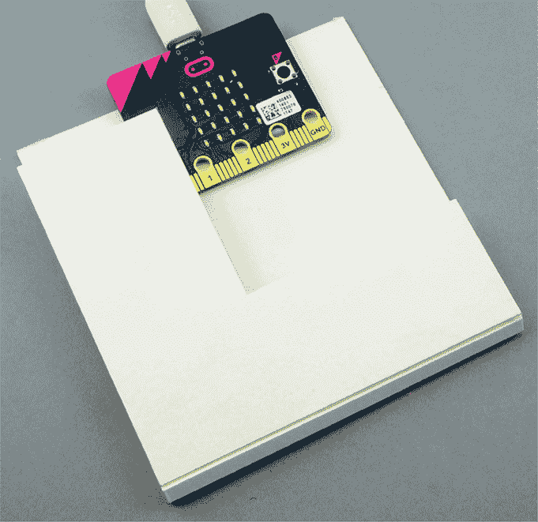

*图 8-1：将 micro:bit 变成脚踏开关*

#### 你需要的材料

对于这个项目，你需要：

**Micro:bit**

**约 8 英寸 × 4 英寸（20 厘米 × 10 厘米）纸板** 厚实且坚固的纸板效果最佳。不需要完全符合这个尺寸。

**工艺刀** 用于切割和打标纸板

**Blu-Tack 粘合膏** 用来将 micro:bit 固定到纸板上

#### 构建

我们将从制作一个纸板踏板开始，这个踏板将围绕 micro:bit 对折。

1.  在纸板上大约从中间开始画出两条平行线，间隔约 1/4 英寸（5 毫米），如图 8-2 所示。你将沿着这些线条对折纸板。同时，标记出你要切割的矩形部分。确保你要切割的孔足够大，可以容纳 micro:bit 的屏幕。

1.  沿着铰链的线条用刀切割，只切到纸板的一半。这叫做*打标*纸板。小心不要切割完全。然后切掉你标记的矩形部分。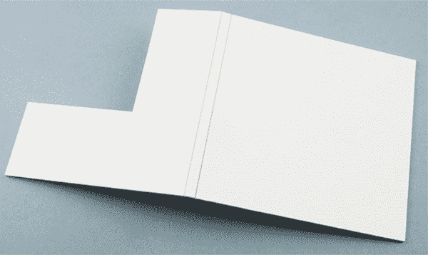

    *图 8-2：制作铰链并切出 micro:bit 显示屏的位置*

    **警告** 使用工艺刀可能很危险！在这个项目的这部分，应该由一个负责任的成人使用工艺刀，或者至少进行监督。

1.  将 micro:bit 放入折叠的纸板中，以便你可以看到它的屏幕。将小块 Blu-Tack 粘贴在 micro:bit 的中央，然后将 micro:bit 粘贴到纸板上。当你轻轻按压铰链的顶部时，你应该能感觉到 A 按钮的点击（见图 8-1）。检查按下开关时，是否不会不小心按到 micro:bit 背面的重置按钮。如果按到了，尝试使用更大的 Blu-Tack 块。

1.  本实验仅使用 MicroPython。代码可以在 *[`github.com/simonmonk/mbms/`](https://github.com/simonmonk/mbms/)* 找到。本实验的 Python 文件是 *Experiment_10.py*。在 Mu 中打开该文件并将其加载到 micro:bit 上。

#### 测试你的神经系统

控制此实验的程序使用 Mu 的 REPL 来报告结果并给出指令。（如果你需要复习 REPL 的工作原理，请回顾第一章。）因为它使用 REPL，这是一个你需要通过 USB 电缆将 micro:bit 连接到计算机的实验。我们将使用 micro:bit 的显示屏和 A 按钮来测量反应时间。

打开 Mu 的 REPL。REPL 窗口中的指令会要求你在 micro:bit 显示十字形时按住 A 按钮，并在显示屏变空时尽可能快地释放它。

下面是你在典型运行中可能会看到的 REPL 内容。为了清晰起见，指令被分成了几个部分。

测试 1 - 使用你的手

当十字形显示时，按住开关。

当显示屏变空时，暂时释放按钮。

重复 5 次。

准备好开始测试时按 ENTER

要开始第一次测试，使用你的主手按住开关，并在计算机上按一次 ENTER。屏幕上应该会出现一个十字形。在 3 到 7 秒之间的随机延迟后，显示屏会变空。当它变空时，尽可能快地释放按钮。REPL 应该显示显示屏变空和你释放开关之间的毫秒数。例如：

252

十字形应该会在另一个随机时间段内点亮，因此按住开关再试一次。实验应该重复五次。

如果你在显示屏变空*之前*松开开关，REPL 会显示消息 `You let go too soon`。这将记录一个 0 的时间，导致实验无效，你需要重新开始整个过程。如果发生这种情况，重置 micro:bit，方法是拔掉它的 USB 电缆并重新插上。

完成五次测试后，micro:bit 的显示屏应保持空白，REPL 会显示你每次的反应时间以及所有时间的平均值。例如：

252

264

264

282

使用手时的平均时间是 262.7999 毫秒

然后你需要使用脚重复实验。将 micro:bit 踏板放到地板上。这次，将你的脚放在 micro:bit 上，轻轻地用脚按下开关。掌握这一点可能需要一些练习。

现在重复脚的测试。一旦你捕获了五次反应时间，REPL 应该会显示平均值，然后提示你输入以下两个测量值，像这个示例一样：

使用脚的平均时间是 368.3999 毫秒

输入从脖子到手指的距离（单位：厘米）：107

输入从脖子到脚趾的距离（单位：厘米）：188

程序将使用这些测量值计算大脑意识到显示器已消失的时间（毫秒为单位），即思考时间。它还会计算信号传输到手或脚的速度（米/秒），即传输速度。

思考时间（毫秒）：123.3036

传输速度（米/秒）：13.03703

《工作原理：测量你的反应时间》一章在 第 191 页 会解释这些计算是如何进行的，以及它们的意义（或没有意义）。

#### 代码

我们使用变量 `n` 来保存每个测试所需的反应时间读取数量。在此例中，共进行五次读取。

from microbit import *

import random

n = 5

def run_full_test():

print("测试 1 - 使用你的手")

t_hand = run_test()

print("使用手的平均时间是 " + str(t_hand))

+ " 毫秒")

print("现在重复脚的测试")

t_foot = run_test()

print("使用脚的平均时间是 " + str(t_foot))

+ " 毫秒")

➊ d_hand = int(input("输入从脖子到

从脖子到手指的距离（单位：厘米）："))

➋ d_foot = int(input("输入从脖子到

从脖子到脚趾的距离（单位：厘米）："))

thinking_time = (d_foot * t_hand - d_hand * t_foot)

/ (d_foot - d_hand)

transmission_speed = 10 * (t_foot - thinking_time) / d_foot

print("思考时间（毫秒）： " + str(thinking_time))

print("传输速度（米/秒）： " + str(transmission_speed))

`run_full_test` 函数依次运行手和脚的测试。（稍后我们会定义这两个测试的代码。）代码的最后四行是计算思考时间和传输速度，这些内容将在《工作原理：测量你的反应时间》一章的 第 191 页 进行解释。

此函数还通过 `input` 函数提示你输入脖到手和脖到脚的距离。程序能够使用这些信息，因为它将输入存储在变量中。我们将脖到手的距离存储在 `d_hand` ➊ 中，将脖到脚的距离存储在 `d_foot` ➋ 中。

`input` 函数显示你作为参数提供的文本字符串，然后等待你输入一些文本。它返回你输入的内容作为字符串，而 `int` 函数将该字符串转换为整数，以便我们在计算中使用。

以下是`run_test`函数的代码：

def run_test():

print("在交叉图形显示时按住开关，并

释放时稍微放开，当显示屏变空时")

print("重复 " + str(n) + " 次。")

input("准备好开始测试时按回车")

total = 0

for i in range(0, n):

t = get_reaction_time()

if t > 10:

print(t)

total += t

else:

print("你松开得太早")

return total / n

`run_test`函数运行单次测试，提供必要的指示，并通过调用`get_reaction_time`来收集所需数量的反应时间读数。如果反应时间小于 10 毫秒，这意味着超人般的反射速度，程序会告诉你松开得太早。否则，它会显示你的反应时间。

def get_reaction_time():

display.show(Image.NO)

sleep(random.randint(3000, 7000))

display.clear()

t0 = running_time()

while pin5.read_digital() == False: # 按钮 A 按下

pass

t1 = running_time()

t = t1 - t0

return t

run_full_test()

`get_reaction_time`函数显示交叉图像，然后在 3 到 7 秒之间随机休眠一段时间。然后它清除屏幕并将变量`t0`设置为当前的运行时间，这样程序就知道何时开始计时反应测试。

当你松开按钮 A 时，程序退出`while`循环，并在`t1`中记录停止的时间。我们通过从`t1`中减去`t0`来计算反应时间。

你可能会想，为什么代码使用`pin5.read_digital`来检查按钮 A 是否被按下，而不是使用`button_a.is_pressed`。答案是，`is_pressed`函数的操作速度不如`read_digital`快，因此会为反应时间测量增加一些不必要的额外时间。我们使用`pin5`是因为 micro:bit 的电路将引脚 5 直接连接到按钮 A。事实上，micro:bit 有许多其他引脚，而不仅仅是我们与鳄鱼夹一起使用的引脚 0 到 3。然而，在本书中，我们专注于那些易于访问的引脚。

#### 尝试的事项

为了进一步研究人类神经系统，可以尝试比较不同人的结果或在不同时间进行测试。

#### 原理：测量你的反应时间

当你看到交叉图形消失时，你的身体会发生两件事，每件事都需要一定的时间：

1.  你的眼睛和大脑注意到变化并决定采取行动。

1.  一个信号从你的大脑通过神经传递到控制手或脚的肌肉，然后手或脚离开开关。

对于这个实验，我们假设思考时间，即你注册变化的时间，无论是移动你的手还是脚，都是相同的。

我们还假设大脑与手部和大脑与脚部之间的神经信号传输速度是相同的。实际上，这两个假设都不完全准确，但疯狂科学家可以稍后解决这些问题。

基于这些假设，信号在神经系统中传播的速度等于总反应时间减去思维时间，再除以信号必须传播的距离。

通过测量这两个距离，我们可以粗略地计算出思维时间和信号速度。以下是我们将在计算中使用的变量：

`t_hand` 手部的总反应时间（思考 + 动作）

`t_foot` 脚部的总反应时间

`d_hand` 信号需要沿神经从大脑到手部传播的距离

`d_foot` 大脑到脚的距离

`thinking_time` 注册事件并开始向手或脚发送信息所需的时间

`transmission_speed` 信号从大脑到手或脚的传播速度

现在进入数学部分。对于手部，我们可以使用以下方程：

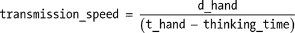

同样地，对于脚部，我们可以使用以下公式：

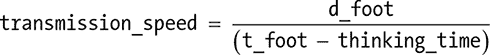

这意味着我们还知道以下内容：

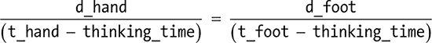

现在我们可以使用代数重新排列公式，以便计算思维时间和传输速度。我们可以将两边都乘以以下内容：

(t_hand – thinking_time)

然后得到这个结果：

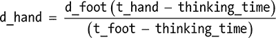

如果我们将两边都乘以以下内容：

(t_foot – thinking_time)

我们得到了这个结果：

d_hand (t_foot – thinking_time) = d_foot (t_hand – thinking_time)

将括号内的内容相乘，得到以下结果：

d_hand × t_foot – d_hand × thinking_time

= d_foot × t_hand – d_foot × thinking_time

所以：

d_hand × t_foot – d_foot × t_hand

= d_hand × thinking_time – d_foot × thinking_time

d_hand × t_foot – d_foot × t_hand

= thinking_time (d_hand – d_foot)

最后，我们可以通过以下公式计算思维时间：

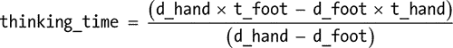

现在我们得到了思维时间，我们可以用它来计算信息沿神经传播的速度，像这样：

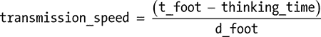

这个结果的单位是厘米/毫秒。要将其转换为米/秒，我们需要乘以 1000 并除以 100。换句话说，乘以 10，就得到了传输速度。

### 项目：谎言探测器

*难度：中等*

疯狂科学家不喜欢惊喜派对，他们想弄清楚他们的实验室助手是否为他们的生日准备了派对。他们需要使用谎言探测器（图 8-3）来查明这一点！

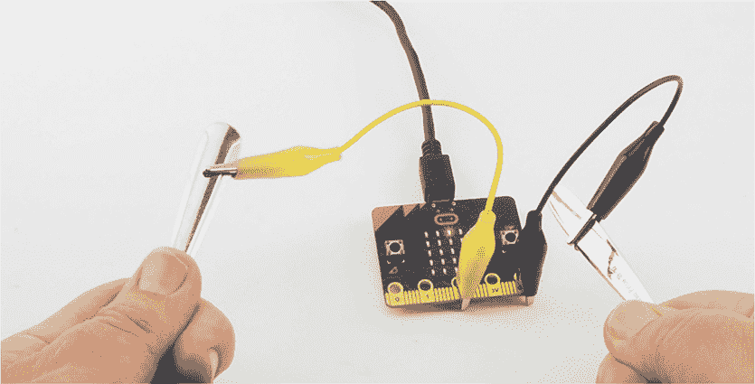

*图 8-3：谎言探测器*

本项目测量*皮肤电阻（GSR）*，即皮肤对电流流动的电阻。为了测量 GSR，我们将使用 micro:bit 和一对金属勺子。

#### 你需要的东西

对于本项目，你需要以下内容：

**Micro:bit**

**2 × 鳄鱼夹电缆** 用于将勺子连接到 micro:bit

**2 × 勺子**

你将使用勺子与手掌接触。鳄鱼夹将连接到勺子的把手，可能会刮伤勺子，因此不要使用你最好的勺子！

#### 构造

1.  访问*[`github.com/simonmonk/mbms/`](https://github.com/simonmonk/mbms/)*，进入本书的代码库并点击**Lie Detector**链接。程序打开后，点击**Download**，然后将 hex 文件复制到你的 micro:bit 上。如果遇到问题，请返回第一章，复习如何将程序加载到 micro:bit 上。

    如果你更喜欢使用 Python，那么从同一网站下载代码。有关如何下载并使用书中示例的说明，请参见第 34 页中的“下载代码”部分。此实验的 Python 文件是*ch_08_Lie_Detector.py*。

1.  使用一个鳄鱼夹将其中一个勺子的把手连接到针脚 2，另一个鳄鱼夹将另一个勺子连接到 GND，如图 8-3 所示。

要使用测谎仪，你需要两个人：一个操作员提出棘手问题，另一个是受试者回答问题。受试者需要握住勺子，使弯曲面完全接触到他们的手掌。

当操作员按下按钮 A 时，micro:bit 显示屏上的点应该移到 LED 的中心。如果受试者出汗导致皮肤电阻下降，点会向屏幕上方移动。如果皮肤电阻上升，点会向下移动。

如果点在屏幕的顶部或底部似乎被卡住，操作员需要按下按钮 A 以将显示内容居中。即使没有遇到任何难题，读数也会逐渐漂移。

提问后，操作员应该等待三到四秒钟，然后再查看显示屏上的读数。

#### 代码

本项目包含了 Blocks 和 Python 代码。完整的解释位于 Blocks 代码之后，因此如果你现在跳到 Python 代码，确保稍后回来看解释。

##### Blocks 代码

以下是本项目的 Blocks 代码。

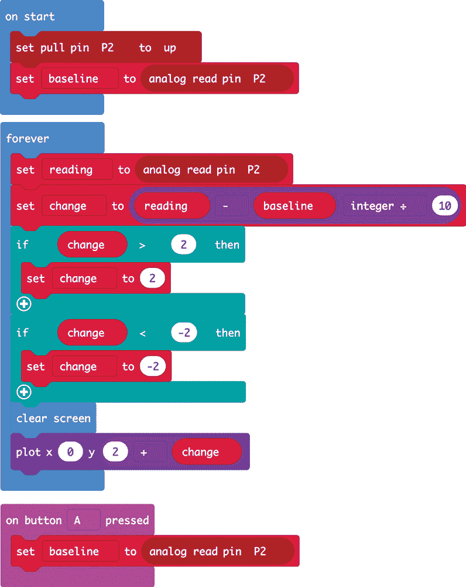

在`on start`块中，我们放置`set pull pin`块，这将启用内置的 12kΩ上拉电阻。（默认情况下，上拉电阻是禁用的。）

同样在`on start`块中，我们从针脚 2 读取数据，针脚 2 连接到其中一个勺子，并将结果存储在`baseline`变量中。程序将把任何新的读数与这个基线值进行比较，看看受试者的皮肤电阻发生了多少变化。

然后，我们使用`forever`循环从针脚 2 获取新的模拟读数，该读数代表受试者在回答你提出的问题后的皮肤电阻反应。该循环将`baseline`读数从新的`reading`读数中减去，并将结果除以 10，以便大约减少到合适的程度。

它使用这个数字来确定应该点亮哪一个 LED 灯。这个数字必须在-2 到 2 的范围内，否则会发生错误。完成这一步后（使用几个`if`语句），显示屏被清空，并且在`2 + change`这一行的中间列的 LED 灯被点亮，使用的是`plot`块。

按下 A 按钮会重置`baseline`。

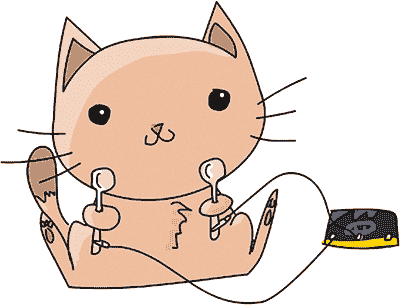

##### MicroPython 代码

这里显示的是 MicroPython 版本的代码：

from microbit import *

pin2.set_pull(pin2.PULL_UP)

baseline = pin2.read_analog()

while True:

if button_a.was_pressed():

baseline = pin2.read_analog()

reading = pin2.read_analog()

change = int((reading - baseline) / 10)

if (change > 2):

change = 2

if (change < -2):

change = -2

display.clear()

display.set_pixel(2, 2 + change, 9)

这与 Blocks 代码的工作方式非常相似，只是有一些不同之处。在这里，我们使用`int`函数将读数变化值转换为整数。

然后我们使用`set_pixel`方法告诉 micro:bit 显示屏点亮哪个 LED。这种方法不同于`plot`块，因为它不仅要求提供 x 和 y 坐标，还需要你提供一个 0 到 9 之间的亮度级别。我们选择 9，以使其尽可能明亮和显眼。

#### 工作原理：通过汗水、电压和电阻检测谎言

皮肤电阻是多通道测谎仪常用的测量指标，这种测谎仪在电影中经常出现。

如果你开始出汗或脸红，就像在压力下那样，皮肤对电流的电阻会发生变化。但测试皮肤电阻反应（GSR）并不总是有效。你提问的方式以及提问的问题可能会影响一个人的反应，或者让他们感到紧张，从而导致 GSR 在不同的人之间差异较大。相反，那些与自己情感较为疏离的人可以学会如何躲避测谎仪。但对于疯狂科学家的调查，探讨可能的惊喜派对，这个测谎仪恰到好处。

该项目将 GSR 的读数转换为电压。大多数金属的电阻较低，因为金属导电性好，而塑料等材料的电阻较高，因为电流通常难以通过塑料流动。我们使用 micro:bit 的引脚来测量电阻，它作为一个模拟输入工作（参见第一章），并且通过两个电阻器组成一个叫做*电压分压器*的电路（见图 8-4）。

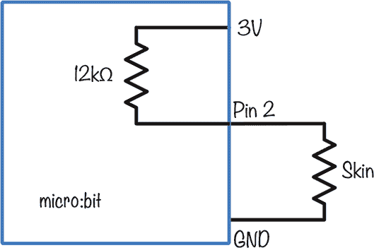

*图 8-4：电压分压器的原理图*

电阻的单位是*欧姆*（Ω），我们通常将 1000Ω简写为 1kΩ。在图 8-4 中，连接到引脚 2 的 12kΩ电阻是 micro:bit 处理器内置的电阻。这个电阻将引脚 2 的电压拉向 3V（可以将这个电阻看作是弹簧）；如果你没有握住勺子，这个拉力将是唯一作用在引脚上的力，导致引脚读取到 1023 的最大值，即 3V。

然而，一旦受试者抓住勺子，另一个电阻——受试者的皮肤——便开始发挥作用。这会抵消 12kΩ电阻，通过将第 2 引脚的电压拉回到 0V。如果你的皮肤电阻正好是 12kΩ，那么两个电阻会平等拉动，第 2 引脚的电压将是 1.5V。

如果受试者出汗，他们的皮肤电阻下降，导致电压降低。相反，当他们恢复时，皮肤电阻增加，使得 12kΩ的电阻拉高电压。

### 总结

在这一章中，我们对人类神经系统进行了几项实验。我们完成的实验和项目可能科学严谨性不足，但希望你在过程中有所收获。

在下一章，我们将对环境进行测量。具体来说，我们将研究光线和温度，它们对疯狂科学家的舒适度至关重要。
