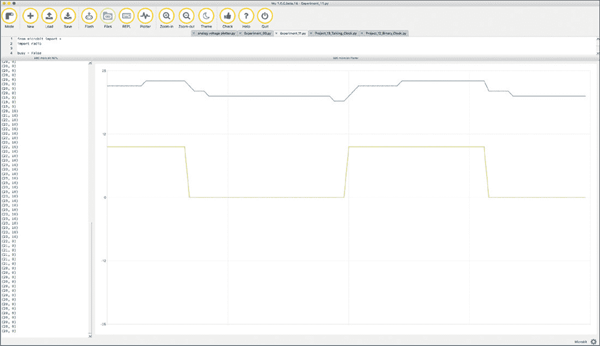
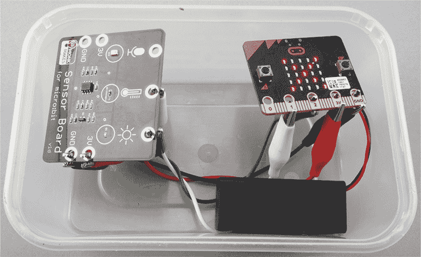
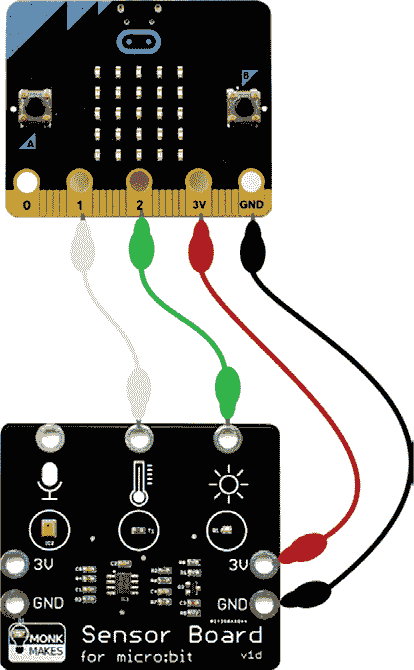
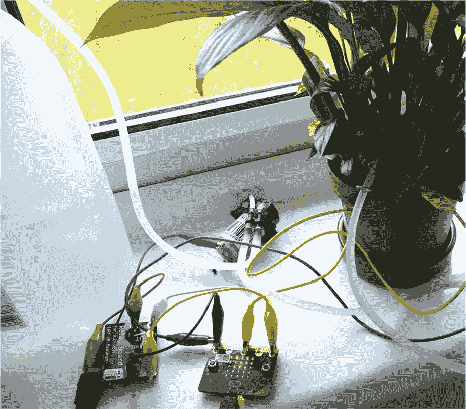
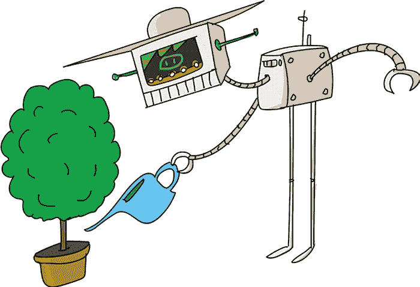
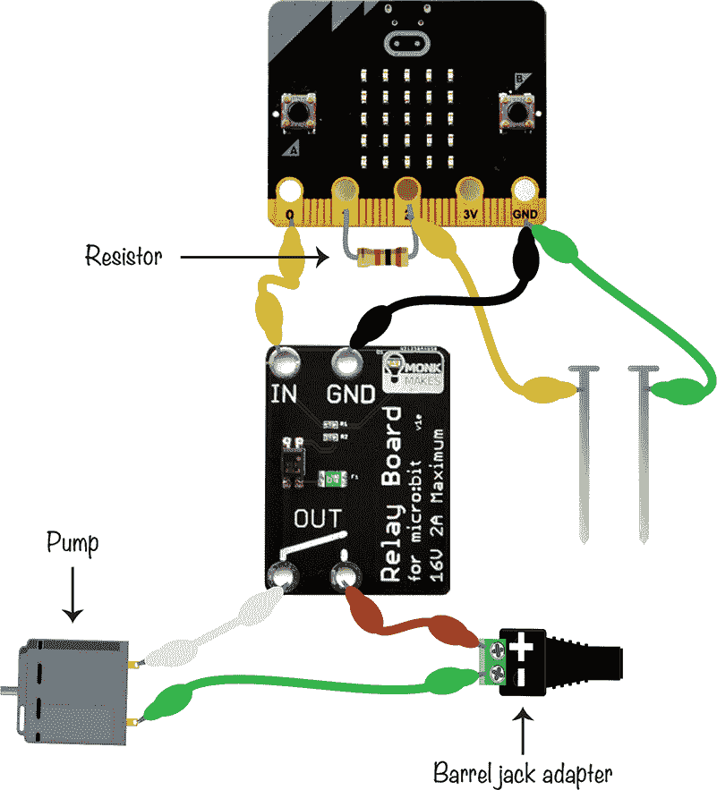
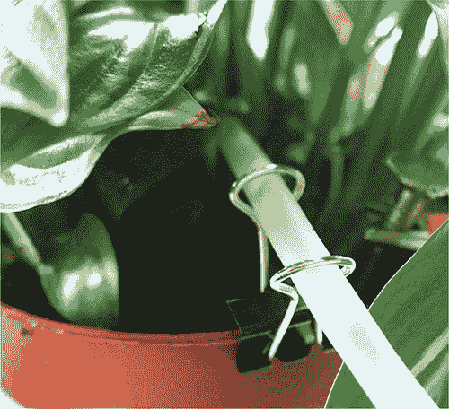
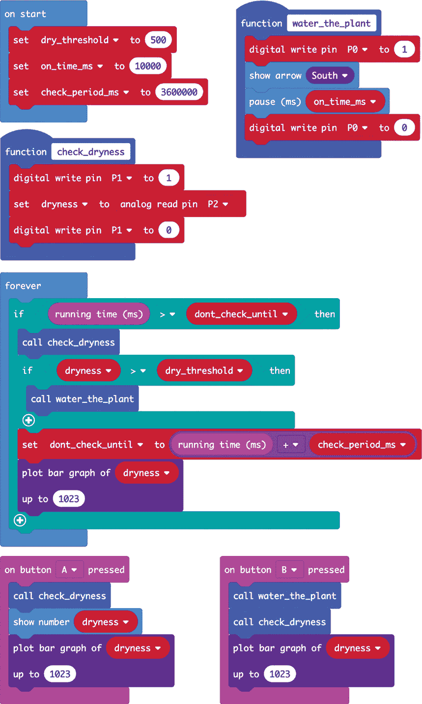
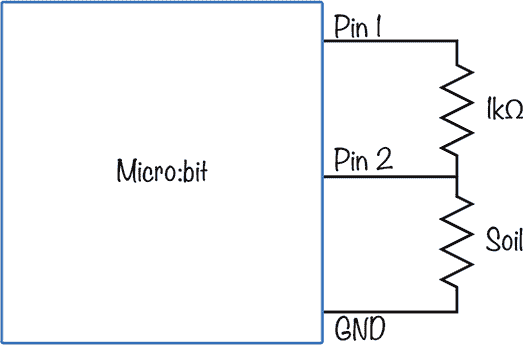

## 第九章：**环境疯狂**

疯狂科学家喜欢测量各种事物。在本章中，我们将跟随科学家的脚步来测量温度。我们将设计一个温度和光照记录仪，提供有价值的环境实验数据。接着，我们将创建一个植物浇水项目，利用一个小型泵在植物土壤开始变干时自动浇水。

### 实验 11：测量温度

*难度：简单*

疯狂科学家除了实验室外套外并没有其他衣物，并且在秘密实验室的隔热预算上也没怎么花钱，于是决定建造一个定制的加热系统。为了实现这一目标，他们需要知道实验室每个房间的确切温度。不幸的是，他们很快发现，使用 micro:bit 测得的温度并不够精确。

micro:bit 在 Blocks 和 MicroPython 代码中都有一个名为`temperature`的函数，可以返回以摄氏度为单位的温度读数。然而，传感器本身是内置在 micro:bit 的处理器中的，因此实际上它报告的是 micro:bit 的*芯片*的温度，而不是 micro:bit 周围环境的温度。

在大约 20 摄氏度（68 华氏度）的正常室温下，如果 micro:bit 没有运行太长时间，传感器会提供相当准确的读数。然而，如果 micro:bit 的处理器已经忙碌并开始升温，我们无法确保温度读数是否准确。

在这个实验中，你将研究忙碌的 micro:bit 与空闲的 micro:bit 之间温度读数的差异。

#### 你需要的材料

要进行这个实验，你只需要两样东西：

**Micro:bit**

**USB 数据线**

你可能还需要一个单独的温度计来核对你的读数。你需要的唯一其他物品是一些耐心，因为你需要让程序运行半个小时才能得到准确的读数。

#### 构建

1.  这个项目使用了 Mu 的绘图工具，需要 Python 支持，所以没有使用 Blocks 代码。你可以在*[`github.com/simonmonk/mbms/`](https://github.com/simonmonk/mbms/)*找到代码。这个实验的 Python 文件是 *Experiment_11.py*。将程序上传到你的 micro:bit 上。此代码将每 20 秒读取一次温度。它还会每 10 分钟启动一次 micro:bit 活动，然后停顿 10 分钟，让你观察 micro:bit 忙碌与空闲状态下的温度差异。

1.  打开 Mu 的 REPL 和 Plotter 视图，并按下 micro:bit 上的**重置**按钮以开始读取过程。每 20 秒，Plotter 和 REPL 中都会记录新的温度读数以及 micro:bit 是否处于忙碌或空闲状态。micro:bit 的忙碌/空闲状态每 10 分钟切换一次。图 9-1 显示了记录 40 分钟数据的结果。

*图 9-1：绘制温度读数和处理器活动*

蓝线显示由`temperature`函数报告的温度，绿线表示 micro:bit 是否处于忙碌或空闲状态。当处于忙碌状态时，micro:bit 开启显示屏和无线电接口，并反复显示消息`Busy`。

如图 9-1 所示，当 micro:bit 处于忙碌模式时，报告的温度上升了约 3 摄氏度。当它回到空闲模式时，温度下降。需要注意的是，房间中的温度（通过单独的温度计测量）在整个实验过程中保持在 20.0 摄氏度。

#### 代码

该实验的 MicroPython 代码需要完成两件事情：每 10 分钟翻转一次 micro:bit 的忙碌状态（保存在变量`busy`中），并且每 20 秒报告一次温度。

##### 设置变量

我们的代码使用`last_busy_flip`和`last_log_time`变量来记录这两件事（翻转和记录）最后一次发生的时间：

busy = False

last_busy_flip = 0

busy_period = 600000

last_log_time = 0

log_period = 20000

变量`busy_period`指定了每次在忙碌和空闲状态之间翻转的时间（以毫秒为单位）；600,000 毫秒等于 600 秒，也就是 10 分钟。变量`log_period`保存温度报告之间的时间（以毫秒为单位）；20,000 毫秒等于 20 秒。代码`busy = False`表示 micro:bit 一开始是处于空闲状态。

##### 使其处于忙碌状态

如果 micro:bit 处于忙碌模式，显示屏和无线电都会开启，并显示`Busy`消息。否则，显示屏和无线电会关闭。

while True:

if busy:

➊ display.on()

➋ radio.on()

display.show("Busy")

else:

display.off()

radio.off()

now = running_time()

if now > last_busy_flip + busy_period:

busy = not busy

last_busy_flip = now

now = running_time()

if now > last_log_time + log_period:

print((temperature(), busy * 10))

last_log_time = now

在`while`循环中，我们规定如果`busy`变量为`True`，micro:bit 应该开启显示屏➊和无线电➋。否则，它们应该关闭。

然后，我们有两个测试用来检查是否该翻转忙碌状态或记录数据到 REPL 和 Plotter：代码检查当前运行时间与`busy_period`和`log_period`变量中的值。

为了方便在与温度数据相同的图表上看到处理器是否处于忙碌状态（见图 9-1），我们将`busy`的布尔值`True`或`False`乘以 10。Python 允许我们这样做！而不是报告错误，Python 将`False`解释为 0，将`True`解释为 1。由于 Python 将布尔值视为数字，它允许我们进行乘法运算。于是，图表上的值就不是 0 或 1，而是 0 或 10。

#### 工作原理：为什么处理器会发热？

像 micro:bit 使用的处理器芯片，包含数十万甚至数百万个 *晶体管*。这些晶体管是电子开关，可以处于开或关的状态（用二进制的 1 和 0 表示）。晶体管在特定状态下使用极少的电流（无论是开还是关），但是需要少量额外的能量来改变状态。这就是为什么在进行处理器密集型操作时，电脑风扇会加速运转——它们正在移除由于大量开关操作而产生的多余热量。

一个忙碌的处理器会更热。但其他因素也会影响处理器的温度。在这个实验中，显示器使用的 LED 会产生一些热量，打开和关闭无线电时也会产生热量。因此，尽管我们定义的 `忙碌` 有点误导，因为它包括了打开和关闭无线电以及显示器，但微型计算机的温度读数仍然受到 micro:bit 当前操作的影响。

### 项目：温度与光照记录仪

*难度：中等*

作为一个彻底的完美主义者和不可救药的植物学家，疯狂科学家希望找到一种方法来测量实验室中所有植物的理想位置。因此，温度与光照记录仪应运而生。

在实验 7 中，我们将加速度读数写入文件以供后续分析。在那种情况下，我们希望立即进行读取。而在这里，我们希望在一段时间内记录数值，例如一天的时间。

图 9-2 显示了完整的项目。正如你所看到的，我们已将其制作成透明的食品容器，以保护它免受外界环境的影响，以防我们想要在户外使用它。

*图 9-2：温度与光照记录仪*

你可以使用这个记录仪对你的院子进行调查，并确定不同植物的最佳生长位置。

#### 你需要的材料

在这个项目中，你将需要以下物品：

**Micro:bit**

**Monk Makes 传感器适用于 micro:bit** 其他温度与光照传感器也可以使用。

**4 × 鳄鱼夹连接线**

**AAA 电池包**

**透明塑料食品容器** 如果你打算在户外使用该项目，这是必需的。容器应足够大，以容纳项目设备，包括电池包。

#### 构建

1.  该项目使用了 micro:bit 的本地文件系统，而该文件系统在 Blocks 代码中尚不可用。因此，这个项目只能使用 Python 完成。代码可以在 *[`github.com/simonmonk/mbms/`](https://github.com/simonmonk/mbms/)* 中找到。这个实验的 Python 文件是 *ch_09_Logger.py*。将程序刷入你的 micro:bit 中。

1.  如图 9-3 所示，将 micro:bit 连接到传感器板。

    *图 9-3：将 micro:bit 连接到 Monk Makes 传感器*

1.  将所有物品放入食品容器中，确保传感器和 micro:bit 在顶部，靠近盖子。从电路板背面连接鳄鱼夹将有所帮助。

1.  打开电池包。当你准备开始记录时，按下按钮**A**，然后盖上容器的盖子。显示屏将切换为显示一个点。

1.  日志器可以保存大约 2,000 条读取数据，因此以每秒一个样本的速率，它可以运行 33 小时，直到内存耗尽。这大约是 AAA 电池组的使用时长。

    当你准备停止读取时，再次按下按钮**A**。然后，你可以将 micro:bit 连接到计算机，并使用 Mu 的 *Files* 功能将文件 *data.txt* 传输到计算机，就像你在第五章的实验 7 中做的那样。

1.  为了理解数据，你可能想将其导入到电子表格中，并绘制类似于图 9-4 中的图表。请参考第五章中的实验 7，了解如何将 *data.txt* 文件中的数据导入到 Google Sheets 中。

*图 9-4：温度与光线图表*

在图 9-4 中，光线图中的线急剧下降表示夜幕降临。

#### 代码

对于这个项目，我们需要导入 os 库，它将用于删除可能已经存在于 micro:bit 上的任何数据文件。我们这么做是为了为新的读取数据腾出空间。我们还需要导入 `log` 来自数学库，用于编写计算温度的代码。*Log*（或 *对数*）是一个数学概念，在 Steinhart-Hart 方程中用来将热敏电阻的电阻值转换为温度。如果你对数学感兴趣，可以在这里阅读更多关于对数的内容：*[`www.mathsisfun.com/algebra/logarithms.html`](https://www.mathsisfun.com/algebra/logarithms.html)*。

##### 设置变量

这个项目的代码会等待按钮 A 被按下，然后依次记录温度和光照数据。两个数据都将写入文件中，以便在日志记录完成后，可以将它们传输到计算机。

sample_period = 60000

filename = 'data.txt'

temp_pin = pin1

light_pin = pin2

last_sample_time = 0

recording = False

display.show(Image.NO)

我们将变量 `sample_period` 设置为 60000 毫秒，或 1 分钟。这个周期告诉 micro:bit 每分钟记录一次数据。默认情况下，记录的数据将保存在名为 *data.txt* 的文件中。你可以通过更改 `filename` 变量的值来更改文件名。

我们告诉 micro:bit 哪两个引脚连接到传感器板的温度和光线输出，分别存储在 `temp_pin` 和 `light_pin` 变量中。在 `last_sample_time` 变量中，我们记录了上次读取环境数据的时间。

我们使用变量`recording`来跟踪项目是否正在录制。每次按下按钮 A 时，该变量在`True`和`False`之间切换。

##### 读取温度

我们创建了`read_c`函数来读取温度。这涉及到相当复杂的数学运算。

def read_c():

r0 = 100000.0

r2 = 100000.0

b = 4250.0

v33 = 3.3 # 实际结果与此值无关

V = temp_pin.read_analog() * v33 / 1023.0

R = r2 * (v33 - V) / V

t0 = 273.15 # 0 摄氏度的开尔文温度

t25 = t0 + 25.0 # 25 摄氏度的开尔文温度

# 斯坦哈特-哈特方程（可以 Google 查找）

inv_T = 1/t25 + 1/b * log(R/r0)

T = (1/inv_T - t0)

返回 round(T, 1)

我们不会详细讲解这些数学公式，但它们在这里，方便你查阅。

该函数测量`temp_pin`（引脚 1）上的电压，并使用该电压计算摄氏度的温度。有关如何工作的更多信息，请参阅第 211 页中的“如何工作：传感器”部分。

如果你想要华氏温度，可以使用`read_f`函数，它会调用`read_c`并将温度转换为华氏度：

def read_f(self):

return read_c() * 9/5 + 32

##### 读取光照水平

温度读数以摄氏度或华氏度为单位。然而，光照水平没有以特定的单位表示。光照读数只是来自引脚 2 的直接模拟读数。实际上，我们定义了自己的单位。如果你愿意，你可以给它们起个名字，也许叫*光度*？

使用标准的勒克斯单位（lux）来测量光强对于这种传感器来说很困难。但如果你有一个经过校准的勒克斯计，你可以进行实验，比较在不同照明强度下的勒克斯和*光度*。

##### while 循环

主`while`循环（如果你在 Mu 中跟着代码走的话，在代码的最后）检查按钮 A 是否被按下，每次按钮按下时，`recording`会在`True`和`False`之间切换。当录制开始时，会显示一个点，并且我们用`os.remove`删除现有的数据文件。`remove`命令被包含在`try: except:`的 Python 结构中。这确保如果发生错误（可能是因为数据文件不存在而无法删除），错误会被忽略，不会使程序崩溃。删除旧文件后，新的文件会以`w`模式打开以进行写入。

当按钮 A 被再次按下时，`NO` 图像会显示，并且文件关闭。

在主`while`循环中，还有一个`if`块，只要`recording`为`True`并且自上次采样时间以来已经经过足够的时间，它就会将来自光照和温度传感器的读数写入文件。

while True:

如果按钮 A 被按下：

recording = not recording

如果录制中：

display.show(".")

try:

os.remove(filename)

except:

pass

fs = open(filename, 'w')

否则：

display.show(Image.NO)

fs.close()

now = running_time()

如果当前时间 > 上次采样时间 + 采样周期：

last_sample_time = now

如果录制中：

temp = read_c()

light = light_pin.read_analog()

fs.write(str(temp) + "," + str(light))

fs.write('\n')

#### 原理：传感器

*热敏电阻*是一种特殊类型的电阻（见第八章中的测谎仪项目），其电阻会随着温度的变化而变化。在 micro:bit 的 Monk Makes 传感器中使用的热敏电阻是*NTC（负温度系数）*类型。*负*部分意味着当温度升高时，电阻会减小。我们使用电阻来测量温度。

我们的热敏电阻传感器通过电阻来测量温度。然而，micro:bit 无法直接测量电阻。相反，电阻必须首先转换为电压，然后可以通过作为模拟输入的 micro:bit 引脚读取。为了做到这一点，我们需要使用电压分压器，正如在第八章的测谎仪项目中所做的那样。不过这次提供可变电阻的将是热敏电阻，而不是人的皮肤（见图 9-5）。请注意，Monk Makes 传感器板上内置了 100kΩ的电阻。

*图 9-5：使用热敏电阻测量温度的电路图*

热敏电阻的电阻值不会在每次电阻变化几个欧姆时就发生变化，表示温度变化了一度。正如你在之前的代码中看到的，计算热敏电阻电阻的公式很复杂，涉及到对数运算。

当你购买热敏电阻时，它会指定两个参数：

  热敏电阻在 25 摄氏度时的电阻值（在我们的代码中称为`r0`，对于传感器板而言，其值为 100kΩ）

  一个常数叫做`beta`，或者有时只是`B`，它对于不同的热敏电阻是不同的（在我们的代码中，它叫做`b`。对于传感器板上的热敏电阻，`b`是 4250。`beta`的值通常会在热敏电阻的数据表中注明。）

你可以在代码中看到如何进行计算。如果你想了解更多关于这个公式的信息，可以在网上搜索“Steinhart-Hart 方程”。

由于引脚 1 的电压取决于热敏电阻与固定电阻的电阻比，因此它与供电电压无关。这样也好，因为 micro:bit 的 3V 连接口电压可以从 3.3V 到大约 2V 不等，取决于你如何为 micro:bit 供电以及电池的电量。这就是为什么在`read_c`函数中你会看到注释解释`v33`（3.3V）对结果没有影响。实际上，它在数学计算中会被抵消掉。它的存在只是为了让数学计算稍微容易理解一点。

### 项目：自动植物浇水器

*难度：难*

因为忙于参加会议，常常不能待在秘密实验室，疯狂科学家发明了这款自动植物浇水器。该项目通过监测土壤的电阻来判断土壤的湿润程度。如果土壤过干，它会启动水泵。按下按钮 A 可以读取土壤的干湿程度，按下按钮 B 则会进行测试，运行水泵 10 秒钟。

*图 9-6：自动植物浇水器项目*

#### 你需要的物品

对于这个项目，你将需要以下物品。更多关于这些物品的获取信息，请参见附录。

**Micro:bit**

**micro:bit 继电器板** 用于开关水泵（你也可以使用像我们在第六章的漫游车项目中使用的 Kitroniks 板那样的电机控制器。）

**12V 水族箱计量泵** 这些泵虽然较慢，但非常可靠。

**管道和连接件** 用于将水从水库传输到植物盆

**大塑料瓶** 用作植物的水库

**12V 水泵电源** 12V，1 安培或更高

**micro:bit 的 USB 电源或 Monk Makes Power for micro:bit 及交流适配器** 这是一个长期项目，所以你不希望仅通过电池供电。关于长期 micro:bit 电源选项，请参见附录。

**1kΩ电阻**

**母型直流桶插座到螺丝端子适配器** 用于将继电器和电池连接到水泵的电源

**7 × 鳄鱼夹电缆** 用于将钉子连接到 micro:bit

**回折式文件夹夹子** 用来固定浇水管

**2 × 5 英寸钉子** 用作植物盆中的电极（注意，6 英寸钉子也完全适用。镀锌（锌涂层）钉子最佳，因为它们不会生锈。）

**盆栽植物**

你需要的水泵是*蠕动泵*，有时也叫*定量泵*。你可以在 eBay 上花几美元买到一个。这些泵通常配有短的进出口管，你需要延长这些管道，使其可以从水库连接到花盆。管道的直径通常是 4 毫米，这是园艺灌溉系统中常见的尺寸。你可以在 eBay、五金店、热带鱼店或园艺中心找到这种管道和连接件。

你需要更长的鳄鱼夹电缆来将 micro:bit 连接到钉子上。一个合适的长度大约为 1 英尺（30 厘米）。

水库可以是任何能容纳足够水量的物品（旧的牛奶容器就可以）。

#### 构建

在构建这个项目时，你需要特别小心，因为它既包含电子组件，又包含机械组件。而且，它还会泵送水，因此如果你没有正确连接管道，可能会在你的秘密实验室里造成一场大混乱！

图 9-7 展示了电子设备的连接方式，帮助你了解在按步骤进行操作时要达到的效果。

*图 9-7：自动植物浇水项目的接线图*

1.  打开*[`github.com/simonmonk/mbms/`](https://github.com/simonmonk/mbms/)*，点击**Plant Waterer**的链接。点击**下载**，然后将 hex 文件复制到你的 micro:bit 上。如果你卡住了，可以回到第一章，那里详细解释了将程序传输到 micro:bit 的过程。Python 版本的代码在*ch_09_Plant_Waterer.py*中。

1.  将 1kΩ电阻的引脚绕在 micro:bit 的 1 号和 2 号引脚上。

1.  参照图 9-7，将鳄鱼夹接到 micro:bit、继电器板、桶形插座和水泵上。暂时不要将黄色和绿色电缆连接到钉子上，也不要连接水管到水泵。为了将鳄鱼夹连接到 DC 桶形插座适配器的螺丝端子上，可以用螺丝刀将螺丝端子完全打开。如果你的鳄鱼夹钳口太大，无法放入螺丝端子孔，你可以将直的回形针插入螺丝端子中，然后将鳄鱼夹夹在回形针上。

1.  将 12V 电源适配器插入桶形插座适配器，然后按下你的 micro:bit 上的**B**按钮。你应该能听到水泵运转 10 秒钟后停止。如果没有，请仔细检查接线。

1.  将钉子插入植物盆土中，间隔约 3 或 4 英寸（8 到 10 厘米）。留出足够的钉子长度在土壤上方，以便你可以连接绿色和黄色的鳄鱼夹，如图 9-8 所示。

    *图 9-8：钉子在土壤中的位置*

1.  现在，按下你的 micro:bit 上的**A**按钮，屏幕上应显示一个滚动的数字。这是土壤干燥程度的衡量标准。土壤越干，数字越高。尝试给盆栽加点水，等几秒钟后，再按下**A**按钮。你应该看到数字减少。但不要让土壤变得太湿，因为那样土壤需要很长时间才能再次干燥，并且你将无法看到自动浇水器的工作效果。

    现在，你需要给植物提供适量的水。你可能需要请教一个有绿色拇指的人，他们了解你的特定植物。找出你的植物土壤应该保持的湿度后，继续少量添加水，直到土壤湿润为止。然后按下**A**按钮，记下数字。这就是你为自动植物浇水器设置的目标干燥度。

1.  现在我们准备开始该项目的湿润部分。首先，从水泵上量取适当长度的管道。你需要足够的管道，能够将一根管道从储水瓶顶部放入并伸到底部，另一根管道从水泵伸到植物花盆。在连接管道之前，你需要弄清楚水泵的哪个喷嘴是 *进水口*，哪个是 *出水口*。为了做到这一点，按下按钮 **B**，并用手指覆盖每根水泵管道。你会感觉到进水口正在吸你的指尖。记下每根管道的功能。

    使用管道连接器将这些管道段连接到水泵的短管上。

1.  将文件夹夹夹住花盆的侧面，并将管道穿过夹子的手柄，如 图 9-9 所示。

    *图 9-9：将管子固定到植物的花盆上*

1.  填满储水瓶，并将延长的进水管推入瓶中，直到底部。

1.  通过按下按钮 **B** 几次来测试水泵。如果水能顺利到达花盆且没有滴水或泄漏，水泵就几乎准备好了。如果没有，检查并调整连接点以密封泄漏。

1.  在你让植物浇水器进行繁琐工作的最后一步之前，调整 `dry_threshold` 的值。将 `dry_threshold` 设置为你在第 6 步记录的值，然后再次将程序闪存到你的 micro:bit 上。

#### 代码

这个项目的代码相当复杂。除了监控土壤的湿度外，它还需要处理按钮按下事件，并确保水泵不会过度运转而导致实验室被淹。

##### 块代码

这是该项目的块代码。

在 `on start` 块中，我们定义了三个变量：

`dry_threshold` 我们将第 6 步中的值放在这里。如果植物变得比这个值还干，它将会被浇水。

`on_time_ms` 这是水泵在浇水时运行的时间（单位为毫秒）。保持这个值较小（例如 10 秒），可以避免植物被过度浇水。这还可以防止可能导致小规模洪水的意外发生！

`check_period_ms` 水需要一些时间才能在花盆中扩散并均匀湿润土壤。这个变量设置了每次干燥检查之间的延迟。默认值为 3,600,000（即 1 小时的毫秒数）。

如果我们设置 `on_time_ms` 为 10，那么植物一天内能接收到的最大浇水时间是 24 × 10 秒，即 4 分钟。使用这种水泵，植物大约能获得一品脱（500 毫升）水量。这已经相当多了，但如果你的花盆特别大，你可能需要减少 `check_period_ms` 或增加 `on_time_ms`，以便让植物获得更多的水分。我们将在 第 222 页的“尝试的事情”部分进一步讨论这一点。

除了这三个变量外，我们还有两个函数，`check_dryness` 和 `water_the_plant`。`check_dryness` 函数会从 pin 2 读取新的土壤湿度值并更新 `干燥度` 变量。注意，这个函数还会在读取期间打开 pin 1。我们将在“工作原理：测量土壤湿度”中解释为什么要这样做，详见 第 222 页。

`water_the_plant` 函数会打开 pin 0 来激活继电器，打开泵并根据 `on_time_ms` 中指定的时间持续工作，并在 micro:bit 上显示向下箭头，表示正在浇水（有点像下雨）。

使用 `forever` 循环，首先检查自上次检查以来是否已经经过足够的时间（默认是 1 小时）。如果时间足够，循环会调用 `check_dryness` 并将其读数与 `干阈值` 进行比较。如果土壤过于干燥，则调用 `water_the_plant`。

检查完成后，`dont_water_until` 变量被设置为当前时间加上 `check_period_ms`，以安排下一次检查。然后，`dryness` 通过 `plot bar graph of` 块在显示器上显示。显示器上的 LED 层级越高，表示土壤越干燥，意味着需要更多的水。

接下来是检查按钮 A 是否被按下并做出相应反应的代码。此代码会调用 `check_dryness`，然后显示其值，再次显示条形图。按钮 B 的处理程序会调用 `water_the_plant`，然后显示 `干燥度` 水平。

##### MicroPython 代码

下面是代码的 MicroPython 版本：

from microbit import *

干燥度 = 0

干阈值 = 500

on_time_ms = 10000

check_period_ms = 3600000

dont_check_until = 0

def water_the_plant():

pin0.write_digital(1)

display.show(Image.ARROW_S)

sleep(on_time_ms)

pin0.write_digital(0)

def check_dryness():

global 干燥度

pin1.write_digital(1)

干燥度 = pin2.read_analog()

pin1.write_digital(1)

def bargraph(a):

display.clear()

for y in range(0, 5):

如果 a > y:

for x in range(0, 5):

display.set_pixel(x, 4-y, 9)

while True:

如果 button_a.被按下():

check_dryness()

display.scroll(str(干燥度))

bargraph(干燥度 / 200)

如果 button_b.被按下():

water_the_plant()

check_dryness()

bargraph(干燥度 / 200)

如果 running_time() > dont_check_until:

check_dryness()

如果干燥度 > 干阈值:

water_the_plant()

dont_check_until = running_time() + check_period_ms

bargraph(干燥度 / 200)

由于 MicroPython 没有类似于 `plot bar graph of` 块的功能，我们使用 第二章中 Shout-o-meter 的 `bargraph` 函数来显示 `干燥度` 水平。

#### 尝试的事情

因为植物浇水器能够保持植物的湿度相对恒定，所以你可以通过查看水箱中剩余的水量来测量植物消耗的水量。

在你给水箱加水时，使用量杯并记录需要多少水才能填满它。一旦你知道你的植物每天通常需要多少水，就可以计算出水箱在需要补充之前能维持多长时间。这在你度假时保持植物存活将非常重要。

#### 工作原理：测量土壤湿度

含杂质的水（如土壤中的水）具有比空气低得多的电阻。换句话说，土壤越干，其电阻越高，土壤中的水分越多，电阻越低。通过测量两个钉子之间的电阻，我们可以测量土壤的干燥程度。

如果你回顾一下图 9-7，你会看到引脚 1 和引脚 2 之间有一个电阻器。为了更容易地理解电路图，图 9-10 展示了另一种电路图的可视化方式。

*图 9-10：测量土壤电阻的电路图*

注意，图 9-10 中的电路图几乎与图 8-4 中的电路图相同，后者出现在第 198 页，我们当时在测量皮肤电阻（而不是土壤电阻）时使用了该电路图，进行的是测谎仪项目。唯一的区别是，固定的 1kΩ电阻器的顶部不是永久连接到 3V，而是连接到引脚 1。当我们测量土壤湿度时，我们首先将引脚 1 设置为高电平（3V）进行测量，然后将引脚设置回 0V。

使用引脚 1 而不是 3V 连接的原因是我们希望允许电流仅间歇性地流经土壤。如果电阻器连接到 3V，电流将始终流经土壤，导致读数不准确，并加速钉子的腐蚀。这个过程被称为*电解作用*。通过仅在测量时短暂开启引脚 1，我们避免了这个问题。

### 总结

在本章中，我们探讨了如何测量温度，创建了一个温度和光照强度数据记录器，并制作了一个自动植物浇水器。在下一章中，我们将看到疯狂科学家如何使用 micro:bit 的内置无线电库。
