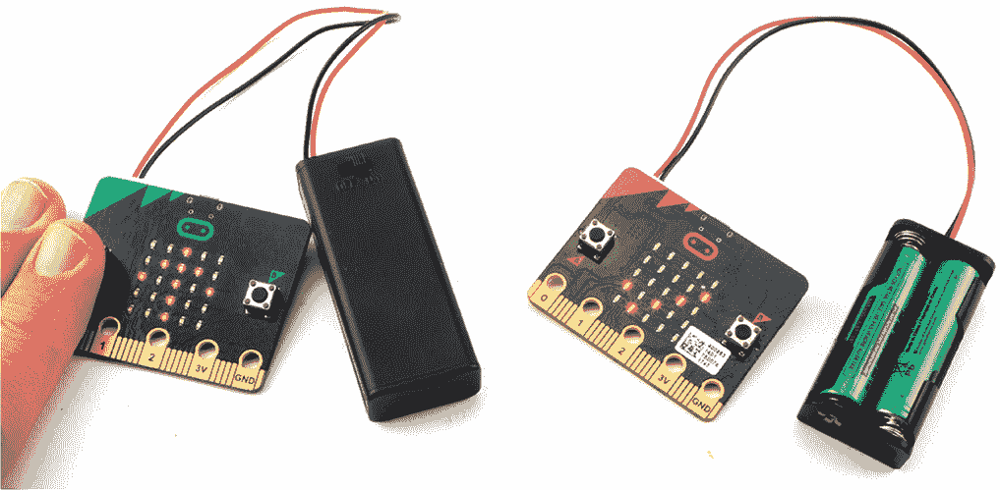
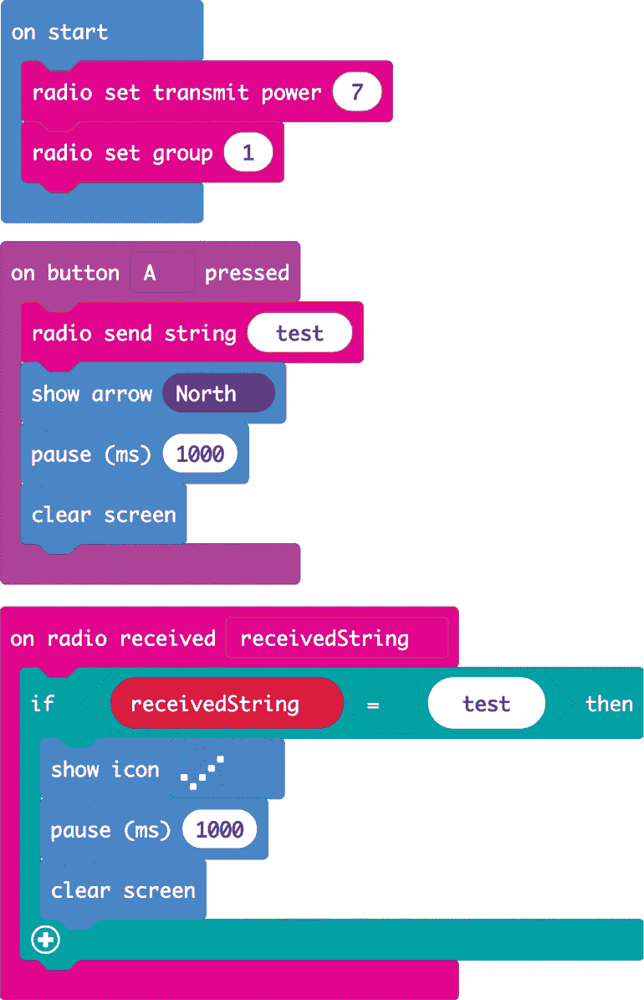
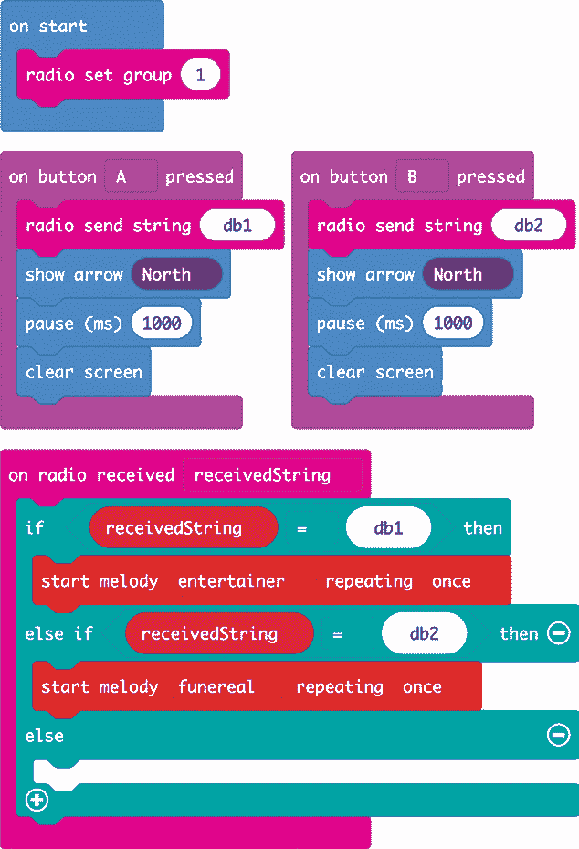
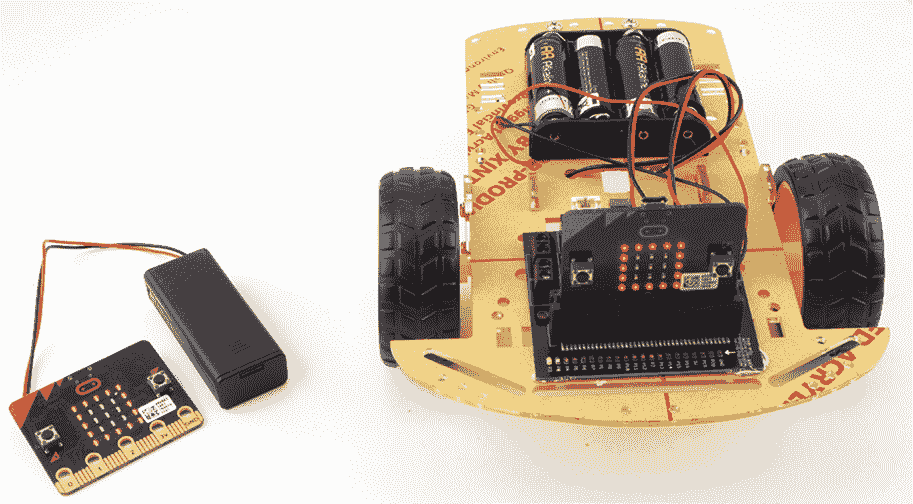
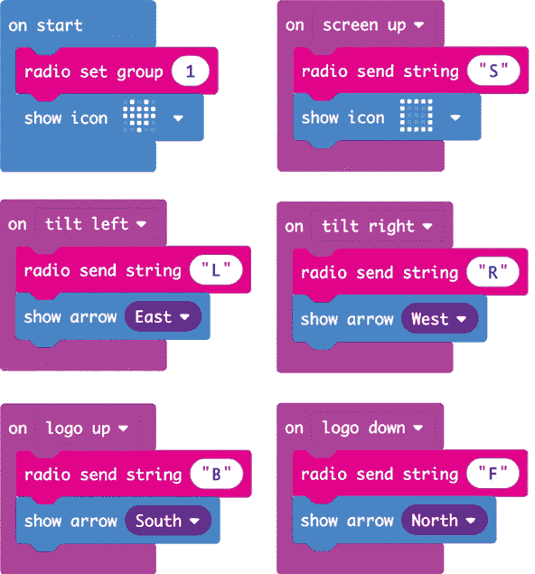
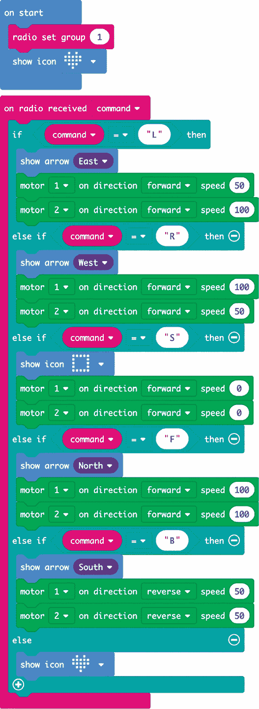
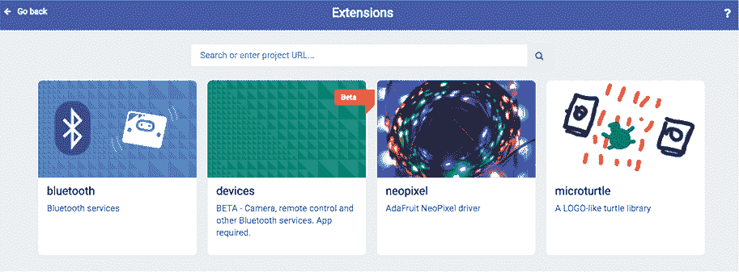

## 第十章：**无线电活动**

疯狂科学家交到了一个朋友。在一次疯狂科学大会上聊得很投机后，他们决定通过 micro:bit 继续交流，当然了，得用 micro:bit 来传递消息。micro:bit 内建了一个无线电发射器和接收器，统称为 *收发器*，可以与蓝牙设备通信。我们在 第六章的流动机器人项目中见过它的应用。

这个无线电收发器还可以用来与其他 micro:bit 通过特定的简单消息发送和接收协议进行通信。在本章中，我们将探讨 micro:bit 之间的通信，因此你需要有两块 micro:bit 或者一个拥有 micro:bit 的朋友。

### 实验 12：寻找无线电范围

*难度：简单*

疯狂科学家和他的朋友想知道，他们之间可以相隔多远，直到 micro:bit 通信器停止工作。

#### 所需材料

你将需要一对 micro:bit，每个都配有电池包。你还需要一个朋友来交流，以及一个开放的场地或其他你们可以互相走开的地方。

#### 构建

1.  访问 *[`github.com/simonmonk/mbms/`](https://github.com/simonmonk/mbms/)* 并点击 **实验 12：无线电范围** 的链接。将 hex 文件复制到两块 micro:bit 上。如果你遇到困难，第一章会详细解释如何将程序上传到 micro:bit。如果你想运行此实验的 MicroPython 版本，那个文件是 *Experiment_12.py*。

1.  给两块 micro:bit 都装上电池——你现在应该已经习惯了。

    在你们外出之前，按下其中一个设备上的 **A** 按钮，检查两块 micro:bit 是否都已准备好。一个上箭头应该出现在那个 micro:bit 上，另一个 micro:bit 上应该出现一个勾号。通过按下另一个 micro:bit 上的 **A** 按钮重复此测试（图 10-1）。

    

    *图 10-1：测试 micro:bit*

1.  找一个你和你的朋友有足够空间互相移动的地方。相距大约一米（或一码）站立，面对面。你应该持有一块 micro:bit，而你的朋友持有另一块。

1.  现在你或你的朋友按下 **A** 按钮在 micro:bit 上发送信号。然后挥手示意对方信号已发送（以防他们没有收到）。当他们的设备接收到信号时，他们应该挥手回应。假设信号已成功发送，彼此相隔几步并重复测试。

1.  到某个时刻，消息将无法接收！发送方应再次按下按钮并挥手。如果消息仍然没有收到，你们都知道应该更近一步。

1.  一旦你确定了无线电的范围，发送方通过预先安排的信号告知接收方向他们走去，并计算他们走了多少步。

1.  测量接收者每步的步长，并将其乘以他们走的步数。得出的值就是 micro:bit 无线电的视距范围。提示：为了获得较为准确的步长，可以让人走五步，使用一条长的卷尺测量总的行走距离，并将这个距离除以 5。

疯狂科学家测试了两台 micro:bit 的范围，发现其范围为 192 步。五步覆盖了 12 英尺（3.65 米），这意味着每步是 2.4 英尺。因此，范围为 192 × 2.4，约为 460 英尺（140 米）。

有人做过这个实验并报告了超过 1,100 英尺（350 米）的范围。请注意，如果你的身体或你朋友的身体位于两个 micro:bit 之间，范围将大大减少。

#### 代码

无论你是使用积木还是 MicroPython，范围测试的代码都相对简单。

##### 积木代码

这是该项目的积木代码。

你可以控制无线电使用的功率。`on start`积木使用`radio set transmit power`积木将功率设置为 7（最大值）——更高的功率意味着更大的范围。`set radio group`积木为无线电设置一个组。在这种情况下，我们使用组 1，这意味着所有设置为无线电组 1 的 micro:bit 都会接收传输。因此，如果你计划同时用多对 micro:bit 进行这个实验，那么每一对实验者应选择一个 0 到 255 之间的不同数字，并将无线电组设置为该数字。这样，不同的实验对就不会互相干扰。

我们使用`on button A pressed`积木与`radio send`积木来传输一个简单的`test`消息。这将闪烁`North`箭头图标，表示消息已经发送。

我们通过`on received block`处理传入的消息，并指定一个变量名来存放任何传入的消息。在这个例子中，每当 micro:bit 的无线电接收到消息时，它会将消息放入变量`receivedString`中。如果这个消息是`test`，那么屏幕上会短暂显示一个勾选图标。

##### MicroPython 代码

这是 MicroPython 版本的代码。请注意，MicroPython 中消息的发送方式与积木代码中的方式略有不同，因此用于此实验的两台 micro:bit 应该都使用积木或 MicroPython 编程。

from microbit import *

import radio

radio.on()

radio.config(power=7, group=1)

while True:

if button_a.was_pressed():

radio.send("test")

display.show(Image.ARROW_N)

sleep(1000)

display.clear()

message = radio.receive()

if message == 'test':

display.show(Image.YES)

sleep(1000)

display.clear()

要在 MicroPython 中设置无线电的功率和无线电组，我们需要使用 `radio.config` 方法。这个方法还允许你控制其他一些选项。你可以在 *[`bbcmicrobitmicropython.readthedocs.io/en/latest/radio.html`](https://bbcmicrobitmicropython.readthedocs.io/en/latest/radio.html)* 上阅读相关信息。

代码的 Blocks 版本完全包含在处理程序中。在 MicroPython 中，我们没有处理程序，因此我们必须不断检查按钮是否按下或是否有消息到达。我们通过在一个始终运行的 `while True` 循环中使用一组 `if` 语句来实现这一点。

首先，我们检查自上次检查以来按钮 A 是否被按下。如果按下了，我们发送 `test` 消息并显示北箭头。

为了检查我们是否接收到消息，我们不断调用 `message.receive`。当无线电接收到消息时，它会将消息放入队列。如果没有消息在等待，那么 `message.receive` 会返回 `None`。但是，如果有一个或多个消息，`message.receive` 会返回最旧的消息并将其从队列中移除。

我们只关心消息是否为`test`，所以我们检查这个条件。如果消息是`test`，我们让 micro:bit 显示“YES”图标一秒钟。

#### 工作原理：无线电信号

在户外，micro:bit 的无线电范围可能远大于室内，因为墙壁会阻碍信号的传播。

设备之间发送消息的系统被称为 *数据包无线电*，因为发送的是小的数据包。在这个项目的代码中，这些数据包是文本命令。

### 项目：无线门铃

*难度：中等*

被实验分散注意力，并且下属不听话的疯科学家经常错过快递的到达。为了解决这个问题，他们决定在实验室里建立一个扬声器，在门铃响起时播放声音。

我们将在第二章中构建的门铃项目基础上进行扩展。在这个版本的项目中，我们将使用两个 micro:bit：一个连接到扬声器，负责播放曲调，另一个作为门铃按钮（见图 10-2）。当第二个 micro:bit 上的一个按钮被按下时，它会向发声的 micro:bit 发送无线消息，告诉它播放曲调。由于 micro:bit 的无线电信号范围相当好，播放声音的 micro:bit 可以离门有一段距离，因此可以放得更靠近你。

*图 10-2：无线门铃项目*

#### 所需材料

对于这个项目，你需要以下材料：

**2 × Micro:bit** 一个作为门铃按钮，另一个播放曲调

**3 × 蝰蛇夹电缆** 用于将 micro:bit 连接到扬声器

**2 × USB 电源适配器或带电源开关的 3V 电池组** 用于为 micro:bit 提供电力

**扬声器** 为了播放门铃曲调，我推荐使用 Monk Makes Speaker for micro:bit。

**Blu-Tak 粘土或自粘垫片** 用来将其中一个 micro:bit 安装到门框上

#### 构建

1.  访问 *[`github.com/simonmonk/mbms/`](https://github.com/simonmonk/mbms/)* 并点击 **无线门铃** 的链接。将 hex 文件复制到两个 micro:bit 上。如果你需要复习如何将程序上传到 micro:bit，第一章 解释了整个过程。如果你想运行该实验的 MicroPython 版本，文件是 *ch_10_Wireless_Doorbell.py*。

1.  将扬声器连接到其中一个 micro:bit。你可以使用在 第二章 中音乐门铃项目中使用的扬声器（如果遇到困难，可以查看该项目的说明）。

1.  通过按下门铃 micro:bit 上的 **A** 按钮来测试扬声器。连接扬声器的 micro:bit 应立即开始播放曲调 “The Entertainer”。当它播放完毕后，尝试按下 **B** 按钮，应该会播放 “Funeral March”。

1.  使用 Blu-Tak 粘土或垫片将没有扬声器的 micro:bit 安装到门外。

#### 代码

两个版本的代码都依赖于通过无线电发送 `db1` 或 `db2` 消息，具体取决于按下哪个按钮。接收的 micro:bit 根据接收到的消息播放其中一首曲调。

与实验 12 类似，你不能混用 MicroPython 和 Blocks 版本的代码，因此请选择使用其中一个版本。

##### Blocks 代码

这是该项目的 Blocks 代码。

你会注意到这里的代码与实验 12 中的代码类似。如果按下 A 按钮，则发送字符串 `db1`（门铃 1），并显示一个北箭头，表示消息已经发送。当按下 B 按钮时，处理程序会发送消息 `db2`。

接收代码检查接收到的消息是 `db1` 还是 `db2`，并播放相应的曲调。

##### MicroPython 代码

这是 MicroPython 版本的代码：

from microbit import *

import radio, music

radio.on()

radio.config(power=7, group=1)

def send_message(message):

radio.send(message)

display.show(Image.ARROW_N)

sleep(1000)

display.clear()

while True:

if button_a.was_pressed():

send_message("db1")

if button_b.was_pressed():

send_message("db2")

message = radio.receive()

if message == 'db1':

music.play(music.ENTERTAINER)

elif message == 'db2':

music.play(music.FUNERAL)

在该版本的代码中，我们定义了函数 `send_message`，它通过无线电发送消息并显示北箭头一秒钟。

与实验 12 中的代码一样，我们使用 `while True` 循环持续检查按钮按下情况和接收到的消息。

#### 尝试的事项

尝试更换不同的曲调。或者你也可以尝试修改代码，使得在接收到 `db1` 或 `db2` 时，曲调播放多次。这样疯狂科学家更有可能听到它！

#### 工作原理：发送与接收

你可能会想，为什么我们对发送器和接收器使用相同的代码。如果我们按下带有扬声器的 micro:bit 上的 A 按钮，难道它不应该接收自己的消息并播放一首曲子吗？事实证明，当 micro:bit 的无线电在忙于传输时，它无法接收任何信息。此外，使用一个程序可以避免混淆哪个程序应放在哪个 micro:bit 上。

### 项目：Micro:bit 控制的漫游车

*难度：难*

没有一个可以提供指令的机器人，任何秘密实验室都不完整。在第六章中，我们制作了一个可以通过蓝牙用手机控制的机器人漫游车。这个项目使用了相同的基本漫游车，但不是通过手机和蓝牙来控制漫游车，而是使用第二个 micro:bit 和 micro:bit 自身的无线通信方式。你将通过倾斜控制的 micro:bit 来操控漫游车，向左、向右、前进或后退。图 10-3 展示了这个项目，你可以在* [`youtu.be/Qqr0fknoPQ4/`](https://youtu.be/Qqr0fknoPQ4/)* 上看到它的实际演示。

**图 10-3：一个 micro:bit 控制的漫游车**

#### 所需物品

对于这个项目，你将需要以下物品：

**2 × Micro:bit**

**Kitronik Motor Driver Board for micro:bit (V2)** 用于控制前进和后退的电机

**低成本机器人底盘套件** 包括两个齿轮电机和一个 4 × AA 电池盒

**4 × AA 电池**

**micro:bit 的 AAA 电池包** 为作为遥控器的 micro:bit 供电

**螺丝刀** 适用于底盘上的螺母和螺栓以及电机控制板上的螺丝端子

**焊接工具** 用于将导线连接到齿轮电机上

**Blu-Tack 粘土** 用于将电机控制板和 micro:bit 固定到底盘上

#### 构建

使用你在第六章中制作的漫游车，或者如果你还没有制作漫游车，可以回到该项目并按照步骤 1 到 4 进行制作。不过我们将使用不同的软件，因此一旦底盘完成，按照这里的说明操作。不要安装电池，否则你的漫游车可能会不小心自己驶出桌子！

1.  首先，我们将为项目中的漫游车部分安装程序。访问*[`github.com/simonmonk/mbms/`](https://github.com/simonmonk/mbms/)*并点击**Rover**的链接。将 hex 文件复制到连接到漫游车底盘的 micro:bit 上。如果需要更详细的说明如何将程序上传到 micro:bit，请回到第一章。

1.  现在安装用于作为遥控器的 micro:bit 的程序。访问 Github 页面，点击**Rover Controller**的链接，点击**下载**，然后将 hex 文件复制到 micro:bit 上。

1.  在让你的机器人在实验室中自由活动之前，最好先测试一下你的项目，不让轮子接触地面。你可能需要交换一些电动机电线，这样探测车就能正确地按照你发送的命令行驶。插入电池后，将探测车翻转过来，这样你就能看到轮子在做什么，而不必担心它会自行移动。

    将控制微型计算机（micro:bit）向左倾斜，你应该会看到两个 micro:bit 显示屏上都出现相同的左箭头。与此同时，两个轮子应该朝相同的方向转动。当你从上方观察时，右轮应该转得比左轮快。如果其中一个轮子转向错误，可以交换该电动机的红色和黑色电线。

1.  尝试驱动探测车四处行驶。记住，如果车辆卡住，你可以通过将控制器 micro:bit 置于水平位置来停止它。

#### 代码

软件使用两个程序，一个用于控制器，另一个用于探测车 micro:bit。这个项目只能使用 Blocks 代码。

##### 控制器代码

这是遥控器 micro:bit 的代码。

你会注意到在 `on start` 块中，我们使用了一个 `radio set group` 块。这个块让 micro:bit 仅监听来自同一组（这里是组 1）中其他 micro:bit 的消息。这可以防止你的 micro:bit 接收到来自同一区域其他科学家（可能也在使用相同的无线电组）发来的杂散消息，从而导致不可预测的行为。如果你想添加其他的 micro:bit 配对，可以将 `radio set group` 块中的数字更改为不同的值，然后每对 micro:bit 将配对到一个控制器。你可以选择介于 0 和 255 之间的任意数字。

程序的其余部分由 `on gesture` 块组成，这些块处理探测车可能的运动命令。例如，在 `on start` 块下方，你有一个 `on tilt left` 块，当微型计算机倾斜时，它会传输字符串 `L` 并显示一个 `东` 向箭头。以下是可以发送的命令的完整列表：

`S` 停止

`L` 左转

`R` 右转

`B` 后退

`F` 前进

##### 探测车代码

这是接收这些命令的代码。

与控制器代码类似，我们有一个 `on start` 块，它将无线电组设置为 1。记住，如果你决定更改无线电组代码，必须在两个 micro:bit 上都进行更改！

其余的代码包含在 `on radio received` 块中。这个块内部有一系列 `if` 语句，用来检测接收到的命令字母，并执行该字母表示的动作。例如，如果接收到 `L` 命令，会显示左箭头，然后将电动机 1 设置为 50% 前进，电动机 2 设置为 100% 前进（全速）。这将使电动机 2（右电动机）比左电动机转得更快，从而使探测车向左弯曲行驶。

#### 尝试的事项

尝试为这对程序添加额外的命令。你现在的手势种类有些不足，但你可以添加一个`D`（表示*dance*）命令，指示探测器在控制器 micro:bit 被摇动时执行一小段动作序列。

你还可以添加一个`C`（表示*circle*）命令，指示探测器原地旋转，通过让一个电机全速向前，另一个电机全速反向。这个命令可以通过按下 A 或 B 按钮触发。

#### 工作原理：电机驱动模块

你可能已经注意到，当你打开探测器的代码时，Blocks 代码中出现了一个新类别的模块：*电机驱动模块*。这些模块是由 Kitronik 公司创建的，该公司提供了项目中使用的电机控制器。

如果你正在启动一个新项目并希望使用这些模块，首先需要将它们添加到项目中。为此，点击块类别列表底部的**扩展**。这将打开一个对话框，类似于图 10-4 所示。如果在搜索后没有列出该软件包，请刷新浏览器页面并再次尝试搜索。

*图 10-4：在 Blocks 编辑器中管理扩展*

在顶部标有*搜索或输入项目 URL...*的字段中输入以下内容：*[`github.com/KitronikLtd/pxt-kitronik-motor-driver/`](https://github.com/KitronikLtd/pxt-kitronik-motor-driver/)*。为了确保你输入的网址正确，首先在另一个浏览器标签页中输入它。当你找到页面后，将浏览器地址栏中的 URL 复制并粘贴到字段中。

一旦输入了 URL，你应该会看到*kitronik-motor-driver*，如图 10-5 所示。点击它，你会发现你的 Blocks 编辑器现在有了一个新类别，包含了你可以拖入代码中的电机控制模块。

*图 10-5：在 Blocks 编辑器中管理扩展*

一旦将该软件包添加到你的项目中，它将永久存储在项目中。除非你启动一个新项目并希望在其中使用该软件包，否则你无需再次安装它。因为软件包存储在项目中，你可以轻松地与他人共享该项目，无需对方安装软件包。

### 总结

在本章中，你测试了 micro:bit 内建无线电的范围，制作了一个更好的门铃，并制作了一个遥控探测器。凭借其良好的范围，无线电使得 micro:bit 之间的通信变得容易，它非常适合各种通信项目。

这是本书的最后一章。随后的附录将为你提供一些关于构建本书项目所需零件的信息，以及你可以从哪里获得它们。

micro:bit 社区是一个充满活力和活跃的社区。你会发现许多有趣的项目可以制作，实验可以进行，涉及到你的 micro:bit。如果你想要一些灵感，看看 *[`microbit.org/ideas/`](https://microbit.org/ideas/)*，作为一个疯狂科学家，你或许会从中获得下一个项目的灵感。
