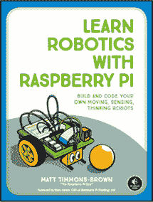
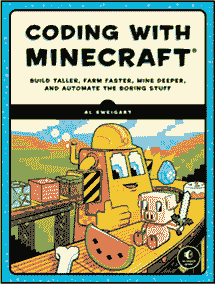
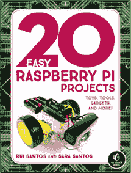
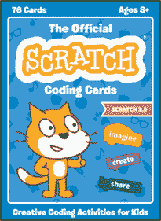
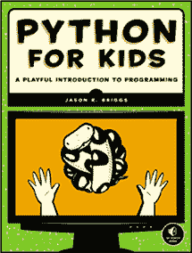

## 附录： **获取部件**

本书中的项目使用了很多部件，不幸的是，没有一个供应商能够提供所有这些部件。如果你找到一个想要制作的项目或一个想要尝试的实验，仔细查看“你需要的物品”部分，并记录下你没有的东西。这将是你的购物清单。

本附录中的表格将帮助你找到清单上的物品。如果你在寻找某个物品时遇到困难，可以通过物品的名称或描述在互联网上进行搜索，通常你会找到可以购买它的地方。

Monk Makes Electronics Starter Kit for micro:bit（* [`monkmakes.com/mb_kit/`](https://monkmakes.com/mb_kit/) *）将为你提供鳄鱼夹电缆以及本书中多个项目使用的 Monk Makes 扬声器和传感器板。

### 实用工具

本书中的大多数项目和实验只需要用手进行操作。然而，还是有一些工具是每个疯科学家应该拥有的。你可能家里已经有很多这样的工具了。

| **物品** | **描述** | **一些来源** |
| --- | --- | --- |
| 剪刀 |  |  |
| 胶带 |  |  |
| 螺丝刀 | 平头和十字头 |  |
| 电钻（用于第六章） |  |  |
| 焊接工具包（用于第六章） | 一套低成本的工具包就可以。你不需要任何花哨的东西。 | Ladyada 的电子工具包：* [`www.adafruit.com/product/136`](https://www.adafruit.com/product/136) *。要寻找低成本的替代品，可以在亚马逊和 eBay 上搜索“焊接工具包”。 |
| 工艺刀 | 用于从纸板中切割形状 | 工艺/爱好店 |
| 钳子 | 中型通用钳子适用于弯曲电线。 | 五金店 |
| 尺子（英寸和厘米） |  | 办公用品店 |
| Blu-Tack/粘合剂填充物 | 非常适合将 micro:bit 粘贴到物体上，且不永久性粘贴。 | 办公用品店 |

只有第六章中的流动机器人项目需要焊接。如果你不打算制作这个项目，你就不需要焊接工具。

同样在第六章中，机械动画头项目要求你使用电钻在乒乓球上打孔。否则，你不需要这项设备。

### 常用部件

以下是本书中许多项目和实验使用的一些部件。许多 micro:bit“入门”套件包括其中的一些或全部物品，这些物品中的一些也列在这里。

| **物品** | **描述** | **一些来源** |
| --- | --- | --- |
| USB 到 micro USB 数据线 | 为 micro:bit 供电和编程 | 这些电缆通常用于给手机充电，因此你可能会有一根。如果没有，它们在销售手机或计算机的商店很容易找到。它们也包含在 micro:bit Go 套件和 Pimoroni micro:bit 配件包中。 |

| 鳄鱼夹电缆 | 用于将 micro:bit 连接到各种设备 | *[`www.adafruit.com/product/1592`](https://www.adafruit.com/product/1592)* *[`shop.pimoroni.com/products/crocodile-leads-set-of-10/`](https://shop.pimoroni.com/products/crocodile-leads-set-of-10/)*

*[`www.kitronik.co.uk/2407-crocodile-leads-pack-of-10.html`](https://www.kitronik.co.uk/2407-crocodile-leads-pack-of-10.html)* |

| 鳄鱼夹到公头电缆 | 用于将 micro:bit 连接到伺服电机 | *[`www.adafruit.com/product/3255`](https://www.adafruit.com/product/3255)* *[`thepihut.com/products/adafruit-small-alligator-clip-to-male-jumper-wire-bundle-6-pieces-ada3448/`](https://thepihut.com/products/adafruit-small-alligator-clip-to-male-jumper-wire-bundle-6-pieces-ada3448/)* |
| --- | --- | --- |

下面是一些包含这些或全部物品的套件。

| **物品** | **描述** | **一些来源** |
| --- | --- | --- |
| Pimoroni micro:bit 配件套件 | 包括 USB 电缆和电池盒 | *[`shop.pimoroni.com/products/micro-bit-accessories-kit/`](https://shop.pimoroni.com/products/micro-bit-accessories-kit/)* |
| BBC micro:bit Go 套件 | 包括 micro:bit、USB 电缆和电池盒 | *[`www.adafruit.com/product/3362`](https://www.adafruit.com/product/3362)* |
| Monk Makes Electronics Starter Kit for micro:bit | 包括鳄鱼夹电缆和多个配件板 | *[`www.eduporium.com/store/monk-makes-electronics-starter-kit-for-micro-bit.html`](https://www.eduporium.com/store/monk-makes-electronics-starter-kit-for-micro-bit.html)* *[`thepihut.com/products/electronics-starter-kit-for-micro-bit/`](https://thepihut.com/products/electronics-starter-kit-for-micro-bit/)* |

### 为你的 micro:bit 供电

这是一些可以为你的 micro:bit 提供电源的选项。

| **物品** | **描述** | **一些来源** |
| --- | --- | --- |

| 2 × AAA 电池包 | 用于放置 AAA 电池 | 包含在 micro:bit Go 套件中： *[`www.adafruit.com/microbit`](https://www.adafruit.com/microbit)* *[`shop.pimoroni.com/products/battery-holder-2-x-aaa-with-switch/`](https://shop.pimoroni.com/products/battery-holder-2-x-aaa-with-switch/)*

你也可以在 eBay 上找到这些。

| Kitronik MI:power 电路板 | 为你的 micro:bit 提供硬币电池电源 | *[`www.kitronik.co.uk/5610-mipower-board-for-the-bbc-microbit.html`](https://www.kitronik.co.uk/5610-mipower-board-for-the-bbc-microbit.html)* |
| --- | --- | --- |

| Monk Makes Power for micro:bit | 为 micro:bit 提供 4.5V 至 12V 的直流电源，适用于长期供电 | *[`www.kitronik.co.uk/46144-monk-makes-power-board-for-microbit.html`](https://www.kitronik.co.uk/46144-monk-makes-power-board-for-microbit.html)* *[`shop.pimoroni.com/products/power-for-micro-bit/`](https://shop.pimoroni.com/products/power-for-micro-bit/)*

*[`www.robotshop.com/en/monk-makes-power-module-microbit.html`](https://www.robotshop.com/en/monk-makes-power-module-microbit.html)* |

| ElecFreaks micro:bit 电源模块 | 与 micro:bit 的电源概念相同（请注意，连接电缆不包括在内） | *[`www.elecfreaks.com/estore/micro-bit-power-supply-module-3-3v-2a.html`](https://www.elecfreaks.com/estore/micro-bit-power-supply-module-3-3v-2a.html)* |
| --- | --- | --- |
| micro:bit 充电套件 | micro:bit 的可充电电池和外壳套件 | *[`www.monkmakes.com/mb_charger/`](https://www.monkmakes.com/mb_charger/)* |
| USB 备用电池 | 一种有用的可充电电池选项（不适用于高电流项目） | *[`www.adafruit.com/product/1959`](https://www.adafruit.com/product/1959)* 你也可以在手机或电脑店、eBay 和 Amazon 找到这些产品。 |

### micro:bit 配件

本书广泛使用 micro:bit 配件，如扬声器和传感器。以下是一些配件的选项。

| **项目** | **描述** | **一些来源** |
| --- | --- | --- |

| Monk Makes micro:bit 扬声器 | 用于与声音相关的项目的扬声器 | *[`www.eduporium.com/store/monk-makes-speaker-for-micro-bit.html`](https://www.eduporium.com/store/monk-makes-speaker-for-micro-bit.html)* *[`shop.pimoroni.com/products/speaker-for-micro-bit/`](https://shop.pimoroni.com/products/speaker-for-micro-bit/)*

*[`www.kitronik.co.uk/46124-powered-speaker-board-for-microbit.html`](https://www.kitronik.co.uk/46124-powered-speaker-board-for-microbit.html)* |

| Mini.Mu 扬声器 | 用于与声音相关的项目的扬声器 | *[`shop.pimoroni.com/products/mini-mu-speaker/`](https://shop.pimoroni.com/products/mini-mu-speaker/)* |
| --- | --- | --- |

| Monk Makes micro:bit 传感器 | 声音、温度和光传感器 | *[`www.eduporium.com/store/monk-makes-sensor-for-micro-bit.html`](https://www.eduporium.com/store/monk-makes-sensor-for-micro-bit.html)* *[`www.kitronik.co.uk/46122-sensor-board-for-microbit.html`](https://www.kitronik.co.uk/46122-sensor-board-for-microbit.html)*

*[`shop.pimoroni.com/products/sensor-for-micro-bit/`](https://shop.pimoroni.com/products/sensor-for-micro-bit/)* |

| Adafruit MEMS 麦克风扩展板 | 高级声音感应选项（需要焊接） | *[`www.adafruit.com/product/2716`](https://www.adafruit.com/product/2716)* |
| --- | --- | --- |
| Kitronik 电机驱动板 for BBC micro:bit (V2) | 用于第六章的机器人巡逻项目 | *[`www.kitronik.co.uk/5620-motor-driver-board-for-the-bbc-microbit-v2.html`](https://www.kitronik.co.uk/5620-motor-driver-board-for-the-bbc-microbit-v2.html)* |

### 杂项

除了附加配件，你还需要一些其他物品。

| **项目** | **描述** | **一些来源** |
| --- | --- | --- |
| 钕磁铁（10 毫米圆盘） | 非常强大的圆盘磁铁 | 你可能会在爱好/工艺品商店找到这些，但 eBay 可能是你的最佳选择。搜索“钕磁铁”。 |
| 3V 伺服电机 | 低功耗伺服电机，能在 3V 下运行 | *[`www.adafruit.com/product/169`](https://www.adafruit.com/product/169)* *[`www.kitronik.co.uk/2565-180-mini-servo.html`](https://www.kitronik.co.uk/2565-180-mini-servo.html)* |
| 12V 水族馆计量泵 | 用于第九章中的植物浇水器项目 | 热带鱼商店或 eBay，搜索“12V 水族馆计量泵” |
| 1kΩ电阻器 | 用于第九章中的植物浇水器项目 | *[`www.sparkfun.com/products/14492/`](https://www.sparkfun.com/products/14492/)* *[`www.kitronik.co.uk/c3003-resistor-pack-of-100.html`](https://www.kitronik.co.uk/c3003-resistor-pack-of-100.html)*（版本 3003-1k） |
| 女性 DC 插座到螺丝端子适配器 | 用于第九章中的植物浇水器项目 | *[`www.adafruit.com/product/369`](https://www.adafruit.com/product/369)* *[`shop.pimoroni.com/products/male-dc-power-adapter-2-1mm-plug-to-screw-terminal-block/`](https://shop.pimoroni.com/products/male-dc-power-adapter-2-1mm-plug-to-screw-terminal-block/)* |
| 用于植物浇水器项目中的 12V 泵供电器 | 可以供应 12V 和 1A 的适合您国家的交流插座类型的供电器 | *美国: [`www.adafruit.com/product/798`](https://www.adafruit.com/product/798)* *英国: [`shop.pimoroni.com/products/power-supply-12v-1a/`](https://shop.pimoroni.com/products/power-supply-12v-1a/)* |

*Micro:bit for Mad Scientists*设定为 Century Schoolbook，Filmotype Candy，Housearama Kingpin 和 TheSansMono Condensed 字体。

**资源**

访问*[`www.nostarch.com/microbitformad/`](https://www.nostarch.com/microbitformad/)*获取资源，勘误表和更多信息。

**更聪明的孩子的更智能的书籍！** 

**学习用 RASPBERRY PI 制作机器人**

**建造和编程您自己的移动，感应，思考机器人**

*由* MATT TIMMONS-BROWN *撰写*

2019 年 1 月，240 页，24.95 美元

ISBN 978-1-59327-920-2

*全彩*

**创造自己的 SCRATCH 游戏！**

*由* ANNA ANTHROPY *撰写*

2019 年 7 月，192 页，17.95 美元

ISBN 978-1-59327-936-3

*全彩*

**使用 MINECRAFT 编程**

**建造更高，农场更快，挖掘更深，并自动化无聊的事情**

*由* AL SWEIGART *撰写*

2018 年 5 月，256 页，29.95 美元

ISBN 978-1-59327-853-3

*全彩*

**20 个简单的树莓派项目**

**玩具，工具，小玩意以及更多！**

*由* RUI SANTOS *和* SARA SANTOS *撰写*

2018 年 4 月，288 页，24.95 美元

ISBN 978-1-59327-843-4

*全彩*

**官方 SCRATCH 编码卡**

**为孩子们创造编程活动**

*由* NATALIE RUSK *和* SCRATCH TEAM *撰写*

2019 年 5 月，76 张卡片，24.95 美元

ISBN 978-1-59327-976-9

*全彩，礼盒装*

**给孩子的 PYTHON**

**编程的嬉戏介绍**

*由* JASON R. BRIGGS 编写

2012 年 12 月，344 页，$34.95

ISBN 978-1-59327-407-8

*全彩*

**1.800.420.7240 或 1.415.863.9900 | sales@nostarch.com | [www.nostarch.com](http://www.nostarch.com)**

## 适合 10 岁及以上年龄段

**打造属于你自己的** **秘密实验室！**

BBC micro:bit 是一款微小、廉价且出乎意料地强大的计算机，你可以用它来制作酷炫的东西并进行代码实验。

这本书中的 30 个简单项目和实验将教你如何使用 micro:bit 构建一个秘密的科学实验室——包括机器人、门铃、测谎仪等等——同时学习基础的编码和电子学技能。

这里列出的是你将要制作的一些项目：

  一种通过挥手即可演奏的光控吉他

  一个工作的测谎仪

  一款自动浇水的植物护理系统

  一款双轮机器人

  一款带有活动眼睛的会说话机器人头

  一个由磁铁制作的门铃

学会像疯狂科学家一样编写代码！

### 关于作者

西蒙·蒙克（Simon Monk）经常为创客撰写有关电子学的文章。他是《树莓派食谱》、《编程 Arduino》和《电子学黑客》的作者。与此同时，他还是《发明家实用电子学》的合著者，并与他的儿子马修·蒙克共同编写了《Minecraft 精通指南》。

**涵盖 MicroPython 和 MakeCode 块**

**30 个编码与电子项目**

***最棒的极客娱乐™***

[www.nostarch.com](http://www.nostarch.com)
