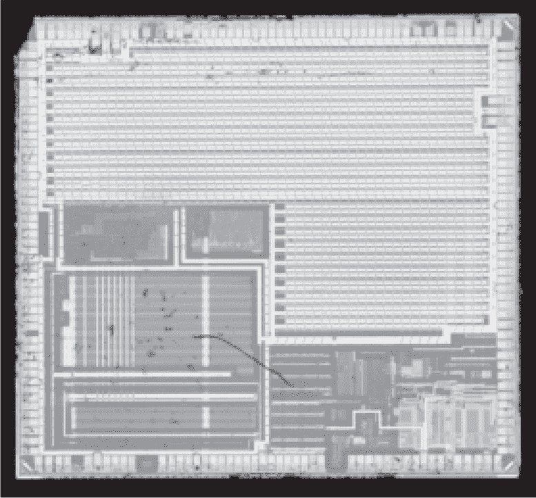
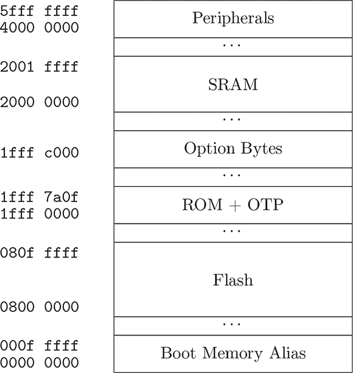
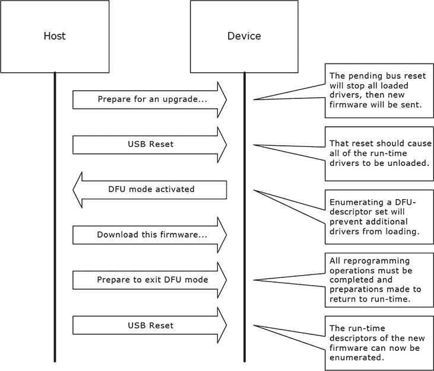
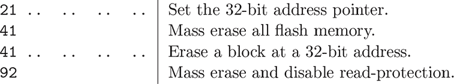
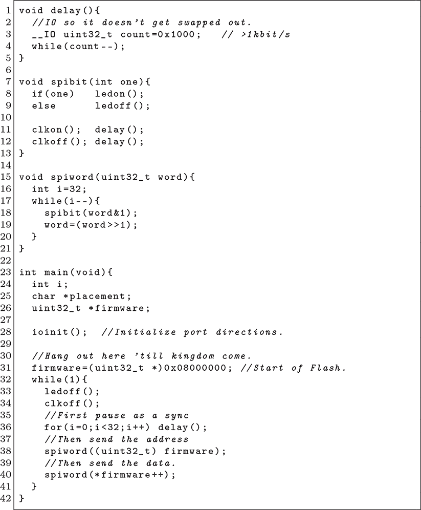
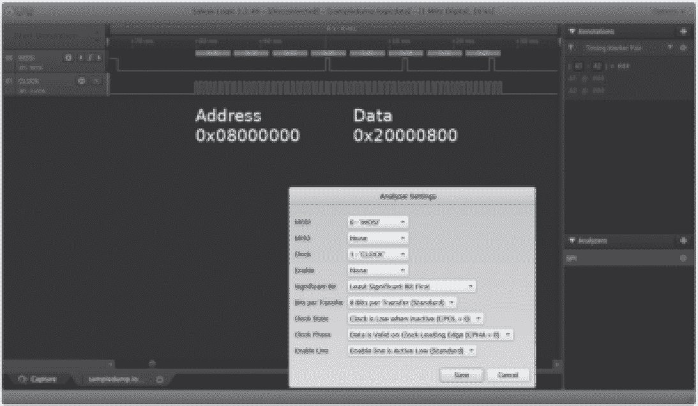

## 第二章：**2 STM32F217 DFU 退出**

根据 Goodspeed（2012）私下向 STMicroelectronics 报告，本章是首次公开描述 STM32F217、STM32F407 以及其他系列芯片在采用 USB 设备固件更新（DFU）协议的掩码 ROM 实现时的远程代码执行漏洞。这个漏洞的好处在于它非常简单：DFU 实现限制了对加密芯片内存的读取和写入，但更改目标地址和执行应用程序则是完全允许的。

要提取加密芯片的内存，我们首先使用 JTAG 将一些 Shell 代码放入未使用的 SRAM 中，然后重置芯片并通过 USB 使用 DFU 执行该 Shell 代码，从 GPIO 引脚输出所有内存内容。引导加载程序使用的 DFU 协议方言在 STMicro（2010）中有文档说明；在阅读本章节时请务必随时查阅。

图 2.1：STM32F217

图 2.2：简化版 STM32F217 内存映射

### **JTAG 和引导加载程序**

与本书讨论的大多数 STM32 芯片一样，STM32F217 也有三个保护级别：0、1 和 2。级别 0 无保护，如果设备处于此级别，你可以直接读取固件并关上这本书。级别 2 不允许任何形式的调试，通常攻击者会首先通过降级保护到级别 1 来对该级别的设备进行攻击。

级别 1 是一个折中的方式，也是你在生产设备中最常见的模式。在此模式下，连接 JTAG 调试器将禁用对闪存的访问，但仍然可以访问 CPU、RAM 和 ROM。还可以从级别 1 降级到级别 0，但这会导致闪存被全部擦除，并摧毁其中的所有数据。开发者喜欢这种模式，因为失败分析仍然是可能的，同时他们也被告知固件将保持安全，防止被提取。^(1)

STM32F217 还在 ROM 中包含了三个引导加载程序，分别用于通过 UART、USB DFU 和 CAN 总线接受固件更新。这三个引导加载程序之间几乎没有共享代码，它们在*软件*中实现了级别 1 的保护，而不是依赖于连接 JTAG 调试器时存在的硬件保护。这对我们来说是有利的，因为这意味着如果我们能够诱使这三个引导加载程序中的任何一个读取闪存，我们就可以选择该引导加载程序并提取芯片的固件。

### **USB DFU 引导加载程序**

本章的漏洞出现在通过 USB 访问的 DFU 引导加载程序中。我首先编写了一个与芯片兼容的 DFU 客户端，然后用它提取了位于 `0x1fff0000` 的 ROM 进行逆向工程，以便了解所有规则。^(2)

我将在此简要介绍 DFU 协议，但要真正理解或实现该协议，应该阅读 Henry 等人（2004）的原始文档。

首先需要了解的是，DFU 支持以下七个请求：`Detach`、`Download`、`Upload`、`Get Status`、`Clear Status`、`Get State`和`Abort`。寻址是通过块索引来处理的，而不是地址，这个块索引相对于地址指针。

大多数高级命令是通过调用`Upload`或`Download`实现的，接着使用`Get Status`来了解事务的结果。

块索引从 2 开始用于数据事务，而不是我们预期的 0 或 1。如果你将 32 个字节上传到索引 2，它们将被写入地址指针。将 32 个字节上传到索引 3 将把它们写入地址指针之后的 32 个字节，上传 64 个字节到相同的索引将把它们写入地址指针之后的 64 个字节。

索引 1 从不使用。索引 0 表示一个特殊块，其中第一个字节是几个秘密命令之一。下载`[0x41]`将会批量擦除所有闪存。一个空字符串`[]`将断开 DFU 会话，并执行目标地址的应用程序。下载`[0x21, 0x1c, 0x32, 0x00, 0x08]`将把目标地址指针设置为`0x0800321c`。下载`[0x92]`将首先批量擦除所有内存，然后还会解锁芯片到 RDP Level 0。^(3)

图 2.3：DFU 会话，来自 Henry 等人（2004 年）。

图 2.4：STMicro 的零块 DNLOAD 扩展（2010 年）

你可以通过将`[0xFF, 0xFF]`下载到目标地址`0x1fffc000`来锁定芯片。在这种情况下，索引为 2，我们正在写入指定的地址，而不是写入特殊的零块。

一旦芯片被锁定到 RDP Level 1，连接到 DFU ROM 的权限将受到以下限制：除非从某些特殊地址，否则不能进行`Upload`或`Download`操作。索引 0 处的特殊命令将单独允许或拒绝。特别需要关注的是，你仍然可以设置地址指针，并且你可以退出 DFU ROM。

### **错误**

在了解了所有这些背景信息后，错误本身并不复杂。首先，JTAG 允许我们将应用程序写入未使用的 SRAM 中，并且该应用程序在芯片重置后仍然会保留，在此时闪存被重新连接并开始从 ROM 执行 DFU 引导加载程序。其次，DFU 引导加载程序允许我们设置地址指针，尽管存在锁定，当我们退出引导加载程序时，执行将继续到指针指向的目标应用程序！

从实际角度来看，这意味着如果地址指针设置为`0x20003000`，引导加载程序将在退出时跳转到存储在`0x20003004`的值。选择这个地址是因为它恰好位于 SRAM 中，并且 DFU 引导加载程序未使用该地址，因此它不会被引导加载程序的堆栈或全局变量覆盖。

我们从 SRAM 执行的 shellcode 相当简单。它通过 SPI 协议循环传输所有闪存数据，使用 PG6 引脚作为 MOSI，PG8 引脚作为 CLK。这很容易通过逻辑分析仪捕获，如图 2.6 所示。如果这些引脚上也有 LED，它们将闪烁以表示成功利用。

由于我们的输出格式本质上是 SPI 总线流量，我们可以使用逻辑分析仪的 SPI 解码器从记录中提取固件镜像。

### **利用**

ST Micro 已经在最近的修订版本中修复了这个漏洞，因此对目标 ROM 进行一些逆向工程可能是一个不错的主意，以验证该漏洞是否存在。通过将 2KB 加载到 USB 帧缓冲区中，然后执行其中未被较短命令覆盖的部分，应该能够实现更好的利用。

虽然这个特定的漏洞只适用于 RDP Level 1，但如第 E.5 章中所描述的故障攻击可以将保护从 Level 2 降级到 Level 1。

图 2.5: STM32 Shellcode

图 2.6: STM32F217 固件转储
