## 第三章：**3 MD380 空指针，DFU**

尽管利用芯片厂商的 ROM 引导加载程序是非常有效的，但许多设备厂商会在闪存中添加第二个引导加载程序。这个故事最早在 Goodspeed（2016b）中讲述，讲述了我如何通过空指针读取漏洞 dump 了一款双向无线电的固件。它也是如何破解固件更新加密的故事，来自 Rütten 和 Goodspeed（2016）。

Tytera MD380 是一款手持无线电收发器，支持模拟 FM 或数字移动无线电（DMR）。DMR 提供了 GSM 的一些功能，如短信和中继塔的时分复用，而无需 SIM 卡的麻烦。许多人购买 MD380 用于业余无线电；它实在太诱人了，无法不拆掉固件并为业余无线电社区打补丁，增加新功能。

这款无线电的 CPU 是 STM32F405，采用 LQFP100 封装，配备一兆字节的闪存和 192KB 的 RAM。^(1) STM32 具有 JTAG 和 ROM 引导加载程序，但这些在最安全设置下被读取设备保护（RDP）功能保护，JTAG 连接完全禁止。

### **读取空指针**

我并没有直接从第二章介绍的 STM32 漏洞入手，而是先为无线电编写了一些自己的 USB 驱动程序。正如我们很快会看到的，这并不是浪费时间。

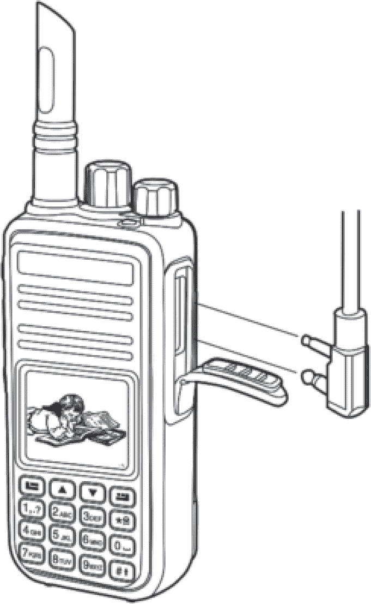

图 3.1：Tytera MD380 无线电

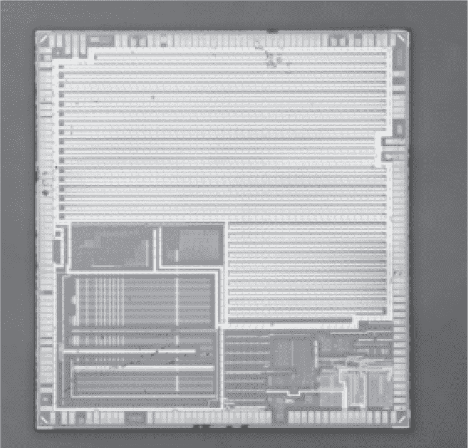

图 3.2：STM32F405

MD380 有*三*个独立的 USB 设备固件更新（DFU）协议实现：一个在 ROM 中，一个在闪存的开头用于固件更新和恢复，另一个在主无线电应用程序中。第二个和第三个协议大致相同，我们可以用差不多的方式利用它们。

我通过在 VMWare 中运行厂商的 Windows 应用程序，逆向工程了协议，然后通过在图 3.4 中的代码行修补`.vmx`文件，将 USB 流量写入日志文件。现在，我可能会在 Linux 主机上使用`usbmon`，同时在 Qemu 虚拟机中运行 Windows。

日志显示，MD380 的 DFU 变体包括非标准命令。特别是，LCD 屏幕在官方客户端应用程序中会显示“PC Program USB Mode”，但在任何第三方应用程序中则不会。在我能够进行适当读取之前，我需要找到能够进入此编程模式的命令。

DFU 实现通常会在`UPLOAD`和`DNLOAD`命令中隐藏额外的命令，当块地址小于 2 时。要擦除一个块，DFU 主机会下载`0x41`，后跟一个小端地址到块零。要批量擦除所有内存，主机只需发送`0x41`，不带任何额外字节到块零。要设置地址指针，主机发送`0x21`，后跟一个小端地址。有关以这种方式调用的 STM32 标准扩展的列表，请参见图 2.4。

除了那些已记录的命令，MD380 还使用了若干个两字节（而非五字节）的 `DNLOAD` 事务，这些命令在标准 DFU 协议中都不存在。我在 图 3.5 中观察到了这些命令，其中许多我至今仍然只理解了一部分。

修改 Michael Ossmann 的 Ubertooth 项目中的开源 DFU 客户端，以便读取和写入无线电配置并不难。这个配置被无线电用户称为“代码插头”，存储在 SPI 闪存中，并不包含任何固件。相反，它保存了无线电频道设置和频率。

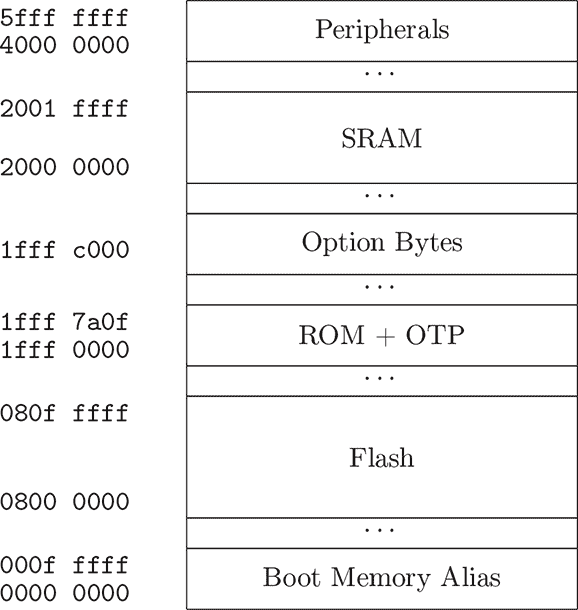

图 3.3：简化的 STM32F405 内存映射

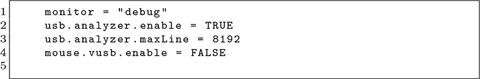

图 3.4：在 VMWare 上进行 USB sniffing

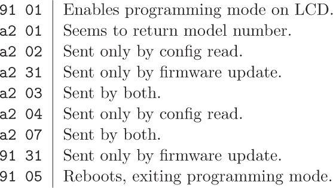

图 3.5：MD380 的 DNLOAD 扩展

图 3.6：闪存内存转储

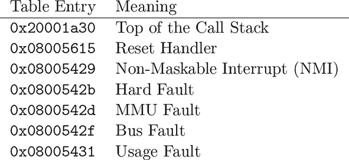

图 3.7：MD380 的中断表

如果在读取之前没有发送任何来自 图 3.5 的扩展命令，读取出的将是一个非常有趣的模式，如 图 3.7 所示。你可以认为这只是没有选择内存源。

以小端模式解读，开始出现的字是 `0x2000-1a30`、`0x08005615`、`0x08005429`，以及一堆指向 STM32 闪存地址的奇怪指针。这是闪存开头的中断表，而我看到的是从 `0x08000000` 开始的闪存引导加载程序的前一千字节！

内部发生了什么？嗯，每个 DFU 事务都会尝试从内存中读取一个块，但因为没有发送自定义命令来选择内存源，未初始化的缓冲区从未被填充。那么在 STM32F4 上，未初始化位置的缓冲区到底包含了什么呢？嗯，`0x00000000` 会巧妙地映射到芯片启动时所在的内存，因此从那里读取一千字节，实际上就得到了来自 `0x08000000` 的一千字节，这就是为什么我们会看到引导加载程序的前一千字节。

阅读第一个块之后，我们发现每个块都包含相同的一千字节。这是因为 DFU 是按块号寻址的，但缓冲区仍未初始化，因此所有块地址都会被重定向到闪存的起始位置。尽管改变块索引没什么用，但我们可以通过 `dfu-util` 的 `--transfer-size` 选项增加块大小，获取超过一千字节的数据。最大传输大小取决于操作系统和 USB 控制器，但我的 iMac 能够拉出 `0xC000` 字节，即恢复引导加载程序的完整长度！

### **破解保护**

所以现在我们有了恢复引导加载程序，但在 `0x0800C000` 的内存中还没有随之而来的应用程序。我们可以通过修改恢复引导加载程序来禁用读取保护，然后使用 STM32 的 ROM 引导加载程序通过 USB 转储所有内存来获得这段代码。

要将图像加载到逆向工程工具中，如 IDA Pro 或 Ghidra，只需设置 ARM/Cortex 指令集和 `0x08000000` 的基地址。有时将图像标记为没有写权限有助于反编译器，它会知道代码不会自我修改。还需要将 `0x40000000` 的 I/O 区域标记为易失性，以防止反编译器优化掉大部分中断处理程序代码。

通过搜索 IO 地址 `OPTCR_BYTE1_ADDRESS`（`0x4002-3C15`），我们迅速发现 STM32 示例中的 `FLASH_OB_RDPConfig()` 被包含在 `0x08001fb0`。它从 `main()` 中被调用，并在 `0x0800-44A8` 的指令中传递了 `0x55` 的参数。

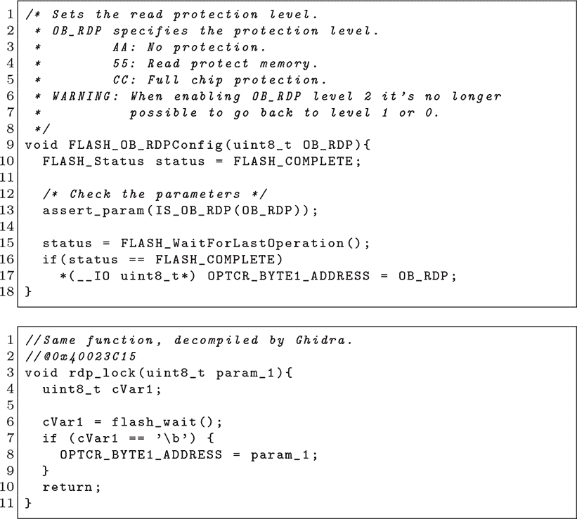

图 3.8：此函数设置 RDP 保护级别。

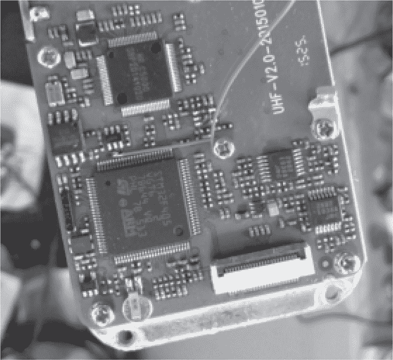

图 3.9：按下 BOOT0 引脚

然后，我们可以修补一个字节，使其不再写入 `0x55`（用于 RDP 级别 1 读保护），而是写入 `0xAA`（用于 RDP 级别 0 无保护）。

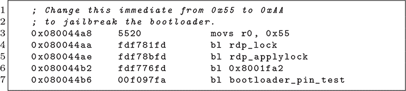

现在我们有了一个不会锁定芯片的引导加载程序，但仍然需要安装它。我们通过在重启期间将 CPU 的 `BOOT0` 引脚拉高，按照 图 3.9 中的硬件修改，启动 ROM 引导加载程序。此时，我们仍处于 RDP 级别 1（读保护），但我们可以通过发送批量擦除命令降级到级别 0，擦除闪存中的所有内容并让无线电没有固件。

然后，我们将修补后的引导加载程序写入闪存，并在重启无线电时按住无线电右侧的上下按钮来启动它。LED 灯将开始红绿交替闪烁。此时，设备已准备好接受更新，但仍没有应用程序镜像，因此我们使用厂商的 Windows 应用程序安装加密的固件更新。这为我们提供了一个正常工作的无线电！

我们再次通过在重启时将 `BOOT0` 引脚拉高，进入 第二章中的 ROM 引导加载程序。这次，我们处于 RDP 级别 0（无保护），可以自由地转储所有闪存，其中无线电固件从 `0x0800C000` 开始。由于设备保持解锁，我们还可以修补应用程序镜像并将其写回到无线电中。

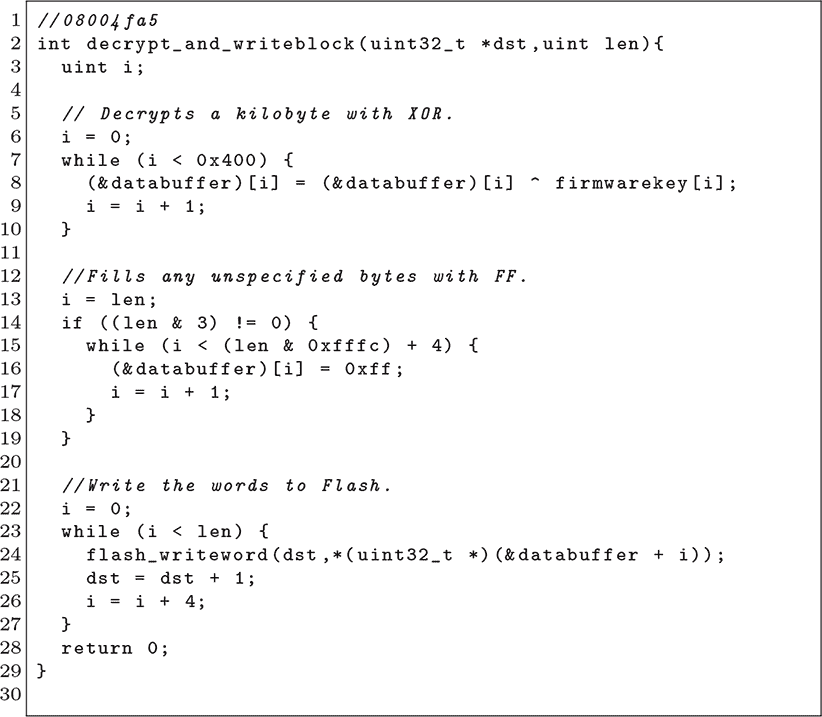

图 3.10：反编译后的解密函数

### **破解更新加密**

到此为止，我们已经获得了恢复引导加载程序和应用程序的明文转储，以及应用程序的加密固件更新。剩下的就是破解加密，这正是我的好朋友 Christiane Rütten 在 Rütten 和 Goodspeed（2016）中贡献的技巧。

不同形式的密码学当然需要不同的技术。如果供应商使用公钥加密签名更新，我们可能就无能为力了。如果使用像 AES 这样的标准对称加密算法，我们或许能通过搜索常量表来找到线索，然后追踪引用直到找到解密固件的代码。

相反，Rütten 发现加密固件更新中有重复的序列，如果加密做得正确，这种情况是不应该发生的。她随后将加密的固件更新与我从内存中提取的明文应用程序做了异或（XOR）操作。

果然，用明文与更新文件做异或操作，产生了一个 1,024 字节的重复模式！请参阅 第 38 页 了解使用这些字节将固件块包装成加密更新的 Python 代码，它与制造商自己的工具兼容。

执行这个异或操作的固件函数如 图 3.10 所示。请注意，无论写入的块大小如何，1,024 字节都会与 `firmwarekey` 的字节进行异或，但复制的数量是作为参数传递的。

这些漏洞使得 MD380Tools 项目成为可能，这是一个开源补丁集合，用于破解 MD380 固件，添加了混杂模式、所有注册的业余 DMR 操作员的电话簿，以及原始数据包捕获。^(2) 它也使得 Goodspeed（2016a）成为可能，在该项目中，我将固件重新链接成 ARM/Linux 可执行文件，用于在桌面或服务器上自由地编码和解码 DMR 的 AMBE+2 音频编解码器。

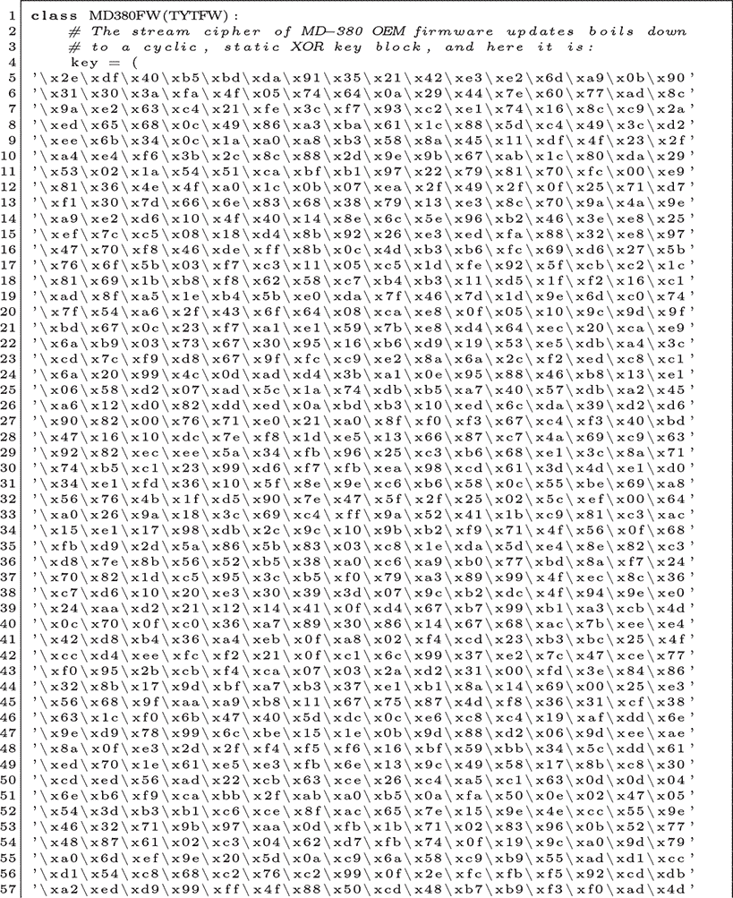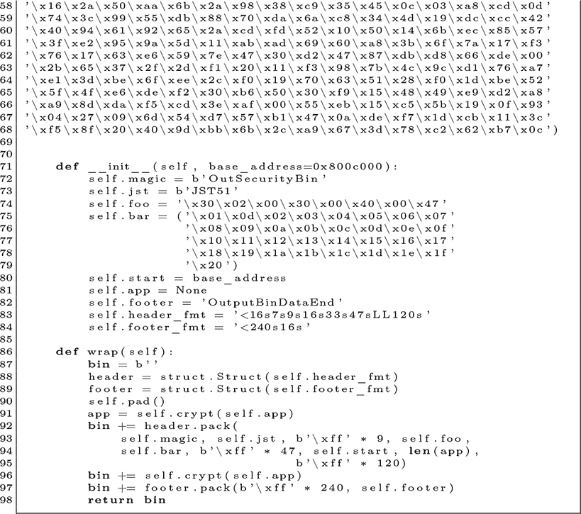
