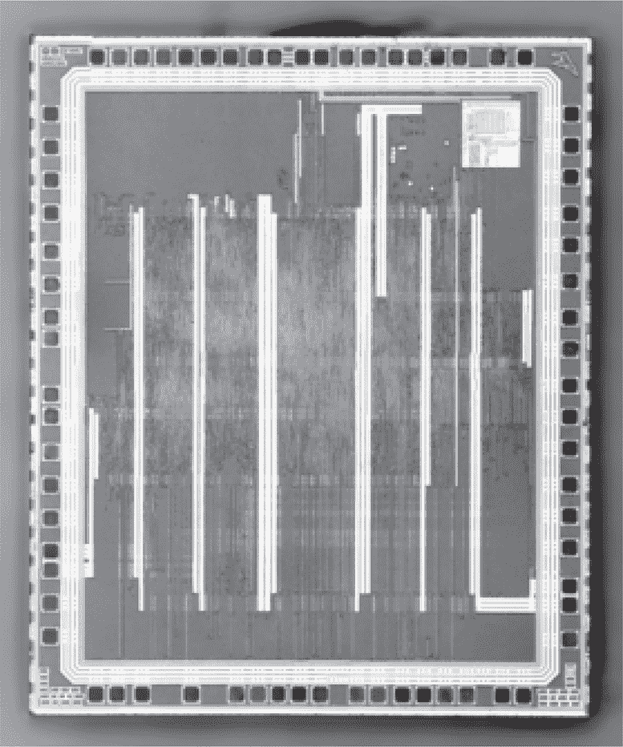
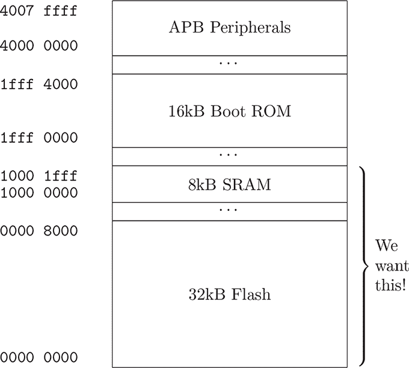
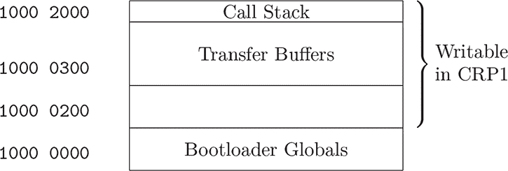
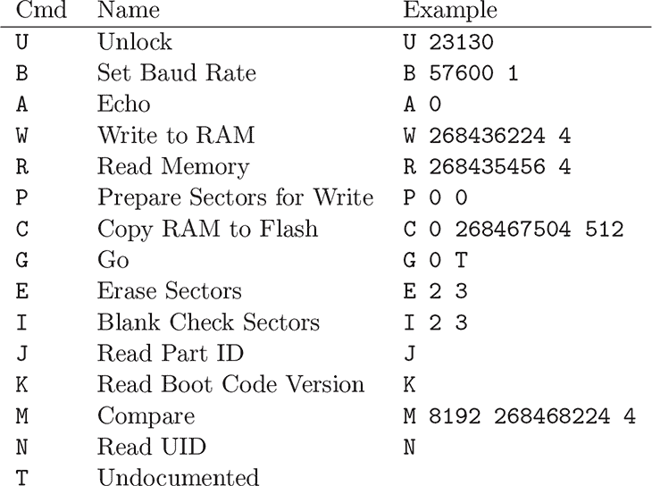
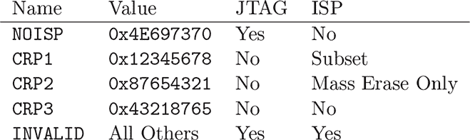
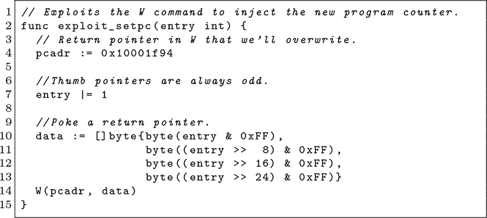
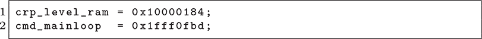
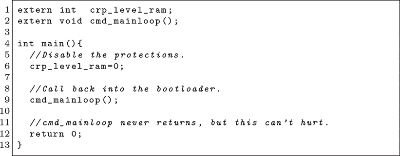
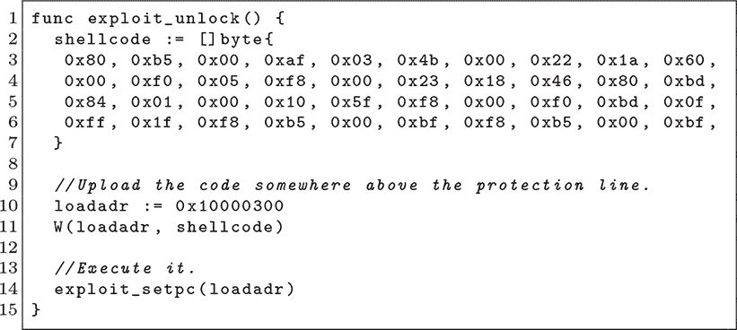

## **4 LPC1343 调用栈**

NXP 的 LPC800、LPC1100、LPC1200、LPC1300、LPC1500、LPC-1700 和 LPC1800 系列 ARM 微控制器容易受到引导加载程序内存损坏的影响。此问题首先在 Herrewegen 等人（2020）中描述，针对的是 LPC1343，这是一款具有 32KB 闪存和 8KB RAM 的 Cortex M3 处理器。在本章中，我们将探讨引导加载程序的协议和漏洞，然后逐步编写自己的攻击代码。

LPC 微控制器有五个代码读取保护（CRP）级别，每个级别都对 ISP（引导加载程序）和 SWD（调试器）访问施加了进一步的限制。级别 0（NOCRP）是未保护的，允许通过引导加载程序或 SWD 调试器自由读取和写入内存。CRP 1 完全禁用 SWD 调试，同时禁止 ISP 读取，并限制 ISP 写入，以便在保护其余部分的同时进行现场内存更新。在 CRP 2 中，大多数命令被禁用。CRP 3 是最安全的，禁用所有功能。第五种模式 NOISP 禁用 ISP 接口，同时保留 SWD 启用，从而使内存仍然暴露。

引导加载程序同时作为 UART 串口和 USB 大容量存储磁盘呈现，其中磁盘的一个文件代表芯片的固件。Herrewegen 的攻击特定于 CRP 级别 1 中的 UART 接口，但作者指出，大容量存储接口可能是进一步寻找漏洞的一个好目标。有关在更高保护模式下对这些芯片有效的故障攻击，请参见第十五章。

图 4.1：LPC1343

### **入门**

掩码 ROM 引导加载程序位于 `0x1fff0000`，大小为 16KB。32KB 的闪存从地址 `0x00000000` 开始，8KB 的 SRAM 映射在 `0x10000000`。

引导加载程序不允许直接读取 ROM，因此我首先使用 SWD 调试器和 OpenOCD 转储了 ROM。我还需要一份 SRAM 的副本，以便在调试时查看全局变量和栈值，因此我首先使用调试器将 SRAM 清零，然后进入引导加载程序。通过引导加载程序读取 RAM 转储，可以让我获得引导加载程序的读取 RAM 函数中的状态，所有未初始化的字节都保持为 `0x00`。

保护级别通过写入闪存内存地址 `0x02fc` 的 32 位字来配置。CRP 1 的值是 `0x12345678`，CRP 2 是 `0x87654321`，CRP 3 是 `0x43218765`。所有其他值都使芯片处于未保护状态，这使得它成为第十五章中故障攻击的好目标。

RAM 从`0x10000000`开始，并为引导程序提供一个受保护的区域作为工作内存。引导程序将拒绝对此区域的写入。根据文档，前 768 字节（直到`0x10000300`）应当被保护，但实际上只有前 512 字节（直到`0x10000200`）被保护。在未受保护的范围内存在一些全局变量（尽管应该被保护），但目前没有发现这些全局变量是可被利用的。图 4.3 展示了这个布局。

设计师似乎保护了他们的 `.data` 部分，却忽略了调用栈对攻击者来说是一个更具诱惑力的目标。引导程序的调用栈从 `0x10001fdc` 向下增长，完全位于写保护区域之外！Herrewegen 的漏洞通过反复使用写 RAM 函数修改这个栈来触发返回到原本无法到达的读取内存函数，先转储一些字节的闪存，然后重复这个过程。

### **UART 协议简介**

UART 协议在 NXP (2012) 的第二十一章中有详细说明。它是一个 ASCII 协议，可以自动同步到你的波特率，如果你愿意的话，可以在终端仿真器中手动缓慢输入大部分协议内容。

通过拉高 `BLD_E` 引脚来启用引导程序，并通过将 `P0_3` 拉低来选择具有 USB 的型号的 UART 模式。启动引导程序后，你以 57,600 波特率发送一个问号。芯片会发送 `Synchronized` 这个词，你将其返回以确认一切正常。

每个命令以一行文本的形式发送，并会被回显。数值参数*始终*是十进制的；不支持解析十六进制。读写操作以`uuencode`格式的行进行保护，每二十行有一个校验和。（每行解码 45 字节，即每 900 字节一个校验和。）

由于我找不到可以打补丁的开源引导程序客户端，我使用 Golang 和 `go-serial` 库编写了一个新的引导程序客户端。

图 4.2：LPC1343 内存映射

图 4.3：LPC1343 引导程序 SRAM

图 4.4：LPC1343 引导程序命令

图 4.5：代码保护字面量

### **逆向工程引导程序**

下一步是逆向工程引导程序。我在 Ghidra 中执行了这个操作，加载了 `0x1fff0000` 处的 ROM 转储和 `0x10000000` 处的 SRAM 转储。

在第一次尝试时，我加载了一个未被清零的芯片的 SRAM 转储。SRAM 在没有电源时会丢失状态，因此它将大部分未使用的内存填充了杂乱无章的内容，这使得逆向工程变得更加困难。在运行引导程序之前清零 SRAM，然后通过引导程序将其转储，给我提供了一个初始化了所有全局变量并且拥有活动调用栈的镜像，帮助我理清思路。

这些转储当然是从一个解锁的芯片上获取的。除非解锁芯片不可用，例如智能卡只能在保密协议下使用，否则最好先在解锁芯片上开发漏洞，并在以后再将其用于锁定目标。

加载了固件和 SRAM 转储后，我花了一个下午的时间寻找并命名函数。有关函数用途的好线索来自于它访问的 I/O 地址以及是否读取或写入这些地址。

地址的第一个字节（nybble）通过查看图 4.2 中的内存映射告诉我它是什么类型。以`1`开头的是该芯片上的 SRAM，而以`0`开头的是闪存存储，并且是有效的常量。如果以`4`开头，则是 I/O 外设，我可以在芯片的数据手册或头文件中查找外设的名称。

大型`switch`语句也很有用，例如图 4.4 中解释命令的循环。请注意，这些命令中的`T`和`U`在 NXP 的文档中是缺失的。

我跳过了大容量存储的实现，因为我已经知道从 Herrewegen 等人（2020 年）的详细信息中将利用的漏洞。当寻找原始漏洞时，而不是重新实现已有技术，最好探索所有在芯片锁定时可以访问的代码。如果没有手动发现可利用的漏洞，可以特别关注解析器代码，并考虑在仿真中进行模糊测试固件。

### **控制程序计数器**

实现基本的引导加载程序命令后，我们可以读取和写入一个锁定芯片上`0x10000200`以上的 SRAM，所以控制程序计数器就像在该地址以上的堆栈中找到返回指针一样简单。如果我们覆盖该地址然后返回，芯片将跳转到我们的新地址，而不是合法的调用函数。

在我的 Ghidra 项目中，我查看了位于`0x1fff0000`的引导加载程序的中断表。第一个字，`0x10000ffc`，是堆栈的初始顶部，而我想覆盖的返回指针应该位于该位置以下的内存中。

我的第二个线索是，当我将引导加载程序停止并将其归零时，程序计数器是`0x10001f88`。深度会根据调用的函数有所变化，但这表明我处于正确的区域。

第三个线索同样来自 Ghidra，我可以在这个区域中探索有效的代码指针。偏移量会略有变化，因为我正在查看 Read 命令的堆栈，而我的利用将会破坏 Write 命令的堆栈，但对齐通常是相似的。

最终，我得到了`0x10001f94`作为有效的返回指针，它会在 Read 命令发送确认后恢复到程序计数器。在这里，我写入我的 shellcode 地址以触发其执行。

### **特权提升的 Shellcode**

Herrewegen 的漏洞利用不仅仅重写了返回指针。相反，他修补了栈，使写操作变成读操作，将文本转储回他的客户端。我比较懒，所以我采取了更直接的方式：从 RAM 中运行 C shellcode，而不是从 ROM 中重用现有代码。

获取能够从 SRAM 中运行的 shellcode 的字节只需要一个最小的链接脚本，为了简化起见，我使用了`ENTRY(main)`指令将`main()`方法设置为入口点，并将`.text`和`.data`紧挨在一起放入 RAM 中。第一个字节是入口点，任何全局变量都直接与镜像一起加载，而不是从代码内存中复制。

从 Herrewegen 的论文中，我知道 SRAM 中有一个全局变量缓存着 CRP 锁定字。Flash 中的永久位置在`0x000002fc`，在 Ghidra 中稍作搜索，发现缓存版本位于`0x10000184`。所以，我的 shellcode 做的第一件事就是用更高权限的值（例如零）覆盖这个值。

我还需要确保栈已经恢复，以免引导加载程序的解释器循环崩溃。这可以通过运气完成，或者通过在栈上构造正确的字节实现，但因为我希望我的 shellcode 在第一次就能成功，所以我选择了一个更简单的解决方案：它直接调用命令解释器的主循环，后者期望在权限缓存后被引导加载程序调用。这个循环是一个无限的`while()`循环，永远不会返回，并且栈深度足够。这样就能干净地继续执行，而不需要任何额外的工作。¹

这是我的符号文件。它仅定义了包含保护级别的全局变量和引导加载程序的命令解释器循环。

这是我的 shellcode，使用 C 语言编写，而不是汇编语言。它仅仅禁用了保护并直接跳回到命令循环。

将这些内容结合起来，这是解锁芯片的 Go 方法，然后干净地继续执行任何标准引导加载程序命令，不受麻烦的读取保护干扰。

