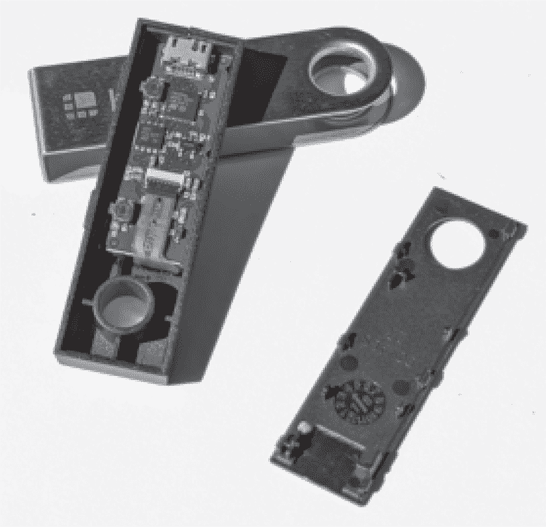
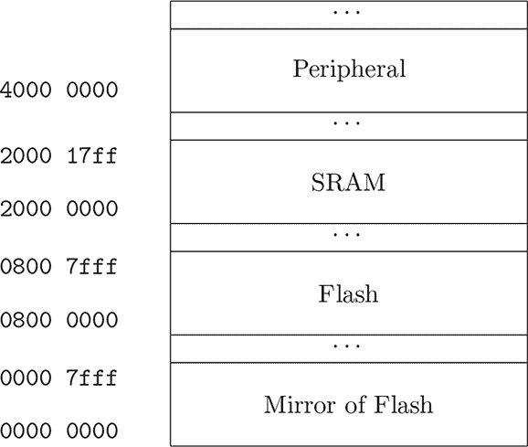
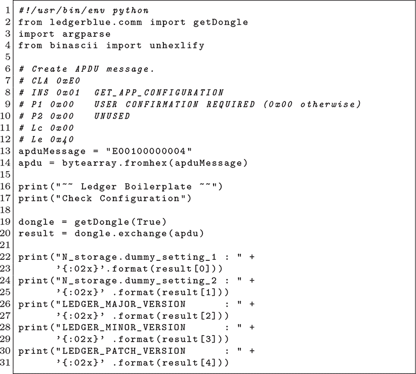
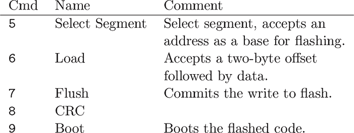
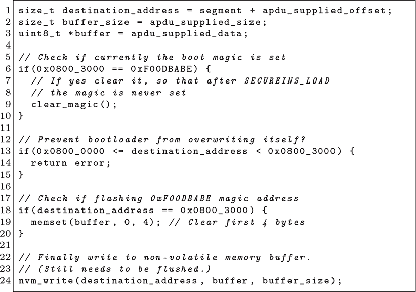
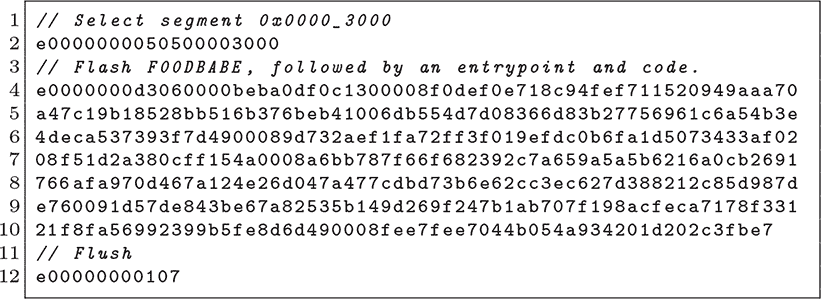
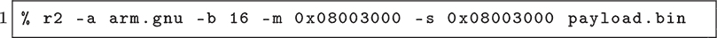
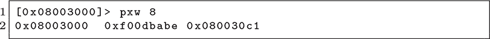
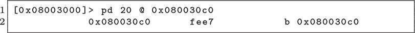

## **5 Ledger Nano S, 0xF00DBABE**

Ledger Nano S 是一款电子加密货币钱包，由 STM32F042 微控制器和 ST31H320 安全元素提供支持。在启动时按住一个按钮，会触发 STM32F0 闪存中的引导加载程序，通过 USB 采用 APDU 协议进行通信。大部分 STM32 固件是开源的，而 ST31 在封闭源代码的监督程序内运行 applets。

本章将讨论一个漏洞，最早由 Roth (2018) 发布，该漏洞通过双重映射闪存使得在写入固件时可以绕过一致性检查，从而让引导加载程序错误地认为代码签名已经被验证。

我们还将简要介绍 Rashid (2018) 中的一个技术，利用该技术可以欺骗设备的加密固件认证。通过用跳转回引导加载程序等效功能的分支替换编译器内建函数，我们可以为补丁腾出一些空间。这使得 STM32 能够向 ST31 撒谎其代码，悄悄通过验证进行小补丁。

Ledger Nano S 将其代码分布在 STM32F042 和 ST31H320 之间。该设备并没有使用贴纸封条来防止篡改，而是采用了一个易于打开的外壳和软件认证。ST31 智能卡通过严格的时序要求读取 STM32 的固件来验证其合法性。

从攻击者的角度来看，一次成功的攻击需要同时将新代码写入 STM32 芯片，并伪造证明过程，使得主机 GUI 软件相信固件是正版的。我们将涵盖两者的技巧，但首先让我们简要了解一下平台，以便知道我们正在使用的是什么。

图 5.1：反汇编的 Ledger Nano S

图 5.2：STM32F042 内存映射

虽然 ST31 固件保持机密，但 STM32 固件是开源的，包含文档和开发套件。为了防止恶意修补，主机软件会验证 ST31 对 STM32 固件的证明，且为了防止恶意应用程序，需要输入密码来批准可能被闪存写入设备的应用程序和签名密钥。

第三方应用程序采用 C 语言编写，并在 ST31 的受保护模式下运行。大多数例子是加密货币钱包应用，但也有少数游戏，例如 Parker Hoyes 移植的 *Snake*。^(1) 在安装时，Applet 固件会由 ST31 进行验证，并且 GUI 必须调用才能运行由不受信任的机构签名的 applet。STM32 固件现在已经被验证，但在设备的早期版本中并没有进行验证。

与 Nano S 的通信通过 USB 封装的 APDU 命令进行，客户端示例在 `ledgerblue` 包中免费提供。该包中的一个示例显示在 图 5.3 中。

拥有完整的开发套件、准确的固件源代码以及对第三方应用程序的合法支持，给攻击者提供了许多自由度。在 Saleem Rashid 的例子中，知道官方应用程序的预期字节允许它被压缩、打补丁并重放，从而伪造安全元件的认证。正如我们将在 Thomas Roth 的例子中看到的那样，错误可以在从开发模式下的应用程序转储引导加载程序后找到。

### **Rashid 的认证漏洞**

在 Ledger Nano S 的早期版本中，STM32 固件及其引导加载程序都是开源的。主机软件会要求 ST31 通过快速通过内部 UART 总线传输 STM32 代码来认证 STM32 固件。

Rashid 首先通过更改启动屏幕创建了一个恶意固件补丁，使得在钱包创建恢复密钥时，`memset`会被调用，而不是`cs_rng`函数。这样，客户将总是得到相同的密钥，而这个密钥可以被外部知晓。

这远不是一个隐蔽的后门，因此他接下来通过将他的代码隐藏在也存在于引导加载程序中的应用程序函数副本中，伪造了认证。例如，`memset`既存在于应用程序地址`0x08006310`，也存在于引导加载程序地址`0x08002a9c`。他可以通过将函数调用从一个重定向到另一个来释放 124 字节。

图 5.3：Python 示例客户端脚本

他接着可以用一个修补过的包装函数填充这些字节，该函数将内存块发送到 ST31 进行验证，注意发送伪造字节来隐藏他的钩取和打补丁操作。

### **Roth 的引导加载程序漏洞**

在 Rashid 发布后，Ledger 关闭了其 STM32 引导加载程序的源代码，并修补了它，在启动之前立即验证应用程序区域。然而，他们保留了 STM32 JTAG 端口，因此 Roth 打开了设备，接线并转储了闪存的副本。然后他进行了逆向工程，目的是找到一个漏洞，允许他刷写并执行未经认证的代码。

Ledger Nano S 的引导加载程序通过 APDU 协议进行操作。命令在图 5.4 中描述，首先使用选择段选择一个基本地址，然后使用加载将数据接受到工作段，最后将每个块刷新回闪存。当完整的更新安装完成后，你可以调用引导命令或重新启动设备来执行映像。

所有这些对于引导加载程序来说都相当标准。棘手的部分在于，这个引导加载程序会验证应用程序映像的签名，而不是实现锁定。因此，你可以在锁定的生产设备上调用所有这些命令，但如果映像没有使用制造商的生产密钥签名，你不应该能够执行引导命令或启动你的映像。

通过读取引导加载程序的转储，Roth 了解到，它在验证签名后，将 `0xf00dbabe`（以小端字节序表示为 `be ba 0d f0`）放置在 `0x0800-3000` 处。如果发现这个标签，它不会重复验证。所以，将该值写入该位置就足以通过引导加载程序注入外部的、未经认证的代码。

图 5.4：APDU 引导加载程序命令

图 5.5：Roth（2018）提供的 APDU 加载处理程序伪代码

图 5.6：APDU 引导加载程序漏洞概念验证

从他在图 5.5 中反编译的处理程序伪代码来看，似乎可以在魔术字之前开始一个段并覆盖它，但在 STM32 上进行闪存写入时有严格的页面对齐规则，这会阻止此类攻击。同样，它们会检查是否对禁止写入的页面进行了写操作，并清除缓冲区中的四个字节，以防止我们绕过限制。

使这一漏洞得以利用的原因在于，在许多 STM32 微控制器中，包括本例中的这一款，闪存不仅映射到其默认位置 `0x08000000`。此外，在 `0x00000000` 处还有一个第二个位置，这是一个镜像或幽灵地址，因为它默认映射到引导内存。Roth 观察到，虽然有一个明确的检查来防止写入 `0x0800C000`，但没有任何机制来阻止写入 `0x0000C000`。由于镜像的存在，这两个地址实际上指向同一个位置！

### **Roth 的有效载荷**

概念验证漏洞的示例显示在图 5.6 中。这证明了该漏洞的存在，但让我们反汇编他的有效载荷，看看它到底做了什么。

写入操作发生在 `0x3000`，但我们知道这是 `0x08003000` 的镜像地址，因此为了保持一致性，我们绕过这个目标位置进行操作。在 Radare2 中，我们会像这样打开它。

文件开始时包含两个 32 位字。`0xf00dbabe` 是引导加载程序密码，`0x080030c1` 是代码执行的复位向量。

记住要丢掉最低有效位，我们可以反汇编目标字以找到无限循环。^(2)

但其余的代码是做什么的呢？为什么不直接使用十个字节（`0xf00dbabe`、`0x08003009` 和 `b 0x08003009`）在第一条指令上循环永远运行呢？嗯，Roth 似乎在最后一刻把一个几乎可用的漏洞当作彩蛋插入，通过改变入口点将其转变为无限循环。
