## 第六章：**6 NipPEr 是个舔屁股的家伙**

在本章中，我们将讨论 Dish Network 智能卡中的缓冲区溢出漏洞，该漏洞曾是 EchoStar 与 NDS 之间著名诉讼的主题。这个漏洞的首次公开解释是一篇简短的论坛帖子，NipperClauz（2000），但由于审判的原因，我们通过一份秘密的 NDS 内部技术报告 Mordinson（1998）获得了更详细的文档。

首先，让我们设定场景。此智能卡曾在北美用于 Dish Network 的卫星电视服务，它将为接收器计算一个短时有效的解密密钥。芯片内部是 STMicroelectronics 的 ST16CF54 芯片，当时称为 SGS Thomson。指令集大部分与摩托罗拉 6805 兼容，除了额外的指令 TSA（`0x9E`）和 MUL（`0x42`）。该芯片包含 16kB 的用户 ROM、8kB 的系统 ROM、4kB 的 EEPROM/OTP 和 480 字节的 SRAM。用户 ROM 由 Nagra 开发，而系统 ROM 由 SGS Thomson 开发。

图 6.1 显示了芯片的内存布局，图 6.2 显示了 EEPROM 的布局。请注意，EEPROM 被镜像到三个额外的地址范围，因此每个 EEPROM 字节可以从四个独特的地址中读取。类似的镜像效应，有时称为幽灵效应，稍后在本章中将变得非常重要，就像在第五章中一样。

EEPROM 补丁由一个补丁编号的单字节和一个补丁处理程序地址的字节对组成。它们会在开关表中的敏感功能之前被调用，但没有补丁处理程序调用前无法修补 ROM 错误的机制。

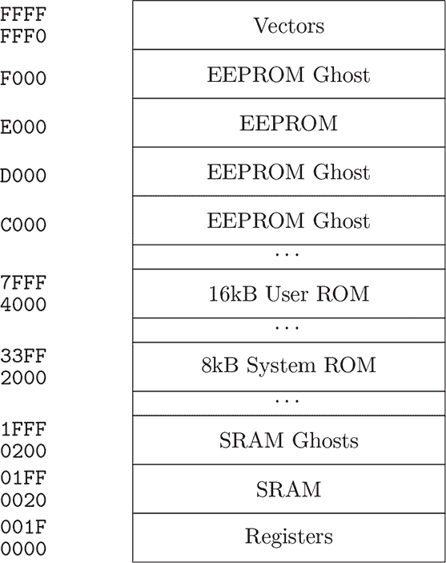

图 6.1：ST16CF54 内存映射

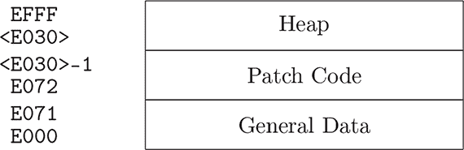

图 6.2：Nagra1/Rom3 EEPROM 映射

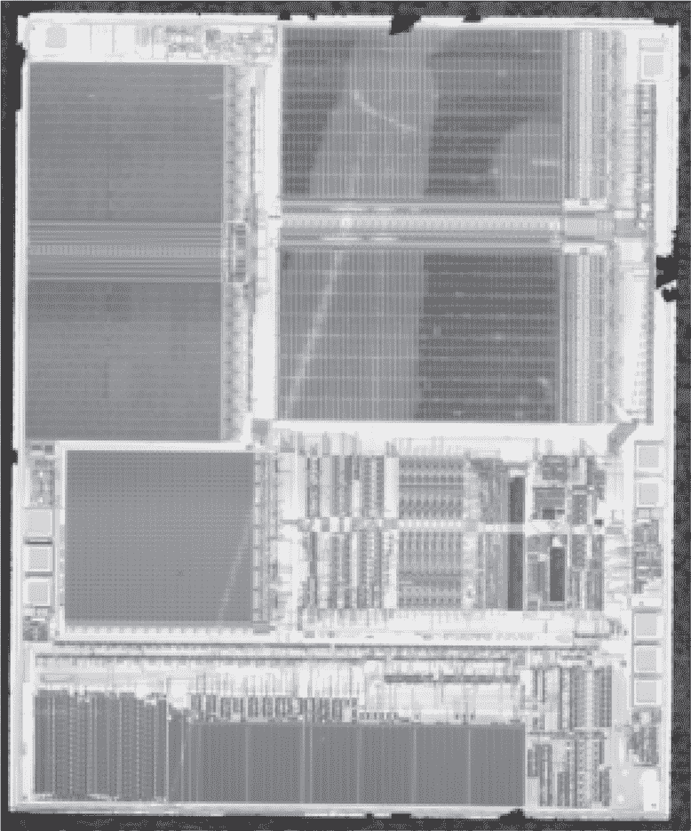

图 6.3：去除延迟的 ST16CF54A

这张卡的文档宝库可以在 Guy（2000b）中找到，完整 ROM 的注释反汇编版本可以在 Guy（2000a）中获得。唯一的公开文档曾经是一个三页的营销简报，但在 STMicro（1996）的法庭记录中曝光了真实的数据手册副本。除了缺少描述系统 ROM 的附带文档外，它是完整的。

### **漏洞**

漏洞本身是一个静态分配的字节缓冲区溢出，它首先保存传入的 APDU 数据包，随后被重新用于传出的回复。这是一个典型的缓冲区溢出，但有一些复杂的情况需要绕过。

首先，缓冲区位于`0x019C`，它是 SRAM 中的最后一项。智能卡数据包最大可以达到 255 字节长，但在 SRAM 结束（`0x01FF`）之前，只有 100 字节。之后，官方内存映射显示系统 ROM 之前有一个较大的空白区域。

这里的技巧使得该漏洞可被利用，原因在于 SRAM 在内存中有幽灵效应。超出 SRAM 末尾 132 字节并进入我们 100 字节缓冲区时，写入`0x0220`的效果与写入`0x0020`或`0x0420`相同。因此，尽管我们溢出的缓冲区在全局变量和调用栈之后，我们仍然可以利用幽灵效应从内存的开头开始循环，并破坏有用的数据。

对于从`0x00`到`0x1F`的寄存器，没有幽灵效应，因此我们不需要像尝试保护 SRAM 一样仔细选择这些值。

另一个值得关注的效果是，SRAM 中较早位置的全局变量保存了接收缓冲区的索引。数据包是逐字节接收的；当该变量被覆盖时，目标位置将在其余字节拷贝时发生跳转。这对于削减数据包的字节数很有用，但如果忽略它，漏洞可能会失效，导致程序崩溃或调整 UART 时序。

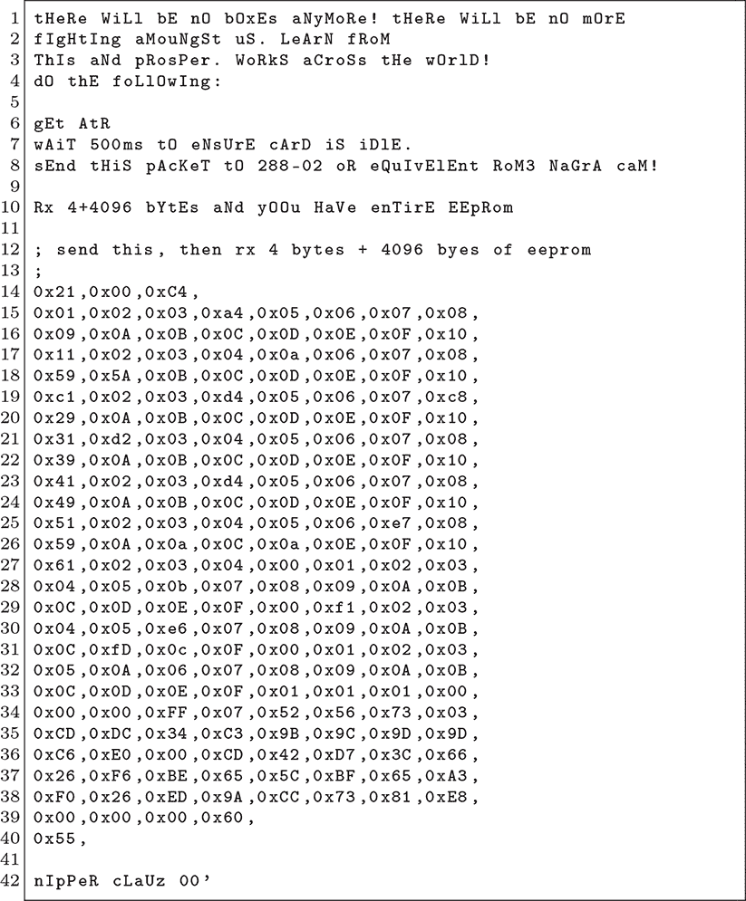

图 6.4：NipperClauz（2000）论坛帖子

### **NipperClauz 漏洞**

现在我们已经覆盖了理论部分，接下来深入探讨第一个公开示例，NipperClauz（2000）。论坛帖子在图 6.4 中重现，在本节中我们将对其进行反汇编，理解它是如何工作的。

这前三个字节是事务头，其中`0xC4`表示长度。

之后是很多看似无意义的字节计数行，有时被更有意义的字节打断。这些字节大部分无关紧要，但后面的字节确实会覆盖全局变量，若这些变量的值错误，可能会导致漏洞失效，甚至导致应用崩溃或调整 UART 时序。

Shellcode 从第 35 行中间开始，它回调 ROM 中的字节传输函数，地址是`0x42d7`，以保持较短的长度。

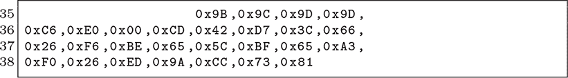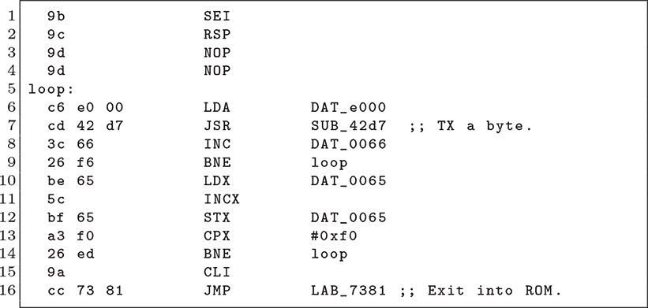

漏洞的结束部分包含一些填充和一个校验字节。

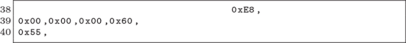

### **NDS 主机端漏洞**

Mordinson（1998）附录 F 描述了相同漏洞的另一种利用方式。以下是该报告中的原始漏洞代码，采用`nasm`汇编格式，注释做了些微的修改。

注意评论的清晰度，几乎解释了每一条指令，并提供了加载到内存中的确切地址。它没有调用 ROM 中用于传输字节的函数，而是实现了自己的传输函数，地址是`0x01c8`。

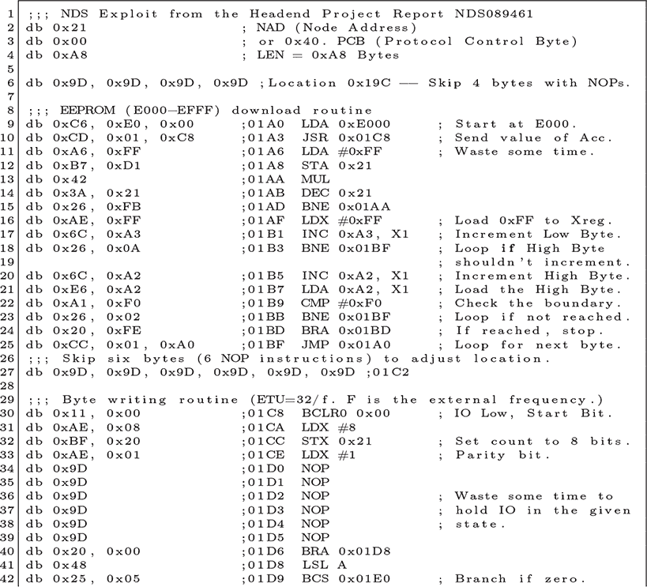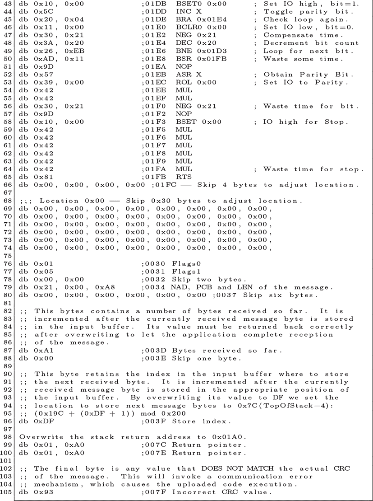

### **Go 语言中的现代漏洞**

这两个漏洞都可以成功地转储卡片的 EEPROM。本书的内容是编写漏洞，而不是运行漏洞，因此我订购了十几个卫星接收器和各种卡片，直到我找到一些易受攻击的卡片。在本节中，我们将介绍 Goodspeed（2022），我为这些卡片编写的漏洞，它可以在现代计算机上运行，配合 USB 智能卡适配器，不仅转储 EEPROM，还包括用户 ROM 和它没有损坏的 SRAM。

要获得你自己的卡片，只需收集一堆卡片，然后读取卡片的复位应答（ATR）。你要找的是那些 ROM 显示为`DNASP003`（表示 ROM3）并且其 EEPROM 版本显示为`Rev272`或更早的卡片。我的一些卡片错误地显示了较新的 EEPROM 版本，以假装它们已经被修补，因此不要总是相信版本号告诉你卡片不是易受攻击的。

这些卡片当然已经被破解用于电视盗版。被破解的卡片也可以通过电子序列号与打印的序列号不一致来识别。

第一个复杂问题是，Headend 和 NipperClauze 漏洞会在一次交易中转储所有 EEPROM。智能卡交易有一个字节的长度字段和一个校验和，因此响应数据比长度字段应允许的更多，并且校验和总是错误的。当这些漏洞是在 90 年代编写时，这并不是问题，但现代智能卡适配器使用 USB 而不是串口。USB 的智能卡标准（CCID）抽象了数据包，要求所有长度和校验和都正确。

为了解决这个问题，我将交易缩减为 64 字节，并编写了一个接受转储基础地址的 shellcode。像其他漏洞一样，我的代码不支持干净的续传。我发现通过在每次交易时重置卡片来避免续传的麻烦是很方便的。

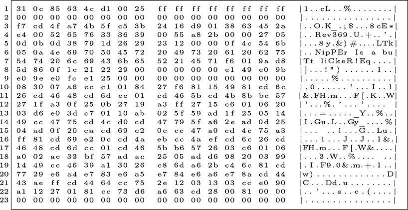

图 6.5：修订版 369 EEPROM 转储

你会注意到，我的 shellcode 没有包括其他示例中的三个字节的头部或一个字节的尾部。这是因为 PCSC 守护进程会自动将头部和校验和应用到交易中。由于 shellcode 每次执行只转储 64 字节，因此必须将起始地址写入循环中的`ld a, (target+1, x)`指令中，其中`0xFFFF`位于清单中。

为了将回复传回主机，shellcode 跳转到`0x757f`的用户 ROM 函数。这是 ROM 用于传输消息的正常函数，比像 NipperClauz shellcode 那样重新利用传输一个字节的函数要小一点。它也比实现一个完全自定义的传输函数要小，正如 Headend 漏洞所做的那样。

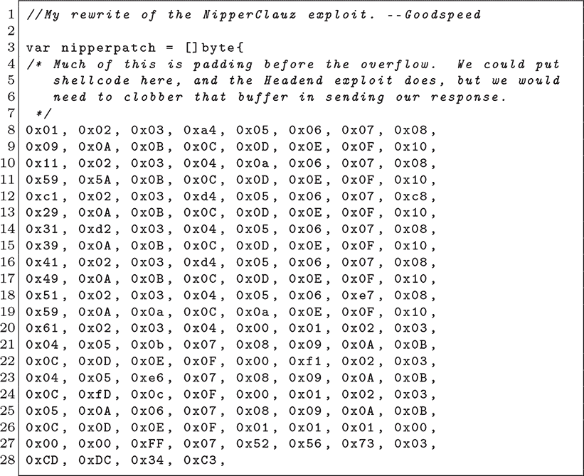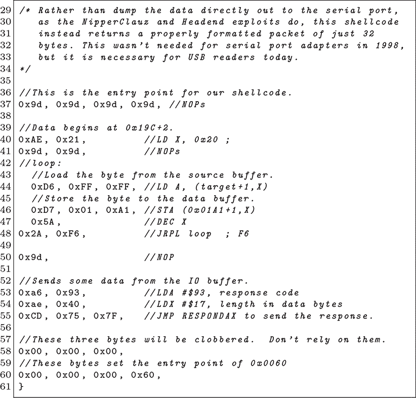
