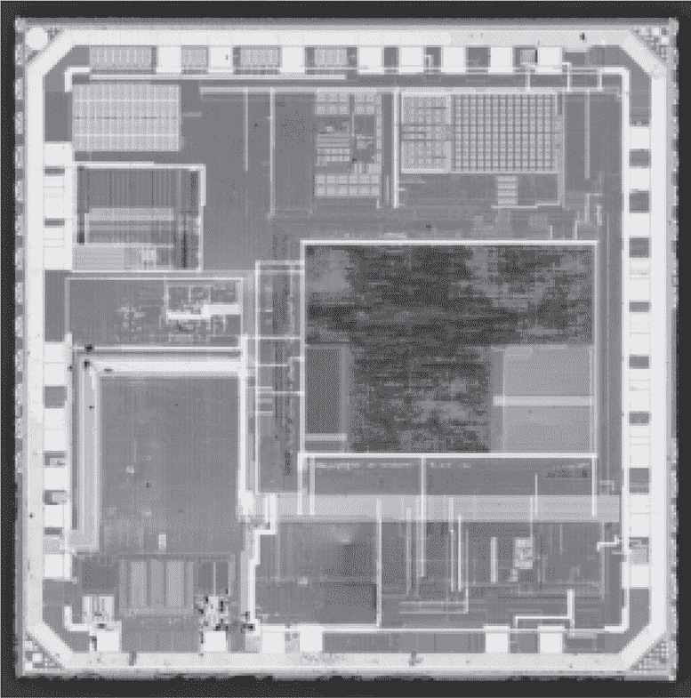
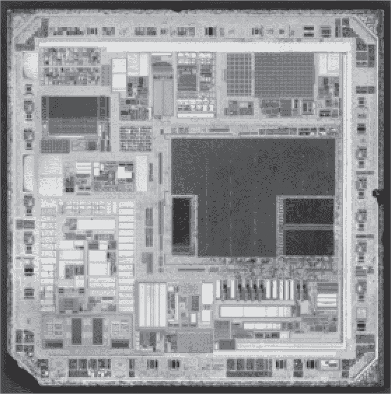
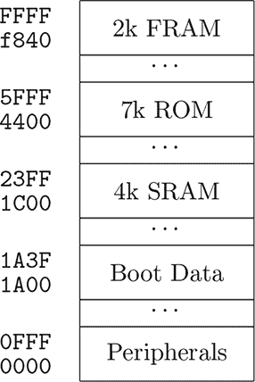
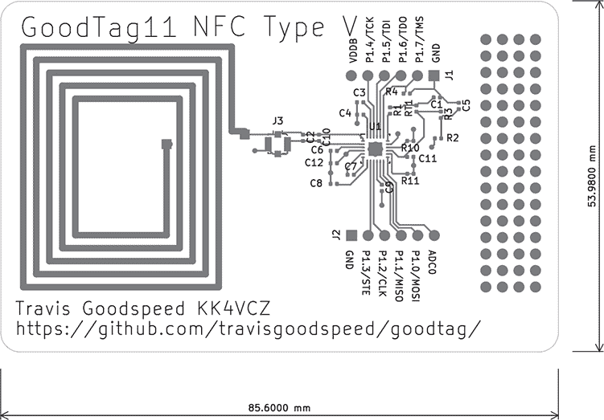
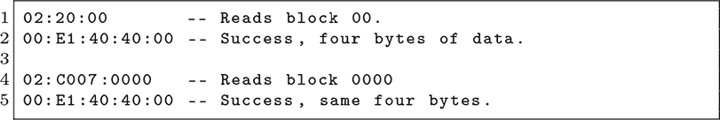
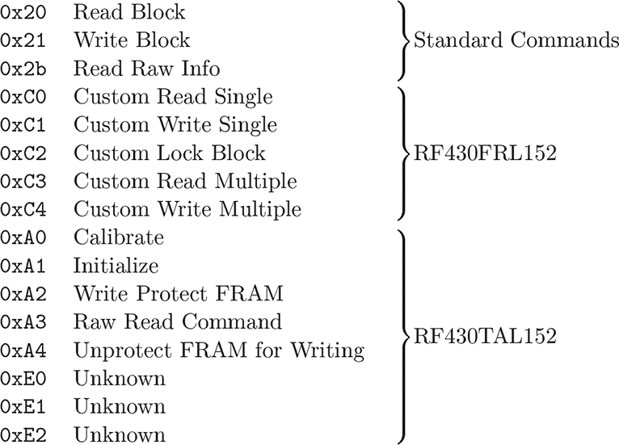
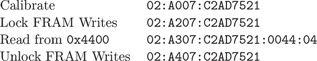
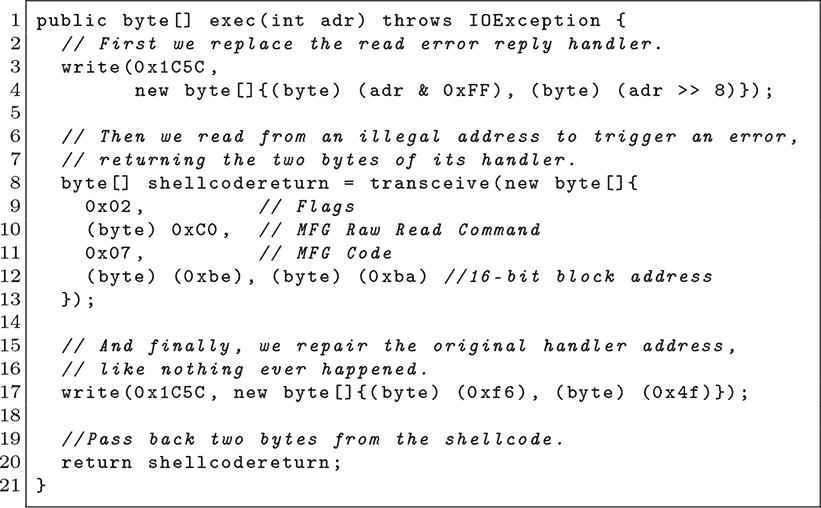
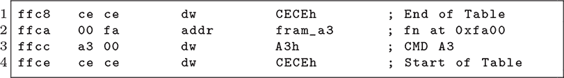

## **7 RF430 后门**

发现一个未列出的芯片实际上是一个带有自定义 ROM 的商用芯片并不罕见。RF430TAL152 就是这样的芯片，它基本上是一个 RF430FRL152，具有一个掩模 ROM，该 ROM 实现了在 Freestyle Libre 品牌下销售的血糖监测传感器。

在本章中，我们将讨论 RF430TAL152 中的一个后门，这一后门最早由 Goodspeed 和 Apvrille（2019）记录。我们将从公开的 FRL152 变种芯片开始，然后探索 TAL152 变种、其自定义命令以及一个后门。

### **RF430FRL152，商用变种**

TAL152 和 FRL152 都在 `0x4400` 处具有 7KB 的掩模 ROM，用于传感器应用。这两款芯片都不包含闪存；相反，它们使用一种新型的存储技术，称为铁电 RAM（简称 FRAM）。像闪存一样，它是非易失性的，内容在没有电源的情况下依然会保存。像 SRAM 一样，它在写入时非常省电。

针对 ROM 的小补丁被加载到 `0xF840` 处的 2KB FRAM 中。另有一个小的 FRAM 区域位于 `0x1A00`，存储着序列号和校准值。

FRAM 是一种奇特的存储器，让我们快速回顾一下它的特性。在最低层级，写入操作需要的功率非常小，大多数位在没有电源的情况下能持续几十年。像 DRAM 和磁芯存储一样，读取操作是破坏性的。

图 7.1：RF430TAL152 表面

图 7.2：RF430FRL152 去层化

破坏性读取和偶尔的位错误会导致致命缺陷，因此内存控制器通过自动写回、错误更正和缓存来纠正这些问题。在更高层级，程序员可以假装它是 RAM，唯一与之相矛盾的证据就是有时读取比写入稍微需要更多的时间和功率。不是很有趣吗？

该芯片拥有比你预期的更多 SRAM，其中 `0x4400` 位置有 4KB 的 SRAM。SRAM 在 MSP430 架构上是可执行的，它可以映射到 ROM 的一半位置，用于开发自定义 ROM。开发人员还可以将普通代码存储在 SRAM 中，但这样做的风险是，电源故障时这些代码可能会被完全删除。

因为 ROM 的修改需要昂贵的掩模修订和重新制造，所以商业版和自定义 ROM 都支持在 FRAM 中打补丁。这些补丁会挂钩一个函数指针表中的条目，将来自 ROM 版本函数的调用重定向到 FRAM 中的替代函数。

由于 FRAM 不仅用于代码，还用于数据，它可以看作是芯片剩余地址空间的一个窗口，也是进行完整数据转储的第一步。稍后在本章中，当我们开始利用一个被锁定的 TAL152 芯片时，你将看到这一点。

FRL152 可以通过 JTAG 以令人沮丧的现代电压 1.5V 进行读取和写入。德州仪器（Texas Instruments）提供了一个开发套件，零件号 RF430FRL152HEVM，其中包括电平转换，支持其调试工具的 3.3V 电压。这使得可以从芯片的商业版本中提取 ROM 并进行反汇编。

Freestyle Libre 血糖传感器中的 RF430TAL152 采用不同的 ROM，JTAG 连接无法使用，但它支持相同的 NFC Type V 协议，标准化为 ISO 15693。该协议在 Android 上得到了良好的支持，但在 Linux 上的 USB 读取器支持较差，因此它处于一个尴尬的位置：相比笔记本电脑，更容易通过手机应用程序被利用！

图 7.3：RF430FRL152 内存映射

图 7.4：RF430FRL152 承载板

### **来自 Android 的 NFC-V**

让我们暂停一下，讨论 NFC 标签在 Android 中是如何工作的，以及如何编写工具与 RF430 进行无线通信。

在 Android 中，NFC Type V 标签通过类 `android.nfc.tech.NfcV` 进行访问，其中的 `transceive()` 函数将字节数组发送到标签并返回结果。由于标签的命令集、块大小和寻址模式等属性差异很大，因此使用这些原始命令而不是更高层的封装函数。

NFC-V 交易以一个选项字节开始，通常是 `02`。接下来是一个命令字节和可选的命令参数。如果选项字节指示，可以在中间插入显式地址。命令字节大于 `A0` 时，需要跟随厂商编号，对于 TI 来说是 `07`。参见 图 7.5 获取一些示例命令。

你可以在 NFC Tools 应用中自己尝试低级命令，应用的 Other/Advanced 标签页在显示警告声明后接受原始命令。只需将 I/O 类设置为 `NfcV`，然后发送以下示例命令，再使用它们来实现我们自己为芯片编写的高级功能。

我们稍后会介绍更多命令，但现在你需要注意一般格式。在这里，`20` 是用于从 8 位块地址读取块的标准命令，而 `C0` 是用于从 16 位块地址读取块的秘密厂商命令。每个回复的第一个字节为零表示成功，非零表示失败。

图 7.5：NFC-V 命令动词

图 7.6：TAL152 示例命令

`C0`（读取）命令和匹配的 `C1`（写入）命令接受 16 位地址，但它们仍然局限于 FRAM 和 SRAM 的子集。在下一部分中，我们将看到如何将一些 shellcode 写入 FRL152，并执行它以实现真正的任意读取。

### **FRL152 上的 Shellcode**

FRL152 上的 FRAM 可能包含一个命令处理程序表。如果找到该表，其条目将被复制到接近 SRAM 开始部分的函数指针数组中。此外，`C0` 和 `C1` 命令允许我们自由读取和写入 SRAM，因此可以为远程代码执行提供充分的控制。

虽然我们可以覆盖调用堆栈，但覆盖早期 SRAM 中的函数指针表，用指向我们函数的指针要容易得多，因为我们一次只能写入 4 或 8 字节。

有许多函数可供选择，一个理想的钩子是不会被正常函数忽略的。我们还希望尽可能有续接功能，以便执行代码时不会使目标崩溃。

我们将要覆盖的函数指针位于 SRAM 中的 `0x1C5C`，指向 ROM 中 `0x4FF6` 处的 `rom_rf13_senderror()`。为了正确的续接，Shellcode 必须向 `RF13MTXF` 外设写入两个字节，然后返回。如果没有这两个字节，协议将被违反并触发 Java 异常。要取消挂钩，只需将 `0x4FF6` 写入 `0x1C5C`，恢复原始处理程序。

图 7.7 展示了我用 Java 编写的方法，用于在任意地址执行 Shellcode 并将两个字节返回给调用者。这两个字节恰好是续接所必需的，但从漏洞利用中获得一些反馈总是不错的。

图 7.7：在 RF430FRL152 中执行 Shellcode

### **RF430TAL152，医疗版**

TAL152 葡萄糖传感器在布局和外观上与现成的 FRL152 非常相似，唯一的不同是掩模 ROM 的内容和 JTAG 配置。在本节中，我们将追溯从首次检查该芯片到最终转储其 ROM 并将自定义固件写入 FRAM 的漫长过程。

在首次实验该芯片时，我们发现 NFC 曝露了一个额外的 FRAM 块。每一页的最后一页都被写保护，我们无法通过标准写命令 `21` 修改它们。FRL152 的 `C0` 和 `C1` 厂商命令在这里不存在，因此我们也没有一个方便的方法来处理越界内存。

但一切并未失去！在最后一页有一个函数指针表，内存最后的复位向量值告诉我们，这个 ROM 与 FRL152 的不同，因此我们知道这两个设备的 ROM 中的软件是不同的。

这个表位于 NFC 可读的内存部分，因此我们可以使用方便的智能手机读取它。然而，它是写保护的，所以我们还无法写入补丁到该表。目前我们无法读取 FRAM 的较低部分，或任何 ROM 或 SRAM。

我们看到图 7.9 中的表格，它从`0xFFCE`开始，魔术字是`0xABAB`，然后向下扩展到较低地址的相同字`0xFFB8`。^(1) 该表中的每一项都是自定义的厂商命令，我们看到，类似于在 FRL152 中非常实用的`C0`和`C1`命令，TAL152 也有`A0`、`A1`、`A2`、`A3`和`A4`命令。`A1`和`A3`的处理程序位于 FRAM 中，我们至少可以读取它们的部分代码。

图 7.8：RF430FRL152 FRAM 命令表

图 7.9：RF430TAL152 FRAM 命令表

当然，表格很早就结束了，`E0`、`E1`和`E2`被禁用，因为`E0`的命令号已被表格结束标记覆盖。这些命令在制造过程中的某个时刻是可用的，我们可以从 FRAM 中读取它们的命令处理程序，但无法执行它们。

调用这些函数有些令人失望。`A1`返回某种设备状态，但其他`Ax`命令甚至没有给我们返回错误信息。部分汇编代码难以看出原因，但我们后来得知，它们需要一个安全密码。

在尚未能够运行`A3`命令时，我们读取了它的反汇编代码。该函数首先调用`0x1C20`处的另一个函数，然后读取原始地址和长度，接着将请求的数量的 16 位字发送到 RF13M 外设到读卡器。^(2) 如果我们能调用这个命令，就能转储 ROM 并逆向工程其他命令的行为！

#### **嗅探读卡器**

为了在没有固件转储的情况下获得密码，我们必须嗅探合法读卡器尝试调用除`A1`以外的任何`Ax`命令，以便我们能够了解密码，并使用`A3`转储原始内存。我们通过触摸制造商专用硬件读卡器的 SPI 总线以及通过 Frida 观察厂商的 Android 应用程序分别找到了这个密码。^(3)

32 位密码`C2AD7521`是`A0`命令的一个参数，该命令在注射到患者的手臂后初始化葡萄糖传感器。在`A3`中尝试相同的密码，并跟随地址和长度，使我们能够读取原始内存。循环发送此命令可以完全转储 ROM 和 SRAM，以及完全转储 FRAM 区域。这些区域无法通过标准读取命令`20`访问，该命令需要块地址。

#### **TAL152 ROM 内部**

将这个完整的转储加载到 Ghidra 中显示，ROM 与 FRL152 的 ROM 相关，但它们已经有了很大的差异。TAL152 没有直接实现厂商命令；相反，必须通过补丁表添加这些命令。

我们也没有写入 FRAM 的能力，因为它是写保护的。果然，`A2`命令会写保护通过 NFC 暴露的每个 FRAM 页面，而`A4`则解锁这些页面！命令列表见图 7.5。

调用`A4`命令后，我们可以解锁页面并开始修改。简单地写入`0xFFB8`将重新启用`Ex`命令，允许我们实验恢复旧传感器。或者我们可以编译自己的固件运行在 TAL152 中，将一个葡萄糖传感器变成完全不同的东西。

### **其他解锁技巧**

在尝试提取 TAL152 的内容时，我们遇到了一些死胡同，但这些方法可能对你在其他目标上有效。

我们无法建立连接，但 TAL152 的 JTAG 似乎已经解锁，如果它遵循与 FRL152 相同的约定。这可能是由自定义激活密钥引起的，但无论是不同的锁定机制还是不同的密钥，我们都未能建立连接。我后来听说，TAL152 的接线不同，需要调整接线才能建立连接，但我尚未在我的实验室确认这一点。

我们尝试通过将芯片加热到其居里点以上，将其恢复到出厂设置。我们的理论是，热量可能会抹去 FRAM 中的数据，同时保留 ROM 中的数据，这样 ROM 就可以自由读取。

德州仪器应用报告 SLAA526A，*MSP430 FRAM 的质量与可靠性*，让我们相信这个温度接近 430°C。短时间的热风枪和强磁铁实验没有成功，但我们希望有一天能将芯片在窑中烘烤几个小时，以寻找位错误。

芯片上的测试引脚引起了我们的好奇心，因为其他芯片使用它们进入引导加载程序，而这些芯片可能也用它们来恢复到出厂状态。这种方法可能和过热 FRAM 一样有效，而且避免了极端温度带来的麻烦。

值得注意的是，我们成功的方法——使用`A3`命令和制造商的密码——可以通过*接触硬件读取器的 SPI 总线*来完成，*或者*通过从制造商的 Android 应用中读取相同的密码来完成。在逆向工程中，任何有效的技巧都是好技巧，而且通常有不止一种方法可以完成任务。
