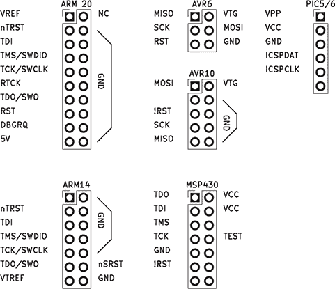
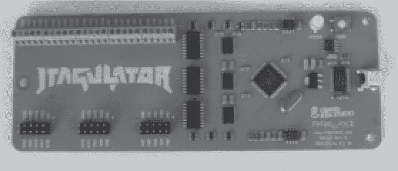

## 第八章：**8 JTAG 和 ICSP 基础**

JTAG 接口是一种与微控制器通信的低级方式，通常用于调试或设备工厂的初始编程。

JTAG 由四个必需信号组成：TDI、TDO、TCK 和 TMS。TDI 和 TDO（测试数据输入/输出）负责将数据传入和传出芯片，而 TCK 提供数据的时钟信号，TMS（测试模式选择）则指示芯片的状态。一个可选的第五个信号 TRST 可以重置测试逻辑。

还有一些减少引脚数的 JTAG 变种，如 ARM 的单线调试（SWD）和 MSP430 的 spy-bi-wire。这些变种的优势在于它们需要的引脚更少，有时比 4 引脚的协议变种更容易实现。

我暂时不会深入探讨这些协议的复杂细节，但了解一些历史背景是值得的。JTAG 最初作为一种测试 PCB 连接性的方式，后来才被扩展为用于调试微控制器。对芯片的调试访问通常是非常底层的，并且必须为不同版本的芯片以不同方式实现。

除了 JTAG，许多微控制器供应商还提供自己的串行接口用于编程或调试。Microchip 的 PIC 和 AVR 系列称之为在线串行编程（ICSP）。

### **JTAG 适配器和软件**

JTAG 最初只是一个物理层，但在它之上已经建立了一个完整的软件和工具生态系统。其中一些有文档记录，一些则是机密或专有的。这就是为什么工具选择如此令人困惑的原因。

就像大多数嵌入式开发者不能立刻说出他们最喜欢的微控制器的流水线阶段数一样，他们也很少需要从头开始实现 JTAG。为了提取固件，我们应当记住使用现成适配器与从头编写新适配器之间的区别。

在硬件方面，大多数流行的微控制器供应商提供自己的半专有适配器。这些适配器可能很昂贵，但有一个漏洞是，开发板上也包含了相同的适配器，通常一个非常便宜的评估套件（EVK）可以被重新布线用于调试任何芯片，而不仅仅是与之一起出厂的型号。

还有一些供应商专门提供适用于各种板子的 JTAG 适配器。Segger 的 J-Link 特别受欢迎，提供从廉价学生套件到极其昂贵的型号。高端适配器不仅能调试代码，还能实时追踪代码，几乎不影响性能。

最后，还有一些开源适配器，如我以前为 MSP430 制作的 GoodFET。一个流行的解决方案是使用 FTDI 芯片进行大爆炸 IO 调试，支持多种目标。你也可以使用树莓派的 GPIO 引脚，因为这些引脚的延迟比 USB 适配器低得多。

在软件方面，既有专有软件也有开源软件。专有软件通常在记录功耗和执行追踪方面具有优势，有时与商业开发工具集成得更好。虽然专有软件可以通过开发者 API 进行定向，但开源替代方案包括适用于各种芯片的脚本，并且通常可以非常快速地适应新的目标。OpenOCD 并不是唯一的开源适配器，但它通常是获取 GDB 调试会话的一个良好目标，适用于新的芯片。

### **发现引脚布局**

对于一个已知的、带有良好文档的方便封装的芯片，追踪 JTAG 引脚并不困难，这些引脚应该在数据表上有明确标记。但当引脚布局未知，或者芯片本身没有文档时该怎么办呢？幸运的是，我们有一些选择。

为了方便起见，许多 PCB 设计师为其架构使用行业标准的 JTAG 连接器。如果你看到芯片附近有一个两排的引脚头，包含 10、14 或 20 个引脚，那么很可能是 JTAG。如果接地引脚符合标准并且数据引脚直接连接到你的芯片，这个猜测就更准确。如果是 PIC 和 AVR 芯片，则不支持 JTAG，但它们有自己的六针标准。有关示例，请参见 图 8.1。

当然，也会出现违反标准的情况。在像 第十二章 中的 HID iClass 读卡器这类安全主题设备中，这可能是为了防止逆向工程。你还会看到由于其他原因偏离标准布局的情况，例如引脚被意外交换，或者 PCB 设计师在各种 14 针调试器标准之间混淆。

Heinz（2006）描述了一种 AVR 固件、GTK GUI 和算法，用于识别候选引脚中的 JTAG 信号，它通过使用 1 位的 BYPASS 寄存器将信号从目标回传。这一项目已不再维护，但 Grand（2014）描述了 JTAGulator，这是一种现代的开源 JTAG 引脚布局查找器，基于 Parallax Propeller 芯片构建。

图 8.1：常见的 JTAG 和 ICSP 引脚布局

图 8.2：Grand（2014）的 JTAGulator

如果我们能够自动找到引脚，并且如果 JTAG 真的只是一个交换一些寄存器的方式，那么应该可以枚举这些寄存器，导出一个列表以供进一步调查。Domke（2009）提供了一个算法和实例，正是用来做这些的。

在工厂中，JTAG 不仅用于编程芯片，还用于验证它们之间的连接，确保所有引脚已被焊接。Skowronek（2007）描述了一个算法，用于恢复多个芯片之间的引脚连接，这一算法成功地被用于逆向工程他从废料堆中救回的视频处理板，使他能够在大约一天的时间内构建一个用于搜索 SHA-1 和 MD5 的 8 字符密钥空间的破解工具。

### **总 JTAG 锁**

现在我们已经介绍了 JTAG 的工作原理、如何找到其引脚以及使用哪些 JTAG 硬件和软件，接下来让我们讨论特定芯片中使用的保护机制。在本书的后面章节，我们将专门介绍如何绕过各个保护机制。

MSP430 是一个很好例子，它采用了完全锁定的 JTAG。早期的芯片，如 MSP430F1xx、MSP430F2xx 和 MSP430-F4xx，通过烧录保险丝来启用保护模式。在 JTAG 调试器连接后，保险丝检查序列会测量芯片的保护状态。在后来的芯片中，电迁移保险丝被一个特殊的闪存字取代，但完全锁定的概念仍然保留。这些细节在德州仪器（2010）中有描述，基本足够实现一个从头开始的 JTAG 编程器。

乍一看，完全锁定似乎并没有给我们留下太多操作空间，也没有多少攻击面可以探索。我们怎么才能解锁一个只暴露无用的 BYPASS 寄存器的芯片呢？

一种方法是通过攻击其引导加载程序完全避免它。MSP430，像许多其他芯片一样，具有一个掩码 ROM 引导加载程序，即使在 JTAG 被锁定后也会保持启用。第 E.8 章描述了一种攻击方式，通过这种方式，可以在 JTAG 完全禁用的情况下，通过故障注入引导加载程序，泄露 MSP430F5172 的固件。

另一种选择是故障注入，以伪造保险丝检查的结果。我们可以在保险丝检查的时刻通过注入故障，使检查在应该失败的时候通过。有关通过注入照相机闪光灯光源来故障注入较旧 MSP430 芯片的保险丝检查的详细信息，请参见第二十章。

### **部分 JTAG 锁定**

完全 JTAG 锁定很容易实现，但它们让设计师感到紧张，因为它们几乎不留下任何用于故障分析的空间。如果 Bob 的小工具发生故障，他希望尽快知道是硬件故障还是固件问题，没有调试器他将没有太多线索。所以，与其让 Bob 实现自己的自定义后门，许多芯片制造商允许进行部分锁定，既保护了 Bob 的知识产权，同时仍然允许将新的固件写入芯片。

Nordic Semiconductor 的 nRF51 芯片是一款非常受欢迎的蓝牙低能耗（BLE）芯片。它使用一种基于内存保护单元（MPU）的部分保护机制，禁止调试器进行任何内存访问。你可以逐步执行现有代码，随心所欲地读取和写入 CPU 寄存器，但一旦你尝试直接从 RAM 或闪存中获取一个字，处理器将在下一时钟周期断开连接。Kris Brosch 发现了一个漏洞，虽然你无法直接从闪存中读取，但你可以在闪存中找到一个小工具，让它为你完成这项工作。有关详细信息，请参见第九章。

STM32F0 系列还提供了部分调试锁定。在 JTAG 开始调试 CPU 后，每当对闪存执行*任何*访问操作时，无论是由调试器本身还是 CPU 代码引起的，闪存都将从总线上断开。你不能重新使用闪存代码来提取指令，因为从闪存执行代码也会在连接调试器时触发锁定。幸运的是，对于攻击者而言，这个锁定发生得只晚一个时钟周期，因此可以在每次 JTAG 连接后读取恰好一个字的闪存内容，并且通过数千次连接，整个固件都可以被提取出来。详细信息请见第十章。

一些其他 STM32 设备具有部分锁定功能，这种功能不会受到 STM32F0 的首字暴露漏洞的影响。在这些设备中，存在一个巧妙的漏洞，即在中断调用过程中，使用单独的内存总线来访问中断向量表（IVT）。通常，这个表位于闪存的最开始位置，但攻击者可以利用向量表偏移寄存器（VTOR）来滑动中断表，通过触发中断调用并读取程序计数器，从而转储受保护的内存！详情请见第十一章。

即使我们没有针对特定芯片的 JTAG 漏洞，部分 JTAG 锁定也可以用于其他目的。通常，当闪存被锁定时，SRAM 可以被自由读取，或者可以将 shell 代码写入 SRAM 的未使用部分，并在下次启动时通过软件漏洞执行。而现代 CPU 的复杂性，即使是微控制器，也使得总会存在一些巧妙的角落案例，只要我们足够仔细，就能够发现它们。
