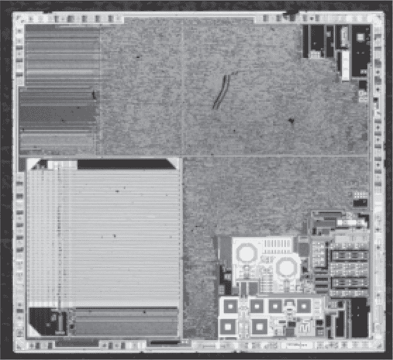
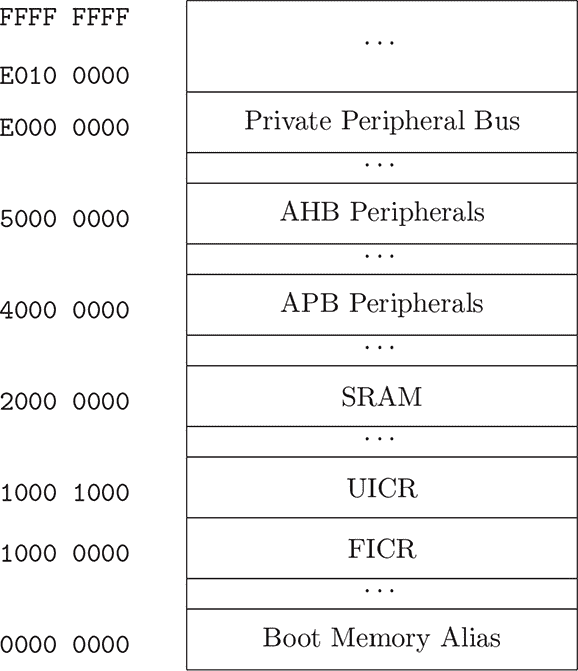
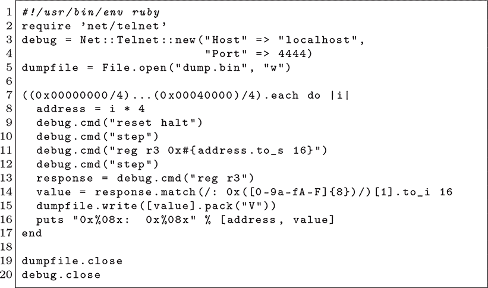

## **9 nRF51 ROM 中的工具**

本章首次在 Brosch（2015）中记录，描述了尽管有代码保护功能，如何从 nRF51822 中提取受保护的内存。其漏洞在于，尽管调试器不能直接读取受保护的内存或将 Shellcode 写入 SRAM，但它可以逐步执行闪存中的受保护代码。

虽然此版本是针对 nRF51 系列描述的，但 Obermaier、Schink 和 Moczek（2020）在描述 CKS32F103 和 GD32VF103（这两款是流行的 STM32F103 的克隆）时也提到了一种类似的漏洞。Kovrizhnykh（2023）指出，Sonix 的 SN32F248B 也曾被相同的技术利用。

### **学习所有规则**

nRF51 的保护机制在 第九章 中有详细记录（Nordic，2014），它是内存保护单元（MPU）的扩展。MPU 类似于内存管理单元（MMU），不过它的粒度较粗，并且不支持虚拟内存。

该芯片最常见的读取保护方式叫做“Protect All”（`PALL`），其配置方法是将零写入 I/O 端口 `UICR.RBPCONF.PAL`。此保护旨在防止 SWD 调试器访问代码区域 0、代码区域 1、RAM 或任何外设，除了 `NVMC` 外设、`POWER` 外设中的 `RESET` 寄存器，以及 `MPU` 外设中的 `DISABLEINDEBUG` 寄存器。你通常会看到引导加载程序在每次启动时执行此保护，但该保护是持续有效的。只需应用一次保护即可。

图 9.1：NXP nRF51822

图 9.2：nRF51822 内存映射

图 9.3：Brosch 的 PoC nRF51822 漏洞利用

还有一些较低级的保护模式，这些模式限制代码区域 1 访问代码区域 0。此类模式的目的是保护软设备，这些设备是通常需要商业授权的二进制广播驱动程序，但仍允许自定义代码与其并行运行。这些二进制代码在较低区域自由运行，尽管上层区域可以调用下层区域，但不能将该区域作为数据读取。

参考手册还提到，不论保护模式如何，CPU 从代码内存中获取指令时不会被拒绝，并且从 `0x00` 到 `0x80` 的中断表不受保护。

### **绕过规则**

在我们已经了解了保护的已记录行为之后，有必要做一些实验并学习未记录的规则。Kris Brosch 发现，通过将调试器连接到锁定的芯片，他获得了相当大的自由度来引导 CPU。他可以读取和写入寄存器，包括程序计数器。他还可以读取一些内存映射寄存器，如 `0x10001004` 处的读取回保护配置（`RBPCONF`）。

最重要的是，尽管他不能直接通过调试器从受保护区域读取，但他可以单步执行现有代码，控制指令前后的寄存器值（作为输入和输出）。

他重置了芯片，这会从中断向量表加载程序计数器和堆栈指针，然后将程序计数器的值读取回来为`0x000114cc`。因此，他知道`0x00000004`处的复位向量值应该是`0x000114cd`。（奇数指针表示 ARM 的 Thumb2 模式，但程序计数器本身并不持有奇数值。相反，那个状态位被保存在状态寄存器中。）

知道内存中的一个词后，他反复将所有寄存器加载为`0x00000004`，并将程序计数器跳转到新的地址，直到看到`r3`的值变化为`0x000114cd`，这表明出现了一个任意读取的小工具！

这个小工具是`ldr r3, [r3, #0]`，它出现在复位处理程序的第二条指令中。通过不同的`r3`值反复跳入这个小工具将暴露所有内存。

Brosch 的概念验证可以在图 9.3 中找到。telnet 连接的是 OpenOCD，假设小工具出现在复位处理程序中。如果小工具出现在目标的其他位置，你需要调整相应的设置。
