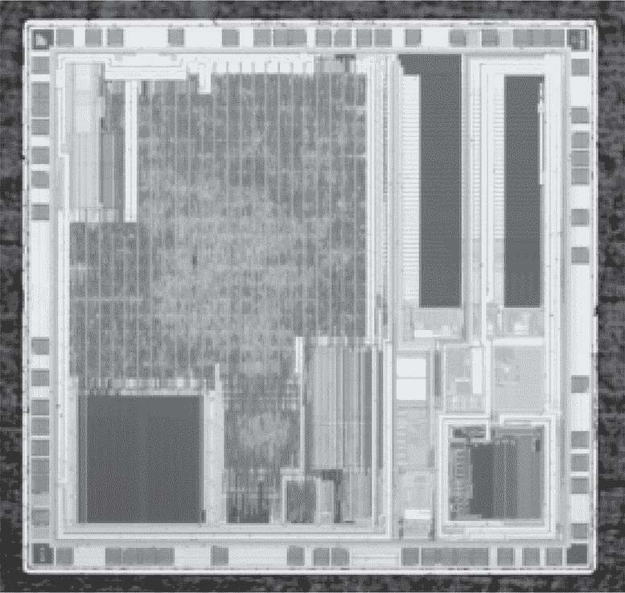
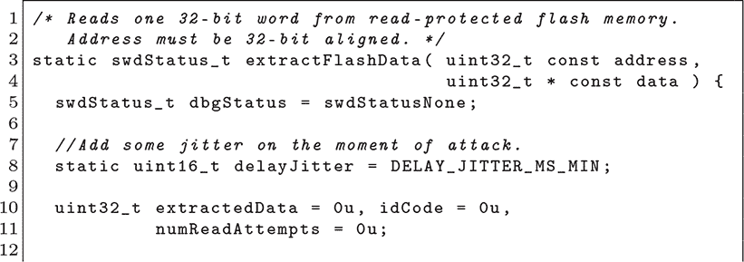
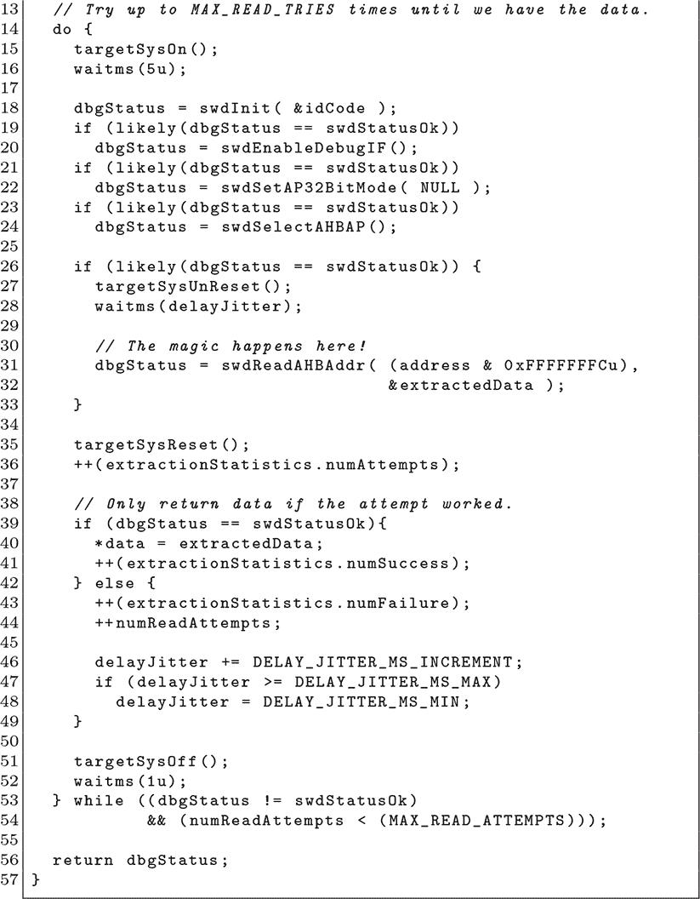

## 第十章：**10  STM32F0 SWD 字词泄漏**

许多微控制器允许某种部分锁定模式，在这种模式下，调试器可以附加上去，但代码仍然受到保护。在 STM32 系列中，这对应于 RDP 级别 1，在此级别下，调试器连接后闪存会被断开。本章描述了 STM32F0 系列中的一个漏洞，其中闪存断开发生得比预期晚了两个时钟周期。经过精心设计的调试器可以每次连接转储一个字。

该漏洞首次在 Usenix WOOT 上描述，出现在 Obermaier 和 Tatschner（2017）论文的结尾处。

### **漏洞**

如我们在第二章中讨论的，STM32 的读出设备保护（RDP）功能有三个级别。级别 0 是无保护的，而级别 2 则是完全的 JTAG 锁定，拒绝所有连接尝试。级别 1 是大多数商业设备采用的中间设置；它通过在 JTAG 连接时断开闪存与总线的连接来工作。其目的是允许进行故障分析或重新编程，同时仍然防止提取闪存用于克隆或逆向工程。

你可以使用 OpenOCD 或其他 JTAG 调试器验证这一点。描述是正确的：连接到被锁定的芯片是可行的，但无法从闪存中读取任何有用的信息。你可以读取 RAM，或将内容写入 RAM，但代码不能从闪存中读取或执行代码。

图 10.1：STM32F042

Obermaier 的独特观察是，大多数 JTAG 调试器在连接时执行多个事务，而*第一次*内存访问负责锁定闪存，但该读取操作通常在锁定应用之前就已完成！

为什么是*通常*而不是总是？细节对于漏洞利用并不重要，但原文论文做出了有力的论证，认为这是一种总线争用问题。作为一种解决方法，似乎在访问失败后重试是足够的，且在顽固的情况下，添加随机延迟可能会有所帮助。

### **漏洞利用**

Obermaier 的漏洞利用程序作为独立固件运行在一颗 STM32 上，它实现了 SWD 协议来转储目标芯片的内容。完整源代码可用，以下是他用 C 语言编写的从受保护内存中转储一个 32 位字的函数。SWD 比 JTAG 更容易实现，在这个漏洞利用中，你会看到 SWD 的实现不到六百行代码。

注意，每次尝试时，代码必须在新的调试会话中重新连接，因为读取后闪存会被断开。由于单个尝试经常失败，因此必须重试直到事务成功。

