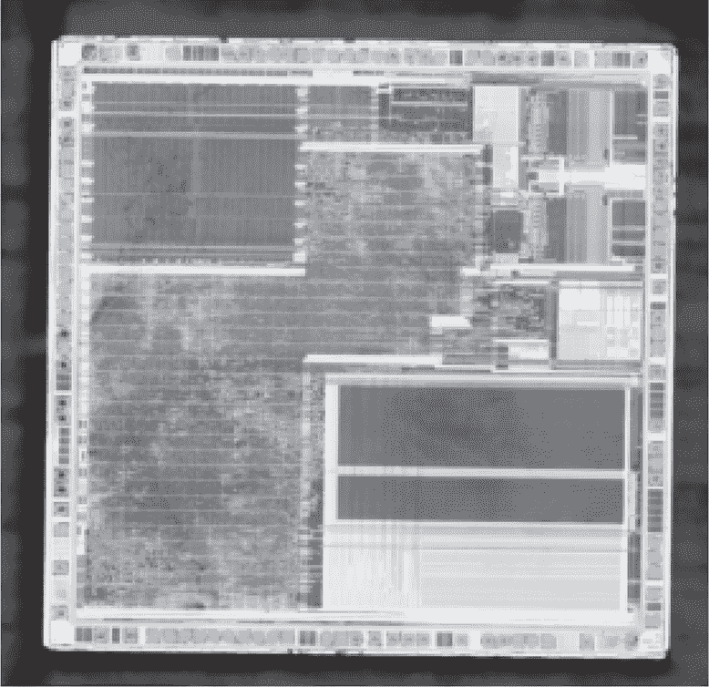
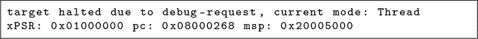
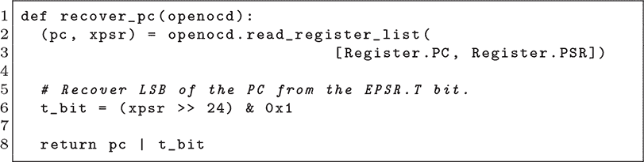
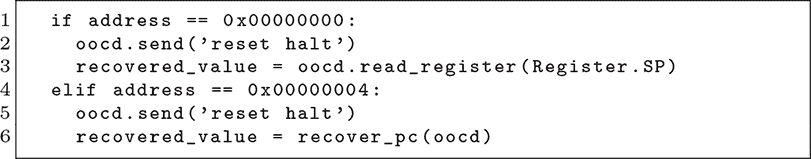
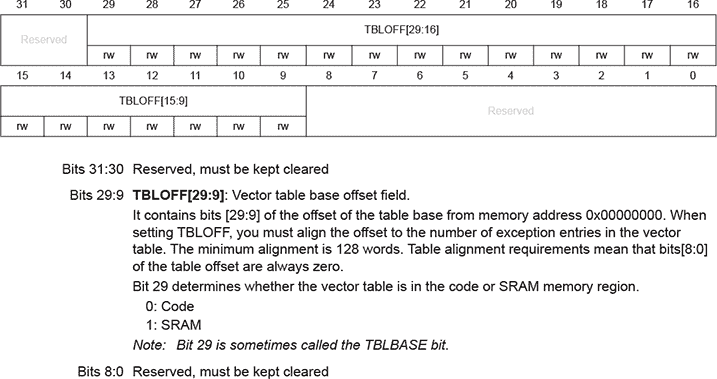
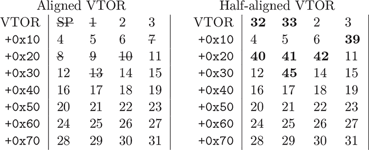
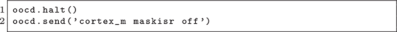
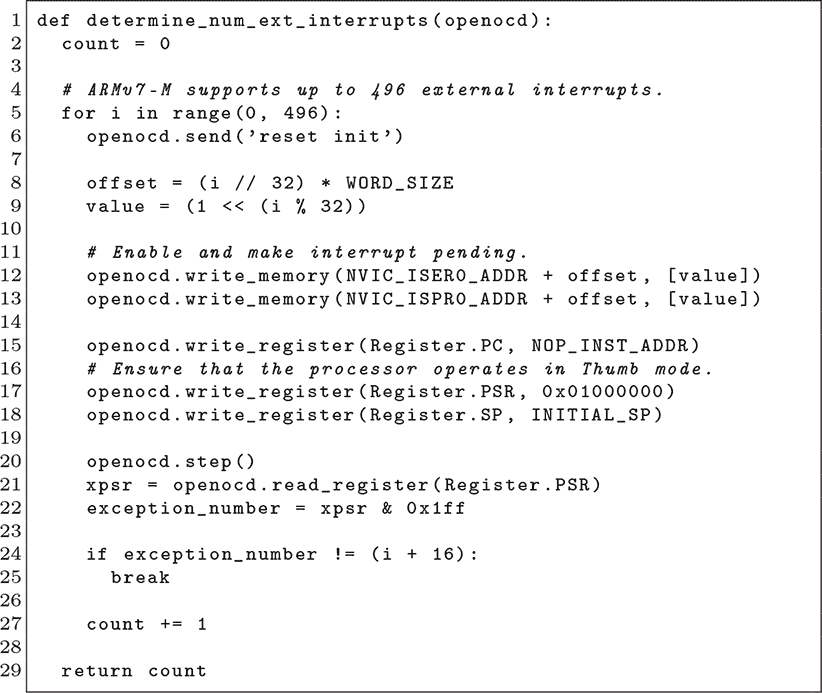

## **11  STM32F1 中断拼图**

STM32 系列的 RDP Level 1，其中允许 JTAG 调试但会立即断开闪存连接，是一个具有吸引力的内存提取漏洞目标。STM32F1 系列似乎不易受到 Obermaier 的 STM32F0 漏洞攻击（见第十章）或 DFU 引导程序漏洞攻击（见第二章），但在本章中，我们将讨论一个不同的漏洞，这个漏洞最早由 Schink 和 Obermaier（2020）描述，针对的是 STM32F1 系列，随后 Obermaier、Schink 和 Moczek（2020）也描述了针对其两个克隆版本——APM32F103 和 CKS32F103 的漏洞。作为额外说明，STM32F1 系列不支持 RDP Level 2，因此该系列的所有部件可能都容易受到攻击。

当启用保护时，调试器连接时，闪存会与主内存总线断开连接。你无法将其作为数据获取，也不能将其作为代码执行。这里的技巧是，尽管闪存在代码和数据获取时与主内存总线断开连接，但中断仍然可以触发。尽管断开连接，中断地址仍然可以从中断向量表（IVT）准确获取！这个表也是可以移动的，通过缓慢地将表步进过内存，我们可以将大部分内存字移入程序计数器，以便调试器捕捉。

图 11.1：STM32F103

### **前两个字**

Schink 的论文从这个简单明了的例子开始，在该例子中，他首先通过 SWD 连接一个 Segger J-Link 适配器，然后在 OpenOCD 的 telnet 会话中输入`reset halt`，从而揭示了`0x08000268`是复位向量的高 31 位，即闪存中的第二个字。`0x20005000`是初始堆栈指针，位于第一字。

程序计数器的低位（1）被设置为所有真实处理程序地址的指示，表示为 Thumb2 模式，但它也可能清除为（0），因此我们需要恢复该位以进行真正的攻击。这是因为，与真实的中断表不同，假中断表大多由非中断处理程序地址的指令或数据组成。Schink 通过首先读取程序计数器（其低位被强制清除），然后从`ESPR`中获取 Thumb2 模式来恢复缺失的位。

这将为我们提供闪存的前两个字，但通过阅读代码，你会看到这是一种特殊情况，因为触发复位也会将中断表移动回闪存的开头。

### **剩余内存**

对于所有其他地址，必须缓慢地将整个中断表步进过闪存，然后必须人为地触发单个中断，以便将表项移动到程序计数器。

第一个复杂性是列表中的七个条目是无法使用的。我们已经讨论过 0（MSP）和 1（复位）不能重新定位，因此除了开始时，其他地方都不能使用这些条目。异常 7、8、9、10 和 13 是保留的，我们无法触发它们。异常 16 及更高的是外部中断，我们可以触发它们，但数量会根据芯片型号不同而有所差异。

第二个复杂性在于我们使用向量表偏移寄存器（VTOR）来重新定位表格。这个寄存器通常被自定义的引导加载程序使用，比如第三章，以便芯片可以先使用一个中断表，然后再切换到应用程序的中断表。

如果我们能一次移动一个字来滑动中断表，我们就可以重用一个中断来转储内存中的所有字，但正如图 11.2 所示，我们有一个 128 字对齐的限制，妨碍了这一点。我们需要按块移动表格，然后触发单独的中断从表格中提取字。

这个对齐规则意味着，虽然我们可以移动 VTOR，但由于禁用的异常，我们的表格会存在空白，每个表格都缺少七个字！Schink 发现，虽然你确实需要根据表格大小进行对齐以保证正常操作，但如果表格对齐到其大小的一半，并且触发一个超出表格末尾的中断，表格会有点“环绕”。

图 11.2：STMicro 的 VTOR（2005）

图 11.3：IVT 的重新定位

因此，在具有 64 个条目的 STM32F103 中，表格从 `0x08000000` 开始，我们可以正式使用 VTOR 将其重新定位到对齐的地址：`0x08000100`、`0x08000200`、`0x08000300`，依此类推。在这些偏移量下，我们无法读取偏移 `0x00`、`0x04`、`0x1C`、`0x20`、`0x24`、`0x28` 和 `0x34` 的七个字，因为这些中断是禁用的或无法触发的。但通过将表格设置为 `0x08000080`、`0x08000180`、`0x08000280` 等的 32 字对齐，我们可以利用表格环绕来填补空白，触发中断 32 而不是 0 来转储偏移 `0x00`，或者触发中断 39 而不是 7 来转储偏移 `0x1C`。图 11.3 说明了这一点。

使用这个非法偏移技巧，我们仍然错过了每个偶数 32 字节块的七个字，但我们收集了所有来自奇数 32 字节块的字，这使得我们能够覆盖 STM32F103 固件的 89%。因为我们仅仅错过了偶数块的字，所以在具有更大中断表的芯片上，我们的覆盖率会更好。

### **触发中断**

现在我们已经讨论了 Schink 利用的理论，接下来讨论触发特定中断的实际细节。在连接到 OpenOCD 服务器后，他的脚本首先会暂停目标并禁用异常屏蔽。

然后它将四个半字指令写入 SRAM 的起始位置`0x20000000`，用于在无法直接触发中断时触发异常。其中一个是`svc #0`用于触发监督调用，第二个是`nop`，第三个是用于触发总线故障的加载指令，第四个是`0xFFFF`，即非法指令。许多这些中断默认是禁用的，因此代码必须首先启用这些功能，然后再执行非法操作。

每个中断首先通过向 OpenOCD 发送`reset halt`，写入 VTOR 地址，然后通过其独特的触发方法触发各个中断。

首先是标准中断：异常 2 是 NMI，通过设置`ICSR`寄存器的第 31 位来触发。异常 3 是 HardFault，通过从 SRAM 执行`0xFFFF`来触发。异常 4 是 MemFault，通过设置`SHCSR`寄存器的某个位并跳转到`0xe0000000`处的不可执行 I/O 内存来触发。异常 5 是 BusFault，通过设置`SHCSR`的另一个位并跳转到 SRAM 中的`ldr`指令来触发。异常 6 是 UsageFault，通过设置`SHCSR`的适当位并跳转到 RAM 中的非法指令来触发。异常 11 是 Supervisor Call，通过从 SRAM 执行`svc #0`来触发。异常 12 是 DebugMonitor 异常，通过设置`DEMCR`寄存器的第 17 位来触发。异常 14 是 PendSV 中断，通过设置`ICSR`寄存器的第 28 位来触发。异常 15 是 SysTick 中断，通过设置`ICSR`寄存器的第 26 位来触发。

从异常 16 开始，直到表格末尾，我们有外部中断。每个中断都有一个异常编号，从异常 16 的 0 开始，并且每个中断都可以通过设置`NVIC_ISER0`和`NVIC_ISPR0`寄存器的相应位来触发。

除非明确指定特定指令，否则在触发这些中断时，您可能需要执行`nop`，以避免提取过程中出现任何不可预测的错误。

### **计数外部中断**

在漏洞利用准备就绪之前，还剩下最后一件事。我们迫切需要知道中断表的大小，以便知道何时将其滑动到新位置以及何时可以使用环绕技巧处理半对齐的表位置。

对于演示来说，简单地将一些已知型号的值硬编码是完全可行的，但为了便于移植，Schink 的漏洞利用方法通过依次触发外部中断来进行计数，直到程序状态寄存器（PSR）不再指示异常为止。

统计中断时还发现，对于某些型号，文档错误地将一些外部中断列为保留中断，而实际上它们的功能与其他中断完全相同。

### **性能**

Schink 的论文以一张 STM32F1 芯片的表格作为结尾，表格列出了外部中断计数、提取时间和提取 128kB 闪存时的覆盖率。（见图 11.4 和图 11.5。）

提取覆盖率严格受到中断数量的限制，因为有七个烦人的中断无法在对齐的中断表中触发。

如果仅凭大部分指令进行固件逆向工程变得过于令人沮丧，尝试转储多个目标固件版本可能会有所帮助。不同版本的固件应该在不同位置出现空白，从而允许用另一个版本来填补其中一个版本缺失的部分。（当然，这种技术会因为源代码和对象大小的差异而导致错误，但大多数单词应该能够被正确提取。）

图 11.4：来自 Schink 和 Obermaier (2020) 的代码覆盖率

图 11.5：计数中断处理程序

Schink 使用了一个 Segger J-Link 调试器，工作频率为 3500 kHz，提取时间可能通过减少往返次数或提高时钟频率来改善。当然，这对单个设备的转储影响不大，但如果需要转储多个不同的芯片，以填补不同版本固件中遗漏的字节时，这可能变得至关重要。
