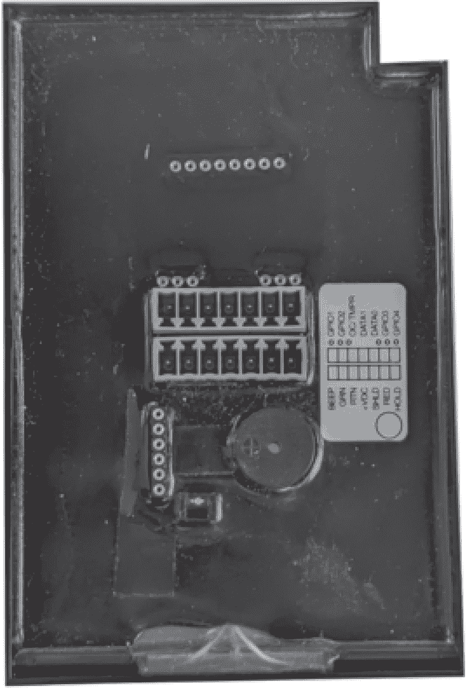
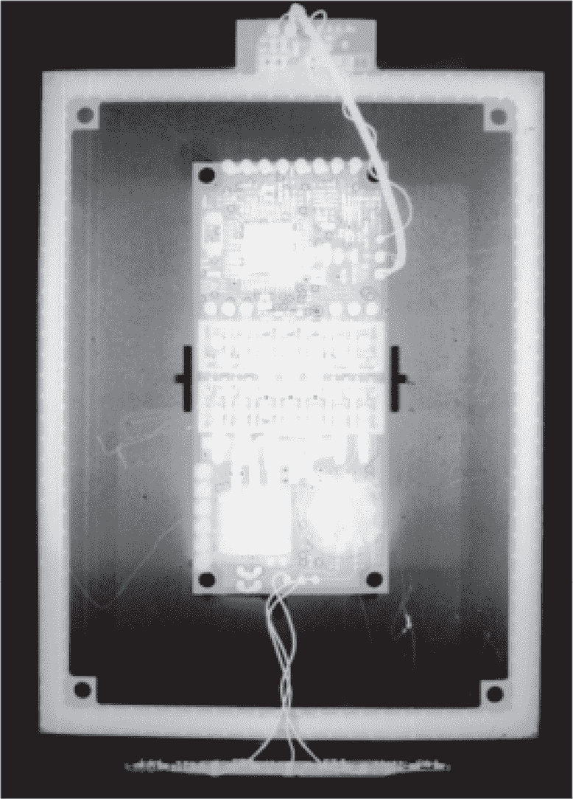
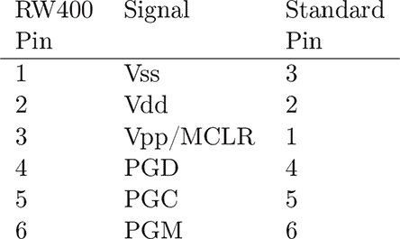
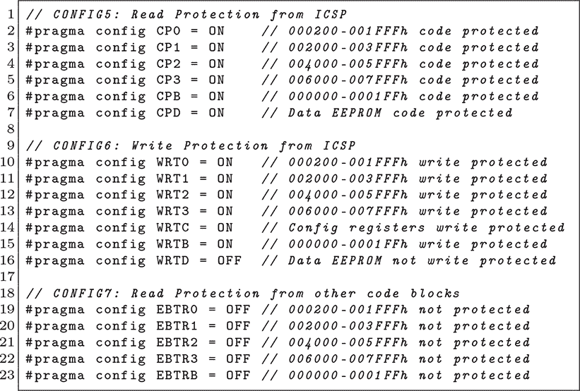
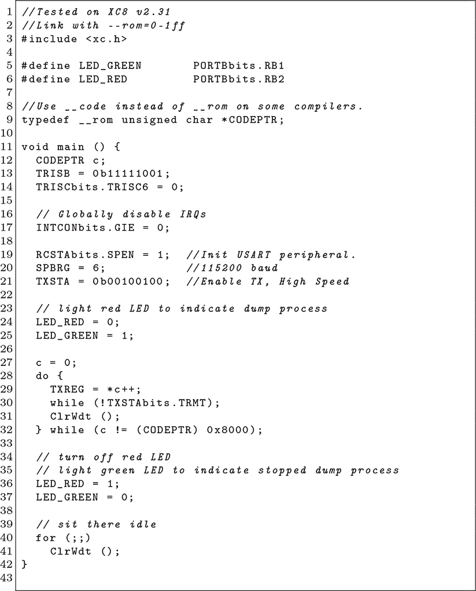
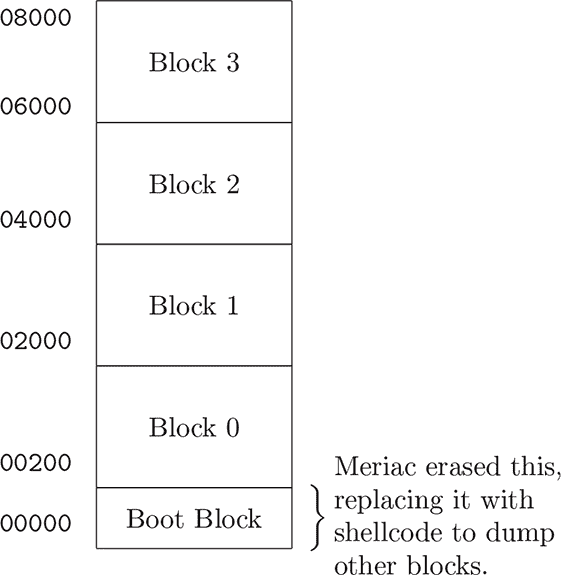
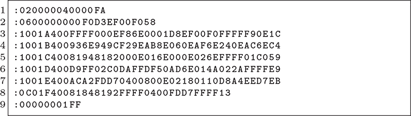
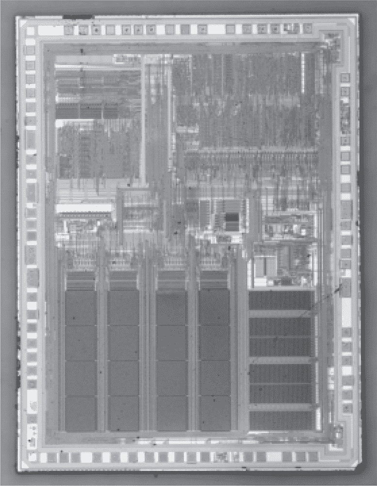
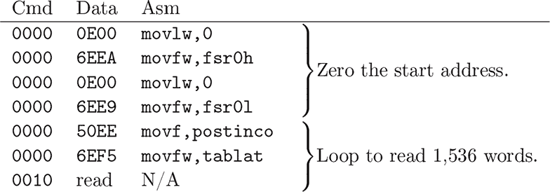

## 第十二章：**12  PIC18F452 ICSP 和 HID**

在 2010 年，针对存储对称密钥的 RFID 标签的利用引起了广泛关注。这些卡片本身在内存提取方面有一定的保护，而且密钥可能是每个客户安装的唯一密钥，因此研究人员通常会攻击读卡器。这些读卡器通常使用商用微控制器，并依赖它们的读出保护来确保对称密钥的安全。

在本章中，我们将介绍两个利用 ICSP 从 HID iClass 读卡器提取密钥的漏洞。它们都利用了 ICSP（Microchip 的在线串行编程标准）中的细微差异。第一个漏洞在 2010 年的 27C3 大会上作为 Meriac 公开，涉及通过 ICSP 擦除受保护的闪存页面，并用 shellcode 替换它，从而转储其余数据。第二个漏洞，Huffstutter（2011），则利用相同的 ICSP 协议转储 RAM，而不是闪存，因为该芯片没有为 RAM 设置保护位。

本案例中的目标读卡器是 HID RW400，Meriac 选择它是因为它是支持 iClass 卡片的最旧编程器。这个设备如图 12.1 所示，图中透明的环氧树脂封装覆盖了我们可以在图 12.2 的 X 射线图像中看到的电路。

ICSP 协议有许多小的变种，每个变种都在《FLASH 微控制器编程规范》文档中进行了说明，该文档涵盖了十个或二十个部件号。

较旧的芯片需要外部施加高电压进行擦除，而现代芯片也支持低电压模式，在这种模式下，编程电压是内部生成的。如果没有其他漏洞可用，这里尝试错误电压和时序肯定是值得一试的。章节 H.1 描述了 90 年代的类似攻击。

图 12.1：HID RW400 卡片读卡器

图 12.2：HID RW400 X 射线图像

PIC18 比早期的 PIC 架构稍微强大一些，但它仍然遵循尽可能多地复用组件的理念，以保持晶体管数量尽可能少。

ICSP 协议看起来很像 SPI，唯一不同的是它有一个单一的数据引脚，其方向会根据需要变化。请参见图 12.3，该图显示了图 12.1 中压电蜂鸣器左侧六个引脚的引脚排列。所有的传输都是 20 位数据，由 4 位操作码命令和 16 位参数组成。

在 ICSP 中，命令`0000`将参数作为原始的 PIC18 指令执行。`0010`读取`TABLAT`（表格锁存器）寄存器，而`1000`到`1011`是表格读取命令，`1100`到`1111`是表格写入命令。这是一种相对迂回的读取代码内存的方式，但大体上符合 PIC18 汇编语言中的表格指针操作。编程规范中包含了擦除内存和将代码写入内存的命令和指令示例对。

Flash（代码）、RAM 和 EEPROM 在不同的地址空间中，并且一系列配置字描述了保护设置，以及振荡器、定时器、欠压保护和其他可配置功能的设置。这些 16 位字从闪存中的`0x300000`开始。对于开发者来说，这些设置被定义为`#pragma`行，如图 12.4 所示。

代码内存被分成了大小略显笨拙的多个页面。第一个页面是位于`0x0000`的 512 字节引导程序页面，接下来是从`0x0200`到`0x1fff`的 7,680 字节的页面 0。剩余页面每个为 8kB。请参见图 12.6 以查看布局图。

图 12.3：HID RW400 的自定义 ICSP 引脚布局

图 12.4：HID RW400 读卡器的配置字

每个页面都有一个`CP`位。清除此位可以启用代码保护，`WRT`位启用写保护，`EBT`位启用表格读取保护，以确保来自其他页面的代码无法通过表格接口读取此页面作为数据。这些位通过擦除相应页面来设置。

### **Meriac 的引导块漏洞**

当 Milosch Meriac 想要从 HID RW400 读卡器中转储该芯片时，他发现`CP`和`WRT`位已被清除，因此 ICSP 上下文中执行的指令无法读取或写入任何闪存块。他选择这些读卡器是因为它们是最早支持 iClass 卡的，而你可以在图 12.4 中找到读卡器的配置位。

幸运的是，`EBT`位没有被清除。如果它们被清除，来自一个闪存页面的代码将无法对任何其他页面执行表格读取操作。由于这些位仍然被设置，因此可以从任何页面上运行的代码转储整个芯片的内存。

Meriac 观察到，通过擦除一个页面，他可以设置该页面的`CP`、`WRT`和`EBT`位^(1)。这使他能够将一段 shellcode 写入该页面，这段 shellcode 会将其余内存通过串口输出。

他将这个过程包装成一个 Windows 的 C`++`应用程序，通过 FTDI 芯片的 GPIO 引脚将 ICSP 传输到调试接口，然后通过同一个芯片的 UART 读取固件。他的 shellcode 如图 12.5 所示；它只是简单地将固件转储到 UART。

图 12.5：Meriac 的 PIC18 Dump 源代码

图 12.6：PIC18F452 闪存映射

图 12.7：Meriac 的 PIC18 Dump Shellcode

图 12.8：Microchip PIC18F452

图 12.9：Huffstutter 的 ICSP RAM 提取

对于他的目标，只需擦除并重写 512 字节的引导程序页面，并用 shellcode 二进制文件替换，因为这个页面恰好没有值得保留的内容。其他目标可能会在引导块中有重要内容，对于这些目标，必须使用第二个受害设备。这个第二个设备会擦除除第一页以外的每一页。这些页面随后会被一系列重复的 NOP 指令覆盖，最终将 shellcode 写入内存的末尾。其思路是引导块最终会在其他块中分支，而几乎每个合法地址都会滑动到 shellcode，转储第一块内容。

### **Huffstutter 的 ICSP SRAM 漏洞**

Carl Huffstutter 在 Huffstutter（2011）中描述了针对同一芯片和同一固件映像的不同漏洞。他发现，尽管每个闪存和 EEPROM 存储区都有各自的保护保险丝位，但没有用于保护 RAM 的保险丝位。果然，图 12.9 中的 ICSP 交易能够干净且无破坏性地提取被锁定微控制器的所有 RAM。

在 RAM 中，他找到了 64 位 HID 主身份验证密钥、两个 64 位的 Triple DES 密钥（用于加密读卡器和卡片之间的通信）、用于高安全性卡的 128 字节密钥表，以及最后一次读取的卡片的所有详细信息。这些信息在使用后并未被擦除，但即便被擦除，机器也可能在读取过程中被中断，从而揭示正在使用的内容。

许多其他设备在保护闪存的同时暴露 SRAM，因此每当你需要从芯片中获取数据而不一定需要代码副本时，考虑这种攻击是值得的。在防御方面，将任何重要的密钥和表声明为`const`可能会有所帮助，这样它们只会存储在闪存中，而永远不会复制到 RAM 中。
