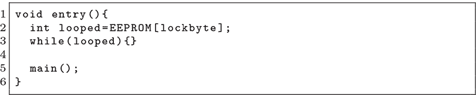
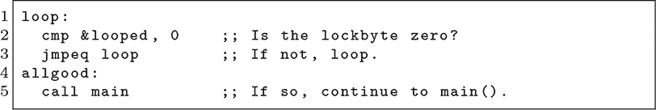
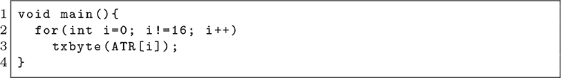
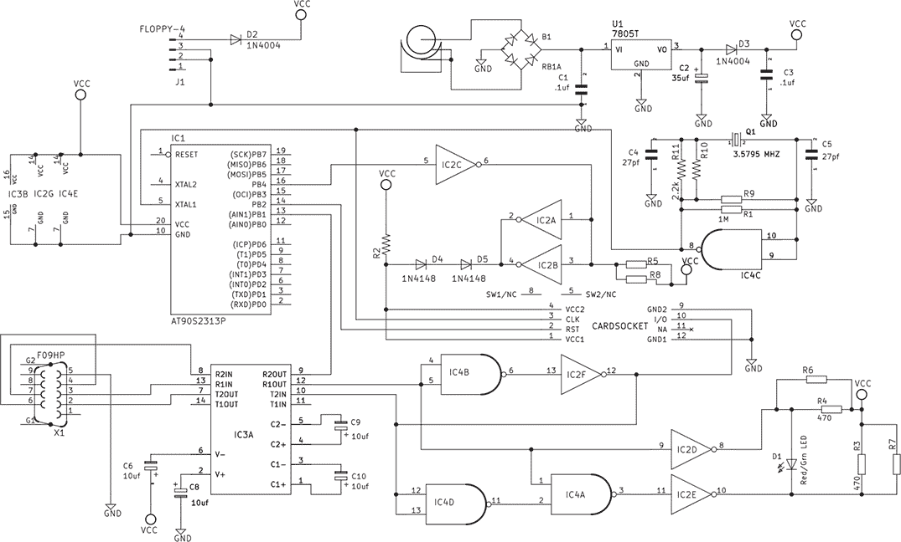

## **13  故障注入基础**

亲爱的读者，请允许我讲一段小小的神话故事。之后，我们将继续讨论现代时钟和电压故障攻击。

很久以前，故事是这么说的，一张卫星电视智能卡存在内存损坏的漏洞。人们为此欢欣鼓舞，因为通过内存损坏漏洞足以解锁所有频道并提取卡内的所有数据。然后，天上传来了一个信息——一个 EEPROM 更新，而不是预言——这些卡被修补成在无限循环中运行，而不是解码皮卡德船长与博格族的最新战斗。确切的补丁和确切的卡片已经随着时间的推移而失传，但在 C 语言中，我们可能会说代码看起来像下面这样。

因为卡片在无限循环中运行，而不是执行其正常功能，黑客们称之为“被循环”。从中，他们发明了“解循环”技术，即通过操控卡片的电压或时钟信号跳出无限循环。今天，我们称这些技术为“故障注入”或“故障攻击”，它们依然非常有效地去除芯片的保护。

这个技巧是短暂地降低芯片的电压，或者向时钟供应线路引入一个非常简短的额外周期。就像让芯片运行得太快或电力不足一样，这会导致指令执行错误。但由于这种违例非常短暂，可能仅仅一个指令就会被破坏，而其他部分保持正常。

在我们的示例中，智能卡将永远执行第 3 行的`while`循环。优化和汇编语言会以不同的方式表示，但可以想象它变成以下伪汇编代码。

当设备被循环时，微控制器将永远按顺序执行第 2 行和第 3 行。如果我们缩短时钟周期，使得第 3 行的“等于跳转”指令不会覆盖程序计数器，那么执行将继续到第 5 行，调用主方法，就好像这个芯片没有被锁定一样。由于循环持续运行，芯片在每次重启前都会给我们提供许多尝试机会。

另一个好的目标是复制循环。在启动时，智能卡通常会呈现其复位响应（ATR）字符串。如果发送该字符串的`for`循环像这样，那么我们可能会通过故障攻击在最后一个字节之后，比较`i`与`16`时泄露额外的内存。当比较是精确的（*i* ≠ 16）而不是范围比较（*i* <* 16）时，这可能会导致大量额外的内存泄露！

在 2000 年代初，专门的解锁硬件开始在商店里销售给业余爱好者，家用设计的原理图也在论坛上传播。大多数方案使用 Atmel AT90 微控制器和 7400 系列芯片，在时钟和数据线上插入故障，以对抗 DirecTV HU 卡。^(1) 请参见图 13.1 了解示例，如果你想购买现成的，可以在 eBay 上搜索“Mikobu”。

图 13.1：PLC77 的智能卡解锁器（2001）

就软件而言，这些解锁器设计中的大部分都需要通过 MAX232 芯片将固件加载到 AT90 中，且是通过串口进行的。尽管许多故障程序以源代码或黑盒二进制的形式共享，但也有一种传统是以注释过的 VBScript 形式与名为 WinExplorer 的程序共享它们。

### **时钟故障**

当设计微控制器时，会涉及到时序闭合的问题。对于任何给定的芯片，都会有一个最大时钟频率，低于这个频率，设计可以按预期正常工作。在这个速度下，所有组合逻辑都会在正确的时间得到结果，并能被顺序逻辑锁存。

超过这个频率，事情会失败，但并非一下子就全完。也许乘法运算是时钟频率的瓶颈，稍微超过这个频率就会导致一些乘法运算失败，而其他的功能依然正常。如果你不需要乘法运算，你可能会超过这个时钟频率，从而提升其他功能的性能。

当芯片从外部引脚获取原始时钟输入，而没有通过锁相环平滑时钟时，我们就有机会进行时钟故障操作。我们通过插入一个短暂的时钟脉冲，单个边缘或周期，远远超出芯片的最大时钟频率来实现这一点。

在多周期设计中，可以将其看作是一个指令的一部分被给予时间以完成。也许在指令的第一周期中，错误的操作码被锁存，或者也许在指令结束时，跳转没有写回程序计数器。

我通常从固件做出重要决策的时间范围开始，然后尝试在这个范围内故意制造随机错误，直到让芯片出现异常。由于我们控制着时钟本身，这个时序可以非常准确和可靠。

### **电压故障**

当原始时钟输入不可用时，电压故障仍然可能是一个选项。其思路是突然改变电压，迅速升高或降低电压，持续的时间极短，以至于芯片不会崩溃，但也无法正确执行指令。

降低电压会产生许多影响。其中之一是晶体管翻转速度变慢，从而导致一个本来在时序闭合范围内的设备，突然无法及时计算其结果，类似于时钟故障。例如，Atmega328P 在 4.5V 时可安全运行 20MHz，而在 2.7V 时则只能运行 10MHz。其他影响包括存储器故障和指令解码错误。

电压故障的校准可能很棘手。第一个轴线将是从可观察触发器（例如引脚上升）到发生故障的时间偏移。变化持续时间和目标电压将是另外两个轴线，时钟漂移会导致我们在触发后等待更长时间，故障发生的可靠性降低。

为了简化操作，许多现代的故障攻击通过直接将核心电压短接到地面，并依赖非常短的时序来防止崩溃。^(2)

无论你如何安排，重要的是一次只校准一个轴向的故障。我会在一个开发板上进行此操作，开发板上的芯片与我的目标芯片相同，首先运行一个紧凑的`while`循环，计算一堆数字，并在它们不一致时打印警告。然后，我可以寻找一个合适的持续时间和电压，使警告出现，而不必担心何时应用故障。我会移除大部分去耦电容器，然后如果情况变得不稳定，再逐个加回。

只有在成功注入故障到这个简单目标之后，我才会切换到真正的目标。在那里，我的触发器和偏移量才会变得重要，并且最好是其他参数已经调好。
