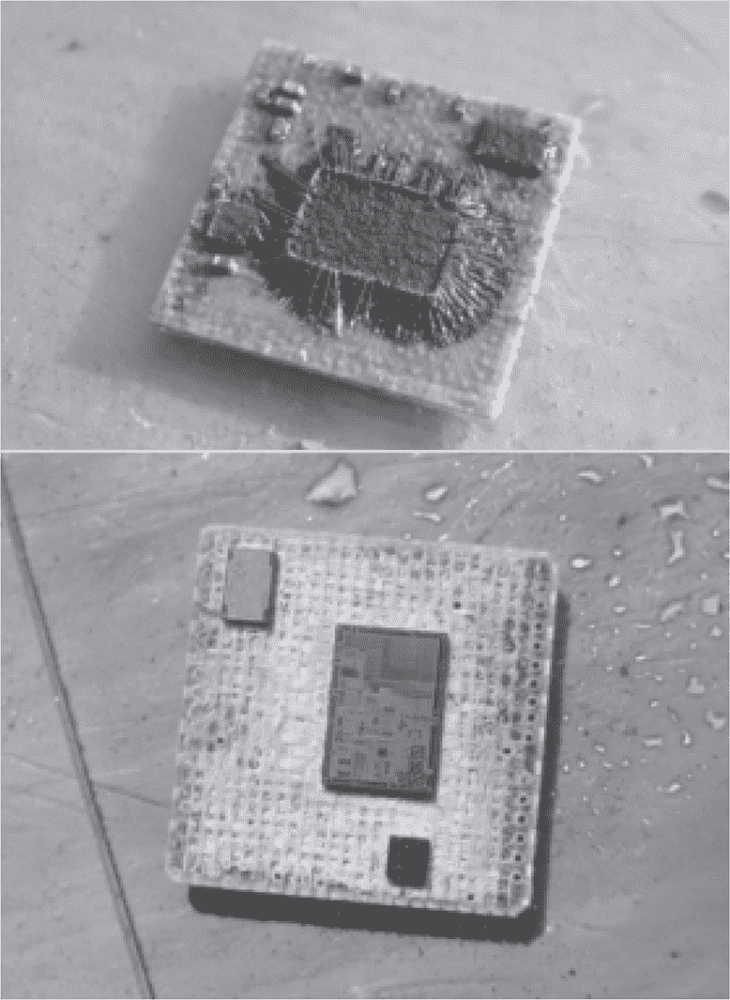
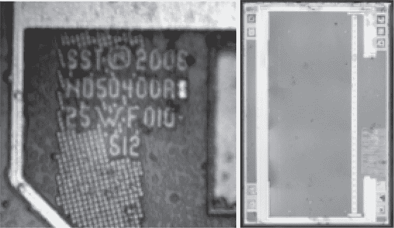
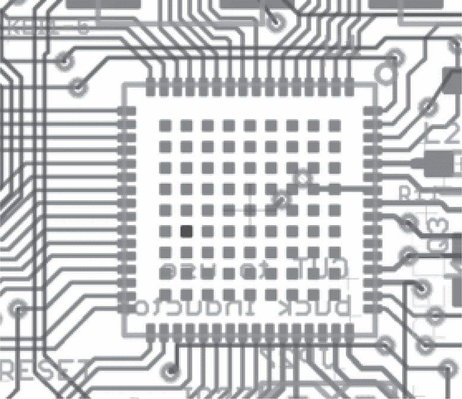
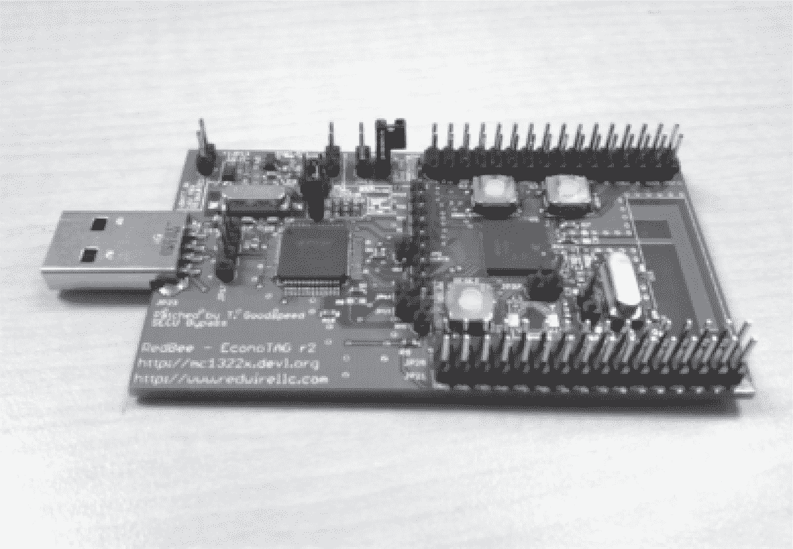

## **14  MC13224，最简单的故障注入**

让我们看看我在 Goodspeed（2011）中的一个漏洞，在这个漏洞中，通过在重置期间将 Freescale MC13224 的一个引脚接地来解锁它。这需要定制的 PCB 和一些热风焊接，但非常可靠，而且不需要任何复杂的软件。

MC13224 是一个系统封装（SiP），配备了 32 位的 TDMI ARM7 CPU 和一个 802.15.4（Zigbee）无线电。它具有 128KB 的 SPI 闪存、96KB 的 RAM 和 80KB 的 ROM 用于实现 15.4 MAC 功能。这个芯片曾被用于 Defcon 18 忍者徽章（Wozniak 和 Creighton，2010）。它的卖点是，2.4GHz 调谐的 50Ω轨迹天线是你所需的唯一天线链，其他所有组件（除了晶体）都已内部集成。

系统封装是一种使 PCB 设计师的工作更轻松的好方法，但从图 14.1 中解封的照片可以看到，这个封装实际上是三颗小芯片穿着风衣，试图像成人一样行事。^(参见 1) 最小的芯片是一个射频变压器，最大的芯片是一个结合了射频功能的 CPU，第三个芯片是闪存。

由于闪存位于单独的芯片上，并且 MC13224 没有原地执行功能，它无法直接从闪存中执行代码。相反，ROM 引导加载程序会将一个工作镜像从闪存复制到 RAM 中。如果镜像的开始位置看到安全字“`OKOK`”，则在引导加载程序跳转到 RAM 之前会启用 JTAG 访问。如果安全字设置为“`SECU`”，则不会启用 JTAG 访问，芯片将保持在默认的锁定状态。

图 14.1: 解封的 MC13224

图 14.2: SST25WF010

仔细观察闪存芯片，我们可以从芯片上的文字找到型号，见图 14.3。这是一款标准的 SST25WF010 低电压 SPI 闪存芯片。读取此芯片的一种方式是解封目标芯片，然后将这个 SPI 闪存芯片重新焊接到一个新的封装中，并使用低电压 SPI 适配器读取它。这样当然可行，但我们更倾向于不需要像焊接机这样昂贵设备的解决方案。

图 14.3: MC13224，133 号引脚加粗显示

更好的技术利用了这样一个事实：虽然 SPI 总线没有连接到外部引脚，但第 133 号引脚（`NVM_REG`）是闪存芯片的电压调节器输出，该引脚被暴露出来，允许外部电压调节器替代内部电压调节器。在低功耗应用中，可能通过在启动后关闭此引脚来节省电力。

当我们通过将此引脚接地切断 SST25WF010 闪存的电源时，会发生什么？Freescale（2010 年）在第 93 页的图 3-22 中解释到，当在闪存中找不到魔法字时，MC13224 将启用 JTAG 访问。然后，它将尝试从 UART1（作为串口）、SPI 从设备、SPI 主设备或 I2C 主设备启动。如果这些方法都不起作用，芯片将陷入无限循环，但它会在 JTAG 启用的情况下挂起！

因此，恢复 MC13224 闪存副本所需的仅仅是一个在复位时将引脚 133 拉低的电路板，然后将一个新的可执行文件加载到 RAM 中——在允许引脚变高后，该文件将从最近通电的 SST25WF010 中读取固件，并通过 I/O 引脚将其导出。

为此，我制作了一小批经过修改的 Econotag 电路板，见图 14.4，这些电路板将此引脚暴露给跳线。然后，可以使用镊子在重新启动时将线路保持为低电平，以解锁 JTAG。移除镊子后，可以通过电路板内置的 OpenOCD 实现使用内部 SST25 SPI 闪存芯片的客户端来转储固件。

要了解更复杂的针对双核微控制器的攻击，请参阅第 D.2 章中的 GD32F130 漏洞或第 D.4 章中的 MT1335WE 漏洞。

图 14.4：修改版 Econotag
