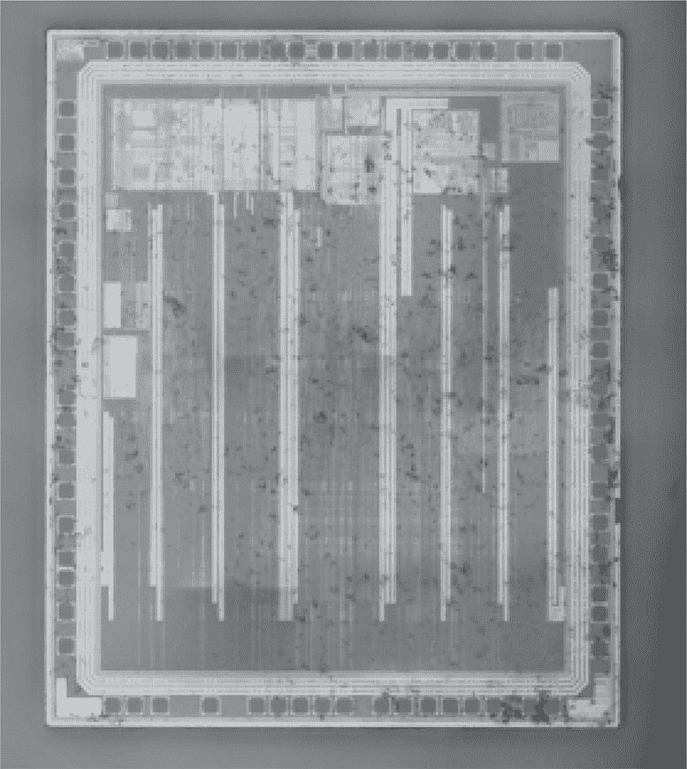
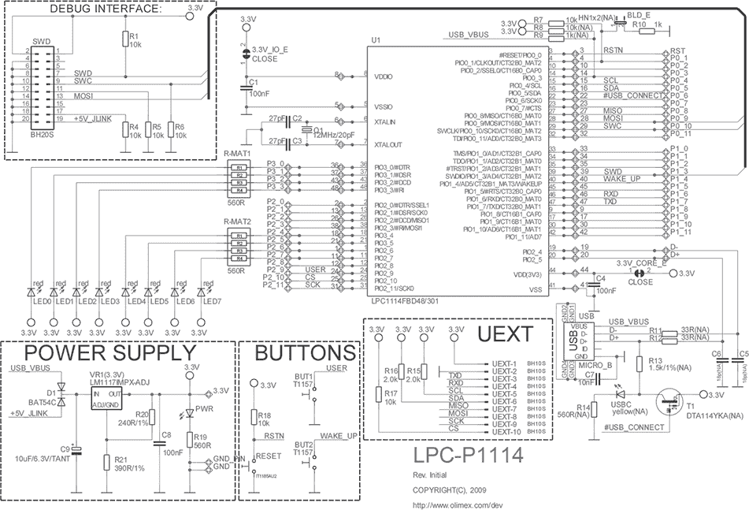
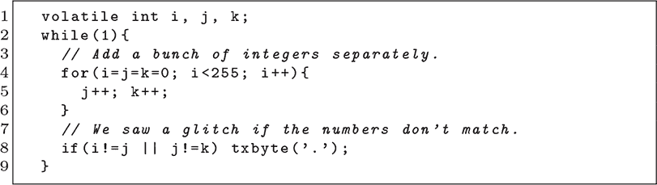
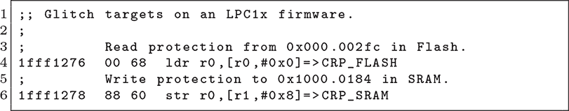
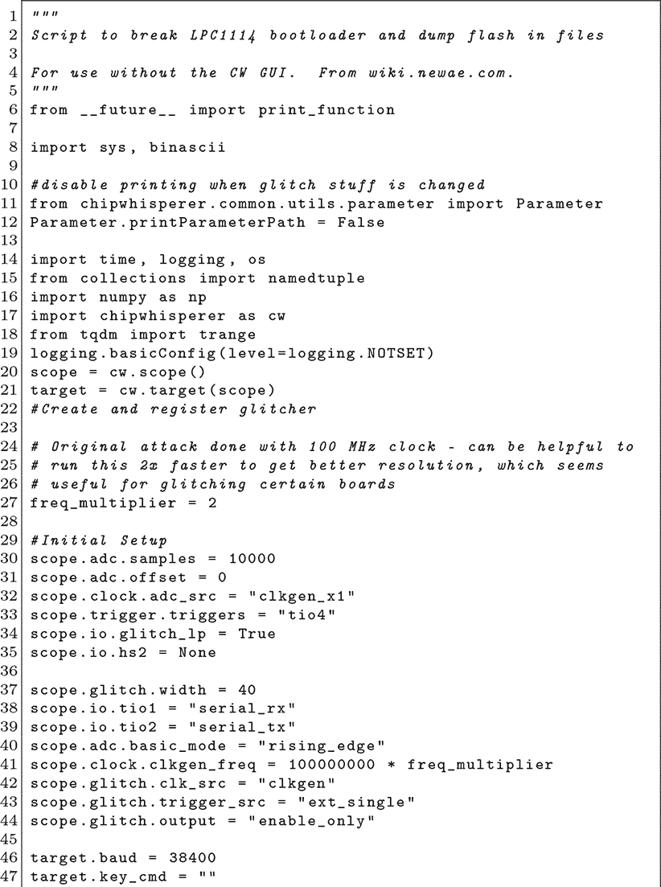
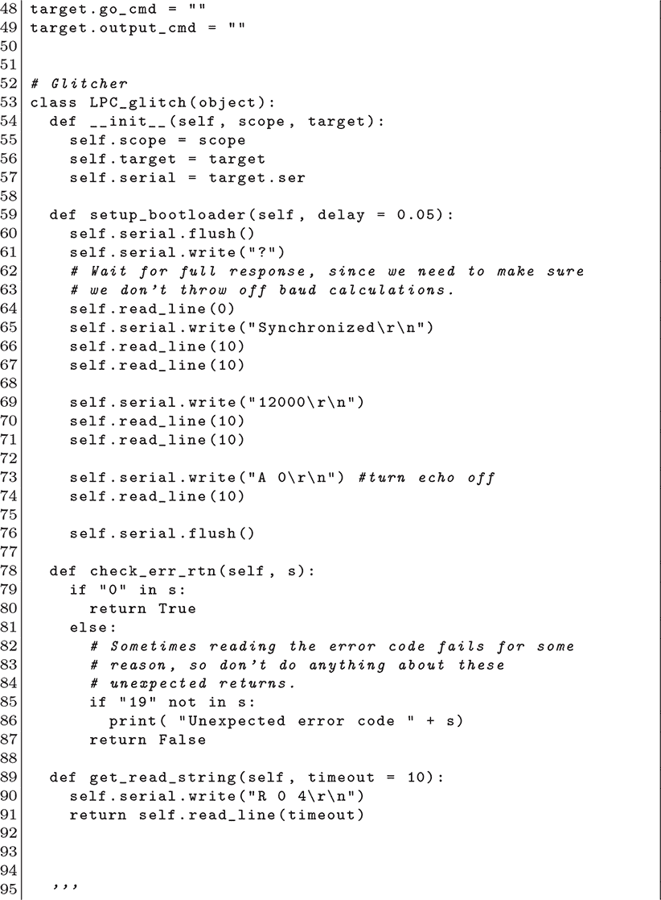
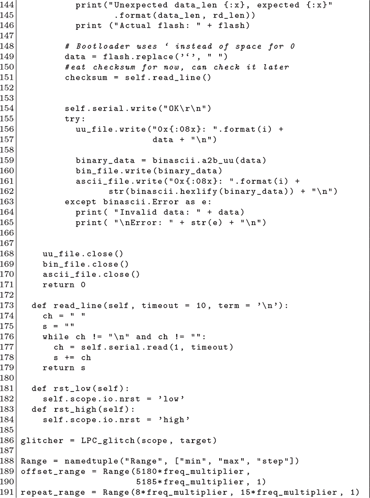
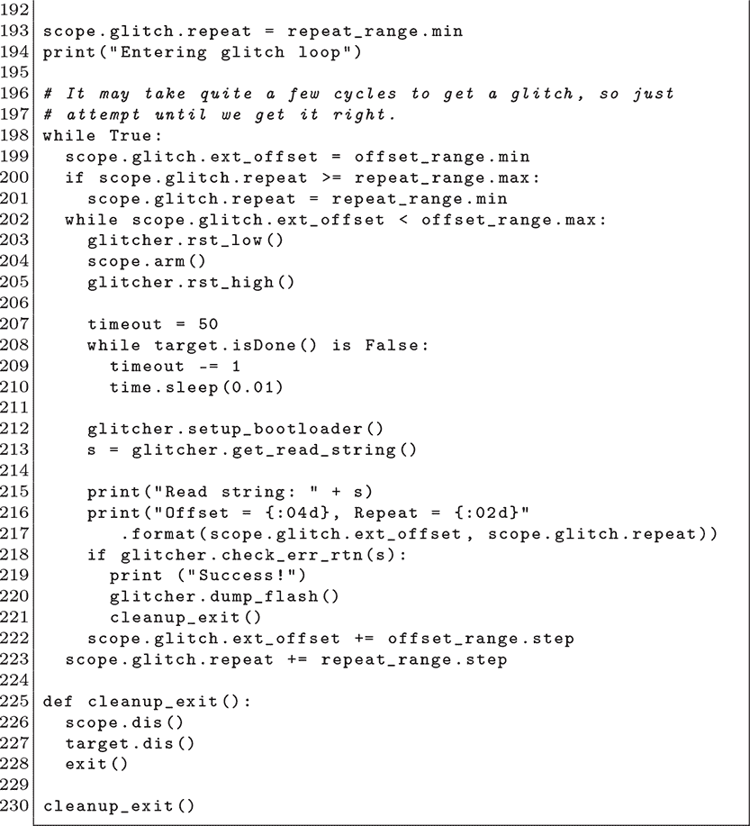

## 第十五章：**15  LPC1114 Bootloader 故障注入**

除了第四章中讨论的软件漏洞外，LPC1114 和 LPC1343 还容易受到 Gerlinksy（2017）、Nedospasov（2017）和 Dewar（2018）文献中记录的电压故障攻击的影响。这是一种初学者的故障注入攻击，适合作为学习故障注入的第一个目标。

在开始之前，查看图 4.5，并复习第四章中关于锁定功能的解释。当锁定级别为 CRP1 时，我们可以使用该章节中的内存损坏漏洞来转储芯片的内存，但在 CRP2 和 CRP3 中，bootloader 命令被严格限制，我们无法触发该漏洞。这时电压故障注入就派上用场了。

你还应该在图 4.5 中看到，一个单词的闪存内存控制着保护模式。`0x12345678`将我们置于 CRP1，此时远程代码执行漏洞有效。`0x4321-8765`将我们置于 CRP3，此时 JTAG 和 ISP 编程模式完全禁用。`0x87654321`也同样糟糕，允许 ISP，但*仅*允许大规模擦除命令。

表格的最后一行是关键，说明了这些芯片为何如此容易成为故障注入的目标。如果 32 位字的值与表中所列的任何值都不同，它会默认完全开放，允许 JTAG 调试和 ISP 编程。虽然`0x43218765`或`0x87654321`会锁住我们，但单个比特的错误可能会将它们更改为`0x43208765`或`0x87654331`，任意一个都会为我们提供完全访问权限。我们故障注入的目的是破坏那个字，从而产生这样的变化。

图 15.1: LPC111x

图 15.2: Olimex LPC-P1114 电路图

### **硬件修改**

Gerlinsky、Nedospasov 和 Dewar 各自对图 15.2 中的 Olimex 开发套件进行了稍微不同的修改，但其基本原理是相同的。

首先，我们要移除电路图中的 100nF 去耦电容 C4。这个电容的作用是防止电压瞬间下降导致芯片故障，而我们移除它是因为我们的目的是引发这种瞬间故障。如果它留在那儿，电压故障注入将变得更加困难。

该芯片的去耦电容设计位于 VSS 和 3.3V VDD 线路之间，但在许多其他芯片上，你会发现有多个去耦电容，或者电容会放置在一个专用引脚上，电压较低，即 CPU 核心电压。

该板上还有两条可能需要切割的线路，我们需要切割这两条。`3.3V_IO_E`将 C1 和 VDDIO 引脚连接到 3.3V 电源轨，而`3.3V_CORE`将 VDD 引脚连接到 3.3V 电源轨。我们将切割这两条线路，然后用一个 12Ω的电阻将切割后的`3.3V_CORE`线路两侧重新连接。这让我们可以测量芯片的功耗，因为电流消耗会在电阻上产生非常小的电压降。此类测量在已知时序后进行 glitch 并非必需，但对于发现时序非常有帮助。

将`P0_3`短接到地面将启用引导加载程序模式。我们还将添加一个 SMA 连接器，将地面和 3.3V 电源轨暴露给我们的电压 glitcher。glitch 硬件本身只是短暂地将这两个引脚短接在一起，虽然 Dewar（2018）使用 ChipWhisperer，而 Gerlinsky（2017）使用微控制器板，但你可以用晶体管和几乎任何能在复位后以可预测时序给该晶体管发送短脉冲的东西来短接它们。

### **如何进行 Glitch？**

现在我们有一个 SMA 连接器，通过它我们可以对芯片进行 glitch，短暂地将电压轨短接到地面，而不需要去耦电容器来保存电压。在我们能解决时序问题之前，我们至少需要大致了解应应用多大的 glitch。过大的 glitch 会导致目标崩溃或重启，而过小的 glitch 则完全没有效果，因为电压降会被自然的电容和线路长度衰减，直到什么都没有发生。

如果我们把这个引脚的空闲状态想象成一个平坦的 3.3V 电压，我们将其拉低，那么在我们的 glitch 中有两个基本参数：*深度*和*持续时间*。

Glitch 的深度是我们将引脚拉低到的电压。它通常是从 glitcher 的一侧进行测量，理解为目标不会立即降到该电压，并且可能不会完全降到该电压。一个“crowbar”glitcher，如 ChipWhisperer，简单地通过 MOSFET 将两个电源轨短接在一起，所以它的深度实际上是地面。

你通常会在较新的设备上找到 crowbar glitcher，因为时钟频率足够高，使得 glitch 不会导致目标崩溃。它们也非常容易放置在电路板上，只需要一个由攻击微控制器的 GPIO 引脚控制的 MOSFET 晶体管。常见的 MOSFET 选择包括 IRLML6246 和 IRF8736。

在电视盗版的年代，更常见的是使用 74HC4053 多路复用器在全电压和深电压之间切换。在开发过程中，这两者都可以由实验室电源提供，尽管 glitches 会稍微宽一些，但不会那么深。

有了一个维度（持续时间）或两个维度（持续时间和深度）来校准，我们更倾向于在涉及时间的额外维度之前，先找到正确的值。这通常通过运行一个从闪存或 RAM 中加载的程序来完成，这个程序故意设计为一个容易成为攻击目标的程序。

当设置大致正确时，这段代码将开始向串口输出数据。需要确保这三个变量都是易变的（volatile），这样 C 编译器就不会优化掉它们之间的差异。

当然，我们只能在这段代码上训练我们的参数，因为我们攻击的芯片也作为解锁部件供商业使用。当对智能卡或其他没有解锁样本的设备进行故障注入时，通常的做法是故障注入某种其他行为，比如读取设备的序列号。

### **何时进行故障注入？**

现在我们知道了故障注入的宽度（持续时间）和深度（电压）来引起故障，我们仍然需要知道何时触发故障注入。我们首先选择一个触发点作为时间的起点，然后选择一个时间度量，计算从该触发点开始的时间，最后寻找可能正在运行易受攻击指令的时间范围。

这通常是以微秒数或时钟周期数来衡量的，计量从某个特定事件之后的时间，例如复位线升高。需要注意区分目标的时钟信号，它与内部 CPU 时钟紧密耦合，而攻击者的时钟信号则耦合较松散，实际上只是另一种测量墙时的方法。

目标的时钟输入引脚曾经是精确定位特定指令的一个非常好的方法，但现在许多芯片，如 LPC11，默认使用内部振荡器作为引导加载程序的系统时钟，只有在主应用程序中才会切换到外部晶体。其他芯片使用内部锁相环（PLL）来倍增外部时钟的频率，提供某种关联性，但分辨率较低。在本章中，我们将忽略外部振荡器，而是使用墙时（wall time）。

现在我们已经选择了时间的度量，并且将复位引脚的上升沿作为零时间，我们需要知道何时应用故障来解锁引导加载程序。在其他目标上，我们可能通过功率分析来执行此操作，将 SMA 连接器连接到一个 T 型接头，接到故障注入器和示波器上。在这个目标上，我们有更好的方法：引导 ROM 的转储，这是我们为了编写 Shellcode 而在第四章中制作的。

回想一下那一章，引导加载程序会多次检查其锁定状态，但它始终检查的是在启动序列早期就创建的 SRAM 中的副本。这就是为什么软件漏洞的 Shellcode 仅仅重写 SRAM 中的 CRP 级别副本，并直接跳回引导加载程序的主循环，重新利用其代码进行权限提升的原因。

在这种故障攻击中，我们当然没有写操作，但我们知道有一条或两条指令在执行复制操作。也许我们在从闪存读取数据时翻转一个位，或者在写入 SRAM 时翻转一个位，或者也许我们翻转一个操作码位，让它变成另一个指令。

在 8 位 CISC 芯片上，我们可能仅通过计算指令和它们的周期成本来实现这一点。由于 LPC11 是一个流水线 RISC 芯片，这个过程就显得有些繁琐，因为任何故障都会同时影响多个指令。对于一些 ARM 芯片，另一种选择是使用嵌入式跟踪宏单元（ETM），它允许外部调试器跟踪每条指令的执行过程。我们也可能运行从 RAM 加载的修改版启动 ROM，修补后通过 GPIO 引脚暴露其时序。

即使不使用这些花哨的技巧，我们仍然可以通过一些时序线索来推测。我们知道 ROM 在复位线高电平之前不能开始执行，也知道当它接受我们的第一个命令时，必须已经跳过目标指令。如果我们足够耐心，可以遍历这个范围，直到芯片解锁，然后通过已知的偏移量在更短的时间内重复这一效果。

这种方式利用芯片并不罕见，通常攻击者会将芯片放在机架或储物间里，几天或几周后，恰当的时机才会出现。

Dewar（2018）建议，从 100MHz 时钟开始攻击时，在 5,100 到 5,300 个周期之间大约出现了十次故障。一个板子在 5,211 个时钟周期时，十次脉冲效果最好，而另一个板子在 5,181 个时钟周期时，十一脉冲效果最好。这个差异很可能来自目标芯片的内部 R/C 振荡器或房间温度，针对不同目标解锁的时刻有所不同并不奇怪。

