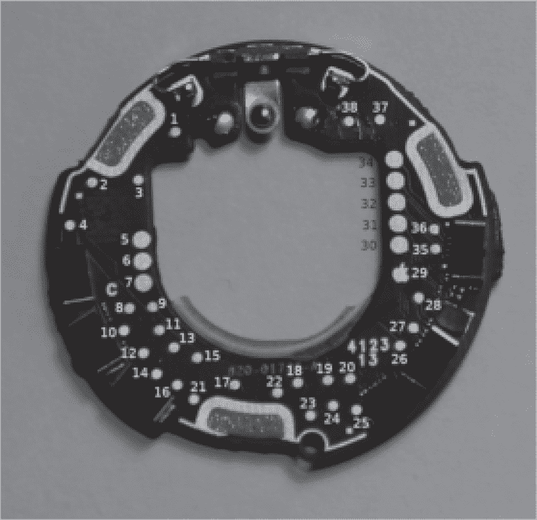
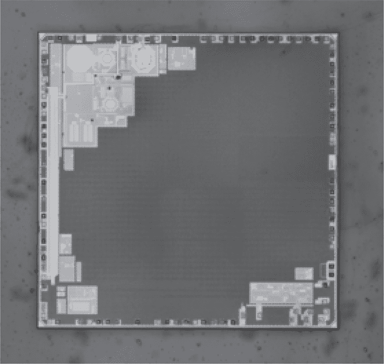
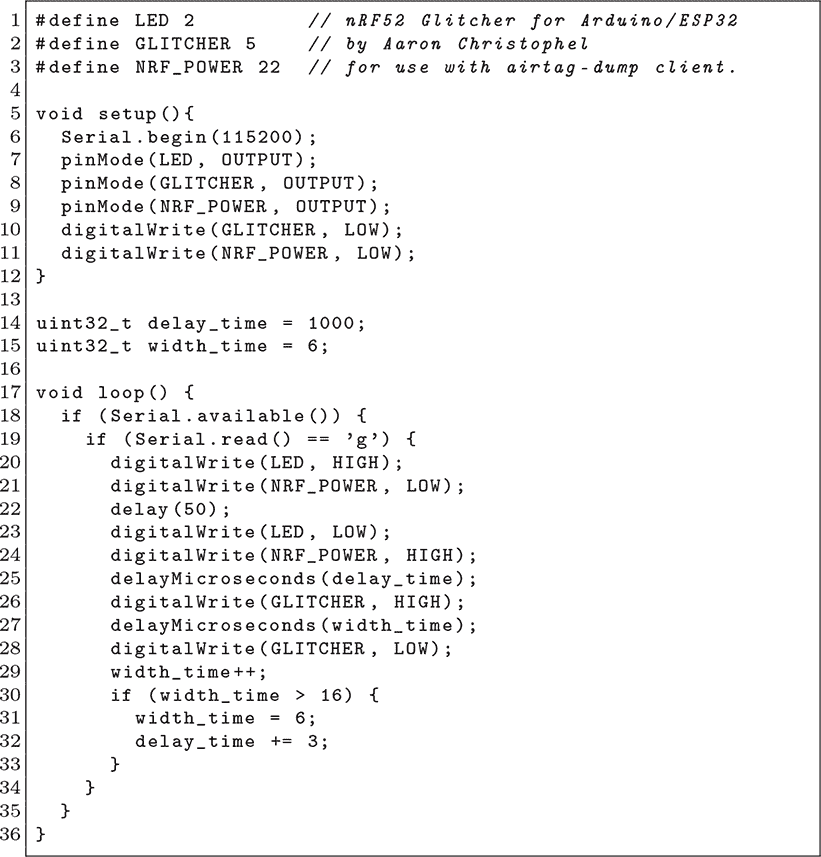

## **16  nRF52 APPROTECT 漏洞**

访问端口保护（APPROTECT）是 nRF52 替代 nRF51 系列 MPU 基于保护功能的实现，这在第九章中有介绍。它修复了旧平台的漏洞，为解锁芯片提供了调试接口，但对锁定芯片则提供了非常有限的接口。在锁定芯片上，调试器几乎无法做什么，除了擦除所有内存，解锁芯片，但同时摧毁了可能曾经存储在闪存中的任何机密数据。对 APPROTECT 进行的 glitch 攻击首次在两篇文章中描述：Results（2020a）和 Results（2021b）。这些文章的具体目标是 nRF52840，但预计整个系列都会存在漏洞。

由于这些芯片没有引导 ROM，所有外设在复位后都会在硬件上初始化，包括保护功能。通过在示波器上使用简单的功耗分析，确定内存控制器在启动时*禁用*解锁芯片上的 APPROTECT 的时间偏移，然后他可以在这一时刻进行 glitch 攻击，欺骗锁定芯片像解锁芯片一样禁用保护功能。

随着 Apple AirTag 的流行，以及 O'Flynn（2021）中公开的引脚图（图 16.1），nRF52 开始取代 LPC11 系列，成为文献中最常被攻击的微控制器。它已经作为视频教程发布（Roth（2021）），而由 STM32 开发板制作的 glitcher（Melching（2021））几天内就出现了。实践出真知，我最喜欢的 nRF52 glitcher 是作为 36 行 Arduino ESP32 代码在 Christophel（2021）中发布的，并且以推文形式发布！

图 16.1：O'Flynn（2021）提供的 Apple AirTag 测试点

图 16.2：Nordic nRF52840

图 16.3：Twitter 上的 nRF52 Glitcher
