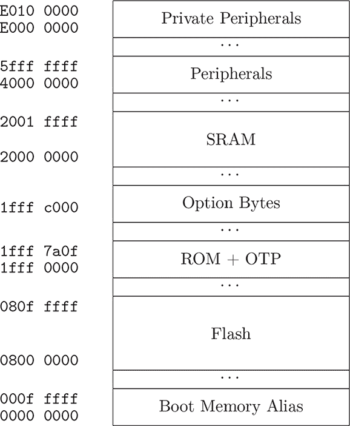
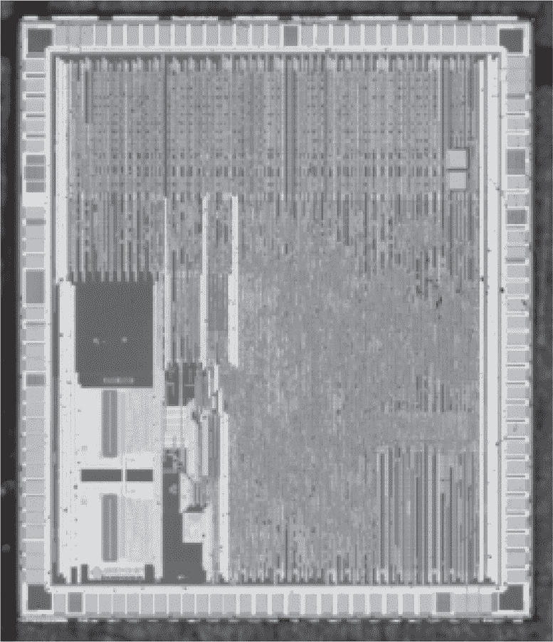

## 第十七章：**17  STM32 FPB 故障**

在 Obermaier、Schink 和 Moczek（2020）中可以找到许多精彩的攻击，但我最喜欢的是 STM32F103 的 RDP Level 1 逃逸攻击，以及它的克隆之一，Geehy 的 APM32F103。这个攻击涉及许多复杂的环节，所以大家聚精会神地听好！

首先，回想一下 第二章，RDP Level 1 会在连接 JTAG 调试器时禁用闪存，但连接仍然被允许，所有 SRAM 对调试器是可用的。重置芯片会断开调试器并重新连接闪存，但不会擦除 SRAM。

其次，STM32 芯片可以根据启动时 BOOT0 和 BOOT1 引脚上的值，从 SRAM、ROM 或闪存启动。闪存可以完全访问内存，ROM 包含一个引导加载程序，具有其自身的软件实现的访问限制，但从 SRAM 启动时，代码的限制与连接 JTAG 时相同。也就是说，闪存不可访问。这个限制适用于从 SRAM 启动，但从 ROM 或闪存启动后执行 SRAM 时则不受此限制。

有时需要对闪存进行小的修补而不重写内存，STM32 的 Cortex M3 内核支持闪存补丁和断点单元（FPB）。这个单元在修改掩码 ROM 时也非常有用，尽管掩码 ROM 当然不能就地重写，但仍然可以进行补丁。 图 17.2 显示了这个单元的寄存器，注意指针以 `E` 开头，因此这个外设来自 Cortex M3 内核，并非 STM32 独有。

图 17.1：简化的 STM32F103 内存映射

图 17.2：Cortex M3 闪存补丁和断点（FPB）单元

所以 Obermaier 编写了一段两阶段的 shellcode，它作为可启动映像加载到 SRAM 中。第一阶段不能读取闪存，因为存在访问限制，但它可以重新配置 FPB 设备，以补丁形式将复位向量 `0x00000004` 指向第二阶段。然后，启动引脚被更改为选择闪存作为启动源，并且一个电源电压故障被与重置同步，以作为触发器。

重置会恢复对闪存的访问，如果故障在合适的时刻成功，FPB 的复位向量补丁将不会被重置序列清除。这会导致执行立即返回到 SRAM 中第二阶段的 shellcode。然后，这个阶段可以自由地导出所有内存内容。

就可移植性而言，我已经指出 FPB 单元来自 ARM，而非 ST Micro。这个单元在本书的其他漏洞攻击中也有使用，具体见 C.4 章 和 C.5 章。

图 17.3：Geehy APM32F103，STM32 克隆
