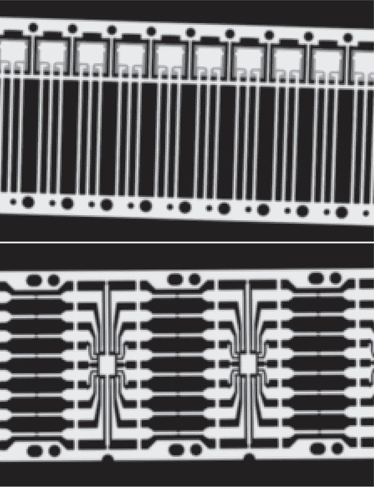
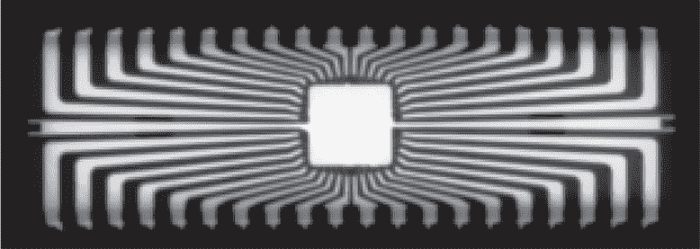
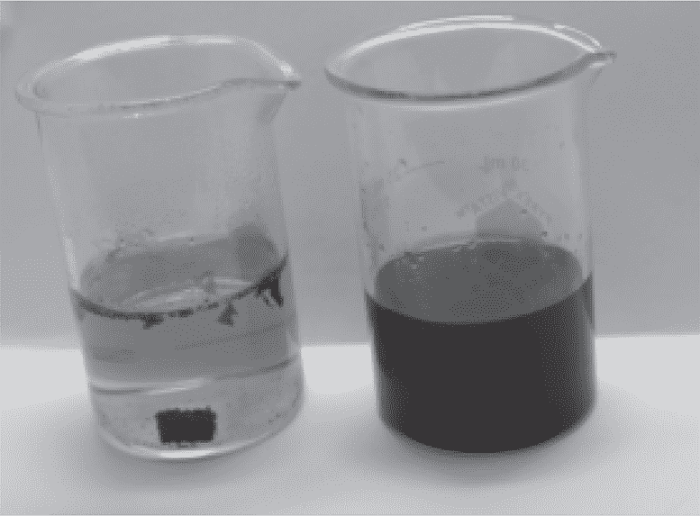
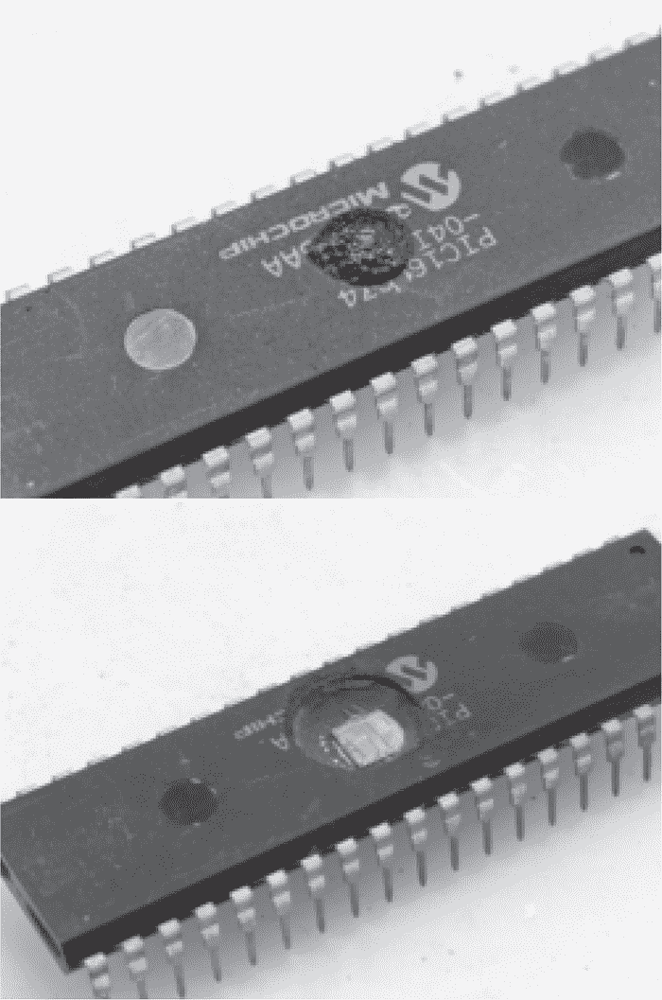

## 第十八章：**18  芯片解封装**

到目前为止，我们已经讨论了多种可以通过电气手段利用的漏洞，这些漏洞可能是通过软件错误或外部触发的故障注入来利用的。一旦去掉封装，暴露出芯片下面裸露的玻璃，还可以进行更多的攻击。在这一章中，我们将讨论用于拆解芯片的化学方法，接着我们将看到如何用激光照射芯片、拍摄其掩膜只读存储器（ROM），以及如何利用紫外光擦除其电子可擦除可编程只读存储器（EEPROM）、一次性可编程存储器（OTP）或闪存。

在我们开始之前，了解一下芯片是如何被放入封装中的很重要。微芯片首先通过光刻工艺在称为晶圆的圆盘上制造。不同的层依次被放置并蚀刻，掩膜和光照控制着哪些部分保留，哪些部分被洗去。最终，晶圆被锯成单独的芯片，然后进行测试和分类。

那些通过测试的芯片被放入各种各样的封装中。具有引脚的封装，如双列直插封装（DIP）和小型外形集成电路（SOIC），最初是作为金属引线框架制造的。芯片被粘在这个框架上，并且芯片上的引脚与框架上的引脚通过微小的金属线进行连接。然后，环氧树脂将芯片和引脚固定到位，之后引脚被弯曲成形。

请参见图 18.1 中的两个例子。上面的 X 射线图像是 TO92 晶体管封装在塑料封装后的框架。下面的 X 射线图像则是 DIP16 芯片裸露的框架，在芯片连接之前。封装完成后，工厂会将每个引脚切开，然后将其弯曲成适合分配的形状。

图 18.1：TO92 和 DIP16 引脚框架

芯片的封装方式也可以非常不同。系统级封装（SiP）设备将多个芯片粘接到同一个电路板上，然后像处理引线框架一样将电路板用环氧树脂封装。晶圆级芯片尺度封装（WLCSP）则将焊球直接放在芯片上，这样就可以将其焊接到电路板上，而不需要被封装在环氧树脂中。当这些封装成为我们的障碍时，就该去化学实验室了。

### **实验室用品和设备**

让我们从购物清单开始。在实验室设备方面，你需要一个通风柜、加热板和超声波清洗机。30 mL、50 mL 和 100 mL 的 Pyrex 烧杯可以用来装化学药品。塑料移液管用于从容器中取出酸液。（玻璃移液管手感很好，但它们的橡胶泡沫往往会变硬并开裂。）另外，购买一些电脑气雾清洁剂和一些非常锋利的镊子。

为了安全起见，你需要穿实验室工作服、戴手套和眼镜。长发应该束起来，除非你想了解在开放式鞋子下走路的酸烧伤体验，否则不要穿开口鞋。

对于溶剂，您需要丙酮和异丙醇（IPA）。我还备有蒸馏水，您可以以较低价格购买到作为 CPAP 水的蒸馏水。至于化学品，您需要首先准备 65%的硝酸（HNO[3]）和 98%的硫酸（H[2]SO[4]）。我建议在熟悉了浴法之后再购买更多特殊的化学品，因为其中一些对健康有害且难以处置。

图 18.2：DIP40 的 X 射线图像

图 18.3：HNO[3]和 H[2]SO[4]浴法

### **HNO[3]浴法**

这种方法是我们许多人学到的第一个方法，它仍然是我实验室中最常见的日常去封装方法。

这种方法最适用于表面贴装芯片，因为它们的封装与芯片本身的尺寸相差不大。对于较大的封装，例如在图 18.2 中 X 射线拍摄的 DIP40，过程变得非常缓慢。几乎所有这些芯片的结构与 X 射线中的相同，芯片位于中心引脚之间。用带锯快速切割可以去除大部分塑料，从而减少处理时间并节省硝酸。

首先切断 CPU 的引脚，将其从电路板上取下，然后放入一个装有 65%硝酸的烧杯中，烧杯的液面大约为一半。您会看到硝酸与引脚残留物反应时发出微弱的绿色烟雾，但我们还需要一些热量来燃烧掉塑料。

在加热硝酸时，您希望它变热，但**不要**让它沸腾。小心地提高温度，直到您看到反应开始，但当看到液体中冒出气泡时，立即将温度降下来，而不是来自芯片的气泡。

初次尝试时，早期的反应可能会让人有些失望，液体变成了淡淡的绿色，仅有丝网印刷部分被从塑料上烧掉。这是由于任何金属的外表面在酸的作用下发生氧化，这种情况会持续，直到温度足够高，塑料才能分解。（金属可以是引线框架、连接线，或者在旧芯片中是裸露的芯片顶部金属层。）缓慢提高温度，以免不小心让烧杯里的液体溢出来。

当包装与硝酸反应时，小块的物质会像从奥利奥饼干中掉落一样脱落。您需要继续反应，直到微芯片的芯片和其引线框架从塑料封装中解放出来。

芯片是通过胶水附着在引线框架上的。有时，这种胶水在去封装过程中变得较弱，导致两者分离；有时框架会在酸中溶解。如果它们没有分离，并且框架没有溶解，你可以通过一个巧妙的化学方法解放芯片。只需向新鲜酸液中加入少量蒸馏水，并用镊子刮擦引线框架。框架的氧化表面正是阻止酸液伤害框架的原因。刮擦会打破这个氧化层，随着水冲走新形成的氧化物或铁锈，整个框架将在稀酸中溶解。金属最适合用大约 20%的硝酸攻击，稍后你会看到本章中引线框架和键合线在强硝酸中并不会溶解。

一旦芯片被解放出来，将其在一个干净的蒸馏水烧杯中煮沸，以去除任何金属盐，然后进行两次超声波清洗：首先是丙酮，然后再次是异丙醇。丙酮在溶解或分解污垢方面要好得多，但这意味着在丙酮清洗后芯片上可能会有污垢颗粒，所以第二次用异丙醇清洗能将这些污垢清除掉。

最后，将芯片放在显微镜载玻片上，在其仍然湿润时，用电脑吹尘器轻轻地吹掉表面的酒精，而不是让它自然干燥。（如果让它干燥，虽然比丙酮留下的杂质少，但仍可能有一些杂质需要吹走。）在此过程中要稳稳地握住芯片，并使用较少的气压，因为看着芯片飞入尘土飞扬的实验室深处是一种令人沮丧的浪费。

### **H[2]SO[4] 浴法**

除了 65%的硝酸，你可能还想使用硫酸去封装芯片，无论是化学供应商提供的 98%浓度硫酸，还是用于清洁排水管的较低等级硫酸。整个过程大致相同，因此在本节中，我将重点介绍不同之处。

硝酸会导致封装开裂并粉碎。这让你能够看到反应的进展，但也意味着一些封装碎屑可能仍然附着在玻璃上，丙酮可能无法把它们刷掉。硫酸在加热过程中会变黑，它将封装溶解成非常细小的颗粒，从而留下一个更干净的表面。这样做的代价是液体完全不透明；你无法看到进展，直到样品被从酸液中取出。

### **王水用于金**

塑料 DIP 封装比较麻烦，但本章前面介绍的技巧足以从中提取芯片。然而，一些低体积陶瓷封装的框架上有一层金属涂层，防止了硫酸或硝酸将芯片解放出来。由于陶瓷本身对这些酸是不可渗透的，而且盖子很容易被去除，我们可以考虑用王水去除金属涂层，从而解放芯片。

王水是由盐酸和硝酸混合而成，摩尔比为三比一：HNO[3] + 3 HCl。该混合物在常温下会产生烟雾，初始时是透明的，但随着氯气和氧化氮烟雾溶解回液体中，它会迅速变为橙色或红色。

我发现，对于我需要溶解的薄层来说，比例并不特别重要。即使盐酸不是特别浓烈，在加热下滴入一点硝酸和一点盐酸也足够了。

### **RFNA 滴加法**

在之前的章节中，我们了解到，硝酸在*较低*浓度时对键合线和框架的腐蚀性更强，因为水作为催化剂将金属盐带离金属。我们可以利用这一点，通过滴加极少量的红色烟雾硝酸（RFNA）在封装中开一个坑，而不损坏键合线。这样芯片仍然能够正常工作，这是进行光伏攻击和探针针头操作所必需的。

RFNA 是非常强的硝酸，含有 90%以上的 HNO[3]和不到 2%的 H[2]O。这需要特别的运输限制，就像我当时收到不到半升的订单时一样，它是用五加仑桶固定在运输托盘上送来的！

打开芯片时，首先将其焊接到一个小载体板上，载体板的另一面没有任何东西。你需要在热板上加热至 100°C 以上。

在你的排风柜的其他位置，但要确保不会碰倒，放置几毫升冷 RFNA 在一个小烧杯中。拿一个尖细的移液管，吸取一点酸液到管尖，然后在封装的正上方，芯片的上面，滴下小线条。让它燃烧一会儿后，使用纯丙酮清洗酸液和一些封装物料到一个大烧杯中。

一些注意事项：不要误用异丙醇（IPA）或水进行清洁。异丙醇在与 RFNA 接触时会发生爆炸，少量时会发出小的爆裂声，大量时会造成相当大的尴尬。水会加剧硝酸对键合线的腐蚀，任何水或含水化学品都必须严格避免，以确保操作成功。

图 18.4：在 PIC16LC74 上使用 RFNA 滴加法

在第一次暴露后清洗干净，仔细检查样品。你应该能看到一个小的凹槽，以及酸接触到的地方去除了丝网印刷，且不应该看到封装引脚或载体 PCB 的腐蚀。如果发现酸液滴落到侧面，说明你使用的量太多了。最初使用的量应该远小于一滴。

我曾警告你要保持酸液在凹槽内，并将凹槽保持小一些，但你会做几次这种操作，以理解原因。如果凹槽变得太宽，铅框的引脚可能会断裂，带走它们的连接线。你还应该看到，酸液更倾向于浸入之前已被蚀刻掉环氧树脂的芯片表面；如果酸液溢出凹槽，它会使更多的表面吸引酸液。

重复此过程很快就能得到一个可以容纳更大酸滴的凹槽。不要轻易让酸液煮沸至干，通常在接近玻璃时缩短暴露时间是个好主意，这样可以减少表面残留物。图 18.4 展示了早期的滴液和最终结果，其中暴露了 PIC16LC74 芯片。

一旦表面完全暴露并且你预计不会再有酸滴落时，可以安全地用蒸馏水和 IPA 冲洗芯片。不要在过程中早些时候这么做，否则水可能会损坏连接线。

### **松香或松脂**

我住在美国，对欧洲读者来说，这里可能看起来是一个没有监管的边疆，枪手山地居民可以私下持有与工业故障分析实验室使用的化学品相同的物质。这些读者并非完全错，但让我们花点时间考虑一下他们如何在没有硝酸或硫酸的情况下去封装芯片。

Schobert（2010）描述了一种来自 Beck（1988）的技术，其中使用松树树脂或松香去除封装^(1)。将封装在 350°C 的松树树脂中煮五到十分钟，以释放芯片。当然，树脂在冷却时会固化，但溶解在丙酮中可以再次释放芯片，便于拍照。

这种方法很凌乱，但利用美容和音乐商店的物资进行去封装是相当酷的。

### **其他技术**

在本章中，我们学到了多种提取微芯片玻璃芯片的方法。第二十二章将通过去层和 Dash 蚀刻扩展这些化学技术，以揭示扩散层并突出 P 型和 N 型硅的差异。它还将解释如何将 ROM 位提取成 ASCII 艺术，并将其从物理顺序重新排列为适合仿真和反汇编的逻辑顺序字节。
