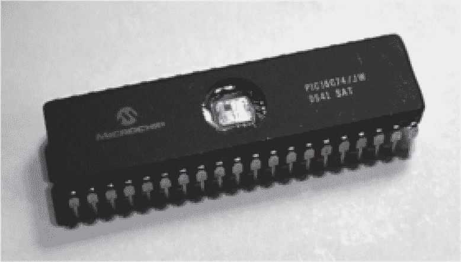
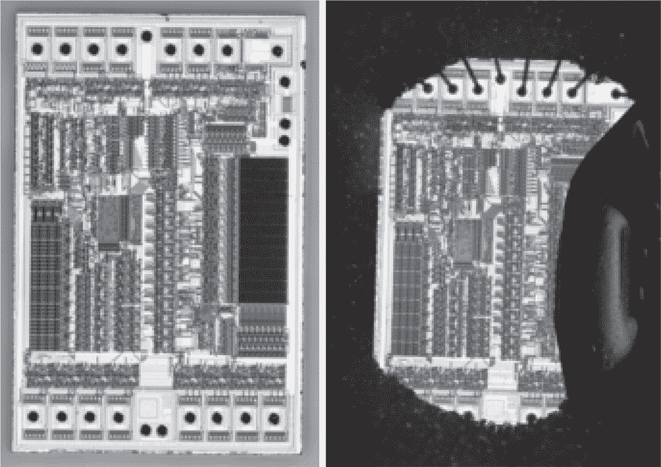

## **19  紫外线解锁 PIC**

使用 Microchip 的 PIC 微控制器设计有很多限制，但在 90 年代初期它们非常方便。它们有点像那个时代的 Arduino，既用于业余项目，也用于商业产品。它提供了掩模 ROM、（E）PROM、EEPROM 和闪存变体，至今仍在使用。有很多方法可以解锁这些芯片，但在本章中，我们将重点介绍如何利用紫外线光清除保险丝位，同时保护我们希望读取的主要程序内存。

在 EEPROM 和闪存设备普及之前，开发人员会购买带有石英晶体窗口的芯片，就像图 19.1 中所示的 EPROM 变体。这单个字母 E 表示这是可擦除的可编程只读存储器设备，而双字母 E 表示这是一种电擦除设备。从电气上讲，你可以将位从 1 清除为 0。要将位从 0 擦除为 1，则需要将其暴露在紫外线灯下 15 到 20 分钟，之后该芯片即可写入新程序。

相同的芯片将以标准的不透明包装形式作为 PROM 或 OTP（一次性可编程）变体出售。这些芯片出厂时已经擦除，但由于没有窗口，无法方便地擦除以进行新程序写入。如我们在第十八章中所见，我们可以使用红色烟雾硝酸（RFNA）在不损坏芯片或连接线的情况下打开外壳上的孔。这就是所有这些攻击的基础，技巧通常在于擦除某一部分，同时保护另一部分。

图 19.1：紫外线可擦除的 PIC16C74

保护由配置位控制，通常被称为保险丝。这些位控制代码保护（CP）、看门狗定时器（WDTE）和振荡器（FOSC）。在 PIC 中，它们是通过与生产 EPROM 相同的浮动栅极技术实现的，但需要理解的是，配置位并不位于程序内存中。它们位于芯片的其他地方。

早期的芯片，如图 19.2 中的 PIC16C56，是最容易破解的，因为它们的配置位与程序内存一起被设计为可以擦除。通过 RFNA 滴水法去除封装后，只需用红色指甲油涂抹程序内存，并将其放入 EPROM 擦除器中加热，直到设备变得可读取。严格来说，你不需要知道配置位的具体位置，因为只需保护那些更容易识别的程序内存即可。

在 PIC16C56 中，EPROM 内存位于左图右侧靠近的深色矩形区域，在右图中被一滴指甲油覆盖。这款样品来自 Parallax BASIC Stamp，我能够在紫外线消毒箱中经过 151 秒后读取其固件。消毒箱内部的 USB 集线器使得在熔丝被擦除后，读取芯片变得方便，而一个 Shell 脚本则让我在芯片解锁的瞬间就能读取数据。过渡期持续了三秒钟，之后每次读取的结果都一致。

图 19.2：PIC16C56，裸片与涂了指甲油的对比

| PIC16C620  | PIC16C621 | PIC16C622 | PIC16C62A |
| --- | --- | --- | --- |
| PIC16C63 | PIC16C64A | PIC16C65A |  |
| PIC16C710 | PIC16C711 |  |  |
| PIC16C72 | PIC16C73A | PIC16C74A |  |
| PIC16C83 | PIC16C84A | PIC16C923 | PIC16C924 |
| PIC17C42A | PIC17C43 | PIC17C44 |  |

表 19.1：最早的带有熔丝保护的 PIC

位数据损坏可能会成为一个问题，因为不完美的遮蔽会擦除未被遮盖的位。零始终可靠为零，但一有时会变得模糊，因为它们可能是被损坏的零。Caps0ff（2017a）指出了一种方法来帮助测量这种损坏。PIC16 允许读取每个 14 位指令的两个半部分的 7 位 XNOR，即使芯片被锁定。通过先转储所有校验和，然后解锁芯片，最后转储代码，作者能够识别损坏的数据字。^(1)

紫外线擦除熔丝的问题引起了 Microchip 的关注，到 1996 年，表 19.1 中的设备已经有了针对这种技术的防护，首先是使用遮挡紫外线的外壳，后来则增加了额外的冗余熔丝。Tarnovsky（2008）记录了这种情况，特别是在 PIC16C558 的例子中，其中一些配置位在顶部金属层有一个保护屏蔽。这两个配置位控制着代码保护，并通过与门确保两个位都必须擦除才能解锁设备。Tarnovsky 并没有通过光学方法绕过这一保护，而是使用激光切割机将与门的输出桥接到 VDD。

到目前为止，我们已经讨论了带有 EPROM 或 EEPROM 内存的设备。同样的技术也适用于更现代的带有闪存内存的设备，例如黄（2007）中，Bunnie 解锁了一个 PIC18F1320。他使用紫外线光以非常锐的角度照射金属下方，擦除保护熔丝。电工胶带遮盖了代码内存，以防止其被擦除。

Caps0ff（2017b）对 PIC16C74 进行了重复攻击，并确认了一些细节。首先，对于包含保险丝位上方罩壳的设备，光照射芯片的角度必须是*非常*锐角的。从表面到光源的 90*^°*角度没有效果，即使是 45*^°*角度也似乎没有太大变化，但非常锐的入射角和更长时间的照射确实成功解锁了芯片。^(2)他使用了红色指甲油代替了 Bunnie 例子中的电工胶带。由于担心胶带可能会损坏连接线，我个人实验室更倾向使用指甲油方法。

另一个复杂因素是，紫外线可能会在面罩下方散射，最终到达保险丝。这也许就是为什么锐角有效的原因，它能够将光散射到保险丝遮蔽层下方的顶部金属层。当这种情况发生时，可能会损坏一些代码存储器中的位，需要繁琐的逆向工程来找出哪些位本应是零。

在攻击真正的目标之前，最好先在一个没有重要内容的测试芯片上定位保险丝（或多个保险丝）。

Schaffer（2018a）描述了两次尝试使用紫外线解锁 Intel 8752 微控制器，一次成功，一次失败。像 PIC16 一样，这个设备的保险丝位是一个漂浮栅极晶体管，位于主存储区外。失败的尝试使用了一个稍微大一点的面罩，预计保险丝位应位于该区域。每当解锁芯片失败时，保存每次尝试的照片并将它们合成，以便了解保险丝可能的位置。

Schaffer（2018b）描述了 Altera EP900 EPLD 的解锁过程，这是一种现代 CPLD 的早期祖先。这个芯片的保护位存储在主 EPROM 内存中，与比特流一起存储。通过有选择地遮罩所有角落，直到最终测试芯片在紫外线照射下解锁，找到了这个位。

Skorobogatov（2005）使用显微镜内置的卤素照明装置重置 PIC16F84 的保险丝，聚焦在最大功率和高倍率下，照射在未遮蔽的保险丝上。卤素灯泡确实会发出紫外线，但从描述中不清楚机制是部分紫外线穿过玻璃镜头，还是其他部分的光也有紫外擦除的效果。在一次简单的测试中，使用桌面显微镜高倍率暴露 24 小时并没有改变我的 PIC16 位。

Skorobogatov 还描述了在对 USB 加密狗中使用的 CY7C63001A 芯片进行紫外线攻击时的成功经验。对于保险丝位位于主 EEPROM 之外的情况，他建议它们通常使用类似的结构。主 EEPROM 中的存储单元形状也将是芯片上其他位置保险丝单元的形状，这可以帮助找到它们。
