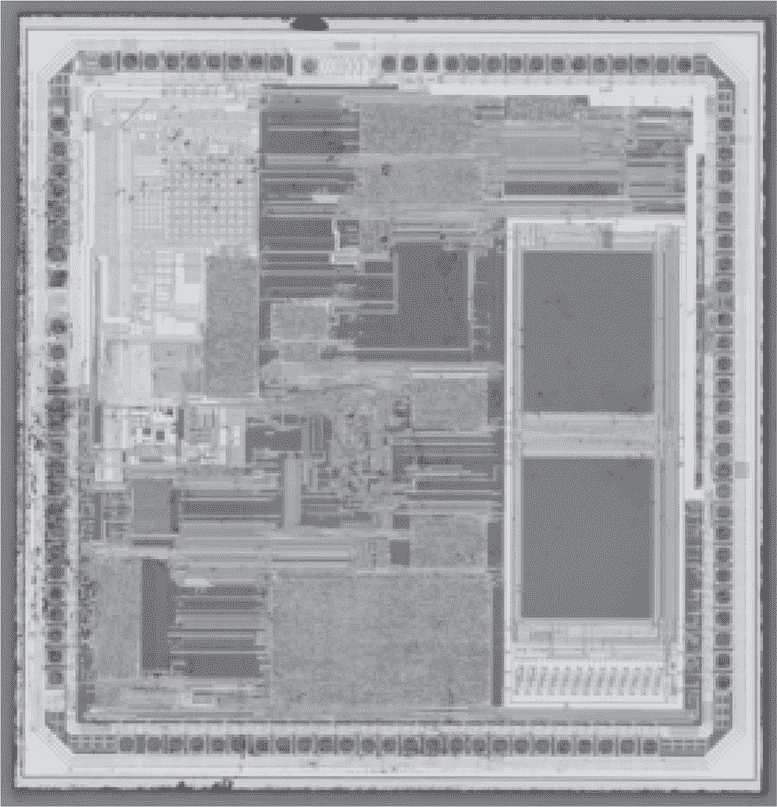
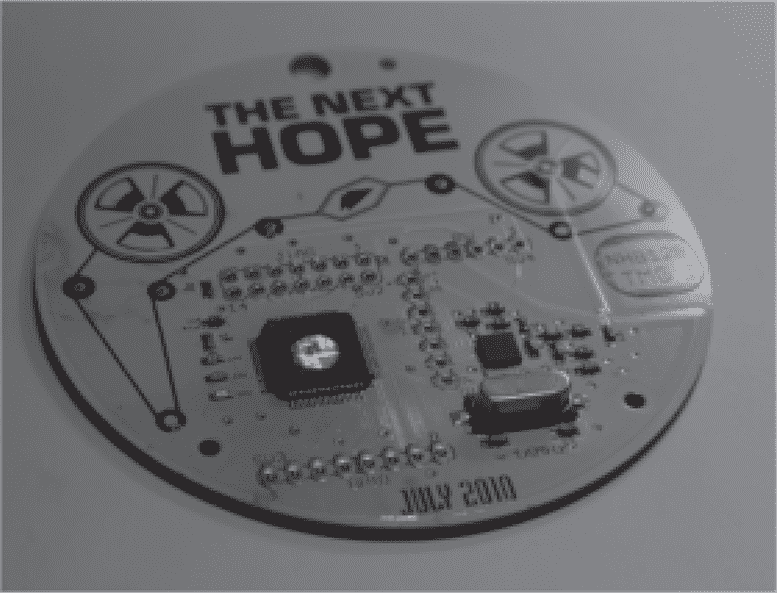
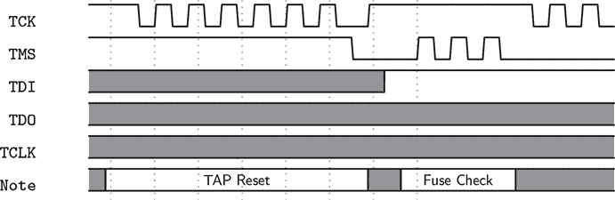
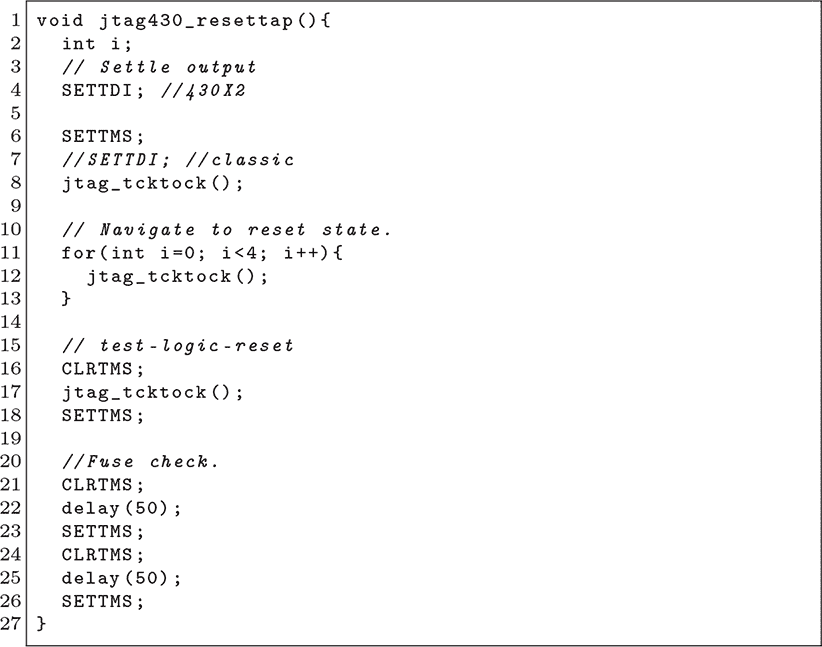

## 第二十章：**20 MSP430 攻击方法**

早期的 MSP430 系列，如 MSP430F1xx、F2xx 和 F4xx，容易受到一种半侵入性攻击，这种攻击首次由 Thomas（2014）公开记录，在这种攻击中，使用相机闪光灯伪造保险丝检查，而 JTAG 调试器则在一个紧密的循环中尝试连接。

这些芯片有两个访问控制。JTAG 受到金属迁移保险丝的保护；这是一条位于芯片上的薄金属线路，当通过它的电流过大时，会永久断开。与保险丝无关的是一个 32 字节的密码，它是访问串行引导加载程序（BSL）所必需的。这个密码是位于内存末尾的中断向量表（IVT），没有它，BSL 只能进行擦除内存的操作。由于 BSL 无法读取保护保险丝，你可以通过首先提取闪存的最后 32 个字节，然后将它们提供给引导加载程序，从而利用该芯片。

首先要理解的是，芯片中的所有晶体管实际上都是光电晶体管。如果足够强的光照射到这些晶体管之一，它将导电，即使它在电气上应处于非导电状态。CMOS 技术通过将每个导电晶体管与非导电晶体管进行平衡来实现其功率效率，而强光照射的闪光灯会将所有设计约束抛诸脑后。树莓派 2 因其暴力崩溃而闻名，这通常是由于 PCB 上的裸露芯片在拍照时造成的^1。

图 20.1: MSP430F449

第二个要理解的事情是，MSP430 的 JTAG 端口被硬件保险丝锁定，至少在 MSP430F5xx 系列之前的设备中是这样。当你连接 JTAG 调试器时，它会通过 TDI 引脚向保险丝输入小电流来测试保险丝。如果测试成功，JTAG 将解锁，芯片可以被读取。如果测试失败，一项“无害无损”的政策允许在所有但最早期的芯片上进行更多的保险丝读取尝试。

为了解锁这些芯片，我们将首先通过使用红色烟雾硝酸（RFNA）滴定法进行现场去壳。去除封装后，我们将芯片连接到 GoodFET 进行 JTAG 调试，并修改 GoodFET，使其反复尝试 JTAG 保险丝检查，直到成功。通过对裸露的芯片进行拍照，我们将绕过保险丝检查并启用被锁芯片的调试功能，从而可以自由地提取固件。

### **使用 RFNA 进行现场去壳**

这里介绍的现场去壳程序在概念上类似于我们在第十八章中讲解的完全去壳，但有一些关键的区别，以保持连接线和部分封装完整，使芯片在裸露的情况下仍能正常工作。如果你没有化学实验室可用，也不愿意自己动手制作，你可以雇佣一个故障分析实验室来为你执行这一过程。

我们将使用红烟硝酸（RFNA），而不是 65%的硝酸，后者有时会溶解连接线。RFNA 至少含有 90%的硝酸和最多 2%的水。这是非常强烈的化学物质，会与腈纶手套和异丙醇剧烈反应，所以一定要在通风柜中工作，并穿戴全套安全装备。

从将目标芯片焊接到载体 PCB 开始，不要有其他组件。将其加热至约 100°C，远低于焊料的熔点，但足够高以使酸液能够侵蚀封装。

图 20.2：去封装后的 MSP430F2418

你的目标是暴露芯片中央的裸片，而不让酸液溅到引脚或 PCB 上。一开始，芯片的封装表面是平的，所以任何大量的酸液都会溢出。从一个冷的烧杯中取少量 RFNA，并使用带有非常窄尖的移液管，将最小量的酸液滴在芯片封装的正中央。

关于酸液量的快速但重要的提示：如果移液管尖端形成了一个水滴，说明你即将使用过多的酸液。你希望第一次滴落的酸液尽可能少。想象一下，你正在用移液管像钢笔一样在纸上书写。

酸液首先会看起来渗透到芯片的表面，然后开始稍微冒泡。在允许一些气泡分解封装材料后，使用一喷丙酮清除酸液，留下剩余的封装。重复这一过程几次，会在封装内形成一个类似碗形的空腔，你可以开始使用更多酸液来加速刻蚀过程。

每次使用丙酮冲洗后，都要在强光下仔细检查封装。当你开始看到连接线在黑色封装中闪光时，说明你已经接近裸片。在这个阶段，你应该更早一点冲洗，以确保酸液不会煮干，留下遮掩裸片的难看塑料痕迹。

如果这个过程成功，你应该得到一个引脚及其周围封装完好无损的封装，同时裸片及其连接线被暴露出来。裸片的清洁程度不如浸泡法处理的裸片干净，但表面残留的少量污垢不会妨碍后续操作。

一定要小心地先用丙酮、然后用异丙醇和去离子水冲洗芯片和板子，以防剩余的酸液溶解板上的线路或氧化引脚。这一最终清洗应该是实验中唯一一次使用异丙醇，因为异丙醇会与 RFNA 剧烈反应，实验室爆炸通常不被欢迎。同样，水会去除金属盐，这些金属盐保护连接线和框架免受 HNO[3]的侵蚀，因此你应该避免在最后清洗之前使用水。

### **熔断器检查序列**

既然我们已经打开了目标芯片的封装，接下来的步骤是触发故障。要自行完成此操作，您需要一个可以获取源代码的 JTAG 编程器，如 Good-speed（2009），以及 MSP430 芯片的 JTAG 规格说明书，德州仪器（2010）。

我想我们可以使用激光器，进行精细的脉冲控制，精确地在正确的时间和位置射击。（^(2)）感谢科技进步，如果我们稍微修改一下我们的 JTAG 编程器，这样的设备就不再是必须的。在这个示例中，我们将使用我开源的 GoodFET 编程器，尽管它有点过时。

图 20.3 显示了 MSP430F1xx、F2xx 和 F4xx 设备的硬件保险丝检查序列。该检查通过至少两次切换 TMS 引脚来完成；如果保险丝未被烧毁，2 毫安的电流将流入 TDI 引脚。图 20.4 是我在 GoodFET 项目中用 C 语言实现的 JTAG 保险丝检查序列示例。

配备原始 MSP430 CPU 和 CPUX 扩展的设备存在一个错误，可能在上电时未通过保险丝测试，因此需要进行另一次电源循环才能重新测试保险丝。CPUXv2 设备在重置 JTAG TAP 时会清除保险丝检查结果，这可能会使得当您通过相机闪光模拟保险丝检查时变得更加复杂。

图 20.3：MSP430 JTAG 保险丝检查序列

图 20.4：在 Goodspeed（2009）中的 MSP430 保险丝检查

MSP430F5xx 和 F6xx 设备已经取消了硬件保险丝检查，取而代之的是通过软件机制实现读取保护。本章的攻击方法预计不适用于这些设备。

当目标芯片正常工作且裸芯片暴露时，利用此环境进行攻击包括反复尝试保险丝检查，并观察是否已通过，同时对裸芯片施加相机闪光。可以通过两种方式修改图 20.3 中的序列：要么重复序列直到检查成功，要么通过延长 TMS 引脚上的周期数来增加尝试通过测试的次数。

在硬件方面，当相机闪光照射到裸芯片上时，目标芯片会消耗相当大的功率。我们并不是在进行电压故障攻击，所以瞬态功率消耗应由去耦电容器和可能的台式电源来处理。

当整个布局完成后，大约每四次相机闪光就应解锁目标并建立 JTAG 连接。请在设置过程中非常小心，以确保保持连接打开，切勿以会要求重新检查保险丝的方式重置芯片。

你还应该预期，在连接建立后，闪存可能会因为相机闪光灯的影响而出现读取错误，直到它稳定下来并存储永久值。我通过反复读取所有闪存几次来解决这个问题，将早期的读取结果保存下来以备不时之需，但依赖后续的读取结果来获取真实的程序内容。内存被暂时“冻结”的效应也可能被用来临时破坏常驻在 ROM 中并忽略 JTAG 保护保险丝的串行引导加载程序（BSL）的密码。
