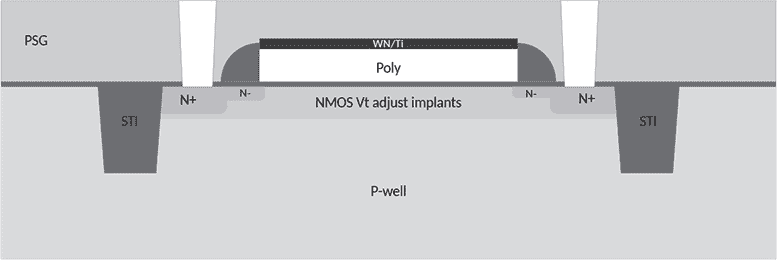
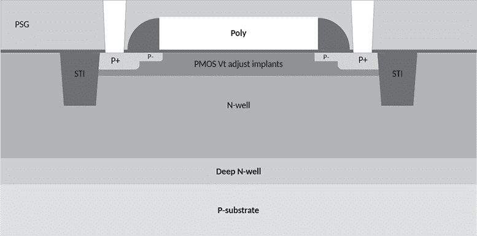
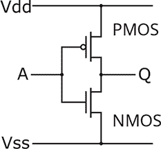
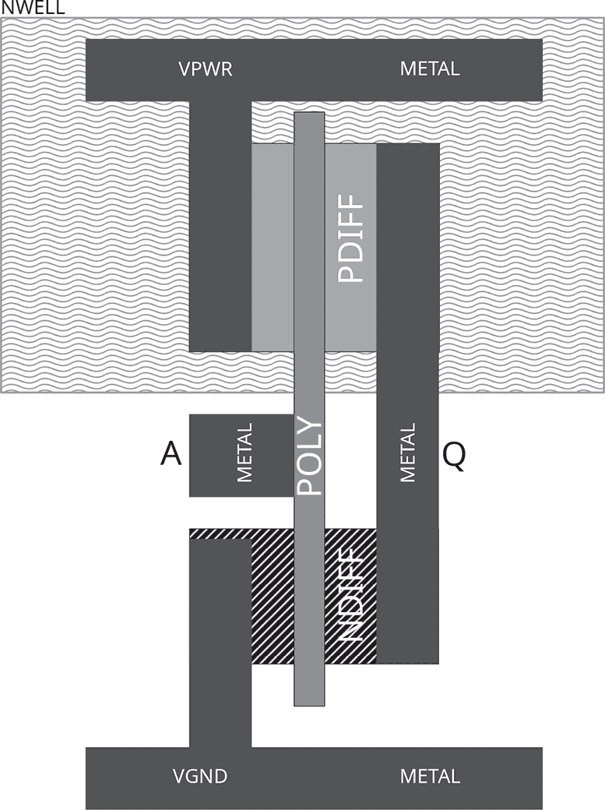

## 第二十一章：**21  CMOS VLSI 插曲**

很早在第十八章中，我们就暂时不讨论破坏芯片，而是快速研究了晶圆如何被封装。我们看到，芯片被锯开后，会被粘在一个引线框架上，并通过导线与引脚连接。整个框架随后被包裹在环氧树脂中，然后引脚被弯曲成正确的形状，框架的多余部分则被切除。在本章中，我们将深入探讨芯片是如何设计和制造的。这不会像关于超大规模集成电路（VLSI）的专门书籍那样详细，如果你需要详细了解，可以阅读相关书籍。

超大规模集成电路（VLSI）技术是将数百万甚至数十亿个金属氧化物半导体（MOS）晶体管集成到微芯片中的技术。这些晶体管被组合成几百个独特的逻辑单元，称为*基本模块*，这些模块是实现特定功能的小型晶体管集合，如逻辑门或存储单元。这些模块被放置并连接形成 VLSI 芯片的知识产权（IP）模块。较大的 IP 模块包括 CPU、SRAM、掩膜 ROM 和闪存 ROM。IP 模块可以手动设计，也可以通过高级语言如 Verilog 或 VHDL 进行设计。

这个解释在高层次上是有效的，但重要的细节被省略了。逻辑的基本模块是什么样的，存储器也是由这些模块构建的吗？让我们来看看。

### **工艺层**

我们在第十八章中学到，光刻技术用于将化学层放置到硅片上，然后选择性地将其蚀刻掉。这些层按给定工艺的顺序堆叠，并且在本节中，我们将介绍这些层在制造后按顺序堆叠的方式。这与它们的制造顺序有所不同，因为在制造过程中，晶圆厂有时会通过一层材料向下挖掘，以便将另一层放置在芯片的更低位置。

该过程从一块由硅制成的大硅片开始。层被堆叠到硅片的*正面*，而硅片的*背面*保持为空白。在大多数封装芯片中，正面朝向远离电路板的一侧，但也有例外，例如我们将在第二十四章中讨论的 MYK82 芯片。一些采用晶圆级芯片规模封装（WL-CSP）的设备没有封装，它们将焊球放置在芯片的正面。

纯硅在做很多事情时并不非常有用，因此，尽管我们开始时使用纯硅，但我们通常会将其掺杂成*n 型*或*p 型*。这些名称与它们的电荷类型有关，n 型带负电荷，而 p 型带正电荷。

在最底部，我们有一层 p 型*衬底*，它覆盖了整个硅片的表面。NMOS 晶体管可以直接放置在这个衬底上，但 PMOS 晶体管必须放置在一个*n-well*中，这个 n-well 是挖掘到衬底中的。稍后我们将回到 NMOS 和 PMOS 晶体管之间的区别。

在 p-基片和 n-井上方，我们有一个*扩散*层，它将 n 型和 p 型硅大致保持在相同的深度。这些通过掩膜将带电离子注入到暴露的 p-基片或 n-井中，形成*掺杂*层。

在扩散层上方，我们有*多晶硅*。多晶硅最重要的作用是作为 NMOS 和 PMOS 晶体管的输入。无论何时你看到两个相同扩散类型（p 或 n）之间的多晶硅轨迹，那就是一个晶体管。在数字逻辑中，最容易将晶体管看作开关；通过多晶硅上的输入，电流在扩散层之间的流动被打开或关闭。

在多晶硅上方，我们有金属层，用于将芯片的各个部分连接起来。在 70 年代，通常只有一层金属。开放源代码的 SKY130 工艺有五层金属，而 MOSIS 200 纳米工艺有六层。从 2003 年开始，具有九层和十层的工艺变得常见。在旧的芯片中，这些金属通常是铝（Al），但现在铜（Cu）已经相当普遍。

SKY130 和 MOSIS 都是相对开放的工艺。这种情况是例外而非常态，对于许多芯片来说，你无法享受低级别的工艺文档。

具有多层金属的芯片将像印刷电路板一样进行布线，但对于只有一层金属的芯片，通常可以看到金属被布置到一段短的多晶硅上而没有晶体管。这是一种跨越电路而不连接它们的方式。

这不是一个完全独立的层，但你会注意到，有时金属在多晶硅或扩散层上方会显得更暗。这是*接触*或*过孔*，用于连接各层之间。

我跳过了一些层，专注于反向工程中重要的部分，并保持对许多代工厂的通用解释。这些包括用于隔离各功能层之间的氧化层，用于由金属层构建电容器的封装层，以及其他在 CMOS 中并不基本但在实际芯片制造中非常有用的元件。要了解任何实际工艺中的更多信息，你需要查找相关代工厂的工艺开发工具包中的文档。

图 21.1：SKY130 NMOS 晶体管横截面

图 21.2：SKY130 PMOS 晶体管横截面

图 21.3：CMOS 反相器电路图

### **NMOS 和 PMOS 晶体管**

现在我们理解了各个层次以及它们的堆叠顺序，让我们来看一下如何用这些组件构建有用的逻辑。CMOS 逻辑是由两种类型的晶体管构建的：NMOS 和 PMOS。

NMOS 晶体管在输入高电平时导通，将输出拉低至低电压。PMOS 晶体管在输入低电平时导通，将输出拉高至高电压。任何给定的栅极都会包含这两种类型的晶体管，它们之间的平衡使得 NMOS 晶体管在输出为高时拉高电平，而 PMOS 晶体管在输出为低时拉低电平。^(1)

为了制造一个晶体管，首先将一条多晶硅放置在一个扩散区上，将其分成两半。多晶硅是输入或*栅极*连接，控制电流在扩散区的两半之间流动，我们将其称为*源极*和*漏极*。这种结构，n 型扩散区位于 p 型衬底上，构成了 NMOS 晶体管，而同样的结构，p 型扩散区位于 n-well 上，则构成 PMOS 晶体管。

请参见图 21.1 和 21.2，其中展示了 SKY130 工艺中的晶体管横截面，包括一些在此解释中我跳过的额外细节。在这些图中，`N`和`P`描述了扩散区，它们分别成为晶体管的源极和漏极。晶体管的栅极是位于它们之间的多晶硅线。

在特别老的芯片上，你会发现仅使用 NMOS 晶体管，并且用上拉电阻代替 PMOS 晶体管。按照现代标准来看，这种做法效率不高，但在当时非常实用，并且节省了在制造过程中需要放置 n-well 层或 p 型扩散区的步骤。

这两种晶体管类型足以构建任何形式的数字逻辑，但还有第三种类型，称为*浮动栅极晶体管*，它存在于 EPROM 和闪存中。浮动栅极晶体管与 NMOS 非常相似，唯一不同的是它们有两层多晶硅堆叠在一起。上层多晶硅是*控制*栅极，而下层则是浮动栅极。所谓*浮动*，意味着它在电气上是断开的，并且持有可以通过源极和漏极读取的电荷。

为了强调一切都会随着工艺发生变化，我应该告诉你，浮动栅极有时是由氮化硅制成的，这种技术称为 SONOS。这对闪存的质量和密度非常重要，但这是一个复杂因素，在本书中我们不会过多关注。

浮动栅极晶体管被*编程*为零或*擦除*为一。编程通过在源极和漏极保持低电平，同时将栅极设置为高电平进行；这样会向浮动栅极添加电子，使得晶体管在源极和漏极之间的导电性降低。擦除则是相反的过程，通过将两个扩散区设置为高电平，同时控制栅极为低电平，从而使电子从浮动栅极流出，使得晶体管在两个扩散区之间的导电性增加。

漂浮栅极晶体管也可以通过紫外线光进行擦除，就像我们在第十九章中看到的那样。在早期，设备会使用这种方式进行唯一的擦除，没有石英窗口的设备基本上是一次性的。后来，芯片加入了电擦除电路，消除了在开发过程中需要紫外线擦除的需求。

### **基本模块**

现在我们理解了特定的形状会构成晶体管，CMOS 由两种互补类型的晶体管构成，整个微芯片的行为由晶圆上的微观形状定义。

芯片设计师通常首先选择一个将要制造芯片的公司，然后从工厂或*工艺厂*支持的工艺列表中选择一个过程设计套件(PDK)。对于任何给定的工艺，都必须编写 PDK 来描述该工艺的基本模块，并提供关于其特性（如时序和电压范围）的仿真数据。

一些设计套件被发布，用于大学课程或像 MOSIS 这样的多项目晶圆。最近，Cypress 大约在 2001 年使用的 130 纳米工艺作为 SKY130 PDK 开源。如果你曾想知道一个单元可能是什么样子，渲染一些来自这些 PDK 的单元看看它们是如何实现的非常方便。当然，无法保证你的工艺会相似。

图 21.4 是简化版的 CMOS 反相器示意图，采用的是 SKY130 工艺，由 Matt Venn 提供的示例所示。输入*A*位于块左侧的小金属片上，输出*Q*位于右侧较长的金属片上。电压来自顶部，地来自底部，就像图 21.3 中相同反相器的电路图一样。这个单元是从上方观察的，如果仔细看，你应该会看到，顶部的 PMOS 晶体管与图 21.2 中的截面相匹配，底部的 NMOS 晶体管与图 21.1 中的截面相匹配。

图 21.4：CMOS 反相器布局

PDK 将包括成千上万的这些单元，以表示数字逻辑门、触发器以及像电阻和电容这样的无源元件。许多这些单元是为了降低功耗或提高反应速度而设计的，因此只有几百个单元会出现在给定的设计中。它们通常排列在规则的行列中，以便于电源轨的连接，金属层的电线将它们连接在一起。当这些安排由 VLSI 软件处理时，看起来没有明显的规律，我们称之为*门海*。

### **大型结构**

最后，我们应该考虑大型结构的情况。基本模块可以放置并布线以形成任何你想要的逻辑，但在实现像内存这样的功能时，结果远非高效。

相反，芯片设计师会使用某种编译器来生成正好符合需要的内存尺寸。这不仅有助于密集地打包内存的位，还可以确保内存满足时序和电气要求。请参见 Guthaus 等人（2016）的开源 RAM 编译器示例，以及 Walker（2023）对该编译器的扩展，支持掩模 ROM。

阅读这些论文时，你会看到内存往往扩展性差，在某个尺寸下工作正常，但当其尺寸稍微增大时，性能就会急剧下降。当你看到一些微控制器有多个小内存尺寸时，比如 TMS320 系列的一些成员，原因就在这里。

在 第二十二章 中，我们将看到如何通过化学方法揭示 ROM 的内容，然后处理这些照片。别担心，这比反向工程芯片的其他部分容易多了。

### **反向工程**

到这时，你应该明白一个芯片的逻辑是由标准单元构成的。这些单元被排布在设计中，然后在金属层中连接在一起，也许还会用到一些多晶硅。如果我们能拍摄这些并做标注，为什么不反向工程芯片的逻辑呢？

反向工程芯片逻辑通常从识别去层化芯片照片上的基本模块开始。一旦基本模块被反向工程，便可以在芯片上识别相同形状，从而识别所有该模块的副本。模块识别完后，就可以追踪基本模块之间的连接，并解码成其实现的数字逻辑。

Degate 是一个开源 CAD 工具，用于执行此类工作，首先构建一个基本模块库。它有演示项目，分别是 DECT 电话的控制芯片和 Legic Prime RFID 标签，每个项目都被分解成与设备行为相匹配的 Verilog 代码。

也可以使用像 Inkscape 这样的分层图像编辑软件进行反向工程。6502 的分层图像可以在 Visual6502（2010）中找到，从中该项目恢复了所有门并生成了准确的仿真。对于 Yamaha 的 OPEN 系列 FM 音频合成器芯片，Raki（2024）提供了描述标准单元和布线的 SVG 文件，以及反向工程的电路图。
