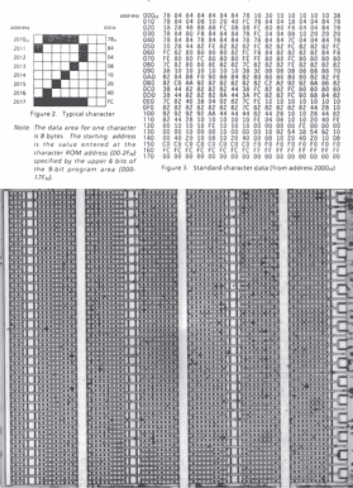
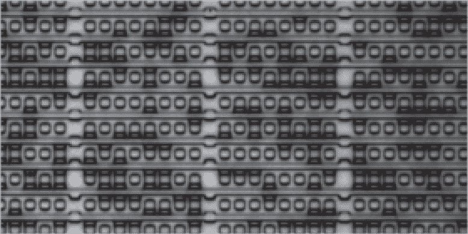
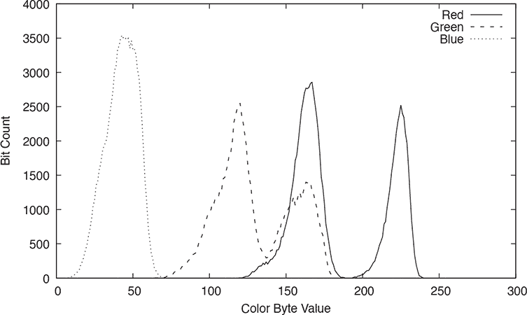
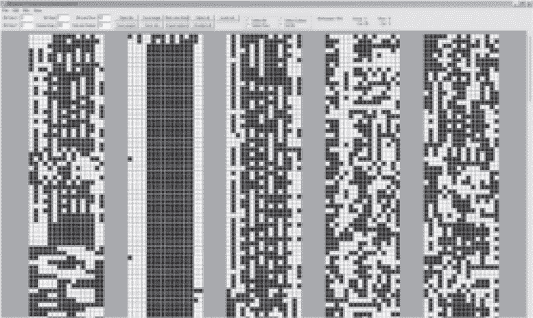
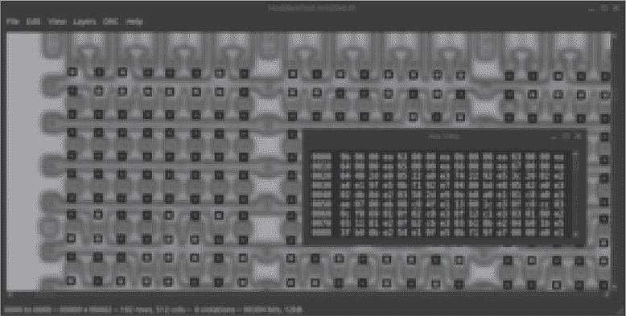

## **22  掩膜 ROM 摄影**

有些芯片将它们的程序位存储为掩膜上的标记，这些掩膜是光刻绘制微芯片的。我们称这种 ROM 为掩膜 ROM，以区别于 EEPROM、闪存 ROM 以及其他现场可编程技术。本章将讨论拍摄这些 ROM 以提取其位的理论，接下来的章节将以从头到尾的实例来解析真实的目标。

掩膜 ROM 有三种类型：通孔、扩散和植入。这些在化学和物理上差异很大，但在提取它们时，我们只需要足够了解它们，以便使位变得可见。表 22.1 列出了许多微控制器及其 ROM 过程。

*通过*或*接触*ROM 使用通过层之间的通孔来标记一个位。这些在布局空间方面效率不高，但它们非常容易解码，因为当你找到它们时，位是清晰可见的。许多 ROM，例如任天堂游戏机的 Game Boy，甚至可以在不去除层次的情况下直接从表面看到！

*扩散* ROM 位于芯片较低的位置。这里的位通过扩散池的存在或其缺失来标记，从而使晶体管工作或破坏晶体管。由于它们位于较低的位置，你几乎总是需要去层才能看到它们，但在这个过程中损坏芯片的风险很小。

*嵌入式* ROM 是这三种中最让人沮丧的。位是通过在一个正常工作的晶体管中附加离子植入来编码的，而由于某种该死的巧合，损坏和未损坏的晶体管颜色完全相同！这些 ROM 通常需要去层到位的内部，然后使用 Dash 蚀刻法将其着色差异显现出来，我们稍后会讨论这一点。

|  模型  | ROM 类型 |
| --- | --- |
| TMS1000 | 通孔 |
| Game Boy | 通孔 |
| T44C080C | 通孔 |
| TMS320C15 | 通孔 |
| MSP430F1, F2, F4 | 通孔 |
| 6500/1 | 扩散 |
| EMZ1001 | 扩散 |
| MYK82 | 扩散 |
| Tengen Rabbit | 扩散 |
| TMS32C10NL | 扩散 |
| HCS300 | 扩散 |
| Z8 | 扩散 |
| SM590 | 嵌入式 |
| MK3870 | 嵌入式 |
| TLCS-47 (TMP47) | 嵌入式 |

表 22.1: ROM 类型示例

当然，有很多方法可以编码位，就像硅工匠发明的独特形状一样。我使用这些宽泛的类别来描述提取位所需的努力，但当然也有一些 ROM，其标记在金属层上而不是通孔层上，这些也能从表面看到。就像逆向工程中的一切一样，我们先使用这个抽象概念，直到它不再有用，再深入挖掘，看看里面的情况。

### **显微镜学**

一旦芯片准备好，我们需要拍摄它。

你需要一台冶金显微镜，它的光柱通过镜头垂直照射到芯片上并反射回来。那种将光从样品上方发送的显微镜非常适合生物学，但对于拍摄不透明的微芯片毫无帮助。

还需要一台相机。虽然通过单目显微镜的镜头适配器可以获得不错的图片，但使用三目显微镜要更容易，这样你的眼睛可以找到目标，只有在拍照时才需要用到相机。

通常不可能将图像缩小到足够小的程度，以便同时保持图像的细节和整体框架，所以我们通常会拍摄一系列相互重叠的照片。拍摄后可以使用全景软件（如 Hugin）将这些照片合并。

这种摄影在显微镜能力的极限下可能会非常繁琐，所以我通常会先在最低放大倍率下拍摄整片芯片的全景，然后再用高倍率拍摄我感兴趣的区域，例如 ROM。非常感谢 John McMaster，感谢他卖给我一台带有电动舞台的显微镜，因此我现在的所有照片都具有一致的间距和文件名，文件名显示了行和列。

### **使用氟化氢酸去层**

要去除芯片的层，我将它加热到稀释的氟化氢酸（HF）中，在美国可以通过 Whink 或 Rust-Go 品牌的生锈去除剂买到。

氟化氢酸对你的骨骼有危险，它会在没有太多皮肤疼痛感的情况下损害你的骨骼。如果你处理这种物质，请非常小心，并且不要忽视安全措施。^(1) 氟化氢酸的另一个麻烦是，我们使用它是因为它会攻击玻璃，所以我们不能用玻璃烧杯来容纳反应。此时塑料烧杯或塑料离心管非常重要。

当氟化氢酸攻击目标时，你会看到一些气泡，这是因为它与金属发生反应。第一波气泡通常表示顶部金属层，在需要达到特定深度的反应中，通常很有帮助的是同时去层多个芯片，然后在事后对它们进行排序，以找到适当的深度。

你可能会注意到金属层会从芯片上剥离，而不是溶解成液体。轻轻搅动有助于将这些金属层从芯片上移开，以免它们遮挡去层反应。

### **Dash 蚀刻用于植入型 ROM**

对于植入型 ROM，其中的位是相同颜色的，我们需要为它们赋予不同的颜色以便拍摄。这是通过使用 Dash 蚀刻在去层后完成的，最佳描述可以参考 Beck（1998）和 McMaster（2019）。

这里的去层可能会让人感到困惑，因为你无法真正看到我们距离想要拍摄的植入体有多近。你可以尝试去层多个样本，并将那些没有充分去层的样本送回浴槽。

Dash 蚀刻由三部分组成。氟化氢酸和硝酸攻击硅，而醋酸（HAc）则缓冲反应并减缓其速度。当比例合适时，p 型掺杂将稍微偏向氧化反应，导致 p 型硅比 n 型硅更快地变为棕色。

我使用 John McMaster 的 Rust-Go 溶液进行此操作，该溶液由 3mL 的 65% HNO[3]、4mL 的 12% HF（Rust-Go）和 8mL 的醋酸组成。最终的比例大约是 4.3%的 HNO[3]和 3.2%的 HF；溶液的其余部分是 HAc 和 H[2]O，用于缓冲反应。

Beck 推荐使用的溶液由 3mL 65% HNO[3]、1mL 48% HF 和 10 mL 至 12 mL 98% HAc 组成。McMaster 自己已经转向了这种混合物，而我仅仅因为 HF 是一种有毒的毒药而犹豫不决。^(2)

无论使用哪种方法，已经去层的芯片会被放置在明亮的光源下进行观察，例如来自卤素光纤灯的光。光照一两分钟后，芯片的某些部分会变暗，如果幸运的话，数字“1”会比“0”显得更加暗。

图 22.1：TMP47C434N 植入 ROM

在这些反应过程中，保持金属含量低是至关重要的。你不能让去层反应中的任何金属盐留在玻璃器皿上，也不能让任何残留的铅框在芯片下方留下。通常，你甚至可以看到反应过程中镊子在芯片边缘留下的痕迹。

图 22.1 展示了 TMP47C-434N 的字体植入 ROM 的数据表描述，并附有我实验室拍摄的芯片照片，这些位通过 Dash 蚀刻处理后被染色。请注意，Dash 蚀刻导致了对比度的不均匀；有些部分比其他部分要暗得多或亮得多。

### **从照片到位**

在拍摄了位图像后，有必要将这些位数字化提取。做到这一点的一种方法是仔细手工写下每一位，耐心地标记每一个零或一，同时不丢失位置或失去耐心。另一种方法是让软件来做这项枯燥的工作。正如 Crigger 教练在高中时常对我说的：“聪明地工作，而不是拼命工作。”

一个早期的公开示例是 Laurie（2013）的 Rompar，这是一个用 Python 编写的应用程序，用于标记汽车钥匙遥控器中 MARC4 微控制器的位。最近，Gerlinsky（2019）的 Bitractor 和我自己在 Goodspeed（2024）发布的 Mask ROM Tool，都是用 C`++`编写的。这三种工具在实现和使用上有很大差异，但它们的基本原理是先得出一个位位置矩阵，然后采样每个位的颜色，以确定“1”和“0”之间的区别。

图 22.2：MYK82 在扩散层中的位

图 22.3：MYK82 ROM 中的颜色分布

当你自己尝试时，你会发现简单的采样策略出奇有效。大多数位可以通过一个颜色通道的阈值来正确解码，通常是红色或绿色。通过绘制每个颜色通道的样本直方图来提高这种成功率，以确保“1”和“0”之间有清晰的双峰分离，并确保你的阈值设定在这两组之间。

以一个具体的例子，图 22.2 展示了 NSA 的 MYK82 比特的特写，我们将在第二十四章中详细讨论并提取它的 ROM。在图中，你会看到中央方块和水平导线之间的比特，呈现为一个比周围更暗的矩形框。图 22.3 展示了红色通道中，1 与 0 之间的对比有多明显，完全分离，阈值处没有比特，且几乎没有比特接近阈值。绿色通道的分离几乎同样好，而蓝色通道则没有明显的分离。

在任何颜色通道中如果没有干净的二分法分隔，图像预处理或通过采样多个像素来创建分隔可能会有所帮助。在我的工具中，我有一些采样技术，它们返回每个颜色通道中最暗的部分，通常是薄的水平或垂直条带。这对过度蚀刻的扩散 ROM 特别有效，在这些 ROM 中，比特的边缘有颜色，但比特中心的任何颜色差异已经被蚀刻掉。

虽然现有的比特标记工具之间存在许多差异，但它们都统一使用 ASCII 艺术作为导出格式。通常，较宽的轴被任意定义为 X 轴，以适应计算机显示器的尺寸，你可能需要进行一些旋转才能解码这些比特。

### **从比特到字节**

在从物理顺序提取比特后，你需要将它们重新排列成逻辑顺序的字节。在我们开始讨论一些可以减轻这个过程痛苦的工具之前，先让我们来讨论一下比特最初为什么会以如此混乱的顺序排列。

在自然语言中，我们的书写方式有很大的多样性。有些语言从左到右书写，而有些则从右到左。有些语言通过字母组合来表示单词，有些则使用表意符号，还有一些语言混合了这些概念，通过将小符号组合成更大的符号来表示一个单词。

ROM 也有一些常见的规则和无限多样的排列方式，但几乎有一个概念是它们从未实现过的。它们几乎从不将一个字节的比特聚集在一起，而是更倾向于将它们分散到八列中，以便于物理上的便利。

要弄清楚比特的排列顺序，一种方法是非常仔细地研究 ROM 的比特，并尝试不同的模式，直到它们有意义为止。例如，在一个 16 位的微控制器中，如果你看到 16 列，你可能会猜测每列提取一个比特来构成一个字。检查顶部行和底部行的所有字，可能会揭示出程序的入口点，从而使整个布局变得有意义。

Gerlinsky（2019）介绍了 BitViewer，这是一个工具，见图 22.4，它以图形方式显示比特，调整它们的组织方式，以便操作员能够探索其含义。加载比特流后，你可以选择比特像素的高度和宽度、它们之间的间距以及每列中的比特数量。比特可以单独选择或按列和行分组，这使得操作员能够发现揭示 ROM 内容的模式。这比在图表纸上做同样的事情要轻松得多。

图 22.4：来自 Gerlinsky（2019）的 BitViewer

图 22.5：来自 Goodspeed（2024）的 MaskRomTool

|  cols-downl  | 第一个比特位于左上角，然后向下移动，

然后向右移动。 |

| cols-downr | 第一个比特位于右上角，然后向下移动，

然后向左移动。 |

| cols-left | 第一个比特位于右上角，然后向左移动，

然后向下移动。 |

| cols-right | 第一个比特位于左上角，然后向右移动，

然后向下移动。 |

| squeeze-lr | `byte&0xAA` 使用 cols-left，`byte&0x55` 使用 cols-right。 |
| --- | --- |

表 22.2：Zorrom 解码策略

McMaster（2018）采用了另一种方法，称为 Zorrom。它实现了多种已知芯片的解码策略，并提供了一系列转换功能，如 X 轴翻转、比特矩阵旋转以及比特反转。幸运的时候，大约一半的时间，它可以仅凭比特流和对几个比特或字节的猜测正确地解码。

Zorrom 的解码策略列出在表 22.2 中。要应用策略，首先将比特列分成八组，然后从每一组中取出一个比特组成一个字节，最不重要的比特位于左侧。所以，对于 cols-downr 策略，第一个字节将由每组的右上角比特组成。第二个字节的比特位于第一个字节的下方，在从每组的每行取出一个比特后，你会向右移动一列比特并从顶部重新开始。

它不支持从组的底部开始解码或将最重要的比特放在左侧的解码策略。这些由现有策略处理，在旋转和 X 轴翻转后执行。

我自己的比特解码解决方案叫做 GatoROM，它既可以作为一个 CLI 工具运行，也可以作为一个 C`++` 库运行。随后，使用该库编写了我从 Goodspeed（2024）获得的 Mask ROM 工具的 GUI 扩展。它无耻地借鉴了 McMaster 的工具，实现了所有必要的转换，以便与他的解码器兼容。

作为库使用时，`void*` 指针可以实现物理顺序的位与逻辑顺序的字节之间的双向关联。你可以在十六进制查看器中选择字节，然后让软件在图形用户界面（GUI）中高亮显示它们。当为不完全符合现有解码策略的芯片实现新的解码策略时，这非常方便。

无论你使用什么工具解码 ROM，最终结果都是一个包含字节的平面二进制文件。当你首次得到有意义的解码结果时，应该对其顺序保持一定的怀疑，因为小的顺序错误可能直到 ROM 被反汇编并进行逆向工程时才会被发现。^(3)
