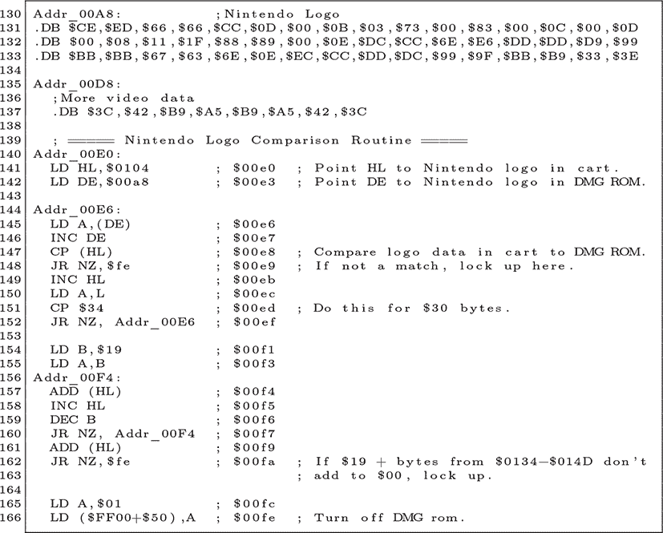
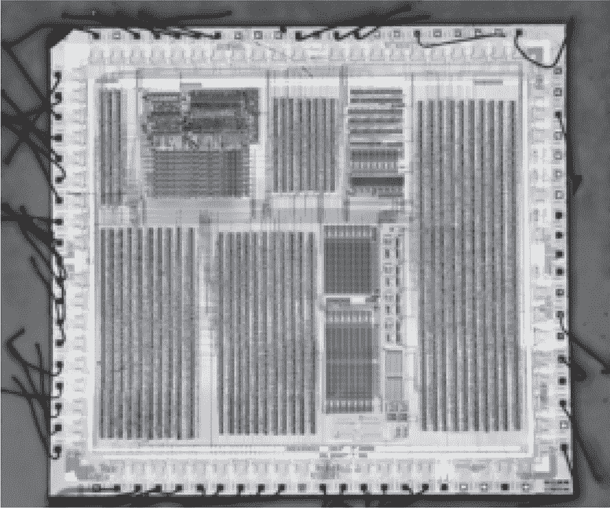
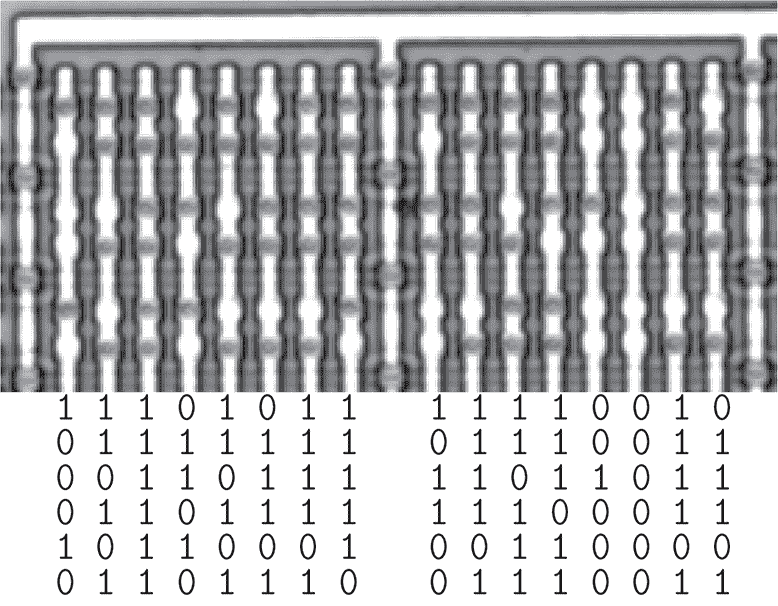
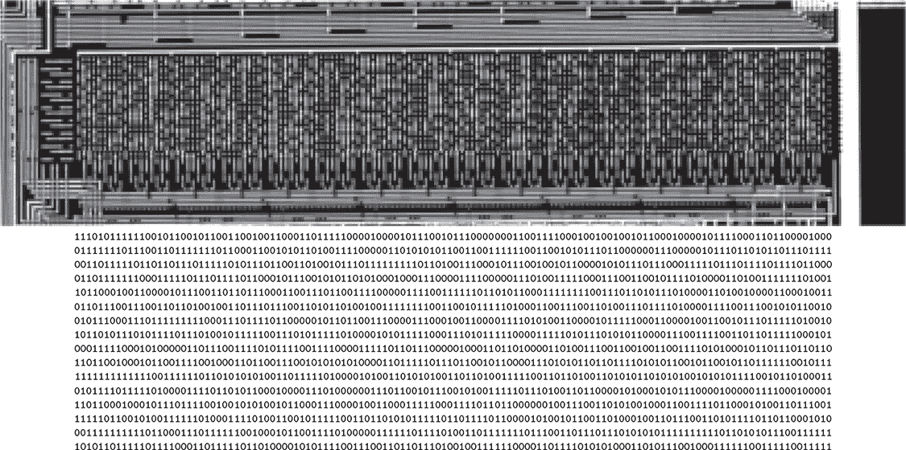
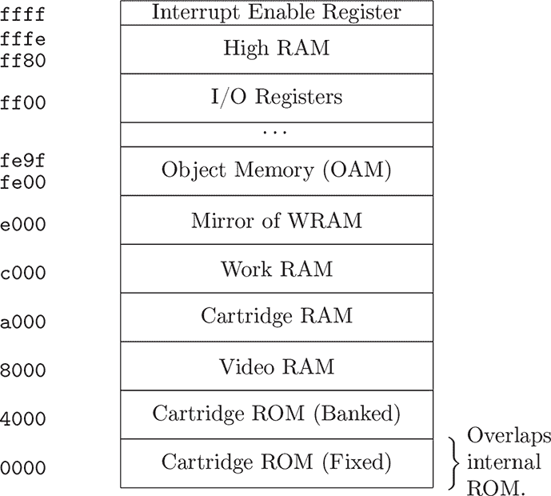
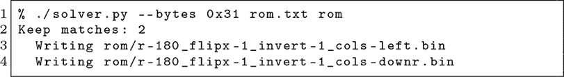
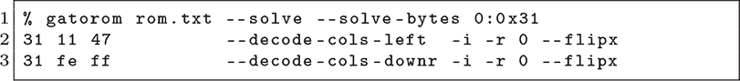

## 第二十三章：**23  Game Boy 通过 ROM**

任天堂的 Game Boy，内部被称为点阵图形游戏（DMG），并未配备我们将在第二十五章中讨论的 CIC 保护芯片。游戏卡带需要包含任天堂的 logo，而不是一个锁定芯片。

这一过程由第一阶段启动 ROM 强制执行，它将自己的 logo 与卡带中的 logo 进行比较。如果两个 logo 匹配，则会播放一个简短的动画和声音，随后 ROM 会禁用自己并跳转到游戏卡带。在本章中，我们将以上一章的理论为基础，提取 ROM 内容并进行反汇编。

或许你已经意识到，任何人都可以将任何 logo 放入卡带中，而且在制作非授权游戏时，logo 比较并不是一个技术挑战。这个强制执行机制并不是技术性的；相反，是任天堂的法律顾问，他们会愉快地将任何未经许可使用其商标的人告得一塌糊涂。如果你，亲爱的读者，恰好是任天堂的律师，请不要起诉我。

Neviksti（2005 年）描述了 ROM 的提取过程。我在自己的实验室中重复了这个过程，并制作了图 23.5 中的 ROM 照片。位元在芯片的表面照片中清晰可见，没有任何去层或染色，使其成为一个极好的首次目标。

如同任何化学实验，请小心不要伤到自己。慢慢而安全地做这些麻烦事，是值得保住你的眼睛和手指的。

图 23.1：来自 Neviksti（2005 年）的 Game Boy ROM 末端

### **去封装**

要获取 ROM，我们首先需要牺牲一台 Game Boy。CPU 标记为`DMG-CPU B`，可以在靠近设备背部、远离 LCD 的板子上找到它。

（Game Boy Color 和 Super Game Boy 的 ROM 从表面上并不清晰可见。请参见第 E.4 章，了解一种在执行来自卡带内存的代码时，使 ROM 保持可见的故障攻击。）

去封装是通过使用第十八章中的 HNO[3]浴法进行的。位元是表面可见的，因此不需要涉及更危险化学品的去层程序。我们基本上只是将整个 QFP 封装浸泡在 65%的硝酸中，直到包装脱落，然后用丙酮和异丙醇清洗，以便拍摄。

### **摄影**

我们要寻找的 ROM 在 CPU 中，其表面芯片的照片展示在图 23.2 中。在这种放大倍率下，位元是无法看到的，因此请查看图 23.3 以获得更近的特写。

要找到 ROM，首先需要找到内存总线，它是位于芯片大约中间的水平电缆。 从西边缘开始，沿着总线向东走，直到它在东侧的门海处终止。ROM 是位于总线正北方、门海正西的薄型水平结构。在适当的放大倍数下，位会显现出来，远距离看几乎像是无法辨认的外文。

黑色点是连接各层垂直的通孔，而亮点则是没有通孔的位置。这使得点的颜色暗示了位的值。当然，并非所有的通孔都是位，但在图 23.3 中，您应该能看到两列八个位和前六行。位于较长金属线中的通孔，那些到达图像顶部电源轨的通孔，不是位，不应该被提取。为了确保您理解什么是位，什么不是位，请花点时间从照片中制作 ASCII 艺术表。

图 23.2：来自 Game Boy 的 Nintendo DMG-01-CPU

图 23.3：DMG-01-CPU 位的特写

图 23.4：位于 `0xA8`（ROM）和 `0x104`（卡带）的 Nintendo 标志

在找到 ROM 及其位之后，我通过冶金显微镜以 50x 放大倍数拍摄了它的全景，拍摄了 22 张图像。这些图像通过 Hugin 和 Panotools 拼接在一起，形成了一张宽 9000 像素，高 2249 像素的全景图。您可以在图 23.5 中查看低分辨率版本，或者查看数字文件^(1)。

### **位提取**

拿到芯片的照片后，下一步是将位提取到文本文件中。

我使用了 Mask ROM Tool 来完成这项工作，为每一列和每一行画了线。这个 ROM 相对较小，拼接的图像对齐得很好，因此我可以绘制贯穿 ROM 整个长度的行列线。

软件会在每一行和每一列交点处标记一个位，它还会帮我绘制一个位的直方图，供我选择一个零和一之间的阈值颜色。红色和绿色两个色彩通道之间对零和一有明显的分离，但我发现绿色的间隔更宽，因此绿色是最适合采样的通道。我使用的颜色是位中心像素的颜色，不需要更复杂的采样策略。

图 23.5：DMG-01-CPU 位的 ASCII 艺术

图 23.6：Game Boy 内存映射

### **位解码**

在提取了图 23.5 中的物理顺序 ASCII 艺术位之后，接下来的挑战是解码它。我们来看看三种解码方法。

McMaster（2018）以此芯片为例，自动解决已知明文下的位解码问题。Game Boy 使用一款 Sharp LR35902 CPU，类似于 Z80。与 Z80 一样，LR35902 代码通常在第一条指令中使用`0x31`操作码来设置堆栈指针。因此，McMaster 使用他的 Zorrom 工具搜索所有在其中第一个字节为 `0x31` 的解码。

这些文件名包含了解码参数，其中两个参数都被旋转了 180 ^°C 并沿 X 轴翻转。位被反转，唯一的区别是一个使用 `cols-left` 策略，而另一个使用 `cols-downr` 策略。

然后，他使用 MAME 的 `unidasm` 反汇编器检查每个文件的第一条指令。`cols-left` 变体以 `31 11 47` 开头，设置堆栈指针为 `0x4711`，而 `cols-downr` 变体以 `31 fe ff` 开头，设置堆栈指针为 `0xfffe`。从 图 23.6 中的内存映射可以看出，后者是一个更合理的值，位于高 RAM 的尾部，而不是在卡带 ROM 的中间一个随机地址。

我们也可以使用 GatoROM 执行相同的解决方案。

自动化工具在工作时非常棒，但我们应该始终对我们不理解的工具保持怀疑。`cols-downr` 模式并不复杂；它意味着字节被编码成由两个 8 位物理列组成的 16 位逻辑列。最左侧的列包含最重要的位，行的第一个字节位于最左侧。要获得下一个字节，首先向下移动，然后将所有内容向右移动一步。

ROM 的尾部，如 图 23.1 中的反汇编所示，在 `0x00fe` 通过向 `0xff50` 寄存器写入 1 禁用了读取访问，然后继续进入 `0x0100` 的卡带内存。这就是为什么直接通过构建一个卡带来显示 ROM、通过链接端口导出或通过扬声器发出哔声来倾倒 ROM 并不那么简单。
