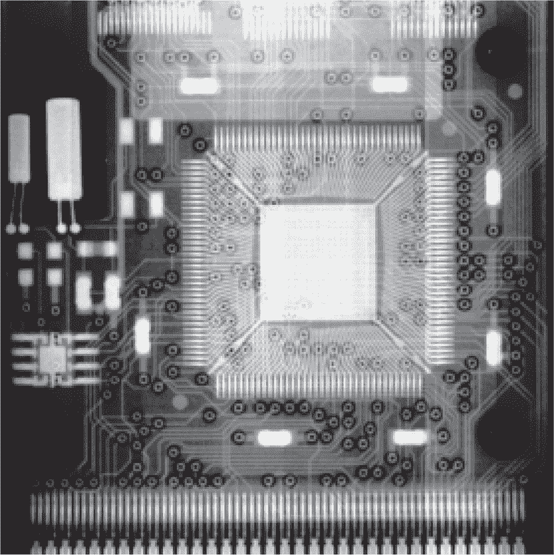
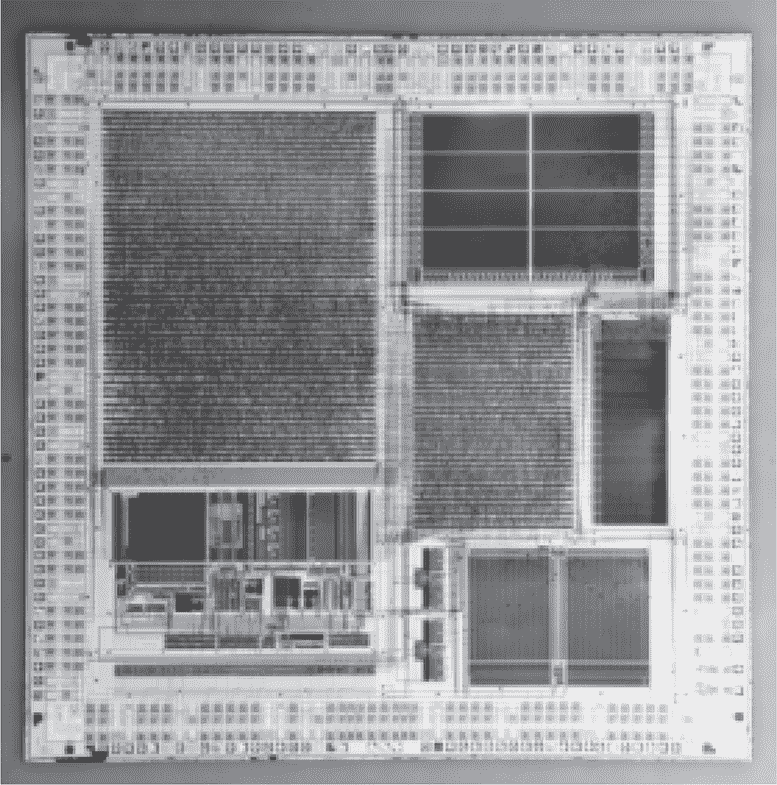
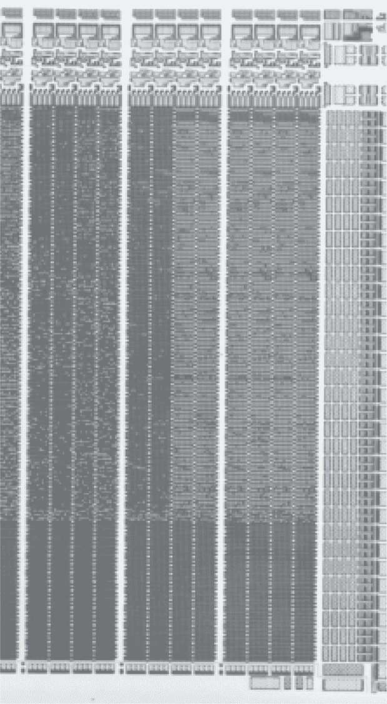

## 第二十四章：**24  克利珀芯片扩散 ROM**

在九十年代，克林顿政府对密钥托管加密有一种执念。他们希望为美国公民提供一种美国政府自己也能破解的加密方式，但这种方式排除了外国政府享有同样的特权。这种加密方式通常被称为“克利珀芯片”，在这一章中，我们将重点介绍该芯片的 PCMCIA 版本，称为 MYK82 或 Fortezza 卡。我们将提取其固件并将其转化为有用的数据。

它大致是这样工作的：假设莫妮卡打电话给比尔进行私人对话。当她按下*加密*按钮时，两部电话会执行密钥交换。密钥交换完成后，她的电话会向比尔的电话发送一个名为“执法访问字段”（LEAF）的数据包，其中包含（1）使用莫妮卡个人密钥加密的会话密钥，和（2）会话密钥的校验和。LEAF 本身使用一种“家庭密钥”进行加密，这个家庭密钥是每个克利珀设备都包含的，但不会提供给消费者。每个设备都有这个家庭密钥，但只有持有令状的特殊机构才能查找莫妮卡的个人密钥并解密会话密钥。

精明的读者会注意到这些密钥都是对称的，并且这种方案并不适用于拥有固件控制权的攻击者。如果你有家庭密钥，事情可能会有所不同。比尔可以给莫妮卡打电话，进行密钥交换，然后发送一个篡改过的 LEAF，里面包含（1）一个随机数，和（2）真实会话密钥的校验和。她的电话会验证校验和并允许通话继续，但任何监听的特殊机构都无法将随机数解密为会话密钥。莫妮卡的电话没有访问密钥托管数据库的权限，因此无法知道当局正被欺骗。

图 24.1：MYK82 芯片在 Fortezza PCMCIA 卡中的位置

图 24.2：MYK82 芯片

还值得注意的是，比尔并不严格需要知道家庭密钥。在没有篡改设备的情况下，比尔可能会反复拨打莫妮卡的电话，几万次后通过篡改 LEAF 数据包，直到 16 位校验和发生碰撞，令她的电话认为 LEAF 数据包没有被篡改。Blaze（1994）描述了这种攻击，并详细解释了托管加密标准。

MYK82 芯片嵌入在 Fortezza 卡中，执行此协议，并提供了便于在 Windows 和 Solaris 中使用该卡的库函数。图 24.1 展示了该芯片在 QFP 封装中的样子。这个封装有些特别，因为引脚框架位于*芯片上方*，而芯片则面朝下与 PCB 接触。这可能是为了减少射频辐射，因为芯片位于两个接地平面之间。

芯片的整体结构展示在图 24.2 中。CPU 位于西南部，其中包括一个 ARM6 的标志，告诉我们可以期待 32 位的 ARM 指令，而不是后来的 ARM7 中加入的精简 Thumb 指令集。该芯片上有三个 ROM，其中最大的一个位于东侧，存储代码。两个较小的 ROM 位于芯片南部，稍微偏东的地方，存储相同的 Skipjack F-Table；这两个 ROM 的大小正好是 256 字节，并与 Skipjack 文档中的内容完全一致，该文档已经解密。

MYK82 芯片，像它的前身 MYK78 一样，使用扩散 ROM。这些 ROM 形状扩散层位于晶体管下方，使得工作中的晶体管输出 1，而损坏的晶体管输出 0。

由于位是不可见的，需要像第二十二章中那样的去层处理来去除覆盖扩散层的上层。我通常对这个芯片的处理流程是，首先用 63%的硝酸烧掉封装，然后用 5%的氟化氢酸去层。这两种操作都在热板上进行，并且我在我的排风罩里做 HF 反应时，会将其放入密封的塑料试管中，以尽量减少有害气体。

在去层之前，位仅能在低倍放大下看到总的轮廓。这与光学和少量曝光有关，因为单个位几乎无法看到。去层后，位会显著地浮现出来，无论在高倍还是低倍放大下都能清晰可见。

图 24.3 展示了 ROM 的整体结构，由于印刷版中这仍然有些难以看清，图 24.5 展示了 ROM 最右侧六个位。 图 24.4 展示了位的特写。为了破解这些数据，我在一次飞往波哥大的航班上拍了这两张照片，那时我没有当地的朋友和责任。离开时，我已经将 ROM 解码成 32 位的字，并交到了几个朋友。^(1)

我们的第一个线索是芯片上其他地方的 ARM6 标志。ARM6 出现在 Thumb 之前，因此所有指令都是 32 位宽并且对齐到 32 位。我们可以看到 ROM 的底部相当稀疏，每个位都填充了相同的颜色。这些正好是 0，它们正确地暗示了代码是从 ROM 顶部的行构建起来的。

ARM 逆向工程师会告诉你，32 位代码很有特色，因为大多数指令的最显著四位（nybble）是`E`。如果你查看图 24.5 中的右侧六个位，你会看到每一列的两位。 （你也许可以从图 24.3 推断出这一点，那里 16 列代表 32 位。）最右侧的主列大多是 1，而其左侧的主列在右半部分是 1，左半部分是 0。这就是我们的`E` nybble，从右到左依次是 1, 1, 1, 0！

图 24.3：MYK82 代码 ROM

图 24.4：MYK82 ROM 位

图 24.5：MYK82 代码 ROM 的右侧六位

确实，我们可以通过从每一列的 32 个小列中取一位来找到 32 位字——即从每个大列中取两个字节——最有效位在最右侧，最不有效位在最左侧。我们已经知道程序从第一行开始，因为最后有空的、清零的行。剩下的就是理解给定行中单词的顺序。

每一行都有 512 位，因此我们知道每行包含 16 个字。为了了解顺序，我简单地编写了一个解码器，它按顺序输出这些位，并将其传送到反汇编器中。正确的顺序是从右到左，就像位最好是从右到左读取一样。

到此为止，我们已经清楚如何将 ROM 解码为 32 位字，但要将其转化为字节，我们希望了解字节序。最高有效字节是先还是后？这就是事情变得复杂的地方。

字节序（Endianness）并不是指字中的字节顺序，而是指字是如何看作字节，或者字节如何看作字。内部 ROM 仅由 32 位字组成，这些字从不以更小的尺寸提取，因此它没有字节序。ARM6 CPU 没有指令从 ROM 中提取字节，但外部 EEPROM 存储器有一个布线决定。这个 EEPROM 存储了以大端字节序存储的代码，只有通过这个，我们才能说整个机器是大端的。
