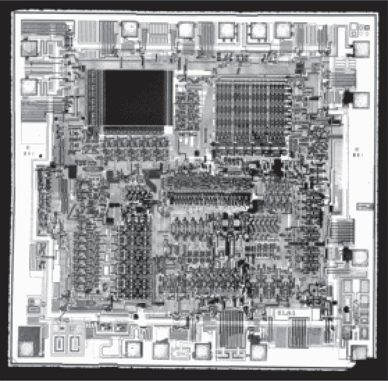
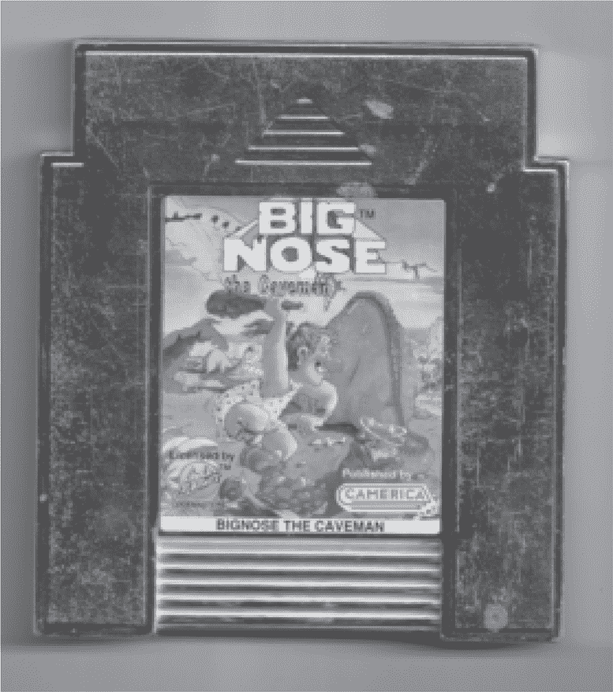
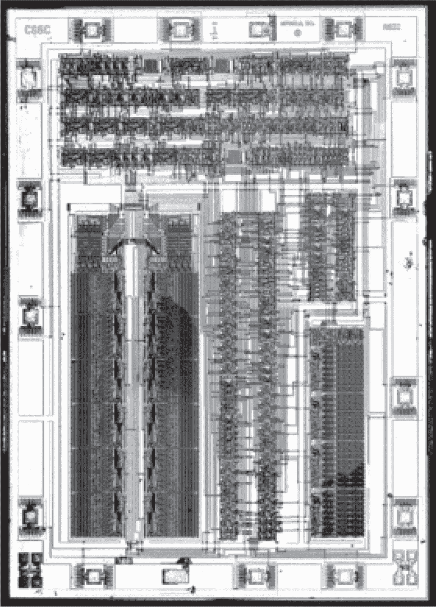
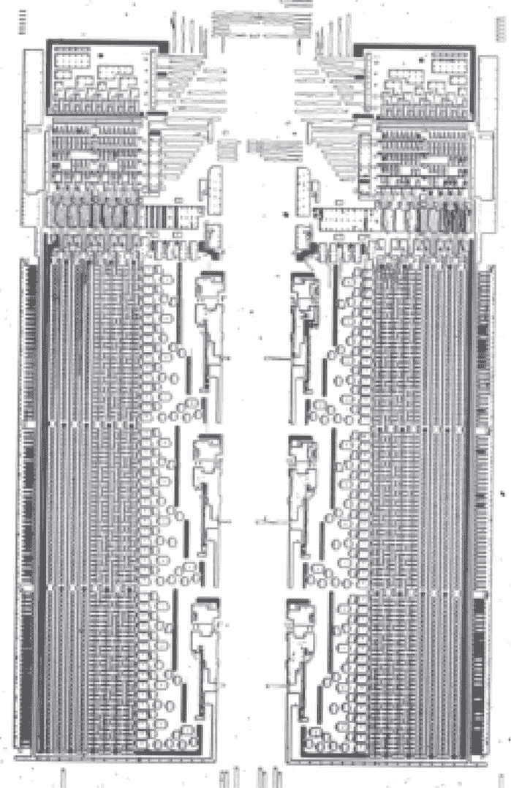
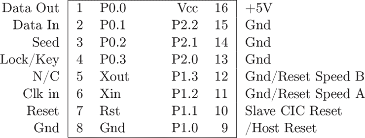
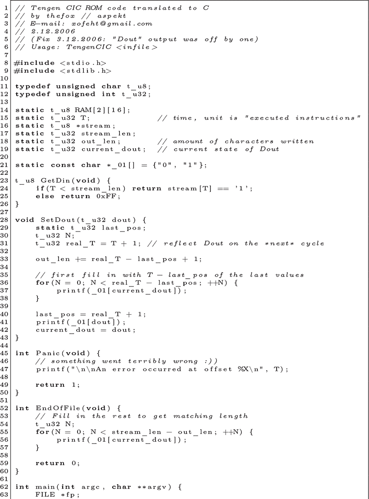
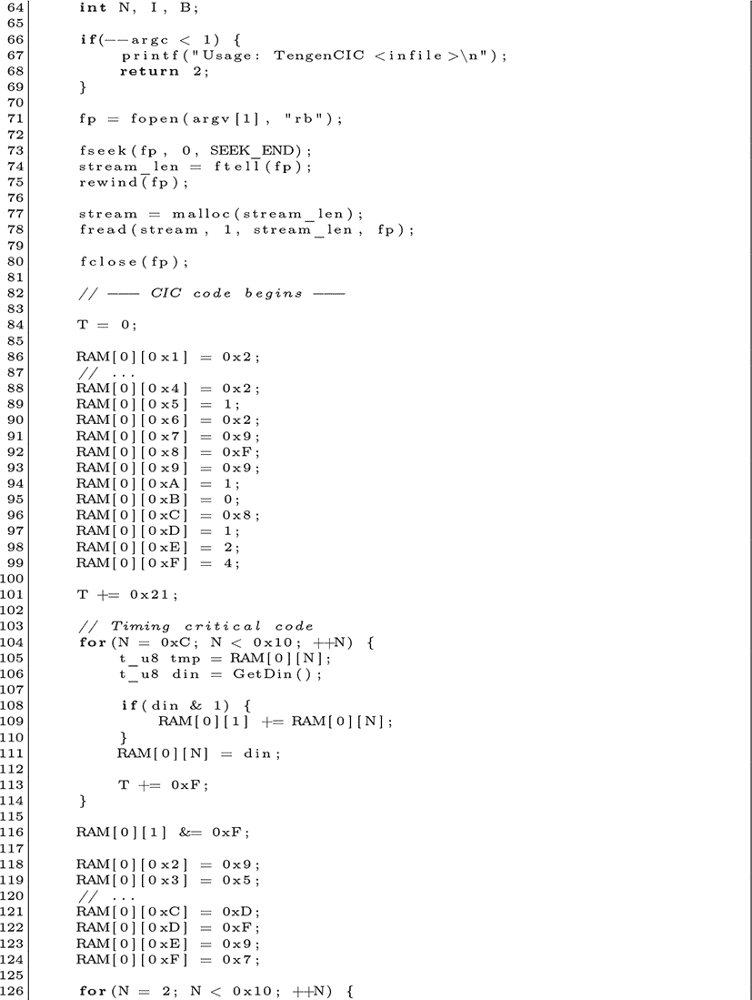
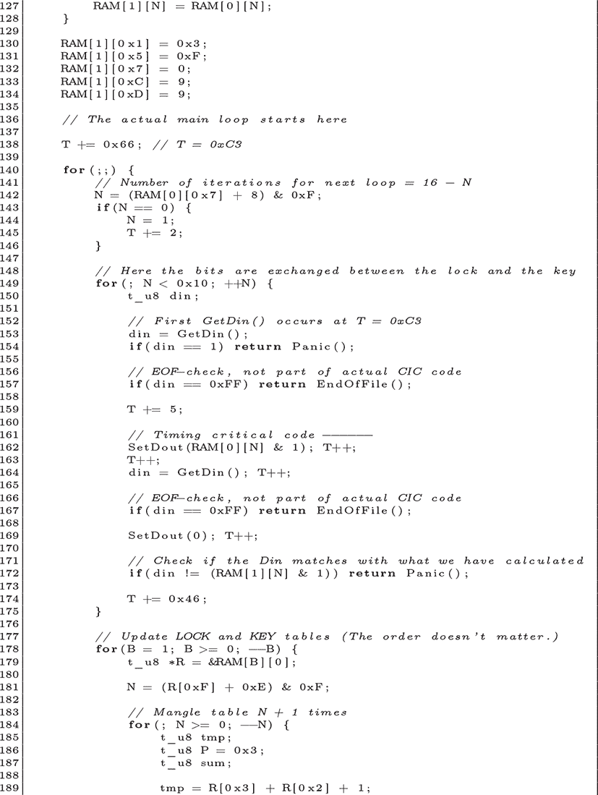
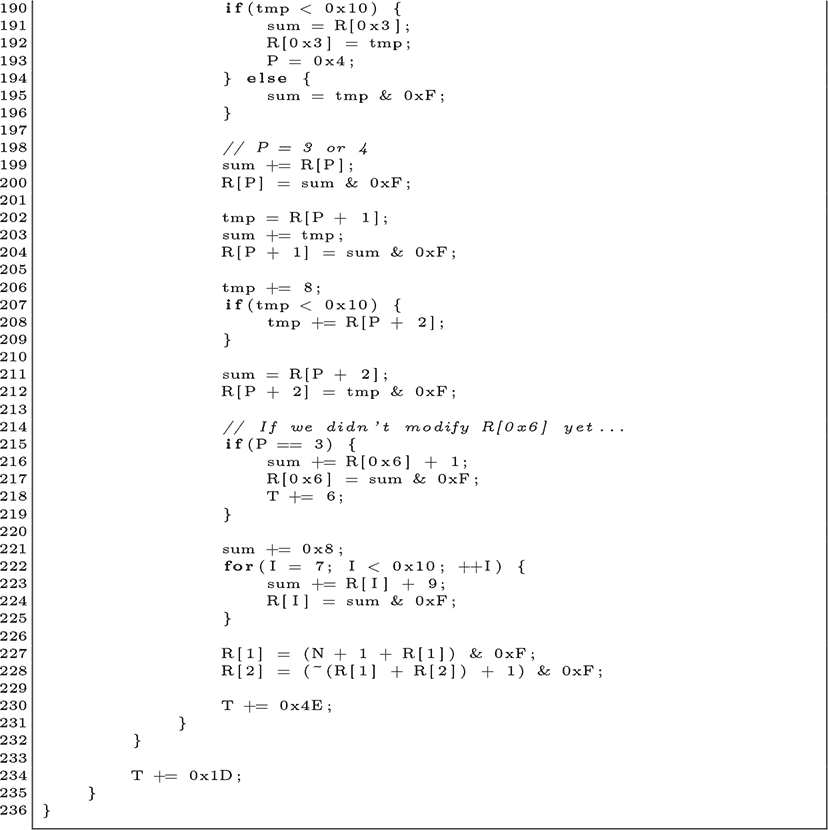

## 第二十五章：**25 任天堂 CIC 及其克隆版**

回到七十年代末，曾有一家公司制造家庭电视视频游戏机，名为 Atari。Atari 的游戏机拥有一些由 Atari 制作的优秀游戏，同时也有一些来自众多临时公司的糟糕游戏。到 1983 年，后者已经充斥市场，导致市场崩溃，Atari 将超过 50 万的游戏卡带丢弃在新墨西哥州的一个垃圾填埋场。Atari 不仅因为这些糟糕的游戏声誉受损，而且由于这些游戏只是电路板上的 ROM 芯片，Atari 通常不会因此类低劣的第三方游戏收取任何授权费用。

在任天堂准备于 1985 年在北美市场推出任天堂娱乐系统（NES）时，他们需要一种方法来避免重蹈覆辙。他们的解决方案是检查集成电路（CIC），这是一种每个 NES 卡带都必须包含的锁定芯片，任天堂通过限制 CIC 的供应来控制卡带的生产许可。通过为 NTSC 和 PAL 市场分别设计不同版本，他们还可以实现区域锁定，防止英国的贫困儿童发现，在外面的世界里，《忍者神龟》里的青少年变种英雄竟然是忍者，而其中名叫米开朗基罗的角色还使用非法的双截棍。

这个方案的工作原理是在 NES 主机中安装一个 CIC 芯片，在游戏卡带中再安装另一个 CIC 芯片。从重置开始，每个芯片会生成一串伪随机比特，任何比特不匹配都会导致主机重启并重新尝试。

鉴于任天堂严格控制游戏内容，任何能够制造不含 CIC 芯片的游戏的生产商都会获得可观的利润。在这一章中，我们首先讨论了为干扰主机的 CIC 芯片而设计的模拟电路，这些电路能使 CIC 芯片在预期的序列未能到达时，不进行重置，从而使其“失效”。接着，我们会讨论 Tengen 公司如何逆向工程 CIC 芯片、制作其克隆版，以及 21 世纪出现的开源克隆。

图 25.1：任天堂 NES 的 CIC 芯片

另一种较为简单的绕过方法是直接重新使用合法但便宜的游戏卡带中的 CIC 芯片。你也可以制造一个“中间人”卡带，它可以接受任何合法授权的卡带，从而暂时借用其 CIC 芯片。

### **干扰主机的 CIC 芯片**

在 CIC 芯片的兼容假冒品出现之前，曾有一种引人注目的替代方案：卡带可以发送一串疯狂的脉冲，通过卡带边缘连接器来震晕主机的 CIC 芯片，目的是防止该芯片的固件重置主机并结束游戏。

这个方法之所以有效，是因为主机的芯片完全独立于 CPU 运行，游戏继续运行，直到 CIC 芯片重置主机。如果 CIC 芯片崩溃，它的固件就不会运行，主机也永远不会重置！

对于这种故障技术，最好的，也是唯一的文献资料可能就是 Horton（2004）。Horton 描述了由 Camerica、Color-dreams 和 AVE 制造的七种不同类型的故障电路。这些电路中的每一种都会在 35 号或 70 号引脚上产生负电压故障，这些引脚直接连接到 CIC 芯片。这样，CIC 芯片会崩溃，从而使其 ROM 代码无法重置 CPU。图 25.2 展示了其中一种卡带，后面有一个故障配置开关，并且没有任天堂的质量认证标志。

图 25.2：没有 CIC 的未经授权卡带

任天堂最终通过在 35 号和 70 号引脚上加入电阻器和保护二极管，结束了卡带故障时代，从而防止了卡带崩溃主机的 CIC 芯片。

### **天真的兔子：CIC 克隆**

随着故障漏洞的关闭，未经授权的游戏制造商不得不提供切割主机锁定芯片引脚的说明，或者想出能够生成类似真实 CIC 芯片的伪随机序列的解决方案。天真，作为 Atari 的子公司，成功地做到了后者。

这里的故事大多属于民间传说，所以如果有时候我不让真相妨碍好故事，请耐心听我讲。根据我的理解，有一个三到四人的工程师团队，他们通过拍摄 Nintendo CIC 芯片的掩膜 ROM 并深入研究夏普（Sharp）关于该芯片家族的文档，进行反向工程。这支团队经常加班加点，最终制造出了一个功能齐全的 CIC 芯片克隆版，天真公司将其打包为“兔子”芯片，见图 25.3，后来又将其与一个映射器芯片合并，形成了被称为 Rambo 的芯片。^(1)

当然，任天堂对于天真公司（Tengen）破解他们的补贴锁定、未经授权生产游戏，甚至未经授权生产他们授权的游戏感到非常愤怒。他们在著名的案件*Atari Games Corp.诉 Nintendo of America Inc*中起诉了天真公司并索赔。

图 25.3：天真的兔子

图 25.4：天真的兔子扩散 ROM

Atari 有一个相当不错的辩护理由：他们仅复制了与兼容性相关的部分，且没有复制任何创意部分，且反向工程是通过洁净室方法进行的。不幸的是，Atari 的律师们太急于赚取费用了。他们在任天堂起诉他们之前，向版权局谎称他们已经被起诉，并请求了任天堂的 CIC 固件副本。哎呀！

任天堂因 Atari 的不洁手段获胜，本可能成为兼容性反向工程的商业成功案例，结果却被历史的废料箱遗弃。嗯，至少有十多年是这样。

### **现代兔子克隆**

细节散布在论坛帖子中，但到 2006 年，Rabbit 芯片的 ROM 转储已出现在 Neviksti（2006）的`#nesdev`论坛上。Fox（2006）随后发布到论坛，作为 ROM 反汇编到 C 语言的翻译。你可以在第 245 页找到它的复印件。

阅读这个论坛帖子的过程非常吸引人，不仅仅是因为它来自一个社交媒体参与度指标还未破坏长篇讨论的时代。到第三页时，Zack S 已经将两个 CIC 连接在一起，在没有主机或游戏的情况下重现了检查和重置电路。

到第七页，Neviksti 的 ROM 照片开始被解码成比特，伴随着从晶圆照片逆向工程出的 ROM 电路的解释。

这是本书中的一个独特案例，因为固件保护的商业性利用*本身*被利用提供了一个漏洞，这个漏洞与对原始芯片的全新破解一样有效！CIC 被克隆到 Rabbit 中，然后 Rabbit 在论坛上被克隆，早于 CIC 本身被公开转储。

图 25.5：任天堂 CIC（SM590）引脚图

### **克隆任天堂的 CIC**

到 2006 年底，Tengen 的 Rabbit 芯片已经通过晶圆照片进行逆向工程并克隆，但任天堂的原始 CIC 芯片除了 Tengen 之外没有被克隆。这个空白由 Segher（2010）填补，他撰写了一篇优秀的文章，提供了 Neviksti 的图像和 ROM 转储，并描述了芯片使用的 Sharp SM590 架构。

说到 SM590，它是一个 4 位的 CPU，而这并不是它最疯狂的地方。10 位程序计数器被分为 1 位字段、2 位页面和 7 位步进。步进是按多项式顺序计数的，而不是线性顺序，因为 LFSR 比线性计数器使用的晶体管更少！像 PIC 一样，硬件调用栈与 RAM 分开存储。

### **Sharp SM590 后门**

在完成了这么多工作来转储 CIC 的 ROM 后，是否有更简单的方法呢？Riddle（2019）记录了一种后门测试模式，在这种模式下，SM590 的 ROM 可以通过 I/O 引脚进行转储。

根据图 25.5 中的引脚图，通过按顺序降低引脚 7、14 和 13 来激活后门。ROM 数据将以 508 字节为一组，每 2,032 个时钟周期在引脚 12–19 和 4–1 上重复一次。

启动位置有些不可预测，但 Riddle 建议可以通过在引脚 7 降低后计算时钟周期，或通过在转储的末尾同步一长串零来进行同步。

Riddle 指出，SM591 和 SM595 可能需要更改字段才能获取所有数据，因为并不是所有内存都被覆盖。我们将在第 G.4 章看到这些是如何被转储的。

