## **A 更多启动加载程序漏洞**

### **A.1 PN553 签名绕过**

Wade (2021a) 和 Wade (2021b) 记录了 PN553、PN547、PN548、PN551 和 PN5180 系列 NFC 芯片在启动加载程序中的内存损坏漏洞，这些芯片出现在 Pixel 3 和 Xiaomi MI Note 3 等消费类智能手机中。这些芯片实现了 NFC 通信，操作系统可以调用高级抽象。对芯片的原始控制将有助于执行原始的 NFC 交易，这就是此漏洞利用的价值所在。

在手机中，Wade 发现 Linux 将设备呈现为 `/dev/nq-nci`。这个字符设备允许标准 NCI 命令和系列特有的自定义命令。启动加载程序命令如下，他从 ELF 库中提取了这些命令。

| `c0` | 写入内存 |
| --- | --- |
| `a2` | 读取内存 |
| `a7` | 写入 64 字节到配置 |
| `e0` | 校验和和配置 |

`c0` 命令执行固件写入，但具有一种奇怪的签名结构。这些命令中的第一个包含一个版本号、一个 SHA256 哈希值和该哈希值的签名。哈希值本身是 *下一个* 区块的哈希，而下一个区块将包含下一个区块的哈希。通过这种方式，更新可以从头到尾线性进行，逐个验证和写入区块，而无需将整个镜像保存在内存中。

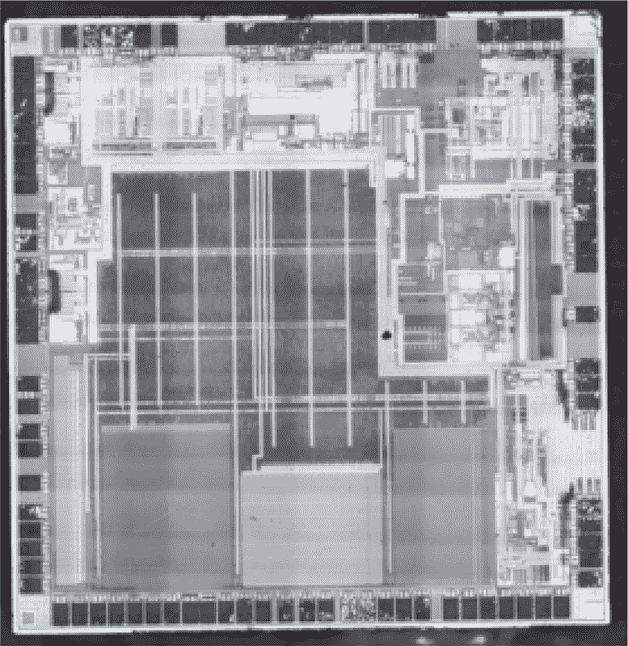

图 A.1: NXP PN553 NFC 控制器

最后的区块稍有不同，没有哈希值，因为没有后续的区块来继续链条。Wade 注意到最后一个区块可以多次发送而不会报错，他推测这个命令并不会替换掉即将到来的哈希值。如果有可能用任意哈希值覆盖预期的值，那么下一个区块可能会用任何东西，而不管签名和哈希链如何。

现在，写入大多数区块的 `c0` 命令比写入最后一个区块的 `c0` 命令稍长。Wade 发现发送一个非法长的 `e0` 命令会在返回错误之前替换掉预期的哈希值。这个哈希值的损坏会打破链条，允许后续的区块像已经签名一样被写入。

拥有修补固件的权限后，他实现了一个没有范围限制的读取命令，并愉快地将所有内存转储以进行逆向工程。他还提到，SN100 芯片虽然与其他系列相似，但对其固件更新进行了加密，这使得利用该漏洞变得更加困难。

### **A.2 Tegra X1，Fusée Gelée**

任天堂 Switch 使用 Nvidia 的 Tegra X1 处理器，该处理器严格限制设备仅能启动任天堂授权的内容。Temkin (2018) 提出了针对 X1 芯片 USB 堆栈的漏洞利用。该漏洞被报告给 Nvidia 并标记为 CVE-2018-6242，更广为人知的是 Fusée Gelée。

漏洞存在于设备进入 USB 恢复模式（RCM）时的引导 ROM 中，当某些引脚接地且外部引导存储器不可用时，设备会进入该模式。在 Switch 上，这是通过从插座中取出 eMMC 板，按住音量下按钮并将右侧摇杆连接器的第 10 引脚接地来执行的。然后，Switch 会作为一个 USB 设备出现，等待一个签名的可执行代码有效负载。

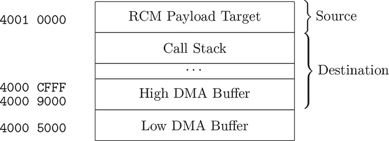

图 A.2：Fusée Gelée `memcpy`

Temkin 描述了这个 bug，指出当从设备读取时没有检查长度。USB 控制请求包括一个 16 位长度字段，用于指示设备在回复中可能传输给主机的最大数据量。例如，主机可能会请求设备的状态，而设备可能只回复几个字节，而不是主机允许的最大字节数。她发现了三个例外情况，在这些情况下，X1 的 USB 堆栈会传送主机允许的最大数据量：

+   `GET_CONFIGURATION` 请求与 `DEVICE` 接收者。

+   `GET_INTERFACE` 请求与 `INTERFACE` 接收者。

+   `GET_STATUS` 请求与 `ENDPOINT` 接收者。

读取超出缓冲区末尾的数据对于内存转储很有用，但缓冲区使得这个问题更加严重。当主机请求 65,535 字节的状态时，超出的字节会从状态变量的地址复制到其中一个 DMA 缓冲区以进行 USB 传输。由于 DMA 缓冲区较小并且位于调用栈下方，这种复制过程中的溢出可能会覆盖*整个*调用栈！

方便的是，状态变量之后的内存也由主机控制。大部分内存用作缓冲区，用来存储最多 `0x30000` 字节的 RCM 命令。命令有一个我们无法伪造的签名，但它会在签名检查之前被存储在内存中。

图 A.2 显示了内存布局，Temkin 的漏洞将待处理的 RCM 命令复制到调用栈上。这里没有堆栈保护或地址空间布局随机化（ASLR）来增加复杂性，并且调用栈本身是可执行的。Trust-Zone 在这里也不是问题，因为 RCM ROM 以最高特权级别作为安全监控程序运行。

### **A.3 LPC55S69，K82 USB 过度读取**

除了我们将在 C.4 章 中看到的 NXP 的 LPC55S-69 中的 TrustZone-M 漏洞外，NXP 的 LPC55S69 和 Kinetis K82 芯片中还存在一个 USB 过度读取的 bug。可以在比实际缓冲区小得多的空间中读取到数千字节的内存。这个 bug 已在 LPC55S69 的 A3 版本中修复，但怀疑相同的 USB 堆栈及其漏洞被应用在多种微控制器中。

Alaudeen (2021) 为 LPC55S69 提供的漏洞利用在 图 A.3 中展示，它在设备重置之前从芯片中转储 16KB 数据。 图 A.4 中的 K82 漏洞利用涉及更复杂的事务，但成功地从芯片中转储了 64KB 数据。

由于 libusb 中`MAX_CTRL_BUFFER_LENGTH`的值，这两个漏洞每个都被限制在 4kB。显然，在许多 Linux 平台上，只需简单地将该`#define`修改为 65,536，就可以解决这个问题。

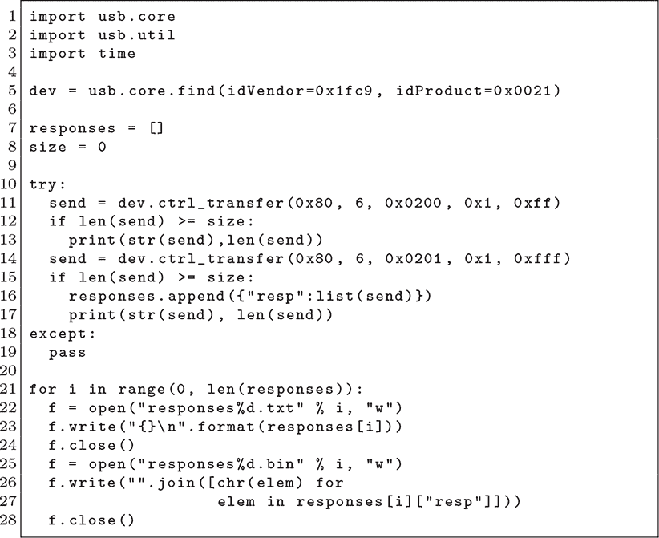

图 A.3：Alaudeen 针对 LPC55S69 的 USB 漏洞

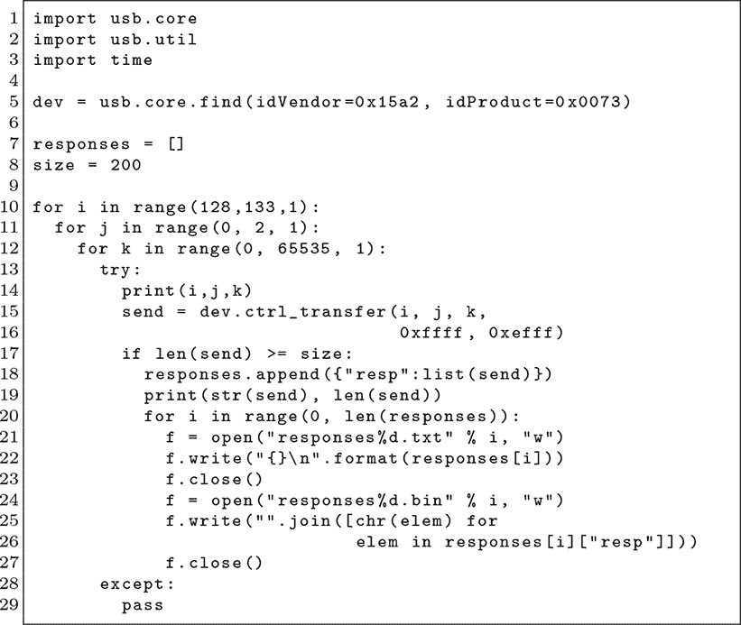

图 A.4：Alaudeen 针对 K82 的 USB 漏洞

Alaudeen 提供了来自这两款芯片的示例转储，但我似乎找不到有关转储中发现内容的详细信息。由于这款芯片有数百 KB 的 SRAM，我预计你可能会在转储中找到一些来自先前引导的字节，但不应指望此技术揭示闪存内容的太多信息。

### **A.4 CH552 验证命令**

CH552 是南京青恒微电子生产的价格便宜、功能实用的 8051 微控制器，具有 USB 外设。Christophel 和 Thomas（2018）最初在一个德国论坛线程中讨论这款有用的芯片，但讨论很快转向了反向工程引导加载程序，以便在没有文档的情况下编写新客户端。

引导加载程序已预先写入这些芯片的闪存中，但它不在遮蔽 ROM 中，因此软件补丁是可能的。有 11 条命令支持读取、写入、擦除和验证闪存。与 8051 的哈佛架构一致，访问分开的代码和数据存储器有不同的命令。

这里的可利用漏洞存在于命令`0xA6`中，它验证代码闪存区域。你需要提供起始地址和一些 XOR 编码的字节,^(1)，如果匹配，它会返回零，否则返回非零值。Thomas 将这个脆弱的函数重新编写成了图 A.6 中的 C 代码。

该代码的目的是通过要求字节数为八的倍数，防止攻击者利用验证功能暴力破解内存的内容。虽然一次猜测八个字节确实需要很长时间，但引导加载程序的作者忘记强制对地址进行对齐！

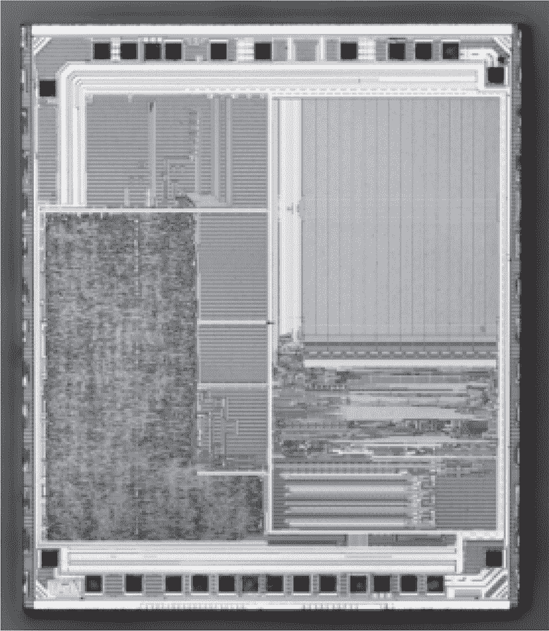

图 A.5：W.CH CH552

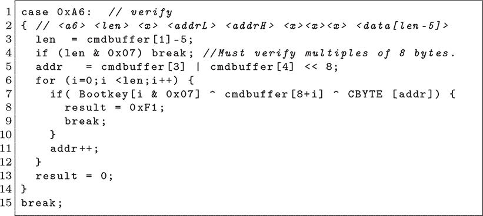

图 A.6：反编译 CH552 验证

要利用这个漏洞，攻击者可以将地址设置为七个已知字节，后面跟着一个未知的第八个字节，然后暴力破解第八个字节。一旦找到了这个字节，窗口就可以每次滑动一个字节来破解下一个字节。

利用此漏洞的直接方法是从已知的引导加载程序开始，然后每次向前滑动一个字节进入应用程序。Cheron（2019）中使用的一种更通用的技术是假设固件以八个`0xff`字节结束，然后从应用程序镜像的起始位置向后推算。

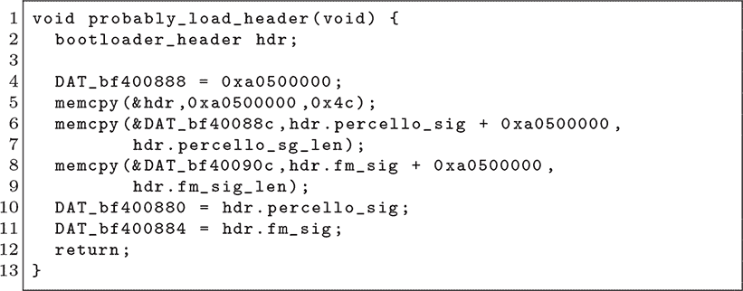

图 A.7：BCM61650 中的堆栈缓冲区溢出

### **A.5 BCM61650/PRC6000 头文件**

Broadcom 的 BCM61650，之前在其收购 Percello 之前被称为 PRC6000，是一款用于 3G 微蜂窝的 MIPS CPU，作为流行法国品牌 DSL 和光纤调制解调器的插件使用。

Xilokar（2022）描述了针对芯片 TFTP 启动映像头部格式的利用。他首先修补模块硬件以暴露以太网引脚，然后通过 TFTP 网络启动映像中的暴露密码获取 root shell。获得这个立足点后，他编写了图 A.8 中的快速内核模块，将 ROM 转储到内核日志中。

拥有 ROM 转储后，他在引导加载程序的头部解析例程中发现了一个解析错误，如图 A.7 所示。这里的错误是 `fm_sig_len` 是直接从攻击者控制的引导加载程序头部读取的，而其目标缓冲区 `0xbf40-090c` 离初始堆栈位置 `0xbf403ff0` 不远。一个非常长的头部将覆盖堆栈变量和返回指针。

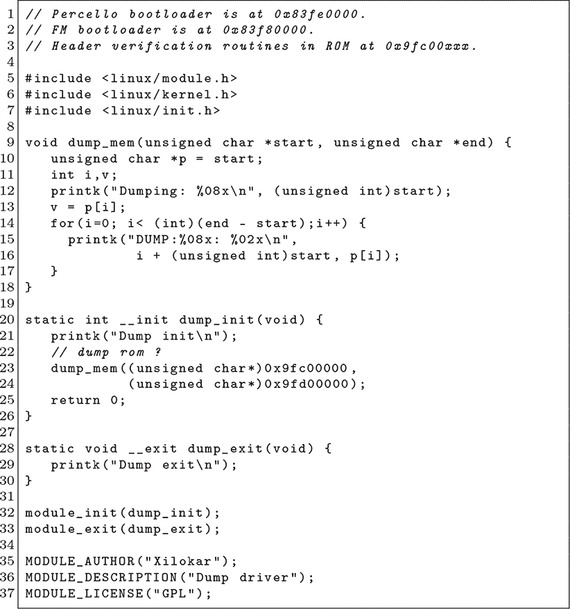

图 A.8：BCM61650 的 Linux ROM 转储工具

通过制作一个极长的签名长度，可以利用 Percello 引导加载程序跳过签名验证。然后，可以自由修补 FM 加载程序以允许任意的内核和初始 ramdisk。

### **A.6 PSoC4 闪存加倍器**

Cypress 的 PSoC4 系列 ARM Cortex M0 微控制器具有一个受保护的 ROM，称为 SROM，实施了许多启动功能。它又使用一个隐藏且受保护的闪存，称为 SFLASH，用来存储设置，如芯片的保护级别和闪存容量。

在 Grinberg（2017a）中，Dmitry Grinberg 发布了通过用户闪存触发的 ROP 链转储 SROM 的详细信息，修补 SFLASH 通过重新实现 SROM 的闪存库，并通过修补 SFLASH 的两个字节将 CY8C4013SXI-400 的容量从 8kB 扩展到 16kB。

作为后续，Grinberg（2017b）尝试彻底记录额外寄存器及其含义，以帮助将这些攻击移植到其他芯片。

### **A.7 i.MX53 引导加载程序溢出**

在第一代 USB Armory 设备中使用的 i.MX53 芯片具有堆栈缓冲区溢出漏洞，如 Delugré 和 Szkudlapski（2017）所述，允许绕过代码签名和安全启动限制。更多细节见 Barisani（2017）。

第一个漏洞，CVE-2017-7932，是 X.509 解析器中的堆栈缓冲区溢出。证书在验证之前就被解析，因此漏洞可以在没有正确签名的情况下触发，概念验证可以在 USB Armory Git 仓库中的 `usbarmory_csftool` 的 `hab_poc` 函数中找到。

第二个漏洞，CVE-2017-7936，通过滥用不正确的内存检查，在 ROM 中的串行下载协议（SDP）实现中允许远程代码执行。

### **A.8 M16C 引导加载程序定时攻击**

瑞萨 M16C 芯片具有一个 ROM 引导加载程序，容易受到简单的时序攻击，至少在引导加载程序的第四个版本之前是如此。在 Bazanski 和 Kowalczyk（2018）中，利用这一点作为一种方式，来提取作为嵌入式控制器的三菱 M306K9FCLRP 芯片，该芯片用于东芝 Portégé R100 笔记本电脑。

固件提取漏洞本身是一个简单的时序攻击，针对密码检查。通过枚举每个可能的第一个字节，其中一个会比其他 255 个字节快 3 微秒。对每个字节重复此操作，平均需要 900 次猜测即可得到预期的密码，之后七个字节就能全部知道。有了这七个字节，你就可以自由地读写闪存。

Bazanski（2017）提供了这个漏洞的利用程序。它作为一个 Python 主机应用程序运行，匹配一个使用开源 Icestorm 工具链编程的 ICEStick FPGA 开发板。

### **A.9 IC204 通过魔术数字绕过**

Lim（2021）描述了一款梅赛德斯-奔驰 ECU 的内部工作，其型号为 IC204。Lim 的具体示例来自 2011 年的 C300，但 2007 年至 2013 年间的许多车辆应该都容易受到同样的漏洞影响。

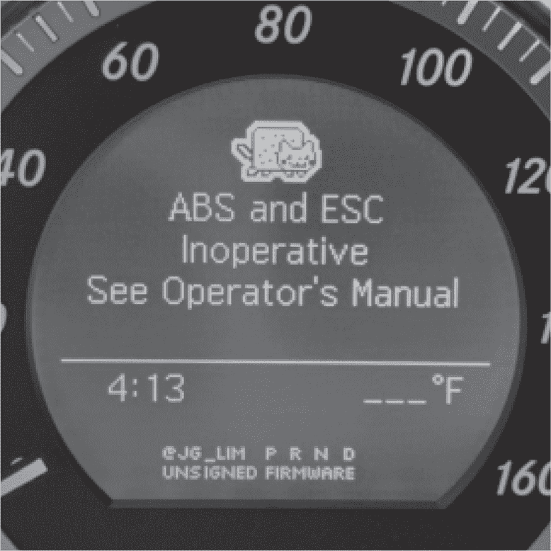

图 A.9：2011 年梅赛德斯仪表盘上的 Nyan Cat

这里的技巧是，瑞萨 uPD70F3426 被编程为带有 ROM 引导加载程序链，验证每个部分的签名，随着引导过程的进行。Lim 逆向工程该 ROM，发现签名检查每次固件更新时只进行一次，每个块的成功验证会被缓存为一个 32 位的魔术数字。

在这种情况下，神奇的数字是`0x5a5a5a5a`。通过将该数字写入`0x0f1f80`、`0x16ef80`、`0x1b3f80`、`0x1f4f80`、`0x1f5f80`、`0x0fff80`和`0x1fff80`，这些位置都被 ROM 允许，签名检查可以被绕过，任意代码可以自由执行。

在获取 ECU 固件控制权后，他将 Nyan Cat 添加到 ABS 和 SYS 故障消息中，如图 A.9 所示。

### **A.10 Zynq 7000 引导加载程序转储**

很多时候，芯片首先通过笨拙且劳动密集的方式被利用，接着从第一次利用的转储中进行逆向工程，找到一种更简单的方法。Xilinx Zynq 引导加载程序就是这样，在第 E.16 章中通过故障攻击被转储后，才发现了这一点。

Schretlen（2021a）描述了这样一个 UART 引导加载程序，你可以通过拉高两个引导模式引脚来启用它。只需要图 A.10 中的 Python 代码，就能上传并执行一个有效的镜像。在自己实现这个时，要小心像代码中那样延时；这样做是为了避免 ROM 中的可靠性问题。

到此阶段，我们已经明确可以上传镜像，但什么镜像值得上传以提取 ROM 呢？一个好的首选目标是复制 ROM 到 RAM 中，以便稍后提取。Schretlen（2021c）提出了一种利用 Zynq 7000 应用程序头的漏洞，利用引导加载程序从不验证镜像源地址这一事实。

如 图 A.10 所示，漏洞载荷仅是一个镜像头，它将 ROM 从原地址复制到 `0x00000000` 的 RAM 中。在执行漏洞攻击后，攻击者通过附加 JTAG 调试器并将该内存范围的内容转储到磁盘来恢复镜像。JTAG 调试器无法读取原始数据，但可以自由读取 ROM 拒绝启动的复制数据。

### **A.11 Zynq 7000 NAND/ONFI**

Schretlen（2022a）描述了一种针对 Zynq ROM 的 NAND/ONFI 接口以及 `embeddedsw` 硬件抽象库（HAL）漏洞，适用于 `xilinx_v2021.1` 之前的版本。

ONFI 规范（开放 NAND 闪存接口）是 NAND 芯片的标准，定义了它们的封装、引脚配置及其他各种模式，使得来自不同厂商的芯片可以互换、兼容。

除了标准化引脚配置（图 A.12）和信号之外，ONFI 还提供了标准化的“参数页面”及匹配的数据结构。参数页面是 NAND 芯片的一页，可以通过设备代码读取，以便 NAND 芯片报告其一些特性。参数页面结构以 `4f`、`4e`、`46`、`49`（“`ONFI`”）开始，并包括协议版本号、十三个可选功能和命令、JEDEC 制造商信息和内存组织等字段。^(2)

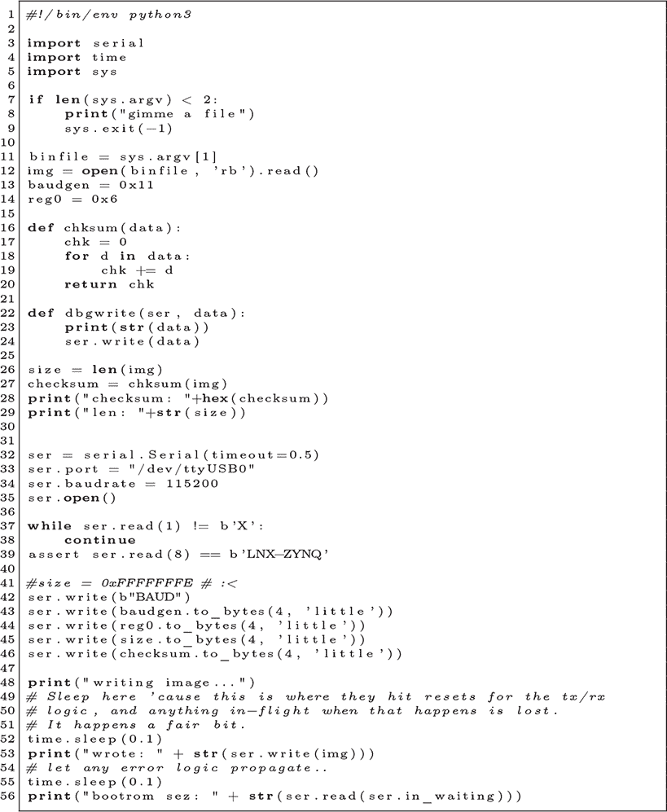

图 A.10：来自 Schretlen（2021a）的 Zynq 启动加载程序客户端

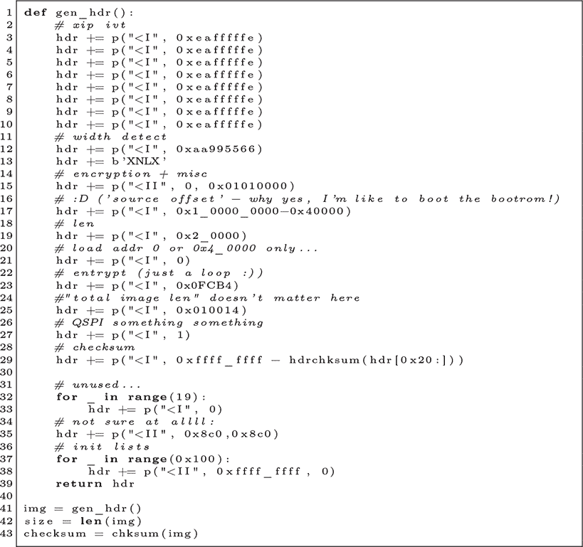

图 A.11：来自 Schretlen（2021c）的 Zynq 7000 漏洞头

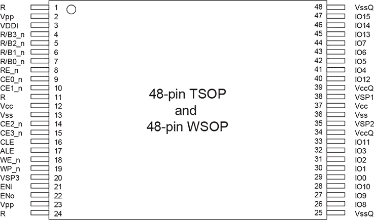

图 A.12：标准化的 NAND/ONFI 引脚配置

ONFI 参数页面的第 80 到 99 字节描述了内存的组织方式，包括每页的数据字节数、每页的备用字节数、每个块的页面数以及每个 LUN（逻辑单元号）的块数。这些值的验证较差，且每页备用字节过多会导致获取坏块表时发生溢出，坏块表会被加载到一个 `0x200` 字节的本地栈变量中。溢出此缓冲区会使得多个有用的栈变量的控制权被获取。

由于目前已知的任何商用 NAND 闪存芯片的参数页面均不可写，因此触发此漏洞需要使用 FPGA 模拟 NAND 芯片。Galan Schretlen 在编写此攻击时的优势在于他之前已经通过 章节 E.16 和 A.10 的技术转储了 ROM；若盲目编写漏洞攻击则会更加具有挑战性！

以下是他在 ARM 汇编中的 shellcode，将解锁赛灵思 Zynq 上的 JTAG，并将几个有用的寄存器值转储到 UART。

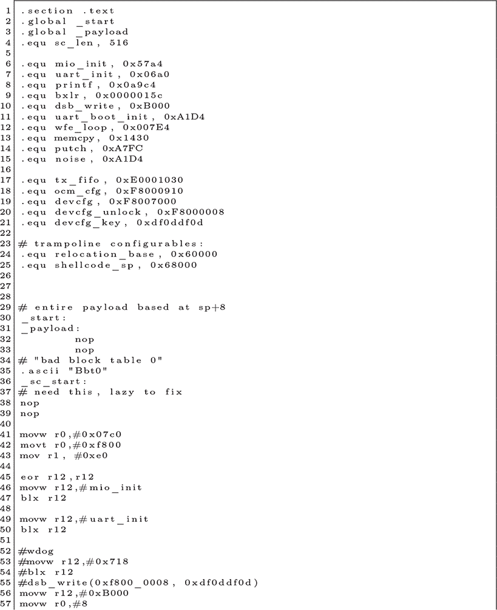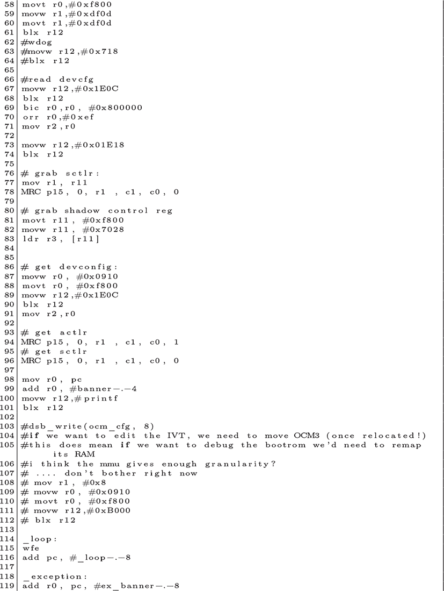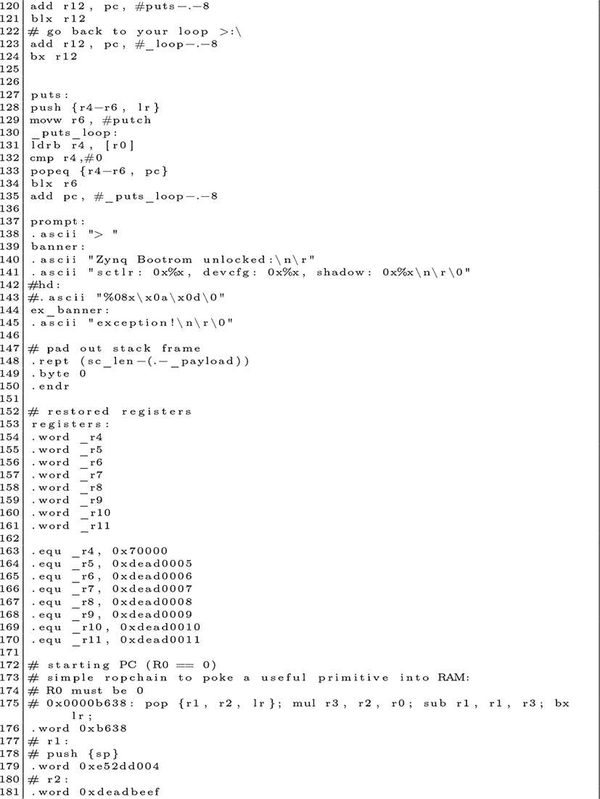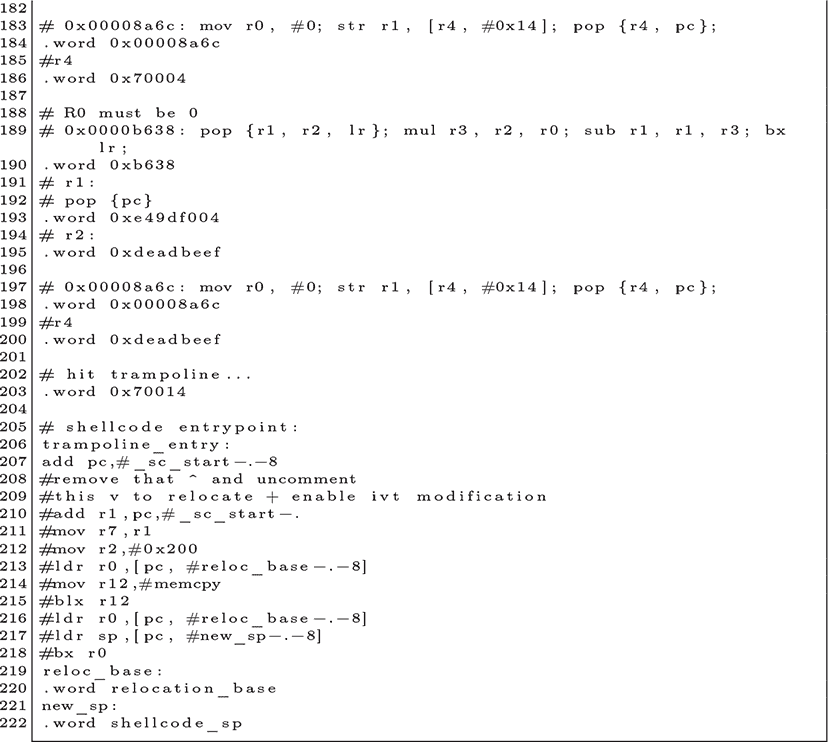

### **A.12 Zynq 7000 BOOT.BIN 解析**

当有物理访问权限，NAND 引脚已断开，并且有一个 FPGA 模拟器的 NAND 芯片易于获得时，赛灵思 Zynq 7000 的漏洞利用在第 A.11 章非常好用，但这些限制可能令人厌烦，并且许多高端板卡不使用 NAND 芯片，因此它们不会断开必要的引脚。在本章中，我们将讨论 Schretlen（2022b），这是 `BOOT.BIN` 文件解析器中的内存破坏漏洞，该文件可能在 SD 卡上找到。

此漏洞利用不需要复杂的模拟器硬件，并且在签名检查之前触发，因此不需要单独破解加密。非常适合越狱设备。

Schretlen 首先使用 Unicorn 的 Python 绑定来模拟先前提取的 ROM。一旦功能正常，模拟器就可以用来探索 `BOOT.BIN` 的注册初始化列表（RILs）中允许的地址范围。

当解析 `BOOT.BIN` 时，ROM 根据 RILs 将部分加载到 RAM 中。只有在图像完全加载后才会检查签名。这样做可以防范时机检查到使用（TOCTOU）攻击，但这也意味着在签名检查完成之前可能会利用解析器漏洞。

Schretlen 发现，虽然 SDIO DMA 控制器的基本寄存器不可写，但由于机器正在从 SD 卡引导，它已经被引导 ROM 设置。在许多嵌入式漏洞利用中，你会看到相同的技巧，即不会费心配置被利用软件已经配置的 I/O 端口或寄存器。

以下是一个 Python 脚本，用于生成触发漏洞的有效负载头部。由于竞争条件的原因，它需要一个相当快的 SD 卡，这些原因最好在原始论文中进行解释，并且头部必须跟随适合于覆盖引导加载程序的 shellcode 块。

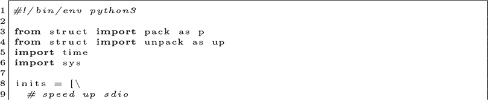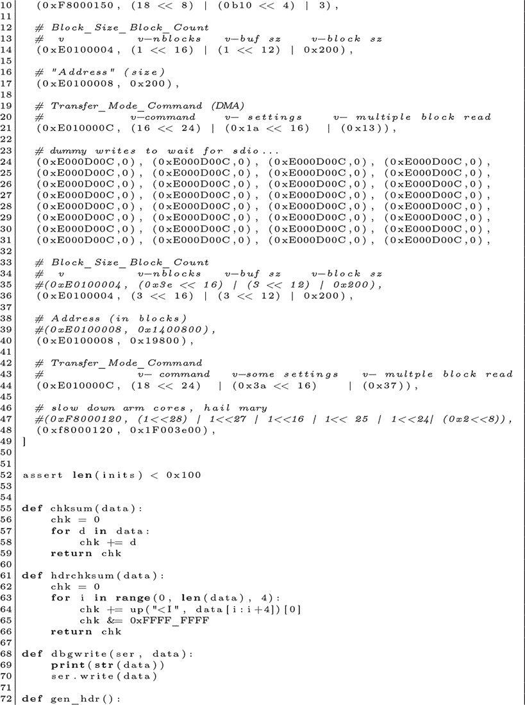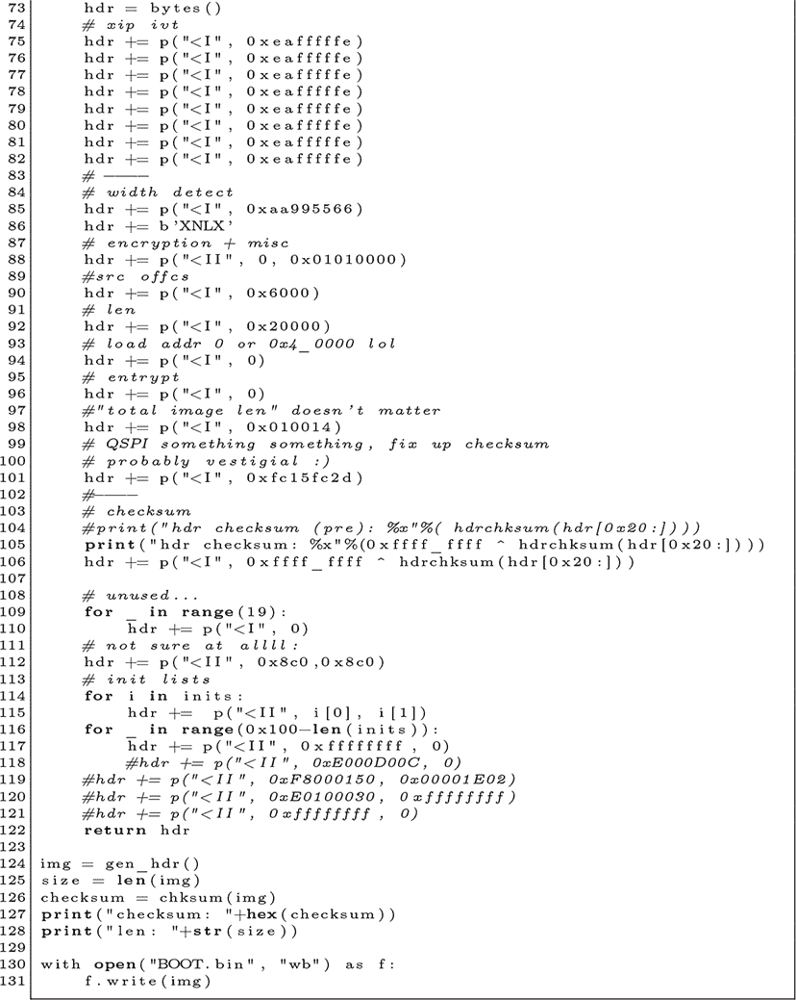

### **A.13 TMP91 密码**

東芝的 TLCS-900 系列，以其前缀 TMP91 而闻名，是 2000 年代初的 16 位微控制器。其引导加载程序具有两种保护措施：密码和保护标志。这些保护措施是冗余的，因此如果设置了标志，则仅密码并不是非常有用。

至少对于 TMP91FW27 和 TMP91FW60 设备，O’Flynn（2023）描述了成功使用功耗分析恢复引导加载程序密码，以及针对保护标志的不太成功的故障注入攻击。

ROM 引导加载程序仅包含五个命令，其中需要密码才能用`0x60`锁定芯片，并用`0x10`从 RAM 执行代码。启用保护标志可确保即使有密码，也无法从 RAM 运行新的程序。

在 O’Flynn 的情况下，他想提取自己厨房烤箱的固件，以便绕过恒温器的一个 bug。烤箱会加热到大约正确的温度，但温度计总是显示目标温度，而不是实际温度。这导致了一批精美的饼干被毁，科林决定通过固件提取和修补来报复。

他的烤箱使用的是 TMP91FW60 芯片，但他针对 TMP91FW27 进行了攻击原型开发，因为该芯片在 eBay 上更为常见。这里的思路是首先攻击一个便宜的目标，然后再回过头来攻击那个稀有的目标。

为了进行功率分析，他在 VCC 引脚上添加了分流电阻，并用外部时钟源替换了石英晶体，以便让功率分析与目标同步。通过向芯片发送密码猜测并测量每次猜测时的电压降，他能够逐字节地揭示猜测的正确性。他还确定了一个潜在的目标，通过电压或时钟故障跳过引导加载程序中的标志检查，这对于在启用保护标志时运行 RAM 程序是必要的。

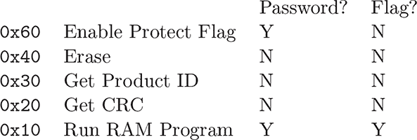

图 A.13：TMP91 引导加载程序命令

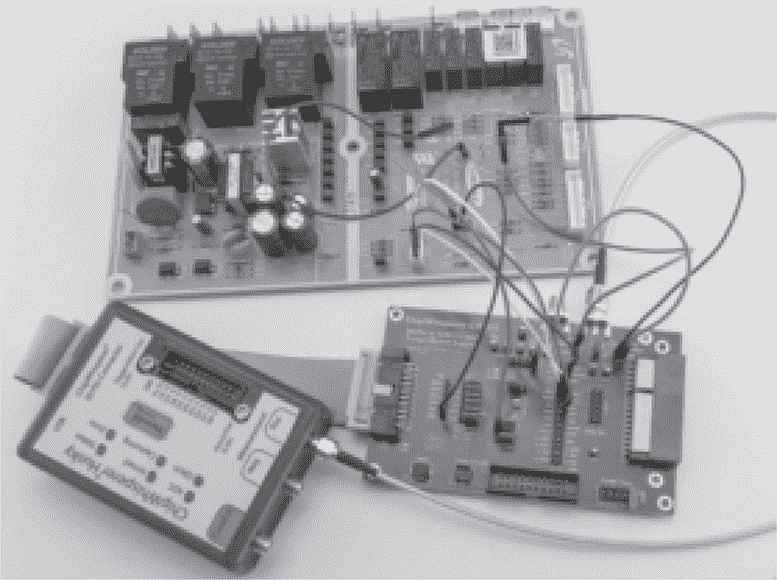

图 A.14：O’Flynn 的 TMP91 目标板

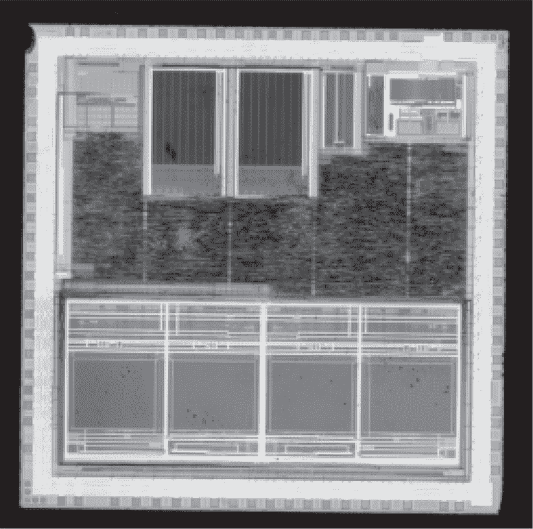

图 A.15：TMP91FU62F0

到此为止，他的 FW27 演示板一切顺利，于是他转回了烤箱中的 FW60 芯片。功率分析揭示了密码是`samsungoven0`，但在调整电压故障时，他不小心擦除了所有内存。他辛苦提取的固件消失了！

给三星客服打了几通电话后，他收到了替换品，但这个板子与原始烤箱有一个关键的区别。虽然两者使用相同的密码，但替换品并没有启用保护标志！知道密码后，他可以自由地从 SRAM 运行 shellcode 来提取程序内存。如果你没有这么幸运，得到一个没有锁定位的目标，O’Flynn 建议从搜索窗口的末尾向后查找你的故障参数。
