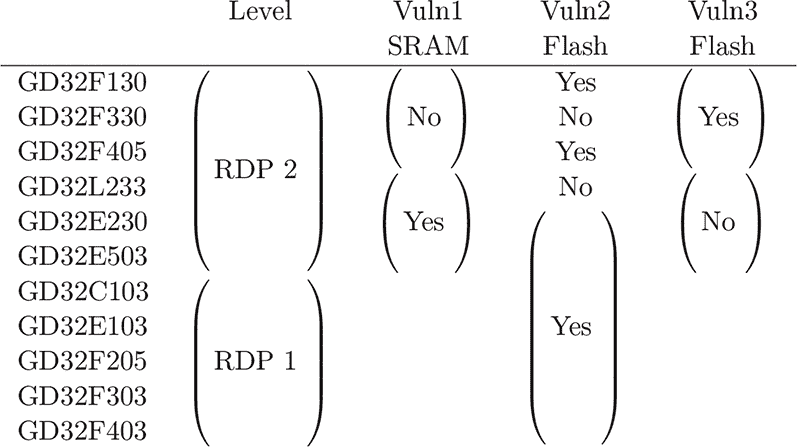
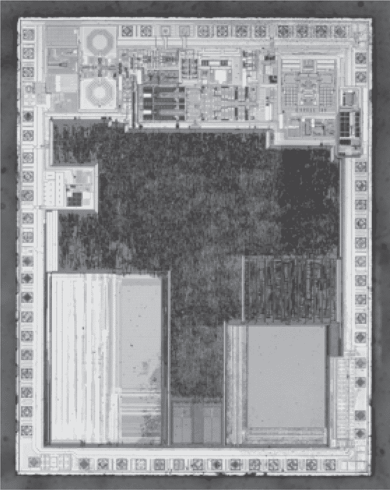

## **B 其他调试器攻击**

### **B.1 STM32 克隆**

GD32F103 是 STM32F103 的克隆，继承了其前辈的安全模型，其中 RDP 级别 1 允许 JTAG 连接，但会断开闪存连接。Obermaier、Schink 和 Moczek（2020）描述了一个巧妙的利用这一点的攻击。

作者注意到，当 `DHSR` 寄存器的 `C_DEBUGEN` 位被设置时，即启用 CPU 调试模块以暂停 CPU 或访问处理器寄存器时，会启用闪存访问限制。但当通过 JTAG 访问系统组件（如外设）时，这些限制不会生效。挑战在于如何在不触及 CPU 寄存器的情况下，仅通过外设触发代码执行。

他们的一个攻击手段是这样的：首先，JTAG 调试器控制 CPU，将 shellcode 写入固件未初始化的 SRAM 区域。然后重置目标设备，这会恢复对闪存的访问，但断开调试器连接。重新连接后，JTAG 被用来调整向量表偏移寄存器（VTOR），指向 SRAM 中的 shellcode，同时小心避免任何调试操作，以免启用 CPU 限制。由于新的 VTOR 值，下一次触发的中断将触发 SRAM shellcode 中的处理程序，进而转储所有闪存内容。

同篇论文描述了如何使用 JTAG 调试 GD32F103 和 CKS32F103 芯片的其他外设，同时小心避免任何针对 CPU 的调试操作。在这种情况下，目标是 DMA 引擎，而不是上一节中提到的 VTOR。

在 CKS32F103 上，DMA 引擎始终被允许从闪存读取，即使 CPU 的访问权限被撤销，因此你可以简单地使用 DMA 在内存到内存模式下将闪存内容复制到 SRAM。CPU 调试被用来暂停 CPU，命令 DMA 引擎从闪存复制到 SRAM，并获取 SRAM 的内容。

在 GD32F103 上，我们仍然可以使用 JTAG 读取缓冲区，但*不能*通过 JTAG 暂停 CPU，因为那样会启用 DMA 引擎的闪存访问限制。由于必须暂停 CPU 以防止内存访问冲突，他们使用 B.1 章中的 VTOR 技巧，将中断向量表移到 `0xF0000000`，这是一个非法地址，导致在下一个不可屏蔽中断（NMI）时 CPU 崩溃。这会暂停 CPU，但不会暂停 DMA 引擎，防止总线冲突影响正在传输的其他内存的可靠性。

论文中的另一个攻击方法影响 CKS32F103 和 GD32VF103，其中后者使用 RISC-V 内核，而非原始 STM32 芯片及其其他克隆的 ARM 内核。该攻击并不是通过 JTAG 将 DMA 外设指向闪存复制，而是利用了闪存访问在 CPU 执行来自芯片某些区域的代码时不会被禁用这一事实。

在 GD32VF103 中，从闪存或 SRAM 执行的固件可以读取闪存，即使芯片是只读保护的，调试器也不能直接读取闪存。因此，要转储内存，你只需将一些 shellcode 写入 RAM，运行它来执行从闪存的复制操作，然后使用调试器读取 RAM 中的缓冲区。

CKS32F103 也有类似的漏洞，但仅限于从 ROM 运行的代码，而不是从 RAM 运行的代码。利用这种漏洞的一种方法是盲目地在代码存储器中搜索合适的小工具，正如我们在第九章中看到的 nRF51 一样。Obermaier 采取了不同的方法，将解锁芯片的引导程序转储，以找到在所有 CKS32F103 设备中存在于可靠地址的小工具。

### **B.2 GD32 Giga 漏洞**

Kovrizhnykh（2023）通过扩展 Obermaier、Schink 和 Moczek（2020）的研究，提出了三种新的 GD32 微控制器漏洞。这些漏洞影响不同的设备；请参见表 B.1 找到适用于你感兴趣的芯片的漏洞。

在这些芯片中，保护级别大致与真正的 STM32 相同。RDP 级别 0 为无保护，级别 1 允许调试，但会禁用闪存，级别 2 应该禁止所有调试。这里的调试协议是 SWD，而不是 JTAG。

这些攻击中的每一种都依赖于一个奇怪的观察，即在芯片处于复位状态时，SWD 调试是可能的。SRAM 和闪存始终读取为零。外设可以读取，但只能读取它们的复位值。SWD 缓冲区，例如读取结果或即将被读取的地址，似乎不会被擦除。

这三种漏洞中的第一个是，在一些芯片中，如 GD32L23x、GD32E23x 和 GD32E50x，在复位期间排队的读取可以在芯片退出复位时执行。Kovrizhnykh 发现，他可以通过这种方式泄漏 SRAM 中的数据。

当!RST 引脚为低电平时，他发送“`W AP4 0x20000008`”来准备读取 SRAM。然后，!RST 引脚被拉高，芯片退出复位并开始启动。仅仅 1.45 微秒后，他发送“`R APc`”来执行读取，并在读取命令发送后不久将!RST 引脚拉低。总的来说，芯片仅在复位外停留了 55 微秒。当芯片重新进入复位状态时，他发送“`RDBUFF`”，然后芯片愉快地提供了`0x0800186c`，这是预期地址的值。

图 B.1：GD32F130，底层芯片

表 B.1：Giga 漏洞成功表

这里的机制是竞态条件。如果给芯片足够的时间完全启动，调试限制会生效，读取操作将被拒绝。这种技术无法提取闪存，可能是因为闪存比 SRAM 在复位后可用的时间要长。

第二个漏洞依赖于完全断开调试器，因为当启用调试域时，读取保护会被触发，方法是使用`CDBGPWRUPREQ`。通过将一个转储应用程序加载到 SRAM 并启动应用程序，然后使用`chip.dap dpreg 0x4` `0x0`在 OpenOCD 中清除调试域位来利用此漏洞。内存愉快地通过 UART 泄漏出来，SRAM 和闪存都可以直接以这种方式提取。

大多数测试的设备都容易受到这种攻击，但 GD32F3x0 是一个顽固的例外，既不容易受到第一种方法也不容易受到第二种方法的攻击。

第三个变种涉及该系列 F 系列芯片的上电复位序列中的竞态条件。!RST 引脚高电平后，SWD 无法工作，但可以通过断电、将!RST 引脚拉低并重新供电来使用它。功率分析表明，Kovrizhnykh 发现该系列的竞态窗口要比 E 和 L 系列更宽，达 1600 微秒，而 E 和 L 系列为 20 微秒。

这个第三个变种还有两个复杂因素。SRAM 因失去电源而内容丢失，因此我们无法像第一个变种那样暴露其内容。另一个复杂因素是，尽管 SWD 被允许，但无法调试 CPU，因此任何闪存的读取必须由外设执行。由于不能使用 CPU，Kovrizhnykh 改为配置 DMA 外设，将所有闪存直接转储到 UART。

### **B.3 赛灵思比特流解密 oracle**

来自赛灵思的 7 系列 FPGA 在运行过程中将比特流存储在 SRAM 中，这要求它们从外部存储芯片或微控制器加载配置。为了在不增加非易失性存储器成本的情况下保护这些比特流，赛灵思允许通过 AES-256 CBC 模式加密比特流，使用已烧录到 FPGA 有限 eFuse 内存中的密钥。

通过 JTAG 读取比特流被加密功能禁用，但 Ender、Moradi 和 Paar（2020）描述了一种漏洞，可以一次泄漏 32 位明文比特流。他们注意到，在 HMAC 错误之前，`WBSTAR`寄存器被加载了一个*解密的*比特流字。然后他们可以复位 FPGA 并读取此寄存器的内容，因为该寄存器在复位时不会被清除。

该攻击虽然缓慢，但非常有效，能够在三小时 42 分钟内解密 Kintex-7 XC7K160T 的比特流。Virtex 6 系列也容易受到此攻击，唯一的限制是每个 32 位字中的两位在复位期间会被破坏并丢失。

### **B.4 CC2510，CC1110**

德州仪器的 CC2510 和 CC1110 是最早将非易失性存储器、射频收发器和微控制器集成到一个封装中的芯片之一。这一代使用的是 8051 作为 MCU。

Devreker（2023）描述了一种电压故障攻击，用于从这些芯片中提取固件，灵感来自它们在电子墨水价格标签中的应用，且该标签使用的是尚未公开的无线协议。Devreker 首先通过 Raspberry Pi Pico 实现了调试接口，然后通过在 DCOUPL 引脚上加装 IRLML6246 MOSFET 为其添加了故障支持，这一引脚直接连接到用于连接去耦电容器的内部 1.8V 线路。他的代码是开放的。^[1]

他在文章中提到了一些有用的小技巧。将 Pi Pico 的时钟频率从默认的 125MHz 超频到 250MHz，可以提高故障的精度。该芯片有多个核心，将故障操作分配到与 USB 栈不同的核心上，可以避免 USB 中断影响计时。增加故障引脚的驱动强度可以提高其跃升速率，使故障信号的边缘更加锐利。通过 Pi Pico 的 GPIO 引脚直接为 CC2510 供电，可以在故障发生后轻松重启目标设备。这些小技巧虽然可能并非严格必要，但它们为他的论文增加了可移植性，即使在处理非常不同的目标时也能提供很好的参考。

图 B.2：德州仪器 CC2510

至于故障本身，攻击调试协议的状态机与攻击引导加载程序的软件解析器可能是完全不同的。每当调试器命令芯片执行指令时，都会检查芯片的锁定状态。通过在`DEBUG_INSTR`调试命令之后制造一个故障可以绕过这个检查，但最少需要两条指令，首先将 16 位地址`MOV`到`DPTR`寄存器，然后通过`MOVX`将`@DPTR`处的字节读取到累加器中。为了读取一个字节，两个故障都必须成功。

由于需要进行双重故障，Devreker 的漏洞利用速度相当慢。他报告了每次故障大约 5%的成功率，因此双重故障的综合成功率为 0.25%。这意味着每二十秒他能获得一个字节，或者在四天内获得完整的 32kB 固件镜像。
