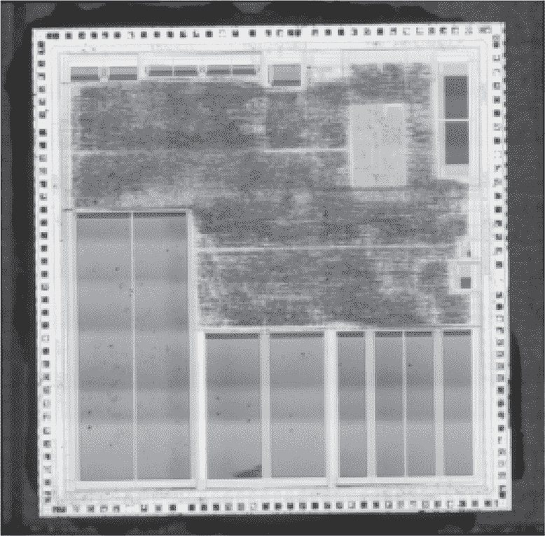
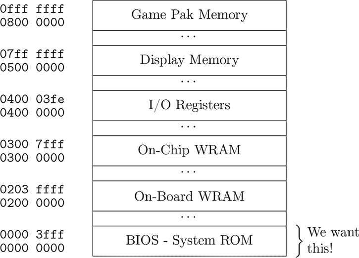
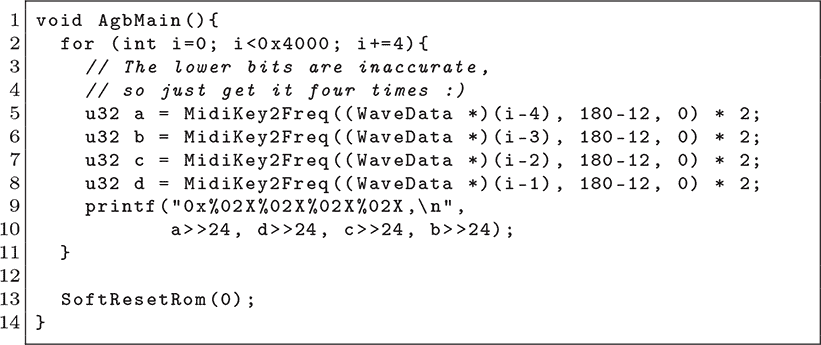
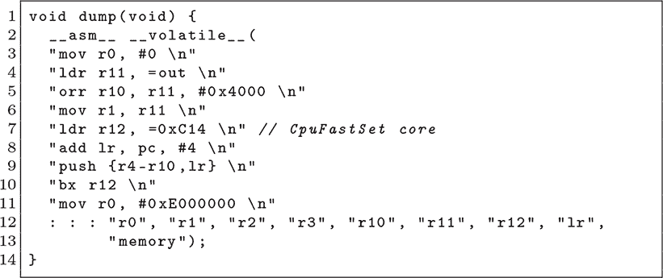
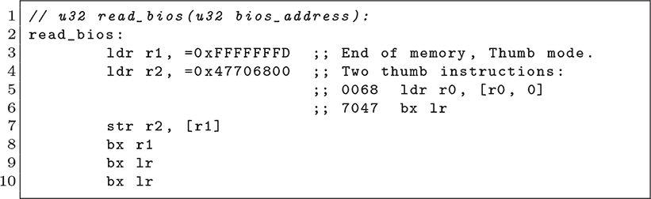
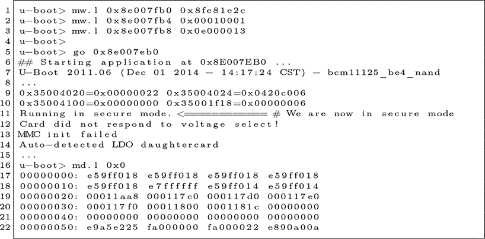
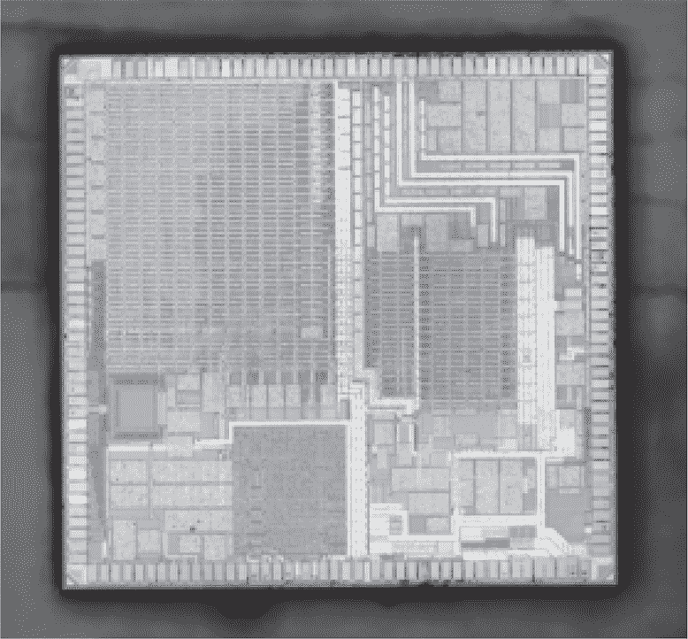
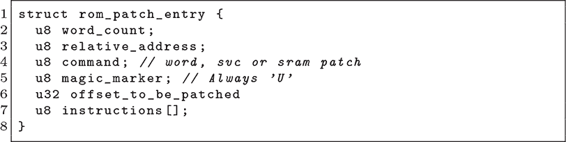
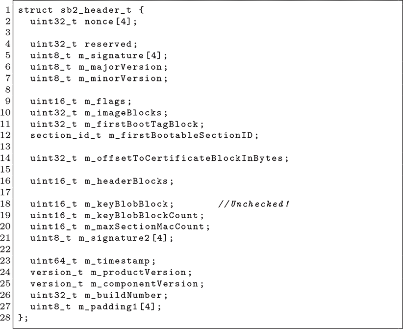

## 第二十八章：**C  更多特权升级**

### **C.1 Game Boy Advance BIOS**

与其前身 Game Boy 一样，任天堂的 Game Boy Advance 包含一个在重置时执行的掩码 ROM，用于启动游戏卡带，且会验证卡带是否包含有效的任天堂商标 logo 以保护商标。在 Game Boy 中，ROM 会在跳转到游戏卡带之前取消映射，而 Game Boy Advance 则保持 ROM 映射在内存中。我们称之为*BIOS*，因为它像 IBM PC 中的 BIOS ROM 一样，包含作为中断调用的便捷功能。

与本书中的许多目标不同，攻击者拥有在设备上运行任意机器码的特权。这是通过一个简单的 EEPROM 芯片连接到游戏卡带的正确引脚来实现的，在任天堂发布 GBA 后，爱好者很快就可以使用它。

BIOS ROM 的转储对于模拟平台非常有用，因此设有访问限制。当从其范围外的地址作为代码读取时，ROM 会被禁用；而当从其范围内的地址作为代码读取时，则会重新启用。这一过程是在硬件层面发生的，在访问发生的瞬间。

本章中，我们将看到三种方法来欺骗 Game Boy Advance 允许读取 BIOS ROM。其中一种利用了没有源地址限制的 BIOS 调用，一种预先中断 BIOS 调用以在验证后更改源地址，第三种通过从未映射的内存执行指令，以使流水线解锁 ROM 进行读取。

图 C.1：任天堂 GBA CPU

#### **MidiKey2Freq 方法**

Fader（2001）是经典的 BIOS ROM 转储漏洞，如图 C.3 所示。它是 Unix 中经典的内核内存暴露技术的变种，其中一个系统调用未能验证源地址，导致调用者可以在内核权限下查看内存。

`MidiKey2Freq`作为 ROM 中断`0x1f`实现。它接受一个指向 MIDI 样本的指针，读取该地址的四个字节，并对这四个字节执行音频处理功能。然而，这个音频功能没有范围或对齐限制，并且它保留了最高字节不变。Fader 的漏洞通过 ROM 地址空间进行循环，每次抓取返回值中的最高字节。

#### **Endrift 方法**

曾一度认为`MidiKey2Freq`方法是唯一的 BIOS ROM 转储方式，但 Vicki Pfau 觉得这不对。在 Pfau（2017）中，她提出了两种不同的黑盒技术来转储 BIOS ROM。她的两种技术都依赖于 ARM7 的中断优先级，在 BIOS 调用的软中断进行时触发硬件中断。

嵌套中断无法直接读取 BIOS，但它拥有完全的权限来读取和写入 BIOS 调用中的软件中断的调用栈。

Vicki 的黑盒示例注册了一个定时器中断，与软件中断调用 `CPUFastSet` 重叠。`CPUFastSet` 处理程序在 BIOS 地址空间内执行快速复制，但它验证源地址，因此调用者不能仅仅用它导出 BIOS。在 BIOS 软件中断运行时，它会被她的 `bbTest` 处理程序打断，然后扫描软件中断调用栈中的源指针（位于 `CPUFastSet` 的栈帧中）。在返回之前将源指针覆盖为 ROM 地址，然后会导致 BIOS 执行非法的复制操作，因为源地址只在中断处理程序开始时验证一次，而不是对每个字都重复验证。

|  `0x00`  | SoftReset |
| --- | --- |
| `0x01` | RegisterRamReset |
| `0x02` | Halt |
| `0x03` | Stop |
| `0x04` | IntrWait |
| `0x05` | VBlankIntrWait |
| `0x06` | Div |
| `0x07` | DivArm |
| `0x08` | Sqrt |
| `0x09` | ArcTan |
| `0x0A` | ArcTan2 |
| `0x0B` | CPUSet |
| `0x0C` | **CPUFastSet** |
| `0x0D` | BiosChecksum |
| `0x0E` | BgAffineSet |
| `0x0F` | ObjAffineSet |
| `0x10` | BitUnpack |
| `0x11` | LZ77UnCompWRAM |
| `0x12` | LZ77UnCompVRAM |
| `0x13` | HuffUnComp |
| `0x14` | RLUnCompWRAM |
| `0x15` | RLUnCompVRAM |
| `0x16` | Diff8bitUnFilterWRAM |
| `0x17` | Diff8bitUnFilterVRAM |
| `0x18` | Diff16bitUnFilter |
| `0x19` | SoundBiasChange |
| `0x1A` | SoundDriverInit |
| `0x1B` | SoundDriverMode |
| `0x1C` | SoundDriverMain |
| `0x1D` | SoundDriverVSync |
| `0x1E` | SoundChannelClear |
| `0x1F` | **MIDIKey2Freq** |
| `0x20` | MusicPlayerOpen |
| `0x21` | MusicPlayerStart |
| `0x22` | MusicPlayerStop |
| `0x23` | MusicPlayerContinue |
| `0x24` | MusicPlayerFadeOut |
| `0x25` | MultiBoot |
| `0x26` | HardReset |
| `0x27` | CustomHalt |
| `0x28` | SoundDriverVSyncOff |
| `0x29` | SoundDriverVSyncOn |
| `0x2A` | SoundGetJumpList |

表 C.1：Game Boy Advance BIOS 中断

图 C.2：Game Boy Advance 内存映射

图 C.3：来自 Fader（2001）的 MidiKey2Freq ROM 转储器

图 C.4：来自 Pfau（2017）的优化 GBA BIOS 转储器

图 C.5：来自 Hearn（2017）的 BIOS Peek 功能

黑盒方法特别好，因为它不要求作者已经拥有一份 BIOS，并且时序校准不需要特别精确。Vicki 还提供了一个优化实现，直接在 `CPUFastSet` 中间进行 `bx` 调用，因为 BIOS 入口点不强制执行，并且那段代码始终可以从 BIOS 中读取。请参见 图 C.4。

#### **执行缺失的内存**

虽然 Fader 直接使用 BIOS 调用来泄漏内存，Pfau 则通过伪造栈或在嵌套中断中修改真实栈来重用 BIOS 代码，Hearn（2017）则达到了极致的复杂性。她设法在地址空间的最远端执行来自未映射内存的代码，因此，来自内存起始位置的预取指令在从流水线中被丢弃之前解锁了 BIOS。我不是在开玩笑！

回想起你本科时的计算机科学课程，像 ARM7TDMI 这样的 90 年代 RISC 芯片采用了流水线架构。这个具体的例子有三个流水线阶段：取指、解码和执行。在 CPU 执行指令的同时，它会解码下一条指令并取出下一条指令。如果取出的和解码的指令没有价值，它们会被直接丢弃。

CPU 通过总线与外设进行通信，如内存和 I/O。在 ARM7TDMI 上，有一个有趣的现象：该总线的数据线保持它们的最后一个值，每当一个未映射的地址被取出时，它会返回这个值。^(1) 如果你从任何地方读取`0xdead-beef`，或者将其写入任何地方，然后再从一个未使用的地址读取，比如`0x10000000`或`0x4bidb10c`，且两次读取之间没有其他总线访问，你将会读取到`0xdeadbeef`。这是架构的一个特性，许多其他情况下会触发故障或返回不同的值。^(2)

结合这些观察，Hearn 意识到，如果她能够将两条 Thumb 指令写成单个 32 位字并跳转到`0xfffffffd`，那么第一条指令可能会在 ROM 的第一条指令（从`0x0000-0000`取出）执行之后执行，从而解锁 ROM。图 Figure C.5 中的几行 Thumb 汇编完成了这一点，它们简直是一件艺术品。

在阅读代码时，别忘了 Thumb 寻址是如何工作的。`0xfffffffd`表示 Thumb 模式，但 16 位指令是从`0xfffffffc`取出的。每次取出的都是 32 位数据，第二条指令不会单独取出。

第 7 行将她的指令对写入内存末尾，第 8 行则跳转到内存末尾执行它。`ldr`指令会将作为参数给定的任何 BIOS 地址读取到返回值中，而`bx lr`指令则返回给调用者。“等一下，”你可能会问，“如果我们还没有从 ROM 中执行任何指令，第一条指令怎么能够读取 BIOS ROM 呢？”

CPU 流水线就是答案。在`ldr`指令从 ROM 加载一个字之前，流水线已经从`0x00000000`取出一个 32 位的字进行解码，最终准备执行。这为数据提取解锁了 ROM，且即使这些流水线指令会在接下来的`bx`指令中被丢弃，也无关紧要。

### **C.2 MSP432 IP 封装**

IP 封装（IPE）是德州仪器部分 MSP430 和 MSP432 设备的一个特性，目的大致与 TrustZone-M 或其他可信执行环境（TEE）相同。其思想是，你可能会购买一个带有无线电库的微控制器，你可以*使用*这个库，但不能*读取*这个库来进行逆向工程或克隆。

就像本章其他特权升级漏洞一样，防御方处于明显的不利位置。攻击者能够运行本地代码，附加调试器，并进行故障注入。防御方只能希望 TI 的限制足以防止提取受保护的库。

Sah 和 Hicks（2023）详细描述了这个特性，并指出了一些设计错误，这些错误暴露了封装的固件。有两个事实对于利用这一漏洞特别重要：首先，IPE 特性并未强制执行进入受保护代码的特定入口点，因此当从用户程序内存调用时，gadget 可以被重用。其次，IPE 特性并未禁用大部分中断源，尤其是定时器中断，它们在攻击者代码中非常有用，能够让攻击者在封装库中间执行代码，从而获得有关库的信息。

利用细节在 16 位的 MSP430 架构和 32 位的 MSP432 架构之间有所不同。在这两种情况下，都使用一个非常小的计时器来触发受保护库内的异常，然后非保护应用程序中的异常处理程序观察寄存器状态，以便做出关于代码状态的合理猜测。

例如，如果处理程序观察到某些额外的返回指针被压入栈中，这些指针将揭示 MSP430 上的`call`指令或 MSP432 上的`bl`/`blx`指令的位置。类似地，攻击者可以通过在 ARM 上调用这些指令并设置链接寄存器，或者在 MSP430 中加载返回指针到栈来定位`ret`指令。

最终，攻击者会发现一个 gadget，它能够将任意地址读取到寄存器中。也许 gadget 会返回，在这种情况下就不需要定时器。也许它不返回，在这种情况下可以使用定时器的倒计时来反复调用这个 gadget，然后跳出。无论是哪种情况，重复使用 gadget 可以提取所有受保护的内存。

### **C.3 BCM11123 U-Boot 和 TrustZone**

Cisco 的 8861 型号 IP 电话使用了带有 TrustZone 的 Broadcom BCM11123 CPU。TrustZone 芯片有两种模式，*安全*代码拥有*非安全*代码所不具备的特权。并不是说非安全代码易被利用，而是它不被信任。两种模式之间的通信通过中断处理程序进行，类似于用户空间到内核的系统调用。

在这款手机的情况下，U-Boot 在非安全内存中运行，通过调用 TrustZone 监控程序来验证并启动 Linux 内核。Cui 和 Housley (2017) 主要讲述 EMFI 攻击，但该论文的附录描述了一种针对这种配置的巧妙攻击。

图 C.6: Cui 和 Housely 针对 BCM11123 的漏洞利用

作者们首先在启动时故意破坏手机的 NAND 闪存，以便进入 U-Boot 的命令行，这就像在 第十四章 中提到的 Freescale MC13224 的 ROM 启动加载程序一样。这个启动加载程序提供了读取、写入和执行内存的便捷命令，但由于它位于非安全区，因此不足以转储或控制 TrustZone 中的安全区域。接下来的任务是找到 TrustZone 监控程序中的漏洞，并从 U-Boot 中利用它。

涉及的漏洞位于 `_ssapi_public_decrypt` 函数中，该函数缺少必要的长度检查，并未确保源地址和目标地址位于 TrustZone 障碍的适当一侧。通过精心选择正确的参数，Cui 和 Housley 成功地将小块数据从安全区复制到 U-Boot 可以访问的非安全内存中，进行反向工程和转储。

他们随后利用同样的漏洞反向操作，覆盖了安全区中的返回指针，并将 U-Boot 本身提升到 TrustZone 内运行。

### **C.4 LPC55S69 硬件和软件**

LPC55 系列微控制器采用 ARM Cortex-M 架构，并通过 TrustZone-M 来保护密钥材料，例如每个设备唯一的密钥，免受用户编程应用程序的影响。理想情况下，这将使板设计者能够在芯片上安装使用该密钥材料的软件，但即便该应用程序软件存在严重漏洞，攻击者也无法控制受信任区域、其软件或其密钥。

一些 Cortex-M 设备包括一个闪存补丁和断点（FPB）单元，它允许对内存中的几个字进行修补，用选择的值覆盖其真实值。在像 LPC55 这样支持 TrustZone-M 的设备中，ARM 明确禁止该 IP 模块，以防在重新映射地址空间时，TrustZone-M 保护可能被失效。

在为 LPC55S69 反向工程一个应用程序时，Laura Abbott 发现存在一个自定义模块，类似于被禁用的 FPB 单元，可以对内存中任何地址的几个 32 位字进行小规模修补，包括 ROM 中的字。她在 Abbott (2021) 中记录了该模块，并描述了如何利用它伪造 ROM 补丁的签名验证，从而允许恶意补丁被安装并在下次启动时继续存在。

该模块作为 APB 外设存在于`0x4003e000`的非安全内存和`0x5003e000`的安全内存中，这一地区在 LPC55S6x 用户手册的内存映射中缺失。由于它存在于特权模式和非特权模式下，因此非特权代码可以利用它对特权 ROM 代码的行为进行修补，从而实现特权升级！

图 C.7: LPC55S69

该补丁模块的配置会在重置时被清除，但如果攻击者希望补丁能够持续存在，比如禁用安全启动认证，怎么办呢？Abbot 描述了一个受保护的闪存区域中的补丁条目表，其结构如下。三种支持的命令包括单字更改、`svc`入口点更改和对 SRAM 的补丁。

除了未记录的补丁模块外，还有第二个软件漏洞可用于提升权限进入安全世界。Abbott（2022）中描述了固件更新头部解析中的软件漏洞，它允许从非安全世界进行特权升级，并在下次重置后持续控制。

错误位于头部结构中，如图 C.8 所示。按设计，`m_keyBlobBlock` 应该是紧接着头部之后的块号。每个块为 16 字节，因此第 8 块应该紧随 128 字节的头部之后。

安全启动解析器不是仅仅复制头部，而是继续复制数据块，直到计数到`m_keyBlobBlock`。当这个数字大于 8 时，这种复制就会成为典型的缓冲区溢出。

另请参见第 A.3 章，了解引导加载程序 USB 堆栈中的缓冲区过度读取问题，以及第 E.2 章，了解针对芯片的故障攻击集。

图 C.8: LPC55 SB2 更新头部

### **C.5 FM3 闪存补丁**

英飞凌的 FM3 系列 Cortex M3 微控制器至少在索尼的 Playstation 4 Dualshock4 控制器的某些型号中被使用。Enthusiast（2018）描述了一种闪存补丁和断点（FPB）技巧，类似于第十七章和 C.4 章中的方法，这种技巧可以通过在重置后持续补丁来提取闪存。

该芯片具有启动模式引脚，标记为`MD`，在复位时会读取这些引脚以执行来自闪存的应用程序或来自 ROM 的串行引导加载程序。USBDirect 是制造商的编程工具，其通过将本地代码块加载到 SRAM 中来操作。该代码块的开源替代方案已发布，通过对其打补丁，您可以自由地调整编程环境。

这是一个不错且简单的开始，但代码运行在受限的环境中，直到进行全擦除之前无法访问闪存。任何尝试从闪存读取数据的行为都会返回垃圾数据，这也适用于像 DMA 传输这样的复杂读取方法。

通过更多的实验，作者发现 SRAM 在重置后仍然保持数据。正如我们在第二章中看到的，这是一种很好的方法，可以在后续攻击中留下 shellcode。

了解到 SRAM 没有被重置后，作者开始查看其他外设，最终找到了 FPB 单元。FPB 保存了六对地址，将从第一个地址获取的代码映射到第二个地址的获取。这一模块的配置在重置时也不会被清除！

最终的攻击利用包括一个用于串行引导加载程序的 SRAM 数据块，该数据块启用了 FPB，通过它修补闪存中的用户应用程序，以重新进入串行引导加载程序。此时，可以呈现正常的 SRAM 数据块。由于设备是从闪存启动的，读取限制没有启用，因此这个数据块可以导出所有闪存。大规模擦除并重写固件后，便能解锁目标，就像我们在第十七章中看到的一样，只是这次不需要在重置时引发电压故障。
