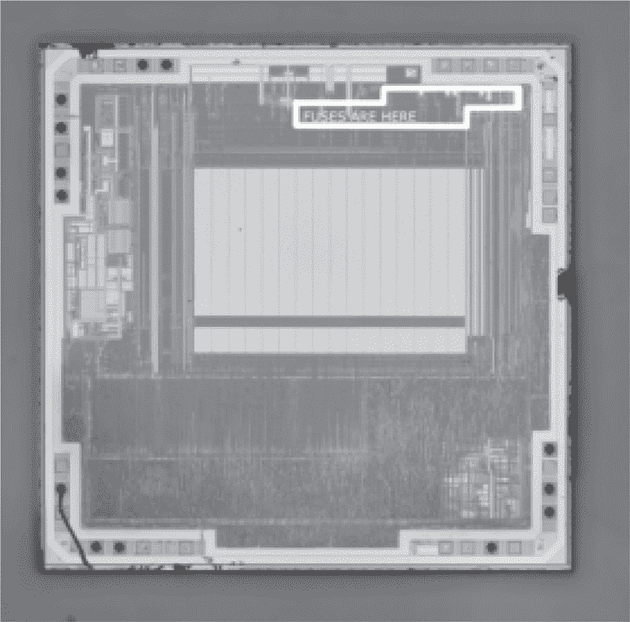
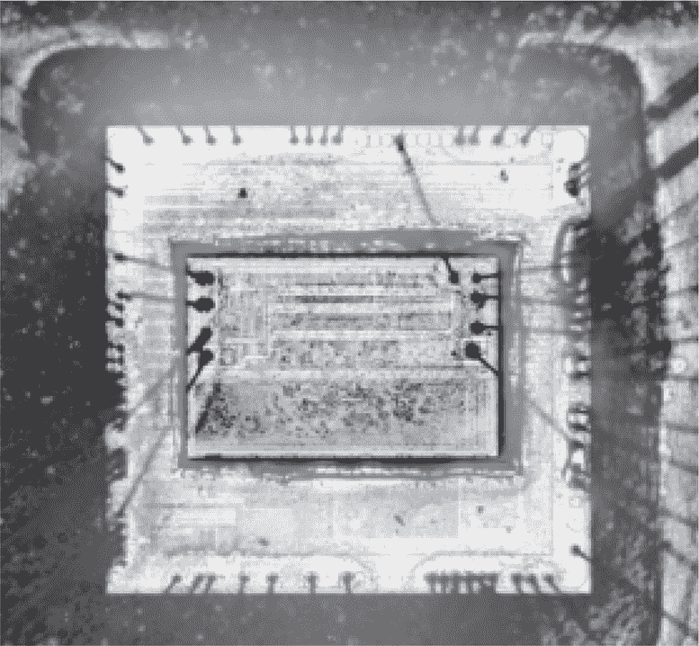
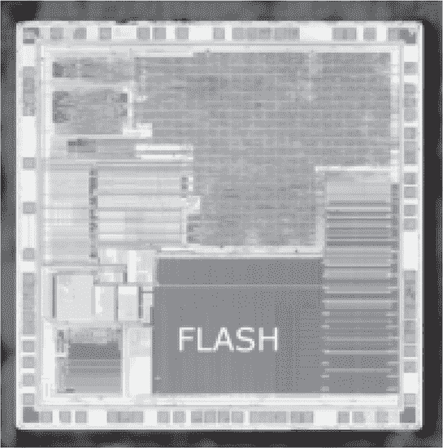
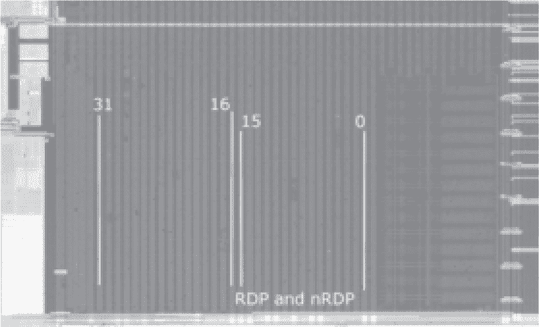
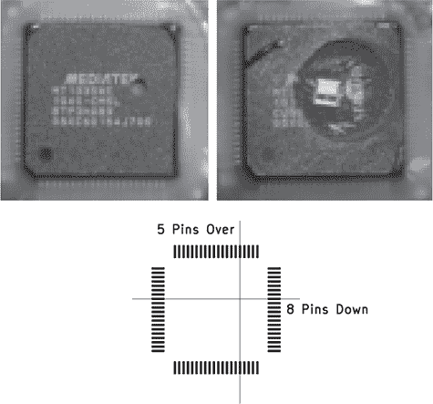
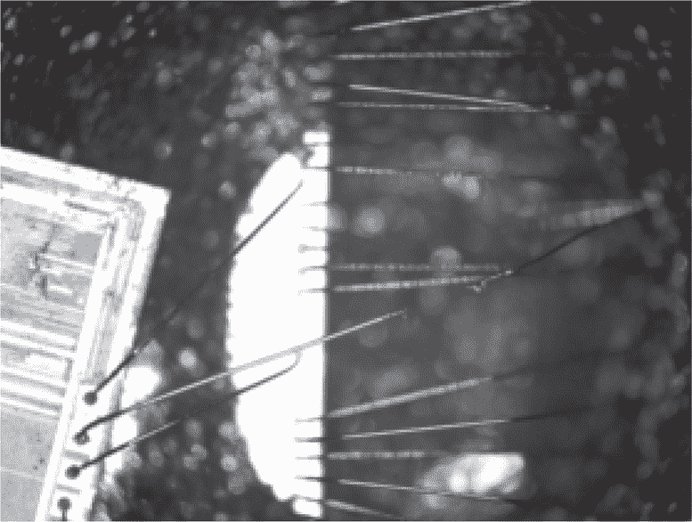

## **D  更具侵入性的攻击**

### **D.1 Atmega、AT90 背面 FIB**

Helfmeier 等人（2013）描述了针对 Atmega328P 和 AT90SC3232 的背面探测攻击。这两款芯片使用相同的 AVR 核心，但 Atmega 使用浅槽隔离（STI）来分隔晶体管，以防止电流泄漏，而 AT90 则在其顶部两层金属之间有一层安全网格。

在这两个芯片中，作者能够通过 IC 背面挖掘出一个槽沟，暴露出熔丝位，然后通过聚焦离子束（FIB）篡改熔丝来设置或清除熔丝。改变与读保护相关的位后，芯片便可以外部读取。

论文中记录了熔丝位置，以及关于 STI 特性如何影响 FIB 槽沟工作的说明。你可以在图 D.1 中找到大致的熔丝位置。

### **D.2 GD32F130 QSPI 嗅探与注入**

GD32F103、GD32F130 和一些 STM32 的克隆芯片是双芯片设备，其中闪存芯片堆叠在 CPU 上方，通过 QSPI 总线连接。如图 D.2 所示，可以看到这两个芯片通过线键合直接连接在一起。上面的小芯片是存储器芯片，下面的大芯片是 CPU。

图 D.1：Helfmeier 等人（2013）提供的 Atmega328P 熔丝

图 D.2：GD32F130 与 QSPI 闪存芯片的键合

Obermaier、Schink 和 Moczek（2020）记录了去除包装以暴露连接两个芯片的引线、使用逻辑分析仪嗅探 4MHz 总线流量、逆向工程一些地址和数据混淆，然后重构固件镜像的过程。此外，他们还能够向总线注入数据故障，通过引入单个位错误将 RDP 等级从 2 降级到等级 1。通过翻转地址的两个比特，还可以将 RDP 降级到等级 0。

### **D.3 STM32 紫外线降级**

Obermaier 和 Tatschner（2017）的大部分内容讨论了在第十章中，STM32F0 系列的 JTAG 调试中的一个令人愉快的漏洞，允许使用自定义 JTAG 调试器从 RDP 等级 1 提取固件。这些芯片中的许多都被锁定在 RDP 等级 2，论文还讨论了如何通过实时去壳和紫外线光降级芯片。Garb 和 Obermaier（2020）扩展了这一研究，提供了关于 STM32F0 系列闪存布局和激光故障注入的具体笔记。

总结本书中多个章节所解释的内容，RDP 等级 0 完全解锁，等级 2 完全锁定，不允许调试。等级 1 是中间地带，允许使用调试器，但连接调试器会禁用对闪存的访问。由于调试器的访问对攻击者非常有用，例如用于放置 shellcode 或利用保护中的漏洞，从等级 2 降级是一件非常有价值的事情。

保护级别存储在选项字节中，作为一对 16 位字，分别命名为`RDP`和`nRDP`。这些字对 Level 0 和 Level 2 有固定值，*所有*其他值为 Level 1。因此，虽然我们需要一个非常特定的值才能降到 Level 0，但翻转任何一个单独的位就足以降到 Level 1。

图 D.3：STM32F051 顶层金属

图 D.4：STM32F051 闪存布局

了解到紫外线能够将闪存的位从 0 提升到 1，Obermaier 功能性地去除了 STM32F051 的封装，并将紫外线 C 射线照射到其上，同时反复尝试连接调试器。几个小时后，调试器成功连接，并且`RDP`/`nRDP`选项字节中的一个 0 位变成了 1。不幸的是，其他的存储位也发生了变化，因此需要进行掩蔽，以最小化对其他存储的损坏进行解锁。与第十九章中的 PIC16 一样，掩蔽可以通过直接在芯片上涂抹指甲油来完成。

对位损坏的显而易见解决方案是掩蔽存储器，但首先我们需要知道哪个物理区域包含选项字节。他们将所有闪存存储器在解锁芯片中填充为零，然后在紫外线光线穿过塑料掩蔽层照射的同时，反复使用调试器重新读取存储器。实际上，这将芯片变成了一个图像传感器，所有的 1 位表示存储器中被掩蔽区域外的地方。

这表明图 D.3 中的 STM32F051 闪存具有 1024 位行和 512 字行，组织成 32 位列的 32 位行。位线垂直于芯片最近的边缘，最重要的位在左侧，最不重要的位在右侧。选项字节位于字行 0 下方，`RDP`和`nRDP`位于闪存单元区域的右半部分，因为它们是 32 位字的下半部分。图 D.4 展示了闪存位列和 RDP 字位置的大致布局。

他们最好的解决方案是一个移动的塑料掩蔽层，只暴露闪存的右下角边缘。这实现了几次解锁没有损坏固件，并且许多解锁只损坏了几百个固件位，而两个损坏的固件图像进行按位`AND`运算通常足以生成一个干净且准确的图像。

### **D.4 MT1335WE 神风**

来自第十四章的 MC13224 并不是唯一一款将没有非易失性存储器的 CPU 芯片与标准 SPI 闪存芯片结合的系统封装（SiP）。

联发科技的 MT1335WE 可以在 Xbox 360 的 DVD-ROM 驱动器中找到，其固件负责区分商业光盘和消费者 DVD 刻录机制作的 DVD-R 光盘。盗版者发现，可以将这些光盘补丁使其接受刻录的光盘，*但只有在*重写了 MT1335WE 的 SPI Flash，并且固件被补丁化的情况下才行。复杂之处在于，SPI Flash 芯片是内置于 MT1335WE 封装中的，因此没有外部引脚可供接触，也没有可以替换的封装。

写保护通过芯片的 !WP 引脚实现，就像它在一个单独的封装中一样。为了绕过这个控制，我们可能会通过键合线连接 SPI Flash 芯片的 !WP 引脚。这个过程在 sQuallen（2012）中有所描述，并引用了 Geremia 和 Carranzaf 作为共同发现者。

这个想法是，图 D.6 中显示的键合线在不同芯片之间的位置是一致的，即使丝印标注稍有偏差。因此，通过图 D.5 中显示的定位方法，使用钻头准确击中键合线是可能的，知道钻头最终会与键合线碰撞。如果仔细观察 SPI Flash 右侧的第二根键合线，你会发现它已经被钻头干净利落地切断了一半。

为了执行解锁操作，钻头通过一个上拉电阻松散地连接到 3.3V 引脚。早期的说明建议在封装的东侧画一条线，离东侧五个引脚、北侧八个引脚的位置，这通常位于“Mediatek”字母 K 的东南方。后来的工具包使用了一个柔性 PCB 作为模板，模板上有一个小孔用于放置钻头。

图 D.5：MT1335WE 钻孔点

图 D.6：MT1335WE 键合线

缓慢旋转钻头，施加较小的压力，直到钻透封装并触及到键合线，而在此过程中，PC 反复尝试重写 SPI Flash 内容。这个过程一开始会失败，因为钻头尚未拉高 !WP 线，但最终钻头会接触到键合线，SPI Flash 就解锁了！

sQuallen 还提到了一种利用点燃打火机的压电火花攻击，将其放置在键合线附近。据我所知，这不是为了执行初始解锁，而是为了将高阻抗输入引脚“漂移”回高电压状态。这允许在切断键合线后进行重新编程，而无需进一步钻孔。

### **D.5 Xilinx XCKU040 背面激光注入**

Lohrke 等人（2018）描述了一种针对翻转芯片封装的 Xilinx XCKU040-1FBVA676 的红外激光刺激攻击，这是一种具有加密比特流的 FPGA。

这个 20 纳米芯片的背面在封装上暴露，且芯片的基板对红外光透明。这意味着可以从*外部*对芯片芯片进行拍照，*非侵入性*地进行！如果你想在不解封的情况下拍摄自己的背面照片，请参考 Huang（2022）中的设备列表。

XCKU040 是一个 FPGA，其位流在启动时从外部存储芯片加载。为了保护该位流不被复制或逆向工程，它使用一个密钥进行加密，该密钥保存在电池备份的 SRAM（BBRAM）中或在 eFuse 中。BBRAM 的缺点是需要备份电池，但它提供了一些额外的安全性，因为破坏备份电源的侵入性攻击也会摧毁密钥，防止其恢复。

因此，意识到硅背面暴露并对红外光透明，Lohrke 使用红外激光照射电池备份区域中的 SRAM 单元，并在每个点上绘制功耗图。果然，CMOS 功耗泄漏突出了每个比特单元，在一种方向上为 1，而在相反的方向上为 0，揭示了关键！
