## **E  更多故障注入**

### **E.1 Java Card 无效字节码**

Java Card 是一个简化版的 Java，旨在运行于微控制器和智能卡上。它是那种只能在九十年代发明的疯狂设备，允许 Java 开发固件小程序。在这里，我们将讨论 Mostowski 和 Poll（2008）以及其他地方描述的类型混淆问题，以及 Barbu、Thiebeauld 和 Guerin（2010）在此方案中绕过保护的一种方法。

实现这个操作需要做很多权衡。在 Java Card 小程序中，你会发现使用原始数据类型的情况比普通 Java 软件更多。可用的库有限，你必须通过调用硬件加速库来进行加密，而不是完全通过软件实现自己的加密功能。

Java Card 3 于 2008 年发布，增加了强制的片上字节码验证（OCBV）。之前的卡片仅仅信任开发者的工作站生成并签名有效的字节码。这意味着任何具有签名权限的人都可以编写非法字节码，将一个类转换成另一个类，然后利用错误解释的类的数据字段转储整个 ROM。

虽然你可能没有签名密钥来提取你想要的卡片密钥，但通常可以从 eBay 购买一张“白卡”，它接受开发者密钥。在这些卡片上，可以利用这种漏洞来转储 JVM ROM，这是攻击锁定卡片时非常有用的工具。

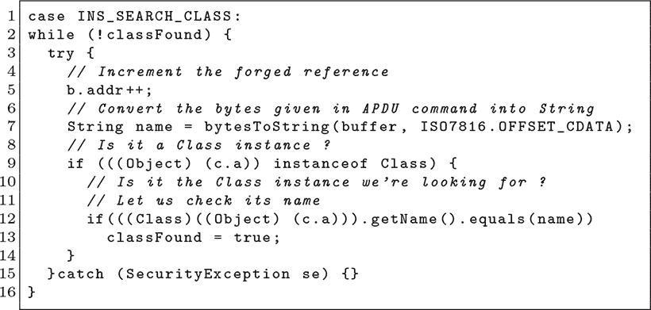

图 E.1：捕获误转指令

我们已经提到过 Java Card 3 修补了这个漏洞，所以接下来我们来讨论一个技巧，可以在运行时执行类型混淆，而不会触发字节码验证器的警告。这个方法最早在 Barbu、Thiebeauld 和 Guerin（2010）中描述过。

这个想法是使用 Java 的`try`/`catch`结构，其中非法转换的错误会被捕获，但不会使机器崩溃。可以应用许多漏洞，应用程序将帮助掩盖那些失败的漏洞，直到某个幸运的漏洞成功。

Barbu 提供了图 E.1 中的具体示例，其中`SecurityException`被悄悄捕获并忽略，但如果转换没有触发异常，则该对象可以重新使用。这个过程会无限循环，除非出现故障注入，因为异常总是会发生，但幸运的故障会跳过异常并允许转换。一旦成功转换，错误类型的对象可以在不触发另一个异常的情况下使用几个小时。

### **E.2 L11, M2351, LPC55 CrowRBAR**

Roth（2019）描述了针对 NuMicro 的 M2351 芯片和 NXP 的 LPC55S69 的故障攻击。这很快被 Results（2020b）跟进，后者描述了这些故障的实际影响。Roth 的论文涉及针对归属单元的电压故障攻击，归属单元定义了内存区域的信任级别。

他首先描述了 ARM 的标准化安全归属单元（SAU）。这是一个外设，用于将内存区域描述为安全、非安全或可调用非安全。某些芯片还支持一个实现定义的归属单元（IDAU），它可能是定制的，而不是继承自 ARM 的标准设计。

他的第一个目标是 Microchip 的 SAM L11，这是首批搭载 TrustZone-M 的微控制器之一。此芯片不包含 SAU，只有一个由启动 ROM 配置的 IDAU，该配置来自闪存中的一行数据。^(1)

故障攻击的目标是读取安全世界中的数据，同时在非安全世界中运行。故障攻击没有触发欠压检测器（BOD）外设，这让他感到担忧，因为该外设应该在电压过低时重置芯片。

因为他还没有获得启动 ROM 的转储，他不得不假设一个合适的目标，而不是通过反汇编来学习正确的时机。他使用了 ChipWhisperer 来揭示安全模式在复位后 2.18 毫秒时首次被设置；这一点表现为功耗的明显差异。然后可以写入一个自定义固件镜像，立即显示在那个时间点附近发生故障的成功与否，从而缩小攻击黑盒目标前的参数范围。

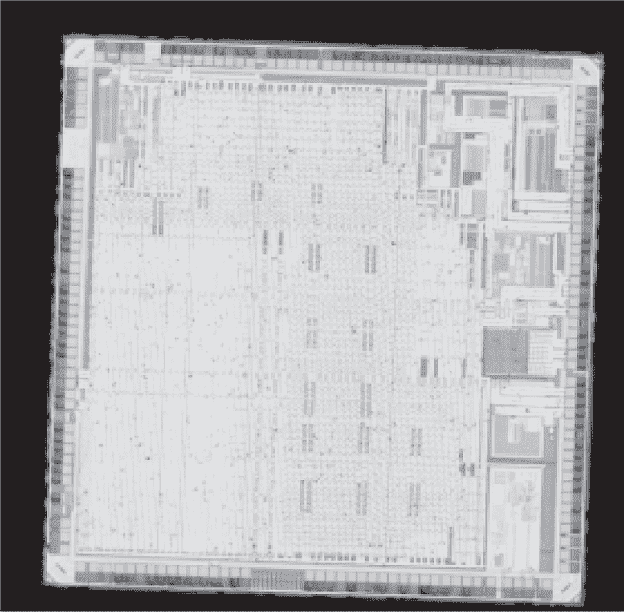

图 E.2：Nuvoton M2351

SAM L11 既可以作为裸片购买，也可以配备密钥和 Trustonic 的 Kinibi-M 商业可信执行环境库。这一变种被称为 SAM L11 KPH，用户只能写入和调试非安全世界的内容。Roth 从 Digikey 购买了一些，并对芯片进行故障攻击，直到 OpenOCD 报告成功读取，之后他可以读取 Knibi 进行逆向工程，甚至替换它以进行供应链攻击。

Roth 的第二个目标是 Nuvoton M2351。与 SAM L11 不同，这款芯片包含了 SAU 和固定的 IDAU。其市场营销明确宣传防止电压故障攻击的防护。

他最初认为对这款芯片进行故障攻击会很简单，因为 SAU 或 IDAU 中更安全的设置将会覆盖另一个。不幸的是，针对他的攻击，这款芯片使用了一条特殊指令，`blxns` 或 `bxns`，用于从安全世界跳转（并链接）到非安全世界。

目标地址的最后一位也会被这些指令检查。安全代码指针是奇数，在旧的芯片中，这意味着使用 Thumb 指令集。当安全世界希望调用非安全世界时，必须首先清除指针的一位，以使其与这些指令兼容。

因此，最小的攻击方式可能是首先故障攻击设置 `SAU->CTRL=1` 的指令，然后故障攻击在 `blxns` 之前清除位，以便使正常世界的代码在安全世界的上下文中运行。这是可行的，但要做到稳定非常困难。

Roth 针对该芯片的更好攻击叫做 CrowRBAR。其思路是 IDAU 将每个区域映射两次，第一次映射为安全区域，第二次在不同的位置映射为非安全区域。位 28 区分镜像，安全映射时该位为 1，非安全映射时该位为 0。SAU 的`RBAR`寄存器描述非安全区域的起始位置，如果该值为零，整个区域都将是非安全的。

故障攻击`RBAR`寄存器的写入大约需要三十秒，暴露整个区域到非安全世界！Roth 无法在这种状态下读取 SAU 寄存器，无法准确知道故障的具体影响，但他能够读取整个闪存中的代码，暴露给非安全世界。

Roth 还考虑了 NXP 的 LPC55S69，其布局与 M2351 非常相似。与 M2351 相比，这个目标的复杂性在于`MISC_CTRL_REG`寄存器的`ENABLE_SECURE_CHECKING`字段，该字段检查归属单元的安全状态是否与内存保护检查器（MPC）的状态匹配。这也可以通过故障攻击来绕过，但需要多个故障。

尽管 Roth 主要关注的是提升这些芯片中到安全世界的特权升级，Results（2020b）描述了针对 M2351 的 ROM 库（MKROM）中密码学函数的三种攻击。这些攻击依赖于这样一个事实，即非安全代码可以在调用 ROM 之前暴露一个 GPIO 引脚的时序，因此故障攻击者能非常准确地预测时序，且漂移非常小。

第一个攻击通过跳过`XAES_SetKey()`将 AES 密钥设置为零，将时序提前 2.5 微秒。第二个攻击通过将`XAES_SetDMATransfer()`的输出值设为零来制造故障。

你经常会听到说 AES128 或其他算法在跳过某些轮次时容易受到密码分析攻击，而在我年轻的时候，我曾经好奇这种情况到底有什么用。Limited Results 的第三个攻击方法通过故障跳过最后一轮 AES。将两个故障的密文输入到 Philippe Teuwen 的 PhoenixAES 工具中进行差分故障分析，可以揭示出*K*[10]，从中可以提取出整个密钥调度，包括原始的 AES 密钥*K*[00]。

### **E.3 68HC705 和 6805**

摩托罗拉的 68HC705 是一款早期的 6800 微控制器，内置 EEPROM，通过一个选项位保护防止读取，但可以通过故障攻击绕过该保护。6805 与之相关，但它具有一个可以拍照的掩模 ROM，以及一个可以电气方式转储的测试模式。

Pemberton（2022）是一款基于 Arduino Mega2560 和 Altera MAX7000S CPLD 的定制故障攻击工具，后者因其方便与老旧微控制器配合使用的 5V I/O 引脚而被选择。他的 CPLD 在故障攻击目标供电电压和 2 MHz 时钟时提供 32 MHz（31.25 ns）分辨率。

电源故障通过一个或四个 2N7000 FETs 施加，并且 5V 轨的供电电流通过一个 10Ω至 220Ω的电阻限制。

彭伯顿使用了摩托罗拉（1995）作为启动 ROM 源代码的便捷来源，但他承认他并没有选择目标指令，而是通过强行尝试时序来完成。他描述了一种巧妙的技巧，在将芯片从复位状态中拉出之前，使看门狗定时器过期。这样，看门狗中断就不会干扰周期计数的规律性。

对于 68HC705 带 EEPROM 的版本和带掩膜 ROM 的旧款 MC6805 芯片，都有一个未公开的测试模式来转储内存。瑞德尔（2016）主要是通过摄影提取 ROM，但也包含了这个电气提取的描述：

我通过非用户模式（NUM）引脚成功地电子方式转储了 ROM。我在 EXTAL 引脚上使用了 1 MHz 的时钟，XTAL 接地，!RST、!INT 和 TIMER 引脚接高电平，NUM 接+5V。我将 Port A 引脚通过八个 1K 电阻接到+5V 和地，将其设置为`0x9D`，即`nop`的操作码，并将 Port C.3 接高电平。ROM 的内容通过 Port B 输出，我使用逻辑分析仪捕获了这些字节。

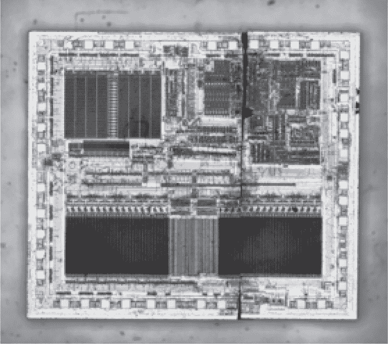

图 E.3：68HC705C8A

瑞德尔的页面描述了当 MC68705P5 没有被加密时，基于 EEPROM 的电气转储，这个过程与上面相同，只是 Port C.0 通过 1K 电阻拉到七伏。MC68705P3 和 ST 微电子的 EF6805U3 是相同的，只是它们不支持防止电气转储的加密。他提到，转储通常从复位向量的目标地址开始，而不是从地址零开始。

请不要将他的方法与自检模式混淆，自检模式用于转储内存的校验和，而不是其内容。它位于 MC6805P2 ROM 的`0x784`处，通过将九伏电压加到 TIMER 引脚来激活，从而将中断向量表向上偏移八个字节。连接到 Port C 的 LED 在校验和失败时会闪烁。

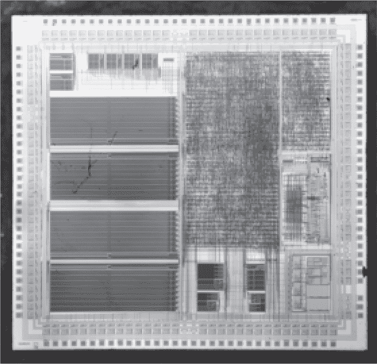

图 E.4：Game Boy Color CPU

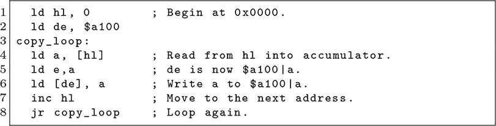

图 E.5：来自 Sideris（2009a）的 Game Boy Color Shellcode

### **E.4 超级 Game Boy 与 GB Color**

虽然 Game Boy（DMG）的 ROM 可以通过摄影读取，就像我们在第二十三章中看到的那样，超级 Game Boy 和 Game Boy Color 的 ROM 则有一些位无法从表面直接看到。或许通过 Dash 蚀刻可以暴露这些位，但电压故障使得这一切变得不再必要。

在 Sideris（2009a）和 Sideris（2009b）中描述的技巧是对 ROM 的最后一条指令进行电压故障，从而禁用 ROM 访问，直到下次重启。通过跳过这条指令，已编程的闪存卡带可以自由地从内存中读取代码，转储 ROM 内容。

Sideris 通过让 FPGA 替代 CPU 的时钟和卡带来制造故障。它以正常速率计数时钟周期，直到执行`0x00FE`处的锁定指令，然后停止时钟并切断电源几秒钟，以清除芯片的一些状态。希望内部 ROM 不会被禁用，并且 CPU 将在稍后的地址处恢复运行，地址位于卡带内存中某个位置。

在故障成功后，卡带 ROM 会执行一长串 nop 指令，进入图 E.5 中的 shellcode。该 shellcode 会读取所有内存，并在每次读取到内存中的字节`x`时，将其写入`0xA100|x`。这些写入会被静默忽略，但由 FPGA 生成的访问日志会按顺序记录控制台内存中的每个字节。

Super Game Boy 将其 ROM 从`0x0000`映射到`0x00FF`，与 Game Boy 一样。Game Boy Color 有一个 3kB 的 ROM，该 ROM 被映射到这个区域，并且还映射到`0x0200`到`0x08FF`的范围，这与卡带 ROM 重叠，但为卡带 ROM 头部留出了一个从`0x0100`到`0x01FF`的空隙。shellcode 必须从这个空隙中运行，或者在`0x0900`之后运行。

### **E.5 STM32F2 Chip.Fail 与 Kraken**

Roth、Datko 和 Nedospasov（2019）描述了 STM32F2 引导 ROM 的故障，利用该故障可以从 RDP Level 2（完全保护）降级到 Level 1，在 Level 1 下闪存被保护但 SRAM 没有被保护。通过扩展此故障并进行第二次故障，Uncredited（2020）展示了从一个完全锁定的芯片中提取固件。

其他细节中，Roth 指出，最好是与复位引脚的上升沿计时，而不是电源的接通。用于电源分析的旁路电阻显示，包含保护模式的选项字节作为第一个可见的电源尖峰。^(2)

使用 FPGA 和 MAX4619 模拟开关，他们成功地将 STM32F2 故障降级至 RDP Level 1，延迟为 17,900 个周期，并在 100MHz 时产生 50 个周期的脉冲。RDP Level 1 不暴露闪存，但早期版本的 Trezor 加密货币钱包将密钥材料转移到 SRAM 中，从而可以通过精确计时提取出来。Grand（2022）描述了如何利用这一攻击方法对旧版加密货币钱包进行攻击，以记录本来丢失的内容，因为这些设备在保险箱中被遗忘，更新没有部署到这些设备上。

像第 D.3 章中的 RDP 降级一样，这种故障也可以用于后续提取需要 RDP Level 1 的 STM32 漏洞内存，例如第二章中的漏洞。

Uncredited（2020）首先重现了 Roth、Datko 和 Nedospasov（2019）的 RDP 降级故障。像 Roth 一样，他未能找到使芯片完全降级到 Level 0 的故障，他的兴趣在于提取仅存储在闪存中并未复制到 SRAM 中的秘密。为了实现这一目标，他开始了一些观察。

首先，他指出，在复位后大约 170 µs 进行故障攻击将启用 STM32F205 的 JTAG 和 SWD。复位后 180 µs 进行故障攻击将重新启用引导程序 ROM。JTAG/SWD 和 ROM 的行为就像处于 RDP Level 1 中一样，但有一个关键区别：当访问尝试发生时，JTAG 和 SWD 会在硬件中禁用对闪存的访问，而引导程序则通过命令处理程序内执行的软件检查来禁止访问。

这意味着，您可以通过在启动时首先进行故障攻击，将芯片降至 RDP Level 1，开始引导程序会话，然后在执行读取内存命令处理程序时进行第二次故障攻击，从而转储被锁定芯片的闪存。

### **E.6 STM8 引导程序和 SWIM**

STM8 系列 8 位微控制器广泛应用于汽车防盗系统和其他有用的目标中。芯片的锁保护形式为代码读取保护（CRP）位，由引导程序进行检查。

还有一个掉电重置（BOR）功能，当电压低于阈值时，它会重置芯片。BOR 并不完全是一个故障防御机制，但它可能要求任何故障攻击都必须非常短且精确，以避免不必要的重置。

Herrewegen 等（2020）在第四部分中描述了一种针对 STM8L152 和 STM8AF6266 的双重故障攻击。第一次故障攻击使对 `0x8000` 的读取出错，使引导程序误以为芯片是空的，从而启动引导程序而不是应用程序。第二次故障攻击使对 `0x4800` 的读取出错，使芯片误以为 CRP 没有启用。

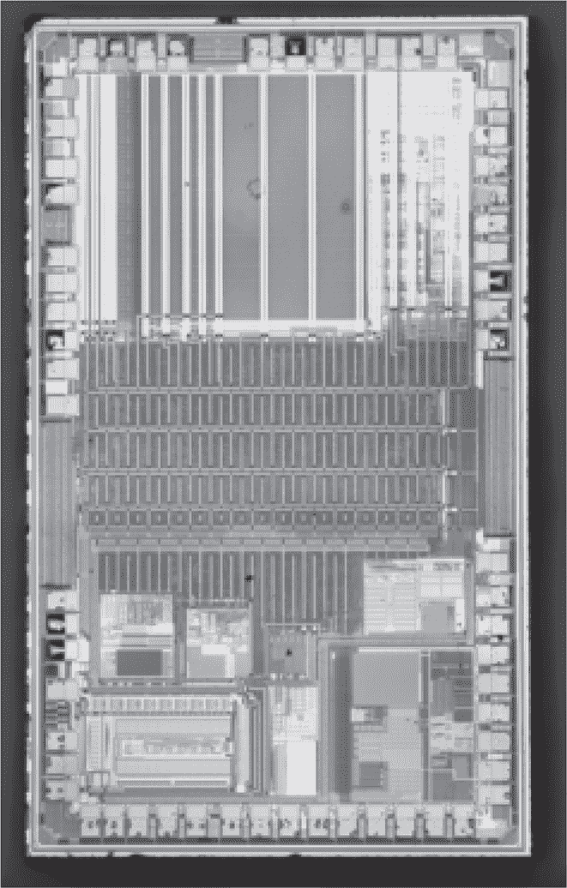

图 E.6：STM8L152

对这两个目标进行故障攻击很困难，因为没有反馈机制让你知道是否有一次故障攻击的时机正确，直到两次都成功故障攻击。在被锁定的芯片中，无法区分一次差点成功的故障与一次完全失败的故障。为了解决这个问题，他们修补了引导程序，使其从闪存运行，从而允许在转向复杂的双重故障攻击之前进行部分反馈实验。

比引导程序更容易故障攻击的目标是 SWIM 调试接口，这是 STM8 的 JTAG 等效接口。在 Fritsch（2020）中，STM8S103 在复位后通过一次故障攻击成功进入了未受保护的 SWIM 会话。Rainier（2022）最近也成功复制了这一结果，仅使用了一对高速 LMC555 定时器！两者都报告了通过用非常短的脉冲将 VCAP 引脚接地进行故障攻击时的成功。

### **E.7 STM32F1/F3 故障形状调整**

Bozzato、Focardi 和 Palmarini（2019）报告了针对 STM32 的两次故障攻击，在这些攻击中，作者使用信号发生器来控制每个电压故障的形状。

针对 STM32F1 系列，他们报告了通过故障注入“读取内存”命令，绕过引导加载程序的读取保护检查。成功时，这个故障的检查会返回`ACK`和一块内存。如果不成功，则会迅速返回`NAK`并且没有内存，但对未来的攻击没有任何惩罚。

对于 STM32F3，他们在复位时执行一个故障操作，将 RDP Level 2 降级到 RDP Level 1，在 Level 2 下不允许使用引导加载程序或 JTAG 连接，而在 Level 1 下则可以有限地使用引导加载程序和 JTAG 访问，芯片也因此容易受到其他攻击。他们注意到故障时序的复杂性，因为启动过程需要一些时间，而目标的时钟会偏离故障发生器的时钟。

但为什么他们选择将故障注入降级到 Level 1，而不是直接降到 Level 0 呢？原因在于，Level 2 在保护配置字中定义为`0xCC33`，而 Level 0 则是`0xAA55`，因此将这些值损坏为*任何其他值*都会导致降级到 Level 1。基于这个原因，将故障注入降到 Level 0 比简单降到 Level 1 要困难得多。

其他 STM32 的故障注入攻击遵循类似的模式。例如，Uncredited（2020）在 Chapter E.5 中执行的读取操作，通过在运行时故障注入保护级别检查，而不是在启动时进行。

### **E.8 MSP430F5172 每字故障注入**

MSP430F5 系列的串行引导加载程序（BSL）需要一个固件的中断向量表（IVT）形式的密码，才能使读取命令生效。一般而言，如果你知道中断表的内容，那你就已经拥有了固件的副本，因此芯片无需进行防御。

故障注入很让人沮丧，因为存储密码比对成功的位会对每个通过 TX 数据块命令读取的字节进行检查，但 Bozzato、Focardi 和 Palmarini（2019）记录了一个成功的攻击案例，该攻击可以转储单个字节。这个攻击一旦校准完成，速度非常快，几乎是每分钟两千字节。

作者们还将此攻击实施到了铁电 RAM（FRAM）设备 MSP430FR5725 上。FRAM 是闪存的潜在替代品，但由于在最低级别时位错误频繁出现，因此它包括一个 ECC 机制来修正预期的位错误，从而使不可靠的内存看起来非常可靠。他们指出，这种错误修正使得攻击变得更加缓慢，大约每六分钟才能读取一千字节。

### **E.9 CC2640 CC2652 电子熔丝**

Wouters、Gielichs 和 Preneel（2022）描述了对德州仪器 SimpleLink 系列中 CC2640R2F 和 CC2652R1F 2.4GHz 无线微控制器的故障注入攻击。他们的商业目标是特斯拉 Model 3 的钥匙扣，后者使用了 CC2640。

通过反向工程启动加载程序 ROM 的转储，他们识别出了两个有效的故障目标，分别是从客户配置（CCFG）和工厂配置（FCFG）eFuse 页面提取的设置。为了便于实验，他们构建了一个不依赖硬件的 ROM 仿真器。

他们首先通过在一个人工目标程序中故障一个紧凑的循环，表征了触发故障但不崩溃的故障宽度，从而让他们可以暂时搁置故障偏移的问题。CC2640R2F（Cortex M3）在 100 纳秒时最易发生故障，而 CC2652R1F（Cortex M4）则在较长的 610 纳秒时最易发生故障。他们将这种差异归因于微架构的不同。

#### **客户配置（CCFG）**

第一个故障目标是客户配置（CCFG）eFuse 解析，其中 ROM 读取`CCFG:CCFG_TAP_DAP_x`寄存器以了解哪些 JTAG 功能将被启用。通过对具有有效固件和无效固件的芯片之间功耗差异的侧信道分析，估算了 ROM 解析 CCFG 位的“最后时刻”。潜在的故障目标时间是从该偏移量反向探索的。

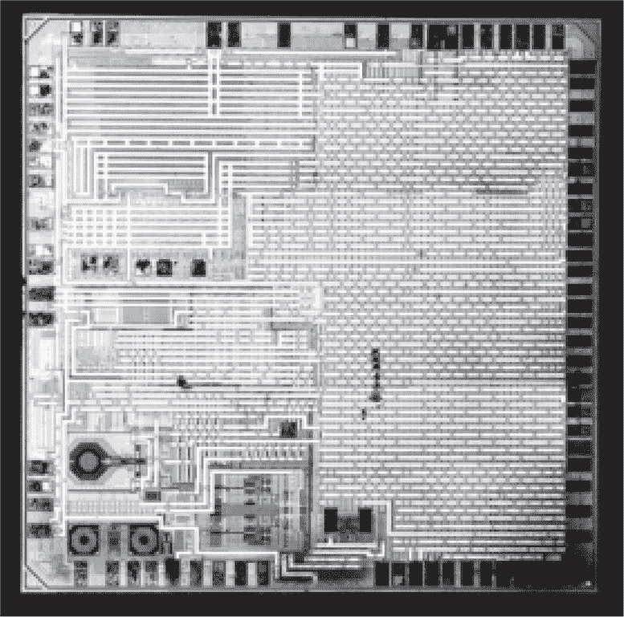

图 E.7：德州仪器 CC2640

在这里他们遇到了一些困难：每次故障尝试可能会启用 JTAG，但 JTAG 速度较慢，他们只能每 2.5 秒尝试一次故障！为了加速，他们编写了一个小程序，将`JTAGCFG`寄存器的状态输出到 UART。这使得可以在没有等待 JTAG 连接的情况下，以每秒十次的速度对测试芯片进行故障时序尝试。经过表征后，从测试芯片得出的故障偏移可以用于真实目标芯片。

在 200 MHz ChipWhisperer 周期中，经过复位后的故障偏移，成功的 CCFG 故障以启用 JTAG 的偏移量在 CC2640R2F 之间为 188,300 到 188,4000 周期，成功率为 5%。CC2652R1F 在复位后的 161,700 到 162,000 周期之间发生故障，成功率为 1%。

#### **工厂测试模式（FCFG）**

到这时，两个芯片的成功故障已经确认，但它们比较慢。一个更好的目标出现了，它是一个未记录的工厂测试模式，在启动过程的早期触发，由工厂配置（FCFG）eFuse 引发。

如果你记得故障 CCFG 的原理限制是检测到开放的 JTAG 连接，那么你可能会希望找到其他信号来确认故障是否成功。最理想的信号就是 GPIO 引脚，这正是通过反向工程 ROM 中的早期检查发现的。

检查 GPIO 引脚状态允许每秒进行一百次尝试，比 UART 指示的速度快十倍。因为指示的代码存在于 ROM 中，它不仅适用于实践尝试，还能在面对未知固件的真实目标时正常工作！

成功的故障攻击会将 GPIO 引脚 23 置高。CC2640R2F 在重置后的 161,100 到 161,200 次时钟周期之间进入这个状态，故障宽度为 115ns，成功率为 10%。这一过程不到一秒钟！CC2652R1F 则在 129,700 到 129,900 时钟周期之间发生故障，但与之前 610ns 的故障宽度相比并没有改善。其成功率为 0.1%，使得他们能够在不到几秒钟的时间内启用所有调试功能。

### **E.10 LC87 通过 USB 解开循环**

本书中我最喜欢的资料来源之一是 Scott（2016）。她描述了针对 Wacom CTE-450 平板中 Sanyo/ONsemi LC871W32 微控制器的 USB `GET_DESCRIPTOR` 请求的故障攻击。她的文章非常有趣，最后成功使用平板的扫描线和纯软件的内存损坏漏洞读取了一个 125 kHz 的 RFID 标签。对于本书的目的，我将重点讨论她最初通过故障攻击其 USB 处理程序提取设备掩模 ROM 的过程。

LC87 是一款 8 位微控制器，销售量非常大，并且不支持业余爱好者或低容量使用。对于这些手写板，Wacom 最初使用了该芯片的闪存变种，后来改用了掩模 ROM 变种。

当她第一次接触到这款平板时，LC87 的调试端口拒绝了所有连接，而且没有串行启动加载程序，因此 USB 成为了她进行内存损坏攻击的最佳选择。

当时，关于 USB 故障攻击的公开资料非常少，因此她设计了 FaceWhisperer，这是 Colin O’Flynn 的 Chipwhisperer 的一个扩展。^(4) 像我的 Facedancer 板一样，她使用了 Maxim MAX3241E USB 控制器，但她还提供了一个 12MHz 的时钟输出和一个带可调电压阈值的故障触发输入。

虽然在 USB 中定时故障比在 UART 启动加载程序中更难，但确实存在所有 USB 设备都实现的通用命令。她并没有针对 Wacom 协议中的独特部分，而是针对所有 USB 设备都实现的通用 `GET_DESCRIPTOR` 处理程序。它返回一个定义设备提供的接口和端点的结构体。虽然这个结构体可以动态生成，但许多设备只是将其静态副本存储在代码内存中，并在请求时返回。

在平板的情况下，USB 配置描述符长度为 34 字节，并且在一个数据包中返回。一次成功的交易看起来大概是这样的。

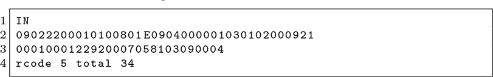

当时机恰到好处时，故障可以破坏传输的长度，导致更多字节被返回。这个例子显示了 268 字节，其中 234 字节位于 真实描述符的 34 字节之后。经过几次类似时机的故障后，她最终碰巧成功获取了一个 65,534 字节的交易，其中包括了所有 32kB 的掩模 ROM！

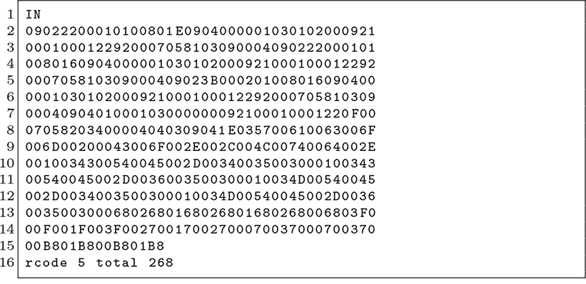

在提取 ROM 后，她进行了逆向工程，找到了一个未文档化的后门，一个人机接口设备（HID）请求，可以将 16 个字节写入任意地址的 SRAM 中。虽然在该平台上 RAM 不可执行，但这足以让她加载并执行 ROP 链，从而实现任意行为。

通过一点模拟魔法和大量经验，她能够以正确的方式脉冲平板的感应线，既为 EM4100 RFID 标签供电又进行读取。这个目标虽然很奇怪，但考虑到她的最终目标没有进行任何硬件修改，实在令人印象深刻。

### **E.11 78K0 故障校验和**

Renesas 78K0 的第一次故障利用在 Bozzato、Focardi 和 Palmarini（2019）中有所描述。他们的利用方式是通过故障 Checksum 和 Verify 命令，使其操作在四个字节上，而不是最小的 256 字节。

后来的攻击在 Herrewegen 等人（2020）中进行了，利用了从逆向工程的 ROM 中获得的知识，以提供更精确的时序，泄露了单个字节。因为每次读取字节时必须绕过完整性检查，所以成功的提取大约需要十个小时，前提是设备已经过校准。

最著名的攻击在 Wouters 等人（2020）中有详细描述，主要是关于现代汽车的德州仪器 DST80 防盗系统。他们没有尝试从防盗芯片中提取固件，而是对丰田 ECU 中的 Renesas 78K0/KC2 芯片进行了故障攻击。^(5)而不是尝试故障 Checksum 或 Read 命令，Wouters 故障了 Set Security 命令。此命令包括一个安全检查，以确保新的安全状态不低于旧的安全状态，绕过此检查可以通过一次成功的故障解锁芯片。

故障参数可以在他们的论文第 105 页中找到，其中一个 16 MHz 目标的安全设置命令从 2.7V 被故障至 0V，宽度为 100 纳秒，偏移量为 596.78 微秒或 818.05 微秒，发生在安全设置消息的第一个位之后。他们认为时序差异来自于保护选择，因为他们的一个目标启用了比另一个更多的保护。

### **E.12 RX65 引导加载程序故障**

Renesas RX65 芯片允许为内存范围设置读取保护，并通过安装 ID 码来实现。范围限制用于防止读取引导加载程序 ROM，而 ID 码则是保护闪存读取的密码。

Julien（2021）描述了一种针对 Renesas RX65N 的电压故障攻击，首先通过逆向工程未文档化的 FINE 协议，该协议包装了文档化的串行通信接口（SCI）协议命令。然后，他移除了目标的去耦电容，并通过 VCL 引脚上的晶体管产生故障，暴露了内部核心电压。他的故障脉冲由一个运行在 180MHz 的 Nucleo-F429L 板产生，源脉冲的宽度不到 100 纳秒。

尽管他最初的故障攻击是在没有获得引导加载程序 ROM 转储的情况下进行的，但该故障使他能够转储内存中的保留区域。大多数区域返回全零，但最终在 `0xfe7f-9000` 到 `0xfe7fffff` 的范围内找到了引导加载程序 ROM。这个范围有点奇怪，因为它位于一个整数的下面，而不是从整数开始。

### **E.13 GPLB52X Tamagotchi**

许多 Tamagotchi 玩具使用 GPLB52X，这是 General Plus 的一款 LCD 控制器，配有 6502 微处理器和定制掩码 ROM 的应用程序。我们将在这里讨论三种获取远程代码执行并进行固件转储的方法，其中一种技术似乎可以移植到其他具有攻击者控制的 SRAM 缓冲区的 6502 机器上。

Silvanovich (2013a) 描述了一个可靠的软件漏洞利用，针对 Tamatown Tama-Go 玩具中 `switch` 语句未处理的情况，shellcode 被作为艺术作品加载到 LCD 帧缓冲区中。这个 exploit 非常巧妙，因为她不得不在没有已经获得掩码 ROM 转储的情况下盲目编写它进行逆向工程。

从 第 343 页 的芯片照片开始，她通过查阅 General Plus 的连线文档，直到文档中的焊盘与玩具芯片上的焊盘匹配。这告诉她芯片的型号，并允许她编写 shellcode，但她仍然需要一种方法来执行她的 shellcode。

图 E.8: 通用 Plus GPLB52X

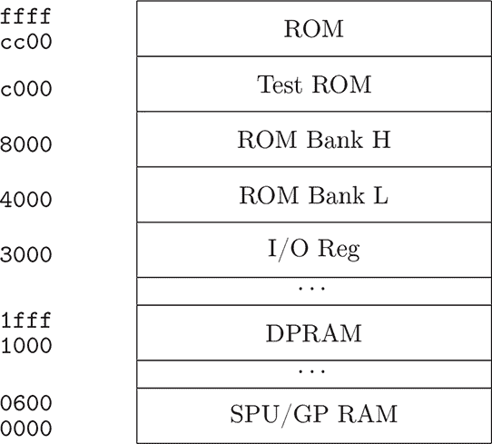

图 E.9: 简化版 GPLB52X 内存映射

执行 shellcode 是一项复杂的任务，因为攻击者只能控制外部 EEPROM 内存。这个外部内存不可直接执行，因此需要等待设备读取外部 EEPROM，然后将其部分数据复制到内部 SRAM 中，后者是可执行的。幸运的是，玩具在外部 EEPROM 中保存了精灵图形，这些图形通过内存映射的帧缓冲区显示在玩具的 LCD 屏幕上。

所以她将带有长 nop sled 的 shellcode 放入 LCD 缓冲区，作为来自外部 EEPROM 的插件图形，然后对 EEPROM 中所有可用的配置字节进行模糊测试，直到 shellcode 运行并转储内部 ROM。获取 ROM 后，她逆向工程，发现 `switch()` 语句中的解析器漏洞，并编写了一个干净的 exploit，可靠地触发相同的代码执行，且副作用最小。

后来发布的 Tamagotchi Friends 玩具没有支持内存芯片配件或红外通信，但支持一个小型 EEPROM 用于持久数据存储，并支持 NFC 外设。Silvanovich (2014) 描述了一次成功的故障攻击，她成功地将执行重定向到她的 54 字节 shellcode，这段代码从 EEPROM 作为数据复制到 LCD 帧缓冲区。

与本书中许多其他故障攻击尝试跳过特定指令不同，她更倾向于将目标故障得足够严重，以至于程序计数器被破坏。6502 CPU 没有非法指令，并且未使用的大部分内存读取为`0x00`，在调试器附加时是`brk`指令，但在其他情况下是`nop`，形成了一个 nop 滑槽，基本上将其引导到她的 shellcode，如图 E.10 所示。

YKT（2023）中还有一个关于 Mitsubishi M37409M2 的 6502 核心的掉电故障的例子，该例子将从 SRAM 缓冲区运行 shellcode。像 Natalie 的攻击一样，这也使用了具有长 nop 滑槽的 shellcode，并依赖于长时间电源故障随机化程序计数器，而不是尝试故障单个指令。

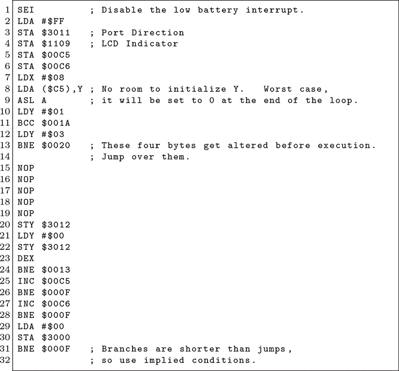

图 E.10：GPLB52X（6502）Tamagotchi Friends 的 Shellcode

YKT 描述了这样的攻击：

通过电压故障转储了 SC-55mkII 的次级 MCU（Mitsubishi M37409M2）固件。向其 RAM 注入了特洛伊木马，并使用故障来破坏 PC 计数器以执行它成功。

禁用芯片的电源将导致 PC 寄存器损坏为随机值。由于这是一个非常简单的 8 位 MCU，内存占用非常小——仅 8KB——因此非常有可能将 PC 指向 RAM 地址，并在多次重试后执行它。

Silvanovich（2013b）描述了一个测试程序，驻留在 GPLB52X 系列的 ROM 中的`0xC000`位置。Natalie 在与 Tamagotchi 一起转储时，它就位于应用程序开始之前的`0xCC00`位置。查看图 E.9 获取内存映射和表 E.1 获取测试程序列表。测试模式由芯片的测试引脚启动，然后通过端口 A 采样程序号。她对程序`03`和`14`特别感兴趣。

程序`03`是一个 ROM 校验和例程。默认情况下，当端口 B 未设置时，校验和覆盖整个 ROM。设置端口 B 允许钟区域被时钟输入，但遗憾的是，对于转储单个字节来说，这不是可利用的。范围必须至少为 255，并且 ROM 中的一个错误在事务后将端口 B 保留在输入模式，因此在选择了有限范围时，无法读取校验和。

|  `00`  | 睡眠模式？ |
| --- | --- |
| `01` | RAM 测试 |
| `02` | 压力测试 |
| `03` | ROM 校验和 |
| `04` | LCD 测试 |
| `05` | 未知 |
| `06` | 端口压力测试 |
| `07` | 定时器中断测试 |
| `08` | 另一个 LCD 测试 |
| `09` | 未知 |
| `0A` | 未知 |
| `0B` | 类似于`09` |
| `0C` | 类似于`00` |
| `0D` | 类似于`04` |
| `0E` | 未知 |
| `0F` | SPI 测试 |
| `10` | 未知 |
| `11` | LCD 测试 |
| `12` | 类似于`16` |
| `13` | ROM 校验和 |
| `14` | **代码执行！** |
| `15` | 中断测试？ |
| `16` | 跳转到`0x0200`的 RAM |
| `17` | 设置`0x300b`和`0x300c` |

表 E.1：来自 Silvanovich（2013b）的 GPLB52X 测试代码

程序`14`更为有用。它通过端口 B.7 接收程序的各个比特，每次一个比特，同时端口 2 和 4 上的比特信号表示下一个比特是否已准备好。该程序从`0x0200`加载到`0x05ff`，然后在加载完最后一个比特后直接执行。图 E.11 列出了该程序处理程序。

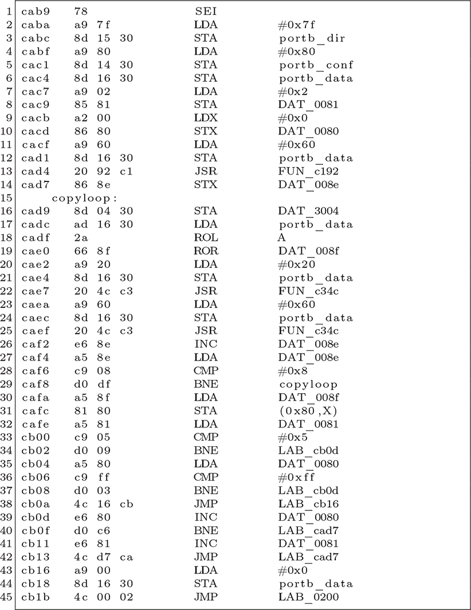

图 E.11：GeneralPlus 测试程序`14`

### **E.14 MC9S12 复位故障**

像 Freescale 的 MC9S12 芯片这样的 HCS12 芯片在汽车 ECU 中非常流行。它们经常被汽车芯片调优行业破解，用于调整燃油喷射发动机的空燃比。

Stephen Chavez 和 Specter 在 Chavez 和 Specter（2017）中提供了一些破解提示，从私人通信中我确认他们通过给复位线施加一个非常短的脉冲将其拉高，从而混淆 HCS12 复位状态机，成功转储了芯片。

VVDI Prog 是一款商业芯片编程器，其特殊功能是内置对多种汽车微控制器进行内存提取攻击的支持，用于性能调优或密钥复制。从版本 4.9.5 开始，它宣传针对 MC68HC(9)08、MC68HC(9)12 和 MC9S12 系列的一些成员进行攻击。

### **E.15 Nvidia Tegra X2**

虽然 Tegra X1 在 Nintendo Switch 中的应用广为人知，但 X2 则出现在更昂贵的设备中，如自动驾驶单元和现代汽车中的信息娱乐系统。关于 X2 的电压故障注入在 Bittner 等人（2021 年）的研究中有描述。

X2 的引导分为三个阶段：（1）iROM 从掩码 ROM 运行，解密并验证（2）Nvidia 的 MB1 引导程序的签名，从 eMMC 加载，接着运行（3）OEM 的 MB2 引导程序从 eMMC 加载。MB1 是加密的，其签名密钥由 Nvidia 严格保护，但 MB2 可以通过开发工具包自由修改。

Bittner 的第一个挑战是编写一个 MB2 镜像，用于转储 iROM 以进行逆向工程。这得到了泄露的 X1 BootROM 源代码的帮助，该源代码周期性地在线出现，然后在一阵 DMCA 通知后消失。

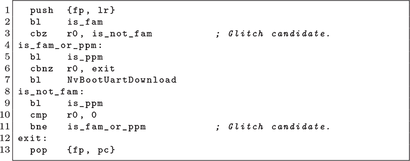

图 E.12：X2 UART 引导程序中的保险丝检查

逆向工程 iROM 揭示了该芯片支持“故障分析模式”，在该模式下，一个提示会被发送到 UART，然后代码通过该 UART 接收并执行。这个模式通过引导过程早期的保险丝检查来选择，因此保险丝检查是一个很好的故障注入目标。复位引脚可用作故障时序的触发信号，UART 提示的出现表示故障成功。

对于故障注入本身，Bittner 使用了 IRF8736 MOSFET 来故障 X2 的电压轨，通过 MAX4619 电平转换器控制 MOSFET，通过 FPGA 的 GPIO 引脚进行控制。故障的目标大致是图 E.12 中的代码，第 3 行或第 11 行是故障指令的良好候选。

通过 UART 引导加载程序执行代码后，他们加载了利用 X2 内部密钥解密 MB1 引导加载程序的 shellcode。

### **E.16 Zynq 7000 ROM 转储故障**

Xilinx 的 Zynq 系列将 ARM CPU 与 Xilinx 7 系列 FPGA 结合在一起。它们通常出现在实验室设备、比特币挖矿设备以及任何需要在单一包装中集成 Linux 机器和 FPGA 的地方。该芯片从外部存储器中的签名镜像启动，例如 SPI 闪存芯片或 SD 卡。

Zynq 引导 ROM 支持签名和加密的固件镜像，这使其成为软件漏洞攻击的主要目标，但在控制权交给应用程序之前，ROM 的访问是被禁用的。这使得即使从解锁的开发工具包中，也很难读取 ROM。

Schretlen (2021b)描述了一种故障注入技术，用于转储引导 ROM。它要求将 PLL_DISABLE 引脚固定，并且需要用 SOT23 FET 替换一些去耦电容。当通过触发目标的复位信号时，时序过于不可预测，而 SD 卡自身的时序也太嘈杂，无法用作启动触发器。

解决方案是在从 SD 卡返回 Zynq 的最后一个字节之后触发。作者指出，SPI 闪存引导方法可能更具确定性，但所需的引脚在现有的开发板上并没有被引出。

当没有其他选项时，使用故障注入提取 ROM 是一种不错的方法，这也是首次提取该 ROM 时使用的方法。在获取 ROM 并进行逆向工程后，一个常见的目标是找到一种软件漏洞，允许在不使用故障注入的情况下提取 ROM。有关这种漏洞的更多信息，请参见章节 A.10。

### **E.17 STM32 体偏压注入**

体偏压注入（BBI）攻击最早在 Maurine 等人（2012）中提出，作为一种通过局部提升微芯片背面电压来诱发故障的方法。这需要暴露芯片的背面，然后使用探针沿着背面探索任何特定攻击的最佳注入点。

尽管它比电压故障注入需要更多的设备和准备，但它有诱发*局部*故障的优势。这些故障仅限于芯片的某一区域，其他部分则能够正常工作。

O'Flynn (2020b)描述了针对 STM32-F415 的实际攻击，该芯片采用晶圆级芯片尺寸封装（WLCSP），自然暴露了芯片背面。回顾第十八章，WLCSP 通过将 BGA 焊球直接放置在芯片上，并将其焊接到电路板上，而无需任何塑料封装。这大大缩短了准备时间，因为不需要化学或机械地去除设备封装。

他使用了一种名为 ChipJabber BBI 的定制探头，位于 ChipWhisperer 的末端。每当 CW 故障触发时，两个电容器产生的低电压脉冲通过变压器发送到探头，进而将高电压脉冲输入到芯片背面的探头。电源由具有限流能力的实验台电源提供。请参见图 E.13。

O’Flynn 使用了一个三轴电动舞台和一个弹簧加载探头，扫描了 WLCSP 封装表面上的 256 个独特点。在这些封装中，表面层朝下，接触电路板，而背面则暴露在电路板之外供探头接触。某些封装的背面有一层薄而不透明的涂层，但可以用刀刮掉这层涂层。

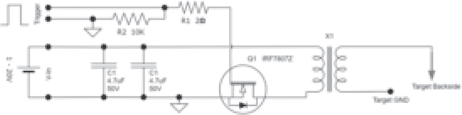

图 E.13: ChipJabber BBI 原理图

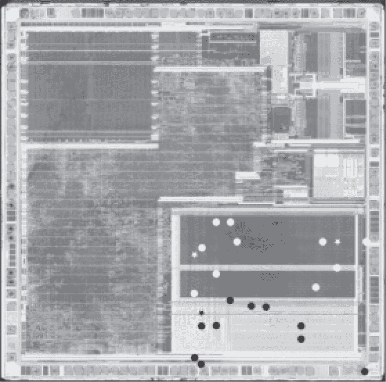

图 E.14: 来自 Balda (2021) 的 STM32F103 偏置点

该变压器是专门绕制的，使用商业磁性铁芯，初级绕组为 26 AWG 磁性线绕 6 圈，次级绕组为 30 AWS 线绕 60 圈。绕组数较少时，电感较低，这对于快速反应时间是必要的。更多的绕组会减慢斜率并延长脉冲持续时间。

在故障方面，他更感兴趣的是为研究体偏技术提供一个方便的目标，而不是破解任何特定设备的读取保护。他的示例包括用于表征的嵌套循环，经典的 RSA-CRT 故障攻击以及对硬件 AES 加速器故障的初步表征。

由于 O’Flynn 的优秀论文已将 STM32 设置为目标，但止步于未进行内存提取利用，因此提供了第二篇论文的机会。Balda（2021）提供了这一论文，复现了针对 STM32F103 微控制器的工作，旨在提取锁定的固件。

他的 STM32F103 是一个线焊 BGA 封装，其中芯片的正面朝上，背面朝下接触电路板。这比 WLCSP 封装不太方便，但幸运的是，BGA 封装的中心引脚并不需要用于引导程序。Balda 慢慢磨去 PCB、电焊墩和 BGA 封装的底部，以暴露芯片。与芯片接触的铜垫在磨掉部分后，用手术刀将其从芯片上剥离。

这款芯片只有一个 RDP 级别，正如我们在第十一章中看到的，Balda 选择通过引导程序攻击它，而不是通过 JTAG。每次读请求发送到引导程序时为`0x11 0xEE`，BBI 故障注入有机会绕过设备的 RDP 检查并允许读取继续进行。

Balda 指出，成功的 RDP 绕过故障注入发生在引导程序读命令的最后上升沿后 8.95 微秒。每次读取内存时都必须执行此故障，但 60% 的成功率保证了操作的快速进行。

绘制这些故障的成功位置生成了图 E.14，显示在这些电压下，有效的故障几乎都发生在闪存附近。没有任何故障针对 CPU，Balda 假设这是因为 ROM 启动加载器从闪存的 `FLASH_OBR` 寄存器读取，该寄存器保存了 RDP 状态的单个位。

在命令最后一个上升沿之后 3.5 µs 的故障产生了不同且不希望出现的效果，导致所有闪存被大规模擦除，并摧毁了可能被恢复的信息。像这样的效果说明了为什么必须小心校准故障，而不是采用“漫天撒网”的策略，并将设备无人看管地放在柜子里运行。

### **E.18 PCF7941 擦除**

NXP 有一系列实现为 RISC 微控制器的无线安全应答器。其中之一 PCF7941 已成功被干扰，用于编程替换车钥匙。

在旧金山的一家地下酒吧里，我听说这需要用酒精和干冰将芯片冷却几天，直到 FPGA 能够利用 2Link 调试协议进行解锁。听起来这个攻击使用了单次故障来一次性解锁整个芯片，但我不完全确定描述中的细节。

一些商业工具，如在章节 E.14 中提到的 VVDI Prog，支持 PCF7941\。它们通过有线连接干扰芯片，擦除它以便重新配对。这个故障仅用于允许擦除被锁定的芯片。这些工具似乎不会提取固件，因为它们的客户更关注为新车匹配钥匙。

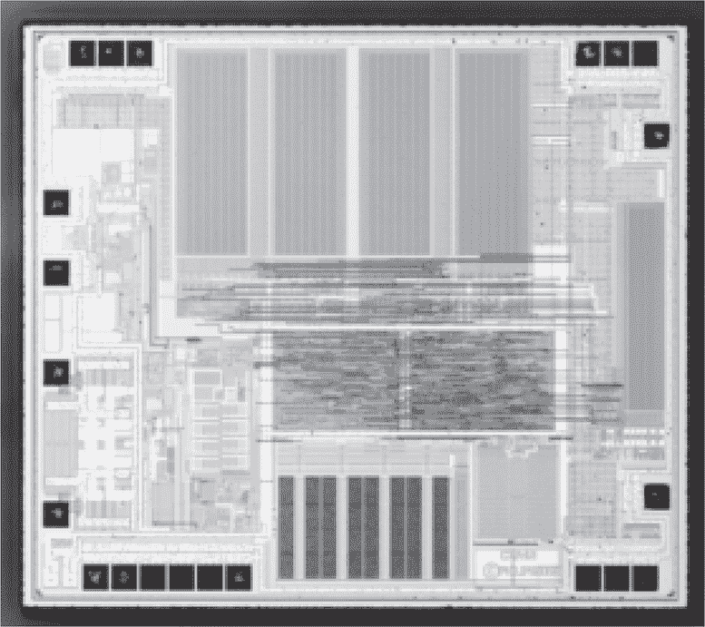

图 E.15：NXP PCF7941

### **E.19 没有欠压的 EFM32WG**

EFM32WG 是一款来自 Silicon Labs 的小型 ARM Cortex-M 芯片，主要用于智能电表和工业自动化领域。其使用寿命保证至 2026 年。尽管 CPU 本身可能容易受到故障干扰，但该芯片配备了有效的欠压检测（BOD）电路，可以在启动加载器出现故障时重置芯片，从而有效防止攻击。

结果（2021a）描述了使用电磁故障注入（EMFI）干扰芯片的 CPU 区域，允许读取受保护的固件而不引发欠压。这是因为常规的电压故障会在引入任何故障之前可靠地触发四个欠压检测器（BOD）之一，因此需要使用 EMFI 提供的局部故障注入。

EMFI 系统是一种名为 Der Injektor 的定制系统。尽管我在撰写时该设计尚未公开，但可能在你阅读时已经发布。

Transistor（2023）成功地在博世智能家居系统上复现了这些结果。虽然 Limited Results 构建了定制的 EMFI 工具，但 Vegan Transistor 更喜欢修改一款 Langer BS 06DB-s 脉冲发生器，该脉冲发生器原本用于电快速瞬变（EFT）脉冲测试。

为了确定故障注入的正确时机，分别在锁定状态和解锁状态下追踪电源。通过在去耦电容器附近使用磁场探头进行此操作，并对其进行放大，以补偿芯片的低功耗。故障目标窗口在重置后 150 微秒开始，持续 47 微秒。紧接着，第一条指令开始执行。

故障过强会触发重置，通过稍微回溯直到重置停止，可以识别正确的电源电平。最终，JTAG 解锁，标准的 Segger J-Flash 读取出 128KB 的固件。

### **E.20 MPC55 通过 EMFI**

O'Flynn（2020a）描述了针对 NXP MPC5676R 和 MPC5566 芯片的引导辅助模块（BAM）进行的电磁攻击，这些 PowerPC 设备在汽车 ECU 中非常常见。

从电气角度看，汽车级芯片唯一特殊的地方是它能够在更高的温度下运行。然而从安全角度来看，有一个完整的行业被称为*芯片调优*，它通过破解这些芯片来提升发动机性能。

值得注意的是，O'Flynn 并没有逆向工程 BAM ROM，因为实施他的攻击并不需要这样做。电源轨闪烁（Power rail glitching）也可能有效，但 EMFI 攻击允许在不将芯片从 2019 年雪佛兰 Silverado 的 ECU 板上移除的情况下进行攻击。无需拆卸去耦电容器或焊接晶体管来进行闪烁攻击。

类似的芯片如 STMicro 的 SPC57xx 和 SPC58xx 也有销售。这些芯片会在将代码缓冲到 SRAM 之后*进行*权限检查。这显著减慢了故障时序搜索，因为每次故障注入尝试都必须重复完整的传输。O'Flynn 尚未报告成功破解它们。
