## 第三十一章：**F 更多测试模式**

### **F.1 8051 外部存储器**

McCormac (1996) 和其他九十年代的资料描述了一个用于转储英特尔 8051 的漏洞。这个芯片有一个 !EA 引脚，它将外部存储器映射到启动区域。

该引脚通过仅在复位时采样而*未锁存*；你可以在软件运行时来回切换它！通过启动到外部 EEPROM，芯片的内存可以被转储，跳转从启动区域到 EEPROM 区域，然后重新启用 ROM 以将其作为数据读取。

一些 8051 衍生品，如 Signetics SCN8051H，仍然存在漏洞。其他芯片则在复位时锁存 !EA 引脚，以防止这种攻击。

Blair (2020) 是一个独立的 8051 芯片转储工具，适用于这个没有锁存引脚的芯片，包括一个 PCB 设计和一个 EEPROM 镜像来执行攻击。他的漏洞利用程序在目标 8051 内部运行，因此 PCB 不需要额外的微控制器。

### **F.2 TMS320C15，BSMT2000 !MP 引脚**

像许多八十年代的芯片一样，TMS320 系列可以作为微控制器从内部 ROM 执行代码，或作为微处理器从外部存储器执行代码。Surply (2015) 主要关注的是 Sega Whitestar 弹球机和可编程阵列逻辑（PAL）的逆向工程，但它包含了对 !MP 引脚的巧妙利用，该引脚在这两种模式之间切换。这是由 FPGA 协调的，提供一个小型存储器，填充了 shellcode，同时在微处理器和微控制器模式之间切换受害者芯片。

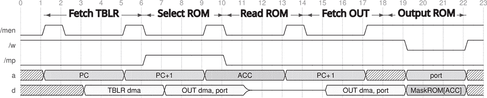

图 F.1：来自 Surply (2015) 的 TMS320C15 转储波形

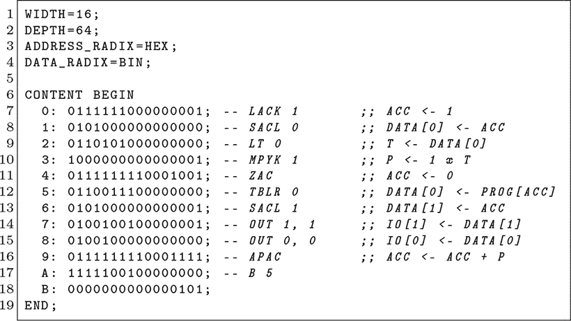

图 F.2：来自 Surply (2015) 的外部 Shellcode

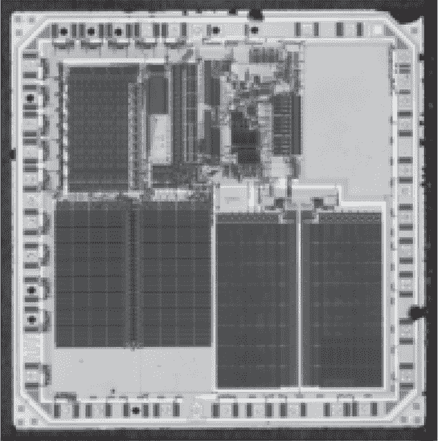

图 F.3：BSMT2000 / TMS320C15

!MP 引脚在复位时没有被锁存，因此你可以在指令执行过程中自由改变它，从而使指令从外部存储器中获取，同时第一个数据参数从内部存储器中获取。

一旦你知道 !MP 引脚没有被锁存，就可以通过切换该引脚并让 FPGA 模拟外部存储器来利用这一点。切换会导致芯片停止执行内部 ROM，并切换到执行 FPGA 的存储器。该引脚可以保持低电平以从外部存储器获取大部分指令，只有在短暂地从内部 ROM 获取指令时才会跳高。

他在 图 F.2 中的 shellcode 相当简单。初始化变量后，一个在地址 5 的无限 `while()` 循环不断将累加器的值和累加器地址的程序内存值转储到前两个 I/O 端口。代码中没有切换内部和外部存储器的逻辑；这一逻辑由 FPGA 处理，它将这些存储器提供给 TMS320。

Surply 在图 Figure F.1 中的时序图显示，!MP 引脚应该在从地址 5 读取`TBLR 0`指令后跳高。该引脚在从地址 6 读取下一个指令之前掉低。他指出，这个时序非常紧凑，任何违反它的行为都会导致漏洞失败。

### **F.3 6500/1 十伏**

在 Commodore 收购 MOS Technology 以获得其 6502 技术后不久，他们发布了 6500/1 芯片，这是 6502 的掩模编程变种。6500/1 包含 2KB 的 ROM、64 字节的 RAM 和一些便捷的外设。它还具有测试模式，Brain（2014）中提供了该模式的利用方式。

查阅数据手册，Commodore（1986）将测试模式描述如下：

特殊测试逻辑提供了一种彻底测试 6500/1 的方法。将+10V 信号施加到!RES 线，可以将 6500/1 置于测试模式。在此模式下，所有内存读取操作都从 PC 端口进行。外部测试设备可以利用此功能测试内部 CPU 逻辑和 I/O。程序可以加载到 RAM 中，允许指令 ROM 的内容转储到任何端口，以便进行外部验证。

Brain 的源代码包含了两个用于转储 ROM 的漏洞。他的第一个方法基于 Gerrit Heitsch 和 Greg King 的建议，从 ROM 中直接提取数据，而不强制执行 shellcode。他观察指令读取，直到知道时钟的哪个阶段是操作码读取，然后指示 CPU 将内存位置加载到累加器寄存器中。最后，在 ROM 加载发生的周期中退出测试模式，以便从真实的 ROM 而不是端口`PC`读取。

他的第二个漏洞更接近数据手册的意图，将这个 shellcode 加载到`0x0000`的 SRAM 中，然后在非测试模式下执行它，将 ROM 的内容转储到`PA`（`0x80`），同时在`0x82`处对`PC`进行触发，指示数据已准备好。

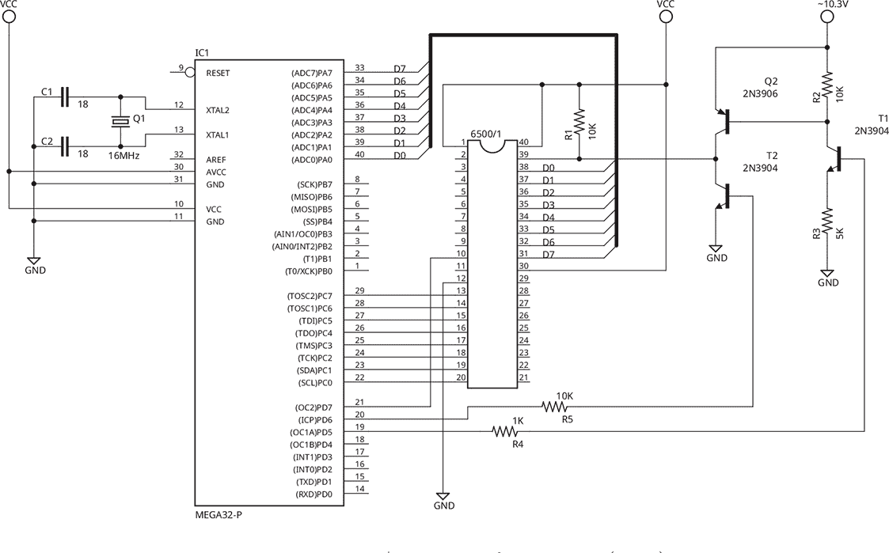

图 F.4: 来自 Brain（2014）的 6500/1 转储器

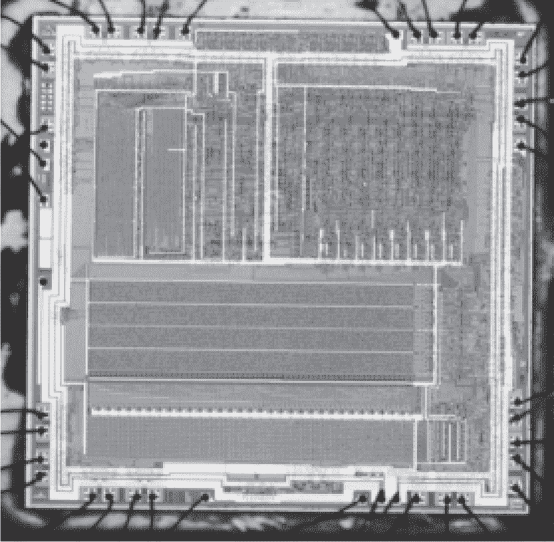

图 F.5: Commodore 6500/1

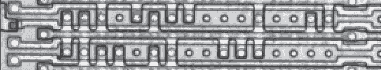

图 F.6: 6500/1 ROM 位

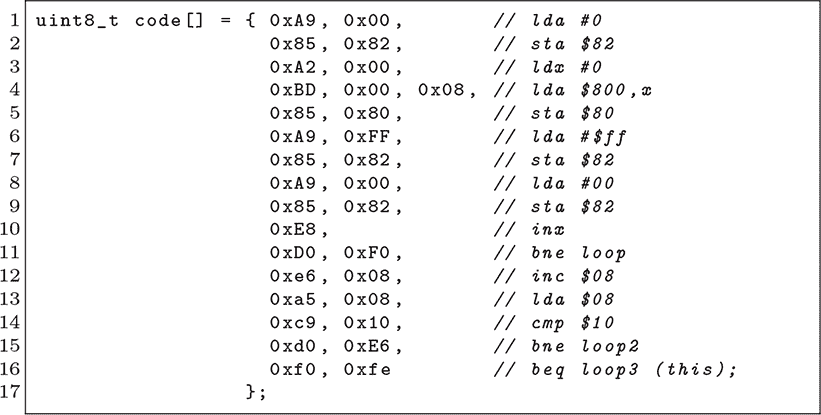

在这两种情况下，AVR 读取每个采样的字节，并通过串行端口将其转发到等待的桌面进行接收。这成功地提取了 Commodore 1520 绘图仪的固件和字体。

除了测试模式外，该芯片的 ROM 也很容易被拍摄。图 Figure F.6 中的示例位是通过使用 HNO[3]进行解封装并使用稀释的 HF 进行去层后看到的。

### **F.4 TMP90 外部内存**

Galiano (2023) 是一个完全功能的漏洞利用，适用于来自东芝的 TLCS-90 系列 Z80 微控制器。示例包括 TMP90C840AN 和 TMP90CM40AN，以及来自相关的 TLCS-900 系列的 TMP91C640N 等芯片。该漏洞利用依赖于不可屏蔽中断（NMI）引脚，因此并不适用于整个系列；TMP90C844AN、TMP91-C642AN 和 TMP90CH44N 并不易受攻击。

Galiano 从 EA 引脚开始，EA 引脚控制芯片是从内部 ROM 启动还是从外部内存启动。然而，启动外部内存并转储 ROM 并不像看起来那么简单。EA 引脚只在复位时采样，它在选择从外部内存启动的同时禁用内部 ROM。

他的漏洞利用从外部 EEPROM 启动。然后，他利用 Z80 芯片在设置调用堆栈时的一个技巧，再次从这个 EEPROM 执行，同时内部 ROM 仍然启用并作为默认启动目标。

像 TLCS-90 系列的 Z80 芯片在复位时不会硬件重置堆栈指针。相反，通常第一条指令会设置堆栈指针。通过在该指令执行之前触发 NMI，Galiano 在堆栈指针有效之前将执行重定向到 NMI 中断处理程序！

当堆栈指针先前设置为 EEPROM 而不是 SRAM 时，目标芯片将把 `AF` 和 `PC` 寄存器保存到位置不佳的堆栈中。`AF` 的值无关紧要，而此时 `PC` 可能为 `0x9000`。这两个值都不会写入 EEPROM，因为 EEPROM 不接受随机写入，所以在从中断处理程序返回时，程序计数器将强制恢复为只读堆栈中的值。

然后，代码可以初始化堆栈指针为 SRAM 中的一个地址，并继续自由读取所有内部 ROM 或 PROM，将其转储到串口，或复制到新的内存芯片中。

### **F.5 Mostek 3870 (Fairchild F8)**

Boris Diplomat、Chess Traveler 以及其他一些 70 年代末期的国际象棋计算机使用了 Fairchild F8 架构的变种，称为 Mostek MK3870。Riddle (2013) 和 Rock (2013) 描述了使用该芯片测试模式的电气转储。

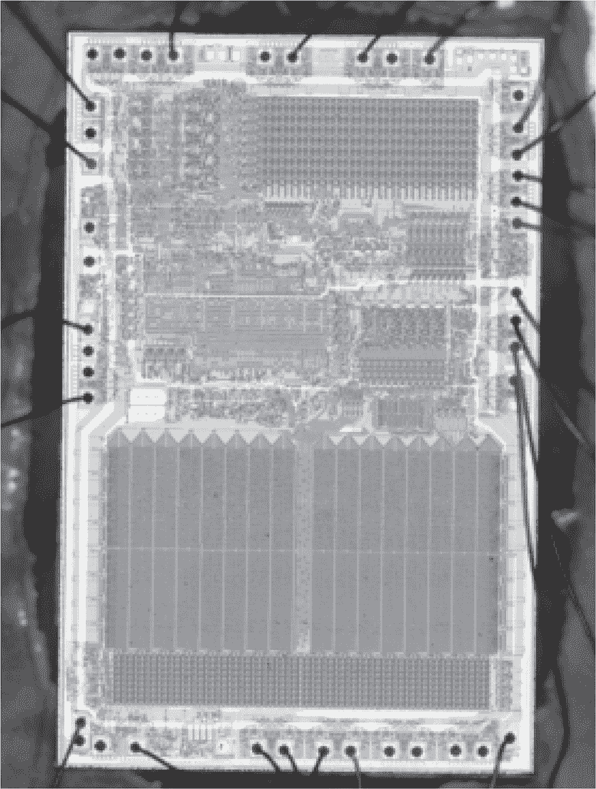

图 F.7: Mostek MK3870

第 16 页的 Mostek (1978) 描述了 TEST 引脚的行为，该引脚根据电压激活不同的测试模式：

在正常操作中，TEST 引脚未连接或连接到 GND。当 TEST 设置为 TTL 电平（2.0V 到 2.6V）时，端口 4 变为内部数据总线的输出，而端口 5 成为内部数据总线的有线 OR 输入。端口 4 引脚上的数据是逻辑上的真，而强制输入到端口 5 的数据必须是逻辑上的假。

当 TEST 引脚置于高电平（6.0V 到 7.0V）时，端口按上述方式工作，另外 2K *×* 8 程序 ROM 被禁止驱动数据总线。在此模式下，操作数和指令可以通过端口 5 强制外部输入，而不是从程序 ROM 中访问。当 TEST 引脚处于 TTL 状态或高状态时，STROBE 停止其正常功能，变成机器周期时钟（与 F8 多芯片系统的写入时钟相同，但相位反转）。

简单来说，TEST 引脚可以将芯片置于三种可能的状态：1）当 TEST 引脚悬空时为正常执行，2）当 TEST 引脚为 3.5V（TTL 电压）时为启用 ROM，3）当 TEST 引脚为 7V（高电压）时为禁用 ROM。后两种模式均用于测试，区别在于是否允许内部 ROM 驱动数据总线。

为了转储 ROM，Riddle 首先将引脚移至高电压，禁用 ROM，从而可以注入加载指令。当指令执行时，他将引脚降至 TTL 电压，重新启用 ROM，使加载指令能接收到数据。

尽管 Riddle 的原始利用方案使用了 PIC 18F4620 以兼容电压，但 Rock 更倾向于使用 Raspberry Pi Pico 和电平转换器。

从 PIC BASIC Pro 直接移植 Riddle 的利用方案并不可行，因此进行了重大的结构性修改，以更通用地注入代码并回读结果。通过这一点以及少量的错误修正，成功地从 HP82143 打印机中转储了固件而没有损坏。

### **F.6 MC6801 测试模式**

MC6801 微控制器可以从内部或外部 ROM 运行。Lind（2019）是一个开源项目，用于从摩托罗拉 MC6801 电气转储 ROM。

摩托罗拉（1984）描述了测试模式零，其内存映射如图 F.8 所示。从第 2.3 节来看，模式选择有点棘手，但通过复位时的引脚来处理：

MC6801 的工作模式由 RESET 上升沿时引脚 8、9 和 10 的电平控制。然而，这三个引脚也作为端口 2 的最低三位有效位。这些工作模式在 RESET 上升沿被锁存到 MCU 程序控制寄存器中，此后可以移除电平，且引脚可用于其他目的。工作模式可以从端口 2 数据寄存器读取，其中 PCO（引脚 8）、PC1（引脚 9）和 PC2（引脚 10）作为数据位 D5 到 D7 分别出现。

通过选择测试模式 0，Lind 的利用方案强制重置向量从外部 EEPROM 读取，而不是从内部 ROM 读取。此时，代码从外部内存执行，并能够自由读取内部内存。

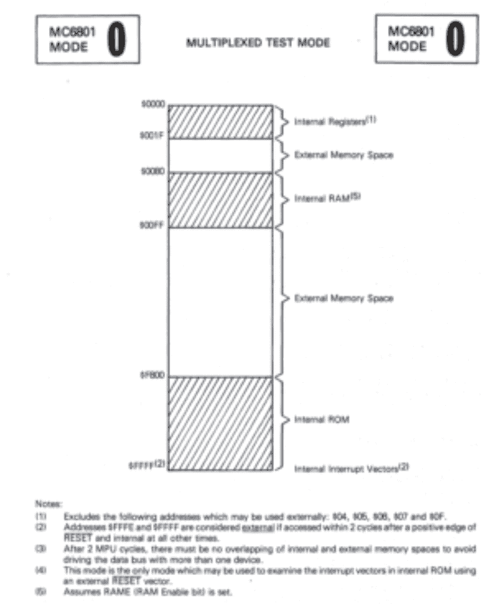

图 F.8：来自摩托罗拉（1984）的测试模式内存映射

Lind 的 shellcode 是 Daniel Tufvesson 的 MC3 监控程序的一个分支，存储在普通的 EEPROM 中，并使用 GAL16V8 可编程逻辑器件（PLD）来管理复位序列和内存总线。在受害者芯片启动监控程序后，可以发送标准监控命令，通过芯片的串行端口转储内部 ROM 的内容。

### **F.7 NEC uCOM4 测试模式**

NEC 的 uCOM4 系列包括具有掩模 ROM 的 4 位微控制器，例如 D552 和 D553。Kevin Horton 和 Sean Riddle 将这些微控制器作为从古董跳棋和国际象棋游戏中恢复 ROM 的一种方法进行研究。

Riddle 的提取技术涉及掩模 ROM 摄影，这种方法非常便携，但解码可能会很费力。他的解码器如图 F.9 所示，揭示了每 128 行中有 16 个页面，每一对页面的顺序相反。Riddle（2023）展示了去层后的 ROM。

Horton（2023）提出的非破坏性方法是电气方法，而不是摄影方法。芯片有一个测试引脚，能够使其停止 CPU 并将位数据转储到 GPIO 引脚，但它仅在 256 字节的内存页面内执行此操作。它在一个循环中执行，所以你会得到所有字节，但你不一定知道它们是如何对齐的。

要电气提取其他页面，您必须单步执行 CPU，直到它跳转到另一个内存页面，然后使用测试引脚转储该页面。在该页面内，它将从程序计数器的值开始转储，因此页面的字节将有一些偏移，需要进行修正。通过识别已知页面中的跳转点并安排跳转，可以转储任何包含可达代码的页面。

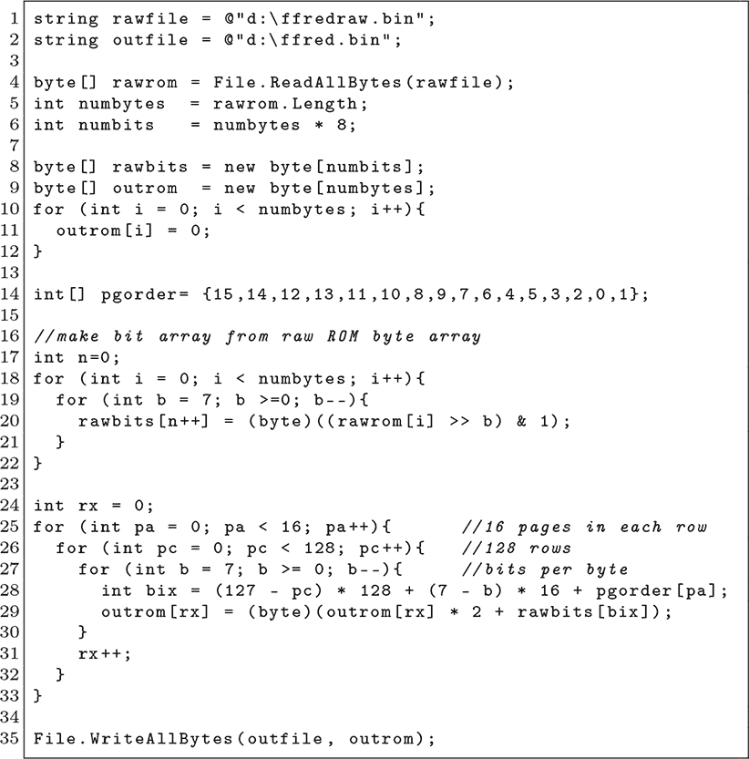

图 F.9：Sean Riddle 的 Fabulous Fred 解码器

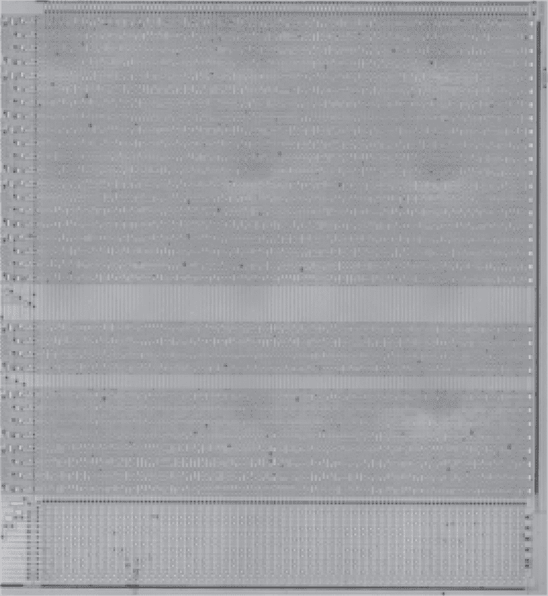

图 F.10：Fabulous Fred uCOM4 ROM

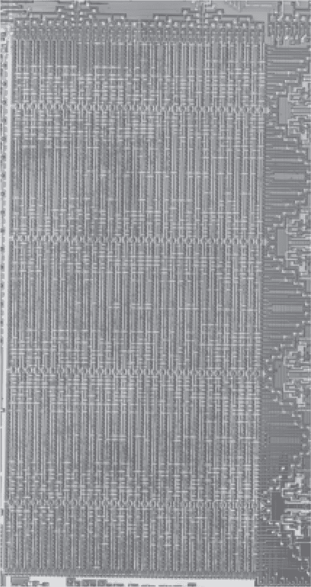

图 F.11：EMZ1001E 扩散 ROM

### **F.8 AMI S2000 和 Iskra EMZ1001**

南斯拉夫唯一的微控制器——Iskra EMZ1001，是 AMI S2000 系列的一个变种，甚至在芯片上也有 AMI 的标志。与苏联克隆芯片不同，这款似乎是由 AMI 授权并作为合作项目开发的。Zoltan Pekic 在 VHDL 中实现了一个 EMZ1001 的克隆，见 Pekic（2022），并且他慷慨地指引我查阅文档中的测试模式。

这个技巧，见于 AMI（1979）的第 4.9 页，涉及 ROMS 和 SYNC 引脚的交互。解释很简短，如果你没有认真查看以便克隆芯片，容易忽略。ROMS 引脚的描述如下：

ROM 源控制。连接到逻辑 1 或 0，以指示仅内部 ROM，或内部 ROM 加外部 ROM。连接到 SYNC 以通过外部程序覆盖 Bank 0，连接到反转的 SYNC 以验证内部 ROM 内容。

通过反转 SYNC 信号到 ROMS，我们可以将芯片强制进入验证模式。在程序计数器向前计数时，指令解码器将接收虚拟指令，而数据引脚输出内部 ROM 内容。

如果你不耐烦，ROM 位也可见。图 F.11 显示了经过 HF 去层后的 EMZ1001E 微控制器的位。

### **F.9 TMS1000 测试模式**

很难确定给定的专利是否匹配给定的芯片，尤其是在多个专利可能指的是同一芯片的情况下。Caudel 和 Raymond (1974) 是德州仪器 TMS1000 芯片的专利，描述了许多内部信号和用于转储内部 ROM 内容的测试模式。该测试模式未出现在数据手册、程序员参考手册或其他官方文档中。

另一个专利，Boone 和 Cochran (1977)，常被引用为 TMS1000 专利。两款芯片都具有 28 个引脚。两款芯片都用于 ROM 编程计算器。TMS1000 显然具有八位的 ROM 宽度。然而，Boone 和 Cochran 的芯片具有像 TMS0801 一样的 11 位指令。有关如何转储该芯片的 ROM 的优秀教程，请参见 Ilmer (2024)，其中包括关于确定 ROM 位顺序的详细说明。

Caudel 和 Raymond 的专利中还有一张黑白芯片照片，与 TMS1000 非常相似，并且有一组匹配的操作码。他们专利的第 28 列描述了四个测试模式操作。

操作 1：ROM 字地址通过键盘引脚 K1 在控制键盘引脚 KC 的作用下串行加载到程序计数器中。将 KC 设置为 Vss 会导致在*ϕ*1 时采样该位，此时程序计数器不被使用。（芯片的时钟被划分为五个信号，其中*ϕ*1 是第一个。有关详细信息，请参见专利中的图 24。）

现在，如果你正在跟随专利和数据手册，你可能会注意到数据手册中没有 KC 引脚。这可以通过专利和数据手册之间的文档更改来解释。专利中将 KC 与四个键盘输入引脚一起归类为芯片照片中信号 75，如图 F.12 所示，而数据手册则将 INIT 引脚放置在该位置。

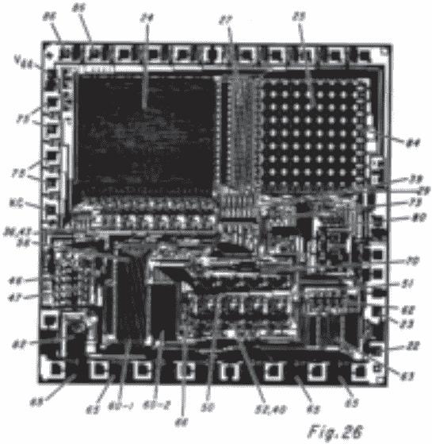

图 F.12: Caudel 和 Raymond (1974) 的原型

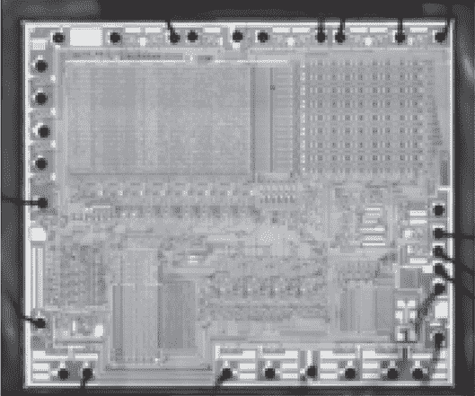

图 F.13: TMS1000

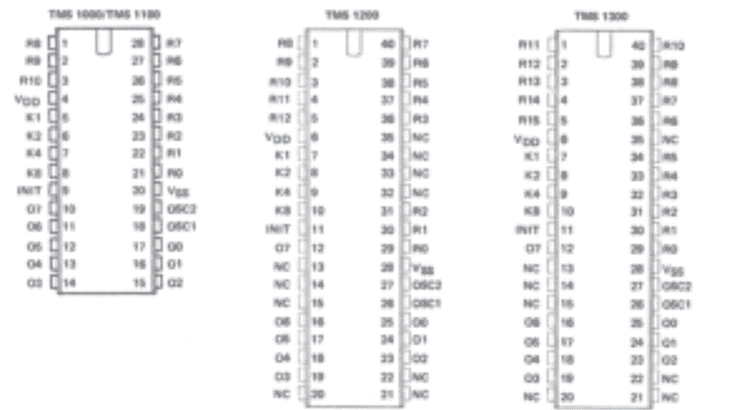

图 F.14: TMS1000 引脚分配

输入和输出引脚也有不同的标签，因此在进行操作时可能会有一些混淆。

操作 2：ROM 页地址在 K1、K2、K4 和 K8 键盘引脚上并行加载。如果 KC 引脚在时钟相位*ϕ*2 时为 -Vdd，则四个位将被采样。请注意，这个页地址的并行加载发生在与字地址不同的时钟相位；专利在此建议了一种加速方法，即快速迭代页地址，同时很少调整字地址。

操作 3：通过内部 !BRNCAL 信号，可以将所选 ROM 地址的八位字加载到程序计数器中，该信号是 KC 和 K2 引脚的组合产生的。

操作 4: 从第三个操作中获取的结果可以通过输出引脚串行读取，并由 KC 引脚控制。幸运的是，这种串行传输可以在加载新地址的第一操作之前，且与其同步进行。

我的描述遗憾地缺少一些细节，我怀疑在使用该模式转储芯片之前，我永远也不会完全理解这个测试模式。如果你在我之前实现了它，请发封邮件给我，并附上你的论文副本以及任何我需要在此附录条目中纠正的勘误表。

### **F.10 Z8 测试 ROM**

我无法引用任何现代使用这种测试模式的实例，但许多 Zilog Z8 芯片，如 Z8601 和 Z8611，除了主程序 ROM 之外，还包含一个测试 ROM。这个功能在 Zilog (1982) 中有解释，其中测试 ROM 的目的是测试那些无法通过执行主要测试的外部 EEPROM 代码直接操作的少数功能。

第一个线索来自于芯片的图像，其中 ROM 的大小比预期的要大。例如，Z0860008PSC 的内部 ROM 包含 256 列和 66 行，而不是预期的 64 行。这比数据表中广告的两千字节多了 64 字节。

从 Zilog (1982) 中，我们可以发现这些字节包含类似于 图 F.16 中的测试 ROM。测试 ROM 在 !RST 引脚被拉高 2.5 伏高于 VCC 并保持至少八个时钟周期后，会替代应用程序 ROM，然后可以放松到正常电压。对于 5 伏芯片来说，就是 7.5 伏。

测试 ROM 太小，无法进行大量测试，因此它首先通过 IO 端口映射外部存储器，并调用该外部存储器。接着，它跳转到外部存储器中的 `0x0812`（或 `0x1012`）位置，在那里 EEPROM 示例禁用中断并运行测试循环，通常会回调测试 ROM。回调似乎用于测试用于外部存储器访问的 I/O 端口；它们并不像 PC BIOS 调用那样方便。

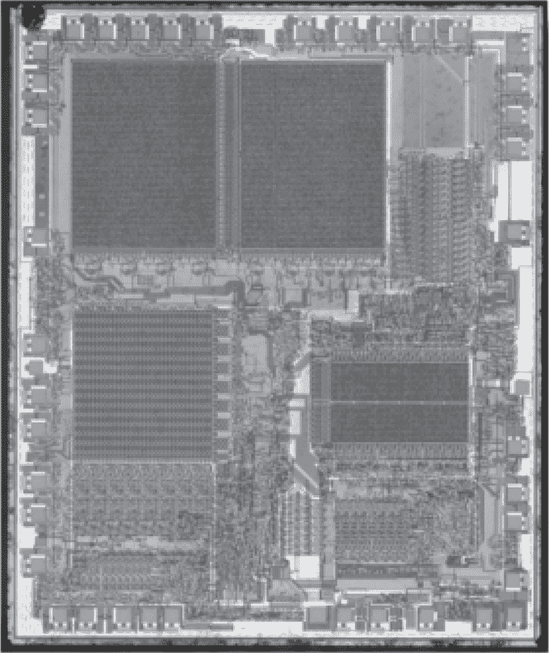

图 F.15: Zilog Z8611

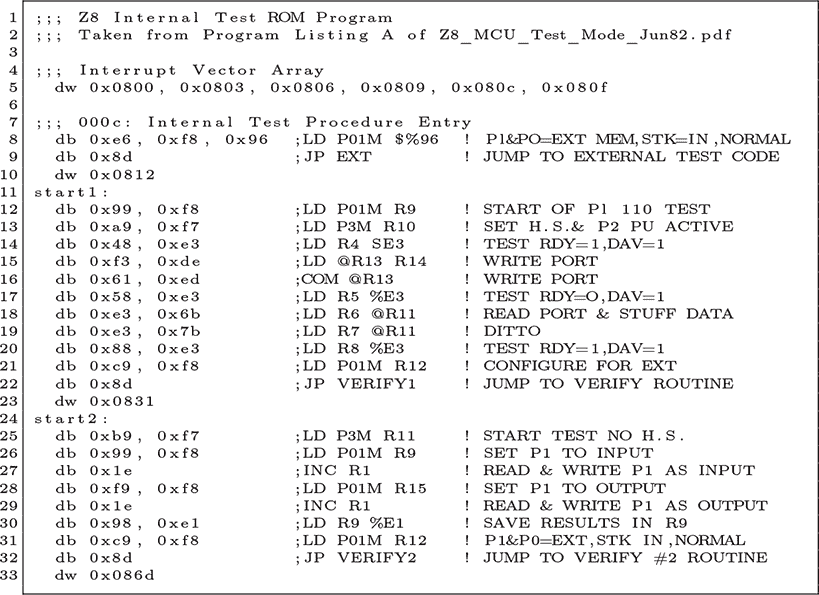

图 F.16: Z8601 测试 ROM

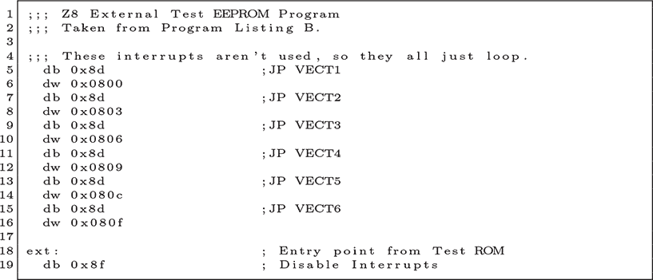

图 F.17: 进入 Z8601 测试 EEPROM

在测试模式下运行时，`lde` 指令可以从测试 ROM 获取字节，而 `ldc` 指令则从应用程序 ROM 获取字。这样，一个简单的循环应该足以转储 ROM，而无需调用回测试 ROM。

这些芯片的 ROM 变种也可以通过照片方式转储。它们使用扩散 ROM，其位在用 HF 去层化后变得可见。
