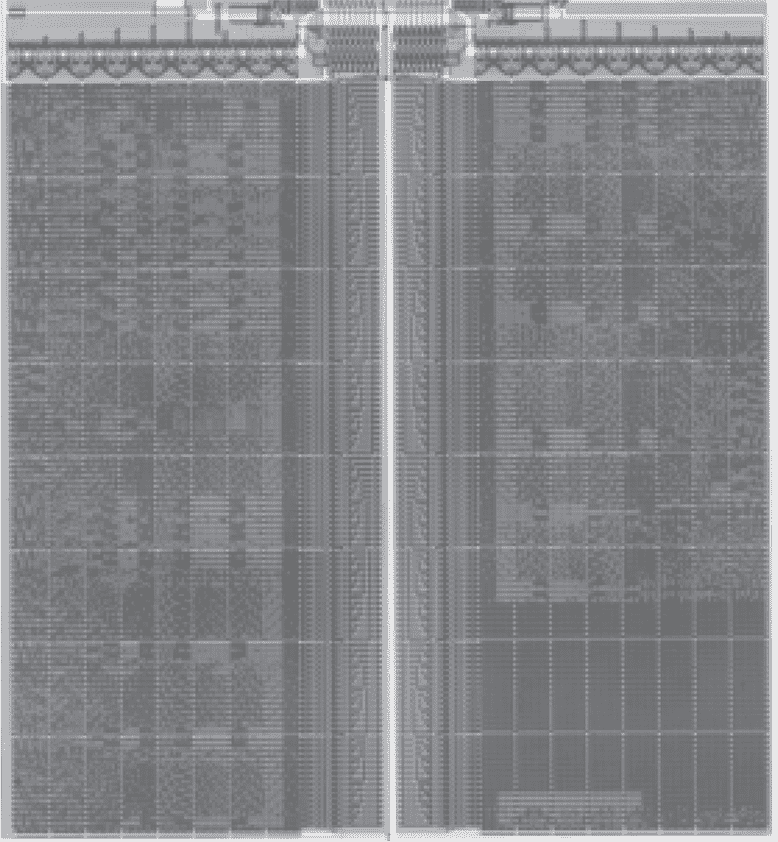
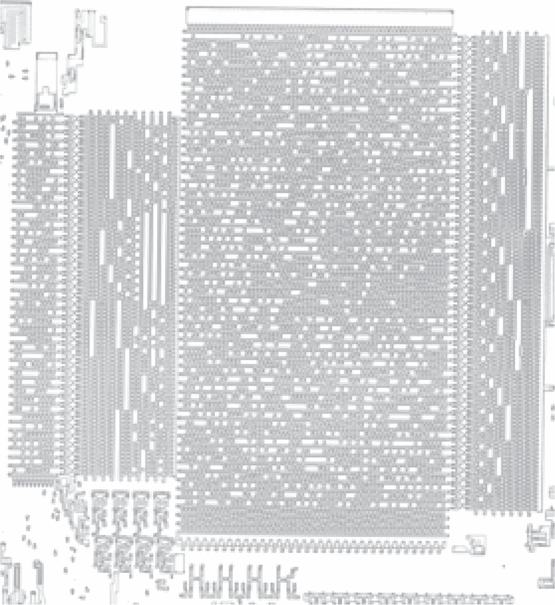

## 第三十二章：**G 更多 ROM 摄影**

### **G.1 TMS320M10, C15, C25, C5x**

Caps0ff (2020a) 描述了逆向工程和摄影 TMS320M10 芯片的过程，这些芯片用于 80 年代的 Taoplan 街机游戏，如《飞翔的鲨鱼》和《极限虎》。相同的技术也适用于 M10 的早期继任者，如 TMS320C25。

Caps0ff 还提到之前对 TMS320C15 的研究，它使用了接触式 ROM，而不是扩散式 ROM。该芯片中的位使用了不同的排序方案，而在流行的 BSMT2000 音频芯片中，这些位已通过摄影提取出来，BSMT2000 是 C15 的预编程变种。^(1)

TMS320 的 ROM ID 通常位于型号编号附近，例如他们示例中的 D70015。你可能会问：“哎，为什么我要在这么多年后关心他们的型号编号，毕竟所有记录可能早已丢失？” 好吧，Caps0ff 分享了一个非常巧妙的技巧：在一个具有独特掩模的掩模编程 ROM 中，例如高产量的 TMS320 芯片，ROM 序列号与 ROM 位在同一个掩模上。因此，如果你剥离层以明确序列号，你*也*会明确 ROM 位。它们处于同一层，深度完全相同。

在 M10 中，这就是技巧所在。去除几层以明确序列号时，ROM 位直接显现出来，而之前从表面几乎不可见。

图 G.1：来自 TMS320C15 的 BSMT2000 ROM

Caps0ff (2020b) 描述了逆向工程 TMS320C50 和 TMS320C53 ROM 的过程。他们的真正目标是来自街机的 C53。通过首先从 C50 开发套件中使用调试器提取 ROM 镜像，然后将该文件与 ROM 位的照片进行比较，他们能够知道 C53 中 ROM 位的排序，只剩下银行顺序需要猜测。（C53 有四个银行，而 C50 只有一个。）这个 ROM 格式现在是 Zorrom 支持的众多格式之一。

一些 TMS320 芯片也可以通过滥用其微处理器模式来执行外部存储器，从而提取数据。有关此技巧的详细信息，请参见章节 F.2。

### **G.2 CH340 未知架构**

Cornateanu (2021) 是关于芯片去封装和去层摄影以及 ROM 恢复的通用教程，CH340 USB/串口控制器是其示例目标。顶层金属层隐藏了位，使它们在表面上不可见。

Cornateanu 描述了使用 HF 去层芯片的过程，这去除了顶层金属层以暴露 ROM 位。从他的照片来看，这是一个扩散式 ROM，但骰子非常小，我在自己实验室里复现他的工作时遇到了相当大的困难。

位提取是使用 Rompar 执行的，但由于 CPU 架构（当时及现在）未知，位是通过 Bitviewer 解码为字节，而不是 Zorrom。位顺序是通过查看地址线解码器电路来确定的，然后通过识别 USB 描述符表和字符串来确认。

提取 ROM 后，他知道了内存内容，但仍不清楚 CPU 架构是什么，它是围绕 14 位字构建的奇怪架构。为这种架构编写 IDA Pro 插件仍然在进行中。

### **G.3 英特尔 8271 新 ISA**

Evans（2020 年）描述了英特尔 8271 磁盘控制器掩膜 ROM 的影像转储，该 ROM 包含 864 字节。这个芯片也作为 NEC D765 销售。

这个顺序成功地猜测为从左到右然后从上到下，先 MSBit 后 LSBit，字节由每个 8 位组的一个位构成。位被反转。这使得前几个字节为 `fc 06 02 f7`。这恰好是正确的，但更难的部分是搞清楚指令集。

逆向工程指令集需要一些关于起始位置的线索。Ken Shirriff 的百科全书式知识提供了帮助。他发现 Louie、Wipfli 和 Ebright（1977 年）的会议演讲介绍了该芯片的设计，包括指令计数和芯片照片。Ken 还发现 Louie 提交了一项专利 US4152761A，描述了该芯片的设计。

凭借这些资源和大量对指令 PLA 位的研究，Evans 成功地逆向工程了大部分指令集，并解析了足够多的 ROM，从而提出了一种写入原始软盘轨道的方法。这使得克隆 BBC Micro 软盘成为可能，尽管为时已晚，无法在盗版中盈利。

图 G.2：英特尔 8271 ROM

### **G.4 任天堂 64 CIC**

与 第二十五章 中描述的任天堂 NES 的 CIC 芯片类似，任天堂 64 使用 SM5 系列的 4 位 Sharp 微控制器来实施授权，因此第三方不能制作自己的游戏。与原始 NES 不同，N64 的 CIC 成功地阻止了在该主机的整个商业生命周期内出现未经授权的卡带。

然而，这并不意味着该方案永远有效。发布十八年后，N64 的 CIC 芯片被两个团队和两种方法独立破解。

Kammerstetter 等人（2014 年）描述了一种逆向工程 CIC 芯片测试模式的技术，允许将一种调试器连接到芯片上，从而能够直接从 ROM 中读取程序。

作为平行工作，Ryan、H 和 McMaster（2015 年）描述了通过 Dash 蚀刻技术获取的掩膜 ROM 转储，在这种方法中，连接点被染色，以表明它们在强光下被 HNO[3]、HF 和 HAc 酸混合物掺杂了几秒钟。由于 Dash 蚀刻的成功率令人沮丧地低，他们购买了大量便宜的运动游戏卡带，并批量去壳提取这些卡带中的 CIC 芯片。
