## **H  未排序攻击**

### **H.1 PIC16C84 PicBuster**

McCormac（1996）的第三章描述了早期电视盗版时代的一些固件提取漏洞。特别有趣的是针对 PIC16C84 的技巧，这是第一款包含电擦除 EEPROM 存储器的 PIC，而不是 OTP ROM 或 UV 擦除 EPROM。就像我们在第十九章中看到的 PIC 一样，保护保险丝使用与 EEPROM 位相同的浮动门晶体管。

这个技巧涉及到 VDD 电源电压与 !MCLR 引脚编程电压之间的差异。在正常操作中，VDD 应该小于 7.5V，!MCLR 应该小于 14V，相对于 VSS 地面电压。这种技术对早期芯片无效，因为它们没有电擦除功能。

为了利用 PIC16C84，芯片在错误的电压下进行电擦除。VDD 引脚保持在 13.5V，仅比 VPP 低 0.5V。然后将 VDD 电压降至标准 5V，并关闭 10 到 20 秒，再重新开机，这样可以读取数据。

### **H.2 PIC 校验和**

PIC 微控制器实现了一种校验和，可以泄漏来自锁定芯片的信息，在某些情况下，通过执行第二次编程，你可以清除—但不能设置—位。Kaljević（1997）记录了校验和算法，并介绍了一种将该校验和系数归零的技术，以揭示源程序中的特定位。

在像 PIC16 这样的 14 位模型上，Kaljević 从校验和算法开始，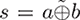，其中 *a* 是 14 位指令字的高 7 位，*b* 是低 7 位。 是 XNOR 运算符，∽ 表示反转，⊕ 表示 XOR 运算符。*s* 可以通过正常的 ICSP 协议自由读取，关键是揭示 *a* 和 *b* 中的未知位。

知道 *s* 后，他指出，通过将字写入 `0b11-111110000000` 来清零 *b*，我们将得到 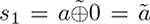，即 *a* 的反转。因此，*s* = *ã* ⊕ b = *s*[1] ⊕ *b*。

然后我们可以声明 *b* = (*s* ⊕ *s*[1]) & `0x7f`，并且 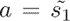 & `0x7f`。从 *s* 和 *s*[1] 重构的完整字可以轻松计算出适用于 PIC16C61、62、64、65、71、73、74 和 84 等 14 位 PIC 的字。

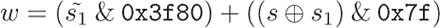

对于 PIC12 系列中的 12 位并行编程芯片，校验和算法有所不同。在这里，*s* = *a* ⊕ *b* ⊕ *c*，其中 *a* 是指令字的高四位，*b* 是中间四位，*c* 是低四位。

与 14 位芯片中的一次写入不同，这里执行了两次写入。在第一次写入 `0x0ff0` 以清零 *c* 后，我们看到 *s*[1] = *a* ⊕ *b*。接着，我们可以进行第二次写入 `0x0f00` 来清零 *b*，留下 *s*[2] = *a*。将所有内容串联起来，对于具有 *s*、*s*[1] 和 *s*[2] 的 12 位芯片，我们的原始指令字将被揭示，其中 *a* = *s*[2]，*b* = *s*[2] ⊕ *s*[1]，*c* = *s*[1] ⊕ *s*。

*w* = (*s*[2] & `0xf00`) + ((*s*[2] ⊕ *s*[1]) & `0xf0`) + ((*s*[1] ⊕ *s*) & `0xf`)

至于如何执行写入，这篇论文变得有些难以理解。在 PIC16C71 和 61 型号中，前 64 个内存单元可以直接被覆盖。*b*被清零，恢复算法可以无歧义地恢复这些字，但其他内存则不能这么容易地写入。

为了编程一个已经被锁定的芯片以清除位，他建议先给芯片加电压，如果失败，再进行过热处理，如果还不够，再暴露在有限的紫外线下。这个电压技巧——可能与 H.1 章中的类似——是将芯片的电压设置在 6 到 9 伏之间，同时严格限制电流为 100mA。如果这仍然无效，他建议保持温度在 110 ^°C，并小心不要超过 140 ^°C。

如果这还不够，他提出通过暴露芯片并调整紫外线光的功率，使得擦除一个 PIC 芯片需要十分钟。然后，在 110 ^°C 的温度下，进行每次 30 秒的紫外线照射，直到保护位被设置，允许写入。接着，`0x3f80`被写入每个内存单元，芯片逐渐冷却到−20 ^°C。此时，保护位将恢复为零。写入将不再被允许，但来自写入的清除位也会被置为零。*s*[1] 可以从锁定的芯片中读取出来。

还有一个进一步的技巧仅在 x86 汇编代码中描述，用来写入`0b11111111000000`，这会将*b*设置为`0x40`或`0x00`。这给解码留下了一个难题，并提供了一些有用的注释，说明哪两个可能的指令字是正确的猜测。

### **H.3 ESP32 TOCTOU 用于 XIP**

Espressif 的 ESP32 系列支持执行就地（XiP）模式，在该模式下，指令直接从 SPI 闪存中获取，而不是先复制到内部 SRAM 中。这使得应用程序可以使用更多的 RAM，代价是执行速度变慢。

在执行之前，代码会被验证并检查签名，但 Magesh（2023）描述了一种时检查到时使用（TOCTOU）攻击，通过在运行时交换两个 SPI 闪存芯片来攻击签名验证。这使得签名代码能够在未签名代码执行之前成功地进行测量。

Magesh 指出，当启用闪存加密（AES XTS）时，这个技巧不起作用，但他预计攻击者可能通过随机化一个页面，直到找到所需行为，来利用加密图像，同时保持其他页面不变。

### **H.4 DS5002 选择密文**

来自达拉斯半导体的 DS5002 是早期并富有创意的代码读取保护尝试。代码保存在外部存储器中，并被加密，密钥则保存在内部的电池备份 SRAM 中。这对街机游戏修复造成了尴尬的局面，因为现有设备中的电池最终会耗尽。如果没有漏洞，运行游戏所需的代码也会随着电池的死去而消失。

这款芯片的指令集是 8051。加密是逐字节进行的，与其他字节无关，但与该地址是唯一对应的。无论是操作码还是参数，转换方式都是相同的。

除了加密，DS5002 在内存总线可能处于空闲状态时还会执行虚拟读取。这些地址读取的值没有任何实际用途，只是为了迷惑我们。

DS5002 也有封装成带电池备份的密封环氧模块版本。图 H.1 和 H.2 展示了该模块的表面显微镜和 X 光图像。

Kuhn（1996）和 Kuhn（1998）提出了一种针对该芯片的密码学攻击，首先备份外部 SRAM 的副本，然后将猜测的值输入到 CPU 中，观察地址的变化。

例如，你可能猜测某条指令是分支指令。由于地址是加密的，你不能仅凭下一个获取的地址来确定你的猜测是否正确。但如果你改变一个参数字节，几乎每个值都会将地址分支到不同的方向。

攻击的关键在于获取那一点信息，并用它来分裂许多具有已知内容的选定密文字节，从而允许我们执行任意代码。

你还应该了解，每个字节是单独加密的，并且它们不会影响后续字节。我们并不完全知道每个字节将如何被加密，但对于每个特定地址，我们可以构建一个字节表格。该表格是一个唯一的加密字节与明文字节的映射，并且当内存中前一个字节发生变化时，表格不会改变。正如你很快会看到的，我们并不太关心每个字节所在的地址。相反，我们关心的是强制这些字节变成已知值，并构建查找表，从而让我们选择适合特定明文的密文。

Wilhelmsen 和 Kirkegaard（2017）提出了一种更现代的同类攻击实现，由于其写作风格较为通俗易懂，因此更容易理解。他们描述了许多复杂的情况，且数学内容远少于前者。

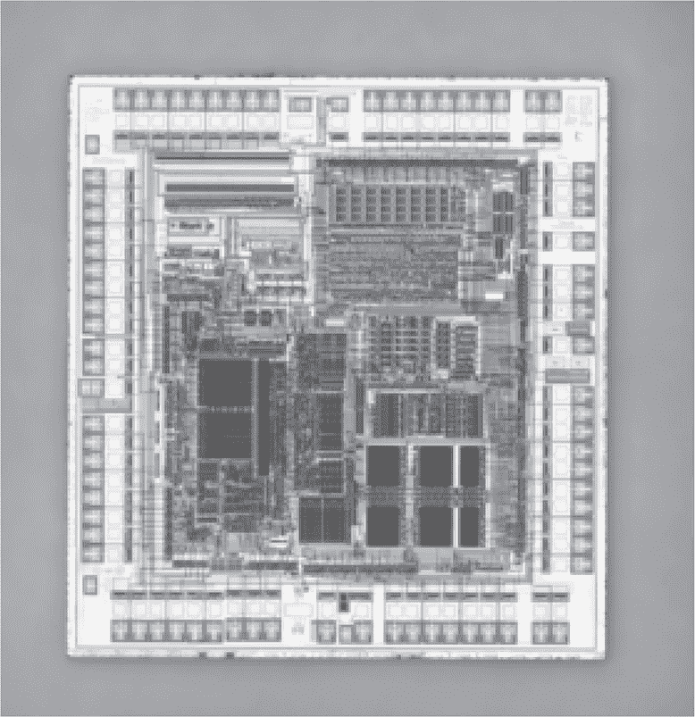

图 H.1：Dallas DS5002

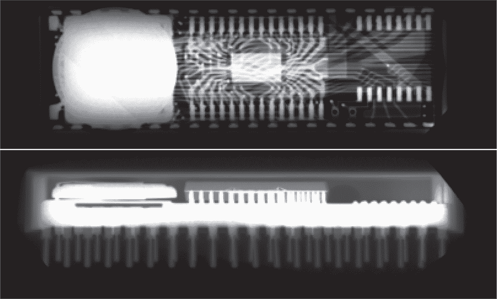

图 H.2：Dallas DS5002 模块的 X 光图像

许多 8051 指令在获取后需要几个时钟周期才能执行。DS5002 在这段时间内会获取与之无关的指令，以迷惑外部观察者，这使得我之前的描述显得有些过于简化。

此外，中断表保存在内部 SRAM 中，因此攻击者无法知道中断何时被触发。这在重置时尤为重要。

确定第一次真实指令何时被提取是必要的，因为首次观察到的访问可能是虚拟读取。他们通过尝试该地址上的所有 256 个值来实现这一点，如果这些值没有改变随后的内存访问，他们就知道该字节是虚拟的，可以自由忽略。这个过程会重复进行，直到他们识别出第一次真实的指令。

在确定了第一个指令字节的位置之后，他们接下来需要制作一些字节来适应那里。由于 DS5002 在重置时将 Port 3 设置为`FF`，他们可以通过暴力破解`05 b0`（`inc p3`）作为前两个指令字节，将 Port 3 反转回`00`。我指的是暴力破解它；只有 65,536 种组合。

在这一点上，他们已经得到了前两个字节的一个密文/明文映射，但还没有其他的映射，因此不能随意更改它们。为了得到第三个字节的映射，他们暴力破解第一个字节，直到得到`75`，即`mov iram addr, #data`的操作码，此时他们可以执行`75 b0 xx`将所有 256 个明文值写入 Port 3。现在，第三个字节完全破解，尽管对于第一个字节只映射了两个值，对于第二个字节仅映射了一个值。

然后，他们调整第一个字节，直到它变成类似`nop`的指令，并调整第二个字节，直到它变成`75`。接着，他们可以像第三个字节那样扫描第四个字节的每个值！重复这一过程，他们能够得到一些 shellcode 字节，并可以将其强制写入芯片，前面是两个不重要的`nop`字节。

最后，他们插入了一些小的 shellcode。这个代码给出了代码和数据内存之间的边界：

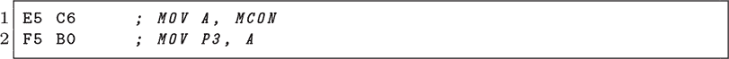

这个用来转储代码：

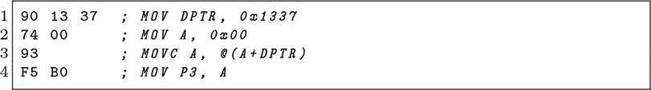

这个用来转储数据：

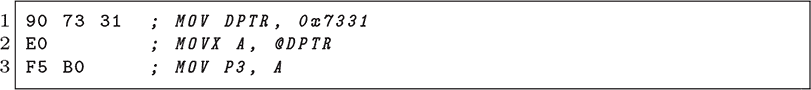

这个攻击涉及大量的重置操作，但他们报告仅用了两分钟就通过暴力破解了第一组指令，并且只用了四分钟就转储了 32 千字节的固件。

### **H.5 SAMA5 CMAC, SPA, 密钥**

Janushkevich（2020）描述了 Microchip（前身为 Atmel）SAMA5 系列安全微控制器中的三个漏洞。

该系列包含一个名为 SAM Boot Assistance（SAM-BA）的引导监控程序，允许上传经过认证和加密的小程序并执行。这些小程序通常用作驱动程序，在 RAM 加载模块中实现对新内存设备的支持，以保持引导加载程序的体积较小，同时依赖基于密码的消息认证码（CMAC）认证来保证安全性。

请注意：CMAC 身份验证通常被认为是公钥签名的快速替代方案。当一切顺利时，CMAC 提供的身份验证比公钥签名要快得多。与签名不同，CMAC 可能会出现很大问题，因为 CMAC 依赖于共享的秘密密钥，而任一方都可能泄漏该密钥。可以将其想象成一封信：如果我们使用公钥加密通信，我的签名将保证信件来自于只有我可以访问的密钥，并且只有我才可能将其泄漏给第三方。但如果我们使用 CMAC 来验证我们的信件，你*和*我都可以访问身份验证密钥。*我们中的任何一个*都可能将该密钥泄漏给第三方。

一些芯片将 SAM-BA 包含在 ROM 中。其他芯片没有 ROM，而是将启动辅助监视器链接到闪存。一个 GPIO 引脚配置引导加载程序入口，SAM-BA 支持通过 UART 和 USB 与主机计算机通信。标准程序是，当配置引脚在复位时为低电平或应用程序的复位向量为 `0xffffffff` 时，启动加载程序将首先尝试通过 USB 枚举，然后回退到 UART 控制台。

SAM-BA 具有一个华丽的 GUI 客户端和 TCL 脚本库，但对于第一个漏洞，我们将坚持使用 UART 变体的文本协议。Microchip 文档中载入安全小程序的过程包括以下交易，其中 `applet.cip` 是一个加密并签名的小程序二进制文件，大小为 9,870 字节。

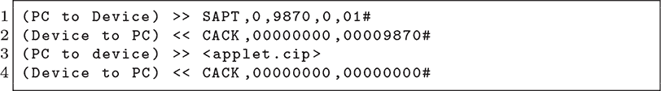

在此过程中，`SAPT` 命令处理程序将小程序加载到 SRAM 的 `0x220000` 地址，检查 CMAC 身份验证，并在原地解密小程序。身份验证检查的结果被放置在一个全局变量中。如果 CMAC 错误，后续的 `CACK` 消息将包含错误代码，并且全局变量将指示身份验证失败。

小程序加载完成后，`SMBX` 命令用于加载邮件箱。`mailbox.bin` 既没有加密也没有签名，它被加载到应用程序镜像中的邮件箱区域，地址为 `0x22-0004`。一个匹配的命令，`RMBX`，将在执行后检索邮件箱，以支持双向通信。

小程序加载完成后，`EAPP` 命令可以用来执行小程序并处理邮件箱消息。除了邮件箱之外，`SFIL` 和 `RFIL` 命令可用于向设备发送或接收文件。

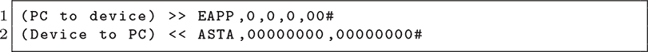

现在我们已经覆盖了教程的基础内容，让我们来看看第一个可利用的漏洞。Janushkevich 首先注意到，`RMBX` 命令允许即使在邮件箱尚未加载的情况下，也能检索到邮件箱。因为邮件箱和小程序重叠，这使得他可以从内存中读取小程序的部分内容。

然后，他首先尝试了一个已签名、已加密的小程序和一个未签名、未加密的小程序。`RMBX`返回了第一个小程序的明文部分，显示它在执行前被解密到内存中。未签名的小程序也有部分从邮箱中返回而没有损坏，这意味着当 CMAC 验证失败时，未验证的消息仍然保留在内存中，没有被解密过程混淆。

最后，他尝试了用`EAPP`、`SFIL`和`RFIL`执行小程序。这三者——我不是开玩笑——都无故执行了未加密、未签名的小程序。似乎`SAPT`命令记录了身份验证失败，但执行小程序的命令并未检查这个变量。这被记录为 CVE-2020-12787。

作为第二次攻击，他将一个 ChipWhisperer 连接到修改过的 SAMA5D2-XULT 开发板上，查看当该芯片执行 CMAC 身份验证时的功耗。通过识别一个时刻，当功耗跟随提供的 CMAC 词与计算出的词之间的进位减法发生剧烈变化时，他能够泄漏消息的正确 CMAC 的位，从最重要的位开始，一直到最不重要的位。在 1,300 次功率测量或二十分钟内，这使他能够伪造一个 CMAC 身份验证，用于引导镜像的启动、加载 SAM-BA 小程序或安装密钥。这被记录为 CVE-2020-12788。

他对这一系列的第三次攻击既简单又残酷：该引导加载程序使用的 CMAC 密钥是硬编码的，并且可以通过利用我们已经讨论过的漏洞，由小程序进行转储。这些密钥通过解密已发布的小程序进行验证，从而实现逆向工程，也许有朝一日可以被利用。这被记录为 CVE-2020-12789。
