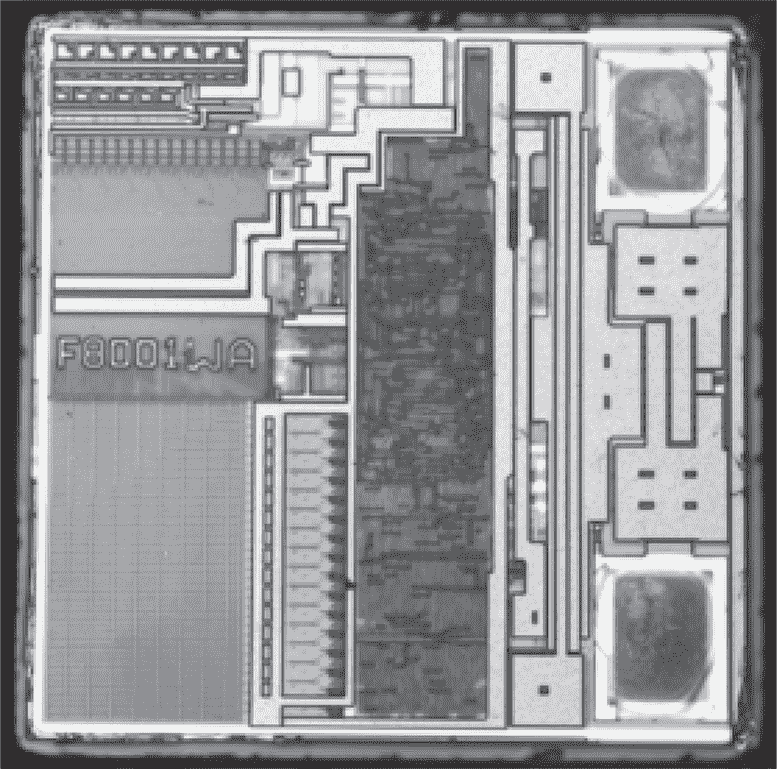

## 第三十四章：**I 其他芯片**

### **I.1 PAL 真值表**

可编程阵列逻辑（PAL）和通用阵列逻辑（GAL）设备是早期的可编程逻辑技术，早于 CPLD 和 FPGA 设备。这些设备的编程方法通常是特定于芯片品牌的，而引脚排列和功能在不同厂商之间是兼容的。如今，它们大多用于复古计算模拟和修复项目。

DuPAL 是一个用于 PAL 逆向工程的开源工具套件，见 Battaglia (2020)。它包括一块带有 Atmega 芯片的硬件板，用于施加输入并采样 PAL 芯片的输出，以及可以导出观察结果或测试潜在芯片配置的 Java GUI 工具。

DuPAL 并不直接读取芯片中的原始内存，因此它仅限于从输入和输出端外部观察到的状态。当输出值作为输入反馈时，有时会因同步逻辑的延迟而导致混淆。

Surply（2015）描述了使用 Arduino Uno 从弹球机的 PAL16L8 芯片中提取真值表的过程。由于真值表过大，无法通过 Karnaugh 映射进行简化，但 Surply 成功使用 Niels Serup 的 Python Electruth 库中的 Quine-McCluskey 方法，在几小时内简化了 PAL 的真值表，揭示了机器多个 I/O 端口的地址空间。

图 I.1：MMI PAL16R6B

也可以通过视觉方式提取这些芯片的内容。PAL 通过电迁移保险丝标记真值表位。它们的工作原理是通过非常细的金属线路传导过多电流，导致金属沿着电流的路径流动，从而断开线路。

### **I.2 Mifare Classic 门恢复**

Nohl 等人（2008）描述了成功逆向工程当时 NXP 的 Mifare Classic RFID 标签所使用的加密算法。该芯片如图 I.2 所示，大小不到一毫米的正方形，有 1K 和 4K 版本。

Nohl 要求提供表面和去层化后的照片进行这次恢复，然后使用边缘检测和模式匹配来识别芯片的标准单元库。尽管芯片上有成千上万的门，但只有大约七十个独特的逻辑单元。该门集合已由 SRL（2012b）发布。

在六层芯片中，较上层的隐藏了单元识别。这些通过机械抛光而非化学刻蚀去除。图像随后使用 Hugin 拼接，由于 Degate 尚未编写，使用自定义的 Matlab 脚本执行标准单元识别。

在 Mifare Classic 被逆向工程后，Plötz 和 Nohl（2011）接着详细描述了 Legic Prime RFID 标签的逆向工程过程。作者们发布了他们的自定义 Matlab 脚本用于 Degate，并将他们的芯片集作为 SRL（2012a）发布。

图 I.2：Mifare Classic
