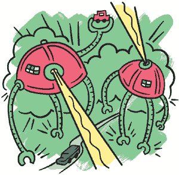

## 每个人都可以制作游戏

视频游戏可以是有趣的、奇怪的、激动人心的、充满好奇的、神奇的，甚至是令人害怕的。我们喜欢玩游戏，因为它们就像通往其他世界的窗户，这些世界随着我们的游戏互动而移动和变化，它们的规则与我们的世界不同。（有时这些规则似乎比我们的更有道理。）游戏可以是我们短暂造访的地方，也可以是我们长时间迷失其中的地方。通过游戏，我们可以体验其他角色，探索不同的视角。

无论游戏对你来说意味着什么，你应该知道你可以制作自己的游戏。而且这比你想象的要容易得多！《制作你自己的视频游戏》系列将教你如何从零开始使用一些工具制作有趣的互动游戏。

### 你将需要的工具

为了制作本书中本系列的游戏，你将需要以下工具：

+   一台计算机

+   一个互联网连接

就是这样！在本书中，我们将使用一个叫做*PuzzleScript*的工具，它专门用于制作益智游戏。我们将创建一些小物体并编写规则，解释它们如何相互作用。

在你学习如何使用 PuzzleScript 制作游戏之前，我们首先来了解一下今天你所喜爱的游戏背后的历史。

### 游戏简史

游戏已经存在了*永远*，或者至少从文明开始就有了。事实上，我们最古老的祖先用羊骨头制作了自己的游戏（最早的骰子！）。他们用种子和一些土坑制作了我们现在所称为*Mancala*的游戏。井字游戏在三千多年前就已经在埃及流行了！

游戏早在写作、绘画和 3D 电影等其他活动之前就存在了。似乎人类天生就喜欢玩。当一群人同意按照某一套规则来玩时，一种新游戏就诞生了。随着这些游戏传递给新玩家，新的一群人会在游戏上加入自己的独特玩法。例如，捉迷藏的玩家可能会想：“如果能*拯救*被捉到的人，捉迷藏会不会更刺激？”就这样，一个新规则诞生了：游戏随着时间推移而发展和变化，像奇怪的植物一样。

由一群人而不是一个人设计的游戏被称为*民间游戏*。没有一个人发明过捉迷藏。更有可能的是，捉迷藏有无数个不同的创作者，每个人都加入了自己的一点小改变。这就是为什么如今存在如此多不同版本的捉迷藏，比如手电筒捉迷藏、冰冻捉迷藏和踢罐子。只需要有人想出一种更有趣的玩法，其余的就成了历史。

你手机上的移动游戏是*设计师游戏*，由一个人或一组人制作。这些游戏不是民间游戏，但它们仍然是人们玩游戏并尝试通过想象力改进游戏或创造新游戏的结果。

在玩游戏时，你是否曾经想过：“如果这个游戏能有*这个*功能就更酷了！”如果有过这种想法，那么你已经具备了成为一名优秀游戏设计师的潜力。

### 谁制造视频游戏？

在 1960 年代，计算机的体积和*整个房间*差不多：这些庞大的计算机被称为*主机*。由于计算机非常昂贵且复杂，只有少数人能用它们来制作视频游戏。

其中一个最古老的视频游戏，*Spacewar*，是通过在纸卡上打孔，然后将卡片放入计算机来编写的。在纸上写出代码后，你还需要弄清楚在卡片上打哪些孔，这样计算机才能读取并理解这些卡片。如果任何一个孔打错了，你就得重新开始，重新打所有卡片！

正如你可以想象的那样，计算机在那个时候非常难以使用。它们也大得惊人，价格昂贵，只有学校才能负担得起。事实上，1960 年代和 1970 年代制作的大多数视频游戏都是由大学里的学生设计的，例如麻省理工学院（MIT）。

但这些学生并没有在学校学习游戏设计，而是学习严肃的计算机编程。然而，在课间，他们偷偷溜到计算机实验室，琢磨如何制作视频游戏，因为他们觉得游戏很酷。他们将自己的游戏伪装成严肃的计算机程序，因为管理员会删除任何看起来像游戏的程序，称其为浪费空间。

今天，我们记得那些早期的游戏，但很少有人记得那些严肃的计算机程序。如果有人抱怨你花了太多时间做游戏，记住这一点。人们可能会忘记那些严肃的程序，但通常会玩一个有趣的游戏很长时间。

自 1960 年代以来，计算机发生了巨大的变化。如今，人们随身携带一台口袋大小的计算机——你的智能手机——它能够做的事情远超曾经庞大的主机计算机，并且速度更快。这些口袋大小的计算机不仅更便宜，而且更易于使用。

你将学会如何使用像 PuzzleScript 这样的免费、简单的工具制作自己的视频游戏，成千上万的人都使用过这些工具：这些人来自不同的肤色和性别，有年轻的，也有年长的。有些人身体健康，有些人则生病。有些人上过大学，有些人没有。有些人喜欢猫，有些人喜欢狗，也有一些人两者都喜欢。各种各样的人。

所以，问题的答案是*谁制造视频游戏？*就是*每个人*！

### 为什么要制作视频游戏？

人们制作视频游戏的原因有很多！例如，也许你尝试过画漫画，觉得很有趣。也许你尝试过写故事，也觉得很有趣。或许你喜欢艺术与手工艺，也喜欢制作音乐。如果你有创造力，那么你也可能会喜欢制作游戏。

另一个制作游戏的理由是你真的喜欢游戏并想了解它们是如何运作的。制作自己的游戏是理解游戏设计师在创造你最喜欢的游戏时做出决定的最佳方式。

如果你不是特别喜欢游戏——也没关系！也许你可以制作一种前所未有的全新类型游戏——一种与现有游戏完全不同的游戏。玩家需要并喜欢挑战。

如果你知道自己想成为一名游戏开发者，你可以尝试制作那些孩子们将喜爱并玩上好几代的游戏，这样会激励*他们*去制作游戏。

对我来说，制作游戏令人兴奋且新鲜，即使我已经花了这么多时间做它们。每当我觉得自己做完了，脑海中就会冒出一个新想法。我无法停止思考它，直到它从我脑海中消失，这意味着我必须将这个想法变为现实。当我创造一个新游戏时，我是在创造一个可以与世界分享的东西。这感觉真棒！

有很多理由可以做一个游戏，只要它让你兴奋，任何理由都是好理由。

### 我的游戏应该关于什么？

游戏可以是关于*任何事物*的。真的，没错。它们可以是关于大事、小事、重要的事、傻事、人物和地方、你妈妈或爸爸、兄弟或姐妹，或者是你的小猫或小狗。

它们可以是关于发生在你身上的事情，或者是你*希望*发生在你身上的事情。你可以制作一个关于你奇怪梦境的游戏，关于你听到的有趣故事，或者关于机器人接管地球的游戏。

或者，也许你的游戏可以是关于从你地下室通向地球中心的秘密隧道网络（你知道这些吧？）和住在其中的怪物们。

你可以尝试重新制作你已经玩过并喜欢的游戏。做一个关于穿着有趣背带裤、戴着胡子的家伙（马里奥）的*自制*游戏。例如，马里奥在休息日会做什么？他会去野餐吗？你觉得他有猫吗？

尽管几乎所有事情都有相关的游戏，但*总是*可以有更多的创意。不要让任何人告诉你不行！

### 关于 PuzzleScript

PuzzleScript 是一个简单的工具，用于编写益智游戏。在 PuzzleScript 游戏中，你需要移动物体来解决问题，并通过关卡。

#### 我需要知道如何编程吗？

不，你不需要知道如何编程就能使用 PuzzleScript。你只需要在电脑中输入文字，告诉游戏物体应该是什么样子以及规则应该如何运作，但 PuzzleScript 有自己的语言来完成这些。它需要一些时间来学习，但并不复杂。一旦你理解了它，你就能做很多有趣的事情！

#### 它需要多少钱？

PuzzleScript 是免费的！制作你的游戏、发布你的游戏，并将你的游戏在线发布让其他人玩，完全不需要花费任何费用！你只需要一台可以连接互联网的电脑。如果你家里没有电脑，可以尝试在学校或图书馆使用一台。

#### 我必须制作益智游戏吗？

不，你不必只用 PuzzleScript 来制作解谜游戏，但 PuzzleScript 最适合制作回合制解谜游戏，在这些游戏中，玩家需要使用键盘以正确的方式移动物体，从而前进到下一个挑战。

#### 替代工具

如果你不喜欢解谜游戏，可以看看本系列的另外两本书：《*制作你自己的 Twine 游戏!*》和《*制作你自己的 Scratch 游戏!*》。Twine 最适合讲故事，Scratch 最适合实时游戏，而 PuzzleScript 最适合制作玩家轮流进行的游戏。

但是你也应该尝试学习 PuzzleScript！你掌握的工具越多，作为创作者的能力就越强！最好的艺术家可以迅速上手任何工具，制作出符合他们创作愿景的作品。让我们开始吧！
