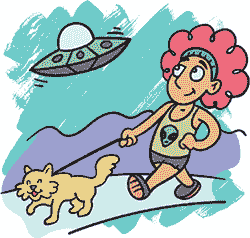
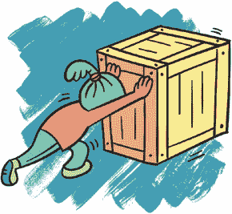
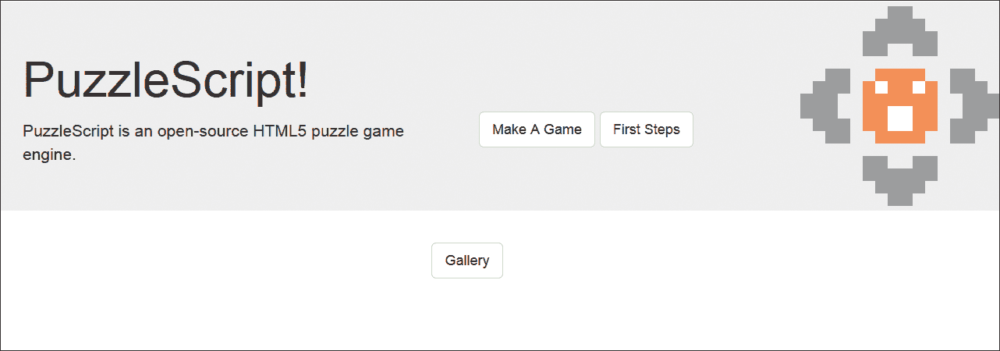
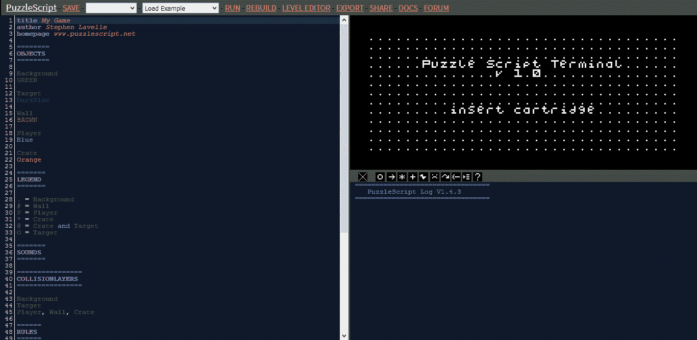
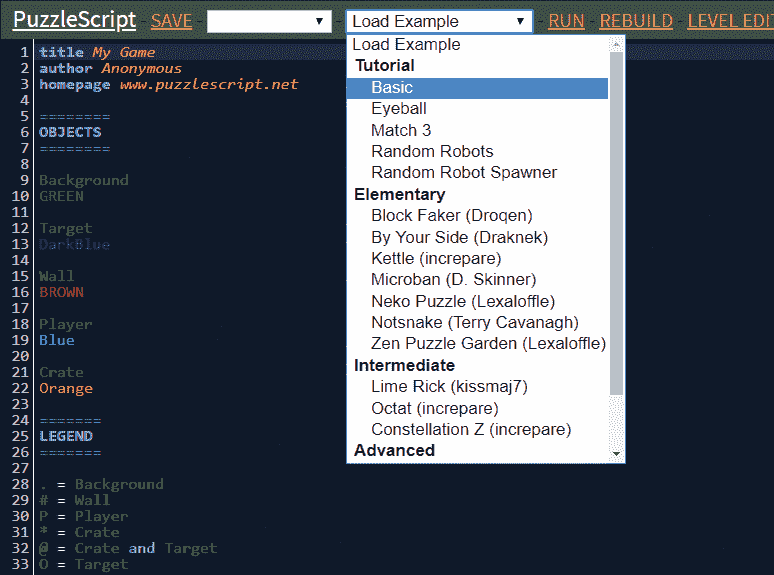
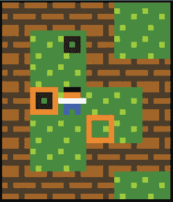
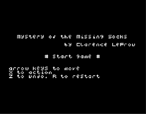
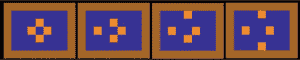
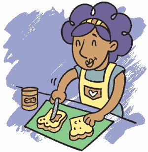

## PuzzleScript 基础

在本章中，你将通过一个简单的谜题游戏学习 PuzzleScript 的基本组成部分。当一个游戏是回合制、空间性的并且可解时，我们就称它为 *解谜游戏*。

*回合制* 意味着游戏中的事件或动作是一次发生一个，就像在 *跳棋* 游戏中一样。玩家进行一次移动，观察棋盘，思考接下来该做什么，然后再进行下一次移动。思考和计划通常是解谜游戏的重要组成部分。



*空间性* 意味着物体在屏幕上的位置是很重要的。在一个经典的解谜游戏 *仓库番* 中，玩家尝试将箱子推到特殊的面板上。箱子会挡住其他箱子，因此玩这个游戏需要仔细思考所有箱子的位置以及该如何移动它们。

*可解* 意味着游戏中的每一关都有一个获胜条件。例如，当玩家将所有箱子推到面板上时，在 *仓库番* 游戏中他们就解开了谜题！然后他们进入下一关。

也有一些方式可以制作不是 *回合制* 的 PuzzleScript 游戏，或者 *不* 要求物体处于特定位置，或 *不* 需要玩家解决谜题。但用 PuzzleScript 制作的最简单游戏是包含这三个特点的游戏。PuzzleScript 的示范游戏就是一个基本的例子，因此它是学习 PuzzleScript 的好方式。

### 开始使用 PuzzleScript

在网页浏览器中打开 *[`www.puzzlescript.net/`](https://www.puzzlescript.net/)*，你应该看到类似这样的界面。



点击 **Make A Game** 按钮，应该能看到类似这样的界面：



这就是 PuzzleScript！左侧的框是你的游戏代码，右侧的框，**Puzzle Script Terminal – Insert Cartridge**，是你的游戏将出现的地方。

我们来看看一个示范游戏。点击屏幕顶部的 **Load Example** 下拉菜单，然后选择 **Basic**。这个示范游戏是由 PuzzleScript 的创始人 Stephen Lavelle 制作的。



点击屏幕顶部的 **Run** 按钮。游戏的标题画面，**由 Stephen Lavelle 制作的简单推箱子游戏**，应该会出现在右侧的窗口中。这个简单的游戏是学习 PuzzleScript 的一个好起点。

按下键盘上的 **X** 键开始游戏。如果游戏没有开始，试着点击标题画面并再次按下 **X** 键。当游戏开始时，你应该看到这个画面。



尝试玩这个游戏！你是那个小人。游戏的目标是将所有橙色盒子推到黑色方块上。使用键盘上的箭头键移动人物，并通过碰到橙色盒子将其推开。这个谜题有点棘手，如果你无法解开也不必担心！只需玩一会儿，感受一下 PuzzleScript 游戏的感觉。

### PuzzleScript 的组成部分

屏幕左侧的彩色文本就是游戏的实际*脚本*，它告诉游戏该做什么。让我们快速浏览一下不同的部分。

#### 添加基本信息

在脚本的最顶部，你会看到游戏的基本信息：

```
title Simple Block Pushing Game
author Stephen Lavelle
homepage www.puzzlescript.net
```

当你运行游戏时，你会看到`title`显示为“简单方块推送游戏”，并且`author`，Stephen Lavelle，显示在下面。如果你更改了`title`或`author`的名字，游戏的标题画面也会相应改变。例如，要将你的游戏命名为*失踪的袜子之谜*，并将作者改为*Clarence LeFrou*，只需将`title`旁边的文本替换为`失踪的袜子之谜`，将`author`旁边的文本替换为`Clarence LeFrou`，就像这样：

```
title Mystery of the Missing Socks
author Clarence LeFrou
homepage www.puzzlescript.net
```

现在当你再次运行游戏时，你应该能看到这个。



现在我们来讲解对象。

**注意：** `homepage`只是让你在分享游戏时在页面底部放置一个链接。你可以保持原样，或者如果你有自己的网站，也可以改成你的网站。

#### 创建对象

对象是你 PuzzleScript 游戏中最重要的部分之一！它们是构成你游戏的所有小元素——所有会动或不会动并且会被其他物体推动的东西。

要向游戏中添加一个新对象，你需要将它放入游戏代码的`OBJECTS`部分。以下是*简单方块推送游戏*的`OBJECTS`部分：

```
========
OBJECTS
========
Background
LIGHTGREEN GREEN
11111
01111
11101
11111
10111
Target
DarkBlue
.....
.000.
.0.0.
.000.
.....
Wall
BROWN DARKBROWN
00010
11111
01000
11111
00010
Player
Black Orange White Blue
.000.
.111.
22222
.333.
.3.3.
Crate
Orange Yellow
00000
0...0
0...0
0...0
00000
```

正如你所看到的，*简单方块推送游戏*有五个对象：`背景`、`目标`、`墙壁`、`玩家`和`箱子`。

每个对象都被分配了一个名称（`背景`、`目标`等），这样 PuzzleScript 就知道你在引用它，并且有一个描述说明它的外观。颜色列表告诉 PuzzleScript 一个对象应该是什么颜色，颜色后面的数字则告诉 PuzzleScript 该将这些颜色放置在哪里。例如，玩家的颜色是黑色、橙色、白色和蓝色。这些颜色使得玩家有黑色的头发、橙色的皮肤、白色的衬衫和蓝色的裤子。

稍后，我们会绘制自己的图片来代表游戏中的所有对象。但现在，让我们先做一个简单的操作：将绿色的`背景`改为紫色或粉色。然后点击**重新构建**，看看游戏发生了怎样的变化。

#### 在图例中定义对象

脚本的下一部分是图例，它类似于地图上的图例，解释了某个符号代表了山脉或森林等。

在你的游戏中，你将创建关卡，告诉 PuzzleScript 所有对象应该放置的位置。关卡以文本字符保存，如字母、数字和符号，如`.`、`#`、`P`等。`LEGEND`部分中的项目告诉 PuzzleScript 哪个符号代表哪个对象。这是*简单方块推送游戏*的`LEGEND`部分：

```
=======
LEGEND
=======
. = Background
# = Wall
P = Player
* = Crate
@ = Crate and Target
O = Target
```

你可以选择任何键盘符号来代表任何对象，包括墙壁和地板。但最好选择那些在你稍后查看关卡时，能让你一眼就辨认出关卡内容的符号。我通常选择`#`代表墙壁，因为它密集且方形，选择`.`作为背景，因为它是与空白空间最接近的符号。对于其他对象，像`P`代表`Player`这样的记忆方式也很容易。

这是*简单方块推动游戏*的第一个关卡：

```
=======
LEVELS
=======
####..
#.O#..
#..###
#@P..#
#..*.#
#..###
####..
```

判断墙壁的形状以及所有对象的位置应该不难。`LEGEND`告诉我们字母`P`是玩家；星号（`*`）是橙色的箱子，`O`是玩家试图将箱子推到的目标。`@`符号代表一个结合的箱子和目标（你已将箱子推到目标上），这告诉 PuzzleScript 将这两个对象放在同一个空间里。

#### 添加声音

游戏中的所有声音都放在`SOUNDS`部分。在这个示例游戏中，只有一个声音，那就是推动箱子的声音。

```
=======
SOUNDS
=======
Crate MOVE 36772507
```

数字`36772507`代表播放的声音，`Crate MOVE`告诉 PuzzleScript 将该声音与什么动作关联。当你点击这些数字时，你会听到声音播放。

#### 设置碰撞层

代码中的`COLLISIONLAYERS`部分告诉 PuzzleScript 哪些对象会碰撞，哪些对象位于其他对象之上。PuzzleScript 通过在*层*中移动对象来管理碰撞。*简单方块推动游戏*有三个碰撞层。

```
================
COLLISIONLAYERS
================
Background
Target
Player, Wall, Crate
```

为了可视化这些层，想象你的平面屏幕有三个维度，从前到后延伸。`Background`层是最远离屏幕的层。`Target`层（黑色方块）是位于`Background`层前面的中间层。最前面的层包含了玩家、墙壁和箱子。

由于玩家、墙壁和箱子位于同一层，玩家不能穿过墙壁或箱子，尽管他们可以推动箱子。箱子不能穿过墙壁或其他箱子：如果你尝试将一个箱子推过另一个箱子，它会被阻挡而无法移动。例如，在*简单方块推动游戏*的第二关中，如果玩家尝试向下推下面的箱子，它将不会移动，因为它被另一个箱子挡住了。

当你创建新对象时，需要将它们添加到`COLLISIONLAYERS`部分。大多数对象可能会和玩家位于同一层。但有时你可能希望一些对象与其他对象共享同一空间，比如箱子和目标。

#### 编写规则

在`RULES`部分，我们描述了游戏中应该发生的事情——对象之间是如何互动的。*简单方块推动游戏*只包含一个规则，描述了玩家如何推动箱子：

```
======
RULES
======
[ > Player | Crate ] -> [ > Player | > Crate ]
```

箭头（`->`）左边是游戏正在寻找的对象。如果游戏从左到右找到这些对象（玩家在箱子旁边），则游戏会将这些对象转换为箭头右边的对象（玩家在箱子旁边）。区别在于，在第一种情况下，玩家正在移动。在第二种情况下，玩家和箱子都在移动：也就是说，玩家在推动箱子。

规则是说，如果第一组对象存在，就将其转换为第二组对象。将这个转换成那个：`[` this `] -> [` that `]`。

你使用方括号（`[]`）将一组对象括起来，使用竖线（`|`）分隔方括号中的对象。例如，以下这一行表示玩家正站在箱子旁边。

```
 [ Player | Crate ]
```

但是 *简单方块推箱子游戏* 中的规则是这样的：

```
 [ > Player | Crate ]
```

在这里，大于号（`>`）表示玩家正在尝试移动。`>` 指向那个箱子，这意味着玩家正在朝着箱子移动。当玩家朝箱子移动时，箱子也应该移动，因为玩家在推动它。所以，要推动箱子，你需要把 `Crate` 改成 `> Crate`，表示它和玩家一起朝着相同的方向移动。

所有这些都发生在任何对象实际移动之前。`>` 真正的意思是“我想要移动”。所以一个 `> Player` 和一个 `> Crate` 会同时移动。这有点让人困惑，我们一步步来解析。

每次你按下 *简单方块推箱子游戏* 中的箭头键时，都会发生以下情况：

1.  `Player` 会朝着箭头键的方向移动，将 `Player` 变成 `> Player`。

1.  PuzzleScript 会检查是否能找到类似于 [`> Player | Crate`] 的对象；也就是说，玩家试图进入一个箱子。如果找到了匹配项，它会将这些对象转换为规则中指定的内容，在这种情况下是 `[ > Player | > Crate ]`。

1.  所有标记为 `>` 的对象都会尝试朝那个方向移动。如果它们没有被其他东西挡住，它们应该会移动。如果被挡住，它们应该停在原地。

请记住，PuzzleScript 规则是会检查每个方向的。所以即使以下规则是从左到右写的，它仍然会允许玩家从上面、下面或左边推箱子。

```
[ > Player | Crate ] -> [ > Player | > Crate ]
```

你可以把这个规则理解为“如果玩家正朝着箱子移动，就让箱子朝着相同的方向移动。”这个规则并没有指定方向。



#### 设置胜利条件

PuzzleScript 游戏中的 `WINCONDITIONS` 部分解释了玩家必须做什么才能赢得关卡并进入下一关。这是 *简单方块推箱子游戏* 的胜利条件：

```
==============
WINCONDITIONS
==============
All Target on Crate
```

这个条件意味着当所有目标空间（黑色方块）都被箱子占据时，玩家就赢得了关卡！为什么不写成 `All Crate on Target` 呢？好吧，这两者之间有一个微妙的区别。

+   `All Target on Crate`意味着每个目标都必须有一个对应的箱子。

+   `All Crate on Target`意味着每个箱子必须有一个对应的目标。

假设箱子的数量多于目标的数量。那么，在`All Target on Crate`的情况下，如果每个目标上都有一个箱子，那么即使有些箱子被剩下，胜利条件也会满足。但如果胜利条件是`All Crate on Target`，那么每个箱子必须放在自己的目标上。在这种特定情况下，目标的数量不足以满足这个胜利条件，因此玩家永远也无法赢得游戏。

其他游戏可能有不同的胜利条件。以下是一些有效的胜利条件示例：

+   **没有糖果：** 一个你试图吃掉所有糖果的游戏。

+   **一些紫色：** 一个你试图混合颜色颜料以创造新颜色的游戏。

+   **狗窝里没有小狗：** 这是一个你试图带每只狗去散步的游戏。

**注意：** 要了解更多关于 PuzzleScript 胜利条件的信息，请阅读官方的 PuzzleScript 文档，网址是 *[`www.puzzlescript.net/Documentation/documentation.html`](https://www.puzzlescript.net/Documentation/documentation.html)*。点击屏幕顶部的 **Docs**，然后点击 **PuzzleScript 文件鸟瞰图 ▸ 胜利条件**。

#### 制作关卡

你游戏中的关卡位于你的 PuzzleScript 脚本的`LEVELS`部分，以符号的形式，一个接一个地排列。（幸运的是，你不需要手动输入所有的关卡；PuzzleScript 有一个很棒的关卡编辑器，你将在第二章中学习到它。）

*简单的推箱子游戏*有两个关卡，玩家会按列表中出现的顺序看到它们：

```
=======
LEVELS
=======
####..
#.O#..
#..###
#@P..#
#..*.#
#..###
####..
######
#....#
#.#P.#
#.*@.#
#.O@.#
#....#
######
```

回想一下前面提到的`LEGEND`部分，`#`代表墙壁，`.`代表空地，`P`是玩家，`*`是箱子，`O`是目标，`@`是放在目标上的箱子。`LEGEND`部分的内容告诉 PuzzleScript 如何“读取”这个关卡并将其转换为一个可以玩的游戏，其中所有物体都放在正确的位置。

在创建关卡时，使用关卡编辑器。但确保所有完成的关卡以文本形式出现在`LEVELS`部分，这样它们才能包含在你的游戏中。（我们将在第二章中进一步讨论关卡。）



### 你学到了什么

呼，终于！现在你已经了解了 PuzzleScript 游戏的基本组成部分以及 PuzzleScript 的工作原理，我们休息一下吧。深呼吸，摸摸你的猫，去散散步，或者做个三明治。你甚至可以通过点击页面顶部的“加载示例”下拉菜单来尝试玩一些 PuzzleScript 内置的其他示例游戏。

记得休息是制作游戏非常重要的一部分！如果你一直不间断地工作，你会感到疲劳和沮丧，什么也做不成！所以一定要确保时不时离开电脑休息一下。我总是在离开电脑时得到游戏的最佳创意。

休息回来后，我们将从头开始制作一个名为*放牧猫咪*的游戏！
